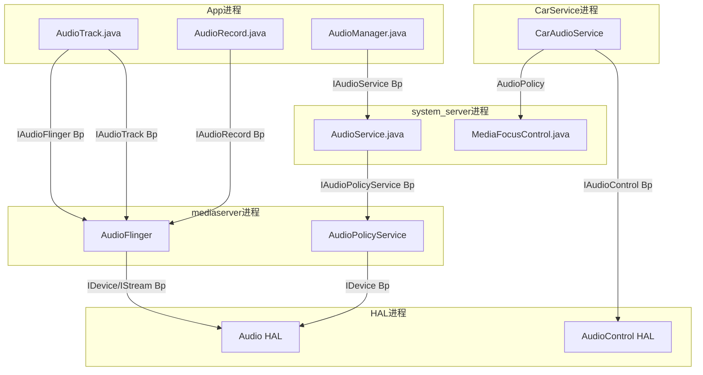
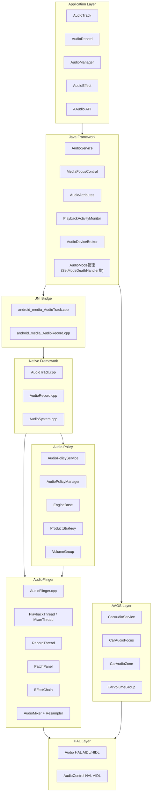
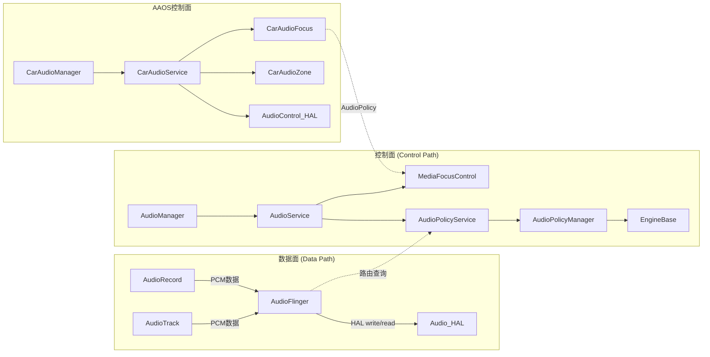
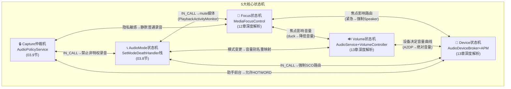

# 第一篇：架构总论

> [← 返回导航](README.md) | [下一篇：Application Layer →](02_Application_Layer.md)

---

## 1.1 设计哲学

AOSP Audio系统的设计遵循三大核心原则：

### 1.1.1 分层解耦：控制面与数据面分离

这是AOSP Audio最根本的架构决策。**AudioFlinger（数据面）**与**AudioPolicyService（控制面）**分离运行在不同线程，各自独立演进：

```
┌─────────────────────────────────────────────────────┐
│  Application Layer    → 只关心API语义，不关心硬件     │
├─────────────────────────────────────────────────────┤
│  Java Framework       → 策略管理，不关心数据流         │
├─────────────────────────────────────────────────────┤
│  Native Framework     → 数据流管理，不关心硬件差异     │
├─────────────────────────────────────────────────────┤
│  Audio Policy Engine  → 路由决策，可插拔引擎          │
├─────────────────────────────────────────────────────┤
│  Audio Engine (AF)    → 混音/采集，不关心策略         │
├─────────────────────────────────────────────────────┤
│  HAL                  → 硬件抽象，Vendor可替换         │
└─────────────────────────────────────────────────────┘
```

**为什么这样设计？**

| 设计决策 | 原因 | 好处 |
|----------|------|------|
| AF与APS分离 | 数据流与策略决策生命周期不同 | AF持续运行不因策略变更中断；策略可热替换 |
| Engine可插拔 | 不同产品路由策略差异大（手机vs车机vsTV） | Vendor继承`EngineBase`实现自定义引擎 |
| HAL双轨(HIDL+AIDL) | 向后兼容+技术演进 | 老HAL无需重写；新HAL用AIDL更高效 |
| Binder IPC隔离 | 进程隔离保证稳定性 | App崩溃不影响系统音频服务 |

### 1.1.2 Binder IPC隔离：跨进程只依赖接口

所有跨进程通信通过Binder完成，每层只依赖接口不依赖实现：



| Binder接口 | 服务端 | 客户端 | 用途 |
|------------|--------|--------|------|
| `IAudioFlinger` | AudioFlinger | AudioTrack/AudioRecord | 创建Track/Record、打开输出/输入流 |
| `IAudioTrack` | TrackHandle | Native AudioTrack | 播放控制(start/stop/write/flush) |
| `IAudioRecord` | RecordHandle | Native AudioRecord | 采集控制(start/stop/read) |
| `IAudioPolicyService` | AudioPolicyService | AudioSystem | 路由查询、设备管理、音量控制 |
| `IAudioControl` | AudioControl HAL | CarAudioService | 车载焦点/音量/静音回调 |

### 1.1.3 共享内存零拷贝：音频数据不经过Binder

音频PCM数据量大、实时性要求高，不能走Binder序列化。AOSP采用共享内存+FIFO方式：

```
App进程 (Producer)              AudioFlinger进程 (Consumer)
┌──────────────────┐            ┌───────────────────┐
│ AudioTrack        │            │  PlaybackThread    │
│   write(data)     │            │    prepareTracks_l │
│     ↓             │            │      ↓             │
│   FIFO写入 ───────cblk────→   │    mixer读取       │
│   更新u/int       │  共享内存   │    检查u/int       │
└──────────────────┘            └───────────────────┘
```

- **audio_track_cblk_t**：共享内存控制块，位于共享内存头部
  - `user`：App写入位置
  - `server`：AudioFlinger读取位置
  - `frameCount`：buffer总大小
  - `flushCount`：flush操作计数（处理 discontinuity）
- **NOP模式**：DirectOutputThread/OffloadThread场景，App的buffer直接映射到HAL输出，AudioFlinger不做混音处理，实现零拷贝

---

## 1.2 全栈分层架构图



---

## 1.3 模块依赖关系图



**关键洞察**：数据面和控制面只在"路由查询"和"焦点仲裁"两个点交叉，其余完全独立。这使得：
- 修改路由策略不需要改动AudioFlinger
- 修改混音逻辑不需要改动AudioPolicy
- AAOS可以在不修改底层的情况下替换焦点策略

---

## 1.4 五大核心状态机总览

Android音频系统由**5大核心状态机**驱动，它们相互关联、协同工作：



| 状态机 | 管理类 | 核心操作 | 章节深入 |
|--------|--------|---------|---------|
| Focus | MediaFocusControl | requestAudioFocus / abandonAudioFocus | [12_Audio_Focus_Deep_Dive](12_Audio_Focus_Deep_Dive.md) |
| Volume | AudioService + VolumeController | adjustVolume / setStreamVolume | [13_Volume_Device_Deep_Dive](13_Volume_Device_Deep_Dive.md) |
| Device | AudioDeviceBroker + AudioPolicyManager | setWiredDeviceConnectionState / createAudioPatch | [13_Volume_Device_Deep_Dive](13_Volume_Device_Deep_Dive.md) |
| AudioMode | AudioService (SetModeDeathHandler) | setMode / setCommunicationDevice | [03_Java_Framework_Layer](03_Java_Framework_Layer.md) |
| Capture仲裁 | AudioPolicyService (updateActiveClients_l) | setAppState_l / canCaptureOutput / privacySensitive | [03_Java_Framework_Layer](03_Java_Framework_Layer.md) |

---

## 1.5 关键源码目录速查

| 层级 | 目录 | 核心文件 |
|------|------|----------|
| Java API | `frameworks/base/media/java/android/media/` | AudioTrack.java, AudioRecord.java, AudioManager.java |
| Java Effects | `frameworks/base/media/java/android/media/audiofx/` | AudioEffect.java, Equalizer.java, BassBoost.java |
| System Service | `frameworks/base/services/core/java/com/android/server/audio/` | AudioService.java, MediaFocusControl.java |
| JNI | `frameworks/base/core/jni/` | android_media_AudioTrack.cpp, android_media_AudioRecord.cpp |
| Native Client | `frameworks/av/media/libaudioclient/` | AudioTrack.cpp, AudioRecord.cpp, AudioSystem.cpp |
| AudioFlinger | `frameworks/av/services/audioflinger/` | AudioFlinger.cpp, Threads.cpp, Effects.cpp, PatchPanel.cpp |
| AudioPolicy | `frameworks/av/services/audiopolicy/` | AudioPolicyService.cpp, AudioPolicyManager.cpp |
| Policy Engine | `frameworks/av/services/audiopolicy/engine/` | EngineBase.cpp, ProductStrategy.cpp, VolumeGroup.cpp |
| Audio HAL AIDL | `hardware/interfaces/audio/aidl/` | IModule.aidl, IStreamOut.aidl, IStreamIn.aidl |
| Audio HAL HIDL | `hardware/interfaces/audio/` | IDevicesFactory.hal, IStreamOut.hal |
| AudioControl HAL | `hardware/interfaces/automotive/audiocontrol/` | IAudioControl.aidl |
| Car Audio | `packages/services/Car/service/src/com/android/car/audio/` | CarAudioService.java, CarAudioFocus.java |
| Audio Config | `frameworks/av/services/audiopolicy/config/` | default_audio_policy_configuration.xml |

---

## 1.6 Android Audio版本演进

| 版本 | 年份 | 关键变更 |
|------|------|----------|
| 1.5 | 2009 | AudioTrack/AudioRecord基础API |
| 2.2 | 2010 | AudioEffect框架 |
| 4.1 | 2012 | FastMixer低延迟路径 |
| 4.4 | 2013 | 重新设计AudioPolicyManager |
| 5.0 | 2014 | AudioAttributes替代stream type；Project Volta音频优化 |
| 6.0 | 2015 | MMAP低延迟模式 |
| 7.0 | 2016 | 多声道PCM直通；Audio HAL 6.0 |
| 8.0 | 2017 | AAudio API；AudioFocusRequest；Treble HAL(HIDL) |
| 9.0 | 2018 | AudioPlaybackConfiguration；VolumeGroup |
| 10 | 2019 | Audio HAL 7.0；CapturePreset合规 |
| 11 | 2020 | AudioProductStrategy API；麦克风隐私指示 |
| 12 | 2021 | Spatializer API；Audio HAL AIDL；LE Audio |
| 13 | 2022 | VolumeInfo API；LE Audio正式支持 |
| 14 | 2023 | SoundDose听力保护；AudioControl HAL AIDL v3；BitPerfectThread(AAOS) |

---

> [← 返回导航](README.md) | [下一篇：Application Layer →](02_Application_Layer.md)