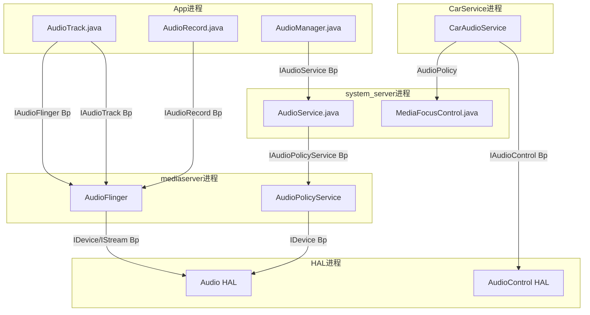
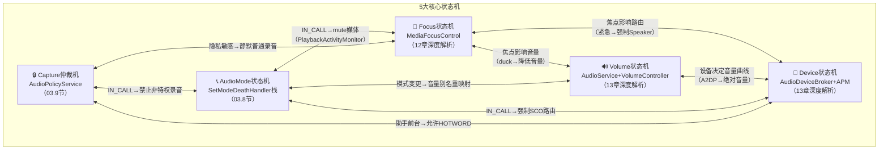
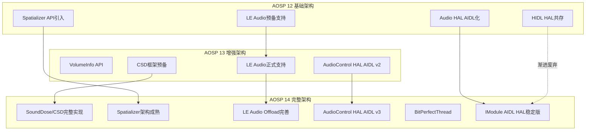
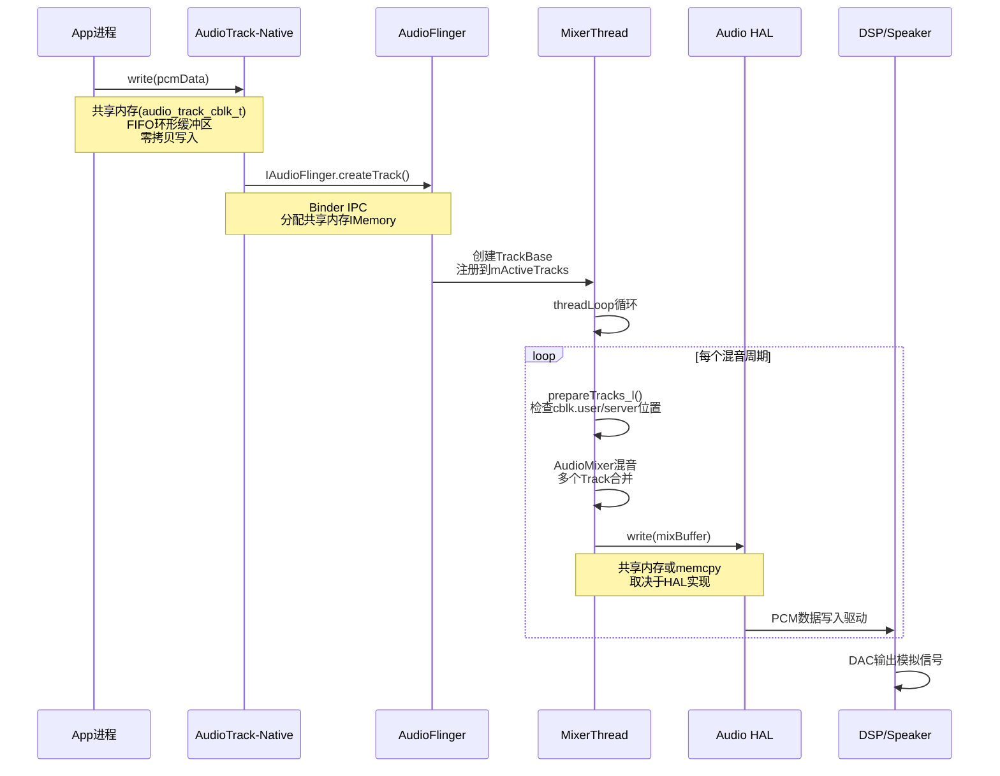
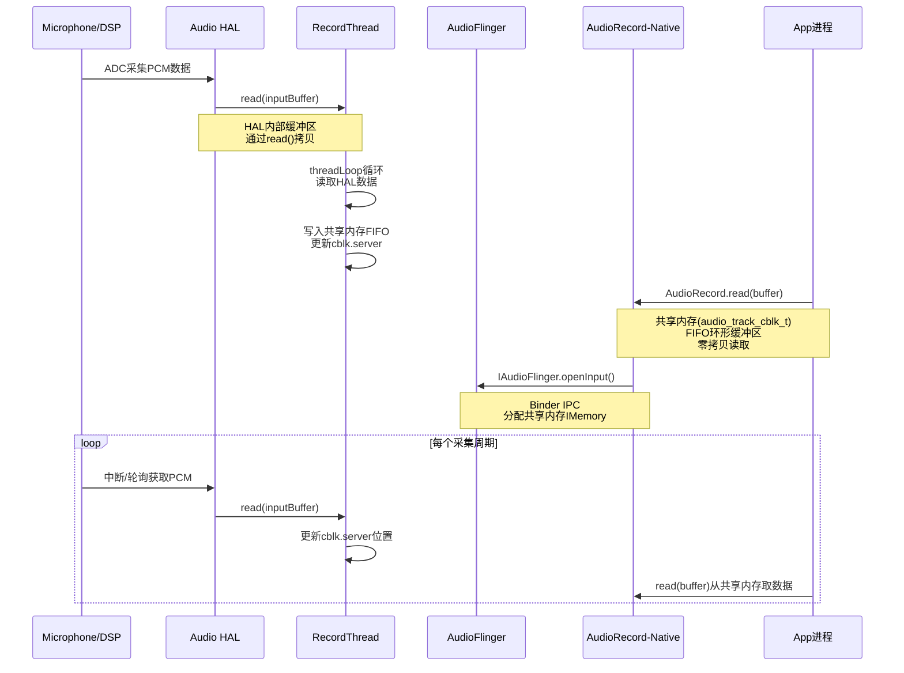
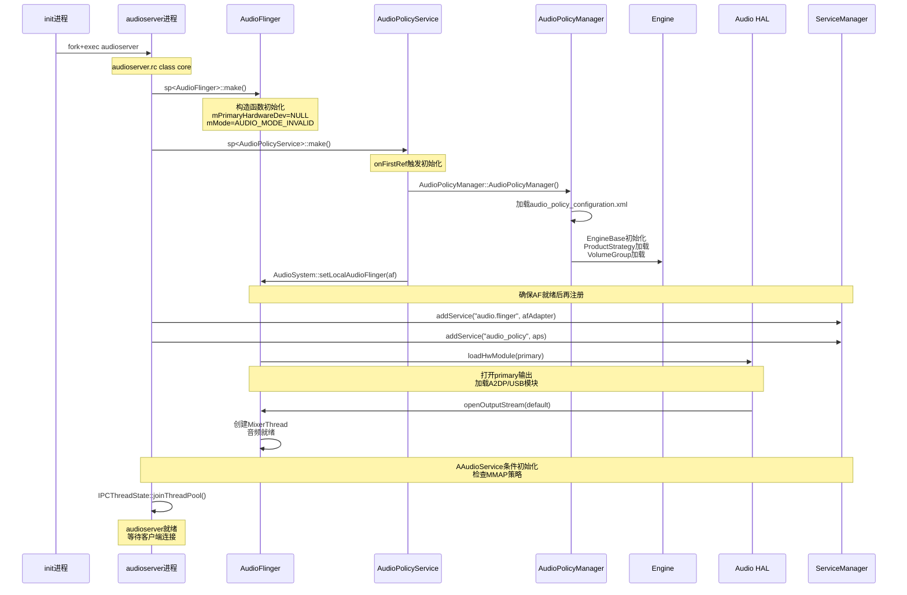
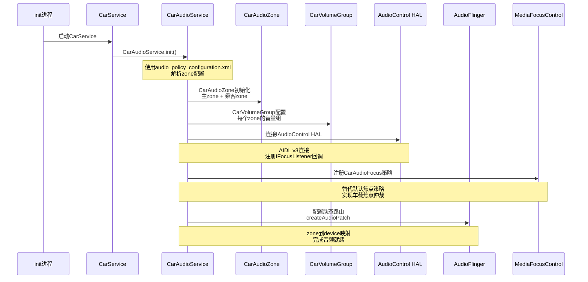

# 第一篇：架构总论

> [← 返回导航](README.md) | [下一篇：Application Layer →](02_Application_Layer.md)

---

## 1.1 设计哲学

### 1.1.1 分层解耦：控制面与数据面分离

这是AOSP Audio最根本的架构决策。**AudioFlinger（数据面）**与**AudioPolicyService（控制面）**分离运行在不同线程，各自独立演进：

```
┌─────────────────────────────────────────────────────┐
│  Application Layer    → 只关心API语义，不关心硬件     │
├─────────────────────────────────────────────────────┤
│  Java Framework       → 策略管理，不关心数据流         │
├─────────────────────────────────────────────────────┤
│  Native Framework     → 数据流管理，不关心硬件差异     │
├─────────────────────────────────────────────────────┤
│  Audio Policy Engine  → 路由决策，可插拔引擎          │
├─────────────────────────────────────────────────────┤
│  Audio Engine (AF)    → 混音/采集，不关心策略         │
├─────────────────────────────────────────────────────┤
│  HAL                  → 硬件抽象，Vendor可替换         │
└─────────────────────────────────────────────────────┘
```

**为什么这样设计？**

| 设计决策 | 原因 | 好处 |
|----------|------|------|
| AF与APS分离 | 数据流与策略决策生命周期不同 | AF持续运行不因策略变更中断；策略可热替换 |
| Engine可插拔 | 不同产品路由策略差异大（手机vs车机vsTV） | Vendor继承`EngineBase`实现自定义引擎 |
| HAL双轨(HIDL+AIDL) | 向后兼容+技术演进 | 老HAL无需重写；新HAL用AIDL更高效 |
| Binder IPC隔离 | 进程隔离保证稳定性 | App崩溃不影响系统音频服务 |

### 1.1.2 Binder IPC隔离：跨进程只依赖接口

所有跨进程通信通过Binder完成，每层只依赖接口不依赖实现：



| Binder接口 | 服务端 | 客户端 | 用途 |
|------------|--------|--------|------|
| `IAudioFlinger` | AudioFlinger | AudioTrack/AudioRecord | 创建Track/Record、打开输出/输入流 |
| `IAudioTrack` | TrackHandle | Native AudioTrack | 播放控制(start/stop/write/flush) |
| `IAudioRecord` | RecordHandle | Native AudioRecord | 采集控制(start/stop/read) |
| `IAudioPolicyService` | AudioPolicyService | AudioSystem | 路由查询、设备管理、音量控制 |
| `IAudioControl` | AudioControl HAL | CarAudioService | 车载焦点/音量/静音回调 |

### 1.1.3 共享内存零拷贝：音频数据不经过Binder

音频PCM数据量大、实时性要求高，不能走Binder序列化。AOSP采用共享内存+FIFO方式：

```
App进程 (Producer)              AudioFlinger进程 (Consumer)
┌──────────────────┐            ┌───────────────────┐
│ AudioTrack        │            │  PlaybackThread    │
│   write(data)     │            │    prepareTracks_l │
│     ↓             │            │      ↓             │
│   FIFO写入 ───────cblk────→   │    mixer读取       │
│   更新u/int       │  共享内存   │    检查u/int       │
└──────────────────┘            └───────────────────┘
```

- **audio_track_cblk_t**：共享内存控制块，位于共享内存头部
  - `user`：App写入位置
  - `server`：AudioFlinger读取位置
  - `frameCount`：buffer总大小
  - `flushCount`：flush操作计数（处理 discontinuity）
- **NOP模式**：DirectOutputThread/OffloadThread场景，App的buffer直接映射到HAL输出，AudioFlinger不做混音处理，实现零拷贝

---

## 1.2 全栈分层架构图


---

## 1.3 模块依赖关系图


**关键洞察**：数据面和控制面只在"路由查询"和"焦点仲裁"两个点交叉，其余完全独立。这使得：
- 修改路由策略不需要改动AudioFlinger
- 修改混音逻辑不需要改动AudioPolicy
- AAOS可以在不修改底层的情况下替换焦点策略

---

## 1.4 五大核心状态机总览

Android音频系统由**5大核心状态机**驱动，它们相互关联、协同工作：



| 状态机 | 管理类 | 核心操作 | 章节深入 |
|--------|--------|---------|---------|
| Focus | MediaFocusControl | requestAudioFocus / abandonAudioFocus | [12_Audio_Focus_Deep_Dive](12_Audio_Focus_Deep_Dive.md) |
| Volume | AudioService + VolumeController | adjustVolume / setStreamVolume | [13_Volume_Device_Deep_Dive](13_Volume_Device_Deep_Dive.md) |
| Device | AudioDeviceBroker + AudioPolicyManager | setWiredDeviceConnectionState / createAudioPatch | [13_Volume_Device_Deep_Dive](13_Volume_Device_Deep_Dive.md) |
| AudioMode | AudioService (SetModeDeathHandler) | setMode / setCommunicationDevice | [03_Java_Framework_Layer](03_Java_Framework_Layer.md) |
| Capture仲裁 | AudioPolicyService (updateActiveClients_l) | setAppState_l / canCaptureOutput / privacySensitive | [03_Java_Framework_Layer](03_Java_Framework_Layer.md) |

---

## 1.5 关键源码目录速查

| 层级 | 目录 | 核心文件 |
|------|------|----------|
| Java API | `frameworks/base/media/java/android/media/` | AudioTrack.java, AudioRecord.java, AudioManager.java |
| Java Effects | `frameworks/base/media/java/android/media/audiofx/` | AudioEffect.java, Equalizer.java, BassBoost.java |
| System Service | `frameworks/base/services/core/java/com/android/server/audio/` | AudioService.java, MediaFocusControl.java |
| JNI | `frameworks/base/core/jni/` | android_media_AudioTrack.cpp, android_media_AudioRecord.cpp |
| Native Client | `frameworks/av/media/libaudioclient/` | AudioTrack.cpp, AudioRecord.cpp, AudioSystem.cpp |
| AudioFlinger | `frameworks/av/services/audioflinger/` | AudioFlinger.cpp, Threads.cpp, Effects.cpp, PatchPanel.cpp |
| AudioPolicy | `frameworks/av/services/audiopolicy/` | AudioPolicyService.cpp, AudioPolicyManager.cpp |
| Policy Engine | `frameworks/av/services/audiopolicy/engine/` | EngineBase.cpp, ProductStrategy.cpp, VolumeGroup.cpp |
| Audio HAL AIDL | `hardware/interfaces/audio/aidl/` | IModule.aidl, IStreamOut.aidl, IStreamIn.aidl |
| Audio HAL HIDL | `hardware/interfaces/audio/` | IDevicesFactory.hal, IStreamOut.hal |
| AudioControl HAL | `hardware/interfaces/automotive/audiocontrol/` | IAudioControl.aidl |
| Car Audio | `packages/services/Car/service/src/com/android/car/audio/` | CarAudioService.java, CarAudioFocus.java |
| Audio Config | `frameworks/av/services/audiopolicy/config/` | default_audio_policy_configuration.xml |

---

## 1.6 Android Audio版本演进

| 版本 | 年份 | 关键变更 |
|------|------|----------|
| 1.5 | 2009 | AudioTrack/AudioRecord基础API |
| 2.2 | 2010 | AudioEffect框架 |
| 4.1 | 2012 | FastMixer低延迟路径 |
| 4.4 | 2013 | 重新设计AudioPolicyManager |
| 5.0 | 2014 | AudioAttributes替代stream type；Project Volta音频优化 |
| 6.0 | 2015 | MMAP低延迟模式 |
| 7.0 | 2016 | 多声道PCM直通；Audio HAL 6.0 |
| 8.0 | 2017 | AAudio API；AudioFocusRequest；Treble HAL(HIDL) |
| 9.0 | 2018 | AudioPlaybackConfiguration；VolumeGroup |
| 10 | 2019 | Audio HAL 7.0；CapturePreset合规 |
| 11 | 2020 | AudioProductStrategy API；麦克风隐私指示 |
| 12 | 2021 | Spatializer API；Audio HAL AIDL；LE Audio |
| 13 | 2022 | VolumeInfo API；LE Audio正式支持 |
| 14 | 2023 | SoundDose听力保护；AudioControl HAL AIDL v3；BitPerfectThread(AAOS) |

---

## 1.7 AOSP14 Audio新特性架构演进

AOSP14在音频架构上引入了多项重要特性，涵盖听力保护、空间音频、LE Audio、HAL接口升级和车载BitPerfect等领域。

### 1.7.1 SoundDose/CSD听力保护架构

AOSP14引入了**CSD（Common Sound Dose）**框架，实现WHO推荐的听力保护标准：

- [`SoundDoseManager`](frameworks/av/services/audioflinger/sounddose/SoundDoseManager.h:35) 运行在AudioFlinger进程中，负责MEL（Maximum Exposure Level）计算
- [`MelReporter`](frameworks/av/services/audioflinger/MelReporter.h:32) 作为桥梁，将SoundDose数据上报至AudioService
- [`SoundDoseHelper`](frameworks/base/services/core/java/com/android/server/audio/SoundDoseHelper.java:75) 在Java层管理CSD回调与安全警告触发
- HAL层通过[`ISoundDose`](hardware/interfaces/audio/aidl/android/hardware/audio/core/sounddose/ISoundDose.aidl) AIDL接口与框架对接

**架构要点**：SoundDoseManager同时支持框架侧MEL计算和HAL侧MEL上报，由`csd_enabled`属性控制模式切换。

> 深度解析 → [13_Volume_Device_Deep_Dive - SoundDose/CSD章节](13_Volume_Device_Deep_Dive.md)

### 1.7.2 Spatializer空间音频架构

空间音频从AOSP12引入API，到AOSP14架构趋于成熟：

- [`Spatializer`](frameworks/base/media/java/android/media/Spatializer.java:51) 提供Java API，通过`ISpatializer` Binder接口与AudioFlinger通信
- [`SpatializerThread`](frameworks/av/services/audioflinger/Threads.h:1836) 继承自MixerThread，专门处理空间化音频混音
- 支持Head Tracking传感器数据输入，实现动态声场调整
- AudioPolicy根据设备能力（`FEATURE_AUDIO_SPATIALIZER`）自动路由到SpatializerThread

> 深度解析 → [07_Effects_Framework - Spatializer章节](07_Effects_Framework.md)

### 1.7.3 LE Audio架构

LE Audio（Low Energy Audio）是蓝牙音频的重大演进：

- [`BluetoothLeAudio`](packages/modules/Bluetooth/system/bta/include/bta_le_audio_api.h) Java API提供设备管理与组控制
- [`LeAudioOffloadAudioProvider`](hardware/interfaces/bluetooth/audio/aidl/default/LeAudioOffloadAudioProvider.cpp) 处理LE Audio Offload模式
- [`LeAudioHalVerifier`](packages/modules/Bluetooth/system/bta/include/bta_le_audio_api.h:27) 校验HAL层LE Audio能力
- AudioPolicy新增LE Audio设备类型（`DEVICE_OUT_BLE_HEADSET`等）和路由策略
- 支持Broadcast Source/Sink和Unicast双模式

> 深度解析 → [14_Bluetooth_Audio - LE Audio章节](14_Bluetooth_Audio.md)

### 1.7.4 AudioControl HAL AIDL v3

车载音频控制接口升级到AIDL v3版本：

- [`IAudioControl`](hardware/interfaces/automotive/audiocontrol/aidl/android/hardware/automotive/audiocontrol/IAudioControl.aidl:62) 新增`onAudioFocusChangeWithMetaData`替代v1的`onAudioFocusChange`
- 新增`IAudioGainCallback`支持HAL主动请求音量变更
- 新增`setBalanceTowardRight`/`setFadeTowardFront`音场控制接口
- [`CarAudioService`](packages/services/Car/service/src/com/android/car/audio/CarAudioService.java:152) 适配v3接口，支持更丰富的车载音频场景

> 深度解析 → [10_AudioControl_HAL - AIDL v3章节](10_AudioControl_HAL.md)

### 1.7.5 BitPerfectThread（AAOS）

BitPerfectThread是AAOS独有的高保真播放线程：

- [`BitPerfectThread`](frameworks/av/services/audioflinger/Threads.h:2359) 继承自MixerThread，当满足"唯一活跃Track + `AUDIO_OUTPUT_FLAG_BIT_PERFECT`"条件时自动激活
- 绕过AudioMixer混音和Resampler重采样，直接将原始PCM数据写入HAL
- [`isBitPerfect()`](frameworks/av/services/audioflinger/TrackBase.h:112) 判断Track是否支持BitPerfect模式
- EffectChain通过[`isBitPerfectCompatible()`](frameworks/av/services/audioflinger/Effects.cpp:3010)检查效果链兼容性，不兼容时自动降级

> 深度解析 → [05_AudioFlinger - BitPerfectThread章节](05_AudioFlinger.md)

### 1.7.6 AOSP12→13→14架构演进图



---

## 1.8 播放/录音全栈数据流向图

### 1.8.1 播放数据流：AudioTrack → Speaker



**关键机制标注**：

| 阶段 | 通信机制 | 数据结构 |
|------|---------|---------|
| App → AudioTrack | Java JNI调用 | `android_media_AudioTrack.cpp` |
| AudioTrack → AudioFlinger | Binder IPC (`IAudioFlinger.createTrack`) | [`audio_track_cblk_t`](frameworks/av/media/libaudioclient/include/media/AudioTrackShared.h) 共享内存控制块 |
| AudioFlinger内部 | 进程内直接调用 | [`AudioMixer`](frameworks/av/services/audioflinger/AudioMixer.cpp) 混音引擎 |
| MixerThread → HAL | `write()` 调用 | PCM buffer，通过`mOutput->write` |
| HAL → DSP | ioctl/mmap | 内核ALSA驱动 |

### 1.8.2 录音数据流：Microphone → App



**播放与录音数据流对比**：

| 维度 | 播放(Playback) | 录音(Capture) |
|------|---------------|---------------|
| 共享内存方向 | App写→AF读(Producer-Consumer) | AF写→App读(Producer-Consumer) |
| 线程类型 | [`MixerThread`](frameworks/av/services/audioflinger/Threads.h) | [`RecordThread`](frameworks/av/services/audioflinger/Threads.h) |
| AF核心操作 | 多Track混音 → 单输出 | 单输入 → 分发给多Client |
| 特殊路径 | DirectOutput/Offload/BitPerfect | FAST_CAPTURE |
| 延迟预算 | Normal: 20ms, Fast: 2ms | Normal: 20ms, Fast: 2ms |

> 深度解析 → [02_Application_Layer - API详解](02_Application_Layer.md) | [04_Native_Framework_Layer - Native数据流](04_Native_Framework_Layer.md) | [05_AudioFlinger - 线程模型](05_AudioFlinger.md)

---

## 1.9 系统启动时序：从init到音频就绪

### 1.9.1 audioserver启动链路

音频系统启动由init进程拉起`audioserver`服务开始，核心流程如下：



### 1.9.2 关键启动步骤详解

**1. audioserver进程创建**

[`main_audioserver.cpp`](frameworks/av/media/audioserver/main_audioserver.cpp:51) 中，AudioFlinger和AudioPolicyService在同一进程内先创建本地实例，再注册到ServiceManager。这是为了避免AudioFlinger在AudioPolicy未就绪时被远程调用导致TimeCheck abort（见源码注释L154-L163）。

**2. AudioFlinger初始化**

[`AudioFlinger::instantiate()`](frameworks/av/services/audioflinger/AudioFlinger.cpp:311) 将`AudioFlingerServerAdapter`注册为Binder服务。构造函数中`mPrimaryHardwareDev`初始为NULL，HAL加载延迟到第一次openOutput时。

**3. AudioPolicyManager配置加载**

[`AudioPolicyManager`](frameworks/av/services/audiopolicy/managerdefault/AudioPolicyManager.h:93) 解析`audio_policy_configuration.xml`，加载：
- 输出/输入Profile定义
- 路由策略与ProductStrategy映射
- VolumeGroup曲线定义
- 默认设备分配规则

**4. HAL模块加载**

AudioFlinger按需加载HAL模块，加载顺序：`primary` → `a2dp` → `usb` → `r_submix` → `hearing_aid`。每个模块通过`loadHwModule` → `openDevice` → `openOutputStream`链路完成。

### 1.9.3 AAOS路径：CarAudioService启动



AAOS启动的关键差异在于：`CarAudioService`接管了AudioPolicy的部分路由决策权，通过`CarAudioZone`实现多zone隔离，通过`AudioControl HAL`与车辆硬件交互。

> 深度解析 → [05_AudioFlinger - 启动与HAL加载](05_AudioFlinger.md) | [06_Audio_Policy_Engine - 配置加载](06_Audio_Policy_Engine.md) | [09_AAOS_Car_Audio - CarAudioService初始化](09_AAOS_Car_Audio.md) | [10_AudioControl_HAL - HAL连接](10_AudioControl_HAL.md)

---

## 1.10 各子系统交叉引用导航

### 1.10.1 15章核心主题与依赖关系

| 章节 | 核心主题 | 依赖上游章节 | 被下游章节依赖 |
|------|---------|-------------|---------------|
| 01 架构总论 | 分层架构、Binder IPC、共享内存 | 无(基础) | 02-15全部 |
| 02 应用层 | AudioTrack/AudioRecord API、AAudio | 01(Binder/共享内存) | 03(回调注册)、04(JNI转换)、12(焦点请求) |
| 03 Java框架 | AudioService、MFC、AudioDeviceBroker | 01(架构)、02(API定义) | 05(命令下发)、06(策略触发)、12(焦点仲裁)、13(设备/音量) |
| 04 Native框架 | AudioTrack.cpp、AudioRecord.cpp、AudioSystem | 01(共享内存)、02(Java API) | 05(Track创建)、06(getOutput) |
| 05 AudioFlinger | MixerThread、RecordThread、PatchPanel、SoundDose | 04(客户端连接)、06(路由指令) | 08(HAL调用)、13(SoundDose上报) |
| 06 Audio Policy | APM、Engine、ProductStrategy、VolumeGroup | 03(设备连接事件)、04(getOutput) | 05(路由决策)、07(Effect策略)、13(音量曲线) |
| 07 Effects | AudioEffect、EffectChain、Spatializer | 05(EffectChain挂载)、06(策略) | 14(LE Audio Effect) |
| 08 HAL层 | AIDL/HIDL双轨、IModule、IStream | 05(HAL调用)、06(设备枚举) | 11(Vendor实现) |
| 09 AAOS Car Audio | CarAudioService、CarAudioZone、CarAudioFocus | 03(MFC交互)、12(焦点替代) | 10(AudioControl HAL) |
| 10 AudioControl HAL | IAudioControl AIDL v3、IFocusListener | 09(CarAudioService调用) | 11(Vendor实现) |
| 11 Vendor层 | HAL实现参考、Tuning、认证 | 08(HAL接口定义)、10(车载接口) | 15(调试) |
| 12 音频焦点 | MediaFocusControl、FocusRequest、Duck | 03(MFC实现)、02(FocusRequest API) | 09(车载焦点)、13(Duck音量) |
| 13 音量与设备 | VolumeController、DeviceBroker、SoundDose/CSD | 06(VolumeGroup)、12(Duck) | 14(蓝牙音量)、05(SoundDose) |
| 14 蓝牙音频 | A2DP、LE Audio、SCO、 HearingAid | 13(设备连接)、08(HAL) | 07(LE Audio Effect) |
| 15 Debug与OEM | dumpsys、log、tuning工具、CTS | 01-14(全部可调试) | 无(终端) |

### 1.10.2 关键交叉依赖链路

**焦点影响链路**：
```
12章Focus → 03章MFC仲裁 → 09章CarAudioFocus(车载替代)
                     → 05章AF执行Duck → 13章VolumeController调整音量
                     → 06章APM重新路由(紧急音频→强制Speaker)
```

**设备变更链路**：
```
13章DeviceBroker → 06章APM路由计算 → 05章AF createAudioPatch
                → 08章HAL open/closeDevice → 14章蓝牙A2DP/LE连接
```

**录音仲裁链路**：
```
04章AudioRecord → 03章Capture仲裁(appState) → 06章APM输入路由
               → 05章RecordThread → 08章HAL openInputStream
```

**AAOS启动链路**：
```
09章CarAudioService → 10章AudioControl HAL连接 → 12章MFC焦点注册
                    → 06章APM zone配置 → 05章AF动态路由
```

> 本导航表为全知识库的阅读路线图，建议先阅读01章建立架构认知，再按上表依赖关系逐章深入。

---

> [← 返回导航](README.md) | [下一篇：Application Layer →](02_Application_Layer.md)