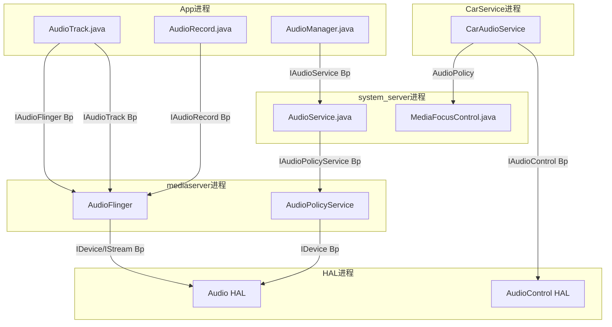

## 1.1 设计哲学

> [返回目录](README.md) | [下一个 →](01_1.2_全栈分层架构图.md)

---


### 1.1.1 分层解耦：控制面与数据面分离

这是AOSP Audio最根本的架构决策。**AudioFlinger（数据面）**与**AudioPolicyService（控制面）**分离运行在不同线程，各自独立演进：

```
┌─────────────────────────────────────────────────────┐
│  Application Layer    → 只关心API语义，不关心硬件     │
├─────────────────────────────────────────────────────┤
│  Java Framework       → 策略管理，不关心数据流         │
├─────────────────────────────────────────────────────┤
│  Native Framework     → 数据流管理，不关心硬件差异     │
├─────────────────────────────────────────────────────┤
│  Audio Policy Engine  → 路由决策，可插拔引擎          │
├─────────────────────────────────────────────────────┤
│  Audio Engine (AF)    → 混音/采集，不关心策略         │
├─────────────────────────────────────────────────────┤
│  HAL                  → 硬件抽象，Vendor可替换         │
└─────────────────────────────────────────────────────┘
```

**为什么这样设计？**

| 设计决策 | 原因 | 好处 |
|----------|------|------|
| AF与APS分离 | 数据流与策略决策生命周期不同 | AF持续运行不因策略变更中断；策略可热替换 |
| Engine可插拔 | 不同产品路由策略差异大（手机vs车机vsTV） | Vendor继承`EngineBase`实现自定义引擎 |
| HAL双轨(HIDL+AIDL) | 向后兼容+技术演进 | 老HAL无需重写；新HAL用AIDL更高效 |
| Binder IPC隔离 | 进程隔离保证稳定性 | App崩溃不影响系统音频服务 |

### 1.1.2 Binder IPC隔离：跨进程只依赖接口

所有跨进程通信通过Binder完成，每层只依赖接口不依赖实现：



| Binder接口 | 服务端 | 客户端 | 用途 |
|------------|--------|--------|------|
| `IAudioFlinger` | AudioFlinger | AudioTrack/AudioRecord | 创建Track/Record、打开输出/输入流 |
| `IAudioTrack` | TrackHandle | Native AudioTrack | 播放控制(start/stop/write/flush) |
| `IAudioRecord` | RecordHandle | Native AudioRecord | 采集控制(start/stop/read) |
| `IAudioPolicyService` | AudioPolicyService | AudioSystem | 路由查询、设备管理、音量控制 |
| `IAudioControl` | AudioControl HAL | CarAudioService | 车载焦点/音量/静音回调 |

### 1.1.3 共享内存零拷贝：音频数据不经过Binder

音频PCM数据量大、实时性要求高，不能走Binder序列化。AOSP采用共享内存+FIFO方式：

```
App进程 (Producer)              AudioFlinger进程 (Consumer)
┌──────────────────┐            ┌───────────────────┐
│ AudioTrack        │            │  PlaybackThread    │
│   write(data)     │            │    prepareTracks_l │
│     ↓             │            │      ↓             │
│   FIFO写入 ───────cblk────→   │    mixer读取       │
│   更新u/int       │  共享内存   │    检查u/int       │
└──────────────────┘            └───────────────────┘
```

- **audio_track_cblk_t**：共享内存控制块，位于共享内存头部
  - `user`：App写入位置
  - `server`：AudioFlinger读取位置
  - `frameCount`：buffer总大小
  - `flushCount`：flush操作计数（处理 discontinuity）
- **NOP模式**：DirectOutputThread/OffloadThread场景，App的buffer直接映射到HAL输出，AudioFlinger不做混音处理，实现零拷贝

---
