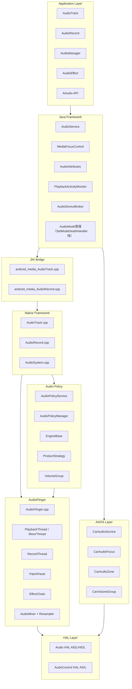

## 1.2 全栈分层架构图

> [← 上一个](01_1.1_设计哲学.md) | [返回目录](README.md) | [下一个 →](01_1.3_模块依赖关系图.md)

---

```mermaid
graph TB
    subgraph APP["Application Layer"]
        AT["AudioTrack"]
        AR["AudioRecord"]
        AM["AudioManager"]
        AE["AudioEffect"]
        AAudio["AAudio API"]
    end
    subgraph JFW["Java Framework"]
        AS["AudioService"]
        MFC["MediaFocusControl"]
        AA["AudioAttributes"]
        PAM["PlaybackActivityMonitor"]
        ADB["AudioDeviceBroker"]
        AMS["AudioMode管理<br>（SetModeDeathHandler栈）"]
    end
    subgraph JNI["JNI Bridge"]
        JNI_AT["android_media_AudioTrack.cpp"]
        JNI_AR["android_media_AudioRecord.cpp"]
    end
    subgraph NFW["Native Framework"]
        NAT["AudioTrack.cpp"]
        NAR["AudioRecord.cpp"]
        NSys["AudioSystem.cpp"]
    end
    subgraph AF["AudioFlinger"]
        AFSvc["AudioFlinger.cpp"]
        PT["PlaybackThread / MixerThread"]
        RT["RecordThread"]
        PP["PatchPanel"]
        EC["EffectChain"]
        MXR["AudioMixer + Resampler"]
    end
    subgraph AP["Audio Policy"]
        APS["AudioPolicyService"]
        APM["AudioPolicyManager"]
        Eng["EngineBase"]
        PS["ProductStrategy"]
        VG["VolumeGroup"]
    end
    subgraph HAL["HAL Layer"]
        AHAL["Audio HAL AIDL/HIDL"]
        ACHAL["AudioControl HAL AIDL"]
    end
    subgraph AAOS["AAOS Layer"]
        CAS["CarAudioService"]
        CAF["CarAudioFocus"]
        CZ["CarAudioZone"]
        CVG["CarVolumeGroup"]
    end
    APP --> JFW --> JNI --> NFW
    NFW --> AF
    NFW --> AP --> AF
    AF --> HAL
    JFW --> AAOS --> HAL
```

---
