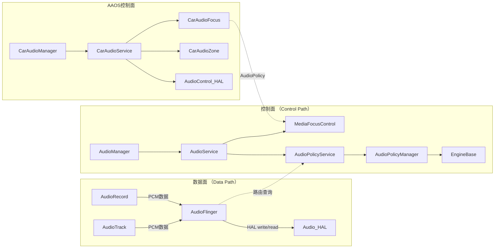

## 1.3 模块依赖关系图

> [← 上一个](01_1.2_全栈分层架构图.md) | [返回目录](README.md) | [下一个 →](01_1.4_五大核心状态机总览.md)

---

**关键洞察**：数据面和控制面只在"路由查询"和"焦点仲裁"两个点交叉，其余完全独立。这使得：
- 修改路由策略不需要改动AudioFlinger
- 修改混音逻辑不需要改动AudioPolicy
- AAOS可以在不修改底层的情况下替换焦点策略

---
