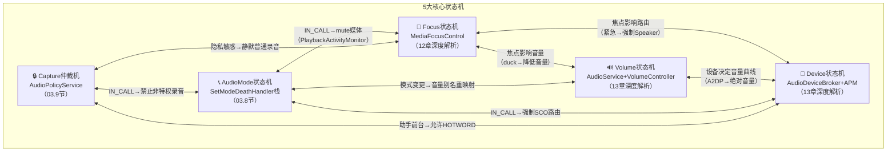

## 1.4 五大核心状态机总览

> [← 上一个](01_1.3_模块依赖关系图.md) | [返回目录](README.md) | [下一个 →](01_1.5_关键源码目录速查.md)

---

Android音频系统由**5大核心状态机**驱动，它们相互关联、协同工作：

| 状态机 | 管理类 | 核心操作 | 章节深入 |
|--------|--------|---------|---------|
| Focus | MediaFocusControl | requestAudioFocus / abandonAudioFocus | [12_Audio_Focus_Deep_Dive](../12_Audio_Focus_Deep_Dive/README.md) |
| Volume | AudioService + VolumeController | adjustVolume / setStreamVolume | [13_Volume_Device_Deep_Dive](../13_Volume_Device_Deep_Dive/README.md) |
| Device | AudioDeviceBroker + AudioPolicyManager | setWiredDeviceConnectionState / createAudioPatch | [13_Volume_Device_Deep_Dive](../13_Volume_Device_Deep_Dive/README.md) |
| AudioMode | AudioService (SetModeDeathHandler) | setMode / setCommunicationDevice | [03_Java_Framework_Layer](../03_Java_Framework_Layer/README.md) |
| Capture仲裁 | AudioPolicyService (updateActiveClients_l) | setAppState_l / canCaptureOutput / privacySensitive | [03_Java_Framework_Layer](../03_Java_Framework_Layer/README.md) |

---
