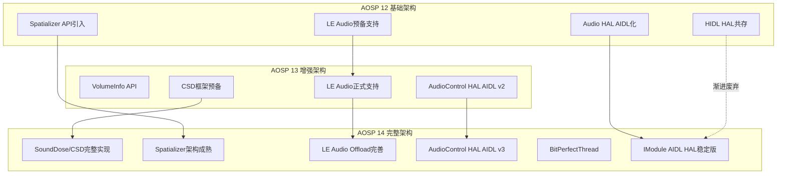

## 1.7 AOSP14 Audio新特性架构演进

> [← 上一个](01_1.6_Android_Audio版本演进.md) | [返回目录](README.md) | [下一个 →](01_1.8_播放录音全栈数据流向图.md)

---

AOSP14在音频架构上引入了多项重要特性，涵盖听力保护、空间音频、LE Audio、HAL接口升级和车载BitPerfect等领域。

### 1.7.1 SoundDose/CSD听力保护架构

AOSP14引入了**CSD（Common Sound Dose）**框架，实现WHO推荐的听力保护标准：

- [`SoundDoseManager`](frameworks/av/services/audioflinger/sounddose/SoundDoseManager.h) 运行在AudioFlinger进程中，负责MEL（Maximum Exposure Level）计算
- [`MelReporter`](frameworks/av/services/audioflinger/MelReporter.h) 作为桥梁，将SoundDose数据上报至AudioService
- [`SoundDoseHelper`](frameworks/base/services/core/java/com/android/server/audio/SoundDoseHelper.java) 在Java层管理CSD回调与安全警告触发
- HAL层通过[`ISoundDose`](hardware/interfaces/audio/aidl/android/hardware/audio/core/sounddose/ISoundDose.aidl) AIDL接口与框架对接

**架构要点**：SoundDoseManager同时支持框架侧MEL计算和HAL侧MEL上报，由`csd_enabled`属性控制模式切换。

> 深度解析 → [13_Volume_Device_Deep_Dive - SoundDose/CSD章节](../13_Volume_Device_Deep_Dive/README.md)

### 1.7.2 Spatializer空间音频架构

空间音频从AOSP12引入API，到AOSP14架构趋于成熟：

- [`Spatializer`](frameworks/base/media/java/android/media/Spatializer.java) 提供Java API，通过`ISpatializer` Binder接口与AudioFlinger通信
- [`SpatializerThread`](frameworks/av/services/audioflinger/Threads.h) 继承自MixerThread，专门处理空间化音频混音
- 支持Head Tracking传感器数据输入，实现动态声场调整
- AudioPolicy根据设备能力（`FEATURE_AUDIO_SPATIALIZER`）自动路由到SpatializerThread

> 深度解析 → [07_Effects_Framework - Spatializer章节](../07_Effects_Framework/README.md)

### 1.7.3 LE Audio架构

LE Audio（Low Energy Audio）是蓝牙音频的重大演进：

- [`BluetoothLeAudio`](packages/modules/Bluetooth/system/bta/include/bta_le_audio_api.h) Java API提供设备管理与组控制
- [`LeAudioOffloadAudioProvider`](hardware/interfaces/bluetooth/audio/aidl/default/LeAudioOffloadAudioProvider.cpp) 处理LE Audio Offload模式
- [`LeAudioHalVerifier`](packages/modules/Bluetooth/system/bta/include/bta_le_audio_api.h) 校验HAL层LE Audio能力
- AudioPolicy新增LE Audio设备类型（`DEVICE_OUT_BLE_HEADSET`等）和路由策略
- 支持Broadcast Source/Sink和Unicast双模式

> 深度解析 → [14_Bluetooth_Audio - LE Audio章节](../14_Bluetooth_Audio/README.md)

### 1.7.4 AudioControl HAL AIDL v3

车载音频控制接口升级到AIDL v3版本：

- [`IAudioControl`](hardware/interfaces/automotive/audiocontrol/aidl/android/hardware/automotive/audiocontrol/IAudioControl.aidl) 新增`onAudioFocusChangeWithMetaData`替代v1的`onAudioFocusChange`
- 新增`IAudioGainCallback`支持HAL主动请求音量变更
- 新增`setBalanceTowardRight`/`setFadeTowardFront`音场控制接口
- [`CarAudioService`](packages/services/Car/service/src/com/android/car/audio/CarAudioService.java) 适配v3接口，支持更丰富的车载音频场景

> 深度解析 → [10_AudioControl_HAL - AIDL v3章节](../10_AudioControl_HAL/README.md)

### 1.7.5 BitPerfectThread（AAOS）

BitPerfectThread是AAOS独有的高保真播放线程：

- [`BitPerfectThread`](frameworks/av/services/audioflinger/Threads.h) 继承自MixerThread，当满足"唯一活跃Track + `AUDIO_OUTPUT_FLAG_BIT_PERFECT`"条件时自动激活
- 绕过AudioMixer混音和Resampler重采样，直接将原始PCM数据写入HAL
- [`isBitPerfect()`](frameworks/av/services/audioflinger/TrackBase.h) 判断Track是否支持BitPerfect模式
- EffectChain通过[`isBitPerfectCompatible()`](frameworks/av/services/audioflinger/Effects.cpp)检查效果链兼容性，不兼容时自动降级

> 深度解析 → [05_AudioFlinger - BitPerfectThread章节](../05_AudioFlinger/README.md)

### 1.7.6 AOSP12→13→14架构演进图

---
