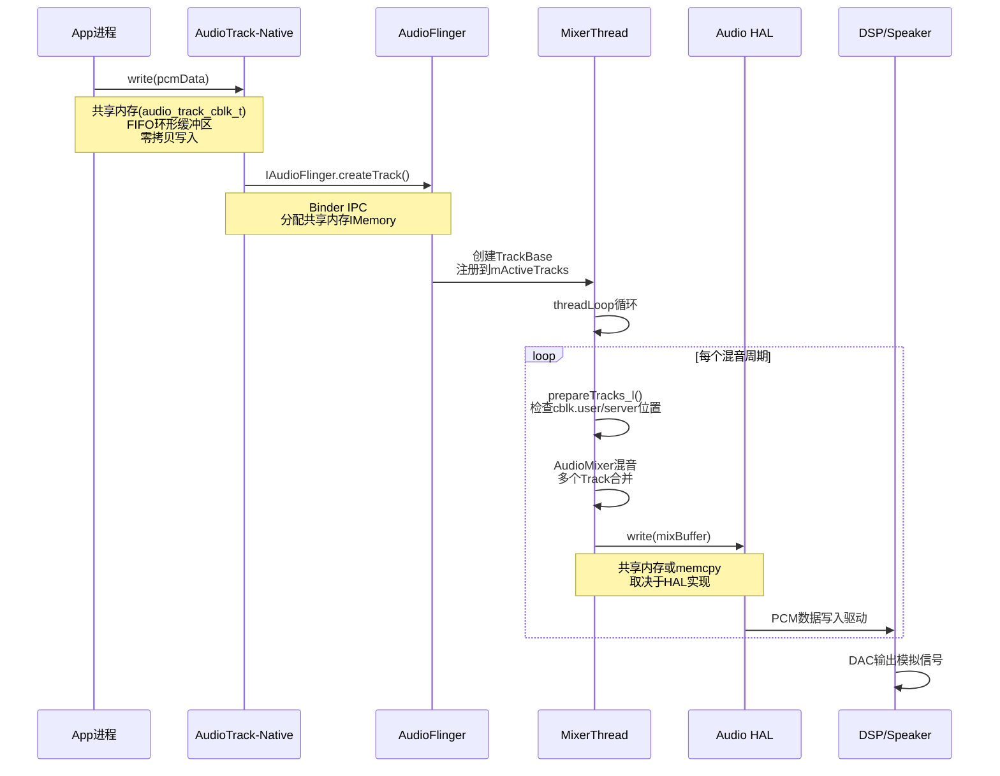
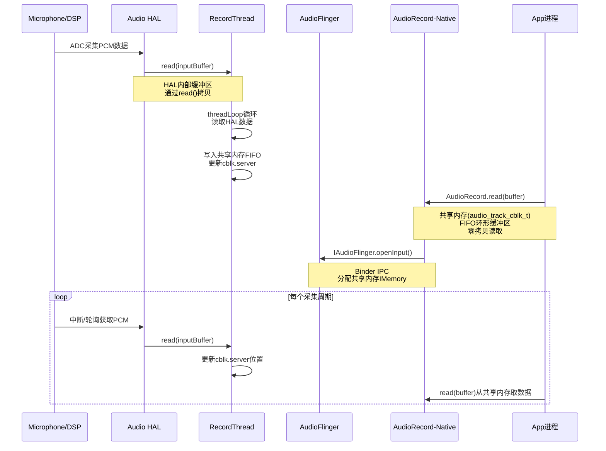

## 1.8 播放/录音全栈数据流向图

> [← 上一个](01_1.7_AOSP14_Audio新特性架构演进.md) | [返回目录](README.md) | [下一个 →](01_1.9_系统启动时序_从init到音频就绪.md)

---

### 1.8.1 播放数据流：AudioTrack → Speaker

**关键机制标注**：

| 阶段 | 通信机制 | 数据结构 |
|------|---------|---------|
| App → AudioTrack | Java JNI调用 | `android_media_AudioTrack.cpp` |
| AudioTrack → AudioFlinger | Binder IPC (`IAudioFlinger.createTrack`) | [`audio_track_cblk_t`](frameworks/av/include/private/media/AudioTrackShared.h) 共享内存控制块 |
| AudioFlinger内部 | 进程内直接调用 | [`AudioMixer`](frameworks/av/media/libaudioprocessing/AudioMixer.cpp) 混音引擎 |
| MixerThread → HAL | `write()` 调用 | PCM buffer，通过`mOutput->write` |
| HAL → DSP | ioctl/mmap | 内核ALSA驱动 |

### 1.8.2 录音数据流：Microphone → App

**播放与录音数据流对比**：

| 维度 | 播放(Playback) | 录音(Capture) |
|------|---------------|---------------|
| 共享内存方向 | App写→AF读(Producer-Consumer) | AF写→App读(Producer-Consumer) |
| 线程类型 | [`MixerThread`](frameworks/av/services/audioflinger/Threads.h) | [`RecordThread`](frameworks/av/services/audioflinger/Threads.h) |
| AF核心操作 | 多Track混音 → 单输出 | 单输入 → 分发给多Client |
| 特殊路径 | DirectOutput/Offload/BitPerfect | FAST_CAPTURE |
| 延迟预算 | Normal: 20ms, Fast: 2ms | Normal: 20ms, Fast: 2ms |

> 深度解析 → [02_Application_Layer - API详解](../02_Application_Layer/README.md) | [04_Native_Framework_Layer - Native数据流](../04_Native_Framework_Layer/README.md) | [05_AudioFlinger - 线程模型](../05_AudioFlinger/README.md)

---
