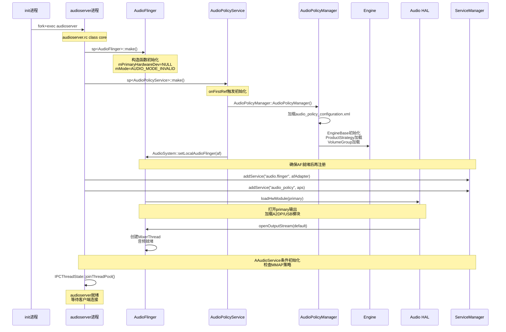
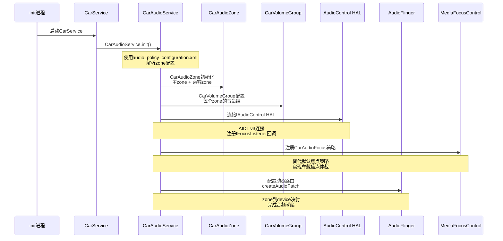

## 1.9 系统启动时序：从init到音频就绪

> [← 上一个](01_1.8_播放录音全栈数据流向图.md) | [返回目录](README.md) | [下一个 →](01_1.10_各子系统交叉引用导航.md)

---

### 1.9.1 audioserver启动链路

音频系统启动由init进程拉起`audioserver`服务开始，核心流程如下：

### 1.9.2 关键启动步骤详解

**1. audioserver进程创建**

[`main_audioserver.cpp`](frameworks/av/media/audioserver/main_audioserver.cpp) 中，AudioFlinger和AudioPolicyService在同一进程内先创建本地实例，再注册到ServiceManager。这是为了避免AudioFlinger在AudioPolicy未就绪时被远程调用导致TimeCheck abort（见源码注释L154-L163）。

**2. AudioFlinger初始化**

[`AudioFlinger::instantiate()`](frameworks/av/services/audioflinger/AudioFlinger.cpp) 将`AudioFlingerServerAdapter`注册为Binder服务。构造函数中`mPrimaryHardwareDev`初始为NULL，HAL加载延迟到第一次openOutput时。

**3. AudioPolicyManager配置加载**

[`AudioPolicyManager`](frameworks/av/services/audiopolicy/managerdefault/AudioPolicyManager.h) 解析`audio_policy_configuration.xml`，加载：
- 输出/输入Profile定义
- 路由策略与ProductStrategy映射
- VolumeGroup曲线定义
- 默认设备分配规则

**4. HAL模块加载**

AudioFlinger按需加载HAL模块，加载顺序：`primary` → `a2dp` → `usb` → `r_submix` → `hearing_aid`。每个模块通过`loadHwModule` → `openDevice` → `openOutputStream`链路完成。

### 1.9.3 AAOS路径：CarAudioService启动

AAOS启动的关键差异在于：`CarAudioService`接管了AudioPolicy的部分路由决策权，通过`CarAudioZone`实现多zone隔离，通过`AudioControl HAL`与车辆硬件交互。

> 深度解析 → [05_AudioFlinger - 启动与HAL加载](../05_AudioFlinger/README.md) | [06_Audio_Policy_Engine - 配置加载](../06_Audio_Policy_Engine/README.md) | [09_AAOS_Car_Audio - CarAudioService初始化](../09_AAOS_Car_Audio/README.md) | [10_AudioControl_HAL - HAL连接](../10_AudioControl_HAL/README.md)

---
