# 第二篇：Application Layer — 应用层API深度解析

> [← 上一篇：架构总论](01_Architecture_Overview.md) | [返回导航](README.md) | [下一篇：Java Framework →](03_Java_Framework_Layer.md)

---

## 2.1 AudioTrack — 播放核心API深度解析

### 模块职责

AudioTrack是Android应用层音频播放的核心API，支持PCM原始音频数据的流式输出。它是所有播放场景的底层基础——MediaPlayer、SoundPool、AAudio内部均创建AudioTrack实例。

**源码位置**：
- Java层：[`AudioTrack.java`](frameworks/base/media/java/android/media/AudioTrack.java)
- JNI层：[`android_media_AudioTrack.cpp`](frameworks/base/core/jni/android_media_AudioTrack.cpp)
- Native层：[`AudioTrack.cpp`](frameworks/av/media/libaudioclient/AudioTrack.cpp)
- 共享内存结构：[`AudioTrackShared.h`](frameworks/av/include/private/media/AudioTrackShared.h)

### 核心类关系

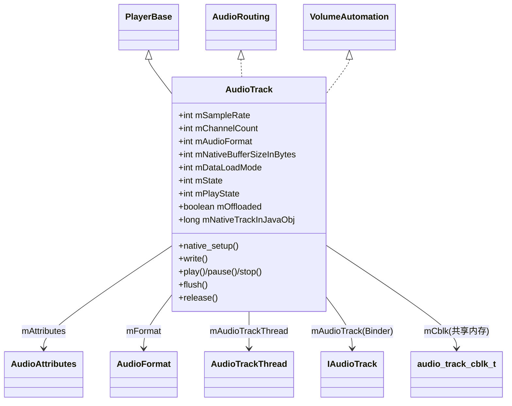

- [`AudioTrack`](frameworks/base/media/java/android/media/AudioTrack.java:97) — 继承PlayerBase，实现AudioRouting + VolumeAutomation
- **PlayerBase** — 媒体会话管理基类，与AudioManager交互音量/焦点
- **AudioRouting** — 路由控制接口，指定输出设备
- **VolumeAutomation** — 自动音量控制接口（ducking等）
- **AudioTrackThread** — 回调模式下的内部线程，驱动`processAudioBuffer()`
- **IAudioTrack** — Binder代理，指向AudioFlinger中的TrackHandle

### 完整状态机（含Offload特殊状态）

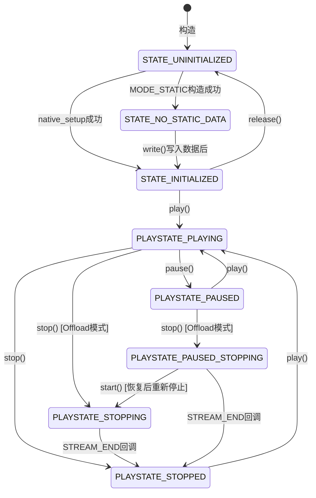

**状态常量详解**（定义于 [`AudioTrack.java:113-125`](frameworks/base/media/java/android/media/AudioTrack.java:113)）：

| 常量 | 值 | 说明 | 适用场景 |
|------|-----|------|----------|
| `PLAYSTATE_STOPPED` | 1 | 匹配SL_PLAYSTATE_STOPPED | 所有模式 |
| `PLAYSTATE_PAUSED` | 2 | 暂停状态 | 所有模式 |
| `PLAYSTATE_PLAYING` | 3 | 正在播放 | 所有模式 |
| `PLAYSTATE_STOPPING` | 4 | **Offload专用**，等待DSP渲染完成 | 仅Offload |
| `PAUSED_STOPPING` | 5 | **Offload专用**，暂停中请求停止 | 仅Offload |

> **Offload模式为什么需要STOPPING/PAUSED_STOPPING？**
> Offload模式下，压缩音频数据直接发送到DSP解码播放。当App调用stop()时，DSP可能还有未解码完的数据，不能立即停止。因此AudioTrack进入STOPPING状态，等待DSP渲染完成后通过`NATIVE_EVENT_STREAM_END`回调才真正进入STOPPED。如果在STOPPING期间调用start()，状态回退到PLAYING；如果再调用stop()，则进入PAUSED_STOPPING。

### 构造函数深度解析

AudioTrack使用Builder模式构造，Builder.build()内部逻辑（[`AudioTrack.java:1376-1461`](frameworks/base/media/java/android/media/AudioTrack.java:1376)）：

#### PerformanceMode与输出Flag的映射关系

这是AudioTrack最核心的设计之一，决定了音频走FastMixer还是NormalMixer路径：

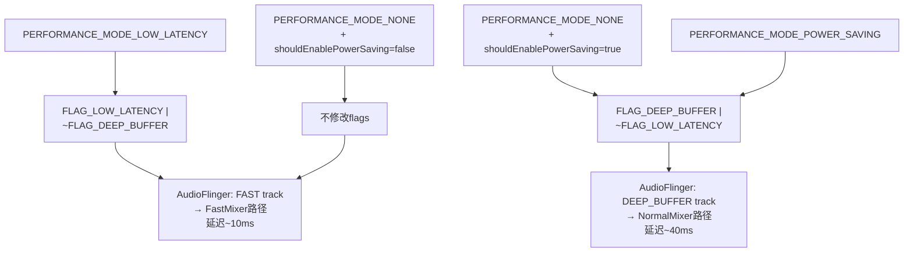

**源码实现**（[`AudioTrack.java:1382-1402`](frameworks/base/media/java/android/media/AudioTrack.java:1382)）：

```java
switch (mPerformanceMode) {
case PERFORMANCE_MODE_LOW_LATENCY:
    mAttributes = new AudioAttributes.Builder(mAttributes)
        .replaceFlags((mAttributes.getAllFlags()
                | AudioAttributes.FLAG_LOW_LATENCY)
                & ~AudioAttributes.FLAG_DEEP_BUFFER)
        .build();
    break;
case PERFORMANCE_MODE_NONE:
    if (!shouldEnablePowerSaving(...)) {
        break; // 不启用deep buffer
    }
    // fall through
case PERFORMANCE_MODE_POWER_SAVING:
    mAttributes = new AudioAttributes.Builder(mAttributes)
        .replaceFlags((mAttributes.getAllFlags()
                | AudioAttributes.FLAG_DEEP_BUFFER)
                & ~AudioAttributes.FLAG_LOW_LATENCY)
        .build();
    break;
}
```

**shouldEnablePowerSaving()决策逻辑**（[`AudioTrack.java:680-720`](frameworks/base/media/java/android/media/AudioTrack.java:680)）：

满足以下**所有**条件时启用Power Saving（DEEP_BUFFER）：
1. 传输模式为MODE_STREAM
2. 采样率为0或44100/48000等标准率
3. 格式为PCM 16bit
4. ChannelMask为STEREO或MONO
5. bufferSize >= `getMinBufferSize() * 2`

> **设计原理**：大buffer + PCM标准格式 = 不需要低延迟，可以走DEEP_BUFFER路径让AudioFlinger使用更大的buffer来减少CPU唤醒次数，从而省电。游戏、交互式音频则走LOW_LATENCY路径牺牲功耗换延迟。

#### Offload兼容性检查

Builder中对Offload模式有严格的兼容性检查（[`AudioTrack.java:1420-1430`](frameworks/base/media/java/android/media/AudioTrack.java:1420)）：

```java
if (mOffload) {
    if (mPerformanceMode == PERFORMANCE_MODE_LOW_LATENCY) {
        throw new UnsupportedOperationException(
                "Offload and low latency modes are incompatible");
    }
    if (AudioSystem.getDirectPlaybackSupport(mFormat, mAttributes)
            == AudioSystem.DIRECT_NOT_SUPPORTED) {
        throw new UnsupportedOperationException(
                "Cannot create AudioTrack, offload format / attributes not supported");
    }
}
```

> **为什么Offload和LOW_LATENCY不兼容？** Offload需要DSP解码，DSP解码本身就是有延迟的（通常数十到数百毫秒），追求低延迟没有意义。LOW_LATENCY需要FastMixer路径，而Offload走的是DirectOutputThread。

#### 构造函数→native_setup参数传递

构造函数最终调用native_setup（[`AudioTrack.java:870-900`](frameworks/base/media/java/android/media/AudioTrack.java:870)）：

| Java参数 | Native接收 | 说明 |
|----------|-----------|------|
| `WeakReference<AudioTrack>` | jobject | 用于JNI回调Java层 |
| `mAttributes` | audio_attributes_t | usage/contentType/flags/tags |
| `sampleRate` | uint32_t | 请求采样率，0=由系统决定 |
| `mChannelMask` | audio_channel_mask_t | 输出声道掩码 |
| `mChannelIndexMask` | audio_channel_mask_t | 索引式声道掩码（AOSP14新增） |
| `mAudioFormat` | audio_format_t | 编码格式 |
| `mNativeBufferSizeInBytes` | size_t | App侧buffer大小（字节） |
| `mDataLoadMode` | transfer_type | MODE_STATIC→TRANSFER_SHARED, MODE_STREAM→TRANSFER_SYNC |
| `session` | audio_session_t[] | 输出：分配的session ID |
| `attributionSource` | AttributionSource | 调用者UID/PID/包名 |
| `offload` | bool | 是否Offload模式 |
| `encapsulationMode` | int | 封装模式（广播/TV用） |
| `tunerConfiguration` | TunerConfiguration | Tuner配置（TV用） |

### Native层初始化全流程

#### AudioTrack::set()（[`AudioTrack.cpp:425-620`](frameworks/av/media/libaudioclient/AudioTrack.cpp:425)）

set()是Native AudioTrack的核心初始化函数，完成以下工作：

1. **参数校验**：format/channelMask/frameCount合法性检查
2. **Transfer Type决策**：
   - `TRANSFER_DEFAULT` → 有callback时用TRANSFER_CALLBACK，否则用TRANSFER_SYNC
   - `TRANSFER_CALLBACK` → 创建AudioTrackThread
   - `TRANSFER_SYNC` → 由App线程直接write
   - `TRANSFER_SHARED` → MODE_STATIC模式
   - `TRANSFER_OBTAIN` → obtainBuffer/releaseBuffer模式
3. **调用createTrack_l()** → 与AudioFlinger建立连接

#### createTrack_l()深度分析（[`AudioTrack.cpp:1807-1980`](frameworks/av/media/libaudioclient/AudioTrack.cpp:1807)）

这是AudioTrack与AudioFlinger建立连接的核心函数，执行Binder IPC并建立共享内存：

**Step 1: FAST flag资格检查**

```cpp
// FAST flag不是无条件满足的，必须满足特定传输模式
if (mFlags & AUDIO_OUTPUT_FLAG_FAST) {
    bool useCaseAllowed =
            // 场景1: callback传输模式
            (mTransfer == TRANSFER_CALLBACK) ||
            // 场景2: 同步write（阻塞读）模式
            (mTransfer == TRANSFER_SYNC) ||
            // 场景3: obtain/release模式
            (mTransfer == TRANSFER_OBTAIN);
    if (!useCaseAllowed) {
        ALOGD("AUDIO_OUTPUT_FLAG_FAST denied, incompatible transfer = %s");
        mFlags = (audio_output_flags_t)(mFlags & ~AUDIO_OUTPUT_FLAG_FAST);
    }
}
```

> **FAST flag被拒绝的后果**：AudioTrack仍可正常工作，但走NormalMixer路径而非FastMixer，延迟从~10ms增加到~40ms。

**Step 2: 构造CreateTrackInput**

```cpp
input.attr = mAttributes;               // AudioAttributes
input.config.sample_rate = mSampleRate;
input.config.channel_mask = mChannelMask;
input.config.format = mFormat;
input.clientInfo.attributionSource = mClientAttributionSource;
input.clientInfo.clientTid = -1;        // FAST时传递AudioTrackThread TID
input.sharedBuffer = mSharedBuffer;      // MODE_STATIC时有值
input.flags = mFlags;
input.frameCount = mReqFrameCount;
input.sessionId = mSessionId;
```

**Step 3: Binder IPC调用**

```cpp
status = audioFlinger->createTrack(
    VALUE_OR_FATAL(input.toAidl()), response);
```

此调用触发AudioFlinger侧的完整Track创建流程（详见[第五篇](05_AudioFlinger.md)）。

**Step 4: 解析CreateTrackOutput**

AudioFlinger返回的关键参数：

| 输出参数 | 说明 | 影响App行为 |
|----------|------|------------|
| `frameCount` | 实际分配的帧数 | 可能≥请求值（AudioFlinger会向上取整） |
| `notificationFrameCount` | 实际通知周期 | 影响callback频率 |
| `selectedDeviceId` | 实际路由设备 | App可查询getRoutedDevice() |
| `sessionId` | 分配的session ID | 用于关联Effect |
| `sampleRate` | 实际采样率 | 可能与请求不同 |
| `afFrameCount` | AudioFlinger buffer帧数 | 用于延迟计算 |
| `afSampleRate` | AudioFlinger采样率 | 用于延迟计算 |
| `afLatency` | AudioFlinger延迟(ms) | 用于延迟计算 |
| `flags` | 实际分配的flags | FAST是否被批准 |

**Step 5: 共享内存映射**

```cpp
sp<IMemory> cblk = output.cblk;
iMemPointer = cblk->unsecurePointer();
mCblk = static_cast<audio_track_cblk_t*>(iMemPointer);

// buffer位置：紧跟cblk之后或独立区域
void *buffers;
if (output.buffers == 0) {
    buffers = mCblk + 1;  // cblk紧后面
} else {
    buffers = output.buffers->unsecurePointer();
}
```

**Step 6: 构造Proxy对象**

```cpp
// Streaming模式
mProxy = new AudioTrackClientProxy(cblk, buffers, frameCount, mFrameSize);
// Static模式
mProxy = new StaticAudioTrackClientProxy(cblk, buffers, frameCount, mFrameSize);
```

### write()数据写入机制深度解析

AudioTrack的write()方法是应用写入音频数据的核心入口（[`AudioTrack.cpp:2310-2375`](frameworks/av/media/libaudioclient/AudioTrack.cpp:2310)）：

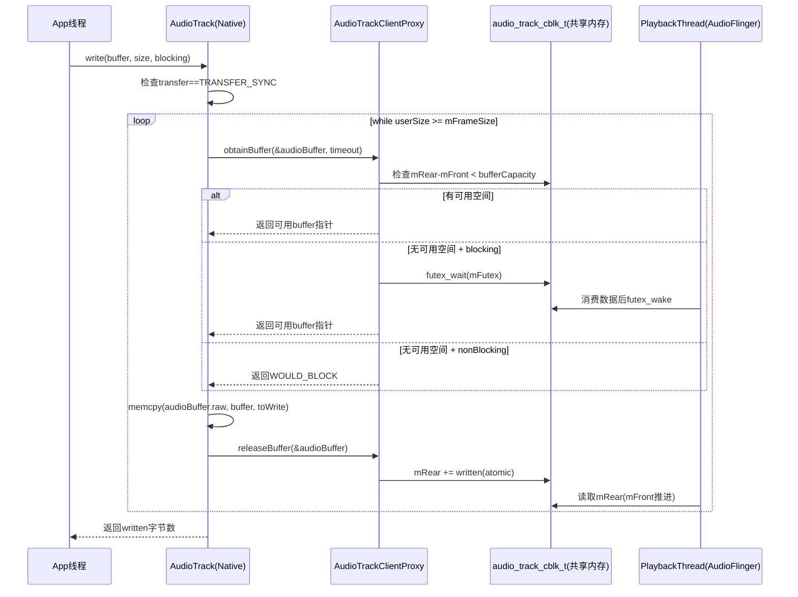

**关键代码**（[`AudioTrack.cpp:2337-2359`](frameworks/av/media/libaudioclient/AudioTrack.cpp:2337)）：

```cpp
while (userSize >= mFrameSize) {
    audioBuffer.frameCount = userSize / mFrameSize;
    status_t err = obtainBuffer(&audioBuffer,
            blocking ? &ClientProxy::kForever : &ClientProxy::kNonBlocking);
    if (err < 0) {
        if (written > 0) break;
        if (err == TIMED_OUT || err == -EINTR) err = WOULD_BLOCK;
        return ssize_t(err);
    }
    size_t toWrite = audioBuffer.size();
    memcpy(audioBuffer.raw, buffer, toWrite);  // 数据拷贝到共享内存
    buffer = ((const char *)buffer) + toWrite;
    userSize -= toWrite;
    written += toWrite;
    releaseBuffer(&audioBuffer);  // 更新mRear指针
}
```

### 共享内存FIFO结构 — audio_track_cblk_t

这是AudioTrack零拷贝机制的核心数据结构（[`AudioTrackShared.h:207-279`](frameworks/av/include/private/media/AudioTrackShared.h:207)）：


**Streaming模式核心字段**（[`AudioTrackShared.h:134-145`](frameworks/av/include/private/media/AudioTrackShared.h:134)）：

| 字段 | 类型 | 写入者 | 说明 |
|------|------|--------|------|
| `mFront` | volatile int32_t | Server(AudioFlinger) | 已消费位置，环形缓冲区前端 |
| `mRear` | volatile int32_t | Client(AudioTrack) | 已写入位置，环形缓冲区后端 |
| `mFlush` | volatile int32_t | Client | flush计数器，Server检测到后丢弃数据 |
| `mStop` | volatile int32_t | Client | stop位置，Server不读超过此位置 |
| `mUnderrunFrames` | volatile uint32_t | Server | 累计underrun帧数 |
| `mUnderrunCount` | volatile uint32_t | Server | underrun次数 |

**cblk_t头部核心字段**（[`AudioTrackShared.h:225-270`](frameworks/av/include/private/media/AudioTrackShared.h:225)）：

| 字段 | 说明 |
|------|------|
| `mServer` | Server已消费帧数（异步更新，仅供参考） |
| `mFutex` | 事件标志，Client等待(P)/Server唤醒(V) |
| `mMinimum` | Server唤醒Client的最低可用空间阈值 |
| `mVolumeLR` | 立体声音量（AudioTrack专用） |
| `mSampleRate` | Client请求的采样率 |
| `mPlaybackRateQueue` | 播放速率状态队列（变速播放） |
| `mSendLevel` | 辅助效果发送电平 |
| `mExtendedTimestampQueue` | 扩展时间戳队列 |
| `mBufferSizeInFrames` | 有效buffer大小（可动态调整） |
| `mStartThresholdInFrames` | 开始播放的最小帧数阈值 |
| `mFlags` | CBLK_*标志组合 |
| `mState` | TrackBase当前状态（atomic） |

> **零拷贝原理**：AudioTrack.write()通过memcpy将数据写入共享内存，AudioFlinger的PlaybackThread直接从同一块共享内存读取数据混音，无需额外的数据拷贝。mFront/mRear使用volatile + atomic操作保证多进程同步的正确性。

### start()/stop()状态转换详解

#### start()内部实现（[`AudioTrack.cpp:782-920`](frameworks/av/media/libaudioclient/AudioTrack.cpp:782)）

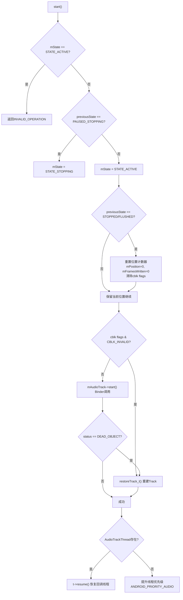

**关键细节**：
- `mInUnderrun = true`：start后首次write前标记为underrun状态
- CBLK_INVALID检查：如果Track因设备切换等原因失效，需要通过`restoreTrack_l()`重建
- DEAD_OBJECT处理：AudioFlinger重启后Binder代理失效，触发Track重建
- 优先级提升：非callback模式下，start()会将调用线程提升到ANDROID_PRIORITY_AUDIO(-16)

#### stop()内部实现（[`AudioTrack.cpp:922-978`](frameworks/av/media/libaudioclient/AudioTrack.cpp:922)）

```cpp
void AudioTrack::stop() {
    AutoMutex lock(mLock);
    if (mState != STATE_ACTIVE && mState != STATE_PAUSED) {
        return;  // 非活动状态直接返回
    }
    if (isOffloaded_l()) {
        mState = STATE_STOPPING;  // Offload: 等待DSP完成
    } else {
        mState = STATE_STOPPED;   // 普通: 立即停止
        mReleased = 0;
    }
    mProxy->stop();        // 通知Server停止读取
    mProxy->interrupt();   // 唤醒可能在等待的线程
    mAudioTrack->stop();   // Binder调用AudioFlinger
}
```

> **Offload vs 普通模式stop差异**：Offload模式下stop()只是标记STATE_STOPPING，需要等待DSP的STREAM_END事件才真正停止。在STOPPING期间，AudioTrackThread会继续监控状态并回调`EVENT_STREAM_END`。

### ERROR_DEAD_OBJECT恢复流程

当AudioFlinger进程重启或Track被系统回收时，Client侧会收到DEAD_OBJECT错误：

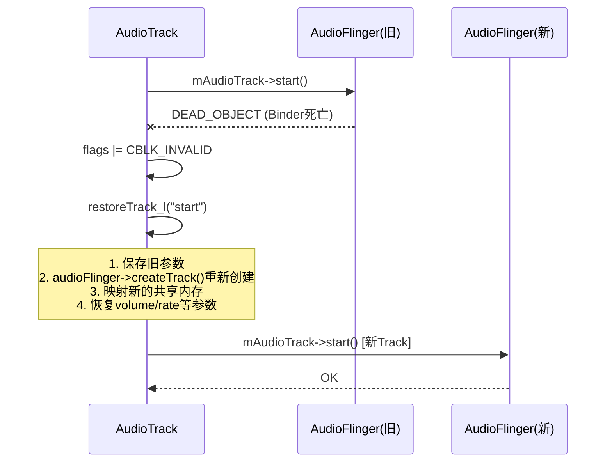

`restoreTrack_l()`核心逻辑：重新调用createTrack_l()，用新的IAudioTrack替换旧的，重新映射共享内存，并恢复所有参数（音量、采样率、辅助效果等）。

### 传输模式深度对比

| 模式 | Transfer Type | 数据流 | Buffer管理 | 延迟 | 适用场景 |
|------|--------------|--------|-----------|------|----------|
| MODE_STREAM | TRANSFER_SYNC | App→write()→共享内存→AF | obtainBuffer/releaseBuffer | 中等 | 音乐、通话 |
| MODE_STREAM | TRANSFER_CALLBACK | AF→AudioTrackThread→onPeriodicNotification() | obtainBuffer/releaseBuffer | 低 | 低延迟播放 |
| MODE_STATIC | TRANSFER_SHARED | App→write一次性→共享内存 | 直接访问shared buffer | 最低 | 短音效 |
| MODE_STREAM | TRANSFER_SYNC_NOTIF_CALLBACK | App→write()→共享内存→AF + 唤醒回调 | obtainBuffer/releaseBuffer | 中等 | 需要通知的流式 |
| Offload | TRANSFER_SYNC | App→write()压缩数据→DirectOutputThread | 独立buffer | 高(DSP) | MP3/AAC |

### 关键配置参数影响

| 参数 | 影响范围 | 源码位置 | 说明 |
|------|----------|----------|------|
| `bufferSizeInBytes` | 延迟/underrun | Builder构造 | 越大越不容易underrun但延迟越高 |
| `PERFORMANCE_MODE` | FastMixer/NormalMixer | Builder.build() | 决定FLAG_LOW_LATENCY/DEEP_BUFFER |
| `AudioAttributes.usage` | 路由策略 | 构造函数 | 影响AudioPolicy路由到哪个输出设备 |
| `session` | Effect关联 | native_setup | 同session的AudioTrack和AudioEffect关联 |
| `offload` | Thread类型 | Builder | true→DirectOutputThread |
| `encapsulationMode` | 数据封装 | native_setup | 广播/TV场景的元数据封装 |

### 常见问题源码定位

| 问题 | 根因 | 源码定位 | 排查方法 |
|------|------|----------|----------|
| write()返回WOULD_BLOCK | 共享内存FIFO满 | [`AudioTrack.cpp:2346`](frameworks/av/media/libaudioclient/AudioTrack.cpp:2346) | 增大bufferSize或检查callback频率 |
| ERROR_DEAD_OBJECT | AudioFlinger重启 | [`AudioTrack.cpp:881`](frameworks/av/media/libaudioclient/AudioTrack.cpp:881) | 检查logcat中AudioFlinger crash |
| Underrun | App写入不够快 | [`Threads.cpp:4131`](frameworks/av/services/audioflinger/Threads.cpp:4131) | dumpsys audio查看underrun count |
| FAST flag被拒 | 传输模式不兼容 | [`AudioTrack.cpp:1830`](frameworks/av/media/libaudioclient/AudioTrack.cpp:1830) | 确认TRANSFER_CALLBACK/SYNC/OBTAIN |
| Offload不支持 | HAL不支持该格式 | [`AudioTrack.java:1425`](frameworks/base/media/java/android/media/AudioTrack.java:1425) | 检查audio_policy_configuration.xml |

---

## 2.2 AudioRecord — 录音核心API深度解析

### 模块职责

AudioRecord是应用层音频采集的核心API，从麦克风或其他输入设备获取PCM原始音频数据。与AudioTrack对称——AudioTrack是"写出到HAL"，AudioRecord是"从HAL读入"。

**源码位置**：
- Java层：[`AudioRecord.java`](frameworks/base/media/java/android/media/AudioRecord.java)
- JNI层：[`android_media_AudioRecord.cpp`](frameworks/base/core/jni/android_media_AudioRecord.cpp)
- Native层：[`AudioRecord.cpp`](frameworks/av/media/libaudioclient/AudioRecord.cpp)
- 共享内存结构：与AudioTrack共用 [`AudioTrackShared.h`](frameworks/av/include/private/media/AudioTrackShared.h)

### 核心类关系

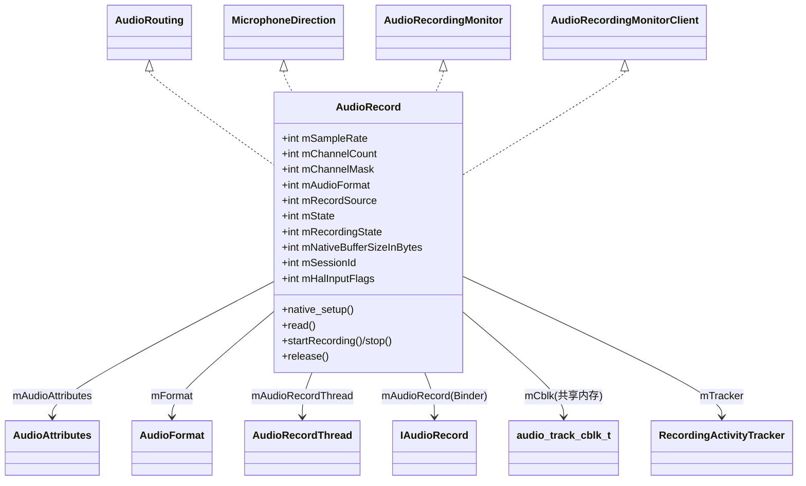

- [`AudioRecord`](frameworks/base/media/java/android/media/AudioRecord.java:96) — 实现AudioRouting + MicrophoneDirection + AudioRecordingMonitor
- **MicrophoneDirection** — 控制麦克风指向性（全向/心形/8字形）
- **AudioRecordingMonitor** — 录音监控接口（获取录音配置、设置回调）
- **RecordingActivityTracker** — 与AudioService通信录音活动状态（riid: recording interaction ID）

### 状态机

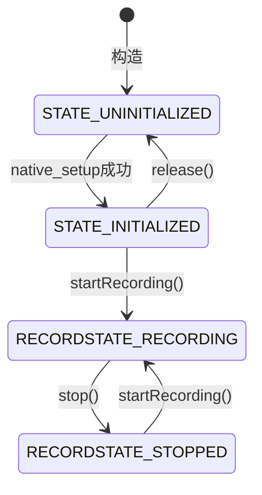

**状态常量**（[`AudioRecord.java:107-120`](frameworks/base/media/java/android/media/AudioRecord.java:107)）：

| 常量 | 值 | 说明 |
|------|-----|------|
| `STATE_UNINITIALIZED` | 0 | 初始化失败或已release |
| `STATE_INITIALIZED` | 1 | 可用状态 |
| `RECORDSTATE_STOPPED` | 1 | 匹配SL_RECORDSTATE_STOPPED |
| `RECORDSTATE_RECORDING` | 3 | 匹配SL_RECORDSTATE_RECORDING |

### 构造函数深度解析

#### native_setup参数传递（[`AudioRecord.java:477-480`](frameworks/base/media/java/android/media/AudioRecord.java:477)）

```java
int initResult = native_setup(
    new WeakReference<AudioRecord>(this),  // JNI回调引用
    mAudioAttributes,                       // 含capturePreset
    sampleRate,                             // 采样率（0=路由决定）
    mChannelMask,                           // 输入声道掩码
    mChannelIndexMask,                      // 索引式声道掩码
    mAudioFormat,                           // 编码格式
    mNativeBufferSizeInBytes,               // buffer大小
    session,                                // 输出：分配的session ID
    attributionSourceState,                 // 调用者身份
    0,                                      // nativeRecordInJavaObj
    maxSharedAudioHistoryMs,                // 共享历史时长
    mHalInputFlags                          // HAL flags
);
```

### AudioSource深度分类与策略影响

AudioSource不仅决定录音来源，更**直接影响AudioPolicy的路由决策和HAL预处理配置**：

| AudioSource | 值 | 场景 | HAL预处理 | 延迟优先 |
|-------------|-----|------|----------|---------|
| `DEFAULT` | 0 | 默认 | 等同MIC | — |
| `MIC` | 1 | 标准录音 | AGC+AEC+NS | — |
| `VOICE_UPLINK` | 2 | 通话上行 | 无 | — |
| `VOICE_DOWNLINK` | 3 | 通话下行 | 无 | — |
| `VOICE_CALL` | 4 | 通话双向 | 无 | — |
| `CAMCORDER` | 5 | 摄像录音 | **最少预处理** | 同步音视频 |
| `VOICE_RECOGNITION` | 6 | 语音识别 | **关闭AGC+AEC** | 低延迟 |
| `VOICE_COMMUNICATION` | 7 | VoIP通信 | **AEC+NS** | 极低延迟 |
| `REMOTE_SUBMIX` | 8 | 投屏捕获 | 无 | — |
| `UNPROCESSED` | 9 | 原始音频 | **无任何处理** | — |
| `ECHO_REFERENCE` | 12 | AEC参考 | 回声参考信号 | — |

> **关键设计**：
> - `VOICE_RECOGNITION`关闭AGC，语音识别算法需要原始音量变化信息
> - `VOICE_COMMUNICATION`启用AEC+NS，VoIP通话必须消除扬声器回声
> - `UNPROCESSED`完全不做信号处理，用于专业录音
> - `CAMCORDER`标记`AUDIO_FLAG_CAPTURE_PRIVATE`（[`AudioRecord.cpp:283`](frameworks/av/media/libaudioclient/AudioRecord.cpp:283)）

### Native层初始化 — createRecord_l()深度分析

[`AudioRecord.cpp:782-1035`](frameworks/av/media/libaudioclient/AudioRecord.cpp:782)

#### FAST flag检查与降级

```cpp
if (mFlags & AUDIO_INPUT_FLAG_FAST) {
    bool useCaseAllowed =
            (mTransfer == TRANSFER_CALLBACK) ||
            (mTransfer == TRANSFER_SYNC) ||      // 阻塞read也可获FAST
            (mTransfer == TRANSFER_OBTAIN);
    if (!useCaseAllowed) {
        mFlags &= ~(AUDIO_INPUT_FLAG_FAST | AUDIO_INPUT_FLAG_RAW);
    }
}
```

> **与AudioTrack的FAST flag差异**：AudioRecord的SYNC模式（阻塞read）也可获得FAST——AAudio app可从SCHED_FIFO线程做低延迟non-blocking read。

#### Binder IPC重试机制（AudioRecord独有）

```cpp
static const int32_t kMaxCreateAttempts = 3;
do {
    status = audioFlinger->createRecord(input, response);
    if (status == NO_ERROR) break;
    if (status != FAILED_TRANSACTION || --remainingAttempts <= 0) goto exit;
    usleep((20 + rand() % 30) * 10000);  // 随机20-50ms后重试
} while (1);
```

> **为什么需要重试？** AudioPolicyManager和AudioFlinger在input stream打开序列中可能出现竞态条件。AudioTrack没有此重试机制。

#### AudioFlinger::createRecord() FAST降级重试

[`AudioFlinger.cpp:2463-2546`](frameworks/av/services/audioflinger/AudioFlinger.cpp:2463)

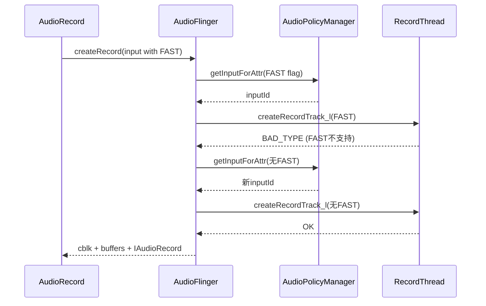

### read()数据读取机制

与AudioTrack的write()对称，但数据方向反转：

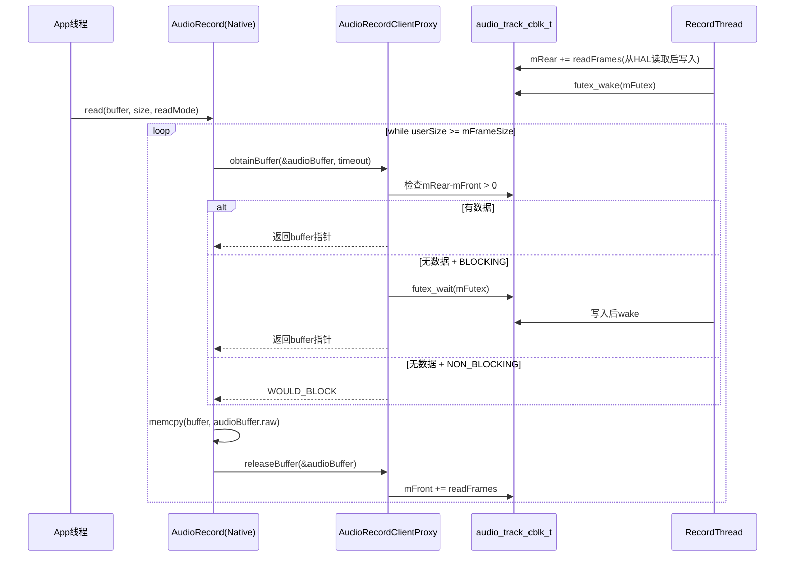

> **关键差异**：RecordThread是Producer（写mRear），App是Consumer（读mFront）。AudioTrack中方向相反。

### start()/stop()详解

#### start()（[`AudioRecord.cpp:420-501`](frameworks/av/media/libaudioclient/AudioRecord.cpp:420)）

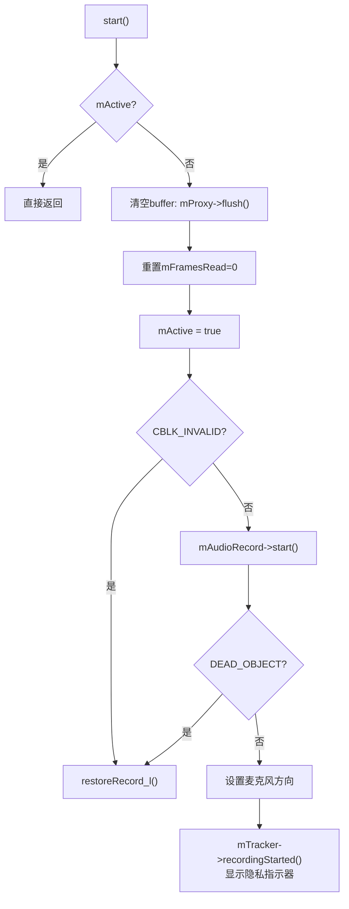

#### stop()（[`AudioRecord.cpp:503-540`](frameworks/av/media/libaudioclient/AudioRecord.cpp:503)）

```cpp
void AudioRecord::stop() {
    mActive = false;
    mProxy->interrupt();
    mAudioRecord->stop();             // Binder调用
    mTracker->recordingStopped();     // 关闭隐私指示器
}
```

### 与AudioTrack的对称架构对比

| 维度 | AudioTrack | AudioRecord |
|------|-----------|-------------|
| 数据方向 | App→HAL(写) | HAL→App(读) |
| 共享内存Producer | Client(写mRear) | Server(AF写mRear) |
| 共享内存Consumer | Server(AF读mFront) | Client(App读mFront) |
| AF Thread | PlaybackThread | RecordThread |
| APM路由 | getOutputForAttr | getInputForAttr |
| HAL接口 | StreamOutHal::write | StreamInHal::read |
| Flag类型 | AUDIO_OUTPUT_FLAG_* | AUDIO_INPUT_FLAG_* |
| Offload支持 | 有(DSP解码) | 无(必须PCM) |
| FAST降级重试 | 无 | 有 |
| 构造重试 | 无 | 有(kMaxCreateAttempts=3) |
| 隐私指示器 | 无 | 有(RecordingActivityTracker) |
| 麦克风控制 | 无 | 有(MicrophoneDirection) |

### 隐私与权限机制

AOSP14对录音隐私有严格管控：

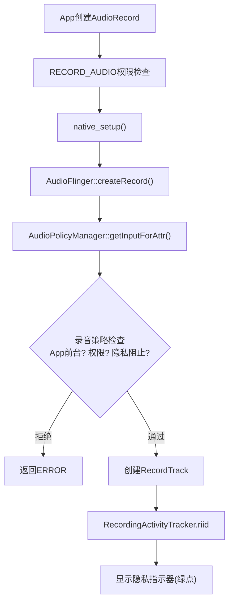

**RecordingActivityTracker**（riid）机制：
- 每个AudioRecord分配唯一riid（Recording Interaction ID）
- 传递给AudioService追踪哪个App正在录音
- 状态栏显示绿色麦克风图标
- stop()时`recordingStopped()`取消指示器

### 常见问题源码定位

| 问题 | 根因 | 源码定位 | 排查方法 |
|------|------|----------|----------|
| read()返回WOULD_BLOCK | FIFO空 | [`AudioRecord.java:1825`](frameworks/base/media/java/android/media/AudioRecord.java:1825) | 检查RecordThread是否正常读HAL |
| ERROR_DEAD_OBJECT | AF重启 | [`AudioRecord.cpp:469`](frameworks/av/media/libaudioclient/AudioRecord.cpp:469) | 检查logcat AudioFlinger crash |
| FAILED_TRANSACTION | APM/AF竞态 | [`AudioRecord.cpp:855`](frameworks/av/media/libaudioclient/AudioRecord.cpp:855) | 自动重试3次 |
| FAST input被拒 | HAL不支持 | [`AudioFlinger.cpp:2510`](frameworks/av/services/audioflinger/AudioFlinger.cpp:2510) | 检查HAL FAST input声明 |
| 录音无声 | 路由到错误设备 | [`AudioFlinger.cpp:2472`](frameworks/av/services/audioflinger/AudioFlinger.cpp:2472) | dumpsys audio查看input路由 |
| 隐私指示器不消失 | stop()未调用 | [`AudioRecord.cpp:522`](frameworks/av/media/libaudioclient/AudioRecord.cpp:522) | 确保所有AudioRecord调用了stop() |

---

## 2.3 AudioManager — 音频管理中枢

### 模块职责

AudioManager是应用层访问音频系统服务的统一入口，封装了音量控制、设备管理、焦点请求、铃声模式等所有音频策略操作。

**源码位置**：[`AudioManager.java`](frameworks/base/media/java/android/media/AudioManager.java)

### 核心方法分类

| 功能域 | 方法 | Binder目标 | 说明 |
|--------|------|-----------|------|
| 音量控制 | `adjustVolume()` / `setStreamVolume()` | AudioService → AudioPolicyService | 硬件音量键最终调到这里 |
| 焦点请求 | `requestAudioFocus()` / `abandonAudioFocus()` | AudioService → MediaFocusControl | 所有播放App必须请求焦点 |
| 设备管理 | `setWiredDeviceConnectionState()` | AudioService → AudioPolicyService | 耳机/USB插拔事件 |
| 铃声模式 | `setRingerMode()` / `getRingerMode()` | AudioService | 静音/振动/正常 |
| 蓝牙 | `startBluetoothSco()` / `isBluetoothA2dpOn()` | AudioService → AudioDeviceBroker | SCO通话/A2DP音乐 |
| 播放配置 | `getActivePlaybackConfigurations()` | AudioService → PlaybackActivityMonitor | 返回正在播放的AudioTrack信息 |
| 录音配置 | `getActiveRecordingConfigurations()` | AudioService → RecordingActivityMonitor | 返回正在录音的AudioRecord信息 |
| 设备偏好 | `setPreferredDeviceForPlayback()` | AudioPolicyService | App指定输出设备偏好 |
| 空间音频 | `setSpatializerEnabled()` | AudioService → SpatializerHelper | AOSP12新增空间音频 |
| 听力保护 | `setSafeVolumeState()` | AudioService → SoundDoseHelper | AOSP14新增CSD(听力剂量) |

### AudioManager内部架构

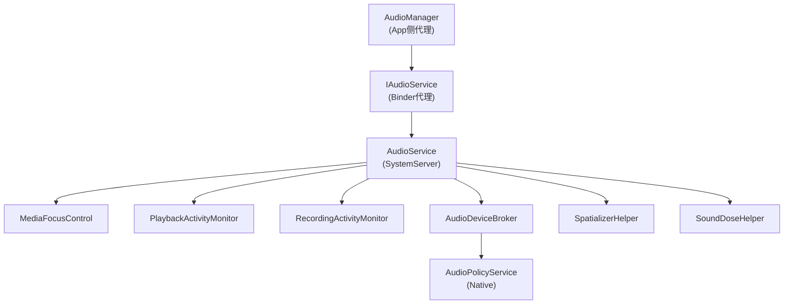

### 版本演进关键变更

| 版本 | 关键API变更 | 影响 |
|------|-------------|------|
| Android 5.0 | AudioAttributes替代stream type | 焦点/路由决策更精细 |
| Android 8.0 | AudioFocusRequest.Builder + AAudio | 焦点请求更安全；新增低延迟API |
| Android 9.0 | AudioPlaybackConfiguration/RecordingConfiguration | 隐私管控：App可监测其他App录音 |
| Android 11 | AudioProductStrategy API | 路由策略可由App查询 |
| Android 12 | Spatializer API | 空间音频控制 |
| Android 13 | VolumeInfo API | 更精细的音量查询 |
| Android 14 | SoundDose API | CSD听力保护，超过80dBA限制时长 |

---

## 2.4 AudioFocusRequest — 焦点请求模型

### 模块职责

封装音频焦点请求参数，包括焦点类型、音频属性、焦点变化监听器和控制标志。

**源码位置**：[`AudioFocusRequest.java`](frameworks/base/media/java/android/media/AudioFocusRequest.java)

### 焦点类型与交互矩阵

| 类型 | 值 | 持续性 | 典型场景 | 对其他App的影响 |
|------|-----|--------|----------|----------------|
| `AUDIOFOCUS_GAIN` | 1 | 永久 | 音乐播放 | 其他GAIN→LOSS |
| `GAIN_TRANSIENT` | 2 | 暂时 | 语音助手 | GAIN→LOSS_TRANSIENT |
| `GAIN_TRANSIENT_MAY_DUCK` | 3 | 暂时(可duck) | 通知提示 | GAIN→LOSS_TRANSIENT_CAN_DUCK |
| `GAIN_TRANSIENT_EXCLUSIVE` | 4 | 暂时(独占) | 语音识别 | 所有→LOSS_TRANSIENT |

### 焦点交互矩阵（MediaFocusControl核心决策）

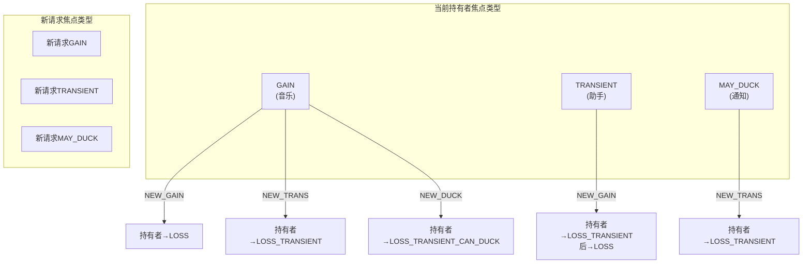

### Builder关键参数

```java
AudioFocusRequest request = new AudioFocusRequest.Builder(AudioManager.AUDIOFOCUS_GAIN)
    .setAudioAttributes(attributes)           // 必须设置
    .setOnAudioFocusChangeListener(listener)   // 必须设置
    .setAcceptsDelayedFocusGain(true)          // 延迟焦点：暂时无法获得时排队
    .setWillPauseWhenDucked(true)              // ducking时暂停而非降低音量
    .setFocusGainOnFocusLoss(true)             // 焦点丢失后自动重新请求
    .build();
```

> **延迟焦点机制**：当电话通话占用焦点时，新的GAIN请求会排队等待。电话结束后，排队者自动获得焦点。这避免了"请求焦点→失败→反复请求"的恶性循环。

> **WillPauseWhenDucked**：默认ducking行为是降低音量（~30%）。设置此标志后，ducking时App会收到`LOSS_TRANSIENT_CAN_DUCK`但选择暂停而非降低音量。适用于播客、有声书等场景——降低音量不如暂停。

---

## 2.5 AAudio — 低延迟音频API

### 模块职责

AAudio是Android 8.0引入的C语言低延迟音频API，专为专业音频和低延迟场景设计。内部根据设备能力自动选择MMAP路径或传统AudioTrack/AudioRecord路径。

**源码位置**：
- C API：[`aaudio/AAudio.h`](frameworks/av/media/libaaudio/include/aaudio/AAudio.h)
- 内部实现：[`frameworks/av/media/libaaudio/`](frameworks/av/media/libaaudio/)

### 核心流程

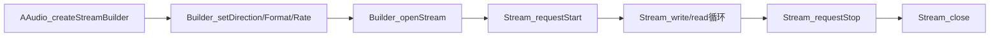

### AAudio vs OpenSL ES vs AudioTrack

| 维度 | AAudio | OpenSL ES | AudioTrack(Java) |
|------|--------|-----------|-----------------|
| 语言 | C/C++ | C | Java |
| 延迟 | 极低(MMAP) | 低 | 普通 |
| API复杂度 | 简单 | 复杂 | 中等 |
| MMAP支持 | 是 | 否 | 否(内部使用) |
| 状态 | **推荐使用** | 已弃用 | 通用场景 |
| Stream重建 | 自动(ErrorCallback) | 手动 | 手动(restoreTrack_l) |

### MMAP_NOIRQ模式深度解析

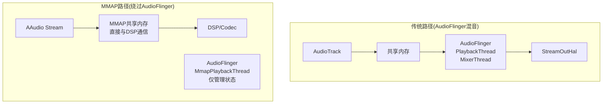

**MMAP_NOIRQ关键特征**：
- 音频数据直接在App与DSP之间通过共享内存传输，**完全绕过AudioFlinger混音**
- 延迟可降至<10ms（传统路径通常20-50ms）
- 使用`mmap()`映射HAL提供的共享内存buffer
- **NOIRQ**：无中断模式，App通过polling读取位置而非等待中断
- AudioFlinger侧对应`MmapPlaybackThread/MmapCaptureThread`，仅管理生命周期和状态，不混音
- 仅在HAL声明支持MMAP时可用，需要在`audio_policy_configuration.xml`中配置`mmapPolicy="auto"`
- AAudio内部自动选择：MMAP可用→MMAP路径，不可用→降级到AudioTrack路径

### ErrorCallback与Stream重建

AAudio的独特设计：当Stream遇到错误（如设备断开），通过ErrorCallback通知App，App可以重建Stream：

```c
aaudio_stream_builder_setErrorCallback(builder, errorCallback, userData);

void errorCallback(AAudioStream *stream, void *userData, aaudio_result_t error) {
    // 在AAudio内部线程调用，不能直接操作Stream
    // 需要通知App线程去重建Stream
    aaudio_stream_requestStop(stream);  // 安全操作
    // 通知App线程重新openStream
}
```

> **与AudioTrack的DEAD_OBJECT对比**：AudioTrack内部自动restoreTrack_l()，AAudio则将重建决策交给App——因为AAudio的Stream配置可能需要调整（如切换设备后采样率变化），App比框架层更适合决定如何重建。

---

## 2.6 AudioEffect — 音效控制API

### 模块职责

AudioEffect是音效控制的基类API，应用通过其子类控制音频效果处理。

**源码位置**：
- Java层：[`AudioEffect.java`](frameworks/base/media/java/android/media/AudioEffect.java)
- Native层：[`AudioEffect.cpp`](frameworks/av/media/libaudioclient/AudioEffect.cpp)
- AudioFlinger侧：[`Effects.h`](frameworks/av/services/audioflinger/Effects.h)

### 子类体系

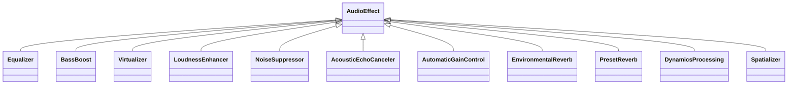

### 音效UUID机制与EffectChain

每个音效有唯一UUID：
- **type UUID**: 标识音效类型（如均衡器、低音增强）
- **implementation UUID**: 标识具体实现（Vendor自定义）

音效通过sessionId附加到AudioTrack/AudioRecord，AudioFlinger按sessionId组织EffectChain：

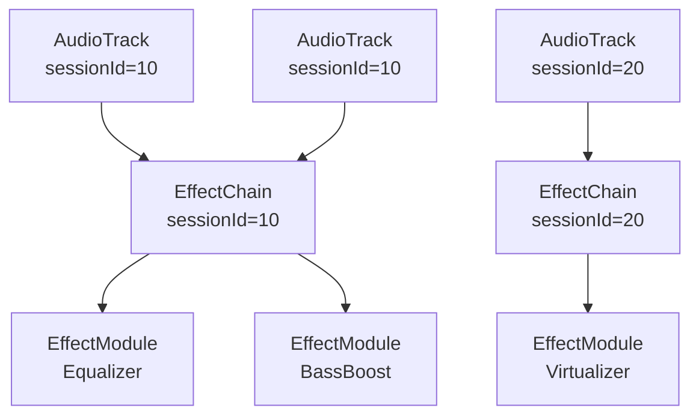

> **EffectChain在同一Thread上共享**：同一sessionId的多个AudioTrack共享同一EffectChain，避免重复处理。EffectModule的process()函数在PlaybackThread的threadLoop_mix()之后调用。

### 音效附加方式

| 方式 | 说明 | 场景 |
|------|------|------|
| SESSION_ID | 通过AudioTrack/AudioRecord的sessionId附加 | 最常见 |
| OUTPUT | 附加到特定输出流（全局效果） | 系统级音效 |
| AUX | 作为辅助效果发送 | 环绕声等 |

---

## 2.7 MediaPlayer — 多媒体播放器

### 模块职责

MediaPlayer是Android最常用的多媒体播放API，支持音视频文件/流媒体播放。内部通过Native MediaPlayerService调用Codec解码，最终创建AudioTrack输出PCM音频。

**源码位置**：
- Java层：[`MediaPlayer.java`](frameworks/base/media/java/android/media/MediaPlayer.java:579)
- Native层：[`mediaplayer.cpp`](frameworks/av/media/libmedia/mediaplayer.cpp)

### 与AudioTrack的关系

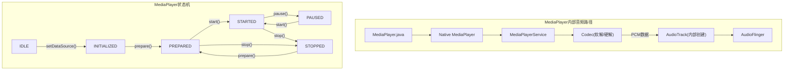

**关键点**：MediaPlayer内部自动创建AudioTrack，App无需直接操作AudioTrack。AudioAttributes通过`setAudioAttributes()`传递给内部AudioTrack。

---

## 2.8 SoundPool — 短音效播放

### 模块职责

SoundPool专为短音效(游戏音效/通知音/按键音)设计，支持多音效同时播放、优先级管理和低延迟触发。

**源码位置**：[`SoundPool.java`](frameworks/base/media/java/android/media/SoundPool.java:117)

### SoundPool vs AudioTrack

| 维度 | SoundPool | AudioTrack |
|------|-----------|------------|
| 用途 | 短音效(< 5s) | 任意长度音频流 |
| 加载 | 预加载到内存 | 流式写入 |
| 同时播放 | 多个音效并发 | 一个流 |
| 延迟 | 极低(预加载) | 较低(流式) |
| 内存 | 解码后PCM存内存 | 共享内存FIFO |
| 解码 | 加载时解码 | App自行解码 |

### 内部实现

```mermaid
flowchart TB
    LOAD["SoundPool.load()"] --> DECODE["解码音频文件→PCM"]
    DECODE --> CACHE["缓存PCM到内存<br/>(SoundPool内部管理)"]
    PLAY["SoundPool.play()"] --> LOOKUP["从缓存查找PCM"]
    LOOKUP --> AT_CREATE["创建/复用AudioTrack"]
    AT_CREATE --> WRITE["直接写入PCM(无FIFO等待)"]
```

> **注意**: SoundPool继承PlayerBase，同样受PlaybackActivityMonitor管理，可被焦点系统duck/fadeout。

---

## 2.9 MediaRecorder — 音视频录制

### 模块职责

MediaRecorder提供音视频录制的高层API，内部通过AudioRecord采集PCM数据，经Codec编码后写入文件。

**源码位置**：[`MediaRecorder.java`](frameworks/base/media/java/android/media/MediaRecorder.java:101)

### 与AudioRecord的关系

```mermaid
flowchart TB
    subgraph "MediaRecorder内部音频路径"
        MR["MediaRecorder.java"] --> NMR["Native MediaRecorder"]
        NMR --> MRS["MediaRecorderService"]
        MRS --> AR["AudioRecord(内部创建)"]
        AR -->|"PCM数据"| CODEC["Codec(编码)"]
        CODEC --> FILE["写入文件/网络流"]
    end

    subgraph "MediaRecorder状态机"
        INIT["INITIAL"] -->|"setAudioSource()"| SRC_SET["DATASOURCE_CONFIGURED"]
        SRC_SET -->|"setOutputFormat()"| SRC_SET
        SRC_SET -->|"setAudioEncoder()"| SRC_SET
        SRC_SET -->|"prepare()"| PREPARED2["PREPARED"]
        PREPARED2 -->|"start()"| RECORDING["RECORDING"]
        RECORDING -->|"stop()"| SRC_SET
    end
```

**AudioSource类型**:
| AudioSource | 用途 | 说明 |
|-------------|------|------|
| DEFAULT | 默认 | 自动选择 |
| MIC | 麦克风 | 直接采集 |
| VOICE_UPLINK/DOWNLINK | 通话上行/下行 | 需要权限 |
| VOICE_CALL | 通话双向 | 需要权限 |
| CAMCORDER | 摄像头同步 | 随摄像头 |
| VOICE_RECOGNITION | 语音识别 | 优化降噪 |
| VOICE_COMMUNICATION | VoIP通话 | AEC+NS |

---

## 2.10 ExoPlayer调用路径

### 模块职责

ExoPlayer是Google开源的媒体播放器库(非AOSP原生，但在Android生态广泛使用)，提供比MediaPlayer更灵活的播放能力(DASH/HLS/自适应码率)。

### ExoPlayer→AudioTrack路径

```mermaid
flowchart TB
    subgraph "ExoPlayer音频路径"
        EP["ExoPlayer"] --> RENDERER["AudioRenderer"]
        RENDERER --> DECODER["Decoder(软解/硬解)"]
        DECODER --> PCM_OUT["PCM数据输出"]
        PCM_OUT --> AUDIO_SINK["AudioSink接口"]
        AUDIO_SINK --> AT_J["AudioTrack(Java)"]
        AT_J --> JNI2["JNI"]
        JNI2 --> AT_N2["AudioTrack(Native)"]
        AT_N2 --> AF2["AudioFlinger"]
    end
```

**关键区别**:
- ExoPlayer直接创建AudioTrack，绕过MediaPlayer/MediaPlayerService
- AudioTrack的AudioAttributes由ExoPlayer根据ContentMetadata设置
- ExoPlayer自行管理buffer策略(可通过`setBufferSize()`优化延迟)
- 支持Offload模式(压缩码流直传DSP)通过`AudioTrack.setOffloadMode()`

---

## 2.11 OpenSL ES API

### 模块职责

OpenSL ES是Khronos标准的Native音频API，从Android 2.3引入，AOSP14中仍可用但推荐迁移到AAudio。

**源码位置**：[`opensles/`](frameworks/wilhelm/src)

### OpenSL ES→AudioTrack路径

```mermaid
flowchart TB
    subgraph "OpenSL ES音频路径"
        SLES["OpenSL ES API<br/>(SLES/OpenSLES_Android.h)"] --> ENGINE["SLObjectItf<br/>slCreateEngine()"]
        ENGINE --> MIXER["SLEngineItf<br/>CreateOutputMix()"]
        MIXER --> PLAYER["SLPlayItf<br/>CreateAudioPlayer()"]
        PLAYER --> AT_NATIVE["AudioTrack(Native)<br/>(libaudioclient)"]
        AT_NATIVE --> AF3["AudioFlinger"]
    end
```

**OpenSL ES与AAudio对比**:
| 维度 | OpenSL ES | AAudio |
|------|-----------|--------|
| 引入版本 | Android 2.3 | Android 8.1 |
| API语言 | C | C |
| 低延迟支持 | FAST路径 | MMAP路径 |
| API复杂度 | 高(回调+队列) | 低(流式读写) |
| 推荐度 | 旧项目维护 | **新项目推荐** |
| 未来方向 | 维护模式 | 持续演进 |

> **迁移建议**: AAudio的API更简洁，MMAP模式延迟更低(<3ms vs ~10ms)。OpenSL ES仍可用但不推荐新项目使用。

---

> [← 上一篇：架构总论](01_Architecture_Overview.md) | [返回导航](README.md) | [下一篇：Java Framework →](03_Java_Framework_Layer.md)