# 第二篇：Application Layer — 应用层API深度解析

> [← 上一篇：架构总论](01_Architecture_Overview.md) | [返回导航](README.md) | [下一篇：Java Framework →](03_Java_Framework_Layer.md)

---

## 2.1 AudioTrack — 播放核心API深度解析

### 模块职责

AudioTrack是Android应用层音频播放的核心API，支持PCM原始音频数据的流式输出。它是所有播放场景的底层基础——MediaPlayer、SoundPool、AAudio内部均创建AudioTrack实例。

**源码位置**：
- Java层：[`AudioTrack.java`](frameworks/base/media/java/android/media/AudioTrack.java)
- JNI层：[`android_media_AudioTrack.cpp`](frameworks/base/core/jni/android_media_AudioTrack.cpp)
- Native层：[`AudioTrack.cpp`](frameworks/av/media/libaudioclient/AudioTrack.cpp)
- 共享内存结构：[`AudioTrackShared.h`](frameworks/av/include/private/media/AudioTrackShared.h)

### 核心类关系

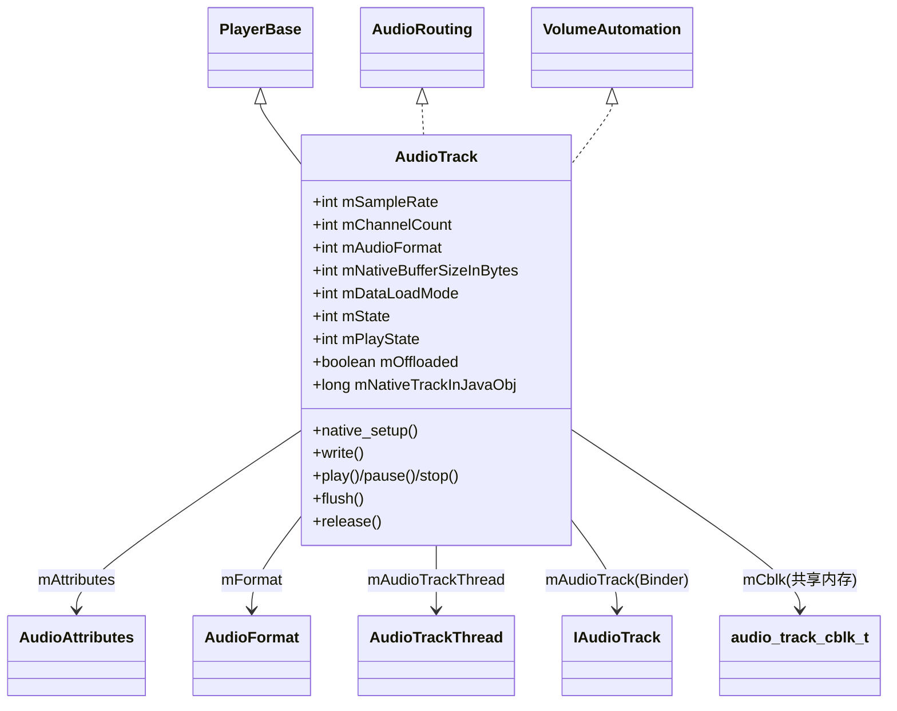

- [`AudioTrack`](frameworks/base/media/java/android/media/AudioTrack.java:97) — 继承PlayerBase，实现AudioRouting + VolumeAutomation
- **PlayerBase** — 媒体会话管理基类，与AudioManager交互音量/焦点
- **AudioRouting** — 路由控制接口，指定输出设备
- **VolumeAutomation** — 自动音量控制接口（ducking等）
- **AudioTrackThread** — 回调模式下的内部线程，驱动`processAudioBuffer()`
- **IAudioTrack** — Binder代理，指向AudioFlinger中的TrackHandle

### 完整状态机（含Offload特殊状态）

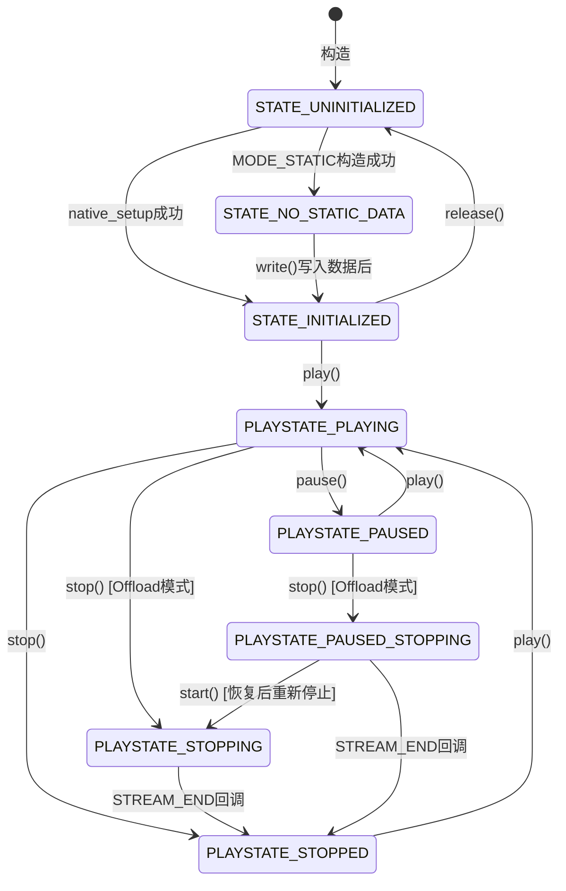

**状态常量详解**（定义于 [`AudioTrack.java:113-125`](frameworks/base/media/java/android/media/AudioTrack.java:113)）：

| 常量 | 值 | 说明 | 适用场景 |
|------|-----|------|----------|
| `PLAYSTATE_STOPPED` | 1 | 匹配SL_PLAYSTATE_STOPPED | 所有模式 |
| `PLAYSTATE_PAUSED` | 2 | 暂停状态 | 所有模式 |
| `PLAYSTATE_PLAYING` | 3 | 正在播放 | 所有模式 |
| `PLAYSTATE_STOPPING` | 4 | **Offload专用**，等待DSP渲染完成 | 仅Offload |
| `PAUSED_STOPPING` | 5 | **Offload专用**，暂停中请求停止 | 仅Offload |

> **Offload模式为什么需要STOPPING/PAUSED_STOPPING？**
> Offload模式下，压缩音频数据直接发送到DSP解码播放。当App调用stop()时，DSP可能还有未解码完的数据，不能立即停止。因此AudioTrack进入STOPPING状态，等待DSP渲染完成后通过`NATIVE_EVENT_STREAM_END`回调才真正进入STOPPED。如果在STOPPING期间调用start()，状态回退到PLAYING；如果再调用stop()，则进入PAUSED_STOPPING。

### 构造函数深度解析

AudioTrack使用Builder模式构造，Builder.build()内部逻辑（[`AudioTrack.java:1376-1461`](frameworks/base/media/java/android/media/AudioTrack.java:1376)）：

#### PerformanceMode与输出Flag的映射关系

这是AudioTrack最核心的设计之一，决定了音频走FastMixer还是NormalMixer路径：

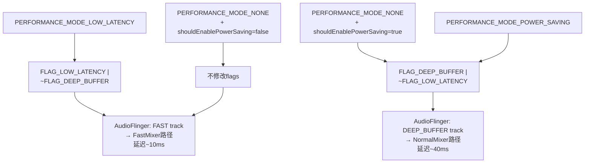

**源码实现**（[`AudioTrack.java:1382-1402`](frameworks/base/media/java/android/media/AudioTrack.java:1382)）：

```java
switch (mPerformanceMode) {
case PERFORMANCE_MODE_LOW_LATENCY:
    mAttributes = new AudioAttributes.Builder(mAttributes)
        .replaceFlags((mAttributes.getAllFlags()
                | AudioAttributes.FLAG_LOW_LATENCY)
                & ~AudioAttributes.FLAG_DEEP_BUFFER)
        .build();
    break;
case PERFORMANCE_MODE_NONE:
    if (!shouldEnablePowerSaving(...)) {
        break; // 不启用deep buffer
    }
    // fall through
case PERFORMANCE_MODE_POWER_SAVING:
    mAttributes = new AudioAttributes.Builder(mAttributes)
        .replaceFlags((mAttributes.getAllFlags()
                | AudioAttributes.FLAG_DEEP_BUFFER)
                & ~AudioAttributes.FLAG_LOW_LATENCY)
        .build();
    break;
}
```

**shouldEnablePowerSaving()决策逻辑**（[`AudioTrack.java:680-720`](frameworks/base/media/java/android/media/AudioTrack.java:680)）：

满足以下**所有**条件时启用Power Saving（DEEP_BUFFER）：
1. 传输模式为MODE_STREAM
2. 采样率为0或44100/48000等标准率
3. 格式为PCM 16bit
4. ChannelMask为STEREO或MONO
5. bufferSize >= `getMinBufferSize() * 2`

> **设计原理**：大buffer + PCM标准格式 = 不需要低延迟，可以走DEEP_BUFFER路径让AudioFlinger使用更大的buffer来减少CPU唤醒次数，从而省电。游戏、交互式音频则走LOW_LATENCY路径牺牲功耗换延迟。

#### Offload兼容性检查

Builder中对Offload模式有严格的兼容性检查（[`AudioTrack.java:1420-1430`](frameworks/base/media/java/android/media/AudioTrack.java:1420)）：

```java
if (mOffload) {
    if (mPerformanceMode == PERFORMANCE_MODE_LOW_LATENCY) {
        throw new UnsupportedOperationException(
                "Offload and low latency modes are incompatible");
    }
    if (AudioSystem.getDirectPlaybackSupport(mFormat, mAttributes)
            == AudioSystem.DIRECT_NOT_SUPPORTED) {
        throw new UnsupportedOperationException(
                "Cannot create AudioTrack, offload format / attributes not supported");
    }
}
```

> **为什么Offload和LOW_LATENCY不兼容？** Offload需要DSP解码，DSP解码本身就是有延迟的（通常数十到数百毫秒），追求低延迟没有意义。LOW_LATENCY需要FastMixer路径，而Offload走的是DirectOutputThread。

#### 构造函数→native_setup参数传递

构造函数最终调用native_setup（[`AudioTrack.java:870-900`](frameworks/base/media/java/android/media/AudioTrack.java:870)）：

| Java参数 | Native接收 | 说明 |
|----------|-----------|------|
| `WeakReference<AudioTrack>` | jobject | 用于JNI回调Java层 |
| `mAttributes` | audio_attributes_t | usage/contentType/flags/tags |
| `sampleRate` | uint32_t | 请求采样率，0=由系统决定 |
| `mChannelMask` | audio_channel_mask_t | 输出声道掩码 |
| `mChannelIndexMask` | audio_channel_mask_t | 索引式声道掩码（AOSP14新增） |
| `mAudioFormat` | audio_format_t | 编码格式 |
| `mNativeBufferSizeInBytes` | size_t | App侧buffer大小（字节） |
| `mDataLoadMode` | transfer_type | MODE_STATIC→TRANSFER_SHARED, MODE_STREAM→TRANSFER_SYNC |
| `session` | audio_session_t[] | 输出：分配的session ID |
| `attributionSource` | AttributionSource | 调用者UID/PID/包名 |
| `offload` | bool | 是否Offload模式 |
| `encapsulationMode` | int | 封装模式（广播/TV用） |
| `tunerConfiguration` | TunerConfiguration | Tuner配置（TV用） |

### Native层初始化全流程

#### AudioTrack::set()（[`AudioTrack.cpp:425-620`](frameworks/av/media/libaudioclient/AudioTrack.cpp:425)）

set()是Native AudioTrack的核心初始化函数，完成以下工作：

1. **参数校验**：format/channelMask/frameCount合法性检查
2. **Transfer Type决策**：
   - `TRANSFER_DEFAULT` → 有callback时用TRANSFER_CALLBACK，否则用TRANSFER_SYNC
   - `TRANSFER_CALLBACK` → 创建AudioTrackThread
   - `TRANSFER_SYNC` → 由App线程直接write
   - `TRANSFER_SHARED` → MODE_STATIC模式
   - `TRANSFER_OBTAIN` → obtainBuffer/releaseBuffer模式
3. **调用createTrack_l()** → 与AudioFlinger建立连接

#### createTrack_l()深度分析（[`AudioTrack.cpp:1807-1980`](frameworks/av/media/libaudioclient/AudioTrack.cpp:1807)）

这是AudioTrack与AudioFlinger建立连接的核心函数，执行Binder IPC并建立共享内存：

**Step 1: FAST flag资格检查**

```cpp
// FAST flag不是无条件满足的，必须满足特定传输模式
if (mFlags & AUDIO_OUTPUT_FLAG_FAST) {
    bool useCaseAllowed =
            // 场景1: callback传输模式
            (mTransfer == TRANSFER_CALLBACK) ||
            // 场景2: 同步write（阻塞读）模式
            (mTransfer == TRANSFER_SYNC) ||
            // 场景3: obtain/release模式
            (mTransfer == TRANSFER_OBTAIN);
    if (!useCaseAllowed) {
        ALOGD("AUDIO_OUTPUT_FLAG_FAST denied, incompatible transfer = %s");
        mFlags = (audio_output_flags_t)(mFlags & ~AUDIO_OUTPUT_FLAG_FAST);
    }
}
```

> **FAST flag被拒绝的后果**：AudioTrack仍可正常工作，但走NormalMixer路径而非FastMixer，延迟从~10ms增加到~40ms。

**Step 2: 构造CreateTrackInput**

```cpp
input.attr = mAttributes;               // AudioAttributes
input.config.sample_rate = mSampleRate;
input.config.channel_mask = mChannelMask;
input.config.format = mFormat;
input.clientInfo.attributionSource = mClientAttributionSource;
input.clientInfo.clientTid = -1;        // FAST时传递AudioTrackThread TID
input.sharedBuffer = mSharedBuffer;      // MODE_STATIC时有值
input.flags = mFlags;
input.frameCount = mReqFrameCount;
input.sessionId = mSessionId;
```

**Step 3: Binder IPC调用**

```cpp
status = audioFlinger->createTrack(
    VALUE_OR_FATAL(input.toAidl()), response);
```

此调用触发AudioFlinger侧的完整Track创建流程（详见[第五篇](05_AudioFlinger.md)）。

**Step 4: 解析CreateTrackOutput**

AudioFlinger返回的关键参数：

| 输出参数 | 说明 | 影响App行为 |
|----------|------|------------|
| `frameCount` | 实际分配的帧数 | 可能≥请求值（AudioFlinger会向上取整） |
| `notificationFrameCount` | 实际通知周期 | 影响callback频率 |
| `selectedDeviceId` | 实际路由设备 | App可查询getRoutedDevice() |
| `sessionId` | 分配的session ID | 用于关联Effect |
| `sampleRate` | 实际采样率 | 可能与请求不同 |
| `afFrameCount` | AudioFlinger buffer帧数 | 用于延迟计算 |
| `afSampleRate` | AudioFlinger采样率 | 用于延迟计算 |
| `afLatency` | AudioFlinger延迟(ms) | 用于延迟计算 |
| `flags` | 实际分配的flags | FAST是否被批准 |

**Step 5: 共享内存映射**

```cpp
sp<IMemory> cblk = output.cblk;
iMemPointer = cblk->unsecurePointer();
mCblk = static_cast<audio_track_cblk_t*>(iMemPointer);

// buffer位置：紧跟cblk之后或独立区域
void *buffers;
if (output.buffers == 0) {
    buffers = mCblk + 1;  // cblk紧后面
} else {
    buffers = output.buffers->unsecurePointer();
}
```

**Step 6: 构造Proxy对象**

```cpp
// Streaming模式
mProxy = new AudioTrackClientProxy(cblk, buffers, frameCount, mFrameSize);
// Static模式
mProxy = new StaticAudioTrackClientProxy(cblk, buffers, frameCount, mFrameSize);
```

### write()数据写入机制深度解析

AudioTrack的write()方法是应用写入音频数据的核心入口（[`AudioTrack.cpp:2310-2375`](frameworks/av/media/libaudioclient/AudioTrack.cpp:2310)）：

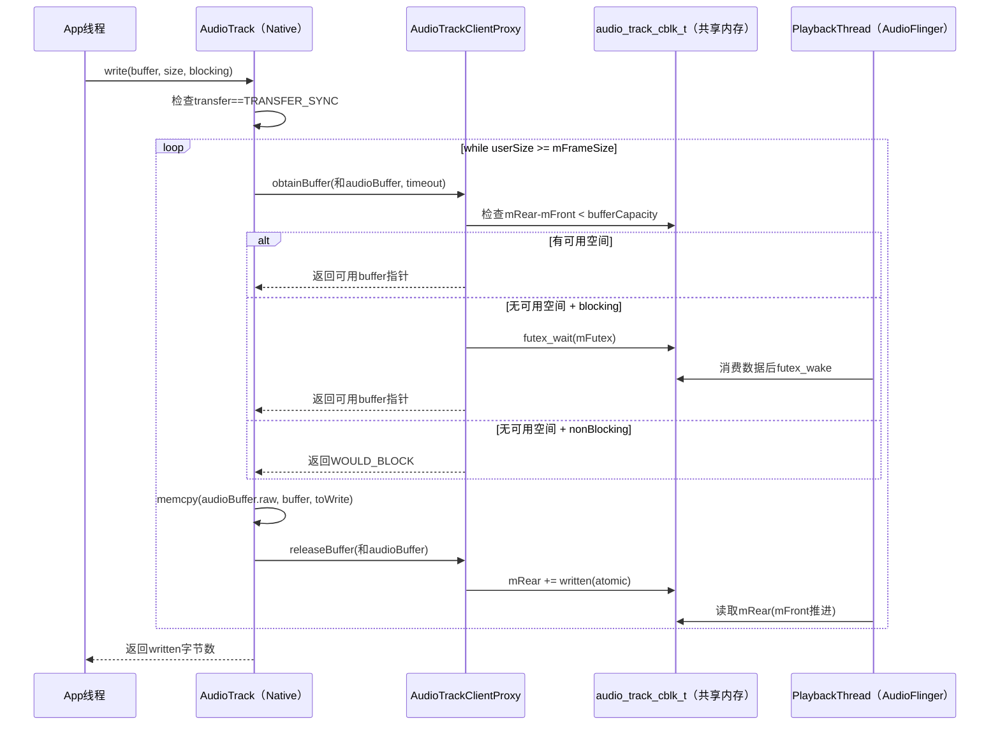

**关键代码**（[`AudioTrack.cpp:2337-2359`](frameworks/av/media/libaudioclient/AudioTrack.cpp:2337)）：

```cpp
while (userSize >= mFrameSize) {
    audioBuffer.frameCount = userSize / mFrameSize;
    status_t err = obtainBuffer(&audioBuffer,
            blocking ? &ClientProxy::kForever : &ClientProxy::kNonBlocking);
    if (err < 0) {
        if (written > 0) break;
        if (err == TIMED_OUT || err == -EINTR) err = WOULD_BLOCK;
        return ssize_t(err);
    }
    size_t toWrite = audioBuffer.size();
    memcpy(audioBuffer.raw, buffer, toWrite);  // 数据拷贝到共享内存
    buffer = ((const char *)buffer) + toWrite;
    userSize -= toWrite;
    written += toWrite;
    releaseBuffer(&audioBuffer);  // 更新mRear指针
}
```

### 共享内存FIFO结构 — audio_track_cblk_t

这是AudioTrack零拷贝机制的核心数据结构（[`AudioTrackShared.h:207-279`](frameworks/av/include/private/media/AudioTrackShared.h:207)）：

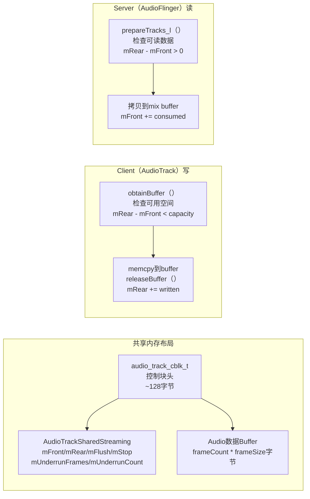

**Streaming模式核心字段**（[`AudioTrackShared.h:134-145`](frameworks/av/include/private/media/AudioTrackShared.h:134)）：

| 字段 | 类型 | 写入者 | 说明 |
|------|------|--------|------|
| `mFront` | volatile int32_t | Server(AudioFlinger) | 已消费位置，环形缓冲区前端 |
| `mRear` | volatile int32_t | Client(AudioTrack) | 已写入位置，环形缓冲区后端 |
| `mFlush` | volatile int32_t | Client | flush计数器，Server检测到后丢弃数据 |
| `mStop` | volatile int32_t | Client | stop位置，Server不读超过此位置 |
| `mUnderrunFrames` | volatile uint32_t | Server | 累计underrun帧数 |
| `mUnderrunCount` | volatile uint32_t | Server | underrun次数 |

**cblk_t头部核心字段**（[`AudioTrackShared.h:225-270`](frameworks/av/include/private/media/AudioTrackShared.h:225)）：

| 字段 | 说明 |
|------|------|
| `mServer` | Server已消费帧数（异步更新，仅供参考） |
| `mFutex` | 事件标志，Client等待(P)/Server唤醒(V) |
| `mMinimum` | Server唤醒Client的最低可用空间阈值 |
| `mVolumeLR` | 立体声音量（AudioTrack专用） |
| `mSampleRate` | Client请求的采样率 |
| `mPlaybackRateQueue` | 播放速率状态队列（变速播放） |
| `mSendLevel` | 辅助效果发送电平 |
| `mExtendedTimestampQueue` | 扩展时间戳队列 |
| `mBufferSizeInFrames` | 有效buffer大小（可动态调整） |
| `mStartThresholdInFrames` | 开始播放的最小帧数阈值 |
| `mFlags` | CBLK_*标志组合 |
| `mState` | TrackBase当前状态（atomic） |

> **零拷贝原理**：AudioTrack.write()通过memcpy将数据写入共享内存，AudioFlinger的PlaybackThread直接从同一块共享内存读取数据混音，无需额外的数据拷贝。mFront/mRear使用volatile + atomic操作保证多进程同步的正确性。

### start()/stop()状态转换详解

#### start()内部实现（[`AudioTrack.cpp:782-920`](frameworks/av/media/libaudioclient/AudioTrack.cpp:782)）

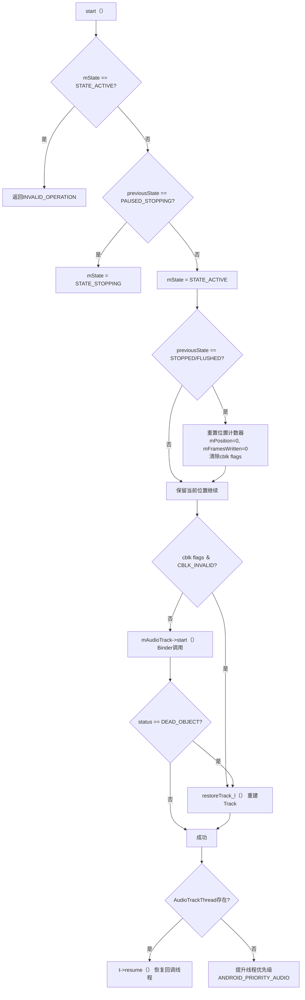

**关键细节**：
- `mInUnderrun = true`：start后首次write前标记为underrun状态
- CBLK_INVALID检查：如果Track因设备切换等原因失效，需要通过`restoreTrack_l()`重建
- DEAD_OBJECT处理：AudioFlinger重启后Binder代理失效，触发Track重建
- 优先级提升：非callback模式下，start()会将调用线程提升到ANDROID_PRIORITY_AUDIO(-16)

#### stop()内部实现（[`AudioTrack.cpp:922-978`](frameworks/av/media/libaudioclient/AudioTrack.cpp:922)）

```cpp
void AudioTrack::stop() {
    AutoMutex lock(mLock);
    if (mState != STATE_ACTIVE && mState != STATE_PAUSED) {
        return;  // 非活动状态直接返回
    }
    if (isOffloaded_l()) {
        mState = STATE_STOPPING;  // Offload: 等待DSP完成
    } else {
        mState = STATE_STOPPED;   // 普通: 立即停止
        mReleased = 0;
    }
    mProxy->stop();        // 通知Server停止读取
    mProxy->interrupt();   // 唤醒可能在等待的线程
    mAudioTrack->stop();   // Binder调用AudioFlinger
}
```

> **Offload vs 普通模式stop差异**：Offload模式下stop()只是标记STATE_STOPPING，需要等待DSP的STREAM_END事件才真正停止。在STOPPING期间，AudioTrackThread会继续监控状态并回调`EVENT_STREAM_END`。

### pause()/flush()深度解析

#### pause()内部实现（[`AudioTrack.cpp:1082`](frameworks/av/media/libaudioclient/AudioTrack.cpp:1082)）

```cpp
void AudioTrack::pause() {
    AutoMutex lock(mLock);
    if (mState == STATE_ACTIVE) {
        mState = STATE_PAUSED;
    } else if (mState == STATE_STOPPING) {  // Offload正在停止中
        mState = STATE_PAUSED_STOPPING;
    } else {
        return;  // 非活动状态直接返回
    }
    mProxy->interrupt();     // 唤醒可能在等待的线程
    mAudioTrack->pause();    // Binder调用AudioFlinger

    if (isOffloaded_l()) {
        // Offload: 缓存当前位置，因为Offload输出可能被其他Track复用
        uint32_t halFrames;
        AudioSystem::getRenderPosition(mOutput, &halFrames, &mPausedPosition);
    }
}
```

**pause()关键设计**：
- **STATE_PAUSED_STOPPING**：Offload模式下STOPPING→PAUSED_STOPPING，表示DSP还在渲染但用户已暂停，恢复时回到STOPPING继续等待
- **Offload位置缓存**：Offload输出可被多个同配置Track复用，暂停时缓存`mPausedPosition`防止其他Track的播放位置干扰getTimestamp()
- **AudioFlinger侧**：`mAudioTrack->pause()`→TrackHandle→PlaybackThread::pause()→设置mPaused=true，AudioMixer对该Track做volume ramp down而非立即静音

#### pauseAndWait() — 等待音量渐变完成（[`AudioTrack.cpp:1127`](frameworks/av/media/libaudioclient/AudioTrack.cpp:1127)）

AOSP14新增方法，pause()后轮询等待AudioFlinger完成volume ramp down：

```
pauseAndWait(timeout):
  1. 记录priorState和priorPosition
  2. 调用pause()
  3. 若priorState非ACTIVE → 直接返回true
  4. 若Offload/Direct → 直接返回true（硬件处理ramp）
  5. 循环等待（SLEEP_INTERVAL=10ms）：
     - 检查mProxy->getState()不再为PAUSING
     - 检查mProxy->getPosition()已前进（确认ramp完成）
     - 超过POSITION_TIMEOUT(40ms)未变化 → 超时返回false
  6. 总超时：timeout参数控制
```

> **应用场景**：切换音频源时需要确保前一个Track的音量完全ramp down，避免新Track声音和旧Track尾巴重叠。

#### flush()内部实现（[`AudioTrack.cpp:996`](frameworks/av/media/libaudioclient/AudioTrack.cpp:996)）

```cpp
void AudioTrack::flush() {
    AutoMutex lock(mLock);
    if (mSharedBuffer != 0) return;  // STATIC模式不支持flush
    if (mState == STATE_ACTIVE) return;  // 播放中不允许flush
    flush_l();
}

void AudioTrack::flush_l() {
    ALOG_ASSERT(mState != STATE_ACTIVE);
    mMarkerPosition = 0;
    mMarkerReached = false;
    mUpdatePeriod = 0;
    mRefreshRemaining = true;
    mState = STATE_FLUSHED;
    mReleased = 0;
    if (isOffloaded_l()) {
        mProxy->interrupt();
    }
    mProxy->flush();         // 重置FIFO读写指针
    mAudioTrack->flush();    // Binder调用AudioFlinger
}
```

**flush()关键约束**：
- **ACTIVE状态禁止flush**：播放中flush会导致数据不一致，必须先pause()/stop()
- **STATIC模式禁止flush**：静态buffer是一次性写入的，flush无意义
- **flush_l()重置内容**：FIFO读写指针归零+marker/period计数器清零+mState→FLUSHED
- **flush后start()行为**：STATE_FLUSHED→start()时，mPosition和mFramesWritten重置为0，从头开始播放

### ERROR_DEAD_OBJECT恢复流程

当AudioFlinger进程重启或Track被系统回收时，Client侧会收到DEAD_OBJECT错误：

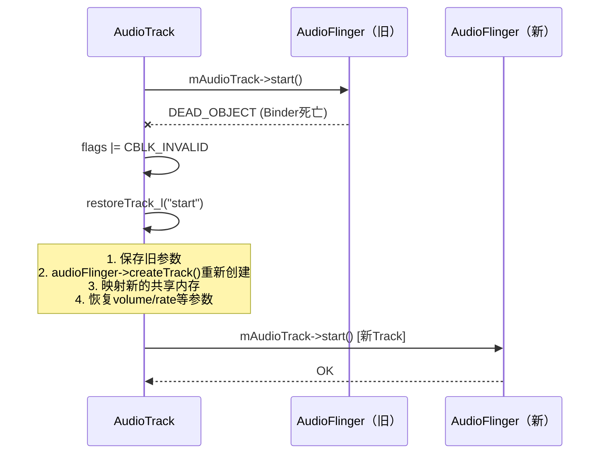

`restoreTrack_l()`核心逻辑：重新调用createTrack_l()，用新的IAudioTrack替换旧的，重新映射共享内存，并恢复所有参数（音量、采样率、辅助效果等）。

### 音量控制机制 — setVolume()与VolumeShaper

#### setVolume() — 即时音量设置（[`AudioTrack.cpp:1126`](frameworks/av/media/libaudioclient/AudioTrack.cpp:1126)）

```cpp
status_t AudioTrack::setVolume(float left, float right) {
    // 范围检查: 0.0~1.0
    if (isnanf(left) || left < 0.0f || left > 1.0f ||
        isnanf(right) || right < 0.0f || right > 1.0f) {
        return BAD_VALUE;
    }
    AutoMutex lock(mLock);
    mVolume[AUDIO_INTERLEAVE_LEFT] = left;
    mVolume[AUDIO_INTERLEAVE_RIGHT] = right;
    // float→minifloat转换，写入共享内存cblk
    mProxy->setVolumeLR(gain_minifloat_pack(gain_from_float(left), gain_from_float(right)));
    if (isOffloaded_l()) {
        mAudioTrack->signal();  // Offload: 唤醒OutputThread应用新音量
    }
    return NO_ERROR;
}
```

**音量传递路径**：

```
App.setVolume(left, right)
  → mProxy->setVolumeLR()           // 写入cblk共享内存
  → AudioFlinger PlaybackThread读取
    → AudioMixer::setParameter(VOLUME)
      → 软件混音时乘以音量系数
  → Offload: mAudioTrack->signal()  // 唤醒DirectOutputThread
    → HAL stream->setVolume()       // 直接设置DSP音量
```

> **setVolume vs stream volume**：setVolume()是App级别的Track音量，AudioFlinger混音时还会叠加stream type音量和device音量。最终硬件音量 = TrackVolume × StreamVolume × DeviceVolume。

#### VolumeShaper — 音量渐变动画（[`VolumeShaper.h`](frameworks/av/media/libmedia/include/media/VolumeShaper.h)）

VolumeShaper提供基于曲线的音量渐变（fade in/out/duck等），由`mVolumeHandler`管理：

| 组件 | 职责 |
|------|------|
| [`VolumeShaper::Configuration`](frameworks/av/media/libmedia/include/media/VolumeShaper.h) | 定义音量曲线（cubefit插值）+ 持续时间 + id |
| [`VolumeShaper::Operation`](frameworks/av/media/libmedia/include/media/VolumeShaper.h) | 控制播放/反向/终止等操作 |
| [`VolumeShaper::State`](frameworks/av/media/libmedia/include/media/VolumeShaper.h) | 当前音量+位置状态 |
| `VolumeHandler` | 管理多个VolumeShaper实例，getVolume()时叠加所有曲线 |

**VolumeShaper典型流程**：

```
1. 创建: applyVolumeShaper(config, operation)
   → mVolumeHandler->addConfig()分配id
   → 返回id给App

2. 播放: applyVolumeShaper(config with id, PLAY)
   → VolumeHandler开始按曲线计算每帧音量
   → AudioMixer混音时读取getVolume()获取叠加音量

3. duck场景: 焦点丢失→AudioService调用applyVolumeShaper(duck config)
   → 曲线从1.0渐变到0.3（约400ms）
   → 焦点恢复→反向播放曲线从0.3渐变到1.0
```

> **VolumeShaper vs setVolume**：VolumeShaper在AudioFlinger混音线程中逐帧计算音量曲线，实现平滑渐变；setVolume是瞬时设置，可能导致click噪声。系统内部焦点duck/fade统一使用VolumeShaper。

### 传输模式深度对比

| 模式 | Transfer Type | 数据流 | Buffer管理 | 延迟 | 适用场景 |
|------|--------------|--------|-----------|------|----------|
| MODE_STREAM | TRANSFER_SYNC | App→write()→共享内存→AF | obtainBuffer/releaseBuffer | 中等 | 音乐、通话 |
| MODE_STREAM | TRANSFER_CALLBACK | AF→AudioTrackThread→onPeriodicNotification() | obtainBuffer/releaseBuffer | 低 | 低延迟播放 |
| MODE_STATIC | TRANSFER_SHARED | App→write一次性→共享内存 | 直接访问shared buffer | 最低 | 短音效 |
| MODE_STREAM | TRANSFER_SYNC_NOTIF_CALLBACK | App→write()→共享内存→AF + 唤醒回调 | obtainBuffer/releaseBuffer | 中等 | 需要通知的流式 |
| Offload | TRANSFER_SYNC | App→write()压缩数据→DirectOutputThread | 独立buffer | 高(DSP) | MP3/AAC |

### 关键配置参数影响

| 参数 | 影响范围 | 源码位置 | 说明 |
|------|----------|----------|------|
| `bufferSizeInBytes` | 延迟/underrun | Builder构造 | 越大越不容易underrun但延迟越高 |
| `PERFORMANCE_MODE` | FastMixer/NormalMixer | Builder.build() | 决定FLAG_LOW_LATENCY/DEEP_BUFFER |
| `AudioAttributes.usage` | 路由策略 | 构造函数 | 影响AudioPolicy路由到哪个输出设备 |
| `session` | Effect关联 | native_setup | 同session的AudioTrack和AudioEffect关联 |
| `offload` | Thread类型 | Builder | true→DirectOutputThread |
| `encapsulationMode` | 数据封装 | native_setup | 广播/TV场景的元数据封装 |

### 常见问题源码定位

| 问题 | 根因 | 源码定位 | 排查方法 |
|------|------|----------|----------|
| write()返回WOULD_BLOCK | 共享内存FIFO满 | [`AudioTrack.cpp:2346`](frameworks/av/media/libaudioclient/AudioTrack.cpp:2346) | 增大bufferSize或检查callback频率 |
| ERROR_DEAD_OBJECT | AudioFlinger重启 | [`AudioTrack.cpp:881`](frameworks/av/media/libaudioclient/AudioTrack.cpp:881) | 检查logcat中AudioFlinger crash |
| Underrun | App写入不够快 | [`Threads.cpp:4131`](frameworks/av/services/audioflinger/Threads.cpp:4131) | dumpsys audio查看underrun count |
| FAST flag被拒 | 传输模式不兼容 | [`AudioTrack.cpp:1830`](frameworks/av/media/libaudioclient/AudioTrack.cpp:1830) | 确认TRANSFER_CALLBACK/SYNC/OBTAIN |
| Offload不支持 | HAL不支持该格式 | [`AudioTrack.java:1425`](frameworks/base/media/java/android/media/AudioTrack.java:1425) | 检查audio_policy_configuration.xml |

---

## 2.2 AudioRecord — 录音核心API深度解析

### 模块职责

AudioRecord是应用层音频采集的核心API，从麦克风或其他输入设备获取PCM原始音频数据。与AudioTrack对称——AudioTrack是"写出到HAL"，AudioRecord是"从HAL读入"。

**源码位置**：
- Java层：[`AudioRecord.java`](frameworks/base/media/java/android/media/AudioRecord.java)
- JNI层：[`android_media_AudioRecord.cpp`](frameworks/base/core/jni/android_media_AudioRecord.cpp)
- Native层：[`AudioRecord.cpp`](frameworks/av/media/libaudioclient/AudioRecord.cpp)
- 共享内存结构：与AudioTrack共用 [`AudioTrackShared.h`](frameworks/av/include/private/media/AudioTrackShared.h)

### 核心类关系

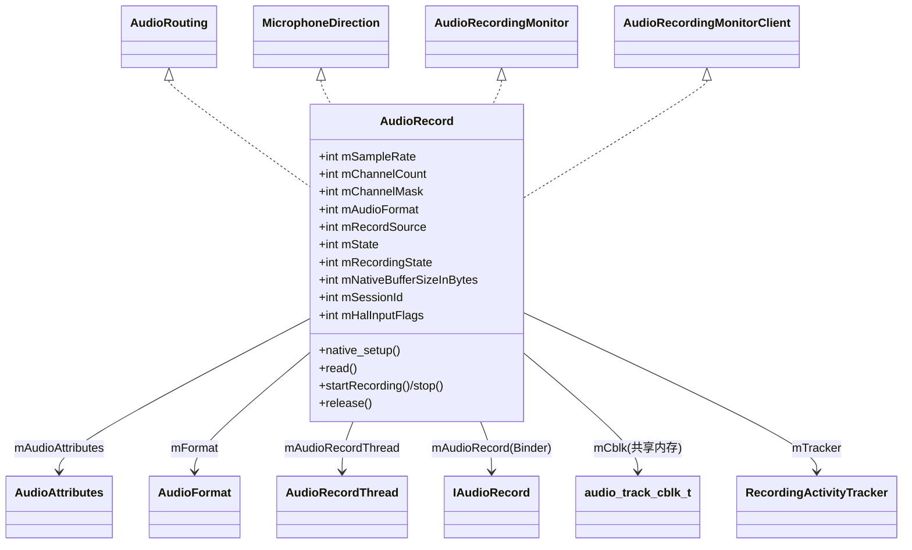

- [`AudioRecord`](frameworks/base/media/java/android/media/AudioRecord.java:96) — 实现AudioRouting + MicrophoneDirection + AudioRecordingMonitor
- **MicrophoneDirection** — 控制麦克风指向性（全向/心形/8字形）
- **AudioRecordingMonitor** — 录音监控接口（获取录音配置、设置回调）
- **RecordingActivityTracker** — 与AudioService通信录音活动状态（riid: recording interaction ID）

### 状态机

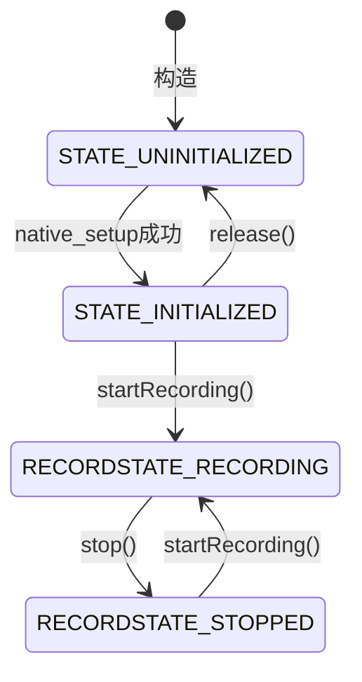

**状态常量**（[`AudioRecord.java:107-120`](frameworks/base/media/java/android/media/AudioRecord.java:107)）：

| 常量 | 值 | 说明 |
|------|-----|------|
| `STATE_UNINITIALIZED` | 0 | 初始化失败或已release |
| `STATE_INITIALIZED` | 1 | 可用状态 |
| `RECORDSTATE_STOPPED` | 1 | 匹配SL_RECORDSTATE_STOPPED |
| `RECORDSTATE_RECORDING` | 3 | 匹配SL_RECORDSTATE_RECORDING |

### 构造函数深度解析

#### native_setup参数传递（[`AudioRecord.java:477-480`](frameworks/base/media/java/android/media/AudioRecord.java:477)）

```java
int initResult = native_setup(
    new WeakReference<AudioRecord>(this),  // JNI回调引用
    mAudioAttributes,                       // 含capturePreset
    sampleRate,                             // 采样率（0=路由决定）
    mChannelMask,                           // 输入声道掩码
    mChannelIndexMask,                      // 索引式声道掩码
    mAudioFormat,                           // 编码格式
    mNativeBufferSizeInBytes,               // buffer大小
    session,                                // 输出：分配的session ID
    attributionSourceState,                 // 调用者身份
    0,                                      // nativeRecordInJavaObj
    maxSharedAudioHistoryMs,                // 共享历史时长
    mHalInputFlags                          // HAL flags
);
```

### AudioSource深度分类与策略影响

AudioSource不仅决定录音来源，更**直接影响AudioPolicy的路由决策和HAL预处理配置**：

| AudioSource | 值 | 场景 | HAL预处理 | 延迟优先 |
|-------------|-----|------|----------|---------|
| `DEFAULT` | 0 | 默认 | 等同MIC | — |
| `MIC` | 1 | 标准录音 | AGC+AEC+NS | — |
| `VOICE_UPLINK` | 2 | 通话上行 | 无 | — |
| `VOICE_DOWNLINK` | 3 | 通话下行 | 无 | — |
| `VOICE_CALL` | 4 | 通话双向 | 无 | — |
| `CAMCORDER` | 5 | 摄像录音 | **最少预处理** | 同步音视频 |
| `VOICE_RECOGNITION` | 6 | 语音识别 | **关闭AGC+AEC** | 低延迟 |
| `VOICE_COMMUNICATION` | 7 | VoIP通信 | **AEC+NS** | 极低延迟 |
| `REMOTE_SUBMIX` | 8 | 投屏捕获 | 无 | — |
| `UNPROCESSED` | 9 | 原始音频 | **无任何处理** | — |
| `ECHO_REFERENCE` | 12 | AEC参考 | 回声参考信号 | — |

> **关键设计**：
> - `VOICE_RECOGNITION`关闭AGC，语音识别算法需要原始音量变化信息
> - `VOICE_COMMUNICATION`启用AEC+NS，VoIP通话必须消除扬声器回声
> - `UNPROCESSED`完全不做信号处理，用于专业录音
> - `CAMCORDER`标记`AUDIO_FLAG_CAPTURE_PRIVATE`（[`AudioRecord.cpp:283`](frameworks/av/media/libaudioclient/AudioRecord.cpp:283)）

### Native层初始化 — createRecord_l()深度分析

[`AudioRecord.cpp:782-1035`](frameworks/av/media/libaudioclient/AudioRecord.cpp:782)

#### FAST flag检查与降级

```cpp
if (mFlags & AUDIO_INPUT_FLAG_FAST) {
    bool useCaseAllowed =
            (mTransfer == TRANSFER_CALLBACK) ||
            (mTransfer == TRANSFER_SYNC) ||      // 阻塞read也可获FAST
            (mTransfer == TRANSFER_OBTAIN);
    if (!useCaseAllowed) {
        mFlags &= ~(AUDIO_INPUT_FLAG_FAST | AUDIO_INPUT_FLAG_RAW);
    }
}
```

> **与AudioTrack的FAST flag差异**：AudioRecord的SYNC模式（阻塞read）也可获得FAST——AAudio app可从SCHED_FIFO线程做低延迟non-blocking read。

#### Binder IPC重试机制（AudioRecord独有）

```cpp
static const int32_t kMaxCreateAttempts = 3;
do {
    status = audioFlinger->createRecord(input, response);
    if (status == NO_ERROR) break;
    if (status != FAILED_TRANSACTION || --remainingAttempts <= 0) goto exit;
    usleep((20 + rand() % 30) * 10000);  // 随机20-50ms后重试
} while (1);
```

> **为什么需要重试？** AudioPolicyManager和AudioFlinger在input stream打开序列中可能出现竞态条件。AudioTrack没有此重试机制。

#### AudioFlinger::createRecord() FAST降级重试

[`AudioFlinger.cpp:2463-2546`](frameworks/av/services/audioflinger/AudioFlinger.cpp:2463)

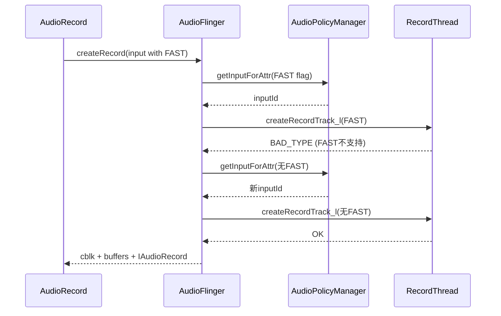

### read()数据读取机制

与AudioTrack的write()对称，但数据方向反转：

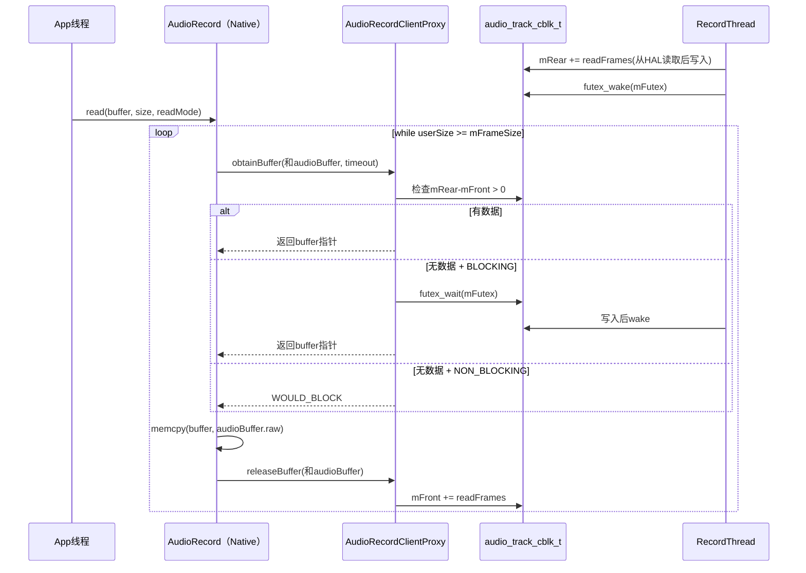

> **关键差异**：RecordThread是Producer（写mRear），App是Consumer（读mFront）。AudioTrack中方向相反。

### start()/stop()详解

#### start()（[`AudioRecord.cpp:420-501`](frameworks/av/media/libaudioclient/AudioRecord.cpp:420)）

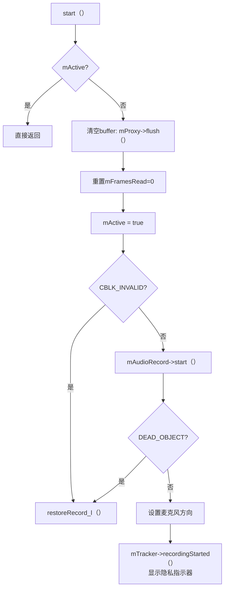

#### stop()（[`AudioRecord.cpp:503-540`](frameworks/av/media/libaudioclient/AudioRecord.cpp:503)）

```cpp
void AudioRecord::stop() {
    mActive = false;
    mProxy->interrupt();
    mAudioRecord->stop();             // Binder调用
    mTracker->recordingStopped();     // 关闭隐私指示器
}
```

### 与AudioTrack的对称架构对比

| 维度 | AudioTrack | AudioRecord |
|------|-----------|-------------|
| 数据方向 | App→HAL(写) | HAL→App(读) |
| 共享内存Producer | Client(写mRear) | Server(AF写mRear) |
| 共享内存Consumer | Server(AF读mFront) | Client(App读mFront) |
| AF Thread | PlaybackThread | RecordThread |
| APM路由 | getOutputForAttr | getInputForAttr |
| HAL接口 | StreamOutHal::write | StreamInHal::read |
| Flag类型 | AUDIO_OUTPUT_FLAG_* | AUDIO_INPUT_FLAG_* |
| Offload支持 | 有(DSP解码) | 无(必须PCM) |
| FAST降级重试 | 无 | 有 |
| 构造重试 | 无 | 有(kMaxCreateAttempts=3) |
| 隐私指示器 | 无 | 有(RecordingActivityTracker) |
| 麦克风控制 | 无 | 有(MicrophoneDirection) |

### 隐私与权限机制

AOSP14对录音隐私有严格管控：

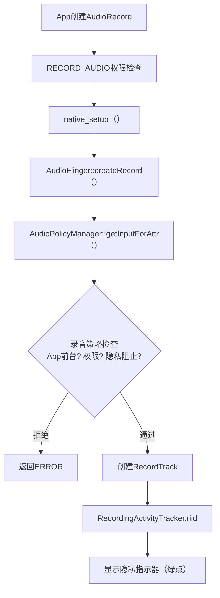

**RecordingActivityTracker**（riid）机制：
- 每个AudioRecord分配唯一riid（Recording Interaction ID）
- 传递给AudioService追踪哪个App正在录音
- 状态栏显示绿色麦克风图标
- stop()时`recordingStopped()`取消指示器

### 常见问题源码定位

| 问题 | 根因 | 源码定位 | 排查方法 |
|------|------|----------|----------|
| read()返回WOULD_BLOCK | FIFO空 | [`AudioRecord.java:1825`](frameworks/base/media/java/android/media/AudioRecord.java:1825) | 检查RecordThread是否正常读HAL |
| ERROR_DEAD_OBJECT | AF重启 | [`AudioRecord.cpp:469`](frameworks/av/media/libaudioclient/AudioRecord.cpp:469) | 检查logcat AudioFlinger crash |
| FAILED_TRANSACTION | APM/AF竞态 | [`AudioRecord.cpp:855`](frameworks/av/media/libaudioclient/AudioRecord.cpp:855) | 自动重试3次 |
| FAST input被拒 | HAL不支持 | [`AudioFlinger.cpp:2510`](frameworks/av/services/audioflinger/AudioFlinger.cpp:2510) | 检查HAL FAST input声明 |
| 录音无声 | 路由到错误设备 | [`AudioFlinger.cpp:2472`](frameworks/av/services/audioflinger/AudioFlinger.cpp:2472) | dumpsys audio查看input路由 |
| 隐私指示器不消失 | stop()未调用 | [`AudioRecord.cpp:522`](frameworks/av/media/libaudioclient/AudioRecord.cpp:522) | 确保所有AudioRecord调用了stop() |

---

## 2.3 AudioManager — 音频管理中枢

### 模块职责

AudioManager是应用层访问音频系统服务的统一入口，封装了音量控制、设备管理、焦点请求、铃声模式等所有音频策略操作。

**源码位置**：[`AudioManager.java`](frameworks/base/media/java/android/media/AudioManager.java)

### 核心方法分类

| 功能域 | 方法 | Binder目标 | 说明 |
|--------|------|-----------|------|
| 音量控制 | `adjustVolume()` / `setStreamVolume()` | AudioService → AudioPolicyService | 硬件音量键最终调到这里 |
| 焦点请求 | `requestAudioFocus()` / `abandonAudioFocus()` | AudioService → MediaFocusControl | 所有播放App必须请求焦点 |
| 设备管理 | `setWiredDeviceConnectionState()` | AudioService → AudioPolicyService | 耳机/USB插拔事件 |
| 铃声模式 | `setRingerMode()` / `getRingerMode()` | AudioService | 静音/振动/正常 |
| 蓝牙 | `startBluetoothSco()` / `isBluetoothA2dpOn()` | AudioService → AudioDeviceBroker | SCO通话/A2DP音乐 |
| 播放配置 | `getActivePlaybackConfigurations()` | AudioService → PlaybackActivityMonitor | 返回正在播放的AudioTrack信息 |
| 录音配置 | `getActiveRecordingConfigurations()` | AudioService → RecordingActivityMonitor | 返回正在录音的AudioRecord信息 |
| 设备偏好 | `setPreferredDeviceForPlayback()` | AudioPolicyService | App指定输出设备偏好 |
| 空间音频 | `setSpatializerEnabled()` | AudioService → SpatializerHelper | AOSP12新增空间音频 |
| 听力保护 | `setSafeVolumeState()` | AudioService → SoundDoseHelper | AOSP14新增CSD(听力剂量) |

### AudioManager内部架构

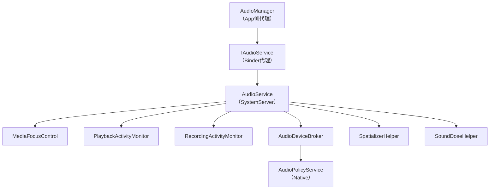

### 版本演进关键变更

| 版本 | 关键API变更 | 影响 |
|------|-------------|------|
| Android 5.0 | AudioAttributes替代stream type | 焦点/路由决策更精细 |
| Android 8.0 | AudioFocusRequest.Builder + AAudio | 焦点请求更安全；新增低延迟API |
| Android 9.0 | AudioPlaybackConfiguration/RecordingConfiguration | 隐私管控：App可监测其他App录音 |
| Android 11 | AudioProductStrategy API | 路由策略可由App查询 |
| Android 12 | Spatializer API | 空间音频控制 |
| Android 13 | VolumeInfo API | 更精细的音量查询 |
| Android 14 | SoundDose API | CSD听力保护，超过80dBA限制时长 |

---

## 2.4 AudioFocusRequest — 焦点请求模型

### 模块职责

封装音频焦点请求参数，包括焦点类型、音频属性、焦点变化监听器和控制标志。

**源码位置**：[`AudioFocusRequest.java`](frameworks/base/media/java/android/media/AudioFocusRequest.java)

### 焦点类型与交互矩阵

| 类型 | 值 | 持续性 | 典型场景 | 对其他App的影响 |
|------|-----|--------|----------|----------------|
| `AUDIOFOCUS_GAIN` | 1 | 永久 | 音乐播放 | 其他GAIN→LOSS |
| `GAIN_TRANSIENT` | 2 | 暂时 | 语音助手 | GAIN→LOSS_TRANSIENT |
| `GAIN_TRANSIENT_MAY_DUCK` | 3 | 暂时(可duck) | 通知提示 | GAIN→LOSS_TRANSIENT_CAN_DUCK |
| `GAIN_TRANSIENT_EXCLUSIVE` | 4 | 暂时(独占) | 语音识别 | 所有→LOSS_TRANSIENT |

### 焦点交互矩阵（MediaFocusControl核心决策）

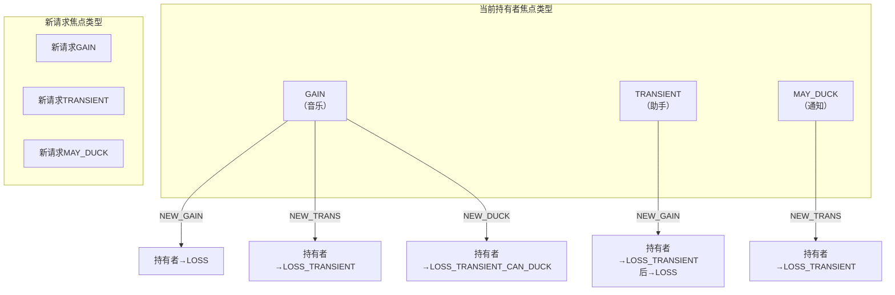

### Builder关键参数

```java
AudioFocusRequest request = new AudioFocusRequest.Builder(AudioManager.AUDIOFOCUS_GAIN)
    .setAudioAttributes(attributes)           // 必须设置
    .setOnAudioFocusChangeListener(listener)   // 必须设置
    .setAcceptsDelayedFocusGain(true)          // 延迟焦点：暂时无法获得时排队
    .setWillPauseWhenDucked(true)              // ducking时暂停而非降低音量
    .setFocusGainOnFocusLoss(true)             // 焦点丢失后自动重新请求
    .build();
```

> **延迟焦点机制**：当电话通话占用焦点时，新的GAIN请求会排队等待。电话结束后，排队者自动获得焦点。这避免了"请求焦点→失败→反复请求"的恶性循环。

> **WillPauseWhenDucked**：默认ducking行为是降低音量（~30%）。设置此标志后，ducking时App会收到`LOSS_TRANSIENT_CAN_DUCK`但选择暂停而非降低音量。适用于播客、有声书等场景——降低音量不如暂停。

---

## 2.5 AAudio — 低延迟音频API

### 模块职责

AAudio是Android 8.0引入的C语言低延迟音频API，专为专业音频和低延迟场景设计。内部根据设备能力自动选择MMAP路径或传统AudioTrack/AudioRecord路径。

**源码位置**：
- C API：[`aaudio/AAudio.h`](frameworks/av/media/libaaudio/include/aaudio/AAudio.h)
- 内部实现：[`frameworks/av/media/libaaudio/`](frameworks/av/media/libaaudio/)

### 核心流程

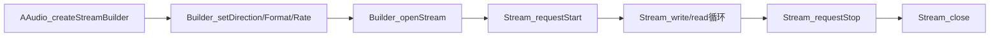

### AAudio vs OpenSL ES vs AudioTrack

| 维度 | AAudio | OpenSL ES | AudioTrack(Java) |
|------|--------|-----------|-----------------|
| 语言 | C/C++ | C | Java |
| 延迟 | 极低(MMAP) | 低 | 普通 |
| API复杂度 | 简单 | 复杂 | 中等 |
| MMAP支持 | 是 | 否 | 否(内部使用) |
| 状态 | **推荐使用** | 已弃用 | 通用场景 |
| Stream重建 | 自动(ErrorCallback) | 手动 | 手动(restoreTrack_l) |

### MMAP_NOIRQ模式深度解析


**MMAP_NOIRQ关键特征**：
- 音频数据直接在App与DSP之间通过共享内存传输，**完全绕过AudioFlinger混音**
- 延迟可降至<10ms（传统路径通常20-50ms）
- 使用`mmap()`映射HAL提供的共享内存buffer
- **NOIRQ**：无中断模式，App通过polling读取位置而非等待中断
- AudioFlinger侧对应`MmapPlaybackThread/MmapCaptureThread`，仅管理生命周期和状态，不混音
- 仅在HAL声明支持MMAP时可用，需要在`audio_policy_configuration.xml`中配置`mmapPolicy="auto"`
- AAudio内部自动选择：MMAP可用→MMAP路径，不可用→降级到AudioTrack路径

### ErrorCallback与Stream重建

AAudio的独特设计：当Stream遇到错误（如设备断开），通过ErrorCallback通知App，App可以重建Stream：

```c
aaudio_stream_builder_setErrorCallback(builder, errorCallback, userData);

void errorCallback(AAudioStream *stream, void *userData, aaudio_result_t error) {
    // 在AAudio内部线程调用，不能直接操作Stream
    // 需要通知App线程去重建Stream
    aaudio_stream_requestStop(stream);  // 安全操作
    // 通知App线程重新openStream
}
```

> **与AudioTrack的DEAD_OBJECT对比**：AudioTrack内部自动restoreTrack_l()，AAudio则将重建决策交给App——因为AAudio的Stream配置可能需要调整（如切换设备后采样率变化），App比框架层更适合决定如何重建。

### AAudio服务端架构 — oboeservice深度解析

#### 架构总览

AAudio服务端代码位于[`frameworks/av/services/oboeservice/`](frameworks/av/services/oboeservice/)，运行在audioserver进程中，是AAudio低延迟能力的关键实现层。其核心职责包括：

- 管理EXCLUSIVE（MMAP）和SHARED两条音频路径
- 维护流状态机与命令队列，确保线程安全
- 通过EndpointManager管理设备端点的生命周期
- 通过SharedRingBuffer实现跨进程零拷贝音频数据传输

**类层次关系**：

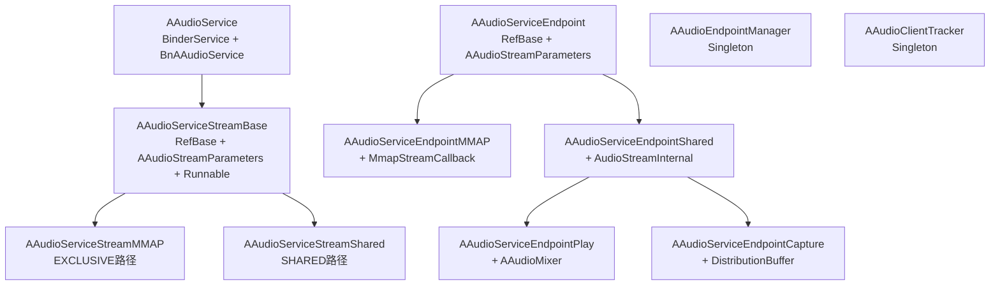

**两条数据路径的本质区别**：

| 维度 | EXCLUSIVE（MMAP） | SHARED |
|------|-------------------|--------|
| Stream类型 | [`AAudioServiceStreamMMAP`](frameworks/av/services/oboeservice/AAudioServiceStreamMMAP.h) | [`AAudioServiceStreamShared`](frameworks/av/services/oboeservice/AAudioServiceStreamShared.h) |
| Endpoint类型 | [`AAudioServiceEndpointMMAP`](frameworks/av/services/oboeservice/AAudioServiceEndpointMMAP.h) | [`AAudioServiceEndpointPlay`](frameworks/av/services/oboeservice/AAudioServiceEndpointPlay.h) / [`AAudioServiceEndpointCapture`](frameworks/av/services/oboeservice/AAudioServiceEndpointCapture.h) |
| 数据传输 | App↔DSP共享内存，零拷贝 | App→FIFO→Service混音→AudioTrack |
| 混音 | 无（独占设备） | [`AAudioMixer`](frameworks/av/services/oboeservice/AAudioMixer.h)软件混音 |
| 延迟 | 极低（<10ms） | 中等（传统AudioFlinger延迟） |
| 并发 | 每设备仅一个EXCLUSIVE流 | 多流共享同一Endpoint |

---

#### AAudioService — Binder服务入口

[`AAudioService`](frameworks/av/services/oboeservice/AAudioService.h)继承`BinderService<AAudioService>`和[`BnAAudioService`](frameworks/av/media/libaaudio/src/binding/AAudioServiceInterface.h)，注册为`media.aaudio`服务，是客户端与oboeservice交互的唯一Binder入口。

**核心Binder方法**：

```c++
// AAudioService.h
class AAudioService :
    public BinderService<AAudioService>,
    public aaudio::BnAAudioService {
public:
    binder::Status openStream(const StreamRequest& request,
                              StreamParameters* paramsOut,
                              int32_t* _aidl_return) override;
    binder::Status closeStream(int32_t streamHandle, int32_t* _aidl_return) override;
    binder::Status startStream(int32_t streamHandle, int32_t* _aidl_return) override;
    binder::Status pauseStream(int32_t streamHandle, int32_t* _aidl_return) override;
    binder::Status stopStream(int32_t streamHandle, int32_t* _aidl_return) override;
    binder::Status flushStream(int32_t streamHandle, int32_t* _aidl_return) override;
    binder::Status registerAudioThread(int32_t streamHandle, int32_t clientThreadId,
                                       int64_t periodNanoseconds, int32_t* _aidl_return) override;
    binder::Status unregisterAudioThread(int32_t streamHandle, int32_t clientThreadId,
                                         int32_t* _aidl_return) override;
    binder::Status exitStandby(int32_t streamHandle, Endpoint* endpoint,
                               int32_t* _aidl_return) override;
};
```

**openStream完整流程**：

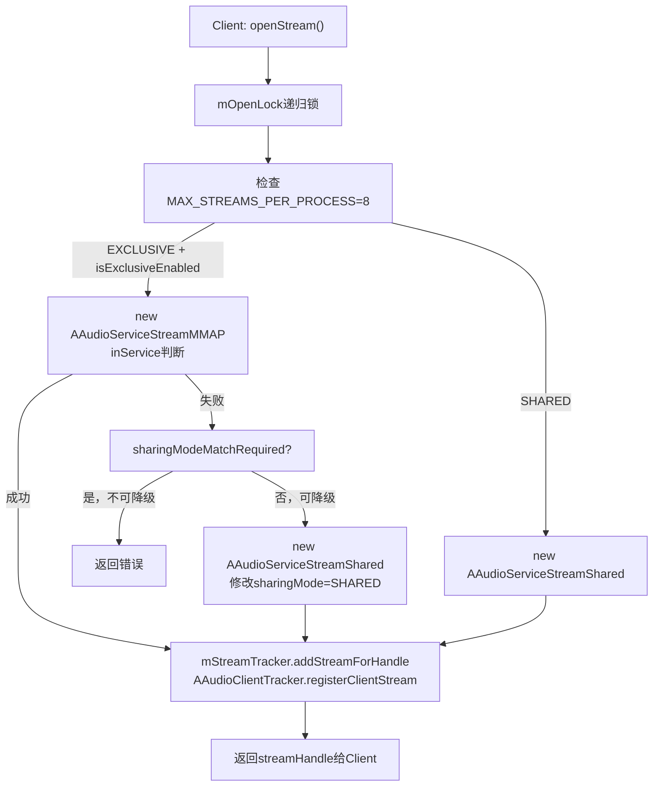

**关键实现细节**：

1. **mOpenLock递归锁保护**（[`AAudioService.h:128`](frameworks/av/services/oboeservice/AAudioService.h:128)）：防止exclusive endpoint被steal后出现竞态。场景：线程A打开EXCLUSIVE endpoint→线程B steal A的endpoint→线程B打开SHARED→线程A需降级也打开SHARED，锁确保顺序正确

2. **MAX_STREAMS_PER_PROCESS=8**（[`AAudioService.cpp:41`](frameworks/av/services/oboeservice/AAudioService.cpp:41)）：每个进程最多8个AAudio流，通过[`AAudioClientTracker::getStreamCount()`](frameworks/av/services/oboeservice/AAudioClientTracker.h)检查

3. **EXCLUSIVE→SHARED降级逻辑**（[`AAudioService.cpp:139-165`](frameworks/av/services/oboeservice/AAudioService.cpp:139)）：
   - 先尝试EXCLUSIVE模式，创建`AAudioServiceStreamMMAP`
   - 失败后若`!sharingModeMatchRequired`，修改request的sharingMode为SHARED，创建`AAudioServiceStreamShared`
   - `sharingModeMatchRequired=true`时（App明确要求EXCLUSIVE），不降级直接返回错误

4. **inService判断**：若调用者本身就是audioserver进程（`isCallerInService()`为true），则信任request中的`isInService()`标志。此标志影响MMAP流的`startDevice`行为——inService流不需要调用`startClient`

5. **StreamTracker注册**（[`AAudioStreamTracker`](frameworks/av/services/oboeservice/AAudioStreamTracker.h)）：为每个打开的流分配handle，后续所有操作（start/pause/stop/close）均通过handle查找对应serviceStream

**AAudioBinderAdapter内部类**：

[`AAudioService::Adapter`](frameworks/av/services/oboeservice/AAudioService.h:98)继承[`AAudioBinderAdapter`](frameworks/av/media/libaaudio/src/binding/AAudioBinderAdapter.h)，适配`startClient/stopClient`方法。这两个方法不走Binder（它们由AudioFlinger的MmapThread回调触发），直接委托给AAudioService：

```c++
// AAudioService.h - Adapter内部类
class Adapter : public aaudio::AAudioBinderAdapter {
    aaudio_result_t startClient(const AAudioHandleInfo& streamHandleInfo,
                                const AudioClient& client,
                                const audio_attributes_t* attr,
                                audio_port_handle_t* clientHandle) override {
        return mService->startClient(streamHandleInfo.getHandle(), client, attr, clientHandle);
    }
    aaudio_result_t stopClient(const AAudioHandleInfo& streamHandleInfo,
                               audio_port_handle_t clientHandle) override {
        return mService->stopClient(streamHandleInfo.getHandle(), clientHandle);
    }
};
```

**调度优先级**：

```c++
static constexpr int32_t kRealTimeAudioPriorityClient = 2;  // 客户端音频线程优先级
static constexpr int32_t kRealTimeAudioPriorityService = 3; // 服务端音频线程优先级
```

---

#### AAudioServiceStreamBase — 流状态机与命令队列

[`AAudioServiceStreamBase`](frameworks/av/services/oboeservice/AAudioServiceStreamBase.h)是每个客户端流在服务端的对应实体，继承`RefBase`+`AAudioStreamParameters`+`Runnable`，封装了流状态机、命令队列和消息队列。

**流状态机**：

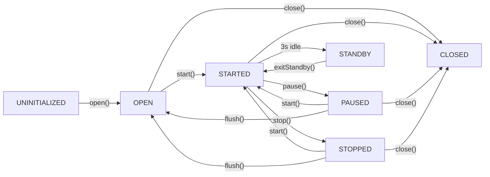

状态存储在[`mState`](frameworks/av/services/oboeservice/AAudioServiceStreamBase.h:313)成员中，通过[`setState()`](frameworks/av/services/oboeservice/AAudioServiceStreamBase.h:286)方法更新，状态变更会通过`sendServiceEvent`通知客户端。

**命令队列架构**：

所有流操作（start/pause/stop/flush/close等）均通过命令队列序列化执行，确保线程安全：

```mermaid
graph LR
    BinderThread["Binder线程"] --> |"sendCommand"| CommandQueue["AAudioCommandQueue"]
    CommandQueue --> |"waitForCommand"| CommandThread["mCommandThread<br>AAudioThread"]
    CommandThread --> |"执行命令"| HandleStart["handleStart_l()"]
    CommandThread --> |"执行命令"| HandlePause["handlePause_l()"]
    CommandThread --> |"执行命令"| HandleStop["handleStop_l()"]
    CommandThread --> |"执行命令"| HandleClose["handleClose_l()"]
```

10种命令枚举定义在[`AAudioServiceStreamBase.h:359-370`](frameworks/av/services/oboeservice/AAudioServiceStreamBase.h:359)：

```c++
enum : int32_t {
    START,                    // 启动流
    PAUSE,                    // 暂停流
    STOP,                     // 停止流
    FLUSH,                    // 刷新缓冲区
    CLOSE,                    // 关闭流
    DISCONNECT,               // 断开连接
    REGISTER_AUDIO_THREAD,    // 注册客户端音频线程
    UNREGISTER_AUDIO_THREAD,  // 注销客户端音频线程
    GET_DESCRIPTION,          // 获取Endpoint描述
    EXIT_STANDBY,             // 退出待机模式
};
```

**AAudioCommand与AAudioCommandQueue**：

[`AAudioCommand`](frameworks/av/services/oboeservice/AAudioCommandQueue.h:34)封装命令参数和同步等待机制：

```c++
// AAudioCommandQueue.h
class AAudioCommand {
    const aaudio_command_opcode operationCode;     // 命令类型
    std::shared_ptr<AAudioCommandParam> parameter; // 命令参数（多态）
    bool isWaitingForReply;                        // 是否等待执行结果
    const int64_t timeoutNanoseconds;              // 超时时间
    aaudio_result_t result = AAUDIO_OK;            // 执行结果
    std::mutex lock;                               // 保护result的条件变量
    std::condition_variable conditionVariable;      // 通知调用者命令完成
};
```

命令参数通过[`AAudioCommandParam`](frameworks/av/services/oboeservice/AAudioCommandQueue.h:24)基类实现多态，4种子类参数：

| 参数子类 | 用途 | 定义位置 |
|----------|------|----------|
| [`RegisterAudioThreadParam`](frameworks/av/services/oboeservice/AAudioServiceStreamBase.h:252) | 注册音频线程：ownerPid + clientThreadId + priority | StreamBase内部类 |
| [`UnregisterAudioThreadParam`](frameworks/av/services/oboeservice/AAudioServiceStreamBase.h:266) | 注销音频线程：clientThreadId | StreamBase内部类 |
| [`GetDescriptionParam`](frameworks/av/services/oboeservice/AAudioServiceStreamBase.h:276) | 获取Endpoint描述：parcelable指针 | StreamBase内部类 |
| [`ExitStandbyParam`](frameworks/av/services/oboeservice/AAudioServiceStreamBase.h:325) | 退出待机：parcelable指针 | StreamBase内部类 |

**sendCommand流程**：

```
Binder线程 → sendCommand(opCode, param, waitForReply, timeout)
    → mCommandQueue.sendCommand(command)
    → 命令入队，唤醒CommandThread
    → 若waitForReply=true：等待conditionVariable（带超时）
    → CommandThread: waitForCommand() → 取出命令 → run()中执行handleCommand
    → 命令执行完毕，notify conditionVariable
    → Binder线程收到结果
```

**锁顺序与线程安全**：

[`AAudioServiceStreamBase.h:434-439`](frameworks/av/services/oboeservice/AAudioServiceStreamBase.h:434)明确定义了锁的获取顺序：

```
mLock → AAudioServiceEndpoint::mLockStreams
```

所有需要mLock的操作必须通过CommandThread执行（命令队列天然串行化），从而避免在Binder线程中直接持锁。

**向上消息队列**：

[`mUpMessageQueue`](frameworks/av/services/oboeservice/AAudioServiceStreamBase.h:357)（`SharedRingBuffer`）用于从Service向Client发送事件通知，由[`writeUpMessageQueue()`](frameworks/av/services/oboeservice/AAudioServiceStreamBase.h:294)写入[`AAudioServiceMessage`](frameworks/av/media/libaaudio/src/binding/AAudioServiceMessage.h)，包括：

- `AAUDIO_SERVICE_EVENT_STARTED` / `PAUSED` / `STOPPED` / `FLUSHED` — 状态变更通知
- `AAUDIO_SERVICE_EVENT_DISCONNECTED` — 设备断开
- `AAUDIO_SERVICE_EVENT_TIMESTAMP` — 周期性时间戳推送

**Standby自动待机机制**：

流在IDLE状态（OPEN/PAUSED/STOPPED）超过3秒（`IDLE_TIMEOUT_NANOS`）后自动进入standby。Standby状态下MMAP buffer被释放以节省资源，客户端调用`exitStandby()`时重新分配。此机制通过[`TimestampScheduler`](frameworks/av/services/oboeservice/TimestampScheduler.h)配合空闲检测实现。

**流控制原子标志**：

| 标志 | 类型 | 含义 |
|------|------|------|
| [`mFlowing`](frameworks/av/services/oboeservice/AAudioServiceStreamBase.h:420) | `bool` | 数据是否正在流动 |
| [`mSuspended`](frameworks/av/services/oboeservice/AAudioServiceStreamBase.h:428) | `atomic<bool>` | 流是否被挂起（如消息队列溢出） |
| [`mCloseNeeded`](frameworks/av/services/oboeservice/AAudioServiceStreamBase.h:424) | `atomic<bool>` | 标记流需要关闭（单向标志） |
| [`mConnected`](frameworks/av/services/oboeservice/AAudioServiceEndpoint.h:164) | `atomic<bool>` | Endpoint是否已连接 |

**Endpoint弱引用设计**：

[`mServiceEndpointWeak`](frameworks/av/services/oboeservice/AAudioServiceStreamBase.h:388)使用弱引用避免循环引用：Stream→Endpoint→mRegisteredStreams→Stream。访问Endpoint时通过`wp::promote()`提升为sp，若提升失败说明Endpoint已被销毁。

---

#### AAudioEndpointManager — 端点管理器

[`AAudioEndpointManager`](frameworks/av/services/oboeservice/AAudioEndpointManager.h)是Singleton，管理所有EXCLUSIVE和SHARED端点，负责端点的查找、创建和复用。

**分离锁设计**：

```c++
// AAudioEndpointManager.h
mutable std::mutex mSharedLock;                                    // 保护SHARED端点
std::vector<android::sp<AAudioServiceEndpointShared>> mSharedStreams GUARDED_BY(mSharedLock);

mutable std::mutex mExclusiveLock;                                 // 保护EXCLUSIVE端点
std::vector<android::sp<AAudioServiceEndpointMMAP>> mExclusiveStreams GUARDED_BY(mExclusiveLock);
```

使用两把独立锁而非一把全局锁的原因：**打开SHARED端点需要先打开EXCLUSIVE端点**（共享的AudioStreamInternal底层也依赖MMAP设备）。如果使用同一把锁，`openSharedEndpoint`内部调用`openExclusiveEndpoint`会造成递归死锁。锁的获取顺序规定为：**先mSharedLock后mExclusiveLock**。

**Endpoint查找与复用**：

[`openEndpoint()`](frameworks/av/services/oboeservice/AAudioEndpointManager.h:53)的决策逻辑：

```
openEndpoint(request)
  → sharingMode == EXCLUSIVE?
    → 是: openExclusiveEndpoint()
      → findExclusiveEndpoint_l(): 按deviceId/direction/格式查找已有端点
      → 找到: 引用计数+1，返回
      → 未找到: 新建AAudioServiceEndpointMMAP，open()
    → 否: openSharedEndpoint()
      → findSharedEndpoint_l(): 同上查找
      → 找到: 引用计数+1，返回
      → 未找到: 新建AAudioServiceEndpointPlay/Capture，open()
```

端点匹配由[`AAudioServiceEndpoint::matches()`](frameworks/av/services/oboeservice/AAudioServiceEndpoint.h:109)实现，比较deviceId、direction、format等关键参数。

**Endpoint Stealing机制**：

当EXCLUSIVE端点已被占用，新请求需要该端点时，[`kStealingEnabled=true`](frameworks/av/services/oboeservice/AAudioEndpointManager.h:112)允许"偷取"：

```
openExclusiveEndpoint()
  → findExclusiveEndpoint_l() 未找到空闲端点
  → kStealingEnabled && 有已注册端点?
    → 是: 选择victim端点，断开其所有stream
    → victim端点close()后重新open()给新请求者
```

Stealing场景：应用A独占MMAP播放→应用B（优先级更高）请求同一设备→A的流被disconnect→B获得EXCLUSIVE端点→A降级为SHARED。

**统计计数**：

[`AAudioEndpointManager`](frameworks/av/services/oboeservice/AAudioEndpointManager.h:90)维护5组统计，用于调试和性能分析：

| 计数器 | EXCLUSIVE | SHARED | 含义 |
|--------|-----------|--------|------|
| SearchCount | mExclusiveSearchCount | mSharedSearchCount | 查找次数 |
| FoundCount | mExclusiveFoundCount | mSharedFoundCount | 命中已有端点次数 |
| OpenCount | mExclusiveOpenCount | mSharedOpenCount | 新建端点次数 |
| CloseCount | mExclusiveCloseCount | mSharedCloseCount | 关闭端点次数 |
| StolenCount | mExclusiveStolenCount | — | 端点被偷取次数 |

---

#### MMAP路径：AAudioServiceEndpointMMAP

[`AAudioServiceEndpointMMAP`](frameworks/av/services/oboeservice/AAudioServiceEndpointMMAP.h)是EXCLUSIVE模式的核心实现，通过[`MmapStreamInterface`](frameworks/av/media/libaaudio/src/binding/AAudioServiceInterface.h)与AudioFlinger的MmapPlaybackThread/MmapCaptureThread交互。

**open流程与格式降级链**：

```mermaid
graph TD
    Open["open(request)"] --> OpenWithFormat["openWithFormat(format)"]
    OpenWithFormat --> PCM_FLOAT["AUDIO_FORMAT_PCM_FLOAT"]
    PCM_FLOAT --> |"成功"| CreateMmap["createMmapBuffer()"]
    PCM_FLOAT --> |"失败"| PCM_32["AUDIO_FORMAT_PCM_32_BIT"]
    PCM_32 --> |"成功"| CreateMmap
    PCM_32 --> |"失败"| PCM_24["AUDIO_FORMAT_PCM_24_BIT_PACKED"]
    PCM_24 --> |"成功"| CreateMmap
    PCM_24 --> |"失败"| PCM_16["AUDIO_FORMAT_PCM_16_BIT"]
    PCM_16 --> |"成功"| CreateMmap
    PCM_16 --> |"失败"| Fail["返回AAUDIO_ERROR_UNAVAILABLE"]
    CreateMmap --> |"MmapStreamInterface::openMmapStream"| SetupWrapper["SharedMemoryWrapper初始化"]
```

格式降级链：PCM_FLOAT → PCM_32_BIT → PCM_24_BIT_PACKED → PCM_16_BIT

`openWithFormat`调用[`MmapStreamInterface::openMmapStream()`](frameworks/av/media/libaaudio/src/binding/AAudioServiceInterface.h)打开AudioFlinger侧的MmapThread，HAL不支持当前格式时返回错误，触发降级到下一格式。

**核心成员**：

```c++
// AAudioServiceEndpointMMAP.h
android::sp<android::MmapStreamInterface> mMmapStream;        // AudioFlinger Mmap流接口
struct audio_mmap_buffer_info mMmapBufferinfo;                 // MMAP buffer信息
audio_port_handle_t mPortHandle = AUDIO_PORT_HANDLE_NONE;     // 端口句柄
std::unique_ptr<SharedMemoryWrapper> mAudioDataWrapper;        // 音频数据内存包装器
MonotonicCounter mFramesTransferred;                           // 32→64位帧计数器
```

**startStream / startClient流程**：

MMAP端点的启动分两层：

1. **Endpoint层**：[`startStream()`](frameworks/av/services/oboeservice/AAudioServiceEndpointMMAP.h:44)遍历mRegisteredStreams，找到对应stream后调用`startClient`
2. **Client层**：[`startClient()`](frameworks/av/services/oboeservice/AAudioServiceEndpointMMAP.h:50)调用`mMmapStream->start()`，通知AudioFlinger的MmapThread启动客户端

```
startStream(stream, clientHandle)
  → 注册stream到endpoint
  → startClient(client, attr, clientHandle)
    → mMmapStream->start(client, attr, clientHandle)
    → AudioFlinger MmapThread::start(clientPid, ...)
    → HAL层开始传输
```

**MmapStreamCallback回调**：

[`AAudioServiceEndpointMMAP`](frameworks/av/services/oboeservice/AAudioServiceEndpointMMAP.h)实现[`MmapStreamCallback`](frameworks/av/media/libaaudio/src/binding/AAudioServiceInterface.h)接口，处理AudioFlinger回调：

| 回调方法 | 触发场景 | 处理方式 |
|----------|----------|----------|
| [`onTearDown(portHandle)`](frameworks/av/services/oboeservice/AAudioServiceEndpointMMAP.h:69) | 设备移除/路由变更 | `handleTearDownAsync()`——**异步线程执行**避免死锁 |
| [`onVolumeChanged(volume)`](frameworks/av/services/oboeservice/AAudioServiceEndpointMMAP.h:72) | 音量变化 | 遍历mRegisteredStreams通知`onVolumeChanged` |
| [`onRoutingChanged(portHandle)`](frameworks/av/services/oboeservice/AAudioServiceEndpointMMAP.h:74) | 路由变更 | 断开所有已注册stream |

**handleTearDownAsync为何必须异步**：`onTearDown`在AudioFlinger的MmapThread锁内调用，若同步执行disconnect会尝试获取Endpoint的mLockStreams，而该锁可能正被另一个持有MmapThread锁的线程等待——形成ABBA死锁。异步投递到独立线程打破锁嵌套。

**standby / exitStandby**：

```c++
// standby: 释放MMAP buffer，节省资源
aaudio_result_t AAudioServiceEndpointMMAP::standby() {
    mMmapStream->standby();           // 通知AudioFlinger
    mAudioDataWrapper.reset();         // 释放SharedMemoryWrapper
}

// exitStandby: 重新分配MMAP buffer
aaudio_result_t AAudioServiceEndpointMMAP::exitStandby(AudioEndpointParcelable* parcelable) {
    createMmapBuffer();                // 重新创建MMAP buffer
    mAudioDataWrapper->setup(...);     // 重新初始化SharedMemoryWrapper
    getDownDataDescription(parcelable);// 填充Parcelable返回客户端
}
```

**MonotonicCounter — 32→64位位置转换**：

HAL的`getMmapPosition()`返回32位帧位置，可能回绕。[`MonotonicCounter`](frameworks/av/media/libaaudio/src/utility/MonotonicCounter.h)通过检测回绕将其扩展为64位单调递增值：

```
getFreeRunningPosition()
  → mMmapStream->getMmapPosition()  // 返回32位position
  → mFramesTransferred.update32(position32)  // 检测回绕，更新64位计数
  → *positionFrames = mFramesTransferred.get()  // 返回64位单调位置
```

---

#### Shared路径：AAudioServiceEndpointPlay/Capture

SHARED路径用于多个客户端流共享同一设备端点，通过软件混音/分发实现并发。

**AAudioServiceEndpointPlay — 播放混音**：

[`AAudioServiceEndpointPlay`](frameworks/av/services/oboeservice/AAudioServiceEndpointPlay.h)继承[`AAudioServiceEndpointShared`](frameworks/av/services/oboeservice/AAudioServiceEndpointShared.h)，内含[`AAudioMixer`](frameworks/av/services/oboeservice/AAudioMixer.h)实现多流混音：

```mermaid
graph TD
    ClientA["Client A FIFO"] --> |"读"| Mixer["AAudioMixer<br>mMixer"]
    ClientB["Client B FIFO"] --> |"读"| Mixer
    ClientC["Client C FIFO"] --> |"读"| Mixer
    Mixer --> |"混合输出"| StreamInternal["AudioStreamInternalPlay<br>底层AudioTrack"]
    StreamInternal --> |"write"| AudioFlinger["AudioFlinger<br>MixerThread"]
```

**callbackLoop混音循环**：

```
callbackLoop() {
    while (mCallbackEnabled) {
        mMixer.clear();                          // 清空混音缓冲区
        for (stream : mRegisteredStreams) {       // 遍历所有活跃流
            if (stream.isFlowing() && !stream.isSuspended()) {
                framesMixed = mMixer.mix(index, fifo, allowUnderflow);
                // 从client的FIFO读取数据，混入混音缓冲区
            }
        }
        getStreamInternal()->write(mixerBuffer, framesPerBurst); // 写入AudioTrack
        // underflow检测: framesMixed < getFramesPerBurst() && isFlowing()
    }
}
```

**BURSTS_PER_BUFFER_DEFAULT=2**：每次callback处理2个burst的数据量，平衡延迟与CPU效率。

**时间戳位置偏移**：Shared播放流的位置计算需要考虑混音延迟：

```
clientPosition = mmapFramesWritten - clientFramesRead + mTimestampPositionOffset
```

[`mTimestampPositionOffset`](frameworks/av/services/oboeservice/AAudioServiceStreamShared.h:102)在每次数据传输完成时通过[`markTransferTime()`](frameworks/av/services/oboeservice/AAudioServiceStreamShared.h:97)更新。

**AAudioServiceEndpointCapture — 录音分发**：

[`AAudioServiceEndpointCapture`](frameworks/av/services/oboeservice/AAudioServiceEndpointCapture.h)继承`AAudioServiceEndpointShared`，数据流方向相反——从AudioRecord读取后分发给各客户端流：

```mermaid
graph TD
    AudioFlinger["AudioFlinger<br>RecordThread"] --> |"read"| StreamInternal["AudioStreamInternalCapture<br>底层AudioRecord"]
    StreamInternal --> |"read"| DistBuffer["mDistributionBuffer<br>每burst大小"]
    DistBuffer --> |"writeDataIfRoom"| ClientA["Client A FIFO"]
    DistBuffer --> |"writeDataIfRoom"| ClientB["Client B FIFO"]
```

**callbackLoop分发循环**：

```
callbackLoop() {
    while (mCallbackEnabled) {
        framesRead = getStreamInternal()->read(mDistributionBuffer, framesPerBurst);
        for (stream : mRegisteredStreams) {
            stream.writeDataIfRoom(mmapFramesRead, mDistributionBuffer, framesRead);
            // 向每个client的FIFO写入数据
        }
    }
}
```

[`writeDataIfRoom()`](frameworks/av/services/oboeservice/AAudioServiceStreamShared.h:49)检查FIFO是否有足够空间，空间不足时丢弃数据并递增XRun计数。

**mRunningStreamCount计数**：

[`mRunningStreamCount`](frameworks/av/services/oboeservice/AAudioServiceEndpointShared.h:78)（`atomic<int>`）跟踪当前活跃的流数量：
- `startStream()` → count++ → 若count从0变1，调用`startSharingThread_l()`启动callbackLoop线程
- `stopStream()` → count-- → 若count变为0，调用`stopSharingThread()`停止线程

**handleDisconnectRegisteredStreamsAsync**：

[`AAudioServiceEndpointShared`](frameworks/av/services/oboeservice/AAudioServiceEndpointShared.h:67)在底层AudioStreamInternal断开时，异步断开所有已注册stream，避免在callbackLoop线程中同步操作造成死锁：

```
handleDisconnectRegisteredStreamsAsync()
  → 新建线程
    → 遍历mRegisteredStreams
      → stream->disconnect()
```

---

#### AAudioClientTracker — 客户端生命周期

[`AAudioClientTracker`](frameworks/av/services/oboeservice/AAudioClientTracker.h)是Singleton，跟踪每个进程的AAudio客户端，负责Binder死亡通知和进程级流计数限制。

**NotificationClient内部类**：

```c++
// AAudioClientTracker.h
class NotificationClient : public IBinder::DeathRecipient {
    const pid_t mProcessId;                                    // 客户端进程PID
    std::set<android::sp<AAudioServiceStreamBase>> mStreams;   // 该进程的所有流
    android::sp<IBinder> mBinder;                              // 持有binder引用以接收死亡通知
    bool mExclusiveEnabled = true;                             // 是否允许EXCLUSIVE MMAP
};
```

**核心功能**：

1. **Binder死亡通知**：[`binderDied()`](frameworks/av/services/oboeservice/AAudioClientTracker.h:80)回调在客户端进程死亡时触发，自动关闭该进程的所有AAudio流，释放MMAP资源

2. **进程级流计数**：[`getStreamCount(pid)`](frameworks/av/services/oboeservice/AAudioClientTracker.h:48)用于`MAX_STREAMS_PER_PROCESS=8`限制检查

3. **Exclusive开关**：[`setExclusiveEnabled(pid, enabled)`](frameworks/av/services/oboeservice/AAudioClientTracker.h:55) / [`isExclusiveEnabled(pid)`](frameworks/av/services/oboeservice/AAudioClientTracker.h:57)控制特定进程是否能创建EXCLUSIVE MMAP流。默认允许，但系统可通过此接口禁用某进程的EXCLUSIVE权限

**注册/注销流程**：

```
registerClient(pid, client)
  → 创建NotificationClient(pid, binder)
  → binder->linkToDeath(notificationClient)
  → mNotificationClients[pid] = notificationClient

registerClientStream(pid, serviceStream)
  → getNotificationClient_l(pid)->registerClientStream(serviceStream)
  → mStreams.insert(serviceStream)

unregisterClientStream(pid, serviceStream)
  → getNotificationClient_l(pid)->unregisterClientStream(serviceStream)
  → mStreams.erase(serviceStream)
```

---

#### 共享内存架构

AAudio的零拷贝低延迟特性依赖精心设计的共享内存架构，涉及多个层次的内存抽象。

**SharedRingBuffer — 核心环形缓冲区**：

[`SharedRingBuffer`](frameworks/av/services/oboeservice/SharedRingBuffer.h)基于ashmem共享内存+FifoBufferIndirect实现跨进程环形缓冲区：

**内存布局**：

```
+-------------------+  offset 0 (SHARED_RINGBUFFER_READ_OFFSET)
|  read_counter     |  sizeof(fifo_counter_t)
+-------------------+  offset sizeof(fifo_counter_t) (SHARED_RINGBUFFER_WRITE_OFFSET)
|  write_counter    |  sizeof(fifo_counter_t)
+-------------------+  offset 2*sizeof(fifo_counter_t) (SHARED_RINGBUFFER_DATA_OFFSET)
|                   |
|  audio data       |  capacityInFrames * bytesPerFrame
|                   |
+-------------------+
```

关键宏定义在[`SharedRingBuffer.h:37-39`](frameworks/av/services/oboeservice/SharedRingBuffer.h:37)：

```c++
#define SHARED_RINGBUFFER_READ_OFFSET   0
#define SHARED_RINGBUFFER_WRITE_OFFSET  sizeof(fifo_counter_t)
#define SHARED_RINGBUFFER_DATA_OFFSET   (SHARED_RINGBUFFER_WRITE_OFFSET + sizeof(fifo_counter_t))
```

**数据传输流程**：

```mermaid
graph LR
    subgraph "Client进程"
        ClientFifo["FifoBufferIndirect<br>mmap映射同一ashmem"]
    end
    subgraph "Service进程（audioserver）"
        ServiceFifo["SharedRingBuffer<br>ashmem创建者"]
    end
    Ashmem["ashmem共享内存<br>read_counter + write_counter + data"]
    ServiceFifo --> Ashmem
    ClientFifo --> Ashmem
```

两端通过读写计数器协调数据位置，无需额外同步原语——读写分别原子更新各自counter，另一端polling读取。

**fillParcelable跨进程传递**：

[`SharedRingBuffer::fillParcelable()`](frameworks/av/services/oboeservice/SharedRingBuffer.h:47)将ashmem fd和偏移量填充到[`RingBufferParcelable`](frameworks/av/media/libaaudio/src/binding/RingBufferParcelable.h)，通过Binder传递给客户端：

```
fillParcelable(endpointParcelable, ringBufferParcelable)
  → ringBufferParcelable.setSharedMemoryFD(ashmemFD)
  → ringBufferParcelable.setReadCounterOffset(SHARED_RINGBUFFER_READ_OFFSET)
  → ringBufferParcelable.setWriteCounterOffset(SHARED_RINGBUFFER_WRITE_OFFSET)
  → ringBufferParcelable.setDataOffset(SHARED_RINGBUFFER_DATA_OFFSET)
  → ringBufferParcelable.setBytesPerFrame(bytesPerFrame)
  → ringBufferParcelable.setCapacityInFrames(capacityInFrames)
```

客户端收到Parcelable后，通过`mmap()`映射ashmem fd，直接读写共享内存中的音频数据。

**SharedMemoryProxy与SharedMemoryWrapper**：

| 类 | 路径 | 用途 |
|----|------|------|
| [`SharedMemoryProxy`](frameworks/av/services/oboeservice/SharedMemoryProxy.h) | oboeservice | 为MMAP流的audio data创建代理，处理跨进程内存映射 |
| [`SharedMemoryWrapper`](frameworks/av/services/oboeservice/SharedMemoryWrapper.h) | oboeservice | 包装HAL提供的MMAP共享内存，提供统一读写接口 |

`SharedMemoryWrapper`在`createMmapBuffer()`时设置，映射HAL层提供的audio_mmap_buffer_info中的共享内存，使oboeservice可以直接访问MMAP buffer。`SharedMemoryProxy`则在`exitStandby`时重建内存代理。

**两种路径的共享内存使用对比**：

| 维度 | MMAP路径 | SHARED路径 |
|------|----------|------------|
| 音频数据内存 | HAL提供的DSP共享内存 | SharedRingBuffer（ashmem） |
| 消息队列 | SharedRingBuffer（ashmem） | SharedRingBuffer（ashmem） |
| 混音缓冲区 | 无 | AAudioMixer内部buffer（非共享） |
| 客户端访问方式 | mmap HAL fd | mmap ashmem fd |
| 位置获取 | getMmapPosition() + MonotonicCounter | read/write counter计算 |

---

**oboeservice架构总结**：

oboeservice的核心设计理念是**将延迟敏感的EXCLUSIVE路径与兼容性优先的SHARED路径分离**，通过统一的流状态机和命令队列确保线程安全，通过精心设计的共享内存架构实现零拷贝跨进程传输。EndpointManager的分离锁和Stealing机制解决了MMAP资源独占性带来的并发冲突，ClientTracker则通过Binder死亡通知保障了客户端异常退出时的资源回收。

---

## 2.6 AudioEffect — 音效控制API

### 模块职责

AudioEffect是音效控制的基类API，应用通过其子类控制音频效果处理。

**源码位置**：
- Java层：[`AudioEffect.java`](frameworks/base/media/java/android/media/AudioEffect.java)
- Native层：[`AudioEffect.cpp`](frameworks/av/media/libaudioclient/AudioEffect.cpp)
- AudioFlinger侧：[`Effects.h`](frameworks/av/services/audioflinger/Effects.h)

### 子类体系

```mermaid
classDiagram
    AudioEffect <|-- Equalizer
    AudioEffect <|-- BassBoost
    AudioEffect <|-- Virtualizer
    AudioEffect <|-- LoudnessEnhancer
    AudioEffect <|-- NoiseSuppressor
    AudioEffect <|-- AcousticEchoCanceler
    AudioEffect <|-- AutomaticGainControl
    AudioEffect <|-- EnvironmentalReverb
    AudioEffect <|-- PresetReverb
    AudioEffect <|-- DynamicsProcessing
    AudioEffect <|-- Spatializer
```

### 音效UUID机制与EffectChain

每个音效有唯一UUID：
- **type UUID**: 标识音效类型（如均衡器、低音增强）
- **implementation UUID**: 标识具体实现（Vendor自定义）

音效通过sessionId附加到AudioTrack/AudioRecord，AudioFlinger按sessionId组织EffectChain：

```mermaid
graph TD
    AT1["AudioTrack<br>sessionId=10"] --> EC1["EffectChain<br>sessionId=10"]
    AT2["AudioTrack<br>sessionId=10"] --> EC1
    EC1 --> EM1["EffectModule<br>Equalizer"]
    EC1 --> EM2["EffectModule<br>BassBoost"]
    
    AT3["AudioTrack<br>sessionId=20"] --> EC2["EffectChain<br>sessionId=20"]
    EC2 --> EM3["EffectModule<br>Virtualizer"]
```

> **EffectChain在同一Thread上共享**：同一sessionId的多个AudioTrack共享同一EffectChain，避免重复处理。EffectModule的process()函数在PlaybackThread的threadLoop_mix()之后调用。

### 音效附加方式

| 方式 | 说明 | 场景 |
|------|------|------|
| SESSION_ID | 通过AudioTrack/AudioRecord的sessionId附加 | 最常见 |
| OUTPUT | 附加到特定输出流（全局效果） | 系统级音效 |
| AUX | 作为辅助效果发送 | 环绕声等 |

---

## 2.7 MediaPlayer — 多媒体播放器深度解析

### 模块职责

MediaPlayer是Android最常用的多媒体播放API，支持音视频文件/流媒体播放。内部通过Native MediaPlayerService调用NuPlayer+MediaCodec解码，最终通过AudioSink→AudioTrack输出PCM音频。

**源码位置**：
- Java层：[`MediaPlayer.java`](frameworks/base/media/java/android/media/MediaPlayer.java:579)
- Native Binder：[`mediaplayer.cpp`](frameworks/av/media/libmedia/mediaplayer.cpp)
- MediaPlayerService：[`MediaPlayerService.cpp`](frameworks/av/media/libmediaplayerservice/MediaPlayerService.cpp)
- NuPlayerDriver：[`NuPlayerDriver.cpp`](frameworks/av/media/libmediaplayerservice/nuplayer/NuPlayerDriver.cpp)
- NuPlayer：[`NuPlayer.cpp`](frameworks/av/media/libmediaplayerservice/nuplayer/NuPlayer.cpp)
- NuPlayerRenderer：[`NuPlayerRenderer.cpp`](frameworks/av/media/libmediaplayerservice/nuplayer/NuPlayerRenderer.cpp)
- NuPlayerDecoder：[`NuPlayerDecoder.cpp`](frameworks/av/media/libmediaplayerservice/nuplayer/NuPlayerDecoder.cpp)

### 完整音频数据路径

```mermaid
flowchart TB
    subgraph "App层"
        APP["App代码"] --> MP_J["MediaPlayer.java"]
    end

    subgraph "MediaPlayer Java→Native桥接"
        MP_J -->|"Binder IPC"| MPS["MediaPlayerService<br>（mediaserver进程）"]
    end

    subgraph "NuPlayer播放引擎"
        MPS --> NPD["NuPlayerDriver<br>（MediaPlayerInterface适配）"]
        NPD --> NP["NuPlayer<br>（播放引擎核心）"]
        NP --> GS["GenericSource<br>（本地文件解封装）"]
        NP --> SS["StreamingSource<br>（网络流解封装）"]
        GS -->|"音频sample"| DEC["NuPlayerDecoder<br>（MediaCodec解码）"]
        SS -->|"音频sample"| DEC
        DEC -->|"PCM帧"| REN["NuPlayerRenderer<br>（音频渲染+同步）"]
    end

    subgraph "AudioSink→AudioTrack路径"
        REN -->|"writePCM"| AOS["AudioOutput<br>（AudioSink实现）"]
        AOS -->|"AudioTrack::write"| AT_N["AudioTrack<br>（Native）"]
        AT_N --> AF["AudioFlinger"]
    end
```

**数据流核心**：NuPlayer架构取代了旧Stagefright，NuPlayerDecoder通过`MediaCodec`异步解码音频帧，NuPlayerRenderer负责音频/视频同步后通过AudioSink写入AudioTrack。

### 完整状态机（含Error/End状态）

```mermaid
flowchart TB
    IDLE["IDLE<br>（new/reset后）"] -->|"setDataSource（）"| INITIALIZED["INITIALIZED"]
    INITIALIZED -->|"prepare（）"| PREPARED["PREPARED"]
    INITIALIZED -->|"prepareAsync（）"| PREPARING["PREPARING"]
    PREPARING -->|"onPrepared回调"| PREPARED
    PREPARED -->|"start（）"| STARTED["STARTED<br>（正在播放）"]
    STARTED -->|"pause（）"| PAUSED["PAUSED"]
    PAUSED -->|"start（）"| STARTED
    STARTED -->|"stop（）"| STOPPED["STOPPED"]
    PREPARED -->|"stop（）"| STOPPED
    STOPPED -->|"prepare（）"| PREPARED
    STOPPED -->|"prepareAsync（）"| PREPARING
    STARTED -->|"seekTo（）"| SEEKING["SEEKING<br>（seek完成后回STARTED）"]
    STARTED -->|"播放完成"| PLAYBACK_COMPLETED["PLAYBACK_COMPLETED"]
    PLAYBACK_COMPLETED -->|"start（）"| STARTED
    PLAYBACK_COMPLETED -->|"stop（）"| STOPPED
    ANY_STATE["任意状态"] -->|"reset（）"| IDLE
    ANY_STATE2["任意状态<br>（非Idle/Error）"] -->|"release（）"| END["END<br>（终态）"]
    ERROR_STATE["Error状态"] -->|"reset（）"| IDLE
```

**关键状态转换规则**:
- `create()`工厂方法创建的MediaPlayer直接进入Prepared状态，跳过Idle→setDataSource→prepare流程
- Error状态后必须调用`reset()`才能恢复，不能直接重试操作
- `release()`是终态，调用后对象不可再使用
- `prepare()`同步阻塞，适合本地文件；`prepareAsync()`异步回调，适合网络流
- seekTo()有3种模式：`SEEK_PREVIOUS_SYNC`(默认)、`SEEK_NEXT_SYNC`、`SEEK_CLOSEST_SYNC`

### NuPlayer架构详解

```mermaid
flowchart LR
    subgraph "MediaPlayerService::Client"
        CLIENT["Client<br>（BnMediaPlayer）"]
    end

    subgraph "NuPlayerDriver适配层"
        CLIENT --> NPD["NuPlayerDriver"]
        NPD -->|"setAudioSink<br>（AudioOutput）"| AOS_OUT["AudioOutput<br>（AudioSink实现）"]
    end

    subgraph "NuPlayer引擎"
        NPD --> NP["NuPlayer"]
        NP --> SRC["Source<br>（数据源选择）"]
        SRC --> LOCAL["GenericSource<br>（本地文件）"]
        SRC --> STREAM["StreamingSource<br>（RTSP/HLS）"]
        SRC --> HTTP["HTTPLiveSource<br>（HTTP Live）"]
        NP --> AUDIO_DEC["NuPlayerDecoder<br>（Audio）"]
        NP --> VIDEO_DEC["NuPlayerDecoder<br>（Video）"]
        NP --> PASSTHROUGH["NuPlayerDecoder<br>PassThrough<br>（Offload直通）"]
        AUDIO_DEC --> REN2["Renderer"]
        VIDEO_DEC --> REN2
        PASSTHROUGH --> REN2
    end
```

**NuPlayerDriver**是MediaPlayerInterface的实现，将MediaPlayerService的Client请求翻译为NuPlayer的异步消息调用。AudioOutput类实现AudioSink接口，内部持有AudioTrack实例。

### AudioOutput→AudioTrack衔接机制

AudioOutput是MediaPlayerService内部对AudioSink的实现，关键代码在[`AudioOutput`](frameworks/av/media/libmediaplayerservice/MediaPlayerService.h:79)：

```mermaid
flowchart TB
    subgraph "AudioOutput核心方法"
        OPEN["open（）<br>→创建AudioTrack"] --> CFG["配置AudioTrack<br>（sampleRate/channel/format）"]
        CFG --> CREATE["new AudioTrack<br>（含AudioAttributes）"]
        WRITE["write（）<br>→PCM写入AudioTrack"] --> AT_WRITE["AudioTrack.write<br>（共享内存FIFO）"]
        START_AT["start（）<br>→AudioTrack.play"] --> AT_PLAY["AudioTrack.play<br>（通知AudioFlinger）"]
        PAUSE_AT["pause（）<br>→AudioTrack.pause"]
        STOP_AT["stop（）/close（）<br>→AudioTrack.stop/release"]
    end

    subgraph "AudioTrack配置来源"
        MEDIA_FMT["MediaFormat<br>（从解码器获取）"] -->|"sampleRate<br>channelCount<br>format"| CFG
        ATTR["AudioAttributes<br>（App设置）"] -->|"contentType<br>usage<br>flags"| CFG
    end
```

**关键衔接逻辑**：
1. `AudioOutput::open()`从NuPlayerRenderer接收音频格式参数（采样率、声道数、PCM格式），创建对应AudioTrack
2. App通过`MediaPlayer.setAudioAttributes()`设置的AudioAttributes，传递到AudioOutput→AudioTrack
3. NuPlayerRenderer在`onOpenAudioSink()`中调用`mAudioSink->open()`，在`onAudioDrain()`中调用`mAudioSink->write()`
4. Offload模式下AudioOutput直接传递压缩数据到AudioTrack，由DSP硬件解码

### 关键API使用模式

**典型播放流程**:
```java
// 1. 创建与配置
MediaPlayer mp = new MediaPlayer();
mp.setAudioAttributes(new AudioAttributes.Builder()
    .setUsage(AudioAttributes.USAGE_MEDIA)
    .setContentType(AudioAttributes.CONTENT_TYPE_MUSIC)
    .build());
mp.setDataSource(context, uri);

// 2. 异步准备（推荐）
mp.prepareAsync();
mp.setOnPreparedListener((mp1) -> mp1.start());

// 3. 播放控制
mp.start();        // → STARTED
mp.pause();        // → PAUSED
mp.seekTo(position, SEEK_CLOSEST_SYNC);
mp.stop();         // → STOPPED

// 4. 释放资源（必须）
mp.release();      // → END
```

**重要回调**:

| 回调接口 | 触发时机 | 用途 |
|----------|---------|------|
| OnPreparedListener | prepareAsync完成 | 开始播放 |
| OnCompletionListener | 播放到文件末尾 | 处理完成/循环 |
| OnErrorListener | 解码/IO错误 | 错误恢复 |
| OnSeekCompleteListener | seek完成 | UI更新 |
| OnBufferingUpdateListener | 缓冲进度 | 流媒体缓冲 |

### Offload模式深度解析

MediaPlayer支持Audio Offload——将压缩音频（AAC/MP3等）直接传递到DSP硬件解码，绕过CPU软解：

```mermaid
flowchart TB
    subgraph "Offload路径"
        NP_OFF["NuPlayer<br>检测Offload可用性"] -->|"压缩码流<br>（不解码）"| PT["NuPlayerDecoder<br>PassThrough"]
        PT -->|"压缩数据"| REN_OFF["Renderer<br>（Offload模式）"]
        REN_OFF -->|"write压缩数据"| AOS_OFF["AudioOutput<br>（Offload AudioSink）"]
        AOS_OFF -->|"AUDIO_OUTPUT_FLAG_COMPRESS_OFFLOAD"| AT_OFF["AudioTrack<br>（Offload模式）"]
        AT_OFF --> DSP["DSP硬件解码<br>→ AudioFlinger"]
    end

    subgraph "Normal路径"
        NP_NORM["NuPlayer"] -->|"解码→PCM"| DEC_NORM["NuPlayerDecoder<br>（MediaCodec）"]
        DEC_NORM -->|"PCM帧"| REN_NORM["Renderer"]
        REN_NORM -->|"write PCM"| AOS_NORM["AudioOutput"]
        AOS_NORM --> AT_NORM["AudioTrack<br>（正常PCM模式）"]
        AT_NORM --> AF_NORM["AudioFlinger"]
    end
```

**Offload限制**：
- 仅支持特定格式（AAC/MP3/FLAC等），由AudioPolicy判断
- Pause超过一定时间后需切换回Normal模式（DSP资源回收）
- 不支持音效处理（Offload绕过了AudioFlinger的EffectChain）
- seek时需flush AudioTrack并重新提交数据

---

## 2.8 SoundPool — 短音效播放

### 模块职责

SoundPool专为短音效(游戏音效/通知音/按键音)设计，支持多音效同时播放、优先级管理和低延迟触发。

**源码位置**：[`SoundPool.java`](frameworks/base/media/java/android/media/SoundPool.java:117)

### SoundPool vs AudioTrack

| 维度 | SoundPool | AudioTrack |
|------|-----------|------------|
| 用途 | 短音效(< 5s) | 任意长度音频流 |
| 加载 | 预加载到内存 | 流式写入 |
| 同时播放 | 多个音效并发 | 一个流 |
| 延迟 | 极低(预加载) | 较低(流式) |
| 内存 | 解码后PCM存内存 | 共享内存FIFO |
| 解码 | 加载时解码 | App自行解码 |

### 内部实现

```mermaid
flowchart TB
    LOAD["SoundPool.load（）"] --> DECODE["解码音频文件→PCM"]
    DECODE --> CACHE["缓存PCM到内存<br>（SoundPool内部管理）"]
    PLAY["SoundPool.play（）"] --> LOOKUP["从缓存查找PCM"]
    LOOKUP --> AT_CREATE["创建/复用AudioTrack"]
    AT_CREATE --> WRITE["直接写入PCM（无FIFO等待）"]
```

> **注意**: SoundPool继承PlayerBase，同样受PlaybackActivityMonitor管理，可被焦点系统duck/fadeout。

---

## 2.9 MediaRecorder — 音视频录制深度解析

### 模块职责

MediaRecorder提供音视频录制的高层API，内部通过AudioRecord采集PCM数据，经Codec编码后写入文件。相比直接使用AudioRecord+MediaCodec的组合，MediaRecorder封装了完整的采集→编码→写文件流程，适合快速实现录音/录像功能。

**源码位置**：
- Java层：[`MediaRecorder.java`](frameworks/base/media/java/android/media/MediaRecorder.java:101)
- JNI层：[`android_media_MediaRecorder.cpp`](frameworks/base/media/jni/android_media_MediaRecorder.cpp)
- Native层：[`mediarecorder.cpp`](frameworks/av/media/libmedia/mediarecorder.cpp)
- Service层：[`MediaRecorderService.cpp`](frameworks/av/media/libmediaplayerservice/MediaRecorderService.cpp)

### 完整音频录制数据路径

```mermaid
flowchart TB
    subgraph "App层"
        APP["App代码"] --> MR_J["MediaRecorder.java<br>setAudioSource/setOutputFormat/setAudioEncoder"]
    end

    subgraph "Java→Native桥接"
        MR_J -->|"JNI native_setup"| MR_N["Native MediaRecorder<br>（libmedia）"]
    end

    subgraph "MediaRecorderService（mediaserver进程）"
        MR_N -->|"Binder IPC<br>IMediaRecorder"| MRS["MediaRecorderService"]
        MRS --> RC["RecorderClient<br>（管理录制生命周期）"]
        RC --> WC["StagefrightRecorder<br>（录制引擎核心）"]
    end

    subgraph "音频采集→编码→写文件"
        WC -->|"创建AudioSource"| AS["AudioSource<br>（内含AudioRecord）"]
        AS -->|"PCM帧"| AR_INT["AudioRecord<br>（从HAL采集）"]
        AR_INT -->|"共享内存<br>RecordThread"| AF_R["AudioFlinger"]
        AF_R -->|"HAL read"| HAL_IN["StreamInHal"]
        AS -->|"PCM数据"| ENC["MediaCodec编码器<br>（OMX/软编）"]
        ENC -->|"编码帧"| MW["MPEG4Writer/AMRWriter<br>（容器封装+写文件）"]
        MW --> FILE["输出文件<br>（MP4/3GP/AMR/AAC/OGG）"]
    end
```

**数据流核心**：StagefrightRecorder内部创建AudioSource，AudioSource持有AudioRecord实例从AudioFlinger采集PCM，经MediaCodec编码后由MPEG4Writer等写入容器文件。

### MediaRecorderService架构详解

```mermaid
flowchart TB
    subgraph "Client端（App进程）"
        MR_J2["MediaRecorder.java"] --> NM["Native MediaRecorder"]
    end

    subgraph "Server端（mediaserver进程）"
        NM -->|"Binder: IMediaRecorder"| MRS2["MediaRecorderService"]
        MRS2 -->|"createRecorder"| RC2["RecorderClient<br>（BnMediaRecorder）"]
        RC2 --> SFR["StagefrightRecorder"]
        SFR --> AUDIO_SRC["AudioSource<br>setAudioSource配置"]
        SFR --> VIDEO_SRC["CameraSource<br>（视频源）"]
        SFR --> CODEC_CFG["编码器配置<br>setAudioEncoder/setVideoEncoder"]
        SFR --> WRITER_CFG["Writer配置<br>setOutputFormat"]
    end

    subgraph "AudioSource内部"
        AUDIO_SRC --> AR2["AudioRecord<br>（实际PCM采集）"]
        AR2 --> PCM_BUF["PCM Buffer"]
        PCM_BUF --> ENCODER2["Encoder<br>（OMX Component）"]
    end
```

**RecorderClient关键职责**：

| 组件 | 职责 | 关键方法 |
|------|------|---------|
| RecorderClient | 管理录制生命周期，响应Binder调用 | `start/stop/pause/resume` |
| StagefrightRecorder | 录制引擎核心，协调Source/Encoder/Writer | `prepare/start/stop/pause/resume` |
| AudioSource | 封装AudioRecord，提供PCM数据流 | `read/start/stop/setInputDevice` |
| MPEG4Writer | MP4/3GP容器封装，交织音视频轨道 | `addSource/start/stop/pause/resume` |
| AMRWriter | AMR-NB/WB裸流写入 | `addSource/start/stop` |
| AACWriter | AAC ADTS帧序列写入 | `addSource/start/stop` |

### 完整状态机（含Native层状态映射）

```mermaid
flowchart TB
    INIT["INITIAL<br>（new后）"] -->|"setAudioSource<br>/setVideoSource"| DS_CFG["DATASOURCE_CONFIGURED<br>Native: INITIALIZED"]
    DS_CFG -->|"setOutputFormat"| DS_CFG
    DS_CFG -->|"setAudioEncoder<br>/setVideoEncoder"| DS_CFG
    DS_CFG -->|"setOutputFile<br>/setNextOutputFile"| DS_CFG
    DS_CFG -->|"prepare（）"| PREPARED["PREPARED<br>Native: PREPARED"]
    PREPARED -->|"start（）"| RECORDING["RECORDING<br>Native: RECORDING"]
    RECORDING -->|"pause（）"| PAUSED["PAUSED<br>（仍在RECORDING状态内）"]
    PAUSED -->|"resume（）"| RECORDING
    RECORDING -->|"stop（）"| IDLE_STOP["IDLE<br>（需重新配置）"]
    ERROR_STATE["ERROR<br>（任意状态可进入）"] -->|"reset（）"| INIT
    ANY_STATE["任意状态"] -->|"reset（）"| INIT
    INIT -->|"release（）"| END["END（终态）"]
```

**Native层状态检查逻辑**（[`mediarecorder.cpp:150-624`](frameworks/av/media/libmedia/mediarecorder.cpp:150)）：

| Java API | Native前置状态检查 | 状态转换 |
|----------|-------------------|---------|
| `setAudioSource` | INITIALIZED | → INITIALIZED + mIsAudioSourceSet=true |
| `setOutputFormat` | INITIALIZED | → DATASOURCE_CONFIGURED |
| `setAudioEncoder` | DATASOURCE_CONFIGURED + AudioSource已设 | → DATASOURCE_CONFIGURED |
| `prepare` | DATASOURCE_CONFIGURED + Source/Encoder匹配 | → PREPARED |
| `start` | PREPARED | → RECORDING |
| `stop` | RECORDING | → IDLE（调用doCleanUp） |
| `pause/resume` | RECORDING | → 保持RECORDING |

> **关键设计**：`stop()`后回到IDLE而非DATASOURCE_CONFIGURED，需完全重新配置（setAudioSource→setOutputFormat→...）。这与MediaPlayer的stop→STOPPED可重新prepare不同。

### 关键API使用模式 — 典型录音流程

```java
// 1. 创建与配置AudioSource
MediaRecorder recorder = new MediaRecorder(context);
recorder.setAudioSource(MediaRecorder.AudioSource.MIC);  // 必须第一个设置

// 2. 配置输出格式与编码器
recorder.setOutputFormat(MediaRecorder.OutputFormat.MPEG_4);
recorder.setAudioEncoder(MediaRecorder.AudioEncoder.AAC);
recorder.setAudioEncodingBitRate(128000);   // AAC 128kbps
recorder.setAudioSamplingRate(44100);        // 44.1kHz
recorder.setAudioChannels(2);                // 立体声

// 3. 设置输出文件并准备
recorder.setOutputFile(outputFile);
recorder.prepare();

// 4. 开始/暂停/恢复/停止
recorder.start();
// ... 录制中 ...
recorder.pause();   // API 24+
recorder.resume();  // API 24+
recorder.stop();    // stop后需重新配置

// 5. 释放资源（必须）
recorder.release();
```

> **prepare()内部逻辑**（[`MediaRecorder.java:1298-1321`](frameworks/base/media/java/android/media/MediaRecorder.java:1298)）：先将mPath/mFd/mFile转为FileDescriptor调用`_setOutputFile()`，再调用`_prepare()`触发Native侧的StagefrightRecorder初始化AudioSource+Encoder+Writer。

### AudioSource与AudioRecord的映射关系

MediaRecorder的AudioSource直接映射为AudioRecord的内部source常量：

| MediaRecorder.AudioSource | 值 | 对应AudioRecord行为 | HAL预处理 | 典型场景 |
|--------------------------|-----|---------------------|----------|---------|
| `DEFAULT` | 0 | 等同MIC | AGC+AEC+NS | 默认录音 |
| `MIC` | 1 | 标准麦克风采集 | AGC+AEC+NS | 语音备忘 |
| `VOICE_UPLINK` | 2 | 通话上行（需CAPTURE_AUDIO_OUTPUT） | 无 | 通话录音 |
| `VOICE_DOWNLINK` | 3 | 通话下行（需CAPTURE_AUDIO_OUTPUT） | 无 | 通话录音 |
| `VOICE_CALL` | 4 | 通话双向（需CAPTURE_AUDIO_OUTPUT） | 无 | 通话录音 |
| `CAMCORDER` | 5 | 随摄像头同步，最少预处理 | 最少预处理 | 视频录制 |
| `VOICE_RECOGNITION` | 6 | 关闭AGC，保留原始音量 | 关闭AGC+AEC | 语音识别 |
| `VOICE_COMMUNICATION` | 7 | 启用AEC+NS，极低延迟 | AEC+NS | VoIP通话录制 |
| `REMOTE_SUBMIX` | 8 | 投屏捕获（需系统权限） | 无 | 投屏录制 |
| `UNPROCESSED` | 9 | 无任何信号处理 | 无预处理 | 专业录音 |
| `VOICE_PERFORMANCE` | 10 | 最小延迟，播放耦合 | 无 | 卡拉OK/实时表演 |

> **隐私敏感标记**（[`MediaRecorder.java:752-789`](frameworks/base/media/java/android/media/MediaRecorder.java:752)）：`VOICE_COMMUNICATION`和`CAMCORDER`默认标记为隐私敏感，禁止并发采集。可通过`setPrivacySensitive()`显式覆盖。

### 文件输出格式与编码器组合表

| OutputFormat | 值 | 推荐AudioEncoder | 容器类型 | 支持视频 | 采样率约束 |
|-------------|-----|-----------------|---------|---------|-----------|
| `THREE_GPP` | 1 | AMR_NB / AMR_WB | 3GP | 是 | AMR: 8k/16kHz |
| `MPEG_4` | 2 | AAC / HE_AAC | MP4 | 是 | AAC: 8-96kHz |
| `AMR_NB` | 3 | AMR_NB | AMR裸流 | 否 | 固定8kHz |
| `AMR_WB` | 4 | AMR_WB | AMR裸流 | 否 | 固定16kHz |
| `AAC_ADTS` | 6 | AAC / HE_AAC | AAC帧序列 | 否 | 8-96kHz |
| `MPEG_2_TS` | 8 | AAC | MPEG2-TS | 是 | 8-96kHz |
| `WEBM` | 9 | VORBIS / OPUS | WebM | 是 | Vorbis: 8-48kHz |
| `OGG` | 11 | OPUS | Ogg | 否 | Opus: 8-48kHz |

> **编码器与格式不匹配的后果**：例如对AMR_NB格式设置AAC编码器，prepare()将失败。Native层`StagefrightRecorder`在`prepareInternal()`中会检查格式兼容性。

### 与MediaCodec录音的对比

| 维度 | MediaRecorder | AudioRecord + MediaCodec |
|------|-------------|------------------------|
| 封装层次 | 高层一站式封装 | 底层自由组合 |
| 采集 | 内部创建AudioRecord | App自行创建AudioRecord |
| 编码 | 内部自动创建编码器 | App自行配置MediaCodec编码 |
| 写文件 | 内部Writer自动封装容器 | App自行写MPEG4Writer或原始PCM |
| 灵活性 | 低，固定流程 | 高，可自定义每一步 |
| 实时处理 | 不支持（数据直接进编码器） | 支持PCM中间处理（如降噪/变声） |
| 延迟 | 较高（完整pipeline） | 可控（直接操作AudioRecord） |
| 适用场景 | 简单录音/录像 | 自定义编码、实时音频处理 |
| 错误恢复 | reset()后重新配置 | 各组件独立处理 |

> **典型选择策略**：只需保存录音文件→MediaRecorder；需要实时处理PCM数据或自定义编码→AudioRecord+MediaCodec。

---

## 2.10 ExoPlayer调用路径

### 模块职责

ExoPlayer是Google开源的媒体播放器库(非AOSP原生，但在Android生态广泛使用)，提供比MediaPlayer更灵活的播放能力(DASH/HLS/自适应码率)。

### ExoPlayer→AudioTrack路径

```mermaid
flowchart TB
    subgraph "ExoPlayer音频路径"
        EP["ExoPlayer"] --> RENDERER["AudioRenderer"]
        RENDERER --> DECODER["Decoder（软解/硬解）"]
        DECODER --> PCM_OUT["PCM数据输出"]
        PCM_OUT --> AUDIO_SINK["AudioSink接口"]
        AUDIO_SINK --> AT_J["AudioTrack（Java）"]
        AT_J --> JNI2["JNI"]
        JNI2 --> AT_N2["AudioTrack（Native）"]
        AT_N2 --> AF2["AudioFlinger"]
    end
```

**关键区别**:
- ExoPlayer直接创建AudioTrack，绕过MediaPlayer/MediaPlayerService
- AudioTrack的AudioAttributes由ExoPlayer根据ContentMetadata设置
- ExoPlayer自行管理buffer策略(可通过`setBufferSize()`优化延迟)
- 支持Offload模式(压缩码流直传DSP)通过`AudioTrack.setOffloadMode()`

---

## 2.11 OpenSL ES API

### 模块职责

OpenSL ES是Khronos标准的Native音频API，从Android 2.3引入，AOSP14中仍可用但推荐迁移到AAudio。

**源码位置**：[`opensles/`](frameworks/wilhelm/src)

### OpenSL ES→AudioTrack路径

```mermaid
flowchart TB
    subgraph "OpenSL ES音频路径"
        SLES["OpenSL ES API<br>（SLES/OpenSLES_Android.h）"] --> ENGINE["SLObjectItf<br>slCreateEngine（）"]
        ENGINE --> MIXER["SLEngineItf<br>CreateOutputMix（）"]
        MIXER --> PLAYER["SLPlayItf<br>CreateAudioPlayer（）"]
        PLAYER --> AT_NATIVE["AudioTrack（Native）<br>（libaudioclient）"]
        AT_NATIVE --> AF3["AudioFlinger"]
    end
```

**OpenSL ES与AAudio对比**:
| 维度 | OpenSL ES | AAudio |
|------|-----------|--------|
| 引入版本 | Android 2.3 | Android 8.1 |
| API语言 | C | C |
| 低延迟支持 | FAST路径 | MMAP路径 |
| API复杂度 | 高(回调+队列) | 低(流式读写) |
| 推荐度 | 旧项目维护 | **新项目推荐** |
| 未来方向 | 维护模式 | 持续演进 |

> **迁移建议**: AAudio的API更简洁，MMAP模式延迟更低(<3ms vs ~10ms)。OpenSL ES仍可用但不推荐新项目使用。

---

## 2.12 MediaCodec — 音频编解码引擎深度解析

### 模块职责

MediaCodec是Android低级编解码API，可直接访问硬件/软件编码器和解码器。与MediaExtractor配合使用时，构成音频解码的完整链路：Extractor解封装→MediaCodec解码→PCM输出到AudioTrack。

**源码位置**：
- Java层：[`MediaCodec.java`](frameworks/base/media/java/android/media/MediaCodec.java:1641)
- Native层：[`MediaCodec.cpp`](frameworks/av/media/libstagefright/MediaCodec.cpp)
- OMX适配层：[`ACodec.cpp`](frameworks/av/media/libstagefright/ACodec.cpp)

### 编解码架构全景

```mermaid
flowchart TB
    subgraph "App层编解码使用"
        APP_CODEC["App代码"] --> ME["MediaExtractor<br>（解封装）"]
        ME -->|"压缩sample<br>（AAC/MP3/FLAC）"| MC["MediaCodec<br>（解码）"]
        MC -->|"PCM帧"| AT_USER["AudioTrack<br>（用户创建）"]
    end

    subgraph "MediaPlayer内部编解码"
        MP_INT["MediaPlayer<br>（内部自动）"] --> GS2["GenericSource<br>（内部Extractor）"]
        GS2 -->|"压缩sample"| MC_INT["NuPlayerDecoder<br>（内部MediaCodec）"]
        MC_INT -->|"PCM帧"| REN_INT["NuPlayerRenderer<br>→AudioOutput"]
    end

    subgraph "MediaCodec内部架构"
        MC --> NB_IN["Input ByteBuffer<br>（队列）"]
        NB_IN --> CODEC_CORE["Codec核心<br>（软解/OMX硬解）"]
        CODEC_CORE --> NB_OUT["Output ByteBuffer<br>（队列）"]
    end
```

**两种使用模式**:
- **同步模式**：`dequeueInputBuffer/dequeueOutputBuffer`轮询，适合简单场景
- **异步模式**：通过`setCallback()`注册Callback，在`onInputBufferAvailable/onOutputBufferAvailable`回调中处理，适合高性能场景

### MediaCodec状态机

```mermaid
flowchart TB
    UNINIT["Uninitialized<br>（创建后）"] -->|"configure（）"| CONFIGURED["Configured"]
    CONFIGURED -->|"start（）"| EXECUTING["Executing"]
    EXECUTING --> FLUSHED["Flushed<br>（flush后）"]
    FLUSHED -->|"start（）<br>（异步模式恢复）"| RUNNING["Running<br>（正常解码）"]
    RUNNING -->|"stop（）"| UNINIT
    RUNNING -->|"flush（）"| FLUSHED
    RUNNING -->|"EOS或Error"| EOS_END["End of Stream<br>（输出结束）"]
    CONFIGURED -->|"release（）"| RELEASED["Released<br>（终态）"]
    EXECUTING -->|"release（）"| RELEASED
    UNINIT -->|"release（）"| RELEASED
```

### 音频解码典型流程

```mermaid
flowchart TB
    subgraph "初始化阶段"
        CREATE["createDecoderByType<br>（\"audio/mp4a-latm\"）"] --> CONFIGURE["configure<br>（MediaFormat + flags=0）"]
        CONFIGURE --> START_MC["start（）"]
    end

    subgraph "解码循环"
        DEQUEUE_IN["dequeueInputBuffer<br>（获取空输入buffer）"] --> QUEUE_IN["queueInputBuffer<br>（填入压缩数据+时间戳）"]
        DEQUEUE_OUT["dequeueOutputBuffer<br>（获取解码输出）"] --> CHECK_INFO["检查BufferInfo<br>（flags/timeUs/size）"]
        CHECK_INFO -->|"PCM数据正常"| READ_PCM["getOutputBuffer<br>（读取PCM帧）"]
        READ_PCM --> WRITE_AT["写入AudioTrack"]
        WRITE_AT --> RELEASE_OUT["releaseOutputBuffer<br>（归还buffer）"]
        CHECK_INFO -->|"FORMAT_CHANGE"| UPDATE_FMT["getOutputFormat<br>（更新AudioTrack配置）"]
        CHECK_INFO -->|"EOS"| SIGNAL_END["信号结束"]
    end

    START_MC --> DEQUEUE_IN
    QUEUE_IN --> DEQUEUE_OUT
    RELEASE_OUT --> DEQUEUE_IN
```

### 关键API详解

| API | 用途 | 音频相关参数 |
|-----|------|-------------|
| `createDecoderByType(mime)` | 按MIME类型创建解码器 | `"audio/mp4a-latm"`(AAC)、`"audio/mpeg"`(MP3)、`"audio/flac"`(FLAC)、`"audio/opus"`(Opus) |
| `configure(format, ...)` | 配置编解码格式 | format包含：`KEY_SAMPLE_RATE`、`KEY_CHANNEL_COUNT`、`KEY_BIT_RATE`、`KEY_AAC_PROFILE` |
| `dequeueInputBuffer(timeout)` | 获取可用的输入buffer索引 | timeout=0非阻塞，-1永久等待 |
| `queueInputBuffer(idx, offset, size, timeUs, flags)` | 提交压缩数据 | flags: `BUFFER_FLAG_KEY_FRAME`、`BUFFER_FLAG_CODEC_CONFIG`、`BUFFER_FLAG_END_OF_STREAM` |
| `dequeueOutputBuffer(timeout)` | 获取解码输出buffer索引 | 返回BufferInfo：offset/size/presentationTimeUs/flags |
| `releaseOutputBuffer(idx, render)` | 归还输出buffer | 音频场景render=false（无需渲染到Surface） |
| `flush()` | 刷新所有buffer | seek后必须flush并重新提交codec config数据 |
| `stop()/release()` | 停止/释放编解码器 | release()是终态 |

### MediaCodec音频格式Key

```mermaid
flowchart LR
    subgraph "MediaFormat音频配置"
        MF["MediaFormat"] --> KEY_SR["KEY_SAMPLE_RATE<br>（采样率Hz）"]
        MF --> KEY_CC["KEY_CHANNEL_COUNT<br>（声道数）"]
        MF --> KEY_BR["KEY_BIT_RATE<br>（码率bps）"]
        MF --> KEY_AAC["KEY_AAC_PROFILE<br>（AAC类型）"]
        MF --> KEY_MAX["KEY_MAX_INPUT_SIZE<br>（最大输入buffer大小）"]
    end

    subgraph "AAC Profile选项"
        AAC_PROFILE --> AAC_LC["AACObjectLC<br>（最常用低复杂度）"]
        AAC_PROFILE --> AAC_HE["AACObjectHE<br>（高效AAC+PS）"]
        AAC_PROFILE --> AAC_HEV2["AACObjectHEv2<br>（高效AAC+PS+SBR）"]
        AAC_PROFILE --> AAC_LD["AACObjectLD<br>（低延迟AAC）"]
    end
```

> **重要提示**：flush后必须重新提交Codec Specific Data（如AAC的ADTS header配置），否则解码器无法正常工作。可通过`BUFFER_FLAG_CODEC_CONFIG`标记提交。

---

## 2.13 MediaExtractor — 音频解封装引擎

### 模块职责

MediaExtractor负责从多媒体文件/流中解封装（demux），将交织的音频/视频轨道分离为独立sample，供MediaCodec解码。支持MP4/MKV/OGG/FLAC/WAV/AMR等常见容器格式。

**源码位置**：
- Java层：[`MediaExtractor.java`](frameworks/base/media/java/android/media/MediaExtractor.java:77)
- Native层：[`MediaExtractor.cpp`](frameworks/av/media/libstagefright/MediaExtractor.cpp)
- DataSource：[`DataSource.cpp`](frameworks/av/media/libstagefright/datasource/DataSource.cpp)

### 解封装→解码完整链路

```mermaid
flowchart TB
    subgraph "MediaExtractor解封装阶段"
        SDS["setDataSource<br>（文件路径/URI/FD）"] --> PARSE["解析容器格式<br>（MP4/MKV/OGG等）"]
        PARSE --> TRACKS["获取轨道列表<br>getTrackCount/getTrackFormat"]
        TRACKS --> SELECT["selectTrack<br>（选择音频轨道）"]
    end

    subgraph "提取sample循环"
        READ["readSampleData<br>（读取压缩sample到buffer）"] --> STI["getSampleTrackIndex<br>（确认轨道）"]
        STI --> STT["getSampleTime<br>（获取时间戳）"]
        STT --> FLAGS["getSampleFlags<br>（关键帧等标记）"]
        FLAGS --> ADVANCE["advance<br>（前进到下一sample）"]
    end

    SELECT --> READ
    ADVANCE --> READ

    subgraph "送入MediaCodec"
        READ -->|"压缩sample"| QIB["MediaCodec.queueInputBuffer<br>（送入解码器）"]
    end
```

### 核心API详解

| API | 用途 | 说明 |
|-----|------|------|
| `setDataSource(path/uri/fd)` | 设置数据源 | 支持本地文件、HTTP流、ContentProvider URI、FileDescriptor |
| `getTrackCount()` | 获取轨道总数 | 返回音频+视频+字幕等轨道总数 |
| `getTrackFormat(index)` | 获取轨道格式 | 返回MediaFormat，含mime/采样率/声道数/码率 |
| `selectTrack(index)` | 选择轨道 | 仅提取选中轨道的sample，其他轨道跳过 |
| `unselectTrack(index)` | 取消选择 | 停止提取该轨道 |
| `readSampleData(buf, offset)` | 读取当前sample | 返回sample大小，0表示EOF |
| `getSampleTime()` | 当前sample时间戳 | 单位：微秒 |
| `getSampleTrackIndex()` | 当前sample所属轨道 | 确认sample来自哪个轨道 |
| `getSampleFlags()` | sample标记 | `SAMPLE_FLAG_SYNC`(关键帧)、`SAMPLE_FLAG_FIRST` |
| `advance()` | 前进到下一sample | 读取完当前sample后必须调用 |
| `seekTo(timeUs, mode)` | 定位到指定时间 | `SEEK_TO_PREVIOUS_SYNC`、`SEEK_TO_NEXT_SYNC`、`SEEK_TO_CLOSEST_SYNC` |
| `release()` | 释放资源 | 使用完毕必须调用 |

### 音频轨道识别典型代码

```java
MediaExtractor extractor = new MediaExtractor();
extractor.setDataSource(filePath);
int audioTrackIndex = -1;
for (int i = 0; i < extractor.getTrackCount(); i++) {
    MediaFormat format = extractor.getTrackFormat(i);
    String mime = format.getString(MediaFormat.KEY_MIME);
    if (mime.startsWith("audio/")) {
        audioTrackIndex = i;
        break;  // 找到第一个音频轨道
    }
}
if (audioTrackIndex >= 0) {
    extractor.selectTrack(audioTrackIndex);
}
```

**常见音频MIME类型**:
| MIME | 格式 | 说明 |
|------|------|------|
| `audio/mp4a-latm` | AAC | 最广泛使用的压缩音频 |
| `audio/mpeg` | MP3 | 常见压缩音频 |
| `audio/flac` | FLAC | 无损压缩 |
| `audio/opus` | Opus | 低延迟编码 |
| `audio/vorbis` | Vorbis | OGG容器常见 |
| `audio/raw` | PCM | WAV等无损容器 |
| `audio/amr-wb` | AMR-WB | 语音编码 |
| `audio/ac3` | AC-3/EAC-3 | Dolby音频 |

---

## 2.14 MediaMetadataRetriever — 音频元数据提取

### 模块职责

MediaMetadataRetriever用于从音频/视频文件中提取元数据（标题、艺术家、时长等）和嵌入式图片（封面art），不依赖MediaPlayer的完整播放流程。

**源码位置**：[`MediaMetadataRetriever.java`](frameworks/base/media/java/android/media/MediaMetadataRetriever.java:55)

### 元数据提取架构

```mermaid
flowchart TB
    MMR["MediaMetadataRetriever"] --> SDS_MMR["setDataSource<br>（路径/URI/FD）"]
    SDS_MMR --> PARSE_MMR["Native解析<br>（Stagefright MetaRetriever）"]
    PARSE_MMR --> META["extractMetadata<br>（按KEY提取）"]
    PARSE_MMR --> PIC["getEmbeddedPicture<br>（获取封面图片）"]
    PARSE_MMR --> FRAME["getFrameAtTime<br>（获取视频帧，音频无此功能）"]
```

### 元数据KEY列表（音频相关）

| KEY常量 | 值 | 说明 |
|---------|---|------|
| `METADATA_KEY_TITLE` | 7 | 标题 |
| `METADATA_KEY_ARTIST` | 2 | 艺术家 |
| `METADATA_KEY_ALBUM` | 1 | 专辑名 |
| `METADATA_KEY_ALBUMARTIST` | 13 | 专辑艺术家 |
| `METADATA_KEY_DURATION` | 9 | 时长(毫秒) |
| `METADATA_KEY_GENRE` | 6 | 流派 |
| `METADATA_KEY_YEAR` | 8 | 年份 |
| `METADATA_KEY_COMPOSER` | 4 | 作曲家 |
| `METADATA_KEY_WRITER` | 11 | 作词家 |
| `METADATA_KEY_MIMETYPE` | 12 | MIME类型 |
| `METADATA_KEY_BITRATE` | 20 | 码率(bps) |
| `METADATA_KEY_SAMPLERATE` | 38 | 采样率(A14新增) |
| `METADATA_KEY_BITS_PER_SAMPLE` | 39 | 位深(A14新增) |
| `METADATA_KEY_HAS_AUDIO` | 16 | 是否含音频("yes"/null) |
| `METADATA_KEY_IS_DRM` | 22 | 是否DRM保护 |

### 典型使用场景

**提取音频文件信息**:
```java
MediaMetadataRetriever mmr = new MediaMetadataRetriever();
mmr.setDataSource(filePath);
String title = mmr.extractMetadata(METADATA_KEY_TITLE);
String artist = mmr.extractMetadata(METADATA_KEY_ARTIST);
String duration = mmr.extractMetadata(METADATA_KEY_DURATION); // 毫秒
String mime = mmr.extractMetadata(METADATA_KEY_MIMETYPE);
byte[] albumArt = mmr.getEmbeddedPicture(); // 封面图片bytes
mmr.release();
```

**与MediaPlayer的区别**:
| 维度 | MediaMetadataRetriever | MediaPlayer |
|------|------------------------|-------------|
| 用途 | 提取元数据和封面 | 播放音频/视频 |
| 数据源解析 | 仅解析header/metadata | 完整解封装+解码 |
| 资源消耗 | 低(不解码音视频数据) | 高(解码器+AudioTrack) |
| 适用场景 | 音乐库扫描/封面展示 | 音视频播放 |
| 生命周期 | 使用后立即release | 播放期间保持活跃 |

> **注意**：`getEmbeddedPicture()`返回的byte[]可直接转为Bitmap用于UI显示，但大图片可能占用大量内存，建议按需缩放。

---

> [← 上一篇：架构总论](01_Architecture_Overview.md) | [返回导航](README.md) | [下一篇：Java Framework →](03_Java_Framework_Layer.md)