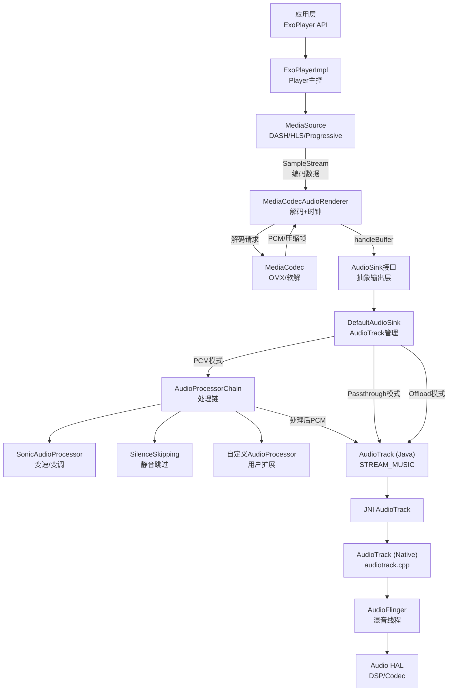
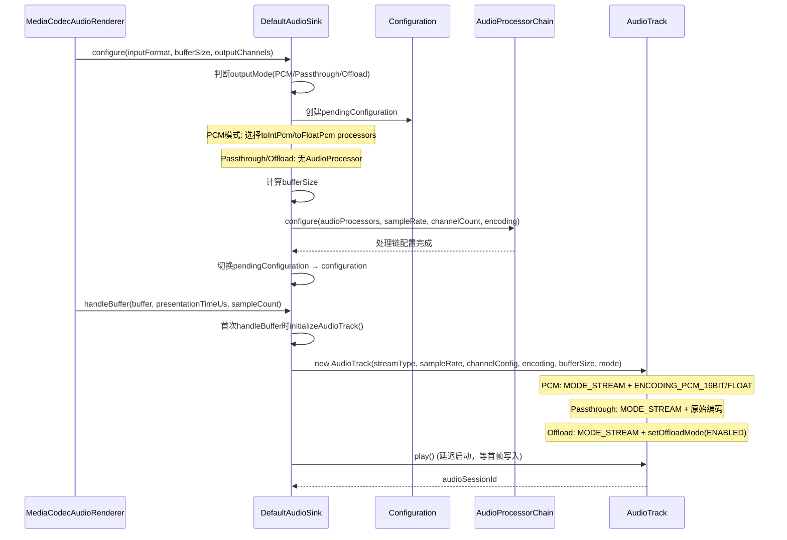
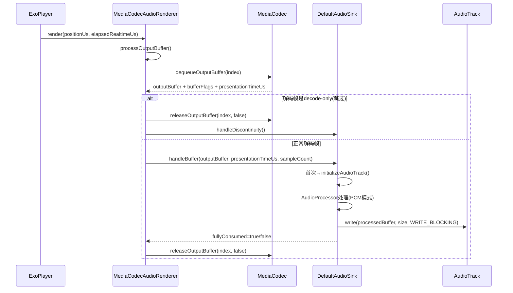
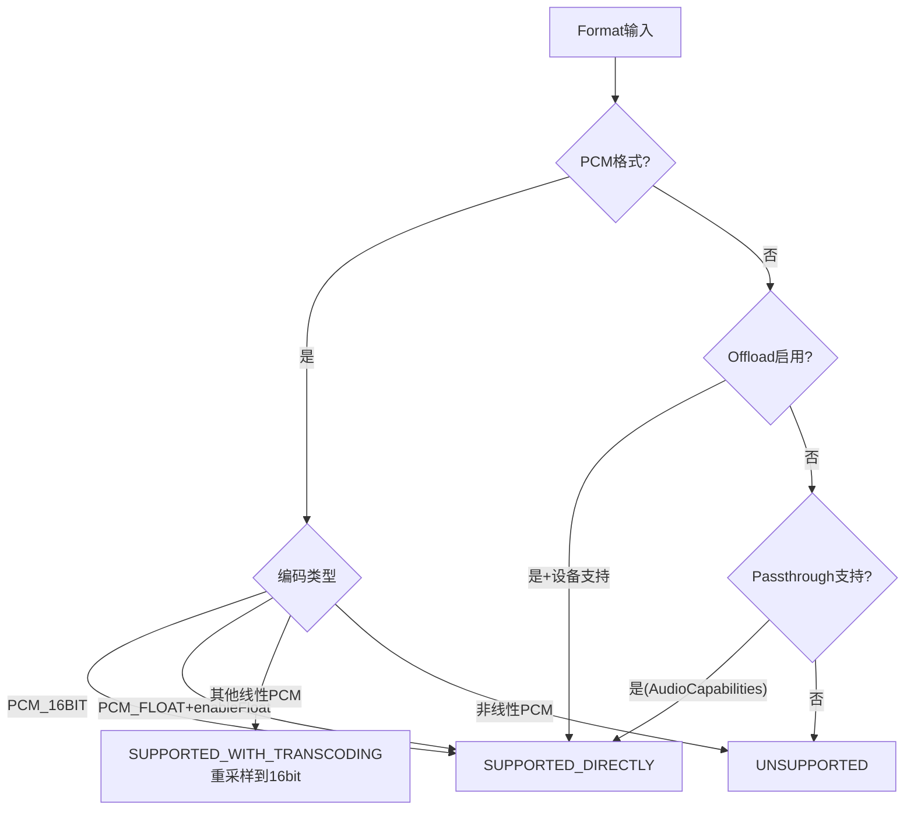

[← 2.9 MediaRecorder](02_2.9_MediaRecorder.md) | [← 返回Application Layer](README.md) | [返回导航](../README.md) | [2.11 OpenSL ES API →](02_2.11_OpenSL_ES_API.md)

---

## 2.10 ExoPlayer调用路径 — 应用层音频播放引擎

### 2.10.1 模块职责与源码位置

ExoPlayer是Google开源的媒体播放器库（非AOSP原生框架API，但在Android生态广泛使用），提供比MediaPlayer更灵活的播放能力。核心音频特性：

- **直接AudioTrack**：绕过MediaPlayer/MediaPlayerService，应用进程内直接创建AudioTrack
- **自适应码率**：DASH/HLS/SmoothStreaming自适应流切换
- **3种输出模式**：PCM解码→AudioTrack / Passthrough直传 / Offload压缩码流直传DSP
- **AudioProcessor链**：SilenceSkipping + Sonic(变速) + 自定义处理
- **隧道模式**：音视频同步由AudioFlinger/HW Composer负责

**源码位置**（AOSP14中的ExoPlayer 2.x）：

| 模块 | 文件 | 职责 |
|------|------|------|
| AudioSink接口 | [`AudioSink.java`](external/exoplayer/tree_15dc86382f17a24a3e881e52e31a810c1ea44b49/library/core/src/main/java/com/google/android/exoplayer2/audio/AudioSink.java) | 音频输出抽象层 |
| DefaultAudioSink | [`DefaultAudioSink.java`](external/exoplayer/tree_15dc86382f17a24a3e881e52e31a810c1ea44b49/library/core/src/main/java/com/google/android/exoplayer2/audio/DefaultAudioSink.java) | AudioTrack创建+写入+位置追踪 |
| MediaCodecAudioRenderer | [`MediaCodecAudioRenderer.java`](external/exoplayer/tree_15dc86382f17a24a3e881e52e31a810c1ea44b49/library/core/src/main/java/com/google/android/exoplayer2/audio/MediaCodecAudioRenderer.java) | MediaCodec解码→AudioSink |
| DefaultAudioProcessorChain | [`DefaultAudioSink.java`](external/exoplayer/tree_15dc86382f17a24a3e881e52e31a810c1ea44b49/library/core/src/main/java/com/google/android/exoplayer2/audio/DefaultAudioSink.java:146) | 默认AudioProcessor链 |
| SonicAudioProcessor | [`SonicAudioProcessor.java`](external/exoplayer/tree_15dc86382f17a24a3e881e52e31a810c1ea44b49/library/core/src/main/java/com/google/android/exoplayer2/audio/SonicAudioProcessor.java) | 变速变调处理 |
| SilenceSkippingAudioProcessor | [`SilenceSkippingAudioProcessor.java`](external/exoplayer/tree_15dc86382f17a24a3e881e52e31a810c1ea44b49/library/core/src/main/java/com/google/android/exoplayer2/audio/SilenceSkippingAudioProcessor.java) | 静音跳过 |
| AudioTrackPositionTracker | [`AudioTrackPositionTracker.java`](external/exoplayer/tree_15dc86382f17a24a3e881e52e31a810c1ea44b49/library/core/src/main/java/com/google/android/exoplayer2/audio/AudioTrackPositionTracker.java) | AudioTrack位置平滑 |
| ExoPlayerImpl | [`ExoPlayerImpl.java`](external/exoplayer/tree_15dc86382f17a24a3e881e52e31a810c1ea44b49/library/core/src/main/java/com/google/android/exoplayer2/ExoPlayerImpl.java) | Player主控 |

### 2.10.2 整体架构



### 2.10.3 三种输出模式详解

DefaultAudioSink定义了3种输出模式（[`DefaultAudioSink.java`](external/exoplayer/tree_15dc86382f17a24a3e881e52e31a810c1ea44b49/library/core/src/main/java/com/google/android/exoplayer2/audio/DefaultAudioSink.java:370)）：

| 输出模式 | 常量值 | AudioTrack编码 | AudioProcessor链 | 适用格式 |
|----------|-------|---------------|-----------------|---------|
| `OUTPUT_MODE_PCM` | 0 | ENCODING_PCM_16BIT / ENCODING_PCM_FLOAT | 全链路(Sonic+Silence+自定义) | 所有解码后PCM |
| `OUTPUT_MODE_OFFLOAD` | 1 | 压缩编码(AAC/MP3等) | **不可用** | Offload直传DSP |
| `OUTPUT_MODE_PASSTHROUGH` | 2 | 原始编码格式 | **不可用** | Passthrough直传 |

**PCM模式详细流程**：

```
编码数据 → MediaCodec解码 → PCM(16bit/float)
→ ResamplingAudioProcessor(重采样到目标格式)
→ ChannelMappingAudioProcessor(通道映射)
→ TrimmingAudioProcessor(裁剪encoder delay/padding)
→ 用户自定义AudioProcessor[]
→ SilenceSkippingAudioProcessor(静音跳过)
→ SonicAudioProcessor(变速变调)
→ AudioTrack.write()
```

**Offload模式详解**（[`DefaultAudioSink.java`](external/exoplayer/tree_15dc86382f17a24a3e881e52e31a810c1ea44b49/library/core/src/main/java/com/google/android/exoplayer2/audio/DefaultAudioSink.java:339)）：

- 4种Offload配置：`OFFLOAD_MODE_DISABLED`(0) / `OFFLOAD_MODE_ENABLED_GAPLESS_REQUIRED`(1) / `OFFLOAD_MODE_ENABLED_GAPLESS_NOT_REQUIRED`(2) / `OFFLOAD_MODE_ENABLED_GAPLESS_DISABLED`(3)
- 大多数设备同一时刻仅支持1个Offload AudioTrack
- DSP可能随时回收Offload AudioTrack（ERROR_DEAD_OBJECT）
- AudioTrack.setOffloadMode() → AudioTrack.OFFLOAD_MODE_ENABLED
- 不支持AudioProcessor（变速变调/静音跳过不可用）

### 2.10.4 DefaultAudioSink核心数据结构

**Configuration内部类**（存储AudioTrack配置参数）：

| 字段 | 类型 | 含义 |
|------|------|------|
| `outputMode` | int | PCM/PASSTHROUGH/OFFLOAD |
| `inputFormat` | Format | 输入音频格式 |
| `outputEncoding` | @C.Encoding | 输出编码(PCM_16BIT/PCM_FLOAT/压缩) |
| `outputSampleRate` | int | 输出采样率 |
| `outputChannelCount` | int | 输出通道数 |
| `pcmFrameSize` | int | PCM帧大小(字节) |
| `bufferSize` | int | AudioTrack缓冲区大小(字节) |
| `audioSessionId` | int | AudioSession ID |
| `tunneling` | boolean | 是否隧道模式 |

**关键常量**（[`DefaultAudioSink.java`](external/exoplayer/tree_15dc86382f17a24a3e881e52e31a810c1ea44b49/library/core/src/main/java/com/google/android/exoplayer2/audio/DefaultAudioSink.java:374)）：

| 常量 | 值 | 含义 |
|------|-----|------|
| `MIN_BUFFER_DURATION_US` | 250,000 | 最小缓冲时长250ms |
| `MAX_BUFFER_DURATION_US` | 750,000 | 最大缓冲时长750ms |
| `PASSTHROUGH_BUFFER_DURATION_US` | 250,000 | Passthrough缓冲250ms |
| `OFFLOAD_BUFFER_DURATION_US` | 50,000,000 | Offload缓冲50秒 |
| `BUFFER_MULTIPLICATION_FACTOR` | 4 | 缓冲区放大因子(4x最小值) |
| `AC3_BUFFER_MULTIPLICATION_FACTOR` | 2 | AC3缓冲放大因子 |
| `AUDIO_TRACK_RETRY_DURATION_MS` | 100 | AudioTrack初始化/写入重试100ms |
| `ERROR_NATIVE_DEAD_OBJECT` | -32 | 某设备不转换ERROR_DEAD_OBJECT的workaround |

### 2.10.5 AudioTrack创建流程

DefaultAudioSink在`configure()`+`initializeAudioTrack()`中创建AudioTrack：



**bufferSize计算策略**：

1. PCM模式：`max(getMinBufferSize(), durationUs→bytes) × BUFFER_MULTIPLICATION_FACTOR`
2. Passthrough模式：`PASSTHROUGH_BUFFER_DURATION_US→bytes × AC3因子(如需要)`
3. Offload模式：`OFFLOAD_BUFFER_DURATION_US→bytes`

### 2.10.6 MediaCodecAudioRenderer解码流程

[`MediaCodecAudioRenderer`](external/exoplayer/tree_15dc86382f17a24a3e881e52e31a810c1ea44b49/library/core/src/main/java/com/google/android/exoplayer2/audio/MediaCodecAudioRenderer.java:86)继承`MediaCodecRenderer implements MediaClock`：

**构造函数链**（6种构造方式，最终都传入AudioSink）：

```java
// 最简构造
public MediaCodecAudioRenderer(Context context, MediaCodecSelector mediaCodecSelector) {
    this(context, mediaCodecSelector, null, null);
}  // L117

// 最终构造
public MediaCodecAudioRenderer(Context context, MediaCodecAdapter.Factory codecAdapterFactory,
    MediaCodecSelector mediaCodecSelector, boolean enableDecoderFallback,
    Handler eventHandler, AudioRendererEventListener eventListener, AudioSink audioSink) {
    super(C.TRACK_TYPE_AUDIO, codecAdapterFactory, mediaCodecSelector,
        enableDecoderFallback, 44100);  // assumedMinimumCodecOperatingRate=44100
    this.audioSink = audioSink;
    audioSink.setListener(new AudioSinkListener());
}  // L239-257
```

**解码→输出完整流程**：



**onOutputFormatChanged**（[`L497`](external/exoplayer/tree_15dc86382f17a24a3e881e52e31a810c1ea44b49/library/core/src/main/java/com/google/android/exoplayer2/audio/MediaCodecAudioRenderer.java:497)）：

- 从MediaFormat提取channelCount/sampleRate/pcmEncoding
- 构造audioSinkInputFormat
- 处理Vivo设备workaround(VIVO_BITS_PER_SAMPLE_KEY)
- 处理6ch→2ch discard channels workaround
- 调用`audioSink.configure(audioSinkInputFormat, 0, channelMap)`

### 2.10.7 AudioProcessor链详解

[`DefaultAudioProcessorChain`](external/exoplayer/tree_15dc86382f17a24a3e881e52e31a810c1ea44b49/library/core/src/main/java/com/google/android/exoplayer2/audio/DefaultAudioSink.java:146)处理链结构：

```
输入PCM → [用户自定义AudioProcessor...] → SilenceSkippingAudioProcessor → SonicAudioProcessor → 输出PCM
```

**toIntPcmAvailableAudioProcessors**（PCM→16bit路径）：

| 处理器 | 功能 | 默认激活条件 |
|-------|------|------------|
| `ResamplingAudioProcessor` | 重采样到16-bit PCM | 非16-bit输入时 |
| `ChannelMappingAudioProcessor` | 通道重映射 | outputChannels指定时 |
| `TrimmingAudioProcessor` | 裁剪encoder delay/padding | 有encoderDelay/Padding时 |
| `[用户自定义...]` | 自定义处理 | 用户配置 |
| `SilenceSkippingAudioProcessor` | 静音跳过 | skipSilence=true |
| `SonicAudioProcessor` | 变速变调 | speed≠1.0或pitch≠1.0 |

**toFloatPcmAvailableAudioProcessors**（PCM→float路径）：

| 处理器 | 功能 |
|-------|------|
| `FloatResamplingAudioProcessor` | 16-bit PCM→32-bit float |

> **关键设计**：Float输出模式不支持AudioProcessor链（除FloatResampling外），因为变速/变调/静音跳过需要整数PCM处理。

### 2.10.8 AudioSink接口完整方法列表

[`AudioSink`](external/exoplayer/tree_15dc86382f17a24a3e881e52e31a810c1ea44b49/library/core/src/main/java/com/google/android/exoplayer2/audio/AudioSink.java:60)接口定义：

| 方法 | 返回类型 | 功能 |
|------|---------|------|
| `supportsFormat(Format)` | boolean | 格式是否可播放 |
| `getFormatSupport(Format)` | @SinkFormatSupport | SUPPORTED_DIRECTLY / WITH_TRANSCODING / UNSUPPORTED |
| `configure(Format,int,int[])` | void | 配置输出格式 |
| `handleBuffer(ByteBuffer,long,int)` | boolean | 写入音频数据(返回是否完全消费) |
| `handleDiscontinuity()` | void | 处理位置不连续(seek后) |
| `play()` | void | 开始播放 |
| `pause()` | void | 暂停播放 |
| `flush()` | void | 刷新AudioTrack |
| `reset()` | void | 完全重置 |
| `setPlaybackParameters(PlaybackParameters)` | void | 设置变速变调参数 |
| `getPlaybackParameters()` | PlaybackParameters | 获取当前参数 |
| `setAudioAttributes(AudioAttributes)` | void | 设置音频属性 |
| `setVolume(float)` | void | 设置音量(0.0-1.0) |
| `setAuxEffectInfo(AuxEffectInfo)` | void | 设置辅助效果 |
| `enableTunnelingV21()` | void | 启用隧道模式 |
| `disableTunneling()` | void | 禁用隧道模式 |
| `setAudioSessionId(int)` | void | 设置AudioSession ID |
| `getAudioSessionId()` | int | 获取AudioSession ID |
| `setPlayerId(PlayerId)` | void | 设置PlayerId(用于Metrics) |
| `hasPendingData()` | boolean | 是否有未播放数据 |
| `isEnded()` | boolean | 是否播放结束 |
| `getCurrentPositionUs(boolean)` | long | 当前播放位置(微秒) |

**AudioSink.Listener回调**：

| 回调 | 含义 |
|------|------|
| `onPositionDiscontinuity()` | 位置不连续 |
| `onPositionAdvancing(playoutStartMs)` | 位置首次推进(播放开始) |
| `onUnderrun(bufferSize, bufferSizeMs, elapsedMs)` | AudioTrack underrun |
| `onSkipSilenceEnabledChanged(enabled)` | 静音跳过状态变更 |
| `onOffloadBufferEmptying()` | Offload缓冲正在清空 |
| `onOffloadBufferFull(deadlineMs)` | Offload缓冲已满 |
| `onAudioSinkError(Exception)` | AudioSink错误 |

### 2.10.9 AudioTrack位置追踪

[`AudioTrackPositionTracker`](external/exoplayer/tree_15dc86382f17a24a3e881e52e31a810c1ea44b49/library/core/src/main/java/com/google/android/exoplayer2/audio/AudioTrackPositionTracker.java)负责AudioTrack播放位置的精确追踪和平滑处理：

**位置获取策略**：

| API级别 | 位置获取方式 | 精度 |
|---------|------------|------|
| API 19+ | `AudioTrack.getTimestamp()` | 高精度(硬件timestamp) |
| 所有级别 | `AudioTrack.getPlaybackHeadPosition()` | 中精度(可能不连续) |
| 辅助 | 计算writtenFrames - playbackHeadPosition | 缓冲区剩余推算 |

**位置平滑算法**：

1. 定期调用`AudioTrack.getTimestamp()`获取硬件时间戳
2. 检测spurious timestamp（位置回跳超过阈值→InvalidAudioTrackTimestampException）
3. 线性插值平滑position，避免AudioTrack.getPlaybackHeadPosition()的16-bit截断不连续
4. 结合mediaPositionParametersCheckpoints队列，处理变速变调下的媒体时间映射

### 2.10.10 Passthrough模式详解

Passthrough模式将压缩音频（如AC3/EAC3/DTS）直接传给AudioTrack，不做解码：

**Passthrough判断逻辑**（[`DefaultAudioSink.java`](external/exoplayer/tree_15dc86382f17a24a3e881e52e31a810c1ea44b49/library/core/src/main/java/com/google/android/exoplayer2/audio/DefaultAudioSink.java:626)）：

```java
if (isPassthroughPlaybackSupported(format, audioCapabilities)) {
    return SINK_FORMAT_SUPPORTED_DIRECTLY;
}
```

**AudioCapabilities作用**：

- 查询设备是否支持特定编码的Passthrough
- `DEFAULT_AUDIO_CAPABILITIES` = 不支持任何Passthrough
- 通过`AudioCapabilities.getAudioCapabilities(context)`获取设备真实能力
- HDMI/S/PDIF连接时通常支持AC3/DTS Passthrough

**Passthrough vs Offload区别**：

| 维度 | Passthrough | Offload |
|------|-------------|---------|
| 数据流向 | AudioTrack→AudioFlinger→HAL→DSP | AudioTrack→AudioFlinger→HAL→DSP |
| AudioTrack编码 | 压缩编码(ENCODING_AC3等) | 压缩编码(setOffloadMode) |
| 解码位置 | HAL/DSP | DSP |
| 缓冲时长 | 250ms | 50秒 |
| 变速变调 | 不支持 | 不支持 |
| Gapless | 不支持 | 支持(GAPLESS_REQUIRED配置) |
| 多实例 | 可多个 | 大多设备仅1个 |
| 可靠性 | 较稳定 | DSP可能随时回收 |

### 2.10.11 隧道模式(Tunneling)

隧道模式将音视频同步交给底层硬件，ExoPlayer不做时钟驱动：

**启用条件**：

- API 21+（`enableTunnelingV21()`）
- `MediaCodecAudioRenderer.onEnabled()`中根据getConfiguration().tunneling决定
- AudioTrack创建时设置`FLAG_TUNNEL_MODE`
- AudioTrack的sessionId与视频MediaCodec共享

**隧道模式约束**：

- AudioProcessor不能改变输出帧时长（变速不可用）
- BufferProcessor必须立即输出最后一帧输入后的输出
- ExoPlayer不驱动MediaClock，由AudioFlinger/HW Composer同步

### 2.10.12 音量与AudioAttributes映射

**音量控制**：

```java
// DefaultAudioSink.setVolume(float volume) → audioTrack.setVolume(volume)
// 或 API <21: audioTrack.setStereoVolume(volume, volume)
```

- 范围0.0-1.0，直接映射AudioTrack.setVolume()
- 不经过AudioProcessor，直接在AudioTrack层设置

**AudioAttributes映射**（ExoPlayer→Android AudioAttributes）：

| ExoPlayer AudioAttributes | Android AudioAttributes | AudioTrack streamType |
|--------------------------|----------------------|---------------------|
| USAGE_MEDIA | CONTENT_TYPE_MOVIE + USAGE_MEDIA | STREAM_MUSIC |
| USAGE_VOICE_COMMUNICATION | CONTENT_TYPE_SPEECH + USAGE_VOICE_COMMUNICATION | STREAM_VOICE_CALL |
| USAGE_GAME | CONTENT_TYPE_GAME + USAGE_GAME | STREAM_MUSIC |
| USAGE_ALARM | CONTENT_TYPE_SONIFICATION + USAGE_ALARM | STREAM_ALARM |

**AudioSession ID管理**：

- 默认：让AudioTrack自动分配sessionId
- 自定义：`setAudioSessionId(sessionId)` → AudioTrack创建时使用指定ID
- 场景：AudioEffect需要绑定到特定session

### 2.10.13 Renderer消息类型

[`MediaCodecAudioRenderer`](external/exoplayer/tree_15dc86382f17a24a3e881e52e31a810c1ea44b49/library/core/src/main/java/com/google/android/exoplayer2/audio/MediaCodecAudioRenderer.java:70)支持通过ExoPlayer.createMessage发送的控制消息：

| MSG类型 | Payload类型 | 功能 |
|---------|-----------|------|
| `MSG_SET_VOLUME` | Float (0-1) | 设置音量 |
| `MSG_SET_AUDIO_ATTRIBUTES` | AudioAttributes | 设置音频属性 |
| `MSG_SET_AUX_EFFECT_INFO` | AuxEffectInfo | 设置辅助效果 |
| `MSG_SET_SKIP_SILENCE_ENABLED` | Boolean | 静音跳过 |
| `MSG_SET_AUDIO_SESSION_ID` | Integer | 设置AudioSession ID |

### 2.10.14 事件回调体系

**AudioRendererEventListener.EventDispatcher**分发的事件：

| 回调方法 | 含义 |
|---------|------|
| `onAudioEnabled(decoderCounters)` | 音频渲染器启用 |
| `onAudioDecoderInitialized(name, initTs, initDuration)` | 解码器初始化 |
| `onAudioDecoderReleased(name)` | 解码器释放 |
| `onAudioAudioCodecError(error)` | 解码器错误 |
| `onAudioInputFormatChanged(format, evaluation)` | 输入格式变更 |
| `onAudioPositionAdvancing(playoutStartMs)` | 播放位置首次推进 |
| `onAudioUnderrun(bufferSize, bufferSizeMs, elapsedMs)` | AudioTrack underrun |
| `onAudioSkipSilenceEnabledChanged(enabled)` | 静音跳过变更 |

### 2.10.15 Offload缓冲与事件回调

Offload模式下DSP缓冲50秒音频数据，需要特殊缓冲管理：

**StreamEventCallbackV29**（API 29+的Offload事件回调）：

| 回调 | 含义 |
|------|------|
| `onOffloadTrackEndOfStream()` | Offload流结束 |
| `onOffloadTrackError()` | Offload错误 |
| `onOffloadBufferEmptying()` | DSP缓冲正在清空 |
| `onOffloadBufferFull()` | DSP缓冲已满 |

**Offload恢复策略**：

- `ERROR_DEAD_OBJECT` → 重建AudioTrack并重试
- `AUDIO_TRACK_RETRY_DURATION_MS`(100ms)内的重试不抛异常
- `PendingExceptionHolder`延迟异常上报机制

### 2.10.16 格式支持判断流程

[`supportsFormat()`](external/exoplayer/tree_15dc86382f17a24a3e881e52e31a810c1ea44b49/library/core/src/main/java/com/google/android/exoplayer2/audio/DefaultAudioSink.java:603)的格式支持判断逻辑：



**MediaCodecAudioRenderer格式支持**（[`L278`](external/exoplayer/tree_15dc86382f17a24a3e881e52e31a810c1ea44b49/library/core/src/main/java/com/google/android/exoplayer2/audio/MediaCodecAudioRenderer.java:278)）：

1. 首先检查AudioSink是否直接支持格式(Passthrough/Offload) → `FORMAT_HANDLED`
2. PCM格式检查AudioSink是否支持该PCM → `FORMAT_UNSUPPORTED_SUBTYPE`
3. 其他格式检查解码器列表 → `FORMAT_HANDLED/EXCEEDS_CAPABILITIES/UNSUPPORTED_SUBTYPE`
4. DRM检查 → `FORMAT_UNSUPPORTED_DRM`

### 2.10.17 experimentalKeepAudioTrackOnSeek

[`experimentalSetEnableKeepAudioTrackOnSeek()`](external/exoplayer/tree_15dc86382f17a24a3e881e52e31a810c1ea44b49/library/core/src/main/java/com/google/android/exoplayer2/audio/MediaCodecAudioRenderer.java:273)：

- 默认：seek时release AudioTrack → 重新创建
- 实验模式：seek时flush AudioTrack（不release）
- 目的：减少seek延迟（避免AudioTrack重建开销）
- 代价：某些设备flush后可能出现问题

**seek处理对比**：

| 操作 | 默认模式 | 实验模式 |
|------|---------|---------|
| seek时 | audioSink.flush() → release+重建 | audioSink.experimentalFlushWithoutAudioTrackRelease() |
| 延迟 | 较高(重建AudioTrack) | 较低(仅flush) |
| 稳定性 | 高 | 实验性，设备兼容性待验证 |

### 2.10.18 ExoPlayer vs MediaPlayer音频路径对比

| 维度 | ExoPlayer | MediaPlayer |
|------|----------|------------|
| AudioTrack创建位置 | 应用进程(DefaultAudioSink) | mediaserver进程(MediaPlayerService) |
| 解码器 | 应用进程(MediaCodec) | mediaserver进程(AwesomePlayer/NuPlayer) |
| IPC开销 | 无(同一进程) | Binder IPC每帧数据 |
| AudioProcessor | 支持(Sonic/SilenceSkip/自定义) | 不支持 |
| 变速变调 | SonicAudioProcessor(高质量) | PlaybackParams(低延迟/不可靠) |
| Passthrough | 支持(需AudioCapabilities) | NuPlayer自动判断 |
| Offload | 支持(需配置) | NuPlayer自动判断 |
| 隧道模式 | 支持(V21+) | NuPlayer支持 |
| 自适应码率 | DASH/HLS/SmoothStreaming | 不支持 |
| 位置追踪 | AudioTrackPositionTracker(平滑) | MediaPlayer.getTimestamp |
| 错误恢复 | PendingExceptionHolder+重试 | 有限恢复 |
| 适用场景 | 流媒体/自定义处理/低延迟 | 简单本地播放 |

### 2.10.19 AAOS车载场景中的ExoPlayer

在AAOS车载系统中，ExoPlayer的优势：

- **多音区路由**：通过`setAudioAttributes()` + CarAudioManager设置音区路由
- **低延迟播放**：避免mediaserver IPC开销
- **Offload省电**：DSP直传减少CPU负载
- **静音跳过**：导航播报自动跳过静音段
- **隧道模式**：与车载视频显示硬件同步
- **自适应码率**：车载网络不稳定时自动降级

---

[← 2.9 MediaRecorder](02_2.9_MediaRecorder.md) | [← 返回Application Layer](README.md) | [返回导航](../README.md) | [2.11 OpenSL ES API →](02_2.11_OpenSL_ES_API.md)