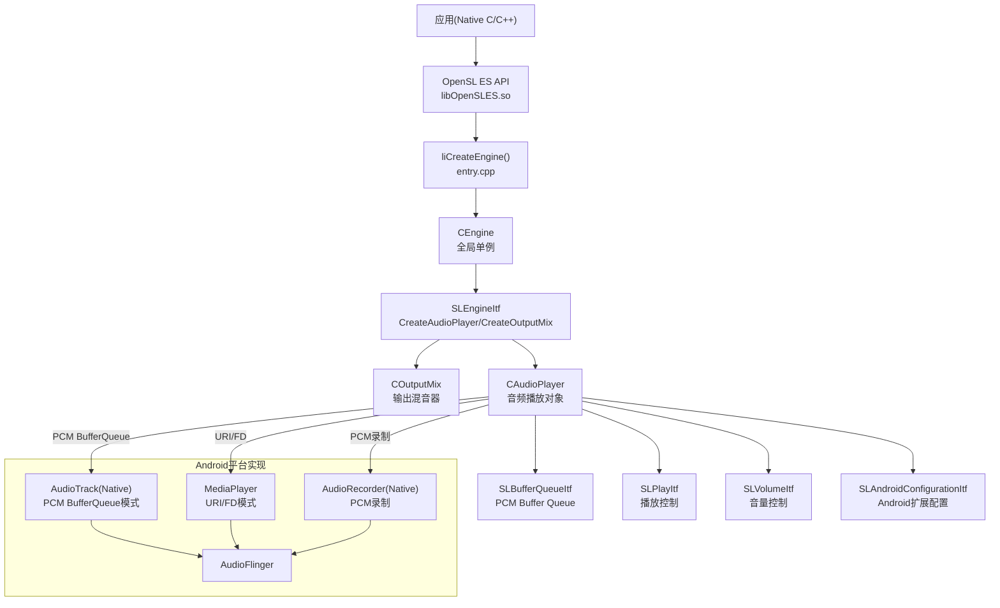
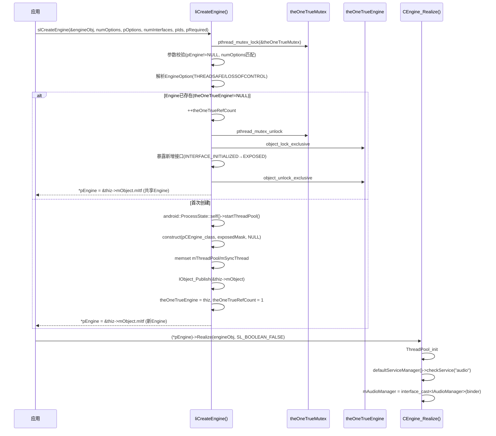
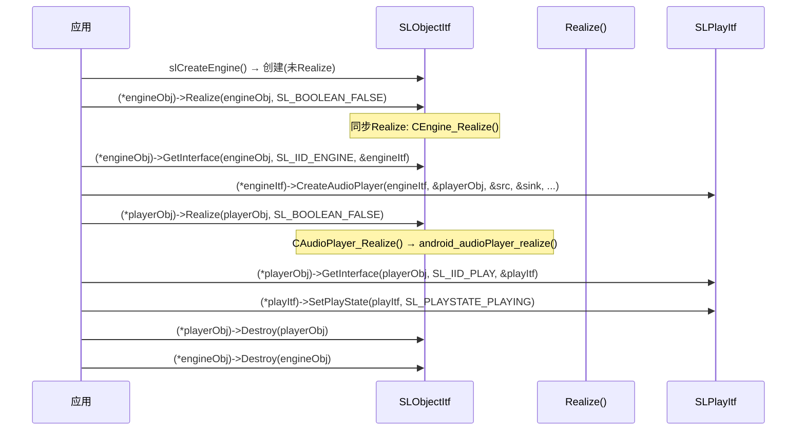

[← 2.10 ExoPlayer调用路径](02_2.10_ExoPlayer调用路径.md) | [← 返回Application Layer](README.md) | [返回导航](../README.md) | [2.12 MediaCodec →](02_2.12_MediaCodec.md)

---

## 2.11 OpenSL ES API — Khronos Native音频接口

### 2.11.1 模块职责与源码位置

OpenSL ES (Open Sound Library for Embedded Systems) 是Khronos Group定义的Native音频C API，Android从2.3(API 9)引入。AOSP14中实现完整但处于维护模式，推荐新项目使用AAudio。

**核心职责**：
- **Native层音频播放/录制**：不经过Java层JNI开销
- **Buffer Queue回调模式**：低延迟PCM数据推送
- **效果器集成**：Android Effect/EffectSend接口
- **URI/FD播放**：通过MediaPlayer内部引擎(NuPlayer)播放

**源码位置**：

| 目录 | 职责 |
|------|------|
| [`frameworks/wilhelm/include/SLES/`](frameworks/wilhelm/include/SLES/) | 公共头文件(OpenSLES.h/OpenSLES_Android.h) |
| [`frameworks/wilhelm/src/`](frameworks/wilhelm/src/) | 实现代码 |
| [`frameworks/wilhelm/src/entry.cpp`](frameworks/wilhelm/src/entry.cpp) | slCreateEngine/xaCreateEngine入口 |
| [`frameworks/wilhelm/src/sl_entry.cpp`](frameworks/wilhelm/src/sl_entry.cpp) | slCreateEngine分发 |
| [`frameworks/wilhelm/src/objects/CEngine.cpp`](frameworks/wilhelm/src/objects/CEngine.cpp) | CEngine对象实现 |
| [`frameworks/wilhelm/src/objects/CAudioPlayer.cpp`](frameworks/wilhelm/src/objects/CAudioPlayer.cpp) | AudioPlayer对象 |
| [`frameworks/wilhelm/src/itf/IEngine.cpp`](frameworks/wilhelm/src/itf/IEngine.cpp) | SLEngineItf→CreateAudioPlayer/CreateAudioRecorder |
| [`frameworks/wilhelm/src/android/AudioPlayer_to_android.cpp`](frameworks/wilhelm/src/android/AudioPlayer_to_android.cpp) | Android平台AudioPlayer→AudioTrack/MediaPlayer桥接 |

### 2.11.2 整体架构



### 2.11.3 Engine创建流程 — liCreateEngine详解

[`liCreateEngine()`](frameworks/wilhelm/src/entry.cpp:27)是slCreateEngine和xaCreateEngine的共享实现：



**全局单例机制**（[`CEngine.cpp`](frameworks/wilhelm/src/objects/CEngine.cpp:29)）：

| 全局变量 | 类型 | 含义 |
|---------|------|------|
| `theOneTrueEngine` | CEngine* | 全局唯一Engine实例 |
| `theOneTrueMutex` | pthread_mutex_t | Engine创建互斥锁 |
| `theOneTrueRefCount` | unsigned | Engine引用计数(多创建共享) |

**EngineOption解析**：

| Feature常量 | 含义 | 默认值 |
|-------------|------|--------|
| `SL_ENGINEOPTION_THREADSAFE` | 线程安全模式 | SL_BOOLEAN_TRUE |
| `SL_ENGINEOPTION_LOSSOFCONTROL` | 丢失控制不报错 | SL_BOOLEAN_FALSE |

**CEngine_Realize关键操作**（[`L57`](frameworks/wilhelm/src/objects/CEngine.cpp:57)）：

1. ThreadPool_init → 异步操作的线程池
2. `defaultServiceManager()->checkService("audio")` → 获取AudioManager Binder服务
3. `mAudioManager = interface_cast<IAudioManager>(binder)` → 保存IAudioManager引用

### 2.11.4 CreateAudioPlayer流程

通过SLEngineItf的CreateAudioPlayer创建播放器，数据源和数据Sink配置决定了播放模式：

**4种Android AudioPlayer类型**（[`AudioPlayer_to_android.cpp`](frameworks/wilhelm/src/android/AudioPlayer_to_android.cpp:1579)）：

| ObjType | 数据源+Sink | 底层实现 | 用途 |
|---------|-------------|---------|------|
| `AUDIOPLAYER_FROM_PCM_BUFFERQUEUE` | PCM+BufferQueue Sink | AudioTrack | 低延迟PCM播放 |
| `AUDIOPLAYER_FROM_URIFD` | URI/FD+OutputMix Sink | LocAVPlayer | URI/文件播放 |
| `AUDIOPLAYER_FROM_TS_ANDROIDBUFFERQUEUE` | MPEG-TS+ABQ Sink | StreamPlayer | 流媒体 |
| `AUDIOPLAYER_FROM_URIFD_TO_PCM_BUFFERQUEUE` | URI+PCM BufferQueue Sink | AudioToCbRenderer | URI→PCM解码→回调 |

### 2.11.5 PCM BufferQueue播放器创建详解

[`android_audioPlayer_realize()`](frameworks/wilhelm/src/android/AudioPlayer_to_android.cpp:1571)对PCM BufferQueue播放器的处理：

**AudioTrack创建参数映射**：

| OpenSL ES参数 | 映射到AudioTrack参数 |
|--------------|---------------------|
| `df_pcm->samplesPerSec` | `sles_to_android_sampleRate()` → sampleRate |
| `df_pcm->channelMask` | `sles_to_audio_output_channel_mask()` → channelMask |
| PCM format(bitsPerSample) | `sles_to_android_sampleFormat()` → format |
| numChannels | audio_channel_out_mask_from_count() (兼容fallback) |
| mSessionId | session_id |
| mStreamType | → audio_attributes_t.usage |

**PerformanceMode → AudioTrack flags映射**（[`L1613`](frameworks/wilhelm/src/android/AudioPlayer_to_android.cpp:1613)）：

| PerformanceMode | audio_output_flags_t | audio_flags_mask_t | 含义 |
|----------------|---------------------|--------------------|------|
| `POWER_SAVING` | `AUDIO_OUTPUT_FLAG_DEEP_BUFFER` | `AUDIO_FLAG_DEEP_BUFFER` | 省电优先 |
| `NONE` | `AUDIO_OUTPUT_FLAG_NONE` | AUDIO_FLAG_NONE | 无特殊要求 |
| `LATENCY_EFFECTS` | `AUDIO_OUTPUT_FLAG_FAST` | `AUDIO_FLAG_LOW_LATENCY` | 低延迟+效果 |
| `LATENCY` | `FAST + RAW` | `AUDIO_FLAG_LOW_LATENCY` | 极低延迟(无效果) |

**AudioTrack构造**（[`L1645`](frameworks/wilhelm/src/android/AudioPlayer_to_android.cpp:1645)）：

```cpp
const auto pat = android::sp<android::AudioTrack>::make(
    AUDIO_STREAM_DEFAULT,    // streamType (由attributes决定)
    sampleRate,              // 采样率
    sles_to_android_sampleFormat(df_pcm),  // 格式
    channelMask,             // 通道掩码
    0,                       // frameCount (自动计算)
    policy,                  // flags (由PerformanceMode决定)
    callbackHandle,          // callback (BufferQueue回调)
    notificationFrames,      // FAST模式=-mNumBuffers, 否则=0
    pAudioPlayer->mSessionId,
    android::AudioTrack::TRANSFER_DEFAULT,
    nullptr,                 // offloadInfo
    AttributionSourceState(),
    &attributes              // audio_attributes_t
);
```

**notificationFrames策略**：

- FAST模式：`notificationFrames = -mNumBuffers`（负值表示每个BufferQueue buffer为一个通知周期）
- 普通模式：`notificationFrames = 0`（默认通知周期）

**TrackPlayer初始化**（[`L1672`](frameworks/wilhelm/src/android/AudioPlayer_to_android.cpp:1672)）：

```cpp
pAudioPlayer->mTrackPlayer->init(
    pat, callbackHandle,
    android::PLAYER_TYPE_SLES_AUDIOPLAYER_BUFFERQUEUE,
    usageForStreamType(pAudioPlayer->mStreamType),
    pAudioPlayer->mSessionId);
```

- PLAYER_TYPE_SLES_AUDIOPLAYER_BUFFERQUEUE → AudioManager注册播放器类型
- checkAndSetPerformanceModePost → 检查实际获得的flags并更新PerformanceMode

### 2.11.6 URI/FD播放器创建详解

`AUDIOPLAYER_FROM_URIFD`模式（[`L1714`](frameworks/wilhelm/src/android/AudioPlayer_to_android.cpp:1714)）：

```cpp
pAudioPlayer->mAPlayer = new android::LocAVPlayer(&app, false /*hasVideo*/);
```

**数据源处理策略**：

| 数据定位器类型 | 处理方式 |
|--------------|---------|
| `SL_DATALOCATOR_URI` | 本地文件URI→open→fd→setDataSource(fd)；远程URI→setDataSource(uri) |
| `SL_DATALOCATOR_ANDROIDFD` | setDataSource(fd, offset, length) |

**URI→FD转换逻辑**（[`L1731`](frameworks/wilhelm/src/android/AudioPlayer_to_android.cpp:1731)）：

1. `isDistantProtocol(uri)` → true表示远程协议(http/https等)，直接传URI
2. 本地URI → 剔除`file://`前缀 → `::open(pathname, O_RDONLY)` → fstat验证 → `setDataSource(fd, 0, statbuf.st_size)`
3. 兼容性处理：旧版Stagefright在应用进程运行，可直接打开应用私有文件

**AudioManager注册**（[`L1774`](frameworks/wilhelm/src/android/AudioPlayer_to_android.cpp:1774)）：

```cpp
pAudioPlayer->mPIId = pAudioPlayer->mObject.mEngine->mAudioManager->trackPlayer(
    android::PLAYER_TYPE_SLES_AUDIOPLAYER_URI_FD,
    usageForStreamType(pAudioPlayer->mStreamType), AUDIO_CONTENT_TYPE_UNKNOWN,
    pAudioPlayer->mTrackPlayer, pAudioPlayer->mSessionId);
```

### 2.11.7 Android扩展接口详解

#### SLAndroidConfigurationItf

[`OpenSLES_Android.h`](frameworks/wilhelm/include/SLES/OpenSLES_Android.h:203)定义的Android配置接口：

| 方法 | 功能 |
|------|------|
| `SetConfiguration(configKey, pConfigValue, valueSize)` | 设置配置键值 |
| `GetConfiguration(configKey, pValueSize, pConfigValue)` | 获取配置值 |
| `AcquireJavaProxy(proxyType, pProxyObj)` | 获取Java代理对象 |
| `ReleaseJavaProxy(proxyType)` | 释放Java代理 |

**配置键值对**（[`OpenSLES_AndroidConfiguration.h`](frameworks/wilhelm/include/SLES/OpenSLES_AndroidConfiguration.h)）：

| Key | Value类型 | 适用对象 | 含义 |
|-----|----------|---------|------|
| `SL_ANDROID_KEY_STREAM_TYPE` | SLint32 | AudioPlayer | 播放流类型 |
| `SL_ANDROID_KEY_RECORDING_PRESET` | SLuint32 | AudioRecorder | 录制预设 |
| `SL_ANDROID_KEY_PERFORMANCE_MODE` | SLuint32 | AudioPlayer/Recorder | 性能模式 |

**Recording Preset值**：

| 值 | 含义 | 对应AudioManager |
|----|------|-----------------|
| `GENERIC`(1) | 通用录制 | MIC |
| `CAMCORDER`(2) | 录像模式 | CAMCORDER |
| `VOICE_RECOGNITION`(3) | 语音识别 | VOICE_RECOGNITION |
| `VOICE_COMMUNICATION`(4) | 语音通话 | VOICE_COMMUNICATION |
| `UNPROCESSED`(5) | 未处理 | UNPROCESSED |

**Performance Mode值**：

| 值 | 含义 | AudioTrack flags |
|----|------|-----------------|
| `NONE`(0) | 无特殊要求 | FLAG_NONE |
| `LATENCY`(1) | 低延迟优先 | FAST+RAW |
| `LATENCY_EFFECTS`(2) | 低延迟+效果 | FAST |
| `POWER_SAVING`(3) | 省电优先 | DEEP_BUFFER |

#### SLAndroidDataFormat_PCM_EX

[`OpenSLES_Android.h`](frameworks/wilhelm/include/SLES/OpenSLES_Android.h:48)定义的扩展PCM格式：

| 字段 | 含义 |
|------|------|
| `formatType` | SL_ANDROID_DATAFORMAT_PCM_EX (0x00000004) |
| `numChannels` | 通道数 |
| `sampleRate` | 采样率(Hz) |
| `bitsPerSample` | 位深度 |
| `containerSize` | 容器大小 |
| `channelMask` | 通道掩码(支持indexed) |
| `endianness` | 字节序 |
| `representation` | SIGNED_INT/UNSIGNED_INT/FLOAT |

**PCM representation常量**：

| 常量 | 值 | 含义 |
|------|-----|------|
| `SL_ANDROID_PCM_REPRESENTATION_SIGNED_INT` | 0x00000001 | 有符号整数PCM |
| `SL_ANDROID_PCM_REPRESENTATION_UNSIGNED_INT` | 0x00000002 | 无符号整数PCM |
| `SL_ANDROID_PCM_REPRESENTATION_FLOAT` | 0x00000003 | 浮点PCM |

### 2.11.8 BufferQueue接口详解

#### SLBufferQueueItf (标准)

标准BufferQueue接口用于PCM数据推送：

| 方法 | 功能 |
|------|------|
| `Enqueue(pBuffer, size)` | 推入PCM buffer |
| `Clear()` | 清空队列 |
| `GetState(pState)` | 获取队列状态(count+index) |
| `RegisterCallback(callback, pContext)` | 注册回调 |

**BufferQueue回调机制**：

- 回调在AudioTrack的BUFFER_EVENT回调线程中触发
- FAST模式下回调频率 = BufferQueue buffer数量
- 回调中应立即Enqueue新数据，避免underrun

#### SLAndroidSimpleBufferQueueItf (Android简化版)

[`OpenSLES_Android.h`](frameworks/wilhelm/include/SLES/OpenSLES_Android.h:247)定义：

| 方法 | 功能 |
|------|------|
| `Enqueue(pBuffer, size)` | 推入PCM buffer |
| `Clear()` | 清空 |
| `GetState(pState)` | 获取状态 |
| `RegisterCallback(callback, pContext)` | 注册回调 |

> **差异**：SimpleBufferQueue比标准BufferQueue简化，不支持GetBufferSize/GetBufferCount。

#### SLAndroidBufferQueueItf (高级)

[`OpenSLES_Android.h`](frameworks/wilhelm/include/SLES/OpenSLES_Android.h:272)定义，用于流媒体（MPEG-TS/AAC-ADTS）：

| ItemKey常量 | 值 | 含义 |
|------------|-----|------|
| `SL_ANDROID_ITEMKEY_NONE` | 0 | 无 |
| `SL_ANDROID_ITEMKEY_EOS` | 1 | 流结束 |
| `SL_ANDROID_ITEMKEY_DISCONTINUITY` | 2 | 不连续 |
| `SL_ANDROID_ITEMKEY_BUFFERQUEUEEVENT` | 3 | BufferQueue事件 |
| `SL_ANDROID_ITEMKEY_FORMAT_CHANGE` | 4 | 格式变更 |

**Buffer类型**（[`IEngine.cpp`](frameworks/wilhelm/src/itf/IEngine.cpp:66)）：

| containerType | BufferType |
|--------------|-----------|
| `SL_CONTAINERTYPE_MPEG_TS` | kAndroidBufferTypeMpeg2Ts |
| `SL_CONTAINERTYPE_AAC` / `SL_CONTAINERTYPE_RAW` | kAndroidBufferTypeAacadts |

### 2.11.9 Android Effect接口体系

#### SLAndroidEffectItf

[`OpenSLES_Android.h`](frameworks/wilhelm/include/SLES/OpenSLES_Android.h:92)定义的Android效果器接口：

| 方法 | 功能 |
|------|------|
| `CreateEffect(effectImplId)` | 创建效果器 |
| `ReleaseEffect(effectImplId)` | 释放效果器 |
| `SetEnabled(effectImplId, enabled)` | 启用/禁用 |
| `IsEnabled(effectImplId, pEnabled)` | 查询启用状态 |
| `SendCommand(effectImplId, cmd, cmdSize, pCmdData, replySize, pReplyData)` | 发送命令 |

#### SLAndroidEffectSendItf

[`OpenSLES_Android.h`](frameworks/wilhelm/include/SLES/OpenSLES_Android.h:129)定义的效果器发送接口：

| 方法 | 功能 |
|------|------|
| `EnableEffectSend(effectImplId, enable, initialLevel)` | 启用效果器发送 |
| `IsEnabled(effectImplId, pEnable)` | 查询发送状态 |
| `SetDirectLevel(directLevel)` | 设置直通音量 |
| `GetDirectLevel(pDirectLevel)` | 获取直通音量 |
| `SetSendLevel(effectImplId, sendLevel)` | 设置发送音量 |
| `GetSendLevel(effectImplId, pSendLevel)` | 获取发送音量 |

#### SLAndroidEffectCapabilitiesItf

[`OpenSLES_Android.h`](frameworks/wilhelm/include/SLES/OpenSLES_Android.h:173)定义：

| 方法 | 功能 |
|------|------|
| `QueryNumEffects(pNumSupportedEffects)` | 查询支持效果器数 |
| `QueryEffect(index, pEffectType, pEffectImpl, pName, pNameSize)` | 查询具体效果器 |

### 2.11.10 SLPlayItf播放控制

| 方法 | 功能 |
|------|------|
| `SetPlayState(state)` | 设置播放状态 |
| `GetPlayState(pState)` | 获取播放状态 |
| `GetPositionDuration(pMsec)` | 获取位置时长 |
| `Seek(msec)` | Seek |
| `SetLoopLoop(loopCount, startPosition, endPosition)` | 循环播放 |

**播放状态映射**：

| SL_PLAYSTATE | AudioTrack状态 |
|-------------|---------------|
| `SL_PLAYSTATE_PLAYING`(2) | AudioTrack.play() |
| `SL_PLAYSTATE_PAUSED`(3) | AudioTrack.pause() |
| `SL_PLAYSTATE_STOPPED`(1) | AudioTrack.stop() + flush() |

### 2.11.11 SLVolumeItf音量控制

| 方法 | 功能 |
|------|------|
| `SetVolumeLevel(level)` | 设置音量(millibel) |
| `GetVolumeLevel(pLevel)` | 获取音量 |
| `SetMaxVolumeLevel(maxLevel)` | 不支持(返回SL_RESULT_CONTROL_LOST) |
| `GetMaxVolumeLevel(pMaxLevel)` | 获取最大音量 |
| `SetMute(mute)` | 静音 |
| `GetMute(pMute)` | 查询静音 |

**音量映射**：millibel → AudioTrack.setVolume()

- 0 millibel = 1.0 (满音量)
- -3000 millibel ≈ 0.5 (半音量)
- SL_MUTE = 完全静音

### 2.11.12 AudioRecorder创建流程

AudioRecorder的创建与AudioPlayer对称，但Sink改为从设备录制：

**AndroidRecording类型**：

| 类型 | 数据源 | 底层实现 |
|------|--------|---------|
| PCM BufferQueue | Device Sink → BufferQueue Source | AudioRecord(Native) |

**AudioRecord创建参数映射**：

| OpenSL ES参数 | AudioRecord参数 |
|--------------|----------------|
| samplesPerSec | sampleRate |
| numChannels | channelCount |
| PCM format | format |
| RecordingPreset | audio_source |

### 2.11.13 Java代理(JAVA_PROXY_ROUTING)

[`AcquireJavaProxy()`](frameworks/wilhelm/include/SLES/OpenSLES_Android.h:216)允许Native OpenSL ES对象获取Java层代理：

| proxyType | 代理对象 | 用途 |
|-----------|---------|------|
| `SL_ANDROID_JAVA_PROXY_ROUTING`(0x0001) | AudioTrack/AudioRecord Java对象 | Java层AudioRouting控制 |

**使用流程**：

1. `AcquireJavaProxy(SL_ANDROID_JAVA_PROXY_ROUTING, &jProxyObj)` → 获取Java AudioTrack对象
2. 通过Java AudioTrack对象调用Java层API(setRouting等)
3. `ReleaseJavaProxy(SL_ANDROID_JAVA_PROXY_ROUTING)` → 释放代理

### 2.11.14 对象生命周期管理

OpenSL ES采用Interface-based设计模式：



**Destroy流程**（[`CAudioPlayer_Destroy`](frameworks/wilhelm/src/objects/CAudioPlayer.cpp:49)）：

1. `android_audioPlayer_preDestroy()` → 释放回调保护器
2. `android_audioPlayer_destroy()` → 清理Android平台资源
3. `freeDataLocatorFormat(&mDataSource/mDataSink)` → 释放数据源/Sink

### 2.11.15 OpenSL ES与AAudio对比

| 维度 | OpenSL ES | AAudio |
|------|-----------|--------|
| 引入版本 | Android 2.3 (API 9) | Android 8.1 (API 27) |
| API语言 | C (Khronos标准) | C (Android专有) |
| 低延迟路径 | FAST AudioTrack | MMAP NOIRQ模式 |
| 延迟(典型) | ~10ms | <3ms (MMAP) |
| 回调模式 | BufferQueue回调 | 数据回调(AAudioStreamCallback) |
| 对象模型 | Interface-based(复杂) | Stream-based(简洁) |
| 线程安全 | 可配置(THREADSAFE选项) | 默认线程安全 |
| 全局单例 | 1个Engine/进程 | 无全局状态 |
| PCM格式 | 8/16/24/32-bit + float | 16-bit/float |
| 录制预设 | AndroidRecordingPreset | AAudioInputPreset |
| 性能模式 | 4级(LATENCY/LATENCY_EFFECTS/NONE/POWER_SAVING) | 2级(LowLatency/PowerSaving) |
| 效果器 | AndroidEffect/EffectSend | 通过AudioEffect Java API |
| Java代理 | AcquireJavaProxy | 无 |
| 维护状态 | 维护模式(不演进) | 持续演进 |
| 推荐度 | 旧项目维护 | **新项目推荐** |

### 2.11.16 迁移路径：OpenSL ES → AAudio

**PCM播放迁移**：

| OpenSL ES操作 | AAudio替代 |
|--------------|-----------|
| slCreateEngine | AAudio_createStreamBuilder() |
| CreateAudioPlayer(PCM+BufferQueue) | builder->openStream(&stream) |
| SLBufferQueueItf→Enqueue | stream->write(buffer, numFrames, timeout) |
| SLPlayItf→SetPlayState | stream->requestStart()/requestPause()/requestStop() |
| SLVolumeItf→SetVolumeLevel | stream->setVolume(volume) |
| SLAndroidConfigurationItf→SetPerformanceMode | builder->setPerformanceMode(LOW_LATENCY/POWER_SAVING) |

**PCM录制迁移**：

| OpenSL ES操作 | AAudio替代 |
|--------------|-----------|
| CreateAudioRecorder | builder->setDirection(INPUT) → openStream |
| SLBufferQueueItf→RegisterCallback | builder->setDataCallback(callback) |
| SLAndroidConfigurationItf→SetRecordingPreset | builder->setInputPreset(VOICE_RECOGNITION等) |

**关键差异注意**：
- AAudio回调在独立线程运行，不能调用Java JNI
- AAudio MMAP模式可能不可用(取决于HAL支持) → fallback到SharedMemory模式
- AAudio stream错误需要创建新stream(ErrorCallback→restart)

### 2.11.17 AAOS车载场景中的OpenSL ES

在AAOS车载系统中OpenSL ES的使用场景：

- **低延迟语音播报**：PCM BufferQueue + LATENCY模式 → FAST AudioTrack
- **多音区路由**：通过SLAndroidConfigurationItf设置streamType → CarAudioManager映射音区
- **通话音频**：VOICE_COMMUNICATION RecordingPreset + VOICE_CALL streamType
- **导航语音**：LATENCY PerformanceMode + PCM BufferQueue
- **媒体播放**：URI/FD模式 → LocAVPlayer → MediaPlayer引擎

**车载迁移建议**：
- 新功能优先使用AAudio（更低延迟、更简单API）
- 旧功能维护OpenSL ES（保持向后兼容）
- 关键通话路径建议AAudio MMAP模式（延迟<3ms）

---

[← 2.10 ExoPlayer调用路径](02_2.10_ExoPlayer调用路径.md) | [← 返回Application Layer](README.md) | [返回导航](../README.md) | [2.12 MediaCodec →](02_2.12_MediaCodec.md)