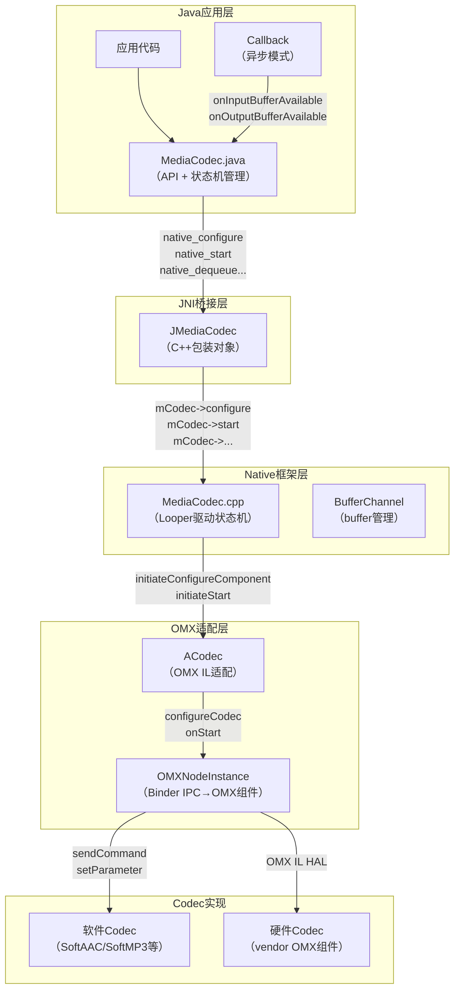
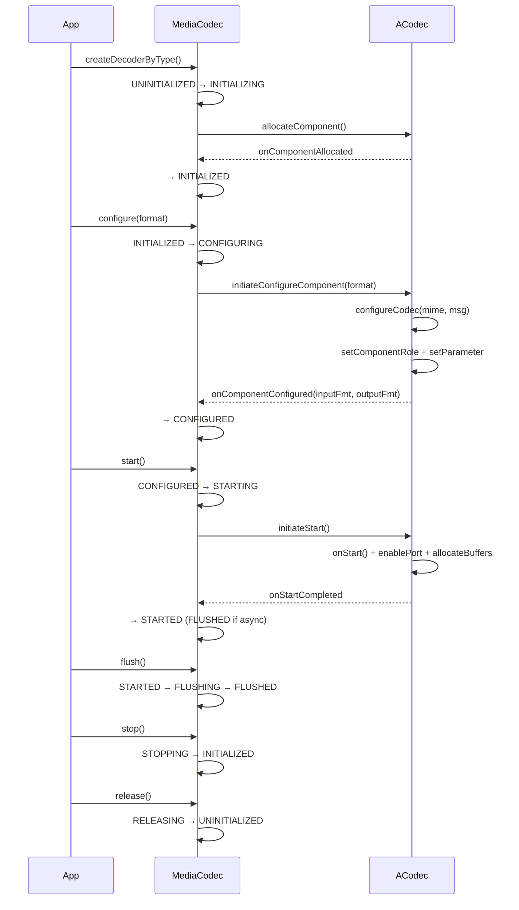
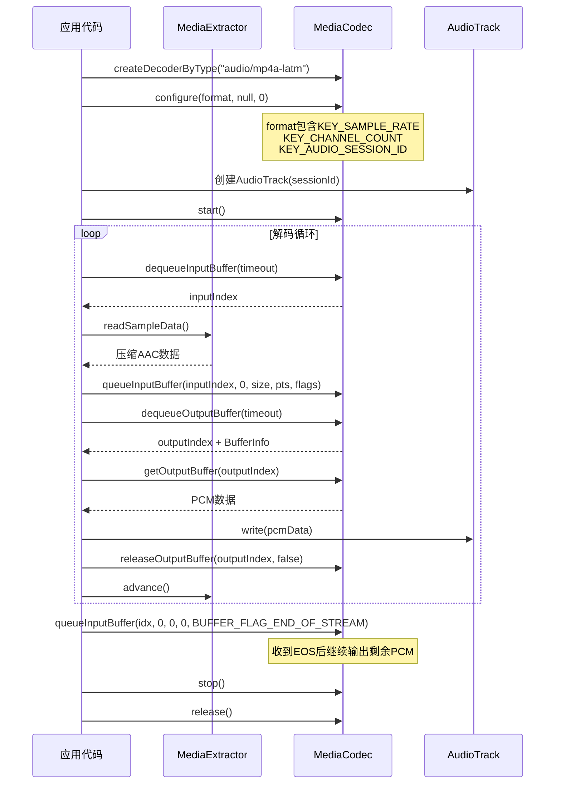
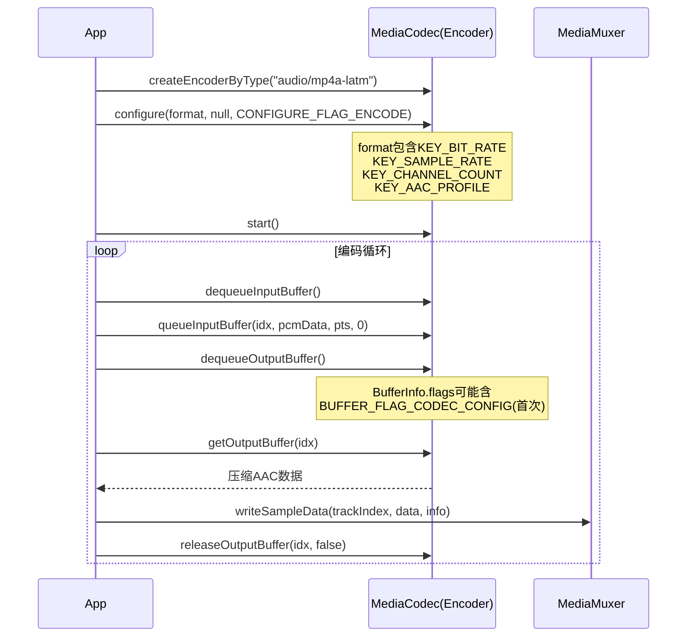

[← 2.11 OpenSL ES API](02_2.11_OpenSL_ES_API.md) | [← 返回Application Layer — 应用层API深度解析](README.md) | [返回导航](../README.md) | [2.13 MediaExtractor →](02_2.13_MediaExtractor.md)

---

## 2.12 MediaCodec — 音频编解码引擎深度解析

### 1. 模块职责与源码定位

MediaCodec是Android低级编解码API，提供对硬件/软件编码器和解码器的直接访问。在音频系统中，MediaCodec承担AAC/MP3/FLAC/Opus等格式的解码工作，将压缩音频数据转换为PCM帧输出到AudioTrack。

**核心源码路径**：
- Java API层：[`MediaCodec.java`](frameworks/base/media/java/android/media/MediaCodec.java) (~5200行)
- JNI桥接层：[`android_media_MediaCodec.cpp`](frameworks/base/media/jni/android_media_MediaCodec.cpp)
- Native框架层：[`MediaCodec.cpp`](frameworks/av/media/libstagefright/MediaCodec.cpp)
- OMX适配层：[`ACodec.cpp`](frameworks/av/media/libstagefright/ACodec.cpp)
- 头文件：[`MediaCodec.h`](frameworks/av/media/libstagefright/include/media/stagefright/MediaCodec.h)

### 2. 整体架构与调用层次



**关键设计**：MediaCodec采用ALooper+AMessage的异步消息驱动架构，所有状态转换通过消息在Looper线程上完成，Java层通过`PostAndAwaitResponse`同步等待Native层状态切换结果。

### 3. 创建流程详解

#### 3.1 三种创建方式

[`MediaCodec.java`](frameworks/base/media/java/android/media/MediaCodec.java:2007)提供三种工厂方法：

| 方法 | 调用 | 适用场景 |
|------|------|----------|
| [`createDecoderByType(mime)`](frameworks/base/media/java/android/media/MediaCodec.java:2007) | `new MediaCodec(type, true, false)` | 按MIME类型创建解码器 |
| [`createEncoderByType(mime)`](frameworks/base/media/java/android/media/MediaCodec.java:2025) | `new MediaCodec(type, true, true)` | 按MIME类型创建编码器 |
| [`createByCodecName(name)`](frameworks/base/media/java/android/media/MediaCodec.java:2040) | `new MediaCodec(name, false, false)` | 按指定组件名创建 |

三种方式最终调用同一构造函数，参数差异仅`nameIsType`和`encoder`：
- `nameIsType=true`：Native层按MIME类型查找匹配组件
- `nameIsType=false`：直接使用指定组件名

#### 3.2 Native层初始化

构造函数→`native_setup()`→[`android_media_MediaCodec.cpp`](frameworks/base/media/jni/android_media_MediaCodec.cpp)创建`JMediaCodec`对象：

```
JMediaCodec::JMediaCodec()
  → mCodec = MediaCodec::CreateByTypeOrCreateByName(mLooper, ...)
    → MediaCodec::CreateByTypeOrCreateByName()
      → 新建MediaCodec对象
      → mLooper->registerHandler(this)
      → PostAndAwaitResponse(kWhatInit, ...)
        → onMessageReceived → INITIALIZED状态
        → mCodec->init(name)
          → ACodec::initiateAllocateComponent()
            → OMX IL分配组件
```

### 4. BufferInfo与Buffer Flag详解

[`BufferInfo`](frameworks/base/media/java/android/media/MediaCodec.java:1647)是输出buffer的元数据容器：

```java
// BufferInfo字段（L1647-1709）
public final static class BufferInfo {
    public int offset;           // buffer内数据偏移
    public int size;             // 数据大小（字节）
    public long presentationTimeUs; // 呈现时间戳（微秒）
    public int flags;            // buffer标志位
}
```

**Buffer Flag常量**：

| 常量 | 值 | 含义 | 音频场景用途 |
|------|-----|------|-------------|
| [`BUFFER_FLAG_KEY_FRAME`](frameworks/base/media/java/android/media/MediaCodec.java:1726) | 1 | 关键帧 | 标识AAC关键帧 |
| [`BUFFER_FLAG_CODEC_CONFIG`](frameworks/base/media/java/android/media/MediaCodec.java:1732) | 2 | 编解码配置数据 | AAC ADTS header/CodecSpecificData |
| [`BUFFER_FLAG_END_OF_STREAM`](frameworks/base/media/java/android/media/MediaCodec.java:1738) | 4 | 流结束标记 | 解码完成信号 |
| [`BUFFER_FLAG_PARTIAL_FRAME`](frameworks/base/media/java/android/media/MediaCodec.java:1745) | 8 | 部分帧 | 多帧合并buffer |

> **关键点**：`BUFFER_FLAG_CODEC_CONFIG`标记的buffer包含编解码器初始化数据（如AAC的AudioSpecificConfig），flush后必须重新提交此类数据才能恢复解码。

### 5. 状态机完整定义

#### 5.1 Native层11状态

[`MediaCodec.h`](frameworks/av/media/libstagefright/include/media/stagefright/MediaCodec.h:321)定义11个状态：

```cpp
enum State {
    UNINITIALIZED,    // 创建前/释放后
    INITIALIZING,     // 正在初始化（allocateComponent）
    INITIALIZED,      // 已初始化，等待configure
    CONFIGURING,      // 正在配置（configureCodec）
    CONFIGURED,       // 已配置，等待start
    STARTING,         // 正在启动
    STARTED,          // 运行中（正常解码）
    FLUSHING,         // 正在flush
    FLUSHED,          // flush完成
    STOPPING,         // 正在stop
    RELEASING,        // 正在release
};
```

#### 5.2 状态转换时序图



#### 5.3 关键状态转换约束

[`kWhatConfigure`](frameworks/av/media/libstagefright/MediaCodec.cpp:4439)处理要求`mState == INITIALIZED`，否则返回`INVALID_OPERATION`。[`kWhatStart`](frameworks/av/media/libstagefright/MediaCodec.cpp:4667)要求`mState == CONFIGURED`。

### 6. configure()深度解析

#### 6.1 Java层configure

[`configure()`](frameworks/base/media/java/android/media/MediaCodec.java:2286)内部实现：

```java
// L2286-2333
private void configure(format, surface, crypto, descramblerBinder, flags) {
    String[] keys = null; Object[] values = null;
    if (format != null) {
        Map<String, Object> formatMap = format.getMap();
        // 特殊处理KEY_AUDIO_SESSION_ID
        for (Map.Entry<String, Object> entry: formatMap.entrySet()) {
            if (entry.getKey().equals(MediaFormat.KEY_AUDIO_SESSION_ID)) {
                int sessionId = (Integer)entry.getValue();
                keys[i] = "audio-hw-sync";
                values[i] = AudioSystem.getAudioHwSyncForSession(sessionId);
            } else {
                keys[i] = entry.getKey();
                values[i] = entry.getValue();
            }
        }
    }
    // BufferMode设置
    if ((flags & CONFIGURE_FLAG_USE_BLOCK_MODEL) != 0)
        mBufferMode = BUFFER_MODE_BLOCK;
    else
        mBufferMode = BUFFER_MODE_LEGACY;
    native_configure(keys, values, surface, crypto, descramblerBinder, flags);
}
```

**关键发现**：`KEY_AUDIO_SESSION_ID`在Java层被转换为`"audio-hw-sync"`键，值通过[`AudioSystem.getAudioHwSyncForSession()`](frameworks/base/media/java/android/media/AudioSystem.java)映射为AudioFlinger的HW同步ID。这建立了MediaCodec与AudioTrack的AV同步纽带——解码器可以追踪AudioTrack的播放进度。

#### 6.2 JNI层configure

[`android_media_MediaCodec_native_configure()`](frameworks/base/media/jni/android_media_MediaCodec.cpp:1599)：

1. `ConvertKeyValueArraysToMessage()`：将Java String[]/Object[]转换为AMessage
2. Surface→IGraphicBufferProducer转换（音频场景无Surface）
3. Crypto/Descrambler提取
4. `codec->configure(format, bufferProducer, crypto, descrambler, flags)`调用JMediaCodec

[`JMediaCodec::configure()`](frameworks/base/media/jni/android_media_MediaCodec.cpp:340)关键逻辑：
- MIME判断：`mime.startsWithIgnoreCase("video/")` → 设置`mGraphicOutput=true`
- 音频场景：无Surface，`mSurfaceTextureClient.clear()`
- 最终调用：`mCodec->configure(format, mSurfaceTextureClient, crypto, descrambler, flags)` → Native MediaCodec

#### 6.3 Native MediaCodec::configure

[`MediaCodec::configure()`](frameworks/av/media/libstagefright/MediaCodec.cpp:2058)核心流程：

1. 构造`kWhatConfigure`消息，打包format/flags/surface/crypto
2. 音频Metrics采集：`KEY_CHANNEL_COUNT`→`kCodecChannelCount`，`KEY_SAMPLE_RATE`→`kCodecSampleRate`
3. `updateLowLatency(format)`：处理低延迟模式配置
4. **资源回收重试机制**：最多`kMaxRetry`次，失败时`reclaimResource()`尝试回收低优先级进程的Codec资源
5. `PostAndAwaitResponse(msg, &response)`：同步等待Looper线程处理

#### 6.4 ACodec::LoadedState::onConfigureComponent

[`onConfigureComponent()`](frameworks/av/media/libstagefright/ACodec.cpp:7152)：

```cpp
bool ACodec::LoadedState::onConfigureComponent(const sp<AMessage> &msg) {
    CHECK(mCodec->mOMXNode != NULL);
    AString mime;
    if (!msg->findString("mime", &mime)) {
        err = BAD_VALUE;
    } else {
        err = mCodec->configureCodec(mime.c_str(), msg);
    }
    if (err != OK) {
        mCodec->signalError(OMX_ErrorUndefined, makeNoSideEffectStatus(err));
        return false;
    }
    mCodec->mCallback->onComponentConfigured(mCodec->mInputFormat, mCodec->mOutputFormat);
    return true;
}
```

#### 6.5 ACodec::configureCodec音频配置

[`configureCodec()`](frameworks/av/media/libstagefright/ACodec.cpp:1729)关键步骤：

1. `setComponentRole(encoder, mime)`：设置OMX组件角色
2. 音频编码器：设置`kPortModePresetByteBuffer`（输入/输出均为预设ByteBuffer模式）
3. 对于AAC等音频格式：调用`setupAACCodec()`/`setupFlacCodec()`等特定配置函数
4. 通过OMX `setParameter`配置采样率、声道数、码率等参数

### 7. start()与执行阶段

#### 7.1 start()调用链

```
MediaCodec.start() → native_start()
  → JMediaCodec::start() → mCodec->start()
    → MediaCodec.cpp: PostAndAwaitResponse(kWhatStart)
      → kWhatStart处理: setState(STARTING)
      → mCodec->initiateStart()
        → ACodec::initiateStart() → AMessage(kWhatStart) → post
          → ACodec::LoadedState::onStart()
            → mOMXNode->sendCommand(OMX_CommandStateSet, OMX_StateExecuting)
            → 等待OMX EventCommandComplete
            → 分配output buffers
            → onStartCompleted回调
```

#### 7.2 异步vs同步模式启动差异

| 方面 | 同步模式 | 异步模式 |
|------|---------|---------|
| 启动后状态 | STARTED | FLUSHED |
| buffer获取 | dequeueInputBuffer/dequeueOutputBuffer轮询 | Callback自动通知 |
| flush后恢复 | dequeueInputBuffer自动恢复 | 必须调用start()恢复 |
| 线程要求 | 任意线程 | 需指定Handler线程 |

异步模式start()后进入FLUSHED状态的原因：等待Callback线程开始接收buffer通知，start()触发首次`onInputBufferAvailable`回调。

### 8. 同步vs异步模式详解

#### 8.1 Buffer模式分类

[`MediaCodec.java`](frameworks/base/media/java/android/media/MediaCodec.java:2281)定义两种buffer模式：

```java
private static final int BUFFER_MODE_LEGACY = 0;  // 传统dequeue模式
private static final int BUFFER_MODE_BLOCK = 1;    // Block模型（仅异步+CONFIGURE_FLAG_USE_BLOCK_MODEL）
```

#### 8.2 Callback体系

[`Callback`](frameworks/base/media/java/android/media/MediaCodec.java:5153)抽象类定义4个回调方法：

| 方法 | 触发条件 | 参数 |
|------|---------|------|
| [`onInputBufferAvailable`](frameworks/base/media/java/android/media/MediaCodec.java:5160) | 编解码器需要输入数据 | codec, index |
| [`onOutputBufferAvailable`](frameworks/base/media/java/android/media/MediaCodec.java:5169) | 解码输出可用 | codec, index, BufferInfo |
| [`onError`](frameworks/base/media/java/android/media/MediaCodec.java:5178) | Codec内部错误 | codec, CodecException |
| [`onOutputFormatChanged`](frameworks/base/media/java/android/media/MediaCodec.java:5205) | 输出格式变化 | codec, MediaFormat |

#### 8.3 setCallback与Native交互

[`setCallback()`](frameworks/base/media/java/android/media/MediaCodec.java:4831)→`native_setCallback(cb)`→Native层注册回调。回调通过`postEventFromNative()`→Java层`EventHandler`分发：

```java
// L5209-5225 postEventFromNative
if (what == EVENT_CALLBACK) handler = mCallbackHandler;
else if (what == EVENT_FIRST_TUNNEL_FRAME_READY) handler = mOnFirstTunnelFrameReadyHandler;
else if (what == EVENT_FRAME_RENDERED) handler = mOnFrameRenderedHandler;
handler.sendMessage(handler.obtainMessage(what, arg1, arg2, obj));
```

### 9. dequeueInputBuffer/dequeueOutputBuffer详解

#### 9.1 dequeueInputBuffer

[`dequeueInputBuffer()`](frameworks/base/media/java/android/media/MediaCodec.java:3131)：

```java
public final int dequeueInputBuffer(long timeoutUs) {
    // Block模型兼容检查
    if (mBufferMode == BUFFER_MODE_BLOCK)
        throw new IncompatibleWithBlockModelException(...);
    int res = native_dequeueInputBuffer(timeoutUs);
    if (res >= 0) validateInputByteBufferLocked(mCachedInputBuffers, res);
    return res;
}
```

返回值：≥0为buffer索引，<0为状态码：
- `INFO_TRY_AGAIN_LATER(-1)`：超时无可用buffer
- `INFO_OUTPUT_FORMAT_CHANGED(-2)`：输出格式变化
- `INFO_OUTPUT_BUFFERS_CHANGED(-3)`：输出buffer集合变化

#### 9.2 dequeueOutputBuffer

[`dequeueOutputBuffer()`](frameworks/base/media/java/android/media/MediaCodec.java:3732)类似，额外传入`BufferInfo`对象接收输出元数据。

### 10. flush()与Codec Config重提机制

#### 10.1 flush()实现

[`flush()`](frameworks/base/media/java/android/media/MediaCodec.java:2495)：

```java
public final void flush() {
    synchronized(mBufferLock) {
        invalidateByteBuffersLocked(mCachedInputBuffers);
        invalidateByteBuffersLocked(mCachedOutputBuffers);
        mValidInputIndices.clear();
        mValidOutputIndices.clear();
        mDequeuedInputBuffers.clear();
        mDequeuedOutputBuffers.clear();
    }
    native_flush();
}
```

flush清空所有buffer索引和缓存，Native层向OMX发送`OMX_CommandFlush`命令。

#### 10.2 Codec Config重提

> **核心规则**：flush后必须重新提交`BUFFER_FLAG_CODEC_CONFIG`标记的编解码器配置数据（如AAC的AudioSpecificConfig），否则解码器无法恢复正常工作。

典型流程：
```
flush() → 重新提交codec config → queueInputBuffer(idx, 0, configSize, 0, BUFFER_FLAG_CODEC_CONFIG)
         → 然后提交正常压缩数据 → queueInputBuffer(idx, 0, size, pts, 0)
```

在NuPlayer内部实现中，`NuPlayerDecoder`在flush后会从`mCSDsForCodec`（CodecSpecificData数组）重新提交所有CSD数据。

### 11. CodecException与错误处理

[`CodecException`](frameworks/base/media/java/android/media/MediaCodec.java:2512)是MediaCodec内部错误的封装：

| 错误码 | 常量 | 含义 |
|--------|------|------|
| 1100 | `ERROR_INSUFFICIENT_RESOURCE` | 资源不足（无法分配编解码器） |
| 1101 | `ERROR_RECLAIMED` | 资源被回收（高优先级进程抢占） |

ActionCode决定恢复策略：

| Action | 常量 | 含义 | 处理建议 |
|--------|------|------|---------|
| 1 | `ACTION_TRANSIENT` | 暂时性错误 | 可稍后重试 |
| 2 | `ACTION_RECOVERABLE` | 可恢复错误 | stop→configure→start |

### 12. 音频格式Key完整映射

#### 12.1 MediaFormat音频配置Key

| Key | 类型 | 含义 | 音频场景 |
|-----|------|------|---------|
| `KEY_MIME` | String | MIME类型 | `"audio/mp4a-latm"`/`"audio/mpeg"`/`"audio/flac"`/`"audio/opus"` |
| `KEY_SAMPLE_RATE` | Integer | 采样率(Hz) | 44100/48000/16000等 |
| `KEY_CHANNEL_COUNT` | Integer | 声道数 | 1(单声道)/2(立体声)/6(5.1) |
| `KEY_BIT_RATE` | Integer | 码率(bps) | AAC: 128000/256000 |
| `KEY_AAC_PROFILE` | Integer | AAC Profile | AACObjectLC/AACObjectHE/AACObjectHEv2 |
| `KEY_MAX_INPUT_SIZE` | Integer | 最大输入buffer大小 | 通常无需设置，Codec自动建议 |
| `KEY_AUDIO_SESSION_ID` | Integer | AudioTrack session ID | 转换为audio-hw-sync用于AV同步 |

#### 12.2 configure()中的音频特殊处理

在[`MediaCodec::configure()`](frameworks/av/media/libstagefright/MediaCodec.cpp:2146)中，音频场景（`DOMAIN_AUDIO`）的Metrics采集：

```cpp
// L2146-2157（音频domain）
} else {
    int32_t channelCount;
    if (format->findInt32(KEY_CHANNEL_COUNT, &channelCount)) {
        mediametrics_setInt32(handle, kCodecChannelCount, channelCount);
    }
    int32_t sampleRate;
    if (format->findInt32(KEY_SAMPLE_RATE, &sampleRate)) {
        mediametrics_setInt32(handle, kCodecSampleRate, sampleRate);
    }
}
```

### 13. Audio-HW-Sync机制

`KEY_AUDIO_SESSION_ID`→`"audio-hw-sync"`的转换是MediaCodec音频解码的关键同步机制：

```java
// L2304-2313 configure()中的转换
if (entry.getKey().equals(MediaFormat.KEY_AUDIO_SESSION_ID)) {
    int sessionId = (Integer)entry.getValue();
    keys[i] = "audio-hw-sync";
    values[i] = AudioSystem.getAudioHwSyncForSession(sessionId);
}
```

**机制原理**：
1. AudioTrack创建时获得`sessionId`
2. 应用将sessionId放入MediaFormat传给MediaCodec
3. Java层转换为`audio-hw-sync`键，值映射为AudioFlinger的HW同步ID
4. Native层将该值传给OMX组件，OMX可在解码时追踪AudioTrack播放进度
5. 实现解码器输出与AudioTrack消费的精确时钟同步

### 14. 音频解码典型流程时序图



### 15. 音频编码流程

编码器创建与使用流程与解码器对称但方向相反：



**编码器特有Key**：
- `KEY_BIT_RATE`：目标码率（编码必须指定）
- `KEY_AAC_PROFILE`：AAC Profile选择
- `KEY_MAX_INPUT_SIZE`：建议设为PCM帧大小的合理值

### 16. ACodec::configureCodec音频特定配置

[`configureCodec()`](frameworks/av/media/libstagefright/ACodec.cpp:1729)中音频codec的配置分支：

1. **角色设置**：`setComponentRole()` → 音频解码器角色`"audio_decoder.aac"`等
2. **端口模式**：音频codec统一使用`kPortModePresetByteBuffer`（输入/输出）
3. **采样率/声道配置**：通过OMX `setParameter(OMX_IndexParamAudioPortFormat)`设置
4. **AAC特定**：`setupAACCodec()` → 设置AAC Profile/ChannelMode/SamplingRate
5. **FLAC特定**：`setupFlacCodec()` → 设置FLAC压缩级别

### 17. Native层架构：MediaCodec→ACodec→OMX

#### 17.1 MediaCodec.cpp Looper架构

MediaCodec继承`AHandler`，运行在`mLooper`线程上。所有API调用通过`PostAndAwaitResponse`同步等待：

```cpp
// MediaCodec.cpp典型模式
sp<AMessage> msg = new AMessage(kWhatConfigure, this);
msg->setMessage("format", format);
msg->setInt32("flags", flags);
sp<AMessage> response;
err = PostAndAwaitResponse(msg, &response);  // 同步等待
```

#### 17.2 ACodec双重Looper

ACodec运行在独立Looper上，内部维护子状态机：
- `LoadedState`：处理allocate/configure
- `LoadedToIdleState`：处理start前的buffer分配
- `IdleToExecutingState`：处理OMX StateExecuting转换
- `ExecutingState`：正常运行
- `OutputPortSettingsChangedState`：处理输出格式变化
- `FlushingState`：处理flush

#### 17.3 OMXNodeInstance Binder IPC

ACodec通过`IOMX` Binder接口与OMX服务通信：
- `sendCommand()`：状态转换/flush命令
- `setParameter()`：配置编解码参数
- `useBuffer()/allocateBuffer()`：buffer管理

### 18. 资源管理与回收机制

[`MediaCodec::configure()`](frameworks/av/media/libstagefright/MediaCodec.cpp:2237)中的资源回收重试：

```cpp
// L2243-2260 资源回收重试
std::vector<MediaResourceParcel> resources;
resources.push_back(MediaResource::CodecResource(mFlags & kFlagIsSecure, toMediaResourceSubType(mDomain)));
resources.push_back(MediaResource::GraphicMemoryResource(1));
for (int i = 0; i <= kMaxRetry; ++i) {
    err = PostAndAwaitResponse(msg, &response);
    if (err != OK && err != INVALID_OPERATION) {
        if (isResourceError(err) && !mResourceManagerProxy->reclaimResource(resources))
            break;
        reset();  // 回退到INITIALIZED状态重试
    }
}
```

**回收策略**：当Codec资源不足时，`ResourceManagerService`会根据进程优先级回收低优先级进程的Codec，让高优先级进程获得资源。这对AAOS车载场景特别重要——导航音频优先级高于娱乐音频。

### 19. 与NuPlayerDecoder集成

在MediaPlayer/NuPlayer内部，`NuPlayerDecoder`封装了MediaCodec的使用：

```
NuPlayer::onMessageReceived → NuPlayerDecoder创建
  → MediaCodec::CreateByTypeOrCreateByName()
  → configure(format + audio-hw-sync)
  → setCallback(NuPlayerDecoder回调)
  → start()
  → onInputBufferAvailable → 从GenericSource读取压缩数据
  → onOutputBufferAvailable → PCM帧→NuPlayerRenderer→AudioOutput
```

### 20. AAOS车载场景分析

#### 20.1 多路音频解码并发

AAOS典型场景同时运行多个解码器：
- 导航语音：AAC低码率解码→优先播放
- 媒体音频：AAC/FLAC高码率解码→Audio Focus控制
- 通知提示：短PCM播放→SoundPool

#### 20.2 资源回收对车载的影响

OMX硬件解码器数量有限（通常2-4个），当多个应用同时请求解码时：
1. `ResourceManagerService`根据`ProcessPriority`决定回收顺序
2. 前台导航应用的解码器不会被回收
3. 后台音乐应用的解码器可能被抢占，触发`ERROR_RECLAIMED`
4. 应用需监听`CodecException`，在`isRecoverable()`时执行stop→configure→start恢复

#### 20.3 Audio Focus与Codec联动

AAOS实现Audio Focus与编解码器联动：
- Focus LOSS_TRANSIENT→解码器暂停→flush保留资源
- Focus LOSS_TRANSIENT_CAN_DUCK→解码器继续但AudioTrack降低音量
- Focus LOSS→解码器stop释放OMX资源给更高优先级应用

---

[← 2.11 OpenSL ES API](02_2.11_OpenSL_ES_API.md) | [← 返回Application Layer — 应用层API深度解析](README.md) | [返回导航](../README.md) | [2.13 MediaExtractor →](02_2.13_MediaExtractor.md)