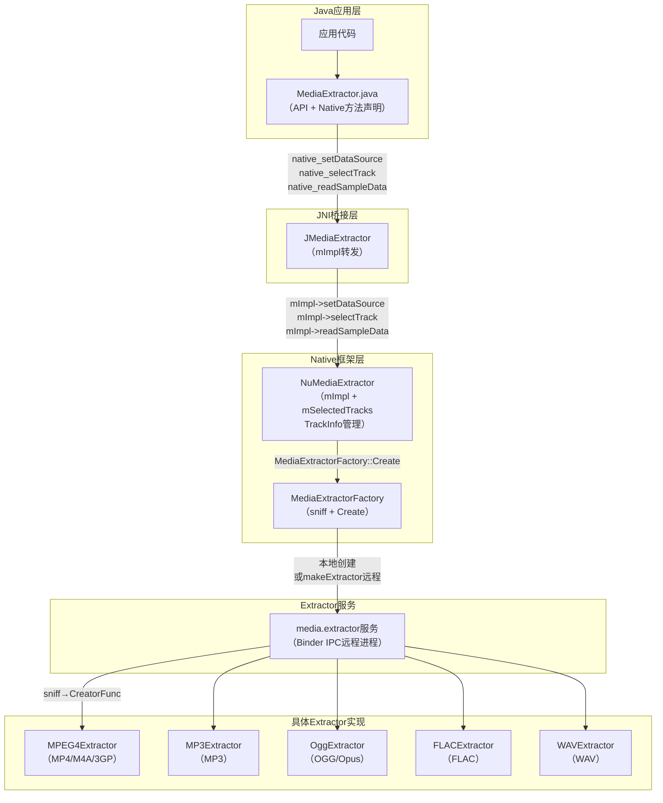
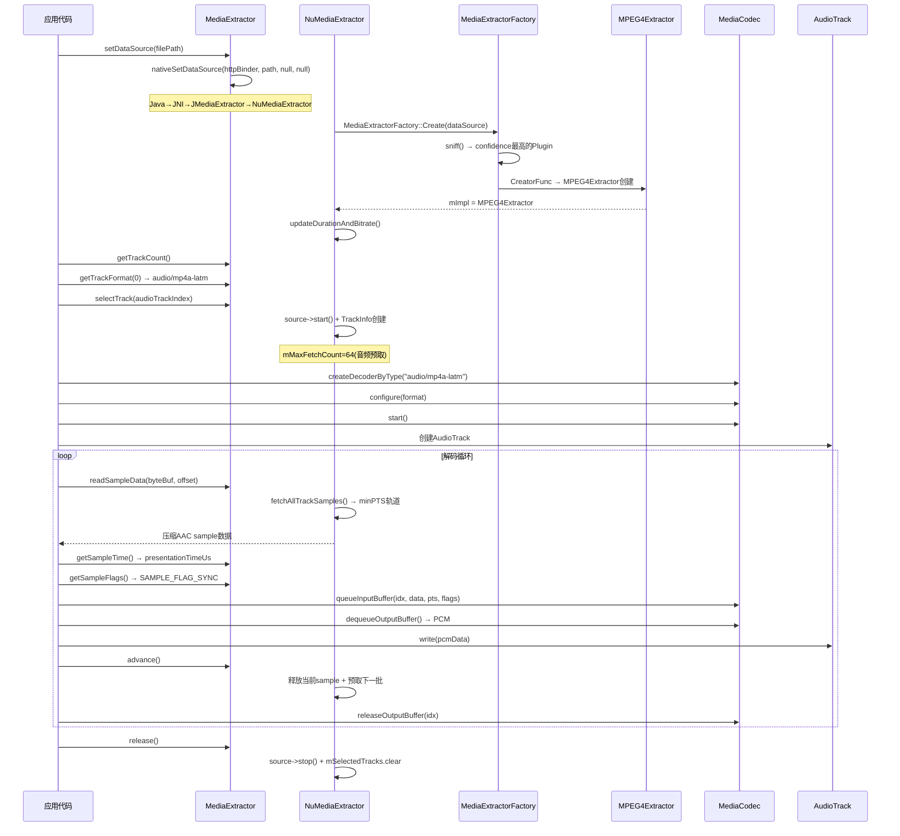
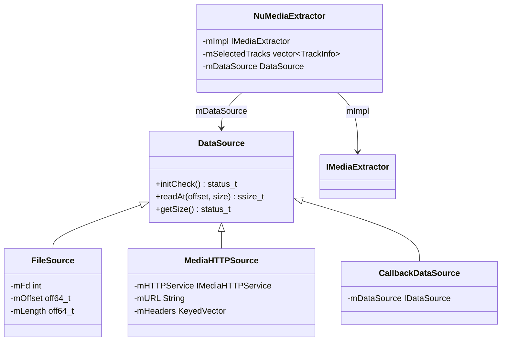

[← 2.12 MediaCodec](02_2.12_MediaCodec.md) | [← 返回Application Layer — 应用层API深度解析](README.md) | [返回导航](../README.md) | [2.14 MediaMetadataRetriever →](02_2.14_MediaMetadataRetriever.md)

---

## 2.13 MediaExtractor — 音频解封装引擎深度解析

### 1. 模块职责与源码定位

MediaExtractor负责从多媒体容器文件中解封装（demux），将交织的音频/视频/字幕轨道分离为独立压缩sample，供MediaCodec解码。支持MP4/MKV/OGG/FLAC/WAV/AMR/AC-3等常见容器格式。

**核心源码路径**：
- Java API层：[`MediaExtractor.java`](frameworks/base/media/java/android/media/MediaExtractor.java) (~810行)
- JNI桥接层：[`android_media_MediaExtractor.cpp`](frameworks/base/media/jni/android_media_MediaExtractor.cpp)
- Native框架层：[`NuMediaExtractor.cpp`](frameworks/av/media/libstagefright/NuMediaExtractor.cpp)
- Extractor工厂：[`MediaExtractorFactory.cpp`](frameworks/av/media/libstagefright/MediaExtractorFactory.cpp)
- Extractor接口：[`MediaExtractor.h`](frameworks/av/media/libstagefright/include/media/stagefright/MediaExtractor.h)
- 各格式Extractor：MPEG4Extractor/MP3Extractor/OggExtractor/FLACExtractor/WAVExtractor等

### 2. 整体架构与调用层次



**关键设计**：A14中MediaExtractor默认运行在独立`media.extractor`服务进程中（通过Binder IPC），由`MediaExtractorFactory::Create()`决定是本地创建还是远程创建。

### 3. setDataSource()详解

#### 3.1 Java层7种setDataSource重载

[`MediaExtractor.java`](frameworks/base/media/java/android/media/MediaExtractor.java)提供7种数据源设置方式：

| 方法 | Native调用 | 适用场景 |
|------|-----------|---------|
| [`setDataSource(String path, Map headers)`](frameworks/base/media/java/android/media/MediaExtractor.java:156) | `nativeSetDataSource(httpBinder, path, keys, values)` | HTTP流+自定义headers |
| [`setDataSource(String path)`](frameworks/base/media/java/android/media/MediaExtractor.java:201) | `nativeSetDataSource(httpBinder, path, null, null)` | 本地文件路径 |
| [`setDataSource(Context, Uri, Map)`](frameworks/base/media/java/android/media/MediaExtractor.java:105) | 内部转换为FD/路径 | ContentProvider URI |
| [`setDataSource(FileDescriptor, offset, length)`](frameworks/base/media/java/android/media/MediaExtractor.java:248) | 直接native调用 | 文件描述符 |
| [`setDataSource(FileDescriptor)`](frameworks/base/media/java/android/media/MediaExtractor.java:235) | `setDataSource(fd, 0, MAX_LENGTH)` | 完整文件描述符 |
| [`setDataSource(AssetFileDescriptor)`](frameworks/base/media/java/android/media/MediaExtractor.java:216) | 内部转换为FD | Asset资源 |
| [`setDataSource(MediaDataSource)`](frameworks/base/media/java/android/media/MediaExtractor.java:89) | `native直接调用` | 自定义数据源 |

#### 3.2 URI解析流程

[`setDataSource(Context, Uri, headers)`](frameworks/base/media/java/android/media/MediaExtractor.java:105)的分流逻辑：

```java
// L108-141
String scheme = uri.getScheme();
if (scheme == null || scheme.equals("file")) {
    setDataSource(uri.getPath());   // 文件路径直接走
    return;
}
// 尝试ContentResolver打开FD
AssetFileDescriptor fd = resolver.openAssetFileDescriptor(uri, "r");
if (fd.getDeclaredLength() < 0) {
    setDataSource(fd.getFileDescriptor());           // 全文件
} else {
    setDataSource(fd.getFileDescriptor(),
                  fd.getStartOffset(), fd.getDeclaredLength());  // 分段文件
}
// FD方式失败则回退到HTTP
setDataSource(uri.toString(), headers);
```

#### 3.3 HTTP Service Binder创建

[`setDataSource(String path)`](frameworks/base/media/java/android/media/MediaExtractor.java:201)内部通过`MediaHTTPService.createHttpServiceBinderIfNecessary(path)`判断是否需要HTTP服务：

- 本地文件路径：`httpServiceBinder = null`（无需HTTP）
- HTTP/HTTPS路径：创建`MediaHTTPService` Binder代理

#### 3.4 JNI层setDataSource

[`android_media_MediaExtractor_setDataSource()`](frameworks/base/media/jni/android_media_MediaExtractor.cpp:738)：

1. 获取JMediaExtractor对象
2. `ConvertKeyValueArraysToKeyedVector()`：Java String[]→KeyedVector<String8, String8>
3. `ibinderForJavaObject()`：Java Binder→sp<IBinder>→`interface_cast<IMediaHTTPService>`
4. `extractor->setDataSource(httpService, path, &headers)`→mImpl转发

[`android_media_MediaExtractor_setDataSourceFd()`](frameworks/base/media/jni/android_media_MediaExtractor.cpp:788)：

1. `jniGetFDFromFileDescriptor()`：Java FileDescriptor→int fd
2. `extractor->setDataSource(fd, offset, length)`→mImpl转发

#### 3.5 Native NuMediaExtractor::setDataSource

[`NuMediaExtractor::setDataSource()`](frameworks/av/media/libstagefright/NuMediaExtractor.cpp:106)三种重载均调用[`initMediaExtractor()`](frameworks/av/media/libstagefright/NuMediaExtractor.cpp:75)：

```cpp
// L75-103 initMediaExtractor核心流程
status_t NuMediaExtractor::initMediaExtractor(const sp<DataSource>& dataSource) {
    mImpl = MediaExtractorFactory::Create(dataSource);  // 创建具体Extractor
    if (mImpl == NULL) {
        return ERROR_UNSUPPORTED;
    }
    setEntryPointToRemoteMediaExtractor();  // 远程Extractor标记
    if (!mCasToken.empty()) {
        err = mImpl->setMediaCas(mCasToken);  // CAS/DRM设置
    }
    mName = mImpl->name();  // 获取Extractor名称
    err = updateDurationAndBitrate();  // 更新时长/码率信息
    mDataSource = dataSource;
    return OK;
}
```

#### 3.6 MediaExtractorFactory::Create

[`MediaExtractorFactory::Create()`](frameworks/av/media/libstagefright/MediaExtractorFactory.cpp:43)决定本地/远程创建：

```cpp
// L43-70
sp<IMediaExtractor> MediaExtractorFactory::Create(
        const sp<DataSource> &source, const char *mime) {
    if (!property_get_bool("media.stagefright.extractremote", true)) {
        // 本地创建（调用进程内）
        return CreateFromService(source, mime);
    } else {
        // 远程创建（media.extractor服务进程）
        sp<IBinder> binder = defaultServiceManager()->getService(
                String16("media.extractor"));
        sp<IMediaExtractorService> mediaExService =
                interface_cast<IMediaExtractorService>(binder);
        sp<IMediaExtractor> ex;
        mediaExService->makeExtractor(
                CreateIDataSourceFromDataSource(source), mime, &ex);
        return ex;
    }
}
```

[`CreateFromService()`](frameworks/av/media/libstagefright/MediaExtractorFactory.cpp:73)的sniff流程：

1. `sniff(source, &confidence, &meta, &freeMeta, plugin, &creatorVersion)`：遍历所有注册的ExtractorPlugin
2. 每个Plugin的`sniff()`函数检查数据源是否匹配其格式
3. 选择confidence最高的Plugin
4. `CreatorFunc`创建`CMediaExtractor`→`MediaExtractorCUnwrapper`包装

### 4. getTrackFormat()详解

#### 4.1 Java层

[`getTrackFormat(int index)`](frameworks/base/media/java/android/media/MediaExtractor.java:607)：

```java
public MediaFormat getTrackFormat(int index) {
    return new MediaFormat(getTrackFormatNative(index));
}
```

`getTrackFormatNative()`返回`Map<String, Object>`，由JNI层通过`ConvertMessageToMap()`从AMessage转换而来。

#### 4.2 Native层

[`NuMediaExtractor::getTrackFormat()`](frameworks/av/media/libstagefright/NuMediaExtractor.cpp:248)：

```cpp
status_t NuMediaExtractor::getTrackFormat(
        size_t index, sp<AMessage> *format, uint32_t flags) const {
    sp<MetaData> meta = mImpl->getTrackMetaData(index, flags);
    // 自动生成trackID（如Extractor未提供）
    int32_t trackID;
    if (meta != NULL && !meta->findInt32(kKeyTrackID, &trackID)) {
        meta->setInt32(kKeyTrackID, (int32_t)index + 1);
    }
    return convertMetaDataToMessage(meta, format);  // MetaData→AMessage
}
```

**音频轨道MediaFormat典型字段**：

| Key | 类型 | 来源 | 说明 |
|-----|------|------|------|
| `mime` | String | kKeyMIMEType | `"audio/mp4a-latm"`等 |
| `sample-rate` | Integer | kKeySampleRate | 44100/48000 |
| `channel-count` | Integer | kKeyChannelCount | 1/2/6 |
| `bitrate` | Integer | kKeyBitRate | 码率(bps) |
| `max-input-size` | Integer | kKeyMaxInputSize | 建议最大buffer大小 |
| `csd-0` | ByteBuffer | kKeyCodecSpecificData | AAC AudioSpecificConfig |
| `track-id` | Integer | kKeyTrackID | 轨道编号 |
| `language` | String | kKeyLanguage | 语言标签 |
| `durationUs` | Long | kKeyDuration | 轨道时长(微秒) |

### 5. selectTrack()详解

#### 5.1 Java层

[`selectTrack(int index)`](frameworks/base/media/java/android/media/MediaExtractor.java:621)为native方法，直接调用JNI。

#### 5.2 Native层核心实现

[`NuMediaExtractor::selectTrack()`](frameworks/av/media/libstagefright/NuMediaExtractor.cpp:360)是核心轨道选择逻辑：

```cpp
// L360-434 selectTrack关键流程
status_t NuMediaExtractor::selectTrack(size_t index, ...) {
    // 检查是否已选中
    for (size_t i = 0; i < mSelectedTracks.size(); ++i) {
        if (info->mTrackIndex == index) {
            return OK;  // 已选中，幂等操作
        }
    }
    // 获取轨道MediaSource
    sp<IMediaSource> source = mImpl->getTrack(index);
    // 启动轨道数据源
    status_t ret = source->start();
    // 获取轨道格式
    sp<MetaData> meta = source->getFormat();
    const char *mime;
    meta->findCString(kKeyMIMEType, &mime);
    // 创建TrackInfo并设置轨道类型
    TrackInfo *info = &mSelectedTracks.editItemAt(...);
    info->mSource = source;
    info->mTrackIndex = index;
    if (!strncasecmp(mime, "audio/", 6)) {
        info->mTrackType = MEDIA_TRACK_TYPE_AUDIO;
        info->mMaxFetchCount = 64;  // 音频预取64个sample
    } else if (!strncasecmp(mime, "video/", 6)) {
        info->mTrackType = MEDIA_TRACK_TYPE_VIDEO;
        info->mMaxFetchCount = 8;   // 视频预取8个sample
    }
    info->mTrackFlags = 0;
    if (!strcasecmp(mime, MEDIA_MIMETYPE_AUDIO_VORBIS)) {
        info->mTrackFlags |= kIsVorbis;  // Vorbis特殊标记
    }
    // 如果指定startTime，fetchTrackSamples预取
    if (startTimeUs >= 0) {
        fetchTrackSamples(info, startTimeUs, mode);
    }
    return OK;
}
```

**关键发现**：
- 音频轨道预取64个sample（`mMaxFetchCount = 64`），视频仅8个——音频sample更小，更多预取减少IO等待
- Vorbis格式有特殊标记`kIsVorbis`，影响`readSampleData()`时附加numPageSamples信息
- `source->start()`调用后才开始产生sample数据

### 6. readSampleData()详解

#### 6.1 Java层

[`readSampleData(ByteBuffer byteBuf, int offset)`](frameworks/base/media/java/android/media/MediaExtractor.java:678)：

```java
// L678: 读取当前sample到ByteBuffer，从offset位置开始
public native int readSampleData(@NonNull ByteBuffer byteBuf, int offset);
```

返回值：sample大小(>0)，-1表示EOF。

#### 6.2 Native层实现

[`NuMediaExtractor::readSampleData()`](frameworks/av/media/libstagefright/NuMediaExtractor.cpp:697)：

```cpp
// L697-738 readSampleData核心流程
status_t NuMediaExtractor::readSampleData(const sp<ABuffer> &buffer) {
    Mutex::Autolock autoLock(mLock);
    ssize_t minIndex = fetchAllTrackSamples();  // 预取所有选中轨道
    buffer->setRange(0, 0);  // 清空buffer
    if (minIndex < 0) return ERROR_END_OF_STREAM;
    TrackInfo *info = &mSelectedTracks.editItemAt(minIndex);
    auto it = info->mSamples.begin();
    size_t sampleSize = it->mBuffer->range_length();
    // Vorbis特殊处理：sample后附加numPageSamples(4字节)
    if (info->mTrackFlags & kIsVorbis) {
        sampleSize += sizeof(int32_t);
    }
    // 检查buffer容量
    if (buffer->capacity() < sampleSize) return -ENOMEM;
    // 复制sample数据
    memcpy((uint8_t *)buffer->data(), src, srclen);
    buffer->setRange(0, srclen);
    // Vorbis追加numPageSamples
    if (info->mTrackFlags & kIsVorbis) {
        err = appendVorbisNumPageSamples(it->mBuffer, buffer);
    }
    return err;
}
```

**关键设计**：
- `fetchAllTrackSamples()`返回时间戳最小的轨道索引——多轨道间按PTS排序交错输出
- Vorbis格式每个sample尾部附加`int32_t numPageSamples`字段，告知解码器一页内包含的sample数

### 7. advance()详解

[`NuMediaExtractor::advance()`](frameworks/av/media/libstagefright/NuMediaExtractor.cpp:606)：

```cpp
// L606-638 advance核心流程
status_t NuMediaExtractor::advance() {
    Mutex::Autolock autoLock(mLock);
    ssize_t minIndex = fetchAllTrackSamples();
    if (minIndex < 0) return ERROR_END_OF_STREAM;
    TrackInfo *info = &mSelectedTracks.editItemAt(minIndex);
    // 释放当前sample的buffer
    auto it = info->mSamples.begin();
    if (it->mBuffer != NULL) it->mBuffer->release();
    info->mSamples.erase(it);  // 从队列中移除
    // 如果该轨道sample队列空了，重新预取
    if (info->mSamples.empty()) {
        minIndex = fetchAllTrackSamples();
    }
    return OK;
}
```

**设计要点**：advance()释放当前最小PTS的sample并从队列移除，而非简单的"前进到下一个"。多轨道场景下，advance后下一个最小PTS可能来自不同轨道。

### 8. seekTo()详解

[`seekTo(long timeUs, int mode)`](frameworks/base/media/java/android/media/MediaExtractor.java:656)三种SeekMode：

| Mode | 常量值 | 含义 |
|------|--------|------|
| `SEEK_TO_PREVIOUS_SYNC` | 0 | 定位到指定时间之前的sync point |
| `SEEK_TO_NEXT_SYNC` | 1 | 定位到指定时间之后的sync point |
| `SEEK_TO_CLOSEST_SYNC` | 2 | 定位到最接近指定时间的sync point |

[`NuMediaExtractor::seekTo()`](frameworks/av/media/libstagefright/NuMediaExtractor.cpp:593)内部调用`fetchAllTrackSamples(timeUs, mode)`，对所有选中轨道执行seek后预取。

### 9. Sample Flag详解

[`MediaExtractor.java`](frameworks/base/media/java/android/media/MediaExtractor.java:698)定义3种Sample Flag：

| 常量 | 值 | 含义 | 与MediaCodec Flag对应 |
|------|-----|------|----------------------|
| [`SAMPLE_FLAG_SYNC`](frameworks/base/media/java/android/media/MediaExtractor.java:705) | 1 | 关键帧/sync sample | `BUFFER_FLAG_KEY_FRAME` |
| [`SAMPLE_FLAG_ENCRYPTED`](frameworks/base/media/java/android/media/MediaExtractor.java:711) | 2 | 加密sample | 需CryptoInfo解密 |
| [`SAMPLE_FLAG_PARTIAL_FRAME`](frameworks/base/media/java/android/media/MediaExtractor.java:720) | 4 | 部分帧 | `BUFFER_FLAG_PARTIAL_FRAME` |

**音频场景**：AAC几乎每个sample都是sync sample（`SAMPLE_FLAG_SYNC=1`），因为AAC帧可独立解码。MP3也类似，而视频轨道的sync sample才是真正的关键帧。

### 10. 音频轨道识别与选择

#### 10.1 识别音频轨道

```java
// 典型音频轨道识别代码
MediaExtractor extractor = new MediaExtractor();
extractor.setDataSource(filePath);
int audioTrackIndex = -1;
MediaFormat audioFormat = null;
for (int i = 0; i < extractor.getTrackCount(); i++) {
    MediaFormat format = extractor.getTrackFormat(i);
    String mime = format.getString(MediaFormat.KEY_MIME);
    if (mime.startsWith("audio/")) {
        audioTrackIndex = i;
        audioFormat = format;
        break;
    }
}
if (audioTrackIndex >= 0) {
    extractor.selectTrack(audioTrackIndex);
    // 从audioFormat获取音频参数
    int sampleRate = audioFormat.getInteger(MediaFormat.KEY_SAMPLE_RATE);
    int channelCount = audioFormat.getInteger(MediaFormat.KEY_CHANNEL_COUNT);
    long duration = audioFormat.getLong(MediaFormat.KEY_DURATION);
}
```

#### 10.2 多音频轨道选择

MP4容器可能包含多个音频轨道（不同语言/编码），AAOS车载场景需要：
- 选择首选语言轨道：`format.getString(MediaFormat.KEY_LANGUAGE)`
- AudioPresentation选择：[`getAudioPresentations(trackIndex)`](frameworks/base/media/java/android/media/MediaExtractor.java:454)
- Dolby Atmos多声道轨道识别：`mime.equals("audio/eac3")`

### 11. 音频MIME类型完整映射

| MIME类型 | 容器格式 | 编码格式 | Extractor实现 | AAOS常见用途 |
|---------|---------|---------|--------------|-------------|
| `audio/mp4a-latm` | MP4/M4A | AAC-LC/HE/HEv2 | MPEG4Extractor | 媒体播放主流 |
| `audio/mpeg` | MP3 | MP1/MP2/MP3 | MP3Extractor | 历史兼容 |
| `audio/flac` | FLAC | FLAC | FLACExtractor | 高品质播放 |
| `audio/opus` | OGG | Opus | OggExtractor | 低延迟通话 |
| `audio/vorbis` | OGG | Vorbis | OggExtractor | 开源音频 |
| `audio/raw` | WAV | PCM | WAVExtractor | 无损播放 |
| `audio/amr-wb` | AMR | AMR-WB | AMRExtractor | 语音录制 |
| `audio/ac3` | AC-3 | AC-3/EAC-3 | MPEG4Extractor | Dolby音频 |
| `audio/alac` | M4A | ALAC | MPEG4Extractor | Apple无损 |
| `audio/aac-adts` | ADTS | AAC裸流 | AACADTSExtractor | 流式AAC |

### 12. AudioPresentation机制

[`getAudioPresentations(int trackIndex)`](frameworks/base/media/java/android/media/MediaExtractor.java:454)是A14新增的音频呈现信息查询接口。`AudioPresentation`类包含：

| 字段 | 含义 | AAOS用途 |
|------|------|---------|
| `presentationId` | 呈现ID | Dolby Atmos轨道标识 |
| `programId` | 程序ID | 多语言节目标识 |
| `language` | 语言标签 | 车载多语言选择 |
| `channelCount` | 呈现声道数 | 5.1/7.1/Atmos |
| `sampleRate` | 呈现采样率 | 48kHz等 |
| `audioPresentationType` | 呈现类型 | MAIN/MIX/DUB等 |

### 13. DRM与CAS支持

MediaExtractor支持加密轨道的解封装：

#### 13.1 DRM初始化数据

[`getDrmInitData()`](frameworks/base/media/java/android/media/MediaExtractor.java:382)从容器中提取DRM初始化数据：
- MP4 PSSH box → `DrmInitData.SchemeInitData`（UUID + "cenc" + PSSH数据）
- WebM crypto-key → `DrmInitData.SchemeInitData`（UUID_NIL + "webm" + 数据）

#### 13.2 CAS信息查询

[`getCasInfo(int index)`](frameworks/base/media/java/android/media/MediaExtractor.java:334)从轨道格式中提取CAS信息：
- `KEY_CA_SYSTEM_ID`：CAS系统ID
- `KEY_CA_PRIVATE_DATA`：CAS私有数据
- `KEY_CA_SESSION_ID`：CAS Session ID

### 14. 解封装→解码完整时序图



### 15. DataSource类型体系



### 16. Metrics采集

[`native_getMetrics()`](frameworks/base/media/java/android/media/MediaExtractor.java:794)返回`PersistableBundle`包含：

| Metrics字段 | 含义 |
|------------|------|
| `kExtractorFormat` | 容器格式(MP4/MP3/OGG等) |
| `kExtractorMime` | MIME类型 |
| `kExtractorTracks` | 轨道总数 |
| `kExtractorVideo` | 视频轨道数 |
| `kExtractorAudio` | 音频轨道数 |
| `kExtractorDuration` | 时长(微秒) |

### 17. 缓存管理

[`getCachedDuration()`](frameworks/base/media/java/android/media/MediaExtractor.java:754)和[`hasCacheReachedEndOfStream()`](frameworks/base/media/java/android/media/MediaExtractor.java:763)用于流式播放场景：
- HTTP流播放时，预估已缓存数据可播放时长
- 判断是否已缓存到流末尾
- AAOS车载场景：预判网络流缓冲状态，决定是否降低码率切换

### 18. AAOS车载场景分析

#### 18.1 多语言音频轨道选择

车载媒体系统需要支持多语言音频轨道切换：
- 通过`KEY_LANGUAGE`字段识别各音频轨道语言
- `AudioPresentation`提供更丰富的语言/声道信息
- 导航提示优先选择系统语言轨道

#### 18.2 远程Extractor进程隔离

A14默认使用`media.extractor`独立进程运行Extractor：
- 提高安全性：格式解析漏洞不影响应用进程
- 提高稳定性：Extractor崩溃不影响媒体播放
- Binder IPC开销：对大文件读取有轻微延迟影响
- 可通过`media.stagefright.extractremote=false`属性切换为本地模式

#### 18.3 音频轨道格式自适应

AAOS音频策略需要根据轨道格式选择不同处理路径：
- AAC/MP3 → MediaCodec解码 → AudioTrack播放
- FLAC → MediaCodec解码或直接PCM输出（FLACExtractor可直接输出PCM）
- Dolby EAC-3 → 需要专用解码器 → 通过AudioFocus协商播放权限

---

[← 2.12 MediaCodec](02_2.12_MediaCodec.md) | [← 返回Application Layer — 应用层API深度解析](README.md) | [返回导航](../README.md) | [2.14 MediaMetadataRetriever →](02_2.14_MediaMetadataRetriever.md)