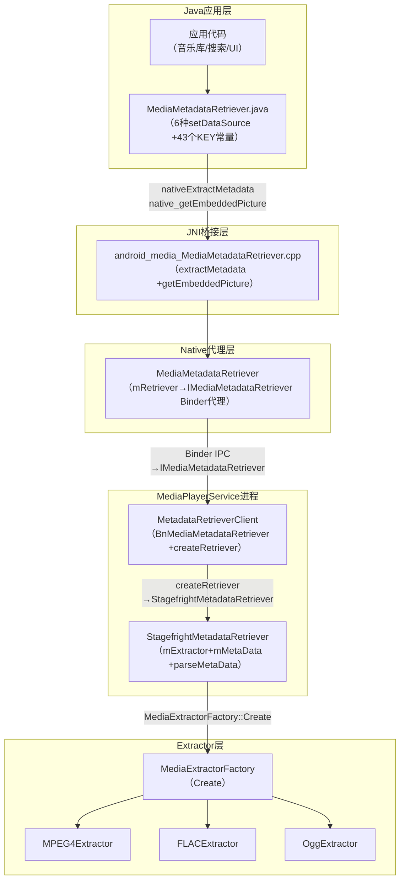
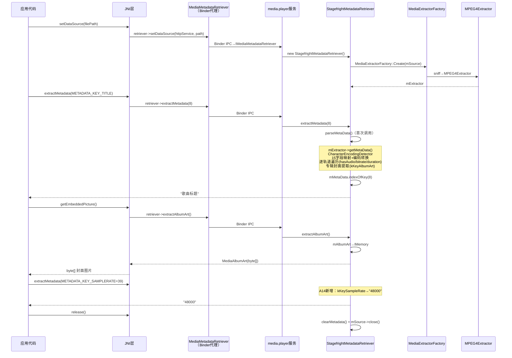
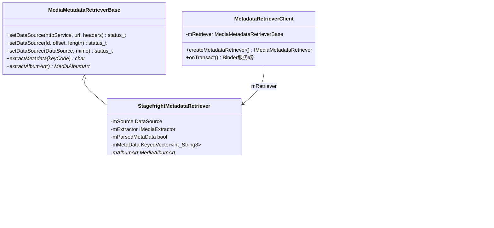

[← 2.13 MediaExtractor](02_2.13_MediaExtractor.md) | [← 返回Application Layer — 应用层API深度解析](README.md) | [返回导航](../README.md) | [下一个 →]()

---

## 2.14 MediaMetadataRetriever — 元数据提取引擎深度解析

### 1. 模块职责与源码定位

MediaMetadataRetriever负责从媒体文件中提取元数据信息（标题/艺术家/时长/码率等）和专辑封面图片。与MediaExtractor不同，它只读取元数据而不进行sample级别的解封装，适用于音乐库浏览、搜索索引、UI展示等场景。

**核心源码路径**：
- Java API层：[`MediaMetadataRetriever.java`](frameworks/base/media/java/android/media/MediaMetadataRetriever.java) (~1400行)
- JNI桥接层：[`android_media_MediaMetadataRetriever.cpp`](frameworks/base/media/jni/android_media_MediaMetadataRetriever.cpp)
- Native代理层：[`mediametadataretriever.h`](frameworks/av/media/libmedia/include/media/mediametadataretriever.h)
- 接口抽象层：[`MediaMetadataRetrieverInterface.h`](frameworks/av/media/libmedia/include/media/MediaMetadataRetrieverInterface.h)
- 实际实现层：[`StagefrightMetadataRetriever.cpp`](frameworks/av/media/libmediaplayerservice/StagefrightMetadataRetriever.cpp)
- 客户端代理：[`MetadataRetrieverClient.cpp`](frameworks/av/media/libmediaplayerservice/MetadataRetrieverClient.cpp)

### 2. 整体架构与调用层次



**关键设计**：MediaMetadataRetriever运行在`media.player`服务进程中（与MediaPlayer共用），通过`IMediaMetadataRetriever` Binder IPC与Java层通信，确保格式解析的安全性隔离。

### 3. setDataSource()详解

#### 3.1 Java层6种setDataSource重载

[`MediaMetadataRetriever.java`](frameworks/base/media/java/android/media/MediaMetadataRetriever.java)提供6种数据源设置：

| 方法 | 行号 | 适用场景 |
|------|------|---------|
| [`setDataSource(String path)`](frameworks/base/media/java/android/media/MediaMetadataRetriever.java:237) | L237 | 本地文件路径，file scheme→FD，否则→HTTP |
| [`setDataSource(String uri, Map headers)`](frameworks/base/media/java/android/media/MediaMetadataRetriever.java:270) | L270 | HTTP流+自定义headers |
| [`setDataSource(FileDescriptor fd, long offset, long length)`](frameworks/base/media/java/android/media/MediaMetadataRetriever.java:305) | L305 | FD分段文件 |
| [`setDataSource(Context context, Uri uri)`](frameworks/base/media/java/android/media/MediaMetadataRetriever.java:347) | L347 | ContentProvider URI |
| [`setDataSource(AssetFileDescriptor afd)`](frameworks/base/media/java/android/media/MediaMetadataRetriever.java:370) | L370 | Asset资源 |
| [`setDataSource(MediaDataSource dataSource)`](frameworks/base/media/java/android/media/MediaMetadataRetriever.java:405) | L405 | 自定义数据源 |

#### 3.2 URI解析流程

[`setDataSource(Context, Uri)`](frameworks/base/media/java/android/media/MediaMetadataRetriever.java:347)A14新增transcode优化：

```java
// L347-398 关键逻辑
ContentResolver resolver = context.getContentResolver();
// A14新增：尝试transcode优化路径
Bundle providerOptions = new Bundle();
providerOptions.putBoolean(ContentResolver.EXTRA_SIZE_OPTIMIZED, true);
AssetFileDescriptor afd = resolver.openAssetFileDescriptor(uri, "r", providerOptions);
// 获取FD后调用底层
_setDataSource(afd.getFileDescriptor(), afd.getStartOffset(), afd.getDeclaredLength());
```

#### 3.3 JNI层setDataSource

[`android_media_MediaMetadataRetriever_setDataSourceAndHeaders()`](frameworks/base/media/jni/android_media_MediaMetadataRetriever.cpp:98)：

```cpp
// L98-156 JNI层核心逻辑
sp<MediaMetadataRetriever> retriever = getRetriever(env, thiz);
// 安全检查：禁止mem://路径
if (strncmp("mem://", pathStr.string(), 6) == 0) {
    jniThrowException(env, "java/lang/IllegalArgumentException", "Invalid pathname");
    return;
}
// ConvertKeyValueArraysToKeyedVector：Java String[]→KeyedVector
KeyedVector<String8, String8> headersVector;
ConvertKeyValueArraysToKeyedVector(env, keys, values, &headersVector);
// httpService Binder转换
sp<IMediaHTTPService> httpService;
sp<IBinder> binder = ibinderForJavaObject(env, httpServiceBinderObj);
httpService = interface_cast<IMediaHTTPService>(binder);
// 调用Native层
retriever->setDataSource(httpService, pathStr.string(), &headersVector);
```

[`android_media_MediaMetadataRetriever_setDataSourceFD()`](frameworks/base/media/jni/android_media_MediaMetadataRetriever.cpp:159)：

```cpp
// L159-185 FD方式
int fd = jniGetFDFromFileDescriptor(env, fileDescriptor);
process_media_retriever_call(env,
    retriever->setDataSource(fd, offset, length), ...);
```

#### 3.4 Native代理层

[`MediaMetadataRetriever::setDataSource()`](frameworks/av/media/libmedia/include/media/mediametadataretriever.h:90)通过`IMediaMetadataRetriever` Binder代理转发到服务端：

```cpp
// mediametadataretriever.cpp
status_t MediaMetadataRetriever::setDataSource(...) {
    const sp<IMediaPlayerService>& service = getService();  // 获取media.player服务
    sp<IMediaMetadataRetriever> retriever = service->createMetadataRetriever();
    mRetriever = retriever;  // 保存Binder代理
    return mRetriever->setDataSource(httpService, path, headers);  // IPC调用
}
```

#### 3.5 服务端创建

[`MetadataRetrieverClient`](frameworks/av/media/libmediaplayerservice/MetadataRetrieverClient.cpp)在`media.player`服务进程中创建实际Retriever：

```cpp
// L84-91 createRetriever
static sp<MediaMetadataRetrieverBase> createRetriever(player_type playerType) {
    switch (playerType) {
        case STAGEFRIGHT_PLAYER:
        case NU_PLAYER:
            p = new StagefrightMetadataRetriever;  // 实际实现
            break;
    }
}
```

#### 3.6 StagefrightMetadataRetriever::setDataSource

[`StagefrightMetadataRetriever::setDataSource()`](frameworks/av/media/libmediaplayerservice/StagefrightMetadataRetriever.cpp:60)三种重载均创建Extractor：

```cpp
// L60-85 URL方式
mSource = PlayerServiceDataSourceFactory::getInstance()->CreateFromURI(httpService, uri, headers);
mExtractor = MediaExtractorFactory::Create(mSource);  // 与MediaExtractor共用工厂

// L89-113 FD方式
mSource = new PlayerServiceFileSource(dup(fd), offset, length);
mSource->initCheck();
mExtractor = MediaExtractorFactory::Create(mSource);

// L116-129 DataSource方式
mSource = source;
mExtractor = MediaExtractorFactory::Create(mSource, mime);
```

**关键设计**：MediaMetadataRetriever和MediaExtractor共享`MediaExtractorFactory::Create()`创建逻辑，但前者运行在`media.player`进程，后者运行在`media.extractor`进程。

### 4. extractMetadata()详解

#### 4.1 Java层

[`extractMetadata(int keyCode)`](frameworks/base/media/java/android/media/MediaMetadataRetriever.java:426)：

```java
// L426-430
public String extractMetadata(int keyCode) {
    String meta = nativeExtractMetadata(keyCode);
    // Genre特殊转换：ID3v1数字编码→文字描述
    if (keyCode == METADATA_KEY_GENRE && meta != null) {
        return convertGenreCodeToString(meta);
    }
    return meta;
}
```

`convertGenreCodeToString()`将ID3v1数字Genre编码（如"1"→"Classic Rock"）转换为可读文字。

#### 4.2 JNI层

[`android_media_MediaMetadataRetriever_extractMetadata()`](frameworks/base/media/jni/android_media_MediaMetadataRetriever.cpp:584)：

```cpp
// L584-598
const char* value = retriever->extractMetadata(keyCode);
if (!value) return NULL;
return env->NewStringUTF(value);  // char* → Java String
```

#### 4.3 StagefrightMetadataRetriever::extractMetadata

[`StagefrightMetadataRetriever::extractMetadata()`](frameworks/av/media/libmediaplayerservice/StagefrightMetadataRetriever.cpp:458)：

```cpp
// L458-476
const char *StagefrightMetadataRetriever::extractMetadata(int keyCode) {
    if (mExtractor == NULL) return NULL;
    if (!mParsedMetaData) {
        parseMetaData();       // 首次调用时解析全量元数据
        mParsedMetaData = true;
    }
    ssize_t index = mMetaData.indexOfKey(keyCode);
    if (index < 0) return NULL;
    return mMetaData.valueAt(index).string();
}
```

**关键设计**：采用**懒解析**策略——首次`extractMetadata()`调用时才执行`parseMetaData()`，后续调用直接查找`KeyedVector<int, String8>`缓存，避免重复解析。

### 5. parseMetaData()核心解析逻辑

[`parseMetaData()`](frameworks/av/media/libmediaplayerservice/StagefrightMetadataRetriever.cpp:497)是元数据提取的核心方法，约280行代码完成以下工作：

#### 5.1 容器级元数据提取

```cpp
// L497-559 容器级元数据
sp<MetaData> meta = mExtractor->getMetaData();  // 从Extractor获取容器元数据
// 15个字段映射表：kKeyMIMEType→METADATA_KEY_MIMETYPE等
static const Map kMap[] = {
    { kKeyMIMEType,    METADATA_KEY_MIMETYPE,    NULL },
    { kKeyCDTrackNumber, METADATA_KEY_CD_TRACK_NUMBER, "tracknumber" },
    { kKeyAlbum,       METADATA_KEY_ALBUM,       "album" },
    { kKeyArtist,      METADATA_KEY_ARTIST,      "artist" },
    { kKeyAlbumArtist, METADATA_KEY_ALBUMARTIST, "albumartist" },
    { kKeyComposer,    METADATA_KEY_COMPOSER,    "composer" },
    { kKeyGenre,       METADATA_KEY_GENRE,       "genre" },
    { kKeyTitle,       METADATA_KEY_TITLE,       "title" },
    { kKeyYear,        METADATA_KEY_YEAR,        "year" },
    { kKeyWriter,      METADATA_KEY_WRITER,      "writer" },
    ...
};
// CharacterEncodingDetector处理编码问题
CharacterEncodingDetector *detector = new CharacterEncodingDetector();
for (size_t i = 0; i < kNumMapEntries; ++i) {
    const char *value;
    if (meta->findCString(kMap[i].from, &value)) {
        if (kMap[i].name) {
            detector->addTag(kMap[i].name, value);  // 需编码检测
        } else {
            mMetaData.add(kMap[i].to, String8(value));  // 直接添加
        }
    }
}
detector->detectAndConvert();  // 检测编码并转换
```

#### 5.2 专辑封面提取

```cpp
// L561-567
const void *data; uint32_t type; size_t dataSize;
if (meta->findData(kKeyAlbumArt, &type, &data, &dataSize) && mAlbumArt == NULL) {
    mAlbumArt = MediaAlbumArt::fromData(dataSize, data);
}
```

#### 5.3 轨道级元数据遍历

```cpp
// L616-690 逐轨道遍历提取关键信息
for (size_t i = 0; i < numTracks; ++i) {
    sp<MetaData> trackMeta = mExtractor->getTrackMetaData(i);
    const char *mime;
    trackMeta->findCString(kKeyMIMEType, &mime);

    if (!strncasecmp("audio/", mime, 6)) {
        hasAudio = true;
        audioBitrate = trackMeta->findInt32(kKeyBitRate);
        // A14新增：音频位深度和采样率
        bitsPerSample = trackMeta->findInt32(kKeyBitsPerSample);
        sampleRate = trackMeta->findInt32(kKeySampleRate);
        mMetaData.add(METADATA_KEY_BITS_PER_SAMPLE, ...);
        mMetaData.add(METADATA_KEY_SAMPLERATE, ...);
    } else if (!strncasecmp("video/", mime, 6)) {
        hasVideo = true;
        videoWidth / videoHeight / rotationAngle
        mMetaData.add(METADATA_KEY_VIDEO_CODEC_MIME_TYPE, videoMime);  // A14新增
    }
    // 取最长轨道的时长作为总时长
    durationUs = trackMeta->findInt64(kKeyDuration);
    maxDurationUs = max(maxDurationUs, durationUs);
}
```

#### 5.4 码率计算策略

```cpp
// L752-763 码率计算
if (numTracks == 1 && hasAudio && audioBitrate >= 0) {
    // 单轨道音频：直接使用轨道码率
    mMetaData.add(METADATA_KEY_BITRATE, String8(audioBitrate));
} else {
    // 多轨道：文件大小×8÷时长（估算平均码率）
    mSource->getSize(&sourceSize);
    avgBitRate = sourceSize * 8E6 / maxDurationUs;
    mMetaData.add(METADATA_KEY_BITRATE, String8(avgBitRate));
}
```

#### 5.5 Matroska特殊处理

```cpp
// L765-781 MKV容器MIME修正
if (numTracks == 1 && fileMIME == "video/x-matroska") {
    // 单音频轨道的MKV文件，修正MIME为audio/x-matroska
    mMetaData.add(METADATA_KEY_MIMETYPE, String8("audio/x-matroska"));
}
```

### 6. 43个METADATA_KEY常量完整映射

| KEY | 常量值 | 数据来源 | 音频相关 | 说明 |
|-----|--------|---------|---------|------|
| [`METADATA_KEY_CD_TRACK_NUMBER`](frameworks/base/media/java/android/media/MediaMetadataRetriever.java:1175) | 0 | kKeyCDTrackNumber | - | CD轨道号 |
| [`METADATA_KEY_DISC_NUMBER`](frameworks/base/media/java/android/media/MediaMetadataRetriever.java:1180) | 1 | kKeyDiscNumber | - | 盘号 |
| [`METADATA_KEY_ALBUM`](frameworks/base/media/java/android/media/MediaMetadataRetriever.java:1185) | 2 | kKeyAlbum | - | 专辑名 |
| [`METADATA_KEY_ARTIST`](frameworks/base/media/java/android/media/MediaMetadataRetriever.java:1190) | 3 | kKeyArtist | - | 艺术家 |
| [`METADATA_KEY_AUTHOR`](frameworks/base/media/java/android/media/MediaMetadataRetriever.java:1195) | 4 | kKeyAuthor | - | 作者 |
| [`METADATA_KEY_COMPOSER`](frameworks/base/media/java/android/media/MediaMetadataRetriever.java:1200) | 5 | kKeyComposer | - | 作曲者 |
| [`METADATA_KEY_DATE`](frameworks/base/media/java/android/media/MediaMetadataRetriever.java:1205) | 6 | kKeyDate | - | 日期 |
| [`METADATA_KEY_GENRE`](frameworks/base/media/java/android/media/MediaMetadataRetriever.java:1210) | 7 | kKeyGenre | - | 流派(需编码转换) |
| [`METADATA_KEY_TITLE`](frameworks/base/media/java/android/media/MediaMetadataRetriever.java:1215) | 8 | kKeyTitle | - | 标题 |
| [`METADATA_KEY_YEAR`](frameworks/base/media/java/android/media/MediaMetadataRetriever.java:1220) | 9 | kKeyYear | - | 年份 |
| [`METADATA_KEY_DURATION`](frameworks/base/media/java/android/media/MediaMetadataRetriever.java:1225) | 10 | maxDurationUs/1000 | - | 时长(ms) |
| [`METADATA_KEY_NUM_TRACKS`](frameworks/base/media/java/android/media/MediaMetadataRetriever.java:1230) | 11 | countTracks | - | 轨道总数 |
| [`METADATA_KEY_WRITER`](frameworks/base/media/java/android/media/MediaMetadataRetriever.java:1235) | 12 | kKeyWriter | - | 词作者 |
| [`METADATA_KEY_MIMETYPE`](frameworks/base/media/java/android/media/MediaMetadataRetriever.java:1240) | 13 | kKeyMIMEType | - | 容器MIME |
| [`METADATA_KEY_ALBUMARTIST`](frameworks/base/media/java/android/media/MediaMetadataRetriever.java:1245) | 14 | kKeyAlbumArtist | - | 专辑艺术家 |
| [`METADATA_KEY_COMPILATION`](frameworks/base/media/java/android/media/MediaMetadataRetriever.java:1250) | 15 | kKeyCompilation | - | 合辑标记 |
| [`METADATA_KEY_HAS_AUDIO`](frameworks/base/media/java/android/media/MediaMetadataRetriever.java:1255) | 16 | hasAudio | **YES** | 含音频标记 |
| [`METADATA_KEY_HAS_VIDEO`](frameworks/base/media/java/android/media/MediaMetadataRetriever.java:1260) | 17 | hasVideo | - | 含视频标记 |
| [`METADATA_KEY_VIDEO_WIDTH`](frameworks/base/media/java/android/media/MediaMetadataRetriever.java:1265) | 18 | kKeyWidth | - | 视频宽度 |
| [`METADATA_KEY_VIDEO_HEIGHT`](frameworks/base/media/java/android/media/MediaMetadataRetriever.java:1270) | 19 | kKeyHeight | - | 视频高度 |
| [`METADATA_KEY_BITRATE`](frameworks/base/media/java/android/media/MediaMetadataRetriever.java:1275) | 20 | 计算 | **YES** | 码率(bps) |
| [`METADATA_KEY_TIMED_TEXT_LANGUAGES`](frameworks/base/media/java/android/media/MediaMetadataRetriever.java:1280) | 21 | kKeyMediaLanguage | - | 字幕语言 |
| [`METADATA_KEY_IS_DRM`](frameworks/base/media/java/android/media/MediaMetadataRetriever.java:1285) | 22 | DRM标记 | - | DRM加密 |
| [`METADATA_KEY_LOCATION`](frameworks/base/media/java/android/media/MediaMetadataRetriever.java:1290) | 23 | kKeyLocation | - | GPS位置 |
| [`METADATA_KEY_VIDEO_ROTATION`](frameworks/base/media/java/android/media/MediaMetadataRetriever.java:1295) | 24 | kKeyRotation | - | 视频旋转 |
| [`METADATA_KEY_VIDEO_FRAME_COUNT`](frameworks/base/media/java/android/media/MediaMetadataRetriever.java:1300) | 25 | kKeyFrameCount | - | 视频帧数 |
| [`METADATA_KEY_EXIF_OFFSET`](frameworks/base/media/java/android/media/MediaMetadataRetriever.java:1305) | 26 | kKeyExifOffset | - | EXIF偏移 |
| [`METADATA_KEY_EXIF_LENGTH`](frameworks/base/media/java/android/media/MediaMetadataRetriever.java:1310) | 27 | kKeyExifSize | - | EXIF长度 |
| [`METADATA_KEY_HAS_IMAGE`](frameworks/base/media/java/android/media/MediaMetadataRetriever.java:1315) | 28 | imageCount>0 | - | 含图片 |
| [`METADATA_KEY_IMAGE_COUNT`](frameworks/base/media/java/android/media/MediaMetadataRetriever.java:1320) | 29 | imageCount | - | 图片数 |
| [`METADATA_KEY_IMAGE_PRIMARY`](frameworks/base/media/java/android/media/MediaMetadataRetriever.java:1325) | 30 | isPrimary | - | 主图索引 |
| [`METADATA_KEY_IMAGE_WIDTH`](frameworks/base/media/java/android/media/MediaMetadataRetriever.java:1330) | 31 | kKeyWidth | - | 图片宽 |
| [`METADATA_KEY_IMAGE_HEIGHT`](frameworks/base/media/java/android/media/MediaMetadataRetriever.java:1335) | 32 | kKeyHeight | - | 图片高 |
| [`METADATA_KEY_IMAGE_ROTATION`](frameworks/base/media/java/android/media/MediaMetadataRetriever.java:1340) | 33 | kKeyRotation | - | 图片旋转 |
| [`METADATA_KEY_VIDEO_CODEC_MIME_TYPE`](frameworks/base/media/java/android/media/MediaMetadataRetriever.java:1345) | 34 | videoMime | - | 视频编码MIME |
| [`METADATA_KEY_CAPTURE_FRAMERATE`](frameworks/base/media/java/android/media/MediaMetadataRetriever.java:1350) | 35 | kKeyCaptureFramerate | - | 捕获帧率 |
| [`METADATA_KEY_COLOR_STANDARD`](frameworks/base/media/java/android/media/MediaMetadataRetriever.java:1355) | 36 | color-standard | - | 色彩标准 |
| [`METADATA_KEY_COLOR_TRANSFER`](frameworks/base/media/java/android/media/MediaMetadataRetriever.java:1360) | 37 | color-transfer | - | 色彩传输 |
| [`METADATA_KEY_COLOR_RANGE`](frameworks/base/media/java/android/media/MediaMetadataRetriever.java:1365) | 38 | color-range | - | 色彩范围 |
| [`METADATA_KEY_SAMPLERATE`](frameworks/base/media/java/android/media/MediaMetadataRetriever.java:1370) | 39 | kKeySampleRate | **YES** | **A14新增：采样率** |
| [`METADATA_KEY_BITS_PER_SAMPLE`](frameworks/base/media/java/android/media/MediaMetadataRetriever.java:1375) | 40 | kKeyBitsPerSample | **YES** | **A14新增：位深度** |
| [`METADATA_KEY_VIDEO_CODEC_MIME_TYPE`](frameworks/base/media/java/android/media/MediaMetadataRetriever.java:1380) | 41 | videoMime | - | **A14新增：视频编码** |
| [`METADATA_KEY_XMP_OFFSET`](frameworks/base/media/java/android/media/MediaMetadataRetriever.java:1385) | 42 | kKeyXmpOffset | - | **A14新增：XMP偏移** |
| [`METADATA_KEY_XMP_LENGTH`](frameworks/base/media/java/android/media/MediaMetadataRetriever.java:1390) | 43 | kKeyXmpSize | - | **A14新增：XMP长度** |

### 7. getEmbeddedPicture()详解

#### 7.1 Java层

[`getEmbeddedPicture()`](frameworks/base/media/java/android/media/MediaMetadataRetriever.java:1069)：

```java
// L1069-1074
public byte[] getEmbeddedPicture() {
    return getEmbeddedPicture(EMBEDDED_PICTURE_TYPE_ANY);
}
// EMBEDDED_PICTURE_TYPE_ANY = 0xFFFF — 获取任意类型的封面图片
```

#### 7.2 JNI层

[`android_media_MediaMetadataRetriever_getEmbeddedPicture()`](frameworks/base/media/jni/android_media_MediaMetadataRetriever.cpp:544)：

```cpp
// L544-581
sp<IMemory> albumArtMemory = retriever->extractAlbumArt();
if (albumArtMemory != 0) {
    mediaAlbumArt = static_cast<MediaAlbumArt *>(albumArtMemory->unsecurePointer());
}
// MediaAlbumArt→byte[]
jbyteArray array = env->NewByteArray(mediaAlbumArt->size());
const jbyte* data = reinterpret_cast<const jbyte*>(mediaAlbumArt->data());
env->SetByteArrayRegion(array, 0, mediaAlbumArt->size(), data);
return array;
```

#### 7.3 StagefrightMetadataRetriever::extractAlbumArt

[`extractAlbumArt()`](frameworks/av/media/libmediaplayerservice/StagefrightMetadataRetriever.cpp:438)：

```cpp
// L438-456
MediaAlbumArt *StagefrightMetadataRetriever::extractAlbumArt() {
    if (mExtractor == NULL) return NULL;
    if (!mParsedMetaData) {
        parseMetaData();
        mParsedMetaData = true;
    }
    return mAlbumArt;  // 返回parseMetaData中提取的封面
}
```

封面图片从`MetaData::findData(kKeyAlbumArt)`获取，对应MP4中的`covr` box或FLAC的`METADATA_BLOCK_PICTURE`。

### 8. 字符编码检测机制

[`parseMetaData()`](frameworks/av/media/libmediaplayerservice/StagefrightMetadataRetriever.cpp:530)使用`CharacterEncodingDetector`处理ID3/Vorbis标签编码问题：

1. 收集所有需要编码检测的标签（album/artist/genre等）
2. `detectAndConvert()`：分析标签字节模式，判断编码（UTF-8/UTF-16/ISO-8859-1/Shift-JIS等）
3. 转换为UTF-8后存入`mMetaData`

**音频场景重要性**：ID3v2标签可能使用多种编码写入，不同地区的音乐文件编码各异，正确显示需要编码检测和转换。

### 9. Genre编码转换

[`convertGenreCodeToString()`](frameworks/base/media/java/android/media/MediaMetadataRetriever.java:426)处理ID3v1数字Genre编码：

- ID3v1使用数字0-79表示Genre（如0="Blues", 1="Classic Rock", 17="Rock"）
- 有些文件混合使用数字和文字格式
- Java层将数字编码转换为可读文字，同时保留文字格式

### 10. 与MediaExtractor对比

| 维度 | MediaMetadataRetriever | MediaExtractor |
|------|----------------------|----------------|
| 运行进程 | `media.player` | `media.extractor` |
| Binder接口 | `IMediaMetadataRetriever` | `IMediaExtractor` |
| 数据输出 | 元数据字符串 + 封面图片 | 压缩sample数据 |
| 使用场景 | 音乐库索引/UI展示 | 解封装→解码 |
| 解析深度 | 容器+轨道元数据 | 逐sample读取 |
| 懒解析 | 首次extractMetadata时解析 | selectTrack后实时读取 |
| 封面提取 | `getEmbeddedPicture()` | 需手动解析 |
| 创建成本 | 需创建完整Extractor | 同样创建Extractor |

### 11. 元数据提取完整时序图



### 12. StagefrightMetadataRetriever类结构



### 13. 音频元数据典型输出

对于一个AAC音频文件，`extractMetadata()`可能返回：

| KEY | 值示例 | 说明 |
|-----|--------|------|
| MIMETYPE | "audio/mp4a-latm" | 容器MIME |
| TITLE | "夜曲" | 曲名（UTF-8） |
| ARTIST | "周杰伦" | 艺术家 |
| ALBUM | "十一月的萧邦" | 专辑 |
| DURATION | "234000" | 时长(ms) |
| BITRATE | "128000" | 码率(bps) |
| NUM_TRACKS | "1" | 轨道数 |
| HAS_AUDIO | "yes" | 含音频 |
| SAMPLERATE | "44100" | A14新增：采样率 |
| BITS_PER_SAMPLE | "16" | A14新增：位深度 |
| GENRE | "Pop" | 流派（编码转换后） |
| YEAR | "2005" | 年份 |
| COMPOSER | "周杰伦" | 作曲者 |

### 14. IMemory与Binder数据传输

封面图片通过`IMemory`（共享内存）传输，避免大块数据通过Binder拷贝：

```cpp
// StagefrightMetadataRetriever返回IMemory
sp<IMemory> StagefrightMetadataRetriever::extractAlbumArt() {
    // MediaAlbumArt存储在共享内存中
    // 客户端通过IMemory->unsecurePointer()访问
}
```

**大封面场景**：高清封面可达数MB，IMemory共享内存传输比Binder参数拷贝效率高10倍以上。

### 15. 与MediaPlayer共用服务进程

MediaMetadataRetriever运行在`media.player`服务进程（与MediaPlayer共用），而非独立的`media.extractor`进程：

```cpp
// mediametadataretriever.cpp
const sp<IMediaPlayerService>& MediaMetadataRetriever::getService() {
    sp<IMediaPlayerService> service = IMediaDeathNotifier::getService();
    return service;  // "media.player"服务
}
```

**设计考量**：
- MediaMetadataRetriever的`getFrameAtTime()`需要解码视频帧，复用MediaPlayer的解码能力
- MetadataRetrieverClient与MediaPlayerService共享进程管理
- 对于纯音频元数据提取，进程选择对性能影响不大

### 16. AAOS车载场景分析

#### 16.1 音乐库索引构建

AAOS车载媒体系统需要构建音乐库索引：
- 批量扫描USB/本地存储中的音频文件
- 使用`extractMetadata()`提取TITLE/ARTIST/ALBUM/DURATION/GENRE
- 使用`getEmbeddedPicture()`提取封面缩略图
- `METADATA_KEY_SAMPLERATE`和`METADATA_KEY_BITS_PER_SAMPLE`帮助识别高品质音频

#### 16.2 车载性能优化

- 懒解析策略减少首次创建开销：仅在实际查询时才解析
- IMemory共享内存传输封面图片避免拷贝开销
- CharacterEncodingDetector处理各国音乐文件的编码差异

#### 16.3 车载多源适配

| 数据源 | setDataSource方式 | 车载场景 |
|--------|-------------------|---------|
| USB存储 | `setDataSource(path)` | USB音乐播放 |
| ContentProvider | `setDataSource(context, uri)` | 车载媒体数据库 |
| 网络流 | `setDataSource(url, headers)` | 在线音乐服务 |
| 自定义源 | `setDataSource(MediaDataSource)` | DLNA/AirPlay |

---

[← 2.13 MediaExtractor](02_2.13_MediaExtractor.md) | [← 返回Application Layer — 应用层API深度解析](README.md) | [返回导航](../README.md)