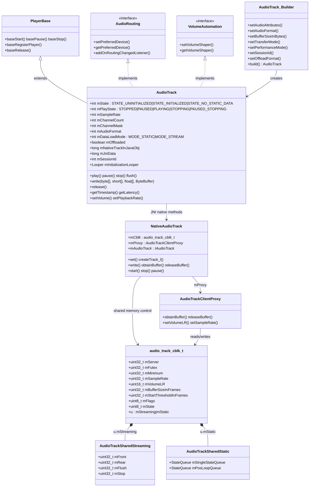
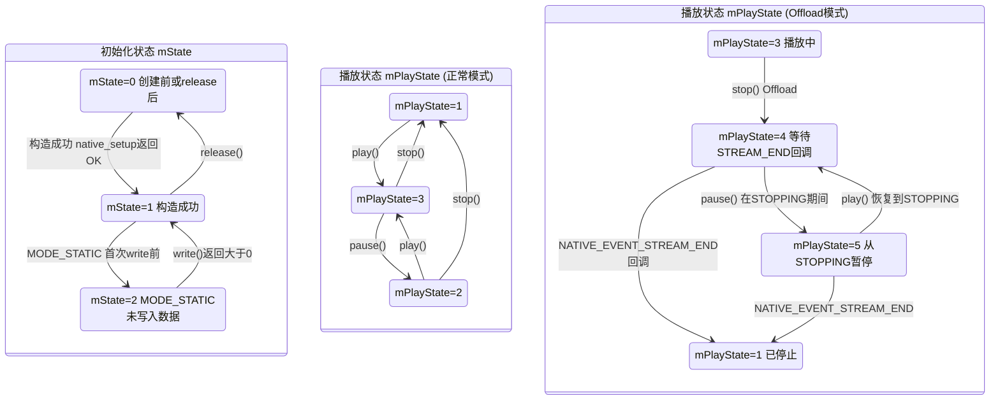
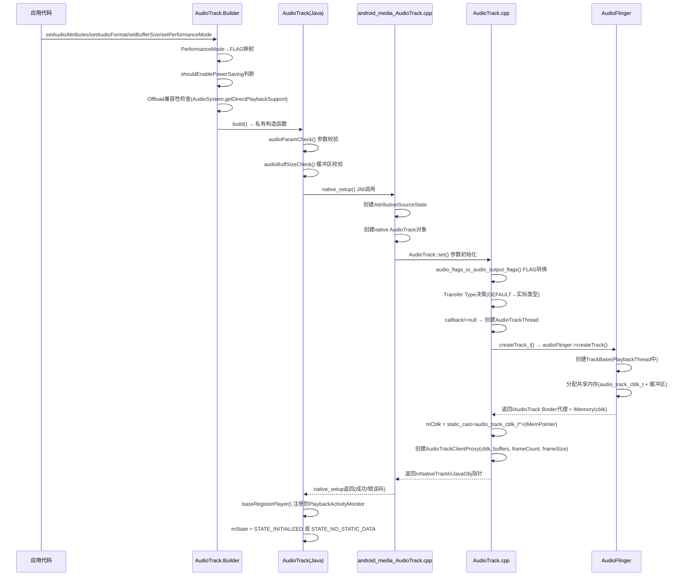
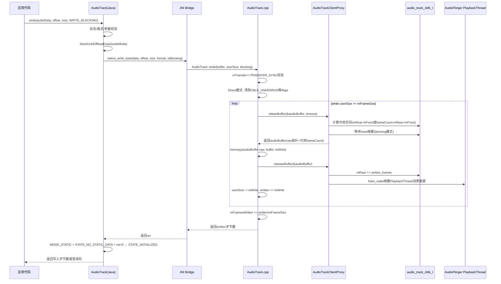
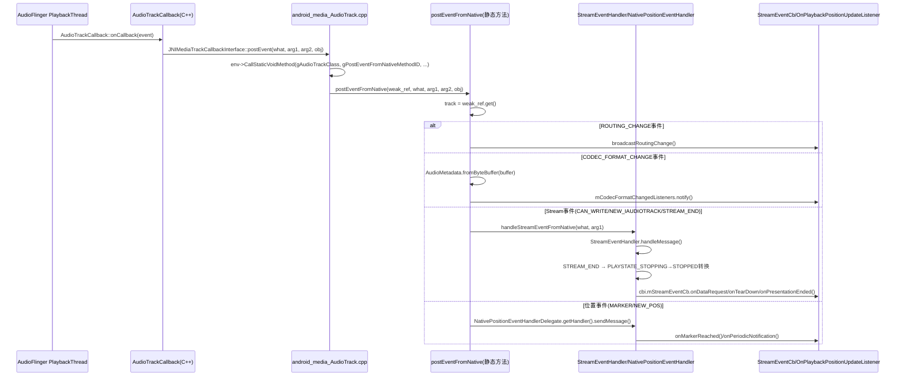

[← 返回Application Layer](README.md) | [返回导航](../README.md) | [2.2 AudioRecord →](02_2.2_AudioRecord.md)

## 2.1 AudioTrack — 播放核心API深度解析

### 1. 模块职责

AudioTrack是Android音频播放体系的核心Java层API，负责将PCM音频数据（或压缩格式的Offload数据）从应用层写入共享内存缓冲区，经AudioFlinger混音后输出到音频设备。它实现了从应用数据写入到硬件播放的完整数据通路：

- **数据写入**：应用通过[`write()`](frameworks/base/media/java/android/media/AudioTrack.java:3196)方法族将音频数据推入共享内存环形缓冲区
- **状态控制**：[`play()`](frameworks/base/media/java/android/media/AudioTrack.java:2983)/[`pause()`](frameworks/base/media/java/android/media/AudioTrack.java:3071)/[`stop()`](frameworks/base/media/java/android/media/AudioTrack.java:3041)/[`flush()`](frameworks/base/media/java/android/media/AudioTrack.java:3105)控制播放生命周期
- **事件回调**：通过[`postEventFromNative()`](frameworks/base/media/java/android/media/AudioTrack.java:4373)接收Native层的标记、位置更新、Offload流结束等事件
- **参数调节**：音量、采样率、播放速率等实时参数调整
- **路由控制**：实现[`AudioRouting`](frameworks/base/media/java/android/media/AudioRouting.java)接口，支持设备选择与路由变化回调

### 2. 源码位置（四层架构）

| 层次 | 文件路径 | 核心职责 |
|------|---------|---------|
| **Java Framework** | [`AudioTrack.java`](frameworks/base/media/java/android/media/AudioTrack.java) (4660行) | 公开API、Builder构造、状态管理、write方法族 |
| **JNI Bridge** | [`android_media_AudioTrack.cpp`](frameworks/base/core/jni/android_media_AudioTrack.cpp) (1595行) | Java↔Native方法映射、postEventFromNative回调桥接 |
| **Native Framework** | [`AudioTrack.cpp`](frameworks/av/media/libaudioclient/AudioTrack.cpp) (约2800行) | Native AudioTrack实现、set()/createTrack_l()/write() |
| **Shared Memory** | [`AudioTrackShared.h`](frameworks/av/include/private/media/AudioTrackShared.h) (约300行) | audio_track_cblk_t控制块、AudioTrackClientProxy |

### 3. 核心类关系图



### 4. 完整状态机图

AudioTrack存在两套独立的状态维度：**初始化状态（mState）** 和 **播放状态（mPlayState）**。播放状态中包含Offload模式的特殊过渡状态。



**Offload模式状态转换详解**：

- Offload模式下[`stop()`](frameworks/base/media/java/android/media/AudioTrack.java:3041)不直接进入STOPPED，而是先设为`PLAYSTATE_STOPPING(4)`，等待硬件解码器消耗完已提交的压缩数据后，AudioFlinger发送`NATIVE_EVENT_STREAM_END(7)`回调
- 在STOPPING期间调用[`pause()`](frameworks/base/media/java/android/media/AudioTrack.java:3071)会转为`PLAYSTATE_PAUSED_STOPPING(5)`，表示"暂停了但还在等待流结束"
- 从PAUSED_STOPPING调用[`play()`](frameworks/base/media/java/android/media/AudioTrack.java:2983)会恢复为STOPPING，继续等待STREAM_END
- [`StreamEventHandler`](frameworks/base/media/java/android/media/AudioTrack.java:4185)在收到STREAM_END事件时，如果当前是STOPPING状态且`mOffloadEosPending=false`，则转为STOPPED

### 5. 构造流程深度解析

#### 5.1 Builder参数与映射

[`AudioTrack.Builder`](frameworks/base/media/java/android/media/AudioTrack.java)采用Builder模式，关键参数映射如下：

| Builder参数 | 内部映射 | 说明 |
|-------------|---------|------|
| `setAudioAttributes()` | → `mAttributes` → Native `audio_attributes_t` | 用途/内容类型/标志 |
| `setAudioFormat()` | → `mAudioFormat` → Native `audio_format_t` | 采样率/通道掩码/编码格式 |
| `setBufferSizeInBytes()` | → `mNativeBufferSizeInBytes` → Native `frameCount` | 缓冲区大小，决定frameCount |
| `setTransferMode()` | → `mDataLoadMode` → Native `transfer_type` | MODE_STREAM→TRANSFER_SYNC, MODE_STATIC→TRANSFER_SHARED |
| `setPerformanceMode()` | → `AudioAttributes.flags` | 见5.2节详细映射 |
| `setSessionId()` | → `mSessionId` → Native `audio_session_t` | 音频会话ID，0表示自动分配 |
| `setOffloadFormat()` | → 检查Offload支持 → `mOffloaded=true` | 压缩格式直通硬件解码 |

#### 5.2 PerformanceMode → FLAG映射

[`Builder.build()`](frameworks/base/media/java/android/media/AudioTrack.java)中PerformanceMode到AudioAttributes flags的映射逻辑：

| PerformanceMode | FLAG操作 | 输出路径 |
|----------------|---------|---------|
| `PERFORMANCE_MODE_LOW_LATENCY` | 设置`FLAG_LOW_LATENCY`，清除`FLAG_DEEP_BUFFER` | AUDIO_OUTPUT_FLAG_FAST(0x4) → 快速混音线程 |
| `PERFORMANCE_MODE_POWER_SAVING` | 设置`FLAG_DEEP_BUFFER`，清除`FLAG_LOW_LATENCY` | AUDIO_OUTPUT_FLAG_DEEP_BUFFER(0x8) → 深缓冲线程 |
| `PERFORMANCE_MODE_NONE` | 调用`shouldEnablePowerSaving()`自动判断 | 可能走DEEP_BUFFER或默认路径 |

映射在Native [`AudioTrack::set()`](frameworks/av/media/libaudioclient/AudioTrack.cpp:425)中通过[`audio_flags_to_audio_output_flags()`](frameworks/av/media/libaudioclient/AudioTrack.cpp:480)将AudioAttributes.flags转为`audio_output_flags_t`：

- `FLAG_LOW_LATENCY` → `AUDIO_OUTPUT_FLAG_FAST`
- `FLAG_DEEP_BUFFER` → `AUDIO_OUTPUT_FLAG_DEEP_BUFFER`

**FAST标志的额外约束**（[`createTrack_l()`](frameworks/av/media/libaudioclient/AudioTrack.cpp:1825)）：

FAST标志仅在以下Transfer Type组合下被允许：
- `TRANSFER_SHARED`（共享缓冲区）
- `TRANSFER_CALLBACK`（回调模式）
- `TRANSFER_OBTAIN`（obtain/release模式）
- `TRANSFER_SYNC/TRANSFER_SYNC_NOTIF_CALLBACK` + `threadCanCallJava=true`

否则FAST请求会被客户端拒绝：`mFlags = mFlags & ~AUDIO_OUTPUT_FLAG_FAST`

#### 5.3 shouldEnablePowerSaving决策逻辑

[`shouldEnablePowerSaving()`](frameworks/base/media/java/android/media/AudioTrack.java:1783)决定`PERFORMANCE_MODE_NONE`时是否自动启用DEEP_BUFFER（省电模式），条件链如下：

```
shouldEnablePowerSaving() = true 的必要条件：
1. AudioAttributes条件：
   - 不能含有FLAG_DEEP_BUFFER|FLAG_LOW_LATENCY|FLAG_HW_AV_SYNC|FLAG_BEACON
   - usage == USAGE_MEDIA
   - contentType == CONTENT_TYPE_UNKNOWN|CONTENT_TYPE_MUSIC|CONTENT_TYPE_MOVIE
2. AudioFormat条件：
   - 格式必须完全指定（sampleRate != UNSPECIFIED）
   - 必须是线性PCM编码
   - 必须是合法编码
   - channelCount >= 1
3. TransferMode条件：
   - mode == MODE_STREAM（仅流模式）
4. BufferSize条件：
   - bufferSizeInBytes >= 100ms对应的字节大小
     计算公式: 100ms * channelCount * bytesPerSample * sampleRate / 1000
   - bufferSizeInBytes == 0时（Builder默认）视为兼容
```

**设计意图**：只有长时间播放的音乐/影视类内容，且缓冲区足够大（>=100ms），才值得用DEEP_BUFFER牺牲延迟换取省电。

#### 5.4 native_setup → AudioFlinger createTrack完整时序



**关键步骤解析**：

1. **Transfer Type决策**（[`AudioTrack::set()`](frameworks/av/media/libaudioclient/AudioTrack.cpp:511)）：
   - `TRANSFER_DEFAULT`：sharedBuffer!=0 → SHARED；callback==null或threadCanCallJava → SYNC；否则 → CALLBACK
   - Java层MODE_STREAM对应`TRANSFER_SYNC`，MODE_STATIC对应`TRANSFER_SHARED`

2. **createTrack_l Binder交互**（[`AudioTrack::createTrack_l()`](frameworks/av/media/libaudioclient/AudioTrack.cpp:1807)）：
   - 构建`IAudioFlinger::CreateTrackInput`，包含attr/config/clientInfo/flags/frameCount等
   - 调用`audioFlinger->createTrack()` → AudioFlinger在PlaybackThread中创建Track
   - 返回`CreateTrackOutput`：包含audioTrack(IAudioTrack代理)、frameCount、sessionId、outputId等
   - 通过`output.audioTrack->getCblk()`获取共享内存IMemory

3. **共享内存布局**：
   - 共享内存起始处为`audio_track_cblk_t`控制块
   - STREAM模式：缓冲区紧跟cblk之后（`buffers = cblk + 1`）
   - STATIC模式：缓冲区为单独的sharedBuffer区域

### 6. 核心方法源码解析

#### 6.1 write()方法族详解

AudioTrack提供4种write()方法，对应不同数据类型：

| 方法签名 | JNI映射 | 适用格式 |
|---------|---------|---------|
| [`write(byte[], offset, size, writeMode)`](frameworks/base/media/java/android/media/AudioTrack.java:3196) | `native_write_byte` | PCM_8BIT/PCM_16BIT/压缩格式 |
| [`write(short[], offset, size, writeMode)`](frameworks/base/media/java/android/media/AudioTrack.java:3309) | `native_write_short` | PCM_16BIT |
| [`write(float[], offset, size, writeMode)`](frameworks/base/media/java/android/media/AudioTrack.java) | `native_write_float` | PCM_FLOAT |
| [`write(ByteBuffer, size, writeMode)`](frameworks/base/media/java/android/media/AudioTrack.java) | `native_write_native_bytes` | 所有格式(含Direct Buffer) |

**write()通用流程**：

```
1. 状态校验: mState == STATE_UNINITIALIZED → ERROR_INVALID_OPERATION
2. 格式校验: 数据类型与mAudioFormat不匹配 → ERROR_INVALID_OPERATION
3. 参数校验: null/越界/负值 → ERROR_BAD_VALUE
4. Offload排水: blockUntilOffloadDrain(writeMode) → 返回false时返回0
5. JNI调用: native_write_*() → 进入Native层
6. STATIC模式特殊处理: mState == STATE_NO_STATIC_DATA 且 ret>0 → mState = STATE_INITIALIZED
7. 返回: 写入字节数/帧数 或 错误码
```

**WRITE_BLOCKING vs WRITE_NON_BLOCKING语义**：

| 模式 | 常量值 | 行为 |
|------|--------|------|
| `WRITE_BLOCKING` | 0 | 阻塞直到所有数据写入共享内存缓冲区（或在stop/pause/中断时返回短传输） |
| `WRITE_NON_BLOCKING` | 1 | 尽可能写入当前可用缓冲区空间，立即返回实际写入量 |

在Native层[`AudioTrack::write()`](frameworks/av/media/libaudioclient/AudioTrack.cpp:2310)中：

- `blocking=true` → `obtainBuffer(&audioBuffer, &ClientProxy::kForever)` 无限等待可用缓冲区
- `blocking=false` → `obtainBuffer(&audioBuffer, &ClientProxy::kNonBlocking)` 零超时等待

**write()数据流转完整时序图**：



#### 6.2 play()/pause()/stop()状态转换

**play()流程**（[`AudioTrack.play()`](frameworks/base/media/java/android/media/AudioTrack.java:2983)）：

```java
// 核心逻辑（简化）
public void play() {
    synchronized(mPlayStateLock) {
        // Offload特殊路径: PAUSED_STOPPING → STOPPING
        if (mPlayState == PLAYSTATE_PAUSED_STOPPING) {
            mPlayState = PLAYSTATE_STOPPING; // 恢复等待STREAM_END
        }
        baseStart();   // PlayerBase: 通知PlaybackActivityMonitor
        native_start(); // JNI: Native AudioTrack::start()
        mPlayState = PLAYSTATE_PLAYING;
        mPlayStateLock.notify();
    }
}
```

Native [`AudioTrack::start()`](frameworks/av/media/libaudioclient/AudioTrack.cpp)关键步骤：
1. 检查mStatus != NO_ERROR → 返回错误
2. 调用`mAudioTrack->start()` → Binder调用AudioFlinger Track::start()
3. AudioFlinger将Track加入PlaybackThread的活跃列表，开始从共享内存读取数据

**pause()流程**（[`AudioTrack.pause()`](frameworks/base/media/java/android/media/AudioTrack.java:3071)）：

```java
public void pause() {
    synchronized(mPlayStateLock) {
        // Offload特殊路径: STOPPING → PAUSED_STOPPING
        if (mPlayState == PLAYSTATE_STOPPING) {
            mPlayState = PLAYSTATE_PAUSED_STOPPING;
        } else {
            native_pause(); // JNI: Native AudioTrack::pause()
            basePause();    // PlayerBase: 通知PlaybackActivityMonitor
            mPlayState = PLAYSTATE_PAUSED;
        }
        mPlayStateLock.notify();
    }
}
```

**stop()流程**（[`AudioTrack.stop()`](frameworks/base/media/java/android/media/AudioTrack.java:3041)）：

```java
public void stop() {
    synchronized(mPlayStateLock) {
        if (mOffloaded) {
            // Offload模式: 进入STOPPING等待硬件消耗完数据
            mPlayState = PLAYSTATE_STOPPING;
            native_stop();
        } else {
            native_stop(); // JNI: Native AudioTrack::stop()
            baseStop();    // PlayerBase: 通知PlaybackActivityMonitor
            mPlayState = PLAYSTATE_STOPPED;
        }
        mPlayStateLock.notify();
    }
}
```

**状态转换汇总表**：

| 当前状态 | play() | pause() | stop() |
|---------|--------|---------|--------|
| STOPPED | → PLAYING | (不变) | (不变) |
| PLAYING | (不变) | → PAUSED | → STOPPED(正常) / → STOPPING(Offload) |
| PAUSED | → PLAYING | (不变) | → STOPPED |
| STOPPING | → *不适用* | → PAUSED_STOPPING | → *不适用* |
| PAUSED_STOPPING | → STOPPING | → *不适用* | → *不适用* |

#### 6.3 flush()语义

[`AudioTrack.flush()`](frameworks/base/media/java/android/media/AudioTrack.java:3105)清除共享内存缓冲区中已写入但尚未被AudioFlinger消费的数据：

```java
public void flush() {
    if (mState == STATE_INITIALIZED) {
        native_flush(); // JNI→Native AudioTrack::flush()
        mAvSyncHeader = null;
        mAvSyncBytesRemaining = 0;
    }
}
```

Native层flush语义：
- **STREAM模式**：将`AudioTrackSharedStreaming.mFlush`设置为当前mRear值，AudioFlinger的PlaybackThread检测到flush后，将mFront重置到mFlush位置，丢弃缓冲区中未播放数据
- **STATIC模式**：重置播放位置到缓冲区起始
- flush只在STOPPED或PAUSED状态有效果，PLAYING状态下flush可能导致数据竞争

#### 6.4 release()资源释放

[`AudioTrack.release()`](frameworks/base/media/java/android/media/AudioTrack.java:2029)完整释放流程：

```java
public void release() {
    synchronized(mStreamEventCbLock) {
        endStreamEventHandling(); // 终止所有Stream事件回调
    }
    try { stop(); } catch(IllegalStateException ise) {} // 安全停止
    if (mAudioPolicy != null) {
        AudioManager.unregisterAudioPolicyAsyncStatic(mAudioPolicy);
        mAudioPolicy = null;
    }
    baseRelease();     // PlayerBase: 从PlaybackActivityMonitor注销
    native_release();  // JNI→Native: 删除Native AudioTrack对象
    synchronized(mPlayStateLock) {
        mState = STATE_UNINITIALIZED;
        mPlayState = PLAYSTATE_STOPPED;
        mPlayStateLock.notify(); // 唤醒可能等待状态的线程
    }
}
```

**资源释放层级**：

| 层级 | 操作 | 说明 |
|------|------|------|
| Java回调层 | `endStreamEventHandling()` | 停止所有StreamEventCb回调 |
| Java状态层 | `stop()` → `baseRelease()` | 停止播放，注销PlayerBase |
| Java政策层 | `unregisterAudioPolicyAsyncStatic()` | 注销AudioPolicy（如有） |
| JNI/Native层 | `native_release()` | 释放Native AudioTrack，断开IAudioTrack Binder |
| 共享内存层 | Native析构自动释放 | AudioFlinger回收TrackBase及其共享内存 |
| 状态层 | `mState=UNINITIALIZED` | 彻底标记为不可用 |

**release() vs stop()关键区别**：stop()保留Native AudioTrack对象，可重新play()；release()彻底销毁，之后对象不可用。

### 7. Native层深度解析

#### 7.1 AudioTrack::set()关键方法

[`AudioTrack::set()`](frameworks/av/media/libaudioclient/AudioTrack.cpp:425)是Native层初始化核心方法，完整流程：

```
1. 参数初始化:
   - mSampleRate, mChannelMask, mReqFrameCount等基本参数赋值
   - mAttributes = pAttributes（如有）或AUDIO_ATTRIBUTES_INITIALIZER

2. FLAG调整:
   - audio_flags_to_audio_output_flags(mAttributes.flags, &flags)
     → 将AudioAttributes.flags转为audio_output_flags_t
   - Offload或非线性PCM → 强制AUDIO_OUTPUT_FLAG_DIRECT, 清除FAST
     → flags = (flags | DIRECT) & ~FAST
   - HW_AV_SYNC → 强制DIRECT
     → flags = flags | DIRECT

3. Transfer Type决策:
   - TRANSFER_DEFAULT → 根据sharedBuffer/callback/threadCanCallJava自动选择
   - SHARED/SYNC/CALLBACK/OBTAIN各有校验条件

4. 参数校验:
   - format有效性检查(audio_is_valid_format)
   - channelMask有效性检查(audio_is_output_channel)
   - mFrameSize计算: DIRECT模式非比例帧格式→sizeof(uint8_t)，否则→channelCount*bytesPerSample
   - Direct模式要求sampleRate!=0
   - FAST模式下notificationFrames校验

5. OffloadInfo拷贝:
   - 保存offloadInfo为mOffloadInfoCopy用于后续createTrack_l

6. AudioTrackThread创建:
   - callback!=nullptr → 创建AudioTrackThread(优先级ANDROID_PRIORITY_AUDIO)

7. createTrack_l():
   - 通过AudioFlinger Binder创建IAudioTrack
   - 获取共享内存audio_track_cblk_t
   - 创建AudioTrackClientProxy

8. 初始化后续状态:
   - mLoopCount=0, mMarkerPosition=0, mFramesWritten=0等
   - AudioSystem::acquireAudioSessionId()
   - VolumeHandler创建
```

#### 7.2 AudioTrack::createTrack_l()与AudioFlinger交互

[`AudioTrack::createTrack_l()`](frameworks/av/media/libaudioclient/AudioTrack.cpp:1807)是与AudioFlinger Binder交互的核心方法：

**1. 获取AudioFlinger服务**：
```cpp
const sp<IAudioFlinger>& audioFlinger = AudioSystem::get_audio_flinger();
```

**2. FAST标志客户端验证**（行1825-1846）：
- FAST仅允许SHARED/CALLBACK/OBTAIN/SYNC+threadCanCallJava
- 不满足条件：`mFlags = mFlags & ~AUDIO_OUTPUT_FLAG_FAST`

**3. 构建CreateTrackInput**（行1848-1883）：
```cpp
IAudioFlinger::CreateTrackInput input;
input.attr = mAttributes; // 或streamType→attributes转换
input.config = {mSampleRate, mChannelMask, mFormat, mOffloadInfoCopy};
input.clientInfo.attributionSource = mClientAttributionSource;
input.clientInfo.clientTid = FAST模式时AudioTrackThread->getTid()
input.sharedBuffer = mSharedBuffer;
input.flags = mFlags;
input.frameCount = mReqFrameCount;
input.notificationFrameCount = mNotificationFramesReq;
```

**4. Binder调用**（行1886）：
```cpp
status = audioFlinger->createTrack(VALUE_OR_FATAL(input.toAidl()), response);
```

**5. 解析CreateTrackOutput**（行1904-1920）：
- `mFrameCount = output.frameCount`（实际分配的帧数可能≥请求值）
- `mNotificationFramesAct = output.notificationFrameCount`
- `mRoutedDeviceId, mSessionId, mStreamType`等更新
- `mSampleRate = output.sampleRate`（可能被修正）
- `mAfLatency, mAfFrameCount, mAfSampleRate`等AudioFlinger参数获取

**6. 获取共享内存**（行1927-1945）：
```cpp
output.audioTrack->getCblk(&sfr); // 获取控制块IMemory
sp<IMemory> iMem = aidl2legacy_NullableSharedFileRegion_IMemory(sfr);
void *iMemPointer = iMem->unsecurePointer();
mCblk = static_cast<audio_track_cblk_t*>(iMemPointer);
```

**7. 创建Proxy**（行2024-2030）：
```cpp
if (mSharedBuffer == 0) {
    mProxy = new AudioTrackClientProxy(cblk, buffers, mFrameCount, mFrameSize);
} else {
    mStaticProxy = new StaticAudioTrackClientProxy(cblk, buffers, mFrameCount, mFrameSize);
    mProxy = mStaticProxy;
}
```

**8. 初始化Proxy参数**（行2032-2050）：
- `mProxy->setVolumeLR()` 设置初始音量
- `mProxy->setSampleRate()` 设置采样率
- `mProxy->setPlaybackRate()` 设置播放速率
- `mProxy->setMinimum()` 设置通知帧数阈值

#### 7.3 AudioTrack::write()数据写入机制

[`AudioTrack::write()`](frameworks/av/media/libaudioclient/AudioTrack.cpp:2310)的obtainBuffer→memcpy→releaseBuffer循环：

```cpp
ssize_t AudioTrack::write(const void* buffer, size_t userSize, bool blocking) {
    // 1. Transfer Type校验
    if (mTransfer != TRANSFER_SYNC && mTransfer != TRANSFER_SYNC_NOTIF_CALLBACK) {
        return INVALID_OPERATION;
    }
    
    // 2. Direct模式: 清除UNDERRUN等flags
    if (isDirect()) {
        android_atomic_and(~(CBLK_UNDERRUN|CBLK_LOOP_CYCLE|CBLK_LOOP_FINAL|CBLK_BUFFER_END), 
                          &mCblk->mFlags);
    }
    
    // 3. 数据写入循环
    size_t written = 0;
    Buffer audioBuffer;
    while (userSize >= mFrameSize) {
        audioBuffer.frameCount = userSize / mFrameSize;
        
        // obtainBuffer: 从共享内存获取可用写入空间
        status_t err = obtainBuffer(&audioBuffer,
                blocking ? &ClientProxy::kForever : &ClientProxy::kNonBlocking);
        if (err < 0) {
            if (written > 0) break; // 已有数据写入，返回部分结果
            return ssize_t(err);    // 无数据写入，返回错误
        }
        
        // memcpy: 将用户数据拷贝到共享内存
        size_t toWrite = audioBuffer.size();
        memcpy(audioBuffer.raw, buffer, toWrite);
        buffer = ((const char*)buffer) + toWrite;
        userSize -= toWrite;
        written += toWrite;
        
        // releaseBuffer: 通知AudioFlinger有新数据可消费
        releaseBuffer(&audioBuffer);
    }
    
    // 4. 更新统计
    if (written > 0) {
        mFramesWritten += written / mFrameSize;
        if (mTransfer == TRANSFER_SYNC_NOTIF_CALLBACK) {
            mAudioTrackThread->wake(); // 触发CAN_WRITE_MORE_DATA回调
        }
    }
    return written;
}
```

**obtainBuffer/releaseBuffer核心机制**：
- `obtainBuffer()`通过AudioTrackClientProxy计算共享内存环形缓冲区中的可用空间，等待futex唤醒（blocking模式），返回可写区域的指针和大小
- `releaseBuffer()`更新mRear指针（写位置），并通过futex唤醒AudioFlinger的PlaybackThread来消费新数据

#### 7.4 共享内存机制 — audio_track_cblk_t结构详解

[`audio_track_cblk_t`](frameworks/av/include/private/media/AudioTrackShared.h:207)是AudioTrack客户端与AudioFlinger服务端之间的共享内存控制块，位于共享内存的起始位置，通过futex进行生产者-消费者同步。

**结构体字段详解**：

| 字段 | 类型 | 用途 |
|------|------|------|
| `mServer` | uint32_t | 服务端(AudioFlinger)已消费的帧数，用于计算播放进度 |
| `mPad1` | uint32_t | 对齐填充 |
| `mFutex` | uint32_t | futex同步变量，用于生产者-消费者阻塞/唤醒 |
| `mMinimum` | uint32_t | 通知阈值帧数(obtainBuffer等待的最小可用空间) |
| `mVolumeLR` | uint16_t | 左右声道音量(打包为gain_minifloat_pair) |
| `mSampleRate` | uint32_t | 客户端设置的采样率 |
| `mPlaybackRateQueue` | StateQueue | 播放速率参数队列(速度/变调/降混模式) |
| `mSendLevel` | uint32_t | 辅助效果发送级别 |
| `mBufferSizeInFrames` | uint32_t | 当前缓冲区帧数(可动态调整) |
| `mStartThresholdInFrames` | uint32_t | 自动启动阈值(缓冲区填充到此帧数后自动开始播放) |
| `mFlags` | uint8_t | CBLK标志位(UNDERRUN/INVALID/DISABLED等) |
| `mState` | uint8_t | Track状态(ACTIVE/PAUSED/STOPPED/FLUSHED等) |
| `u.mStreaming` | AudioTrackSharedStreaming | STREAM模式专用字段 |
| `u.mStatic` | AudioTrackSharedStatic | STATIC模式专用字段 |

**CBLK标志常量**（[`AudioTrackShared.h`](frameworks/av/include/private/media/AudioTrackShared.h:37)）：

| 标志 | 值 | 含义 |
|------|----|------|
| `CBLK_UNDERRUN` | 0x01 | 发生欠载（缓冲区数据不足） |
| `CBLK_FORCEREADY` | 0x02 | 强制标记为就绪 |
| `CBLK_INVALID` | 0x04 | IAudioTrack已失效(需重建) |
| `CBLK_DISABLED` | 0x08 | Track被禁用 |
| `CBLK_LOOP_CYCLE` | 0x10 | 循环播放完成一个周期 |
| `CBLK_LOOP_FINAL` | 0x20 | 循环播放最终周期完成 |
| `CBLK_BUFFER_END` | 0x40 | 缓冲区数据全部播放完毕 |
| `CBLK_OVERRUN` | 0x80 | 发生溢载(缓冲区溢出) |

**AudioTrackSharedStreaming结构**（[`AudioTrackShared.h`](frameworks/av/include/private/media/AudioTrackShared.h:134)）：

| 字段 | 类型 | 用途 |
|------|------|------|
| `mFront` | uint32_t | **消费者(AudioFlinger)读位置**，环形缓冲区前端指针 |
| `mRear` | uint32_t | **生产者(应用)写位置**，环形缓冲区后端指针 |
| `mFlush` | uint32_t | flush操作的目标位置，mFront将被重置到此值 |
| `mStop` | uint32_t | stop时的mRear位置，用于计算实际有效数据量 |
| `mUnderrunFrames` | uint32_t | 欠载帧数统计 |
| `mUnderrunCount` | uint16_t | 欠载次数统计 |

**环形缓冲区指针模型**：

```
STREAM模式共享内存布局:
┌──────────────────────────────────────────────┐
│ audio_track_cblk_t (控制块)                  │ ← iMemPointer
│ ┌──────────────────────────────────────────┐ │
│ │ mServer|mFutex|mMinimum|mVolumeLR|...    │ │
│ │ u.mStreaming: mFront|mRear|mFlush|mStop  │ │
│ └──────────────────────────────────────────┘ │
│ Buffer Area (环形缓冲区, cblk+1)             │ ← buffers = cblk + 1
│ ┌──────────────────────────────────────────┐ │
│ │ [已播放区] [可读区] [可写区] [空闲区]      │ │
│ │         ↑mFront    ↑mRear               │ │
│ └──────────────────────────────────────────┘ │
└──────────────────────────────────────────────┘

指针关系:
- mFront: AudioFlinger下一次读取的帧位置
- mRear:  应用下一次写入的帧位置
- 可读区 = mRear - mFront (已写入但未消费)
- 可写区 = mFrameCount - (mRear - mFront) (剩余可用空间)
- mFlush: flush时将mFront设为mFlush，丢弃mFront到mFlush之间的数据
```

**AudioTrackSharedStatic结构**（[`AudioTrackShared.h`](frameworks/av/include/private/media/AudioTrackShared.h:190)）：

STATIC模式使用`StateQueue`（单向状态队列）进行客户端→服务端参数传递，包含：
- `mSingleStateQueue`：单次状态更新（如播放位置设置）
- `mPosLoopQueue`：循环参数更新（循环起止位置和次数）

**生产者-消费者同步机制**：

1. **写入端（应用 → AudioTrack）**：
   - `obtainBuffer()`：检查可写空间，如果空间不足且blocking模式，通过futex等待AudioFlinger消费后唤醒
   - `releaseBuffer()`：更新mRear，通过futex唤醒AudioFlinger（`futex_wake()`）

2. **读取端（AudioFlinger → PlaybackThread）**：
   - 检查可读帧数(mRear - mFront)，如果数据不足标记UNDERRUN
   - 消费数据后更新mFront，通过futex唤醒等待的应用线程

3. **futex同步**：
   - `mFutex`字段作为futex变量，`FUTEX_WAKE`和`FUTEX_WAIT`操作基于此值
   - AudioTrackClientProxy在obtainBuffer中调用`android_atomic_acquire_load(&mCblk->mFutex)`检查是否需要等待

#### 7.5 JNI回调机制 — 从Native到Java的事件桥接

[`android_media_AudioTrack.cpp`](frameworks/base/core/jni/android_media_AudioTrack.cpp)中的JNI注册和回调机制：

**1. Native方法注册**（[`register_android_media_AudioTrack`](frameworks/base/core/jni/android_media_AudioTrack.cpp:1557)）：

JNI层在初始化时获取关键Java类/方法/字段ID：
- `gAudioTrackClass`：AudioTrack Java类引用
- `gPostEventFromNativeMethodID`：[`postEventFromNative()`](frameworks/base/media/java/android/media/AudioTrack.java:4373)的JNI方法ID
- 各native方法的函数指针映射（native_setup→android_media_AudioTrack_native_setup等）

**2. Native→Java回调入口**：

Native层通过`JNIMediaTrackCallbackInterface::postEvent()`调用JNI层，JNI层通过`gPostEventFromNativeMethodID`反射调用Java的`postEventFromNative()`静态方法。参数传递：
- `audiotrack_ref`：WeakReference<AudioTrack>，避免Native持有强引用阻止GC
- `what`：事件类型(NATIVE_EVENT_MARKER/NEW_POS等)
- `arg1/arg2`：事件参数
- `obj`：附加对象（如ByteBuffer for CODEC_FORMAT_CHANGE）

**3. Java层事件分发**（[`postEventFromNative()`](frameworks/base/media/java/android/media/AudioTrack.java:4373)）：

```java
private static void postEventFromNative(Object audiotrack_ref,
        int what, int arg1, int arg2, Object obj) {
    // 1. 从WeakReference获取AudioTrack实例
    final AudioTrack track = (AudioTrack)((WeakReference)audiotrack_ref).get();
    if (track == null) return; // Track已被GC回收
    
    // 2. 路由变化事件 → broadcastRoutingChange()
    if (what == AudioSystem.NATIVE_EVENT_ROUTING_CHANGE) {
        track.broadcastRoutingChange();
        return;
    }
    
    // 3. 编码格式变化 → mCodecFormatChangedListeners.notify()
    if (what == NATIVE_EVENT_CODEC_FORMAT_CHANGE) {
        ByteBuffer buffer = (ByteBuffer)obj;
        AudioMetadataReadMap metaData = AudioMetadata.fromByteBuffer(buffer);
        track.mCodecFormatChangedListeners.notify(0, metaData);
        return;
    }
    
    // 4. Stream事件 → handleStreamEventFromNative()
    if (what == NATIVE_EVENT_CAN_WRITE_MORE_DATA
            || what == NATIVE_EVENT_NEW_IAUDIOTRACK
            || what == NATIVE_EVENT_STREAM_END) {
        track.handleStreamEventFromNative(what, arg1);
        return;
    }
    
    // 5. 位置事件 → NativePositionEventHandlerDelegate Handler
    NativePositionEventHandlerDelegate delegate = track.mEventHandlerDelegate;
    if (delegate != null) {
        Handler handler = delegate.getHandler();
        handler.sendMessage(handler.obtainMessage(what, arg1, arg2, obj));
    }
}
```

### 8. 回调与事件机制

#### 8.1 OnPlaybackPositionUpdateListener

`OnPlaybackPositionUpdateListener`接口用于接收播放位置相关事件：

| 事件 | 常量 | 回调方法 | 触发条件 |
|------|------|---------|---------|
| MARKER到达 | `NATIVE_EVENT_MARKER(3)` | `onMarkerReached(AudioTrack)` | 播放头到达setMarkerPosition设定的位置 |
| 周期性位置更新 | `NATIVE_EVENT_NEW_POS(4)` | `onPeriodicNotification(AudioTrack, period)` | 每播放setPositionNotificationPeriod设定的帧数 |

注册流程：
- `setPlaybackPositionUpdateListener(listener, handler)` → 创建`NativePositionEventHandlerDelegate`
- Delegate内部Handler在`handleMessage()`中根据事件类型调用listener的对应方法
- Handler运行在应用指定的Looper上（默认为创建AudioTrack时的Looper）

#### 8.2 StreamEventCb — Offload/回调事件

[`StreamEventCb`](frameworks/base/media/java/android/media/AudioTrack.java)是AOSP14新增的流事件回调接口，用于Offload模式数据请求和IAudioTrack重建：

| 事件 | 常量 | 回调方法 | 说明 |
|------|------|---------|------|
| 可写更多数据 | `NATIVE_EVENT_CAN_WRITE_MORE_DATA(9)` | `onDataRequest(AudioTrack, size)` | Offload/Tunnel模式硬件解码器需要更多压缩数据 |
| IAudioTrack重建 | `NATIVE_EVENT_NEW_IAUDIOTRACK(6)` | `onTearDown(AudioTrack)` | IAudioTrack因路由变化等原因被AudioFlinger重建 |
| 流结束 | `NATIVE_EVENT_STREAM_END(7)` | `onPresentationEnded(AudioTrack)` | Offload模式下stop后硬件解码完毕所有数据 |

[`handleStreamEventFromNative()`](frameworks/base/media/java/android/media/AudioTrack.java:4162)的Stream事件分发：

```java
void handleStreamEventFromNative(int what, int arg) {
    switch (what) {
        case NATIVE_EVENT_CAN_WRITE_MORE_DATA:
            // 合并重复消息，只保留最新值
            mStreamEventHandler.removeMessages(NATIVE_EVENT_CAN_WRITE_MORE_DATA);
            mStreamEventHandler.sendMessage(obtainMessage(NATIVE_EVENT_CAN_WRITE_MORE_DATA, arg, 0));
            break;
        case NATIVE_EVENT_NEW_IAUDIOTRACK:
            mStreamEventHandler.sendMessage(obtainMessage(NATIVE_EVENT_NEW_IAUDIOTRACK));
            break;
        case NATIVE_EVENT_STREAM_END:
            mStreamEventHandler.sendMessage(obtainMessage(NATIVE_EVENT_STREAM_END));
            break;
    }
}
```

[`StreamEventHandler`](frameworks/base/media/java/android/media/AudioTrack.java:4185)的`handleMessage()`关键处理：

```java
public void handleMessage(Message msg) {
    // STREAM_END特殊处理: Offload STOPPING→STOPPED状态转换
    if (msg.what == NATIVE_EVENT_STREAM_END) {
        synchronized(mPlayStateLock) {
            if (mPlayState == PLAYSTATE_STOPPING) {
                if (mOffloadEosPending) {
                    native_start(); // EOS待处理→重新启动播放最后数据
                    mPlayState = PLAYSTATE_PLAYING;
                } else {
                    mAvSyncHeader = null;
                    mAvSyncBytesRemaining = 0;
                    mPlayState = PLAYSTATE_STOPPED; // 正常完成→STOPPED
                }
                mOffloadEosPending = false;
                mPlayStateLock.notify();
            }
        }
    }
    // 分发到注册的StreamEventCbInfo列表
    for (StreamEventCbInfo cbi : cbInfoList) {
        switch(msg.what) {
            case NATIVE_EVENT_CAN_WRITE_MORE_DATA:
                cbi.mStreamEventCb.onDataRequest(AudioTrack.this, msg.arg1);
            case NATIVE_EVENT_NEW_IAUDIOTRACK:
                cbi.mStreamEventCb.onTearDown(AudioTrack.this);
            case NATIVE_EVENT_STREAM_END:
                cbi.mStreamEventCb.onPresentationEnded(AudioTrack.this);
        }
    }
}
```

#### 8.3 Native事件回调完整时序图



### 9. 缓冲区管理

#### 9.1 getMinBufferSize计算

[`AudioTrack.getMinBufferSize()`](frameworks/base/media/java/android/media/AudioTrack.java)计算指定参数下的最小缓冲区大小，确保不发生underrun：

```
getMinBufferSize(sampleRate, channelConfig, audioFormat):
1. channelCount = AudioFormat.getChannelCountFromOutMask(channelConfig)
2. frameSize = channelCount * bytesPerSample(audioFormat)
3. minFrameCount = AudioSystem.getMinFrameCount(sampleRate, AudioSystem.STREAM_MUSIC)
4. return minFrameCount * frameSize

底层AudioSystem.getMinFrameCount():
- 通过AudioFlinger获取输出配置(afSampleRate, afFrameCount, afLatency)
- 计算公式: minFrameCount = (afSampleRate * afLatency) / 1000 + afFrameCount
  即: 硬件延迟对应的帧数 + 一次混音周期的帧数
```

**设计原理**：最小缓冲区需要覆盖AudioFlinger一次完整混音周期加上硬件DAC延迟，确保数据供应不会断裂。

#### 9.2 setBufferSizeInFrames动态调整

`setBufferSizeInFrames()`允许应用动态调整缓冲区大小（不超过AudioFlinger分配的最大值）：

- 减小缓冲区 → 降低延迟（但增加underrun风险）
- 增大缓冲区 → 提高稳定性（但增加延迟）
- 设置值通过`mProxy->setBufferSizeInFrames()`写入共享内存的`mCblk->mBufferSizeInFrames`
- AudioFlinger的PlaybackThread根据此值决定何时唤醒应用线程补充数据

**getBufferSizeInFrames与getBufferCapacityInFrames的区别**：
- `getBufferSizeInFrames()`：当前实际设置的缓冲区帧数（可动态变化）
- `getBufferCapacityInFrames()`：AudioFlinger分配的最大缓冲区容量帧数（不可超过）

#### 9.3 underrun检测与处理

**underrun定义**：AudioFlinger PlaybackThread需要从Track共享内存读取数据，但mRear == mFront（可读帧数为0），此时发生underrun。

**underrun标志设置流程**：
1. AudioFlinger PlaybackThread检测可读帧数为0
2. 设置`mCblk->mFlags |= CBLK_UNDERRUN`
3. 在Native [`AudioTrack::write()`](frameworks/av/media/libaudioclient/AudioTrack.cpp:2310)的Direct模式分支中，`android_atomic_and(~CBLK_UNDERRUN)`清除标志
4. Java层通过`getUnderrunCount()`统计underrun次数

**underrun对应用的影响**：
- 播放出现间断（静音或重复上一帧）
- `getTimestamp()`返回的时间戳可能出现回退
- 对于低延迟应用（如游戏音效），underrun是关键质量指标

**防underrun策略**：
- 使用足够大的缓冲区（至少2倍getMinBufferSize）
- 提前写入数据（play()前先write足够帧数）
- 使用WRITE_BLOCKING模式确保持续数据供应
- 监控`getUnderrunCount()`进行自适应缓冲区调整

### 10. Offload模式详解

Offload模式允许压缩音频数据（如AAC/MP3/FLAC）直接通过硬件解码器播放，绕过软件解码和AudioFlinger混音，节省CPU功耗。

#### 10.1 Offload启用条件

Builder中`setOffloadFormat()`设置Offload格式的检查流程：

```
1. AudioFormat.getEncoding() 检查是否为压缩格式(非PCM)
2. AudioSystem.getDirectPlaybackSupport(encoding, attributes) 
   → 查询AudioPolicyManager是否有支持该格式的直接输出流
3. 如果支持 → mOffloaded = true, 设置AUDIO_OUTPUT_FLAG_COMPRESS_OFFLOAD
4. 如果不支持 → 回退到软件解码(PCM模式)
```

Native [`AudioTrack::set()`](frameworks/av/media/libaudioclient/AudioTrack.cpp:492)中的FLAG调整：
```cpp
// Offload或非线性PCM → 强制DIRECT, 清除FAST
if ((flags & AUDIO_OUTPUT_FLAG_COMPRESS_OFFLOAD) || !audio_is_linear_pcm(format)) {
    flags = (flags | AUDIO_OUTPUT_FLAG_DIRECT) & ~AUDIO_OUTPUT_FLAG_FAST;
}
```

#### 10.2 Offload模式特殊行为

| 方面 | 正常PCM模式 | Offload模式 |
|------|------------|-------------|
| **数据格式** | 线性PCM | 压缩格式(AAC/MP3等) |
| **输出路径** | AudioFlinger混音线程 | Direct输出线程(硬件解码) |
| **write()数据** | PCM帧数据 | 压缩数据包(compressed frames) |
| **stop()行为** | 立即STOPPED | → STOPPING等待STREAM_END |
| **pause()行为** | 立即PAUSED | STOPPING期间→PAUSED_STOPPING |
| **flush()语义** | 丢弃PCM缓冲区 | 丢弃压缩数据缓冲区+重置解码器 |
| **latency** | 软件混音延迟 | 硬件解码延迟 |
| **CAN_WRITE_MORE_DATA** | 不发送 | 硬件解码器请求更多数据 |

#### 10.3 Offload数据请求回调

Offload模式下，硬件解码器消耗完当前压缩数据后，通过`NATIVE_EVENT_CAN_WRITE_MORE_DATA(9)`通知应用层写入更多数据：

1. AudioFlinger DirectOutputThread检测到解码器缓冲区不足
2. 通过AudioTrackCallback通知Native层
3. Native→JNI→Java `postEventFromNative()` → `handleStreamEventFromNative()`
4. `StreamEventHandler`合并重复消息后调用`StreamEventCb.onDataRequest(track, size)`
5. 应用在`onDataRequest()`回调中调用`write()`提交新的压缩数据

#### 10.4 Offload EOS(End of Stream)处理

Offload模式下stop()后的EOS处理：

```
1. 应用调用stop() → mPlayState = PLAYSTATE_STOPPING
2. AudioFlinger继续将剩余压缩数据送给硬件解码器
3. 硬件解码完毕 → AudioFlinger发送NATIVE_EVENT_STREAM_END
4. StreamEventHandler.handleMessage(STREAM_END):
   - mPlayState == STOPPING && mOffloadEosPending == false
     → mPlayState = PLAYSTATE_STOPPED (正常完成)
   - mPlayState == STOPPING && mOffloadEosPending == true
     → native_start() + mPlayState = PLAYSTATE_PLAYING (EOS待处理)
5. mPlayStateLock.notify() 唤醒等待状态的线程
```

### 11. 时间戳与延迟

#### 11.1 getTimestamp / getTimestampWithStatus

`getTimestamp(AudioTimestamp timestamp)`获取当前播放时间戳：

- **时间戳来源**：AudioFlinger通过PlaybackThread向HAL查询`getPresentationPosition()`
- **返回值**：`AudioTimestamp.framePosition`(播放到第几帧) + `AudioTimestamp.nanoTime`(对应时刻)
- **准确性**：基于硬件CLOCK_MONOTOMIC，比`getPlaybackHeadPosition()`更精确

`getTimestampWithStatus(AudioTimestamp timestamp)`增加状态返回：
- `SUCCESS`：时间戳有效
- `ERROR_WOULD_BLOCK`：在STOPPED/FLUSHED状态或刚start后调用
- `ERROR_INVALID_OPERATION`：Track未初始化或不支持时间戳

**Native层实现**：`native_get_timestamp()` → AudioTrack::getTimestamp() → mAudioTrack->getTimestamp() → AudioFlinger Track::getTimestamp() → PlaybackThread从HAL获取

#### 11.2 getLatency

`getLatency()`返回从应用写入到硬件输出的总延迟估计值：

```
mLatency = mAfLatency + (1000LL * mFrameCount) / mSampleRate

其中:
- mAfLatency: AudioFlinger报告的硬件延迟(ms)
- mFrameCount: 缓冲区帧数
- mSampleRate: 采样率
- 第二项: 缓冲区占用的延迟(ms)
```

**延迟组成**：
1. **缓冲区延迟**：frameCount/sampleRate，数据在共享内存中等待的时间
2. **AudioFlinger延迟**：混音线程处理延迟
3. **硬件延迟**：DAC/放大器/扬声器延迟

**低延迟路径选择**：
- `AUDIO_OUTPUT_FLAG_FAST` → 使用FastMixer线程(短混音周期~2ms)
- `AUDIO_OUTPUT_FLAG_DEEP_BUFFER` → 使用DeepBuffer线程(长混音周期~20ms，省电)
- 普通路径 → NormalMixer线程

### 12. 音量控制

#### 12.1 setVolume / setStereoVolume

| 方法 | 参数 | 范围 | 说明 |
|------|------|------|------|
| `setVolume(float left, float right)` | 左右声道增益 | 0.0~1.0 | 线性增益，1.0=满音量 |
| `setStereoVolume(float left, float right)` | 左右声道增益 | 0.0~1.0 | 已弃用，用setVolume代替 |

**音量设置链路**：
```
Java setVolume(left, right) → native_setVolume(left, right)
→ Native AudioTrack::setVolume(left, right)
→ mVolume[AUDIO_INTERLEAVE_LEFT/RIGHT] = left/right
→ mProxy->setVolumeLR(gain_minifloat_pack(gain_from_float(left), gain_from_float(right)))
→ 写入mCblk->mVolumeLR（共享内存）
→ AudioFlinger PlaybackThread读取mVolumeLR应用到混音
```

#### 12.2 VolumeShaper

`VolumeShaper`允许应用通过预定义的曲线进行动态音量变化（淡入/淡出/ duck等）：

```java
VolumeShaper.Configuration config = new VolumeShaper.Configuration.Builder()
    .setCurve(new float[]{0.f, 1.f})  // 从静音到满音量
    .setDuration(1000)                  // 1秒淡入
    .build();
VolumeShaper shaper = audioTrack.createVolumeShaper(config);
shaper.apply(VolumeShaper.Operation.PLAY);
```

VolumeShaper在Native层通过AudioFlinger的`VolumeHandler`实现，支持多个shaper叠加。每次PlaybackThread混音时读取所有活跃shaper的当前值，乘以对应Track的基础音量。

### 13. 路由控制

#### 13.1 setPreferredDevice

AudioTrack实现了[`AudioRouting`](frameworks/base/media/java/android/media/AudioRouting.java)接口，允许应用指定播放路由：

```java
AudioDeviceInfo device = ...; // 获取目标设备信息
audioTrack.setPreferredDevice(device);
```

**路由设置链路**：
```
Java setPreferredDevice(AudioDeviceInfo) → Native AudioTrack::setPreferredDevice()
→ mSelectedDeviceId = device.id
→ mAudioTrack->routingChanged() → AudioFlinger重建Track到新输出流
→ NATIVE_EVENT_NEW_IAUDIOTRACK → StreamEventCb.onTearDown()
```

#### 13.2 路由变化回调

当系统路由发生变化（如蓝牙连接/断开、扬声器切换）时：

1. AudioFlinger检测到输出流路由变化
2. AudioFlinger可能重建IAudioTrack到新的输出流
3. 通过`postEventFromNative()`发送`AudioSystem.NATIVE_EVENT_ROUTING_CHANGE`事件
4. Java层调用`broadcastRoutingChange()`通知所有注册的`OnRoutingChangedListener`

**路由重建场景**：
- 设备插入/拔出
- 音频策略强制路由切换
- Offload Track格式不支持新设备 → 需回退到PCM模式

### 14. Metrics指标

AudioTrack通过`MediaMetrics`系统报告运行指标，用于性能监控和诊断：

**关键Metrics条目**：

| 指标 | 键名 | 类型 | 说明 |
|------|------|------|------|
| 事件类型 | `event` | string | "create"/"start"/"stop"等 |
| 状态 | `status` | int | 操作结果状态码 |
| 延迟 | `latencyMs` | int | 估算延迟(ms) |
| 缓冲区帧数 | `frameCount` | int | 实际缓冲区帧数 |
| 采样率 | `sampleRate` | int | 实际采样率 |
| 通道数 | `channelCount` | int | 通道数 |
| 格式 | `encoding` | string | 音频编码格式 |
| Offload | `offload` | int | 是否Offload模式 |
| underrun | `underrun` | int | underrun次数 |
| 器件ID | `device` | int | 输出设备ID |
| 性能模式 | `perfMode` | string | LOW_LATENCY/POWER_SAVING/NONE |

**获取Metrics**：`getMetrics()`返回`PersistableBundle`包含上述指标。

**debug使用场景**：
- `latencyMs`异常高 → 检查是否走DEEP_BUFFER路径或缓冲区过大
- `underrun`频繁 → 增大缓冲区或提前write数据
- `device`与预期不符 → 检查AudioPolicy路由规则
- `status`非0 → 检查createTrack_l错误原因