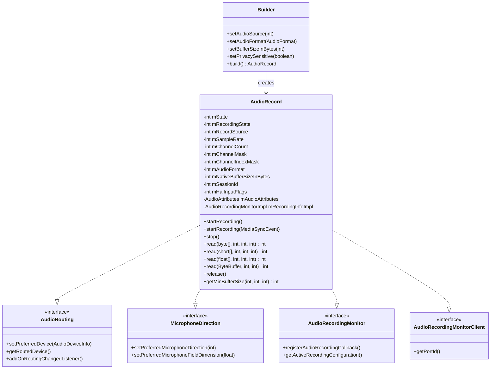
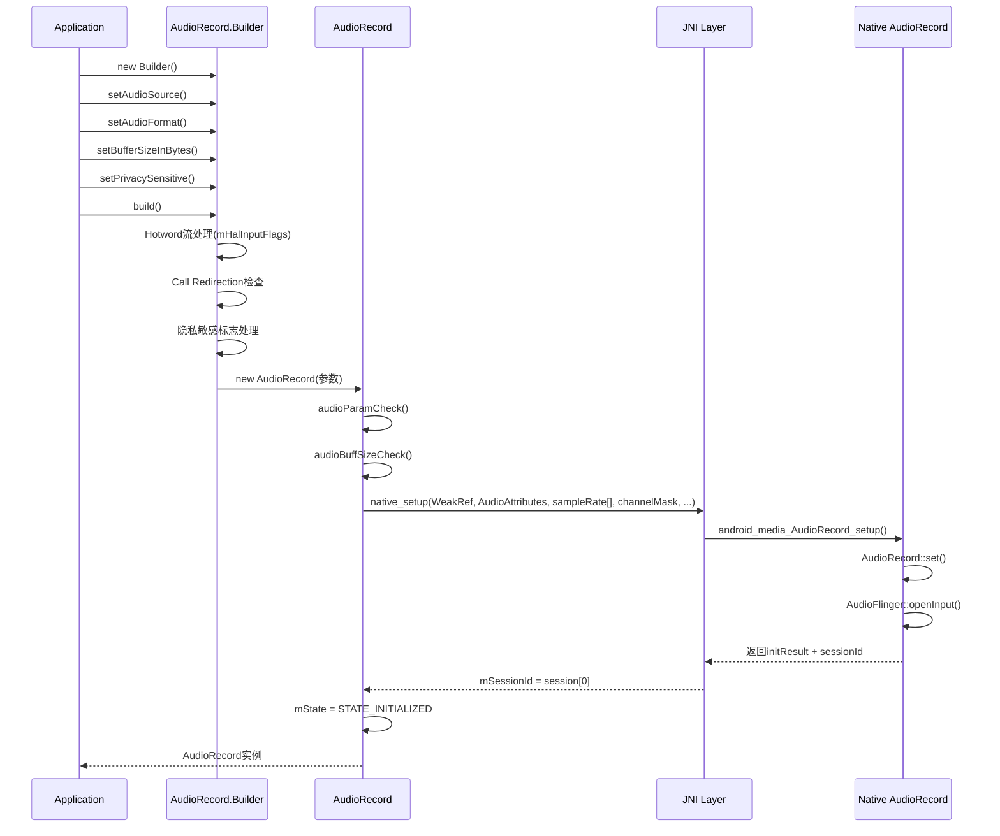
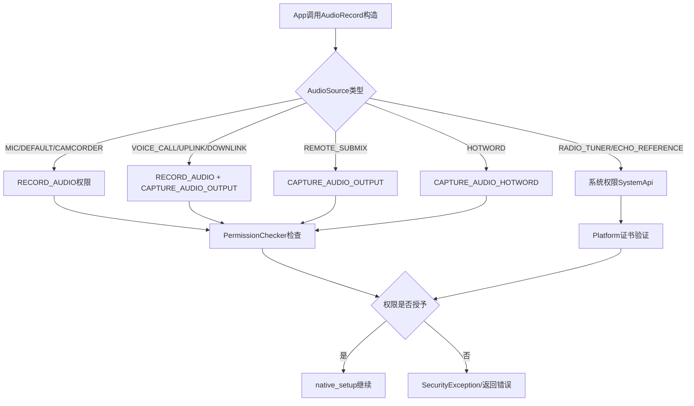
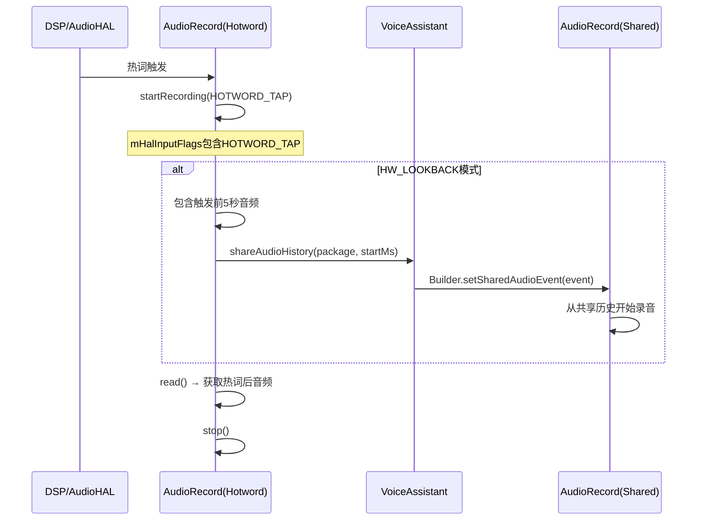
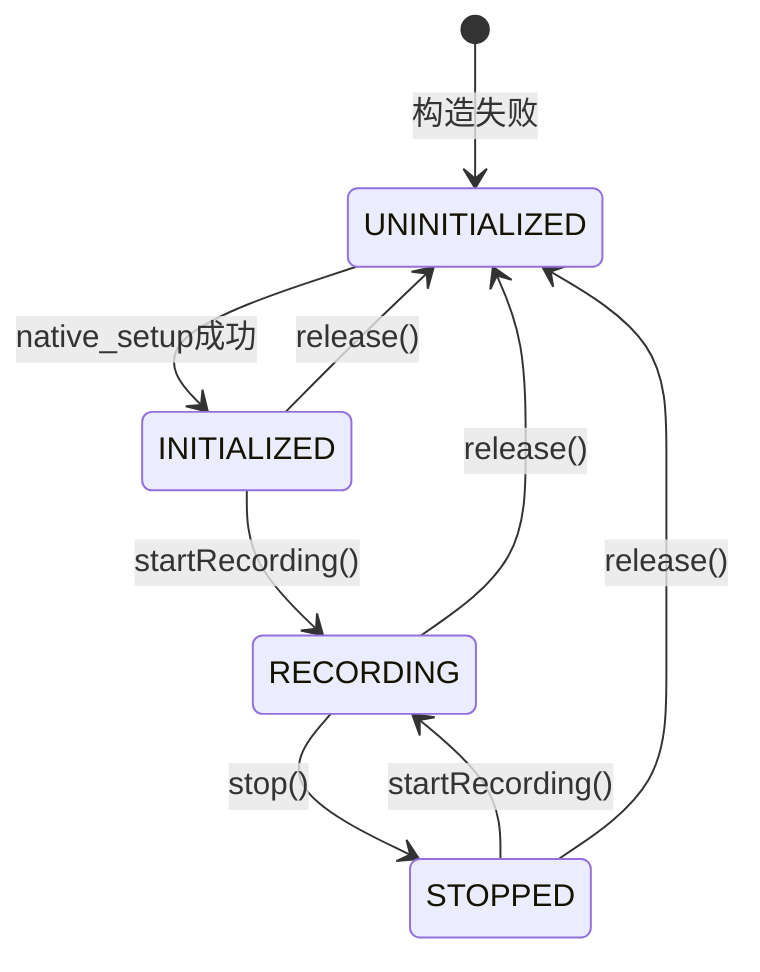
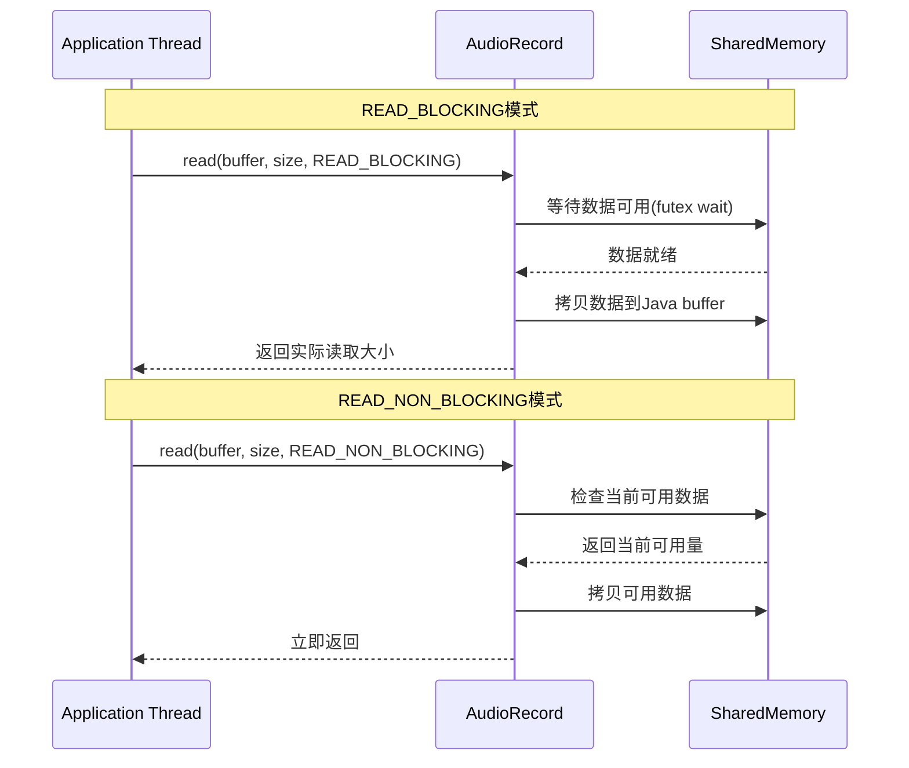
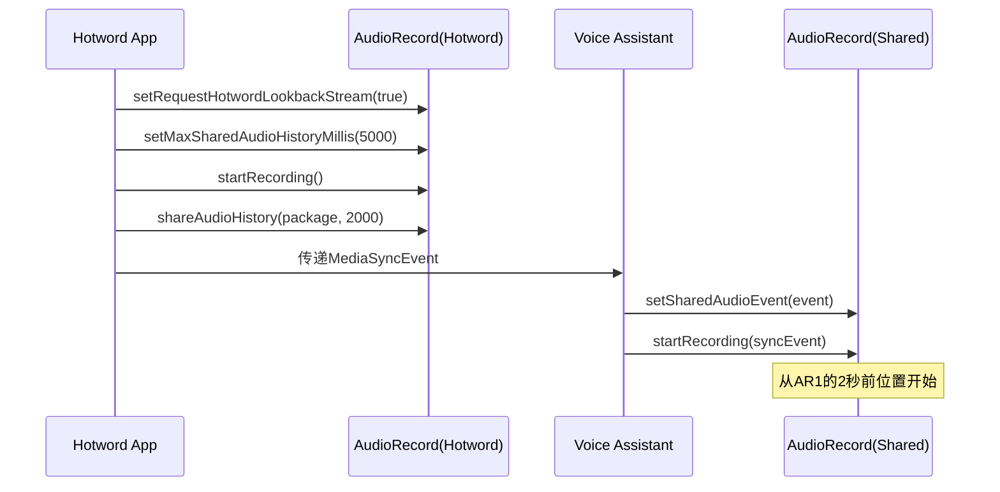
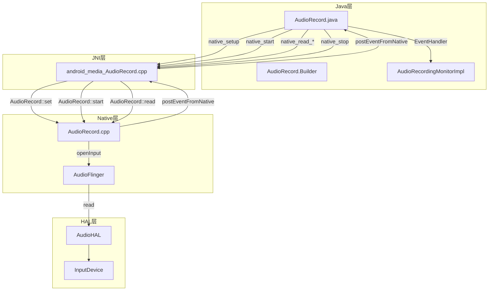

[← 上一个](02_2.1_AudioTrack.md) | [← 返回Application Layer](README.md) | [返回导航](../README.md) | [下一个 →](02_2.3_AudioManager.md)

## 2.2 AudioRecord — 应用层录音核心API源码解析

[`AudioRecord`](frameworks/base/media/java/android/media/AudioRecord.java) 是Android音频录音的核心类，管理从音频输入设备（麦克风、蓝牙SCO等）到应用层的PCM数据流传输。与AudioTrack的播放方向相反，AudioRecord实现从AudioFlinger共享内存中读取录音数据。

### 2.2.1 类定义与继承体系

```java
// AudioRecord.java:96-97
public class AudioRecord implements AudioRouting, MicrophoneDirection,
        AudioRecordingMonitor, AudioRecordingMonitorClient
```

**实现的接口**：
| 接口 | 职责 | 关键方法 |
|------|------|----------|
| [`AudioRouting`](frameworks/base/media/java/android/media/AudioRouting.java) | 设备路由控制 | `setPreferredDevice()`, `getRoutedDevice()`, `addOnRoutingChangedListener()` |
| [`MicrophoneDirection`](frameworks/base/media/java/android/media/MicrophoneDirection.java) | 麦克风方向/变焦 | `setPreferredMicrophoneDirection()`, `setPreferredMicrophoneFieldDimension()` |
| [`AudioRecordingMonitor`](frameworks/base/media/java/android/media/AudioRecordingMonitor.java) | 录音状态监控 | `registerAudioRecordingCallback()`, `getActiveRecordingConfiguration()` |
| [`AudioRecordingMonitorClient`](frameworks/base/media/java/android/media/AudioRecordingMonitor.java) | 监控客户端标识 | `getPortId()` |

**类关系图**：



### 2.2.2 状态常量与错误码

**初始化状态** ([`AudioRecord.java:107-110`](frameworks/base/media/java/android/media/AudioRecord.java:107))：

| 常量 | 值 | 说明 |
|------|----|------|
| `STATE_UNINITIALIZED` | 0 | 构造失败或已release |
| `STATE_INITIALIZED` | 1 | 构造成功，可使用 |

**录音状态** ([`AudioRecord.java:117-121`](frameworks/base/media/java/android/media/AudioRecord.java:117))：

| 常量 | 值 | 说明 |
|------|----|------|
| `RECORDSTATE_STOPPED` | 1 | 停止录音 |
| `RECORDSTATE_RECORDING` | 3 | 正在录音 |

> **注意**：与AudioTrack不同，AudioRecord没有PAUSED状态。stop()后只能重新startRecording()。

**Native初始化错误码** ([`AudioRecord.java:146-150`](frameworks/base/media/java/android/media/AudioRecord.java:146))：

| 错误码 | 值 | 含义 |
|--------|----|------|
| `ZEROFRAMECOUNT` | -16 | buffer帧数为0 |
| `INVALIDCHANNELMASK` | -17 | 通道掩码无效 |
| `INVALIDFORMAT` | -18 | 音频格式无效 |
| `INVALIDSOURCE` | -19 | 录音源无效 |
| `NATIVEINITFAILED` | -20 | Native层初始化失败 |

**读取模式** ([`AudioRecord.java:176-186`](frameworks/base/media/java/android/media/AudioRecord.java:176))：

| 常量 | 值 | 说明 |
|------|----|------|
| `READ_BLOCKING` | 0 | 阻塞读取，直到请求的数据量全部读取完成 |
| `READ_NON_BLOCKING` | 1 | 非阻塞读取，立即返回当前可用数据 |

### 2.2.3 核心成员变量

```java
// AudioRecord.java:214-295 关键成员变量
private int mSampleRate;                       // 采样率(Hz)
private int mChannelCount;                     // 通道数
private int mChannelMask;                      // 通道位置掩码
private int mChannelIndexMask;                 // 通道索引掩码
private int mAudioFormat;                      // 音频编码格式
private int mRecordSource;                     // 录音源(AudioSource)
private int mState = STATE_UNINITIALIZED;      // 初始化状态
private int mRecordingState = RECORDSTATE_STOPPED; // 录音状态
private int mNativeBufferSizeInBytes;          // Native buffer大小(字节)
private int mSessionId;                        // 音频会话ID
private int mHalInputFlags;                    // HAL输入标志位(HOTWORD_TAP/HW_LOOKBACK)
private AudioAttributes mAudioAttributes;      // 音频属性
private long mNativeAudioRecordHandle;         // Native AudioRecord指针
```

### 2.2.4 构造流程深度解析

AudioRecord提供两种构造方式：传统构造函数和Builder模式。

#### 传统构造函数

```java
// AudioRecord.java:396-491
public AudioRecord(int audioSource, int sampleRateInHz, int channelConfig,
        int audioFormat, int bufferSizeInBytes) throws IllegalArgumentException {
    // 1. 参数检查
    audioParamCheck(audioSource, sampleRateInHz, audioFormat);
    // 2. 通道掩码转换
    mChannelMask = getChannelMaskFromLegacyConfig(channelConfig, true);
    mChannelIndexMask = AudioFormat.CHANNEL_INVALID;
    mChannelCount = AudioFormat.channelCountFromInChannelMask(mChannelMask);
    // 3. buffer大小校验
    audioBuffSizeCheck(bufferSizeInBytes);
    // 4. 构建AudioAttributes(从audioSource)
    mAudioAttributes = (new AudioAttributes.Builder())
            .setInternalCapturePreset(audioSource).build();
    // 5. Native初始化
    int[] session = { AudioManager.AUDIO_SESSION_ID_GENERATE };
    int initResult = native_setup(..., session, attributionSourceState.getParcel(),
            0 /*nativeRecordInJavaObj*/, 0 /*maxSharedAudioHistoryMs*/,
            0 /*halInputFlags*/);
    if (initResult != SUCCESS) {
        loge("Error code " + initResult + " when initializing native AudioRecord.");
        return;
    }
    mSessionId = session[0];
    mState = STATE_INITIALIZED;
}
```

#### Builder模式

Builder模式是推荐的构造方式，支持更丰富的配置选项：

```java
// AudioRecord.java:969-1065 Builder.build()
public AudioRecord build() {
    // 1. Hotword流特殊处理
    if (mRequestHotwordStream) {
        mHalInputFlags |= 1 << AudioInputFlags.HOTWORD_TAP;
    }
    if (mRequestHotwordLookbackStream) {
        mHalInputFlags |= 1 << AudioInputFlags.HW_LOOKBACK;
    }
    // 2. Call Redirection处理
    if (mIsForCallRedirection) {
        return buildCallExtractionRecord();
    }
    // 3. 隐私敏感标志
    if (mPrivacySensitive != PRIVACY_SENSITIVITY_NOT_SET) {
        if (mPrivacySensitive == PRIVACY_SENSITIVE_SET) {
            mAudioAttributes = (new AudioAttributes.Builder(mAudioAttributes))
                    .setFlag(AudioAttributes.FLAG_CAPTURE_PRIVATE).build();
        } else {
            mAudioAttributes = (new AudioAttributes.Builder(mAudioAttributes))
                    .setFlag(AudioAttributes.FLAG_CAPTURE_PUBLIC).build();
        }
    }
    // 4. 构建AudioRecord实例
    return new AudioRecord(..., mMaxSharedAudioHistoryMs, mHalInputFlags, mSharedAudioEvent);
}
```

**构造流程时序图**：



### 2.2.5 录音源(AudioSource)体系与权限模型

AudioRecord的录音源定义在[`MediaRecorder.AudioSource`](frameworks/base/media/java/android/media/MediaRecorder.java)中，不同录音源对应不同的权限和优先级。

**录音源层级**（`audioParamCheck`校验逻辑，[`AudioRecord.java:1143`](frameworks/base/media/java/android/media/AudioRecord.java:1143)）：

| AudioSource | 值 | 权限 | 用途 |
|-------------|----|------|------|
| `DEFAULT` | 0 | RECORD_AUDIO | 默认录音源 |
| `MIC` | 1 | RECORD_AUDIO | 主麦克风 |
| `VOICE_UPLINK` | 2 | RECORD_AUDIO + CAPTURE_AUDIO_OUTPUT | 上行链路(运营商通话) |
| `VOICE_DOWNLINK` | 3 | RECORD_AUDIO + CAPTURE_AUDIO_OUTPUT | 下行链路 |
| `VOICE_CALL` | 4 | RECORD_AUDIO + CAPTURE_AUDIO_OUTPUT | 双向通话 |
| `CAMCORDER` | 5 | RECORD_AUDIO | 摄像时录音 |
| `VOICE_RECOGNITION` | 6 | RECORD_AUDIO | 语音识别(禁用NS/AEC) |
| `VOICE_COMMUNICATION` | 7 | RECORD_AUDIO | VoIP通信(启用AEC/NS) |
| `REMOTE_SUBMIX` | 8 | CAPTURE_AUDIO_OUTPUT | 系统混音(投屏) |
| `UNPROCESSED` | 9 | RECORD_AUDIO | 原始未处理音频 |
| `VOICE_PERFORMANCE` | | RECORD_AUDIO | 歌唱/表演 |
| `HOTWORD` | | CAPTURE_AUDIO_HOTWORD | 热词检测 |
| `RADIO_TUNER` | | 无 | FM/AM调谐器 |
| `ECHO_REFERENCE` | | 无 | 回声参考信号 |
| `ULTRASOUND` | | RECORD_AUDIO | 超声波 |

**权限校验流程**：



### 2.2.6 隐私敏感机制与Hotword流

AOSP14引入了录音隐私保护机制，通过[`Builder.setPrivacySensitive()`](frameworks/base/media/java/android/media/AudioRecord.java)控制。

**隐私标志实现**：

```java
// Builder.build()中的隐私处理逻辑
if (mPrivacySensitive == PRIVACY_SENSITIVE_SET) {
    // FLAG_CAPTURE_PRIVATE → 录音指示器显示
    mAudioAttributes = (new AudioAttributes.Builder(mAudioAttributes))
            .setFlag(AudioAttributes.FLAG_CAPTURE_PRIVATE).build();
} else {
    // FLAG_CAPTURE_PUBLIC → 隐藏录音指示器(仅系统应用)
    mAudioAttributes = (new AudioAttributes.Builder(mAudioAttributes))
            .setFlag(AudioAttributes.FLAG_CAPTURE_PUBLIC).build();
}
```

**判断方法** ([`AudioRecord.java:1456`](frameworks/base/media/java/android/media/AudioRecord.java:1456))：

```java
public boolean isPrivacySensitive() {
    return (mAudioAttributes.getAllFlags() & AudioAttributes.FLAG_CAPTURE_PRIVATE) != 0;
}
```

**Hotword流** — AOSP14语音助手热词检测机制：

| 标志 | HAL Input Flag | 说明 |
|------|----------------|------|
| `isHotwordStream()` | `HOTWORD_TAP` | DSP热词触发后的音频流 |
| `isHotwordLookbackStream()` | `HW_LOOKBACK` | 包含热词触发前回溯数据的流 |

```java
// AudioRecord.java:1469
public boolean isHotwordStream() {
    return ((mHalInputFlags & (1 << AudioInputFlags.HOTWORD_TAP)) != 0 &&
             (mHalInputFlags & (1 << AudioInputFlags.HW_LOOKBACK)) == 0);
}

// AudioRecord.java:1484
public boolean isHotwordLookbackStream() {
    return ((mHalInputFlags & (1 << AudioInputFlags.HW_LOOKBACK)) != 0);
}
```

**Hotword流生命周期**：



### 2.2.7 Call Redirection机制

Call Redirection允许将通话音频提取到应用层，通过AudioPolicy环路实现。

```java
// AudioRecord.java:838
private AudioRecord buildCallExtractionRecord() {
    // PSTN通话 → 直接从VOICE_CALL源提取
    // VoIP通话 → 通过AudioPolicy创建环路(reroute)
    AudioManager.registerAudioPolicyStatic(mAudioCapturePolicy);
}
```

### 2.2.8 参数校验流程

#### audioParamCheck ([`AudioRecord.java:1143`](frameworks/base/media/java/android/media/AudioRecord.java:1143))

三步校验：
1. **录音源校验**：范围`[DEFAULT, getAudioSourceMax()]` + 特殊源
2. **采样率校验**：范围`[4000Hz, 192000Hz]` 或 `SAMPLE_RATE_UNSPECIFIED`
3. **编码格式校验**：仅支持PCM格式

```java
if ((audioSource < MediaRecorder.AudioSource.DEFAULT)
        || ((audioSource > MediaRecorder.getAudioSourceMax())
            && (audioSource != MediaRecorder.AudioSource.RADIO_TUNER)
            && (audioSource != MediaRecorder.AudioSource.ECHO_REFERENCE)
            && (audioSource != MediaRecorder.AudioSource.HOTWORD)
            && (audioSource != MediaRecorder.AudioSource.ULTRASOUND))) {
    throw new IllegalArgumentException("Invalid audio source " + audioSource);
}
```

#### audioBuffSizeCheck ([`AudioRecord.java:1197`](frameworks/base/media/java/android/media/AudioRecord.java:1197))

```java
private void audioBuffSizeCheck(int audioBufferSize) {
    int frameSizeInBytes = mChannelCount * AudioFormat.getBytesPerSample(mAudioFormat);
    if ((audioBufferSize % frameSizeInBytes != 0) || (audioBufferSize < 1)) {
        throw new IllegalArgumentException("Invalid audio buffer size");
    }
    mNativeBufferSizeInBytes = audioBufferSize;
}
```

### 2.2.9 录音控制方法

#### startRecording() ([`AudioRecord.java:1496`](frameworks/base/media/java/android/media/AudioRecord.java:1496))

```java
public void startRecording() throws IllegalStateException {
    if (mState != STATE_INITIALIZED) {
        throw new IllegalStateException("startRecording() called on uninitialized AudioRecord.");
    }
    synchronized(mRecordingStateLock) {
        if (native_start(MediaSyncEvent.SYNC_EVENT_NONE, 0) == SUCCESS) {
            handleFullVolumeRec(true);
            mRecordingState = RECORDSTATE_RECORDING;
        }
    }
}
```

#### startRecording(MediaSyncEvent) — 同步启动

```java
// AudioRecord.java:1519
public void startRecording(MediaSyncEvent syncEvent) throws IllegalStateException {
    if (mState != STATE_INITIALIZED) throw new IllegalStateException();
    synchronized(mRecordingStateLock) {
        if (native_start(syncEvent.getType(), syncEvent.getAudioSessionId()) == SUCCESS) {
            handleFullVolumeRec(true);
            mRecordingState = RECORDSTATE_RECORDING;
        }
    }
}
```

**MediaSyncEvent同步类型**：
| 类型 | 说明 |
|------|------|
| `SYNC_EVENT_NONE` | 无同步，立即开始 |
| `SYNC_EVENT_PRESENTATION_COMPLETE` | 等待指定session播放完成 |
| `SYNC_EVENT_SHARE_AUDIO_HISTORY` | 共享音频历史同步启动 |

#### stop() ([`AudioRecord.java:1539`](frameworks/base/media/java/android/media/AudioRecord.java:1539))

```java
public void stop() throws IllegalStateException {
    if (mState != STATE_INITIALIZED) throw new IllegalStateException();
    synchronized(mRecordingStateLock) {
        handleFullVolumeRec(false);
        native_stop();
        mRecordingState = RECORDSTATE_STOPPED;
    }
}
```

**handleFullVolumeRec** — 远程子混音全音量处理 ([`AudioRecord.java:1554`](frameworks/base/media/java/android/media/AudioRecord.java:1554))：

```java
private void handleFullVolumeRec(boolean starting) {
    if (!mIsSubmixFullVolume) return;
    final IAudioService ias = IAudioService.Stub.asInterface(
            ServiceManager.getService(Context.AUDIO_SERVICE));
    ias.forceRemoteSubmixFullVolume(starting, mICallBack);
}
```

#### release() ([`AudioRecord.java:1217`](frameworks/base/media/java/android/media/AudioRecord.java:1217))

```java
public void release() {
    try { stop(); } catch(IllegalStateException ise) { }
    if (mAudioCapturePolicy != null) {
        AudioManager.unregisterAudioPolicyAsyncStatic(mAudioCapturePolicy);
        mAudioCapturePolicy = null;
    }
    native_release();
    mState = STATE_UNINITIALIZED;
}
```

**录音状态转换图**：



### 2.2.10 read方法族深度解析

AudioRecord提供4种read重载：

| 方法签名 | 数据类型 | 编码要求 | Native方法 |
|----------|----------|----------|------------|
| `read(byte[], int, int, int)` | byte[] | PCM_8BIT/16BIT | `native_read_in_byte_array` |
| `read(short[], int, int, int)` | short[] | PCM_16BIT | `native_read_in_short_array` |
| `read(float[], int, int, int)` | float[] | PCM_FLOAT | `native_read_in_float_array` |
| `read(ByteBuffer, int, int)` | ByteBuffer | 任意 | `native_read_in_direct_buffer` |

#### read(byte[]) ([`AudioRecord.java:1619`](frameworks/base/media/java/android/media/AudioRecord.java:1619))

```java
public int read(byte[] audioData, int offsetInBytes, int sizeInBytes, int readMode) {
    if (mState != STATE_INITIALIZED || mAudioFormat == AudioFormat.ENCODING_PCM_FLOAT) {
        return ERROR_INVALID_OPERATION;
    }
    if ((readMode != READ_BLOCKING) && (readMode != READ_NON_BLOCKING)) {
        return ERROR_BAD_VALUE;
    }
    if ((audioData == null) || (offsetInBytes < 0) || (sizeInBytes < 0)
            || (offsetInBytes + sizeInBytes < 0)
            || (offsetInBytes + sizeInBytes > audioData.length)) {
        return ERROR_BAD_VALUE;
    }
    return native_read_in_byte_array(audioData, offsetInBytes, sizeInBytes,
            readMode == READ_BLOCKING);
}
```

#### read(short[]) 特殊限制 ([`AudioRecord.java:1692`](frameworks/base/media/java/android/media/AudioRecord.java:1692))

```java
public int read(short[] audioData, int offsetInShorts, int sizeInShorts, int readMode) {
    if (mState != STATE_INITIALIZED
            || mAudioFormat == AudioFormat.ENCODING_PCM_FLOAT
            || mAudioFormat > AudioFormat.ENCODING_LEGACY_SHORT_ARRAY_THRESHOLD) {
        return ERROR_INVALID_OPERATION;
    }
    return native_read_in_short_array(audioData, offsetInShorts, sizeInShorts,
            readMode == READ_BLOCKING);
}
```

#### read(float[]) 严格格式匹配 ([`AudioRecord.java:1741`](frameworks/base/media/java/android/media/AudioRecord.java:1741))

```java
public int read(float[] audioData, int offsetInFloats, int sizeInFloats, int readMode) {
    if (mAudioFormat != AudioFormat.ENCODING_PCM_FLOAT) {
        return ERROR_INVALID_OPERATION;
    }
    return native_read_in_float_array(audioData, offsetInFloats, sizeInFloats,
            readMode == READ_BLOCKING);
}
```

#### read(ByteBuffer) DirectBuffer要求 ([`AudioRecord.java:1825`](frameworks/base/media/java/android/media/AudioRecord.java:1825))

```java
public int read(ByteBuffer audioBuffer, int sizeInBytes, int readMode) {
    if (mState != STATE_INITIALIZED) return ERROR_INVALID_OPERATION;
    return native_read_in_direct_buffer(audioBuffer, sizeInBytes, readMode == READ_BLOCKING);
}
```

**read方法返回值**：

| 返回值 | 含义 |
|--------|------|
| `> 0` | 成功读取的字节数/短整数/浮点数 |
| `0` | 无数据可用 |
| `ERROR_INVALID_OPERATION(-3)` | 未初始化或格式不匹配 |
| `ERROR_BAD_VALUE(-2)` | 参数错误 |
| `ERROR_DEAD_OBJECT(-6)` | Native对象已销毁，需重建 |
| `ERROR(-1)` | 其他错误 |

**READ_BLOCKING vs READ_NON_BLOCKING**：



### 2.2.11 Native方法签名完整列表

[`AudioRecord.java:2440`](frameworks/base/media/java/android/media/AudioRecord.java:2440)定义了全部Native方法：

```java
// 核心生命周期
private native int native_setup(Object audiorecordThis, Object attributes,
        int[] sampleRate, int channelMask, int channelIndexMask, int audioFormat,
        int buffSizeInBytes, int[] sessionId, Parcel attributionSource,
        long nativeRecordInJavaObj, int maxSharedAudioHistoryMs, int halInputFlags);
private native void native_finalize();
public native final void native_release();
private native final int native_start(int syncEvent, int sessionId);
private native final void native_stop();

// 数据读取(4种)
private native final int native_read_in_byte_array(byte[], int, int, boolean);
private native final int native_read_in_short_array(short[], int, int, boolean);
private native final int native_read_in_float_array(float[], int, int, boolean);
private native final int native_read_in_direct_buffer(Object, int, boolean);

// Buffer控制
private native final int native_get_buffer_size_in_frames();
private native final int native_set_marker_pos(int marker);
private native final int native_get_marker_pos();
private native final int native_set_pos_update_period(int updatePeriod);
private native final int native_get_pos_update_period();
static private native final int native_get_min_buff_size(int, int, int);

// 设备路由
private native final boolean native_setInputDevice(int deviceId);
private native final int native_getRoutedDeviceId();
private native final void native_enableDeviceCallback();
private native final void native_disableDeviceCallback();

// 时间戳与麦克风
private native final int native_get_timestamp(AudioTimestamp, int);
private native final int native_get_active_microphones(ArrayList<MicrophoneInfo>);
private native int native_getPortId();
private native int native_set_preferred_microphone_direction(int direction);
private native int native_set_preferred_microphone_field_dimension(float zoom);

// 其他
private native void native_setLogSessionId(String logSessionId);
private native int native_shareAudioHistory(String sharedPackage, long startFromMs);
private native PersistableBundle native_getMetrics();
```

### 2.2.12 回调机制

#### postEventFromNative ([`AudioRecord.java:2414`](frameworks/base/media/java/android/media/AudioRecord.java:2414))

```java
private static void postEventFromNative(Object audiorecord_ref,
        int what, int arg1, int arg2, Object obj) {
    AudioRecord recorder = (AudioRecord)((WeakReference)audiorecord_ref).get();
    if (recorder == null) return;
    if (what == AudioSystem.NATIVE_EVENT_ROUTING_CHANGE) {
        recorder.broadcastRoutingChange();
        return;
    }
    if (recorder.mEventHandler != null) {
        Message m = recorder.mEventHandler.obtainMessage(what, arg1, arg2, obj);
        recorder.mEventHandler.sendMessage(m);
    }
}
```

#### NativeEventHandler ([`AudioRecord.java:2376`](frameworks/base/media/java/android/media/AudioRecord.java:2376))

```java
private class NativeEventHandler extends Handler {
    public void handleMessage(Message msg) {
        OnRecordPositionUpdateListener listener;
        synchronized (mPositionListenerLock) {
            listener = mAudioRecord.mPositionListener;
        }
        switch (msg.what) {
        case NATIVE_EVENT_MARKER:
            if (listener != null) listener.onMarkerReached(mAudioRecord);
            break;
        case NATIVE_EVENT_NEW_POS:
            if (listener != null) listener.onPeriodicNotification(mAudioRecord);
            break;
        }
    }
}
```

**回调事件**：

| 事件 | 说明 | 触发条件 |
|------|------|----------|
| `NATIVE_EVENT_MARKER` | 标记位置到达 | 录音帧数到达设定值 |
| `NATIVE_EVENT_NEW_POS` | 周期通知 | 每前进指定帧数触发 |
| `NATIVE_EVENT_ROUTING_CHANGE` | 路由变更 | 输入设备切换 |

### 2.2.13 共享音频历史(Shared Audio History)

AOSP14的Hotword回溯共享机制，最大5秒回溯([`AudioRecord.java:1932`](frameworks/base/media/java/android/media/AudioRecord.java:1932))：

```java
private static final long MAX_SHARED_AUDIO_HISTORY_MS = 5000;
```

**shareAudioHistory** ([`AudioRecord.java:1973`](frameworks/base/media/java/android/media/AudioRecord.java:1973))：

```java
@SystemApi
@RequiresPermission(android.Manifest.permission.CAPTURE_AUDIO_HOTWORD)
public MediaSyncEvent shareAudioHistory(String sharedPackage, long startFromMillis) {
    int status = native_shareAudioHistory(sharedPackage, startFromMillis);
    if (status == AudioSystem.BAD_VALUE) throw new IllegalArgumentException();
    if (status == AudioSystem.PERMISSION_DENIED) throw new SecurityException();
    MediaSyncEvent event = MediaSyncEvent.createEvent(
            MediaSyncEvent.SYNC_EVENT_SHARE_AUDIO_HISTORY);
    event.setAudioSessionId(mSessionId);
    return event;
}
```



### 2.2.14 getMinBufferSize与Buffer计算

[`AudioRecord.java:1409`](frameworks/base/media/java/android/media/AudioRecord.java:1409)

```java
static public int getMinBufferSize(int sampleRateInHz, int channelConfig, int audioFormat) {
    int channelCount;
    switch (channelConfig) {
    case CHANNEL_IN_MONO: channelCount = 1; break;
    case CHANNEL_IN_STEREO: channelCount = 2; break;
    default: return ERROR_BAD_VALUE;
    }
    int size = native_get_min_buff_size(sampleRateInHz, channelCount, audioFormat);
    if (size == 0) return ERROR_BAD_VALUE;
    else if (size == -1) return ERROR;
    else return size;
}
```

**Buffer大小计算逻辑** (Native层)：

```
minBufferSize = max(sampleRate * channelCount * bytesPerSample * bufferDuration, 
                    AudioFlinger最小buffer要求)
```

典型值参考：

| 采样率 | 通道 | 格式 | 最小Buffer(bytes) |
|--------|------|------|-------------------|
| 16000 | MONO | PCM_16BIT | 6400 |
| 44100 | MONO | PCM_16BIT | 17640 |
| 44100 | STEREO | PCM_16BIT | 35280 |
| 48000 | MONO | PCM_16BIT | 19200 |
| 48000 | STEREO | PCM_16BIT | 38400 |

### 2.2.15 录音监控(AudioRecordingMonitor)

通过[`AudioRecordingMonitorImpl`](frameworks/base/media/java/android/media/AudioRecordingMonitorImpl.java)实现：

```java
// AudioRecord.java:2233
AudioRecordingMonitorImpl mRecordingInfoImpl =
        new AudioRecordingMonitorImpl((AudioRecordingMonitorClient) this);
```

| 方法 | 说明 |
|------|------|
| `registerAudioRecordingCallback(Executor, AudioRecordingCallback)` | 注册录音配置变更回调 |
| `unregisterAudioRecordingCallback(AudioRecordingCallback)` | 注销回调 |
| `getActiveRecordingConfiguration()` | 获取当前活跃录音配置 |

**AudioRecordingCallback回调**：
- `onRecordingConfigChanged(List<AudioRecordingConfiguration>)` — 录音配置变更通知
- 包含信息：clientUid、session、audioSource、audioFormat、routingDevice等

### 2.2.16 设备路由与麦克风信息

```java
// AudioRecord.java:2160
public boolean setPreferredDevice(AudioDeviceInfo deviceInfo) {
    if (deviceInfo != null && !deviceInfo.isSource()) return false;
    boolean status = native_setInputDevice(preferredDeviceId);
    if (status) { mPreferredDevice = deviceInfo; }
    return status;
}
```

**getActiveMicrophones** ([`AudioRecord.java:2202`](frameworks/base/media/java/android/media/AudioRecord.java:2202))：

```java
public List<MicrophoneInfo> getActiveMicrophones() throws IOException {
    ArrayList<MicrophoneInfo> activeMicrophones = new ArrayList<>();
    int status = native_get_active_microphones(activeMicrophones);
    if (activeMicrophones.size() == 0) {
        AudioDeviceInfo device = getRoutedDevice();
        // HAL返回失败时fallback到routed device
        if (device != null) {
            MicrophoneInfo mic = AudioManager.microphoneInfoFromAudioDeviceInfo(device);
            for (int i = 0; i < mChannelCount; i++) {
                channelMapping.add(new Pair(i, MicrophoneInfo.CHANNEL_MAPPING_DIRECT));
            }
            activeMicrophones.add(mic);
        }
    }
    return activeMicrophones;
}
```

**麦克风方向与聚焦控制**：

```java
// AudioRecord.java:2295
public int setPreferredMicrophoneDirection(int direction) {
    return native_set_preferred_microphone_direction(direction);
}

// AudioRecord.java:2312
public int setPreferredMicrophoneFieldDimension(float zoom) {
    return native_set_preferred_microphone_field_dimension(zoom);
}
```

### 2.2.17 Metrics常量

[`AudioRecord.java:2538`](frameworks/base/media/java/android/media/AudioRecord.java:2538)：

| 常量 | 值 | 类型 | 说明 |
|------|----|------|------|
| `ENCODING` | `android.media.audiorecord.encoding` | String | 音频编码格式 |
| `SOURCE` | `android.media.audiorecord.source` | String | 录音源类型 |
| `LATENCY` | `android.media.audiorecord.latency` | int | 估算延迟(ms) |
| `SAMPLERATE` | `android.media.audiorecord.samplerate` | int | 采样率 |
| `CHANNELS` | `android.media.audiorecord.channels` | int | 通道数 |
| `PORT_ID` | `android.media.audiorecord.portId` | int | AudioFlinger端口ID |
| `FRAME_COUNT` | `android.media.audiorecord.frameCount` | int | 缓冲区帧数 |

### 2.2.18 四层架构总览



### 2.2.19 与AudioTrack对比

| 特性 | AudioRecord | AudioTrack |
|------|-------------|------------|
| 方向 | 输入(录音) | 输出(播放) |
| 核心方法 | `read()` | `write()` |
| 数据流 | SharedMemory→App | App→SharedMemory |
| 状态 | INITIALIZED/UNINITIALIZED | INITIALIZED/NO_STATIC_DATA/UNINITIALIZED |
| 录/播状态 | STOPPED/RECORDING | STOPPED/PAUSED/PLAYING |
| 暂停支持 | 无(只有stop) | 有(pause/resume) |
| 静态模式 | 无(只有流模式) | MODE_STATIC/MODE_STREAM |
| 隐私敏感 | 有(FLAG_CAPTURE_PRIVATE) | 无 |
| Hotword流 | 有(HOTWORD_TAP/HW_LOOKBACK) | 无 |
| Offload | 无 | 有(压缩格式卸载) |
| 同步机制 | futex(读端等待) | futex(写端等待) |