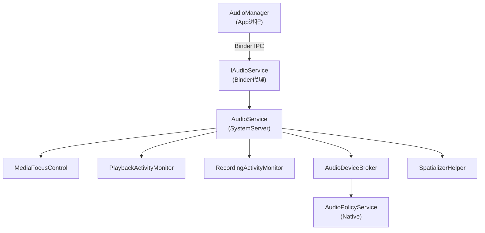
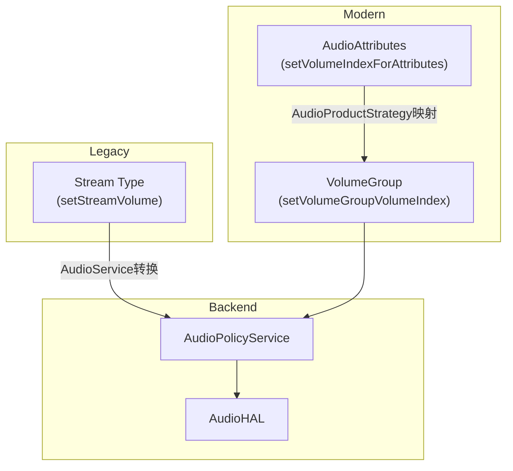
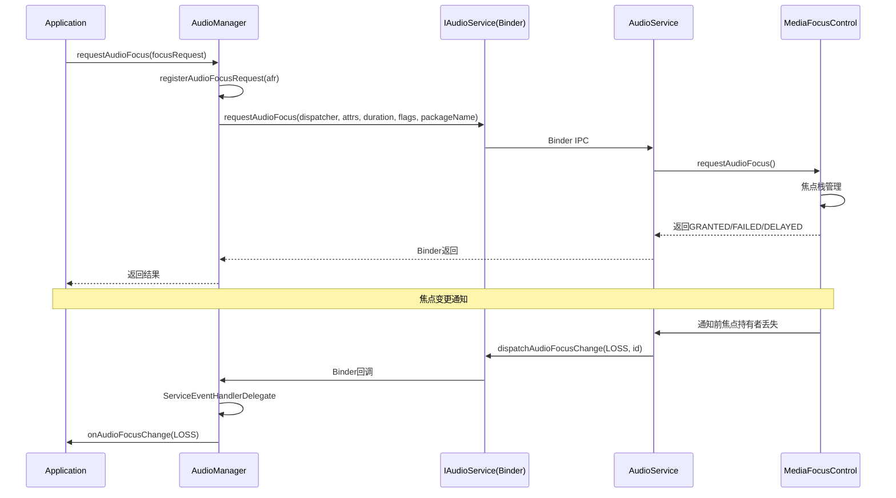

[← 2.2 AudioRecord — 录音](02_2.2_AudioRecord.md) | [← 返回Application Layer — 应用层API深度解析](README.md) | [返回导航](../README.md) | [2.4 AudioFocusRequest →](02_2.4_AudioFocusRequest.md)

---

## 2.3 AudioManager — 音频管理中枢

### 模块职责

[`AudioManager`](frameworks/base/media/java/android/media/AudioManager.java)是应用层访问音频系统服务的统一入口，封装了音量控制、设备管理、焦点请求、铃声模式、音频模式等所有音频策略操作。通过Binder IPC与SystemServer中的AudioService通信。

**类定义** ([`AudioManager.java:106`](frameworks/base/media/java/android/media/AudioManager.java:106))：

```java
@SystemService(Context.AUDIO_SERVICE)
public class AudioManager {
```

### 2.3.1 服务连接机制

```java
// AudioManager.java:925
static IAudioService getService() {
    if (sService != null) return sService;
    IBinder b = ServiceManager.getService(Context.AUDIO_SERVICE);
    sService = IAudioService.Stub.asInterface(b);
    return sService;
}
```

**架构关系**：



### 2.3.2 音频流类型(Stream Type)体系

AudioManager定义了11种音频流类型，映射到AudioSystem常量：

| 常量 | 值 | 用途 | 公开API |
|------|----|------|---------|
| `STREAM_VOICE_CALL` | 0 | 电话通话 | 是 |
| `STREAM_SYSTEM` | 1 | 系统声音 | 是 |
| `STREAM_RING` | 2 | 来电铃声 | 是 |
| `STREAM_MUSIC` | 3 | 音乐播放 | 是 |
| `STREAM_ALARM` | 4 | 闹钟 | 是 |
| `STREAM_NOTIFICATION` | 5 | 通知 | 是 |
| `STREAM_BLUETOOTH_SCO` | 6 | 蓝牙SCO通话 | @SystemApi |
| `STREAM_SYSTEM_ENFORCED` | 7 | 强制系统音(如日本快门声) | @hide |
| `STREAM_DTMF` | 8 | DTMF音调 | 是 |
| `STREAM_TTS` | 9 | TTS语音 | @hide |
| `STREAM_ACCESSIBILITY` | 10 | 无障碍提示 | 是 |
| `STREAM_ASSISTANT` | 11 | 虚拟助手 | @SystemApi |

**公开流类型列表** ([`AudioManager.java:423`](frameworks/base/media/java/android/media/AudioManager.java:423))：

```java
private static final int[] PUBLIC_STREAM_TYPES = {
    AudioManager.STREAM_VOICE_CALL, AudioManager.STREAM_SYSTEM,
    AudioManager.STREAM_RING, AudioManager.STREAM_MUSIC,
    AudioManager.STREAM_ALARM, AudioManager.STREAM_NOTIFICATION,
    AudioManager.STREAM_DTMF, AudioManager.STREAM_ACCESSIBILITY };
```

### 2.3.3 音量调节常量与标志

#### 调节方向

| 常量 | 值 | 说明 |
|------|----|------|
| `ADJUST_RAISE` | 1 | 增大音量 |
| `ADJUST_LOWER` | -1 | 减小音量 |
| `ADJUST_SAME` | 0 | 保持不变(仅显示UI) |
| `ADJUST_MUTE` | -100 | 静音 |
| `ADJUST_UNMUTE` | 100 | 取消静音 |
| `ADJUST_TOGGLE_MUTE` | 101 | 切换静音 |

#### Volume Flags

| 标志 | 值 | 可见性 | 说明 |
|------|----|--------|------|
| `FLAG_SHOW_UI` | 1<<0 | Public | 显示音量Toast |
| `FLAG_ALLOW_RINGER_MODES` | 1<<1 | Public | 允许切换静音/振动模式 |
| `FLAG_PLAY_SOUND` | 1<<2 | Public | 调节时播放提示音 |
| `FLAG_REMOVE_SOUND_AND_VIBRATE` | 1<<3 | Public | 移除队列中的提示音 |
| `FLAG_VIBRATE` | 1<<4 | Public | 振动提示 |
| `FLAG_FIXED_VOLUME` | 1<<5 | @hide | 固定音量(禁用滑块) |
| `FLAG_BLUETOOTH_ABS_VOLUME` | 1<<6 | @SystemApi | 蓝牙绝对音量 |
| `FLAG_SHOW_SILENT_HINT` | 1<<7 | @hide | 静音提示 |
| `FLAG_HDMI_SYSTEM_AUDIO_VOLUME` | 1<<8 | @hide | HDMI CEC音量 |
| `FLAG_ACTIVE_MEDIA_ONLY` | 1<<9 | @hide | 仅在有活跃媒体时生效 |
| `FLAG_FROM_KEY` | 1<<12 | @SystemApi | 来自硬件按键 |

### 2.3.4 音量控制方法

#### setStreamVolume ([`AudioManager.java:1396`](frameworks/base/media/java/android/media/AudioManager.java:1396))

```java
public void setStreamVolume(int streamType, int index, @PublicVolumeFlags int flags) {
    final IAudioService service = getService();
    try {
        service.setStreamVolume(streamType, index, flag, mContext.getOpPackageName());
    } catch (RemoteException e) {
        throw e.rethrowFromSystemServer();
    }
}
```

#### adjustStreamVolume ([`AudioManager.java:1041`](frameworks/base/media/java/android/media/AudioManager.java:1041))

```java
public void adjustStreamVolume(int streamType, int direction, @PublicVolumeFlags int flags) {
    final IAudioService service = getService();
    try {
        service.adjustStreamVolume(streamType, direction, flags,
                mContext.getOpPackageName(),
                AudioSystem.getModeForContext(getContext()));
    } catch (RemoteException e) {
        throw e.rethrowFromSystemServer();
    }
}
```

#### 基于AudioAttributes的音量控制

```java
// AudioManager.java:1420
public void setVolumeIndexForAttributes(@NonNull AudioAttributes attr, int index, int flags)

// AudioManager.java:1441
public int getVolumeIndexForAttributes(@NonNull AudioAttributes attr)

// AudioManager.java:1459
public int getMaxVolumeIndexForAttributes(@NonNull AudioAttributes attr)

// AudioManager.java:1477
public int getMinVolumeIndexForAttributes(@NonNull AudioAttributes attr)
```

#### 基于VolumeGroup的音量控制

```java
// AudioManager.java:1515
public void setVolumeGroupVolumeIndex(int groupId, int index, int flags)

// AudioManager.java:1540
public int getVolumeGroupVolumeIndex(int groupId)

// AudioManager.java:1564
public int getVolumeGroupMaxVolumeIndex(int groupId)

// AudioManager.java:1588
public int getVolumeGroupMinVolumeIndex(int groupId)
```

**音量控制三层体系**：



### 2.3.5 铃声模式(Ringer Mode)

| 常量 | 值 | 说明 |
|------|----|------|
| `RINGER_MODE_SILENT` | 0 | 静音 |
| `RINGER_MODE_VIBRATE` | 1 | 振动 |
| `RINGER_MODE_NORMAL` | 2 | 正常 |

```java
// AudioManager.java:1129
public int getRingerMode() {
    return service.getRingerModeExternal();
}

// AudioManager.java:1367
public void setRingerMode(int ringerMode) {
    service.setRingerMode(ringerMode);
}
```

**注意**：AudioService内部区分`RingerModeInternal`(系统真实状态)和`RingerModeExternal`(App可见状态)。Do Not Disturb模式下internal可能为SILENT，但external为NORMAL。

### 2.3.6 音频模式(Audio Mode)

Audio Mode影响全局音频路由和HAL行为：

| 常量 | 值 | 说明 |
|------|----|------|
| `MODE_NORMAL` | 0 | 正常模式 |
| `MODE_RINGTONE` | 1 | 来电振铃 |
| `MODE_IN_CALL` | 2 | 运营商通话中 |
| `MODE_IN_COMMUNICATION` | 3 | VoIP/视频通话中 |
| `MODE_CALL_SCREENING` | 4 | 来电筛选(Android 10+) |
| `MODE_CALL_REDIRECT` | 5 | PSTN通话重定向(Android 13+) |
| `MODE_COMMUNICATION_REDIRECT` | 6 | VoIP通话重定向(Android 13+) |

```java
// AudioManager.java:3311
public void setMode(@AudioMode int mode) {
    service.setMode(mode, mICallBack, mApplicationContext.getOpPackageName());
}

// AudioManager.java:3334 — 兼容性处理
public int getMode() {
    int mode = service.getMode();
    // MODE_CALL_SCREENING → MODE_IN_CALL (targetSdk <= Q)
    // MODE_CALL_REDIRECT → MODE_IN_CALL (未启用CALL_REDIRECTION_AUDIO_MODES)
    // MODE_COMMUNICATION_REDIRECT → MODE_IN_COMMUNICATION (同上)
    return mode;
}
```

**Mode变更回调** ([`AudioManager.java:3363`](frameworks/base/media/java/android/media/AudioManager.java:3363))：

```java
public interface OnModeChangedListener {
    void onModeChanged(@AudioMode int mode);
}

// 注册/注销
public void addOnModeChangedListener(Executor executor, OnModeChangedListener listener)
public void removeOnModeChangedListener(OnModeChangedListener listener)
```

### 2.3.7 音频焦点(Audio Focus)

#### 焦点请求类型

| 常量 | 值 | 方向 | 说明 |
|------|----|------|------|
| `AUDIOFOCUS_GAIN` | 1 | 请求/获得 | 长期获取(音乐播放) |
| `AUDIOFOCUS_GAIN_TRANSIENT` | 2 | 请求/获得 | 短暂获取(导航提示) |
| `AUDIOFOCUS_GAIN_TRANSIENT_MAY_DUCK` | 3 | 请求/获得 | 短暂获取允许压低(通知) |
| `AUDIOFOCUS_GAIN_TRANSIENT_EXCLUSIVE` | 4 | 请求/获得 | 独占获取(语音识别) |
| `AUDIOFOCUS_LOSS` | -1 | 丢失 | 永久丢失 |
| `AUDIOFOCUS_LOSS_TRANSIENT` | -2 | 丢失 | 暂时丢失 |
| `AUDIOFOCUS_LOSS_TRANSIENT_CAN_DUCK` | -3 | 丢失 | 可压低继续播放 |

#### 焦点请求结果

| 常量 | 值 | 说明 |
|------|----|------|
| `AUDIOFOCUS_REQUEST_FAILED` | 0 | 请求失败 |
| `AUDIOFOCUS_REQUEST_GRANTED` | 1 | 请求成功 |
| `AUDIOFOCUS_REQUEST_DELAYED` | 2 | 延迟授予 |

#### requestAudioFocus重载

```java
// 1. 已弃用的旧API
public int requestAudioFocus(OnAudioFocusChangeListener l, int streamType, int durationHint)

// 2. 推荐的新API (Android 8.0+)
public int requestAudioFocus(@NonNull AudioFocusRequest focusRequest)

// 3. 系统API(带AudioAttributes)
public int requestAudioFocus(OnAudioFocusChangeListener l, AudioAttributes attr,
        int durationHint, int flags)

// 4. AudioPolicy持有者的API
public int requestAudioFocus(OnAudioFocusChangeListener l, AudioAttributes attr,
        int durationHint, int flags, AudioPolicy policy)
```

#### 焦点回调分发

```java
// AudioManager.java:4302 — Binder回调
private final IAudioFocusDispatcher mAudioFocusDispatcher = new IAudioFocusDispatcher.Stub() {
    @Override
    public void dispatchAudioFocusChange(int focusChange, String id) {
        final FocusRequestInfo fri = findFocusRequestInfo(id);
        if (fri != null) {
            final Handler h = (fri.mHandler == null) ?
                    mServiceEventHandlerDelegate.getHandler() : fri.mHandler;
            h.sendMessage(h.obtainMessage(MSSG_FOCUS_CHANGE, focusChange, 0, id));
        }
    }
};
```

**焦点请求时序**：



### 2.3.8 播放/录音配置监控

```java
// 播放配置监控
public void registerAudioPlaybackCallback(AudioPlaybackCallback cb, Executor executor)
public void unregisterAudioPlaybackCallback(AudioPlaybackCallback cb)
public List<AudioPlaybackConfiguration> getActivePlaybackConfigurations()

// 录音配置监控
public void registerAudioRecordingCallback(AudioRecordingCallback cb, Executor executor)
public void unregisterAudioRecordingCallback(AudioRecordingCallback cb)
public List<AudioRecordingConfiguration> getActiveRecordingConfigurations()
```

**回调事件分发** ([`AudioManager.java:4256`](frameworks/base/media/java/android/media/AudioManager.java:4256))：

```java
case MSSG_PLAYBACK_CONFIG_CHANGE: {
    final PlaybackConfigChangeCallbackData cbData = (PlaybackConfigChangeCallbackData) msg.obj;
    cbData.mCb.onPlaybackConfigChanged(cbData.mConfigs);
} break;
case MSSG_RECORDING_CONFIG_CHANGE: {
    final RecordConfigChangeCallbackData cbData = (RecordConfigChangeCallbackData) msg.obj;
    cbData.mCb.onRecordingConfigChanged(cbData.mConfigs);
} break;
```

### 2.3.9 设备路由与策略偏好

```java
// 基于AudioProductStrategy的设备偏好
public boolean setPreferredDeviceForStrategy(AudioProductStrategy strategy, AudioDeviceAttributes dev)
public boolean removePreferredDeviceForStrategy(AudioProductStrategy strategy)
public AudioDeviceAttributes getPreferredDeviceForStrategy(AudioProductStrategy strategy)

// 多设备偏好(Android 13+)
public boolean setPreferredDevicesForStrategy(AudioProductStrategy strategy, List<AudioDeviceAttributes> devs)
public List<AudioDeviceAttributes> getPreferredDevicesForStrategy(AudioProductStrategy strategy)

// 录音源设备偏好
public boolean setPreferredDeviceForCapturePreset(int capturePreset, AudioDeviceAttributes dev)
public List<AudioDeviceAttributes> getPreferredDevicesForCapturePreset(int capturePreset)
```

### 2.3.10 蓝牙音频控制

```java
// SCO通话
public void startBluetoothSco()
public void stopBluetoothSco()

// A2DP
public boolean isBluetoothA2dpOn()

// SCO状态广播
ACTION_SCO_AUDIO_STATE_CHANGED  // 已弃用
ACTION_SCO_AUDIO_STATE_UPDATED  // 推荐
```

### 2.3.11 空间音频(Spatializer)

```java
// AudioManager.java:2930
public @NonNull Spatializer getSpatializer() {
    return new Spatializer(this);
}
```

Spatializer提供沉浸式音频控制，包括：
- `getImmersiveAudioLevel()` — 检查空间音频支持级别
- `setEnabled(boolean)` — 启用/禁用空间音频
- `setGlobalTransform()` — 设置全局空间变换
- Head Tracking支持

### 2.3.12 Broadcast Intent汇总

| Intent | 说明 |
|--------|------|
| `ACTION_AUDIO_BECOMING_NOISY` | 音频即将变噪(耳机断开) |
| `RINGER_MODE_CHANGED_ACTION` | 铃声模式变更 |
| `VOLUME_CHANGED_ACTION` | 音量变更(@hide) |
| `STREAM_DEVICES_CHANGED_ACTION` | 流设备变更(@hide) |
| `STREAM_MUTE_CHANGED_ACTION` | 流静音变更(@hide) |
| `ACTION_HEADSET_PLUG` | 有线耳机插拔 |
| `ACTION_HDMI_AUDIO_PLUG` | HDMI音频插拔 |
| `ACTION_SCO_AUDIO_STATE_UPDATED` | 蓝牙SCO状态更新 |

### 2.3.13 版本演进关键变更

| 版本 | 关键API变更 | 影响 |
|------|-------------|------|
| Android 5.0 | AudioAttributes替代stream type | 焦点/路由决策更精细 |
| Android 8.0 | AudioFocusRequest.Builder | 焦点请求更安全 |
| Android 9.0 | AudioPlaybackConfiguration/RecordingConfiguration | 隐私管控 |
| Android 10 | MODE_CALL_SCREENING | 来电筛选模式 |
| Android 11 | AudioProductStrategy API | 路由策略可查询 |
| Android 12 | Spatializer API | 空间音频控制 |
| Android 13 | MODE_CALL_REDIRECT / MODE_COMMUNICATION_REDIRECT | 通话音频重定向 |
| Android 13 | VolumeInfo API | 更精细的音量查询 |
| Android 14 | SoundDose API | CSD听力保护 |

---

[← 2.2 AudioRecord — 录音](02_2.2_AudioRecord.md) | [← 返回Application Layer — 应用层API深度解析](README.md) | [返回导航](../README.md) | [2.4 AudioFocusRequest →](02_2.4_AudioFocusRequest.md)