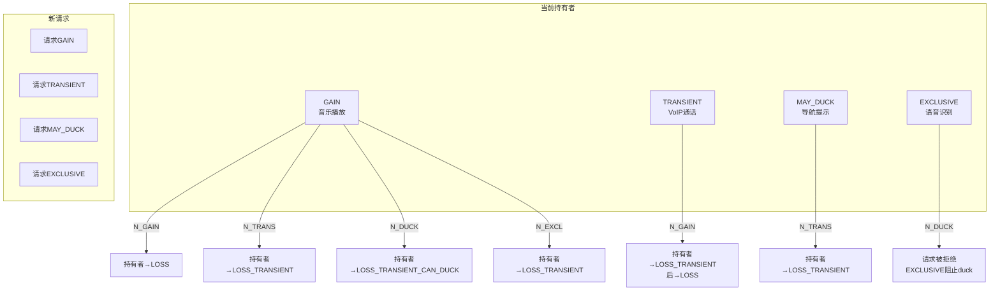
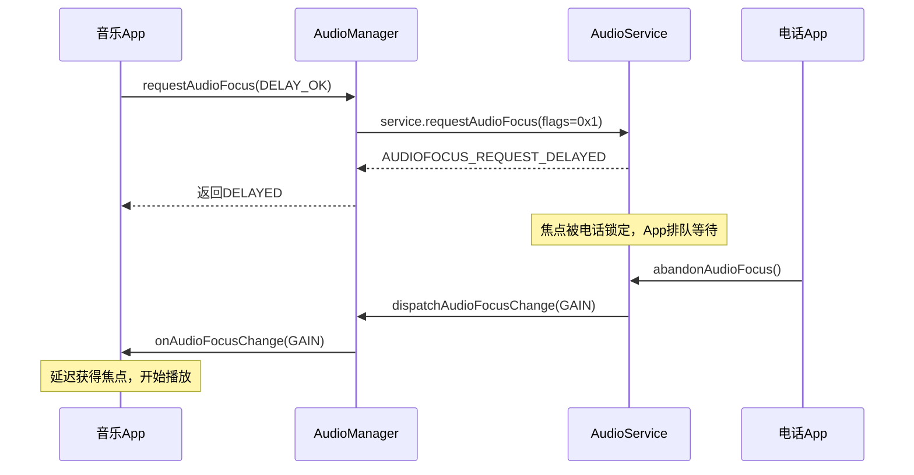
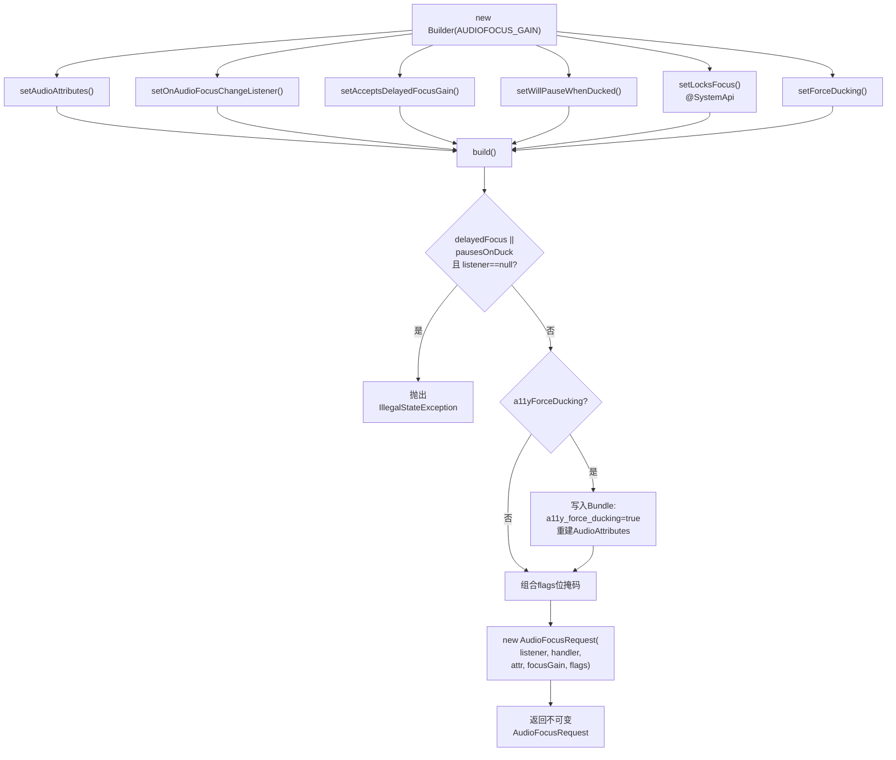
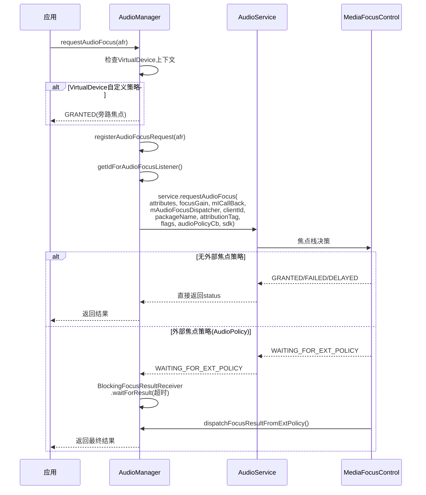

[← 2.3 AudioManager](02_2.3_AudioManager.md) | [← 返回Application Layer](README.md) | [返回导航](../README.md) | [2.5 AAudio →](02_2.5_AAudio.md)

---

## 2.4 AudioFocusRequest — 音频焦点请求模型

### 模块职责

[`AudioFocusRequest`](frameworks/base/media/java/android/media/AudioFocusRequest.java) 是Android O(API 26)引入的不可变焦点请求封装类，替代了旧式`requestAudioFocus(OnAudioFocusChangeListener, int, int)` API。通过Builder模式构建，封装焦点类型、音频属性、焦点变化监听器、延迟焦点与ducking行为标志，作为[`AudioManager.requestAudioFocus()`](frameworks/base/media/java/android/media/AudioManager.java:4518)的唯一推荐入参。

**核心设计原则**：不可变性(immutable) — 构建后所有字段final，确保焦点请求在注册→授予→丢失→恢复全生命周期中语义不变。

### 2.4.1 类定义与核心成员

```java
// AudioFocusRequest.java:219
public final class AudioFocusRequest {
    // 默认AudioAttributes：USAGE_MEDIA
    private final static AudioAttributes FOCUS_DEFAULT_ATTR = new AudioAttributes.Builder()
            .setUsage(AudioAttributes.USAGE_MEDIA).build();          // L222-223

    // 无障碍强制ducking Bundle键
    public static final String KEY_ACCESSIBILITY_FORCE_FOCUS_DUCKING = "a11y_force_ducking"; // L226

    private final @Nullable OnAudioFocusChangeListener mFocusListener;  // L228
    private final @Nullable Handler mListenerHandler;                    // L229
    private final @NonNull AudioAttributes mAttr;                       // L230
    private final int mFocusGain;                                        // L231
    private final int mFlags;                                            // L232 (位掩码)

    // 私有构造，仅Builder可调用
    private AudioFocusRequest(OnAudioFocusChangeListener listener, Handler handler,
            AudioAttributes attr, int focusGain, int flags) { ... }     // L234-241
}
```

**关键设计**：
- `mFlags`是位掩码，由Builder在[`build()`](frameworks/base/media/java/android/media/AudioFocusRequest.java:560)中组合3个boolean字段生成
- `mFocusListener`允许为null（当不使用延迟焦点/ducking暂停时），但推荐始终设置

### 2.4.2 焦点类型体系

[`isValidFocusGain()`](frameworks/base/media/java/android/media/AudioFocusRequest.java:249)定义了4种合法焦点请求类型：

| 焦点类型 | 值 | 持续性 | 典型场景 | 对当前持有者影响 |
|----------|-----|--------|----------|-----------------|
| `AUDIOFOCUS_GAIN` | 1 | 永久 | 音乐/游戏/视频 | 其他GAIN→LOSS |
| `GAIN_TRANSIENT` | 2 | 暂时(有限时长) | 闹钟/VoIP通话 | GAIN→LOSS_TRANSIENT |
| `GAIN_TRANSIENT_MAY_DUCK` | 3 | 暂时(允许duck) | 导航提示/通知 | GAIN→LOSS_TRANSIENT_CAN_DUCK |
| `GAIN_TRANSIENT_EXCLUSIVE` | 4 | 暂时(独占) | 语音识别/录音 | 所有持有者→LOSS_TRANSIENT |

**EXCLUSIVE的语义**：不仅夺取焦点，还阻止系统播放通知等干扰性声音，确保录音/识别期间无干扰。

### 2.4.3 焦点交互矩阵



> **核心规则**：焦点类型强度排序 EXCLUSIVE > TRANSIENT > MAY_DUCK > GAIN(持续时间维度相反)。MediaFocusControl根据此矩阵决定当前持有者收到何种丢失通知。

### 2.4.4 标志位体系(Flags)

Builder内部3个boolean在[`build()`](frameworks/base/media/java/android/media/AudioFocusRequest.java:576-579)中被组合为位掩码：

```java
// AudioFocusRequest.java:576-579
final int flags = 0
    | (mDelayedFocus ? AudioManager.AUDIOFOCUS_FLAG_DELAY_OK : 0)
    | (mPausesOnDuck  ? AudioManager.AUDIOFOCUS_FLAG_PAUSES_ON_DUCKABLE_LOSS : 0)
    | (mFocusLocked   ? AudioManager.AUDIOFOCUS_FLAG_LOCK : 0);
```

| 标志常量 | 值 | 对应Builder方法 | 权限级别 | 语义 |
|----------|-----|-----------------|----------|------|
| `AUDIOFOCUS_FLAG_DELAY_OK` | 0x1 | `setAcceptsDelayedFocusGain()` | App可用 | 接受延迟焦点授予 |
| `AUDIOFOCUS_FLAG_PAUSES_ON_DUCKABLE_LOSS` | 0x2 | `setWillPauseWhenDucked()` | App可用 | ducking时暂停而非降音量 |
| `AUDIOFOCUS_FLAG_LOCK` | 0x4 | `setLocksFocus()` | @SystemApi | 锁定焦点，临时禁止焦点变更 |
| `AUDIOFOCUS_FLAG_TEST` | 0x8 | — | @TestApi | 标记测试API调用 |

**标志组合掩码**（[AudioManager.java:4498-4502](frameworks/base/media/java/android/media/AudioManager.java:4498)）：
- `AUDIOFOCUS_FLAGS_APPS = 0x1 | 0x2 = 0x3` — App可用的标志组合
- `AUDIOFOCUS_FLAGS_SYSTEM = 0x1 | 0x2 | 0x4 = 0x7` — 系统可用的标志组合

### 2.4.5 延迟焦点机制(Delayed Focus Gain)

**问题**：电话通话、紧急消息等场景会"锁定"焦点，此时新的焦点请求直接返回`AUDIOFOCUS_REQUEST_FAILED`，App被迫轮询重试。

**解决方案**：设置`setAcceptsDelayedFocusGain(true)`后：



**关键约束**：
- 设置延迟焦点时**必须**同时设置`OnAudioFocusChangeListener`，否则[`build()`](frameworks/base/media/java/android/media/AudioFocusRequest.java:561)抛出`IllegalStateException`
- 返回值仅为`AUDIOFOCUS_REQUEST_DELAYED`(1)，不会是`FAILED`或`GRANTED`
- 延迟授予通过[`IAudioFocusDispatcher.dispatchAudioFocusChange()`](frameworks/base/media/java/android/media/AudioManager.java:4302)回调通知

### 2.4.6 Ducking vs 暂停行为

**默认Ducking行为**(Android O起)：
- 当新请求者使用`GAIN_TRANSIENT_MAY_DUCK`时，系统**自动**降低当前持有者音量(~0.2x / -14dB)
- App无需自行实现ducking，系统在AudioFlinger层面自动处理

**语音内容例外**：
- 当持有者的`AudioAttributes.contentType = CONTENT_TYPE_SPEECH`时，系统**不会**自动duck
- 而是发送`AUDIOFOCUS_LOSS_TRANSIENT_CAN_DUCK`通知，由App自行暂停
- 原因：语音+ducking后的语音同时播放，用户无法理解任何一方

**主动声明暂停**：
- [`setWillPauseWhenDucked(true)`](frameworks/base/media/java/android/media/AudioFocusRequest.java:501) — 无论contentType如何，收到ducking通知时选择暂停
- 适用于播客/有声书等"暂停优于ducking"的场景
- 设置时**必须**同时设置`OnAudioFocusChangeListener`

```java
// 播客App的焦点请求配置
AudioFocusRequest request = new AudioFocusRequest.Builder(AUDIOFOCUS_GAIN)
    .setAudioAttributes(new AudioAttributes.Builder()
        .setUsage(USAGE_MEDIA)
        .setContentType(CONTENT_TYPE_SPEECH)  // 语音内容
        .build())
    .setWillPauseWhenDucked(true)             // ducking时暂停
    .setOnAudioFocusChangeListener(listener, handler)
    .build();
```

### 2.4.7 焦点锁定(Focus Lock)

[`setLocksFocus(true)`](frameworks/base/media/java/android/media/AudioFocusRequest.java:532)是`@SystemApi`，仅允许持有注册[`AudioPolicy`](frameworks/base/media/java/android/media/audiopolicy/AudioPolicy.java)的系统组件使用：

- **用途**：车载紧急消息播放时锁定焦点，确保期间不会被其他App抢占
- **约束**：必须在[`requestAudioFocus(AudioFocusRequest, AudioPolicy)`](frameworks/base/media/java/android/media/AudioManager.java:4757)中传入非null的`AudioPolicy`
- **参数校验**：[AudioManager.java:4762](frameworks/base/media/java/android/media/AudioManager.java:4762) — `locksFocus() && ap == null` → 抛出`IllegalArgumentException`

### 2.4.8 无障碍强制Ducking(Force Ducking)

[`setForceDucking(true)`](frameworks/base/media/java/android/media/AudioFocusRequest.java:547)允许无障碍服务强制系统执行ducking：

**条件限制**（服务端验证）：
1. 焦点类型必须是`AUDIOFOCUS_GAIN_TRANSIENT_MAY_DUCK`
2. AudioAttributes.usage必须是`USAGE_ASSISTANCE_ACCESSIBILITY`
3. 调用者必须是无障碍服务

**实现机制**：[`build()`](frameworks/base/media/java/android/media/AudioFocusRequest.java:565-574)中将`KEY_ACCESSIBILITY_FORCE_FOCUS_DUCKING=true`写入AudioAttributes的Bundle，服务端读取此标记强制ducking行为。

```java
// AudioFocusRequest.java:565-574
if (mA11yForceDucking) {
    final Bundle extraInfo;
    if (mAttr.getBundle() == null) {
        extraInfo = new Bundle();
    } else {
        extraInfo = mAttr.getBundle();
    }
    extraInfo.putBoolean(KEY_ACCESSIBILITY_FORCE_FOCUS_DUCKING, true);
    mAttr = new AudioAttributes.Builder(mAttr).addBundle(extraInfo).build();
}
```

### 2.4.9 Builder完整构建流程



**Builder默认值**（[AudioFocusRequest.java:341-348](frameworks/base/media/java/android/media/AudioFocusRequest.java:341)）：

| 参数 | 默认值 |
|------|--------|
| focusListener | null |
| listenerHandler | null |
| AudioAttributes | USAGE_MEDIA |
| pausesOnDuck | false |
| delayedFocus | false |
| focusLocked | false |
| a11yForceDucking | false |

### 2.4.10 请求/释放焦点全流程

**请求焦点**（[AudioManager.java:4757-4813](frameworks/base/media/java/android/media/AudioManager.java:4757)）：



**释放焦点**（[AudioManager.java:4529-4535](frameworks/base/media/java/android/media/AudioManager.java:4529)）：
```java
public int abandonAudioFocusRequest(@NonNull AudioFocusRequest focusRequest) {
    if (focusRequest == null) {
        throw new IllegalArgumentException("Illegal null AudioFocusRequest");
    }
    return abandonAudioFocus(focusRequest.getOnAudioFocusChangeListener(),
            focusRequest.getAudioAttributes());
}
```

释放时仅提取`listener`和`AudioAttributes`，通过旧式`abandonAudioFocus()`委托AudioService。

### 2.4.11 焦点回调分发机制

AudioManager内部通过[`IAudioFocusDispatcher.Stub`](frameworks/base/media/java/android/media/AudioManager.java:4302)接收AudioService的焦点变更通知：

```java
// AudioManager.java:4302-4333
private final IAudioFocusDispatcher mAudioFocusDispatcher =
        new IAudioFocusDispatcher.Stub() {
    public void dispatchAudioFocusChange(int focusChange, String clientId) {
        // 通过ServiceEventHandlerDelegate发送MSSG_FOCUS_CHANGE消息
        // → 最终调用OnAudioFocusChangeListener.onAudioFocusChange()
    }
    public void dispatchFocusResultFromExtPolicy(int requestResult, String clientId) {
        // 外部焦点策略的结果回调
        // → 通知BlockingFocusResultReceiver
    }
};
```

**回调线程**：
- 设置了Handler → 在指定Handler线程回调
- 未设置Handler → 在AudioManager关联的Looper线程回调
- 通过[`ServiceEventHandlerDelegate`](frameworks/base/media/java/android/media/AudioManager.java:4232)将Binder线程调用转换到目标Handler线程

### 2.4.12 AudioPolicy与焦点

系统组件可通过[`requestAudioFocus(AudioFocusRequest, AudioPolicy)`](frameworks/base/media/java/android/media/AudioManager.java:4757)将焦点请求与AudioPolicy关联：

| 场景 | AudioPolicy作用 |
|------|----------------|
| 焦点锁定 | `setLocksFocus(true)` + 非null AudioPolicy → 锁定焦点 |
| 外部焦点策略 | AudioPolicy注册`AudioPolicyFocusListener` → 焦点决策委托给外部策略 |
| 车载音频 | CarAudioService注册AudioPolicy → 车载焦点策略(Zone/VolumeGroup) |

**外部焦点策略超时**：当返回`WAITING_FOR_EXT_POLICY`时，[`BlockingFocusResultReceiver`](frameworks/base/media/java/android/media/AudioManager.java:4822)等待`EXT_FOCUS_POLICY_TIMEOUT_MS`毫秒，超时后默认返回`AUDIOFOCUS_REQUEST_FAILED`。

### 2.4.13 焦点请求结果码

| 结果码 | 值 | 含义 |
|--------|-----|------|
| `AUDIOFOCUS_REQUEST_FAILED` | 0 | 请求被拒绝 |
| `AUDIOFOCUS_REQUEST_GRANTED` | 1 | 立即授予焦点 |
| `AUDIOFOCUS_REQUEST_DELAYED` | 2 | 延迟授予(需设置DELAY_OK) |
| `AUDIOFOCUS_REQUEST_WAITING_FOR_EXT_POLICY` | 100 | 等待外部策略决策 |

### 2.4.14 旧API迁移对照

| 旧API | 新API | 变更 |
|-------|-------|------|
| `requestAudioFocus(l, streamType, durationHint)` | `requestAudioFocus(AudioFocusRequest)` | streamType→AudioAttributes |
| `requestAudioFocus(l, attr, durationHint, flags, ap)` | `requestAudioFocus(AudioFocusRequest, AudioPolicy)` | flags→Builder方法 |
| `abandonAudioFocus(l)` | `abandonAudioFocusRequest(AudioFocusRequest)` | 显式关联请求实例 |

**旧API内部转换**（[AudioManager.java:4644-4652](frameworks/base/media/java/android/media/AudioManager.java:4644)）：
```java
// 旧API内部实际创建AudioFocusRequest再调用新API
final AudioFocusRequest afr = new AudioFocusRequest.Builder(durationHint)
    .setOnAudioFocusChangeListenerInt(l, null)
    .setAudioAttributes(requestAttributes)
    .setAcceptsDelayedFocusGain((flags & AUDIOFOCUS_FLAG_DELAY_OK) == AUDIOFOCUS_FLAG_DELAY_OK)
    .setWillPauseWhenDucked((flags & AUDIOFOCUS_FLAG_PAUSES_ON_DUCKABLE_LOSS) == ...)
    .setLocksFocus((flags & AUDIOFOCUS_FLAG_LOCK) == ...)
    .build();
return requestAudioFocus(afr, ap);
```

### 2.4.15 最佳实践总结

1. **始终使用AudioFocusRequest**：旧API已弃用，新API提供更精确的焦点行为控制
2. **匹配AudioAttributes**：焦点请求的AudioAttributes应与实际播放(AudioTrack/MediaPlayer)的AudioAttributes一致
3. **播客/有声书**：`setWillPauseWhenDucked(true)` + `CONTENT_TYPE_SPEECH`
4. **避免轮询**：需要等待焦点时用`setAcceptsDelayedFocusGain(true)`，不要轮询重试
5. **用户暂停时清除标志**：用户主动暂停时设置`mResumeOnFocusGain = false`，避免焦点恢复后自动播放
6. **onAudioFocusChange中同步处理**：使用`synchronized(mFocusLock)`保护`mPlaybackDelayed`/`mResumeOnFocusGain`状态

---

[← 2.3 AudioManager](02_2.3_AudioManager.md) | [← 返回Application Layer](README.md) | [返回导航](../README.md) | [2.5 AAudio →](02_2.5_AAudio.md)