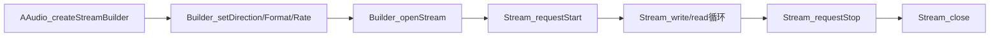
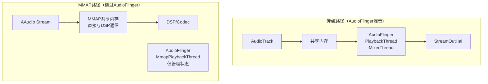
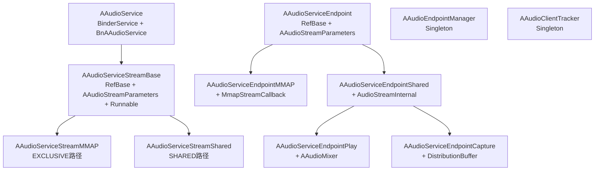
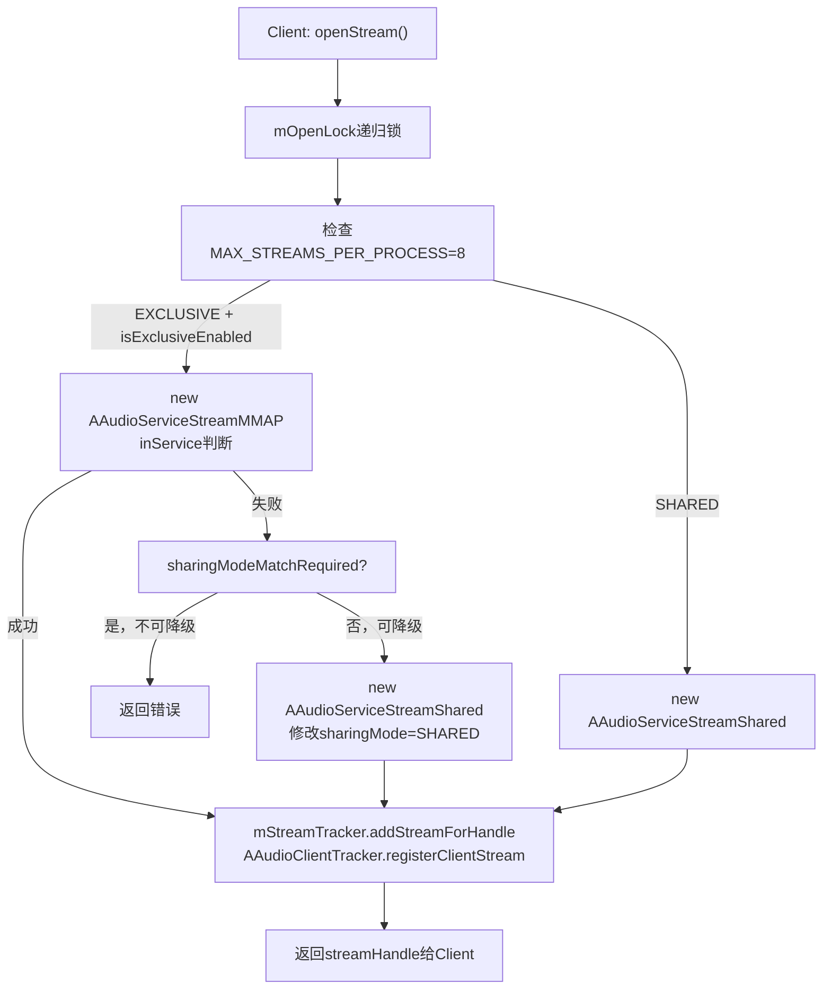
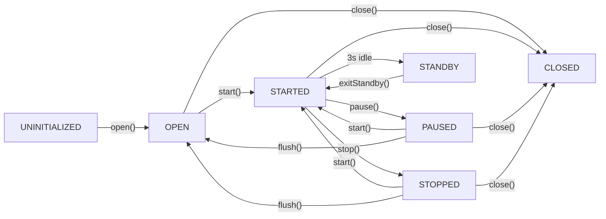
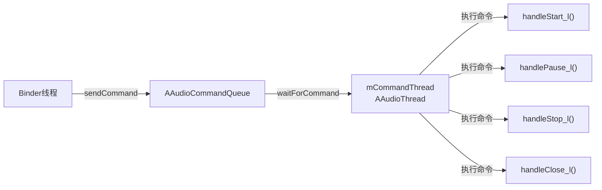
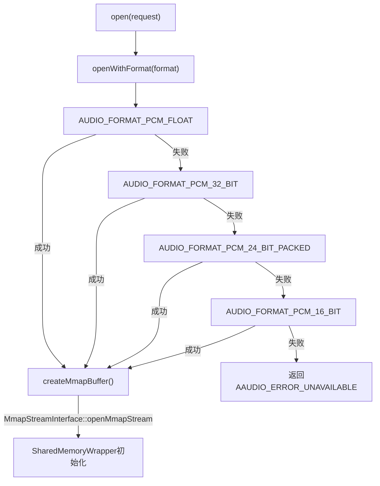
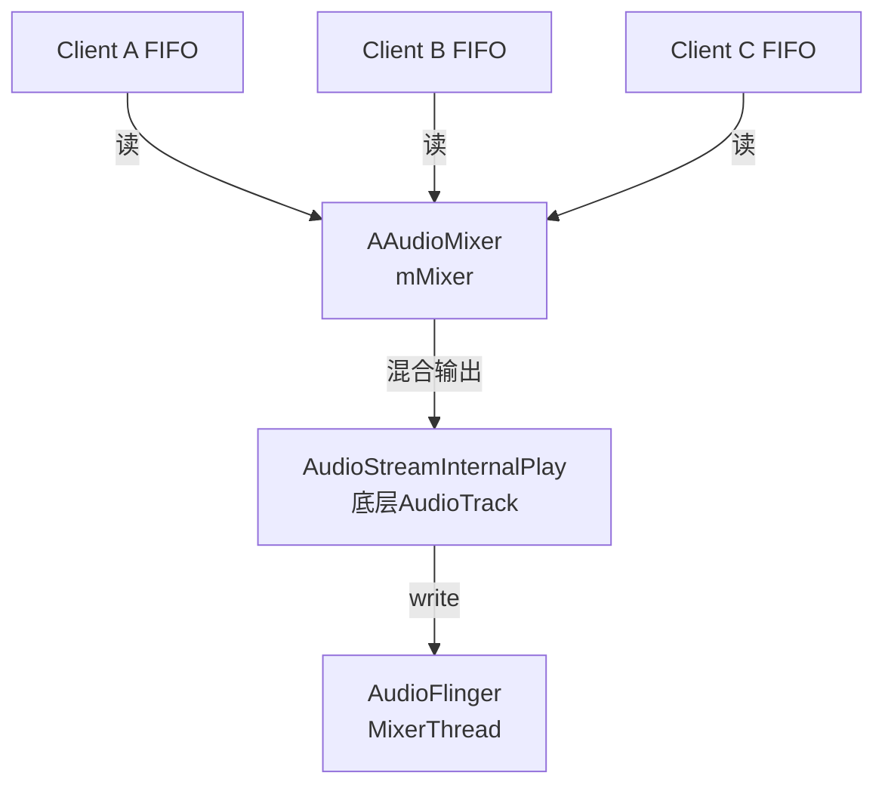
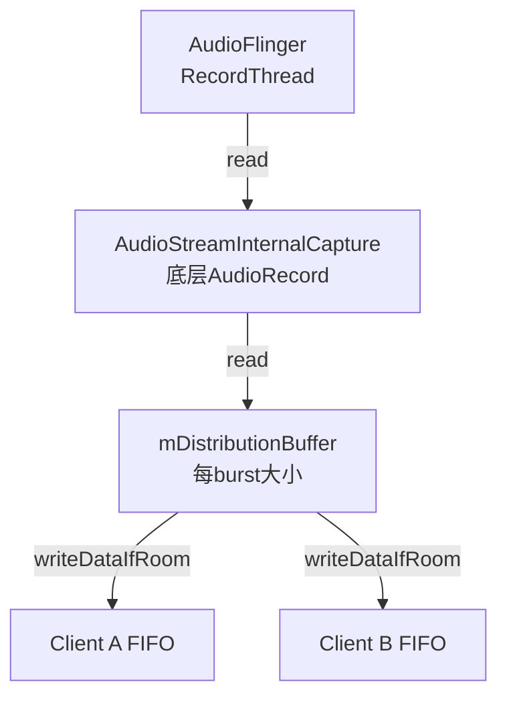
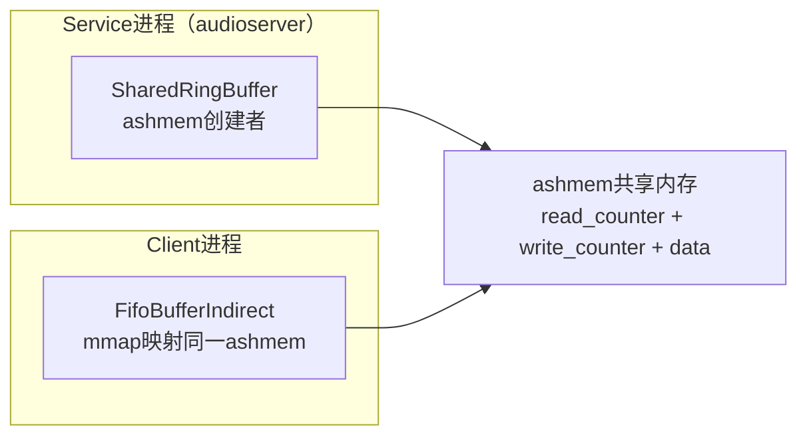

[← 2.4 AudioFocusReques](02_2.4_AudioFocusRequest.md) | [← 返回Application Layer — 应用层API深度解析](README.md) | [返回导航](../README.md) | [2.6 AudioEffect — 音效 →](02_2.6_AudioEffect.md)

---

## 2.5 AAudio — 低延迟音频API

### 模块职责

AAudio是Android 8.0引入的C语言低延迟音频API，专为专业音频和低延迟场景设计。内部根据设备能力自动选择MMAP路径或传统AudioTrack/AudioRecord路径。

**源码位置**：
- C API：[`aaudio/AAudio.h`](frameworks/av/media/libaaudio/include/aaudio/AAudio.h)
- 内部实现：[`frameworks/av/media/libaaudio/`](frameworks/av/media/libaaudio/)

### 核心流程



### AAudio vs OpenSL ES vs AudioTrack

| 维度 | AAudio | OpenSL ES | AudioTrack(Java) |
|------|--------|-----------|-----------------|
| 语言 | C/C++ | C | Java |
| 延迟 | 极低(MMAP) | 低 | 普通 |
| API复杂度 | 简单 | 复杂 | 中等 |
| MMAP支持 | 是 | 否 | 否(内部使用) |
| 状态 | **推荐使用** | 已弃用 | 通用场景 |
| Stream重建 | 自动(ErrorCallback) | 手动 | 手动(restoreTrack_l) |

### MMAP_NOIRQ模式深度解析



**MMAP_NOIRQ关键特征**：
- 音频数据直接在App与DSP之间通过共享内存传输，**完全绕过AudioFlinger混音**
- 延迟可降至<10ms（传统路径通常20-50ms）
- 使用`mmap()`映射HAL提供的共享内存buffer
- **NOIRQ**：无中断模式，App通过polling读取位置而非等待中断
- AudioFlinger侧对应`MmapPlaybackThread/MmapCaptureThread`，仅管理生命周期和状态，不混音
- 仅在HAL声明支持MMAP时可用，需要在`audio_policy_configuration.xml`中配置`mmapPolicy="auto"`
- AAudio内部自动选择：MMAP可用→MMAP路径，不可用→降级到AudioTrack路径

### ErrorCallback与Stream重建

AAudio的独特设计：当Stream遇到错误（如设备断开），通过ErrorCallback通知App，App可以重建Stream：

```c
aaudio_stream_builder_setErrorCallback(builder, errorCallback, userData);

void errorCallback(AAudioStream *stream, void *userData, aaudio_result_t error) {
    // 在AAudio内部线程调用，不能直接操作Stream
    // 需要通知App线程去重建Stream
    aaudio_stream_requestStop(stream);  // 安全操作
    // 通知App线程重新openStream
}
```

> **与AudioTrack的DEAD_OBJECT对比**：AudioTrack内部自动restoreTrack_l()，AAudio则将重建决策交给App——因为AAudio的Stream配置可能需要调整（如切换设备后采样率变化），App比框架层更适合决定如何重建。

### AAudio服务端架构 — oboeservice深度解析

#### 架构总览

AAudio服务端代码位于[`frameworks/av/services/oboeservice/`](frameworks/av/services/oboeservice/)，运行在audioserver进程中，是AAudio低延迟能力的关键实现层。其核心职责包括：

- 管理EXCLUSIVE（MMAP）和SHARED两条音频路径
- 维护流状态机与命令队列，确保线程安全
- 通过EndpointManager管理设备端点的生命周期
- 通过SharedRingBuffer实现跨进程零拷贝音频数据传输

**类层次关系**：



**两条数据路径的本质区别**：

| 维度 | EXCLUSIVE（MMAP） | SHARED |
|------|-------------------|--------|
| Stream类型 | [`AAudioServiceStreamMMAP`](frameworks/av/services/oboeservice/AAudioServiceStreamMMAP.h) | [`AAudioServiceStreamShared`](frameworks/av/services/oboeservice/AAudioServiceStreamShared.h) |
| Endpoint类型 | [`AAudioServiceEndpointMMAP`](frameworks/av/services/oboeservice/AAudioServiceEndpointMMAP.h) | [`AAudioServiceEndpointPlay`](frameworks/av/services/oboeservice/AAudioServiceEndpointPlay.h) / [`AAudioServiceEndpointCapture`](frameworks/av/services/oboeservice/AAudioServiceEndpointCapture.h) |
| 数据传输 | App↔DSP共享内存，零拷贝 | App→FIFO→Service混音→AudioTrack |
| 混音 | 无（独占设备） | [`AAudioMixer`](frameworks/av/services/oboeservice/AAudioMixer.h)软件混音 |
| 延迟 | 极低（<10ms） | 中等（传统AudioFlinger延迟） |
| 并发 | 每设备仅一个EXCLUSIVE流 | 多流共享同一Endpoint |

---

#### AAudioService — Binder服务入口

[`AAudioService`](frameworks/av/services/oboeservice/AAudioService.h)继承`BinderService<AAudioService>`和[`BnAAudioService`](frameworks/av/media/libaaudio/src/binding/AAudioServiceInterface.h)，注册为`media.aaudio`服务，是客户端与oboeservice交互的唯一Binder入口。

**核心Binder方法**：

```c++
// AAudioService.h
class AAudioService :
    public BinderService<AAudioService>,
    public aaudio::BnAAudioService {
public:
    binder::Status openStream(const StreamRequest& request,
                              StreamParameters* paramsOut,
                              int32_t* _aidl_return) override;
    binder::Status closeStream(int32_t streamHandle, int32_t* _aidl_return) override;
    binder::Status startStream(int32_t streamHandle, int32_t* _aidl_return) override;
    binder::Status pauseStream(int32_t streamHandle, int32_t* _aidl_return) override;
    binder::Status stopStream(int32_t streamHandle, int32_t* _aidl_return) override;
    binder::Status flushStream(int32_t streamHandle, int32_t* _aidl_return) override;
    binder::Status registerAudioThread(int32_t streamHandle, int32_t clientThreadId,
                                       int64_t periodNanoseconds, int32_t* _aidl_return) override;
    binder::Status unregisterAudioThread(int32_t streamHandle, int32_t clientThreadId,
                                         int32_t* _aidl_return) override;
    binder::Status exitStandby(int32_t streamHandle, Endpoint* endpoint,
                               int32_t* _aidl_return) override;
};
```

**openStream完整流程**：



**关键实现细节**：

1. **mOpenLock递归锁保护**（[`AAudioService.h`](frameworks/av/services/oboeservice/AAudioService.h)）：防止exclusive endpoint被steal后出现竞态。场景：线程A打开EXCLUSIVE endpoint→线程B steal A的endpoint→线程B打开SHARED→线程A需降级也打开SHARED，锁确保顺序正确

2. **MAX_STREAMS_PER_PROCESS=8**（[`AAudioService.cpp`](frameworks/av/services/oboeservice/AAudioService.cpp)）：每个进程最多8个AAudio流，通过[`AAudioClientTracker::getStreamCount()`](frameworks/av/services/oboeservice/AAudioClientTracker.h)检查

3. **EXCLUSIVE→SHARED降级逻辑**（[`AAudioService.cpp`](frameworks/av/services/oboeservice/AAudioService.cpp)）：
   - 先尝试EXCLUSIVE模式，创建`AAudioServiceStreamMMAP`
   - 失败后若`!sharingModeMatchRequired`，修改request的sharingMode为SHARED，创建`AAudioServiceStreamShared`
   - `sharingModeMatchRequired=true`时（App明确要求EXCLUSIVE），不降级直接返回错误

4. **inService判断**：若调用者本身就是audioserver进程（`isCallerInService()`为true），则信任request中的`isInService()`标志。此标志影响MMAP流的`startDevice`行为——inService流不需要调用`startClient`

5. **StreamTracker注册**（[`AAudioStreamTracker`](frameworks/av/services/oboeservice/AAudioStreamTracker.h)）：为每个打开的流分配handle，后续所有操作（start/pause/stop/close）均通过handle查找对应serviceStream

**AAudioBinderAdapter内部类**：

[`AAudioService::Adapter`](frameworks/av/services/oboeservice/AAudioService.h)继承[`AAudioBinderAdapter`](frameworks/av/media/libaaudio/src/binding/AAudioBinderAdapter.h)，适配`startClient/stopClient`方法。这两个方法不走Binder（它们由AudioFlinger的MmapThread回调触发），直接委托给AAudioService：

```c++
// AAudioService.h - Adapter内部类
class Adapter : public aaudio::AAudioBinderAdapter {
    aaudio_result_t startClient(const AAudioHandleInfo& streamHandleInfo,
                                const AudioClient& client,
                                const audio_attributes_t* attr,
                                audio_port_handle_t* clientHandle) override {
        return mService->startClient(streamHandleInfo.getHandle(), client, attr, clientHandle);
    }
    aaudio_result_t stopClient(const AAudioHandleInfo& streamHandleInfo,
                               audio_port_handle_t clientHandle) override {
        return mService->stopClient(streamHandleInfo.getHandle(), clientHandle);
    }
};
```

**调度优先级**：

```c++
static constexpr int32_t kRealTimeAudioPriorityClient = 2;  // 客户端音频线程优先级
static constexpr int32_t kRealTimeAudioPriorityService = 3; // 服务端音频线程优先级
```

---

#### AAudioServiceStreamBase — 流状态机与命令队列

[`AAudioServiceStreamBase`](frameworks/av/services/oboeservice/AAudioServiceStreamBase.h)是每个客户端流在服务端的对应实体，继承`RefBase`+`AAudioStreamParameters`+`Runnable`，封装了流状态机、命令队列和消息队列。

**流状态机**：



状态存储在[`mState`](frameworks/av/services/oboeservice/AAudioServiceStreamBase.h)成员中，通过[`setState()`](frameworks/av/services/oboeservice/AAudioServiceStreamBase.h)方法更新，状态变更会通过`sendServiceEvent`通知客户端。

**命令队列架构**：

所有流操作（start/pause/stop/flush/close等）均通过命令队列序列化执行，确保线程安全：



10种命令枚举定义在[`AAudioServiceStreamBase.h`](frameworks/av/services/oboeservice/AAudioServiceStreamBase.h)：

```c++
enum : int32_t {
    START,                    // 启动流
    PAUSE,                    // 暂停流
    STOP,                     // 停止流
    FLUSH,                    // 刷新缓冲区
    CLOSE,                    // 关闭流
    DISCONNECT,               // 断开连接
    REGISTER_AUDIO_THREAD,    // 注册客户端音频线程
    UNREGISTER_AUDIO_THREAD,  // 注销客户端音频线程
    GET_DESCRIPTION,          // 获取Endpoint描述
    EXIT_STANDBY,             // 退出待机模式
};
```

**AAudioCommand与AAudioCommandQueue**：

[`AAudioCommand`](frameworks/av/services/oboeservice/AAudioCommandQueue.h)封装命令参数和同步等待机制：

```c++
// AAudioCommandQueue.h
class AAudioCommand {
    const aaudio_command_opcode operationCode;     // 命令类型
    std::shared_ptr<AAudioCommandParam> parameter; // 命令参数（多态）
    bool isWaitingForReply;                        // 是否等待执行结果
    const int64_t timeoutNanoseconds;              // 超时时间
    aaudio_result_t result = AAUDIO_OK;            // 执行结果
    std::mutex lock;                               // 保护result的条件变量
    std::condition_variable conditionVariable;      // 通知调用者命令完成
};
```

命令参数通过[`AAudioCommandParam`](frameworks/av/services/oboeservice/AAudioCommandQueue.h)基类实现多态，4种子类参数：

| 参数子类 | 用途 | 定义位置 |
|----------|------|----------|
| [`RegisterAudioThreadParam`](frameworks/av/services/oboeservice/AAudioServiceStreamBase.h) | 注册音频线程：ownerPid + clientThreadId + priority | StreamBase内部类 |
| [`UnregisterAudioThreadParam`](frameworks/av/services/oboeservice/AAudioServiceStreamBase.h) | 注销音频线程：clientThreadId | StreamBase内部类 |
| [`GetDescriptionParam`](frameworks/av/services/oboeservice/AAudioServiceStreamBase.h) | 获取Endpoint描述：parcelable指针 | StreamBase内部类 |
| [`ExitStandbyParam`](frameworks/av/services/oboeservice/AAudioServiceStreamBase.h) | 退出待机：parcelable指针 | StreamBase内部类 |

**sendCommand流程**：

```
Binder线程 → sendCommand(opCode, param, waitForReply, timeout)
    → mCommandQueue.sendCommand(command)
    → 命令入队，唤醒CommandThread
    → 若waitForReply=true：等待conditionVariable（带超时）
    → CommandThread: waitForCommand() → 取出命令 → run()中执行handleCommand
    → 命令执行完毕，notify conditionVariable
    → Binder线程收到结果
```

**锁顺序与线程安全**：

[`AAudioServiceStreamBase.h`](frameworks/av/services/oboeservice/AAudioServiceStreamBase.h)明确定义了锁的获取顺序：

```
mLock → AAudioServiceEndpoint::mLockStreams
```

所有需要mLock的操作必须通过CommandThread执行（命令队列天然串行化），从而避免在Binder线程中直接持锁。

**向上消息队列**：

[`mUpMessageQueue`](frameworks/av/services/oboeservice/AAudioServiceStreamBase.h)（`SharedRingBuffer`）用于从Service向Client发送事件通知，由[`writeUpMessageQueue()`](frameworks/av/services/oboeservice/AAudioServiceStreamBase.h)写入[`AAudioServiceMessage`](frameworks/av/media/libaaudio/src/binding/AAudioServiceMessage.h)，包括：

- `AAUDIO_SERVICE_EVENT_STARTED` / `PAUSED` / `STOPPED` / `FLUSHED` — 状态变更通知
- `AAUDIO_SERVICE_EVENT_DISCONNECTED` — 设备断开
- `AAUDIO_SERVICE_EVENT_TIMESTAMP` — 周期性时间戳推送

**Standby自动待机机制**：

流在IDLE状态（OPEN/PAUSED/STOPPED）超过3秒（`IDLE_TIMEOUT_NANOS`）后自动进入standby。Standby状态下MMAP buffer被释放以节省资源，客户端调用`exitStandby()`时重新分配。此机制通过[`TimestampScheduler`](frameworks/av/services/oboeservice/TimestampScheduler.h)配合空闲检测实现。

**流控制原子标志**：

| 标志 | 类型 | 含义 |
|------|------|------|
| [`mFlowing`](frameworks/av/services/oboeservice/AAudioServiceStreamBase.h) | `bool` | 数据是否正在流动 |
| [`mSuspended`](frameworks/av/services/oboeservice/AAudioServiceStreamBase.h) | `atomic<bool>` | 流是否被挂起（如消息队列溢出） |
| [`mCloseNeeded`](frameworks/av/services/oboeservice/AAudioServiceStreamBase.h) | `atomic<bool>` | 标记流需要关闭（单向标志） |
| [`mConnected`](frameworks/av/services/oboeservice/AAudioServiceEndpoint.h) | `atomic<bool>` | Endpoint是否已连接 |

**Endpoint弱引用设计**：

[`mServiceEndpointWeak`](frameworks/av/services/oboeservice/AAudioServiceStreamBase.h)使用弱引用避免循环引用：Stream→Endpoint→mRegisteredStreams→Stream。访问Endpoint时通过`wp::promote()`提升为sp，若提升失败说明Endpoint已被销毁。

---

#### AAudioEndpointManager — 端点管理器

[`AAudioEndpointManager`](frameworks/av/services/oboeservice/AAudioEndpointManager.h)是Singleton，管理所有EXCLUSIVE和SHARED端点，负责端点的查找、创建和复用。

**分离锁设计**：

```c++
// AAudioEndpointManager.h
mutable std::mutex mSharedLock;                                    // 保护SHARED端点
std::vector<android::sp<AAudioServiceEndpointShared>> mSharedStreams GUARDED_BY(mSharedLock);

mutable std::mutex mExclusiveLock;                                 // 保护EXCLUSIVE端点
std::vector<android::sp<AAudioServiceEndpointMMAP>> mExclusiveStreams GUARDED_BY(mExclusiveLock);
```

使用两把独立锁而非一把全局锁的原因：**打开SHARED端点需要先打开EXCLUSIVE端点**（共享的AudioStreamInternal底层也依赖MMAP设备）。如果使用同一把锁，`openSharedEndpoint`内部调用`openExclusiveEndpoint`会造成递归死锁。锁的获取顺序规定为：**先mSharedLock后mExclusiveLock**。

**Endpoint查找与复用**：

[`openEndpoint()`](frameworks/av/services/oboeservice/AAudioEndpointManager.h)的决策逻辑：

```
openEndpoint(request)
  → sharingMode == EXCLUSIVE?
    → 是: openExclusiveEndpoint()
      → findExclusiveEndpoint_l(): 按deviceId/direction/格式查找已有端点
      → 找到: 引用计数+1，返回
      → 未找到: 新建AAudioServiceEndpointMMAP，open()
    → 否: openSharedEndpoint()
      → findSharedEndpoint_l(): 同上查找
      → 找到: 引用计数+1，返回
      → 未找到: 新建AAudioServiceEndpointPlay/Capture，open()
```

端点匹配由[`AAudioServiceEndpoint::matches()`](frameworks/av/services/oboeservice/AAudioServiceEndpoint.h)实现，比较deviceId、direction、format等关键参数。

**Endpoint Stealing机制**：

当EXCLUSIVE端点已被占用，新请求需要该端点时，[`kStealingEnabled=true`](frameworks/av/services/oboeservice/AAudioEndpointManager.h)允许"偷取"：

```
openExclusiveEndpoint()
  → findExclusiveEndpoint_l() 未找到空闲端点
  → kStealingEnabled && 有已注册端点?
    → 是: 选择victim端点，断开其所有stream
    → victim端点close()后重新open()给新请求者
```

Stealing场景：应用A独占MMAP播放→应用B（优先级更高）请求同一设备→A的流被disconnect→B获得EXCLUSIVE端点→A降级为SHARED。

**统计计数**：

[`AAudioEndpointManager`](frameworks/av/services/oboeservice/AAudioEndpointManager.h)维护5组统计，用于调试和性能分析：

| 计数器 | EXCLUSIVE | SHARED | 含义 |
|--------|-----------|--------|------|
| SearchCount | mExclusiveSearchCount | mSharedSearchCount | 查找次数 |
| FoundCount | mExclusiveFoundCount | mSharedFoundCount | 命中已有端点次数 |
| OpenCount | mExclusiveOpenCount | mSharedOpenCount | 新建端点次数 |
| CloseCount | mExclusiveCloseCount | mSharedCloseCount | 关闭端点次数 |
| StolenCount | mExclusiveStolenCount | — | 端点被偷取次数 |

---

#### MMAP路径：AAudioServiceEndpointMMAP

[`AAudioServiceEndpointMMAP`](frameworks/av/services/oboeservice/AAudioServiceEndpointMMAP.h)是EXCLUSIVE模式的核心实现，通过[`MmapStreamInterface`](frameworks/av/media/libaaudio/src/binding/AAudioServiceInterface.h)与AudioFlinger的MmapPlaybackThread/MmapCaptureThread交互。

**open流程与格式降级链**：



格式降级链：PCM_FLOAT → PCM_32_BIT → PCM_24_BIT_PACKED → PCM_16_BIT

`openWithFormat`调用[`MmapStreamInterface::openMmapStream()`](frameworks/av/media/libaaudio/src/binding/AAudioServiceInterface.h)打开AudioFlinger侧的MmapThread，HAL不支持当前格式时返回错误，触发降级到下一格式。

**核心成员**：

```c++
// AAudioServiceEndpointMMAP.h
android::sp<android::MmapStreamInterface> mMmapStream;        // AudioFlinger Mmap流接口
struct audio_mmap_buffer_info mMmapBufferinfo;                 // MMAP buffer信息
audio_port_handle_t mPortHandle = AUDIO_PORT_HANDLE_NONE;     // 端口句柄
std::unique_ptr<SharedMemoryWrapper> mAudioDataWrapper;        // 音频数据内存包装器
MonotonicCounter mFramesTransferred;                           // 32→64位帧计数器
```

**startStream / startClient流程**：

MMAP端点的启动分两层：

1. **Endpoint层**：[`startStream()`](frameworks/av/services/oboeservice/AAudioServiceEndpointMMAP.h)遍历mRegisteredStreams，找到对应stream后调用`startClient`
2. **Client层**：[`startClient()`](frameworks/av/services/oboeservice/AAudioServiceEndpointMMAP.h)调用`mMmapStream->start()`，通知AudioFlinger的MmapThread启动客户端

```
startStream(stream, clientHandle)
  → 注册stream到endpoint
  → startClient(client, attr, clientHandle)
    → mMmapStream->start(client, attr, clientHandle)
    → AudioFlinger MmapThread::start(clientPid, ...)
    → HAL层开始传输
```

**MmapStreamCallback回调**：

[`AAudioServiceEndpointMMAP`](frameworks/av/services/oboeservice/AAudioServiceEndpointMMAP.h)实现[`MmapStreamCallback`](frameworks/av/media/libaaudio/src/binding/AAudioServiceInterface.h)接口，处理AudioFlinger回调：

| 回调方法 | 触发场景 | 处理方式 |
|----------|----------|----------|
| [`onTearDown(portHandle)`](frameworks/av/services/oboeservice/AAudioServiceEndpointMMAP.h) | 设备移除/路由变更 | `handleTearDownAsync()`——**异步线程执行**避免死锁 |
| [`onVolumeChanged(volume)`](frameworks/av/services/oboeservice/AAudioServiceEndpointMMAP.h) | 音量变化 | 遍历mRegisteredStreams通知`onVolumeChanged` |
| [`onRoutingChanged(portHandle)`](frameworks/av/services/oboeservice/AAudioServiceEndpointMMAP.h) | 路由变更 | 断开所有已注册stream |

**handleTearDownAsync为何必须异步**：`onTearDown`在AudioFlinger的MmapThread锁内调用，若同步执行disconnect会尝试获取Endpoint的mLockStreams，而该锁可能正被另一个持有MmapThread锁的线程等待——形成ABBA死锁。异步投递到独立线程打破锁嵌套。

**standby / exitStandby**：

```c++
// standby: 释放MMAP buffer，节省资源
aaudio_result_t AAudioServiceEndpointMMAP::standby() {
    mMmapStream->standby();           // 通知AudioFlinger
    mAudioDataWrapper.reset();         // 释放SharedMemoryWrapper
}

// exitStandby: 重新分配MMAP buffer
aaudio_result_t AAudioServiceEndpointMMAP::exitStandby(AudioEndpointParcelable* parcelable) {
    createMmapBuffer();                // 重新创建MMAP buffer
    mAudioDataWrapper->setup(...);     // 重新初始化SharedMemoryWrapper
    getDownDataDescription(parcelable);// 填充Parcelable返回客户端
}
```

**MonotonicCounter — 32→64位位置转换**：

HAL的`getMmapPosition()`返回32位帧位置，可能回绕。[`MonotonicCounter`](frameworks/av/media/libaaudio/src/utility/MonotonicCounter.h)通过检测回绕将其扩展为64位单调递增值：

```
getFreeRunningPosition()
  → mMmapStream->getMmapPosition()  // 返回32位position
  → mFramesTransferred.update32(position32)  // 检测回绕，更新64位计数
  → *positionFrames = mFramesTransferred.get()  // 返回64位单调位置
```

---

#### Shared路径：AAudioServiceEndpointPlay/Capture

SHARED路径用于多个客户端流共享同一设备端点，通过软件混音/分发实现并发。

**AAudioServiceEndpointPlay — 播放混音**：

[`AAudioServiceEndpointPlay`](frameworks/av/services/oboeservice/AAudioServiceEndpointPlay.h)继承[`AAudioServiceEndpointShared`](frameworks/av/services/oboeservice/AAudioServiceEndpointShared.h)，内含[`AAudioMixer`](frameworks/av/services/oboeservice/AAudioMixer.h)实现多流混音：



**callbackLoop混音循环**：

```
callbackLoop() {
    while (mCallbackEnabled) {
        mMixer.clear();                          // 清空混音缓冲区
        for (stream : mRegisteredStreams) {       // 遍历所有活跃流
            if (stream.isFlowing() && !stream.isSuspended()) {
                framesMixed = mMixer.mix(index, fifo, allowUnderflow);
                // 从client的FIFO读取数据，混入混音缓冲区
            }
        }
        getStreamInternal()->write(mixerBuffer, framesPerBurst); // 写入AudioTrack
        // underflow检测: framesMixed < getFramesPerBurst() && isFlowing()
    }
}
```

**BURSTS_PER_BUFFER_DEFAULT=2**：每次callback处理2个burst的数据量，平衡延迟与CPU效率。

**时间戳位置偏移**：Shared播放流的位置计算需要考虑混音延迟：

```
clientPosition = mmapFramesWritten - clientFramesRead + mTimestampPositionOffset
```

[`mTimestampPositionOffset`](frameworks/av/services/oboeservice/AAudioServiceStreamShared.h)在每次数据传输完成时通过[`markTransferTime()`](frameworks/av/services/oboeservice/AAudioServiceStreamShared.h)更新。

**AAudioServiceEndpointCapture — 录音分发**：

[`AAudioServiceEndpointCapture`](frameworks/av/services/oboeservice/AAudioServiceEndpointCapture.h)继承`AAudioServiceEndpointShared`，数据流方向相反——从AudioRecord读取后分发给各客户端流：



**callbackLoop分发循环**：

```
callbackLoop() {
    while (mCallbackEnabled) {
        framesRead = getStreamInternal()->read(mDistributionBuffer, framesPerBurst);
        for (stream : mRegisteredStreams) {
            stream.writeDataIfRoom(mmapFramesRead, mDistributionBuffer, framesRead);
            // 向每个client的FIFO写入数据
        }
    }
}
```

[`writeDataIfRoom()`](frameworks/av/services/oboeservice/AAudioServiceStreamShared.h)检查FIFO是否有足够空间，空间不足时丢弃数据并递增XRun计数。

**mRunningStreamCount计数**：

[`mRunningStreamCount`](frameworks/av/services/oboeservice/AAudioServiceEndpointShared.h)（`atomic<int>`）跟踪当前活跃的流数量：
- `startStream()` → count++ → 若count从0变1，调用`startSharingThread_l()`启动callbackLoop线程
- `stopStream()` → count-- → 若count变为0，调用`stopSharingThread()`停止线程

**handleDisconnectRegisteredStreamsAsync**：

[`AAudioServiceEndpointShared`](frameworks/av/services/oboeservice/AAudioServiceEndpointShared.h)在底层AudioStreamInternal断开时，异步断开所有已注册stream，避免在callbackLoop线程中同步操作造成死锁：

```
handleDisconnectRegisteredStreamsAsync()
  → 新建线程
    → 遍历mRegisteredStreams
      → stream->disconnect()
```

---

#### AAudioClientTracker — 客户端生命周期

[`AAudioClientTracker`](frameworks/av/services/oboeservice/AAudioClientTracker.h)是Singleton，跟踪每个进程的AAudio客户端，负责Binder死亡通知和进程级流计数限制。

**NotificationClient内部类**：

```c++
// AAudioClientTracker.h
class NotificationClient : public IBinder::DeathRecipient {
    const pid_t mProcessId;                                    // 客户端进程PID
    std::set<android::sp<AAudioServiceStreamBase>> mStreams;   // 该进程的所有流
    android::sp<IBinder> mBinder;                              // 持有binder引用以接收死亡通知
    bool mExclusiveEnabled = true;                             // 是否允许EXCLUSIVE MMAP
};
```

**核心功能**：

1. **Binder死亡通知**：[`binderDied()`](frameworks/av/services/oboeservice/AAudioClientTracker.h)回调在客户端进程死亡时触发，自动关闭该进程的所有AAudio流，释放MMAP资源

2. **进程级流计数**：[`getStreamCount(pid)`](frameworks/av/services/oboeservice/AAudioClientTracker.h)用于`MAX_STREAMS_PER_PROCESS=8`限制检查

3. **Exclusive开关**：[`setExclusiveEnabled(pid, enabled)`](frameworks/av/services/oboeservice/AAudioClientTracker.h) / [`isExclusiveEnabled(pid)`](frameworks/av/services/oboeservice/AAudioClientTracker.h)控制特定进程是否能创建EXCLUSIVE MMAP流。默认允许，但系统可通过此接口禁用某进程的EXCLUSIVE权限

**注册/注销流程**：

```
registerClient(pid, client)
  → 创建NotificationClient(pid, binder)
  → binder->linkToDeath(notificationClient)
  → mNotificationClients[pid] = notificationClient

registerClientStream(pid, serviceStream)
  → getNotificationClient_l(pid)->registerClientStream(serviceStream)
  → mStreams.insert(serviceStream)

unregisterClientStream(pid, serviceStream)
  → getNotificationClient_l(pid)->unregisterClientStream(serviceStream)
  → mStreams.erase(serviceStream)
```

---

#### 共享内存架构

AAudio的零拷贝低延迟特性依赖精心设计的共享内存架构，涉及多个层次的内存抽象。

**SharedRingBuffer — 核心环形缓冲区**：

[`SharedRingBuffer`](frameworks/av/services/oboeservice/SharedRingBuffer.h)基于ashmem共享内存+FifoBufferIndirect实现跨进程环形缓冲区：

**内存布局**：

```
+-------------------+  offset 0 (SHARED_RINGBUFFER_READ_OFFSET)
|  read_counter     |  sizeof(fifo_counter_t)
+-------------------+  offset sizeof(fifo_counter_t) (SHARED_RINGBUFFER_WRITE_OFFSET)
|  write_counter    |  sizeof(fifo_counter_t)
+-------------------+  offset 2*sizeof(fifo_counter_t) (SHARED_RINGBUFFER_DATA_OFFSET)
|                   |
|  audio data       |  capacityInFrames * bytesPerFrame
|                   |
+-------------------+
```

关键宏定义在[`SharedRingBuffer.h`](frameworks/av/services/oboeservice/SharedRingBuffer.h)：

```c++
#define SHARED_RINGBUFFER_READ_OFFSET   0
#define SHARED_RINGBUFFER_WRITE_OFFSET  sizeof(fifo_counter_t)
#define SHARED_RINGBUFFER_DATA_OFFSET   (SHARED_RINGBUFFER_WRITE_OFFSET + sizeof(fifo_counter_t))
```

**数据传输流程**：



两端通过读写计数器协调数据位置，无需额外同步原语——读写分别原子更新各自counter，另一端polling读取。

**fillParcelable跨进程传递**：

[`SharedRingBuffer::fillParcelable()`](frameworks/av/services/oboeservice/SharedRingBuffer.h)将ashmem fd和偏移量填充到[`RingBufferParcelable`](frameworks/av/media/libaaudio/src/binding/RingBufferParcelable.h)，通过Binder传递给客户端：

```
fillParcelable(endpointParcelable, ringBufferParcelable)
  → ringBufferParcelable.setSharedMemoryFD(ashmemFD)
  → ringBufferParcelable.setReadCounterOffset(SHARED_RINGBUFFER_READ_OFFSET)
  → ringBufferParcelable.setWriteCounterOffset(SHARED_RINGBUFFER_WRITE_OFFSET)
  → ringBufferParcelable.setDataOffset(SHARED_RINGBUFFER_DATA_OFFSET)
  → ringBufferParcelable.setBytesPerFrame(bytesPerFrame)
  → ringBufferParcelable.setCapacityInFrames(capacityInFrames)
```

客户端收到Parcelable后，通过`mmap()`映射ashmem fd，直接读写共享内存中的音频数据。

**SharedMemoryProxy与SharedMemoryWrapper**：

| 类 | 路径 | 用途 |
|----|------|------|
| [`SharedMemoryProxy`](frameworks/av/services/oboeservice/SharedMemoryProxy.h) | oboeservice | 为MMAP流的audio data创建代理，处理跨进程内存映射 |
| [`SharedMemoryWrapper`](frameworks/av/services/oboeservice/SharedMemoryWrapper.h) | oboeservice | 包装HAL提供的MMAP共享内存，提供统一读写接口 |

`SharedMemoryWrapper`在`createMmapBuffer()`时设置，映射HAL层提供的audio_mmap_buffer_info中的共享内存，使oboeservice可以直接访问MMAP buffer。`SharedMemoryProxy`则在`exitStandby`时重建内存代理。

**两种路径的共享内存使用对比**：

| 维度 | MMAP路径 | SHARED路径 |
|------|----------|------------|
| 音频数据内存 | HAL提供的DSP共享内存 | SharedRingBuffer（ashmem） |
| 消息队列 | SharedRingBuffer（ashmem） | SharedRingBuffer（ashmem） |
| 混音缓冲区 | 无 | AAudioMixer内部buffer（非共享） |
| 客户端访问方式 | mmap HAL fd | mmap ashmem fd |
| 位置获取 | getMmapPosition() + MonotonicCounter | read/write counter计算 |

---

**oboeservice架构总结**：

oboeservice的核心设计理念是**将延迟敏感的EXCLUSIVE路径与兼容性优先的SHARED路径分离**，通过统一的流状态机和命令队列确保线程安全，通过精心设计的共享内存架构实现零拷贝跨进程传输。EndpointManager的分离锁和Stealing机制解决了MMAP资源独占性带来的并发冲突，ClientTracker则通过Binder死亡通知保障了客户端异常退出时的资源回收。

---

---

[← 2.4 AudioFocusReques](02_2.4_AudioFocusRequest.md) | [← 返回Application Layer — 应用层API深度解析](README.md) | [返回导航](../README.md) | [2.6 AudioEffect — 音效 →](02_2.6_AudioEffect.md)
