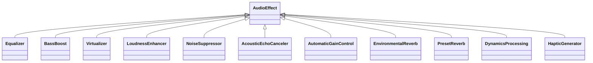
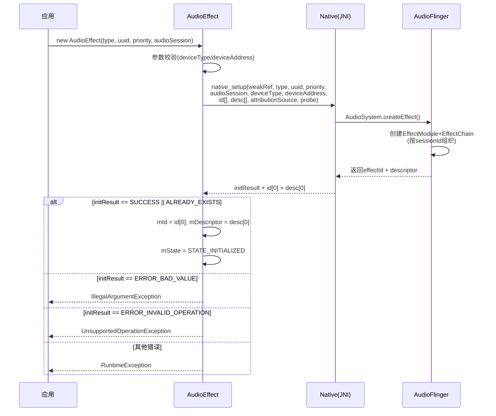
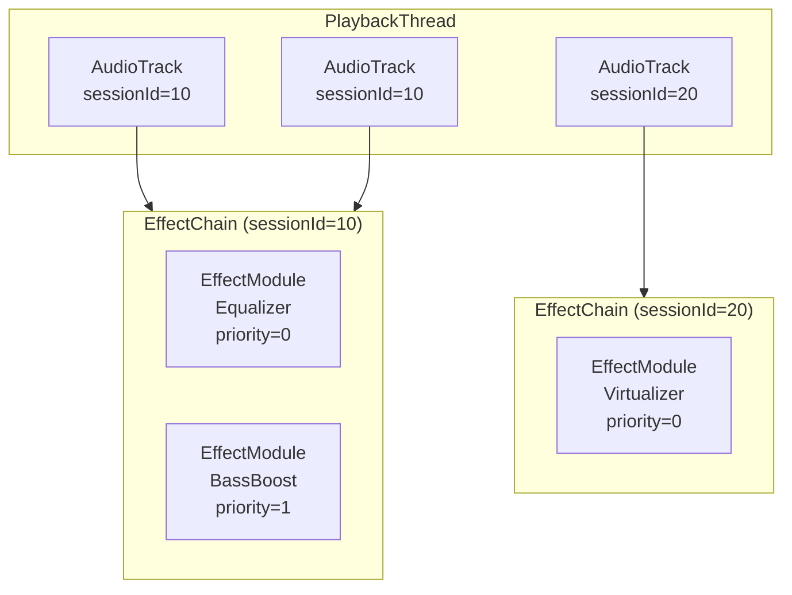
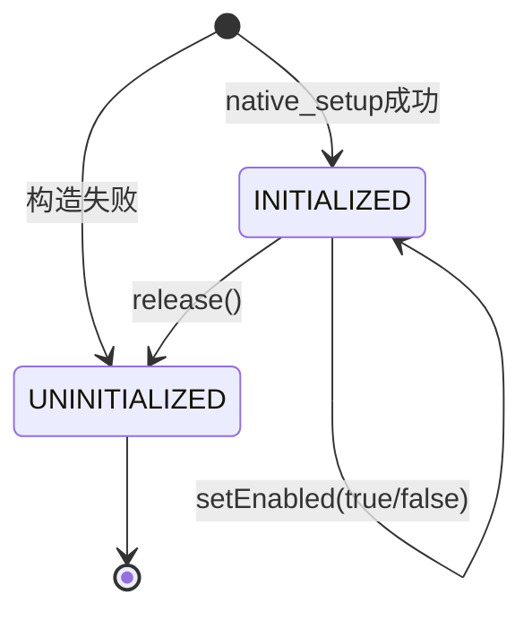

[← 2.5 AAudio](02_2.5_AAudio.md) | [← 返回Application Layer](README.md) | [返回导航](../README.md) | [2.7 MediaPlayer →](02_2.7_MediaPlayer.md)

---

## 2.6 AudioEffect — 音效控制API

### 模块职责

[`AudioEffect`](frameworks/base/media/java/android/media/audiofx/AudioEffect.java) 是Android音效框架的基类API，为音频效果处理提供统一的创建、控制、参数配置接口。应用不应直接使用此类，而应使用其派生子类。

**源码位置**：
- Java层：[`AudioEffect.java`](frameworks/base/media/java/android/media/audiofx/AudioEffect.java)
- Native层：[`AudioEffect.cpp`](frameworks/av/media/libaudioclient/AudioEffect.cpp)
- JNI桥接：[`android_media_AudioEffect.cpp`](frameworks/base/core/jni/android_media_AudioEffect.cpp)
- AudioFlinger：[`Effects.h / EffectModule.cpp`](frameworks/av/services/audioflinger/Effects.h)

### 2.6.1 子类体系



| 子类 | Type UUID | 连接模式 | 方向 | 典型场景 |
|------|-----------|----------|------|----------|
| [`Equalizer`](frameworks/base/media/java/android/media/audiofx/Equalizer.java) | `0bed4300-...` | INSERT | Output | 频段均衡调节 |
| [`BassBoost`](frameworks/base/media/java/android/media/audiofx/BassBoost.java) | `0634f220-...` | INSERT | Output | 低音增强 |
| [`Virtualizer`](frameworks/base/media/java/android/media/audiofx/Virtualizer.java) | `37cc2c00-...` | INSERT | Output | 虚拟环绕声 |
| [`LoudnessEnhancer`](frameworks/base/media/java/android/media/audiofx/LoudnessEnhancer.java) | `fe3199be-...` | INSERT | Output | 响度增强 |
| [`AcousticEchoCanceler`](frameworks/base/media/java/android/media/audiofx/AcousticEchoCanceler.java) | `7b491460-...` | INSERT | Input | 回声消除 |
| [`NoiseSuppressor`](frameworks/base/media/java/android/media/audiofx/NoiseSuppressor.java) | `58b4b260-...` | INSERT | Input | 降噪 |
| [`AutomaticGainControl`](frameworks/base/media/java/android/media/audiofx/AutomaticGainControl.java) | `0a8abfe0-...` | INSERT | Input | 自动增益 |
| [`EnvironmentalReverb`](frameworks/base/media/java/android/media/audiofx/EnvironmentalReverb.java) | `c2e5d5f0-...` | AUX | Output | 环境混响 |
| [`PresetReverb`](frameworks/base/media/java/android/media/audiofx/PresetReverb.java) | `47382d60-...` | AUX | Output | 预设混响 |
| [`DynamicsProcessing`](frameworks/base/media/java/android/media/audiofx/DynamicsProcessing.java) | `7261676f-...` | INSERT | Output | 动态处理(多频段压缩/均衡) |
| [`HapticGenerator`](frameworks/base/media/java/android/media/audiofx/HapticGenerator.java) | `1411e6d6-...` | INSERT | Output | 触觉反馈生成 |

### 2.6.2 UUID体系

AudioEffect使用双UUID体系标识音效：

| UUID类型 | 作用 | 示例 |
|----------|------|------|
| **Type UUID** | 标识音效类型(接口)，对应OpenSL ES Interface ID | `EFFECT_TYPE_EQUALIZER` |
| **Implementation UUID** | 标识具体实现，Vendor可自定义 | 每个HAL实现的UUID唯一 |

**UUID选择逻辑**（构造函数[L504-531](frameworks/base/media/java/android/media/audiofx/AudioEffect.java:504)）：
- `type != EFFECT_TYPE_NULL && uuid != EFFECT_TYPE_NULL` → 精确匹配(type+uuid)
- `type != EFFECT_TYPE_NULL && uuid == EFFECT_TYPE_NULL` → 按type选择第一个实现
- `type == EFFECT_TYPE_NULL && uuid != EFFECT_TYPE_NULL` → 按uuid选择(忽略type)

### 2.6.3 EffectDescriptor

[`Descriptor`](frameworks/base/media/java/android/media/audiofx/AudioEffect.java:249) 描述音效引擎的完整元数据：

```java
public static class Descriptor {
    public UUID type;           // 效果类型UUID
    public UUID uuid;          // 实现UUID
    public String connectMode; // "Insert" 或 "Auxiliary"
    public String name;        // 可读效果名称
    public String implementor; // 可读实现者名称
}
```

通过[`queryEffects()`](frameworks/base/media/java/android/media/audiofx/AudioEffect.java:619)枚举系统所有可用音效，[`queryPreProcessings()`](frameworks/base/media/java/android/media/audiofx/AudioEffect.java:632)枚举指定session的预处理效果。

### 2.6.4 构造流程



**双构造函数**：
1. **Session附加**：[`AudioEffect(type, uuid, priority, audioSession)`](frameworks/base/media/java/android/media/audiofx/AudioEffect.java:472) — 附加到AudioTrack/AudioRecord的sessionId
2. **Device附加**：[`AudioEffect(uuid, device)`](frameworks/base/media/java/android/media/audiofx/AudioEffect.java:492) — @SystemApi，附加到特定音频设备(deviceType+address)，audioSession=-2

### 2.6.5 EffectChain与EffectModule

AudioFlinger按sessionId组织EffectChain，同一sessionId的多个AudioTrack共享同一EffectChain：



**关键规则**：
- 同一sessionId的AudioTrack共享同一EffectChain
- EffectModule按优先级(priority)竞争控制权
- INSERT效果在`threadLoop_mix()`之后处理，AUX效果通过辅助发送处理

### 2.6.6 连接模式

| 模式 | 常量 | 信号流 | 共享性 | 典型效果 |
|------|------|--------|--------|----------|
| **INSERT** | `"Insert"` | 整个信号通过效果处理 | 通常不共享 | 均衡器/低音增强/降噪 |
| **AUXILIARY** | `"Auxiliary"` | 部分信号(wet)发送到效果，输出与原始信号(dry)混合 | 可多源共享 | 混响 |

**INSERT效果**：信号路径 `输入 → EffectModule.process() → 输出`，独占处理链。
**AUX效果**：信号路径 `输入 → 原始输出(dry) + 发送到Aux(wet) → 混合输出`，多个AudioTrack可发送到同一Aux效果。

### 2.6.7 优先级与控制权

AudioEffect使用**优先级(priority)**机制解决多App竞争同一EffectModule的控制权：

- 创建时指定priority（0=普通，正数=高优先级，负数=低优先级）
- 高优先级请求会从低优先级持有者夺取控制权
- 失去控制权的App通过[`OnControlStatusChangeListener`](frameworks/base/media/java/android/media/audiofx/AudioEffect.java:1089)收到通知
- 控制权状态可通过[`hasControl()`](frameworks/base/media/java/android/media/audiofx/AudioEffect.java:1060)查询（Native: [`native_hasControl()`](frameworks/base/media/java/android/media/audiofx/AudioEffect.java:1408)）

### 2.6.8 生命周期与状态



**状态常量**（[AudioEffect.java:171-176](frameworks/base/media/java/android/media/audiofx/AudioEffect.java:171)）：
- `STATE_UNINITIALIZED = 0` — 未初始化或已释放
- `STATE_INITIALIZED = 1` — 可正常使用

**状态保护**：所有操作方法内部调用[`checkState()`](frameworks/base/media/java/android/media/audiofx/AudioEffect.java:1431)，在UNINITIALIZED状态下抛出`IllegalStateException`。`mStateLock`同步保护状态变更。

### 2.6.9 启用/禁用控制

```java
// AudioEffect.java:673-676
public int setEnabled(boolean enabled) throws IllegalStateException {
    checkState("setEnabled()");
    return native_setEnabled(enabled);
}
```

- [`native_setEnabled()`](frameworks/base/media/java/android/media/audiofx/AudioEffect.java:1404) → AudioFlinger `EffectModule::setEnabled()`
- 启用状态变化通过`NATIVE_EVENT_ENABLED_STATUS`事件通知
- [`getEnabled()`](frameworks/base/media/java/android/media/audiofx/AudioEffect.java:1048) → `native_getEnabled()`

### 2.6.10 参数读写体系

AudioEffect提供通用的参数读写接口，通过byte[]传输参数和值：

**setParameter方法族**（7种重载）：

| 方法签名 | 参数格式 | 值格式 | 典型用途 |
|----------|----------|--------|----------|
| `setParameter(byte[], byte[])` | 自定义 | 自定义 | 最通用形式 |
| `setParameter(int, int)` | int | int | 单参数整数值 |
| `setParameter(int, short)` | int | short | 单参数短整数值 |
| `setParameter(int, byte[])` | int | byte[] | 单参数自定义值 |
| `setParameter(int[], int[])` | int[1-2] | int[1-2] | 多维参数整数值 |
| `setParameter(int[], short[])` | int[1-2] | short[1-2] | 多维参数短整数 |
| `setParameter(int[], byte[])` | int[1-2] | byte[] | 多维参数自定义值 |

**getParameter方法族**（6种重载）：

| 方法签名 | 参数格式 | 值格式 | 典型用途 |
|----------|----------|--------|----------|
| `getParameter(byte[], byte[])` | 自定义 | 自定义 | 最通用形式 |
| `getParameter(int, byte[])` | int | byte[] | 查询单参数 |
| `getParameter(int, int[])` | int | int[1-2] | 查询单参数整数值 |
| `getParameter(int, short[])` | int | short[1-2] | 查询单参数短整数 |
| `getParameter(int[], int[])` | int[1-2] | int[1-2] | 查询多维参数 |
| `getParameter(int[], short[])` | int[1-2] | short[1-2] | 查询多维参数短整数 |

**底层实现**：所有setParameter/getParameter最终调用 [`native_setParameter()`](frameworks/base/media/java/android/media/audiofx/AudioEffect.java:1410) / [`native_getParameter()`](frameworks/base/media/java/android/media/audiofx/AudioEffect.java:1413)，通过共享内存传递参数数据。

### 2.6.11 通用命令接口

[`command()`](frameworks/base/media/java/android/media/audiofx/AudioEffect.java:1019) 提供向音效引擎发送自定义命令的通道：

```java
public int command(int cmdCode, byte[] command, byte[] reply)
        throws IllegalStateException {
    checkState("command()");
    return native_command(cmdCode, command.length, command,
            reply.length, reply);
}
```

- 用于Vendor自定义效果的非标准操作
- `cmdCode`由具体效果实现定义
- 底层调用[`native_command()`](frameworks/base/media/java/android/media/audiofx/AudioEffect.java:1416)

### 2.6.12 回调事件体系

AudioEffect定义3种Native事件（[L184-194](frameworks/base/media/java/android/media/audiofx/AudioEffect.java:184)）：

| 事件ID | 常量 | 触发条件 | 对应监听器 |
|--------|------|----------|-----------|
| 0 | `NATIVE_EVENT_CONTROL_STATUS` | 控制权变更(获得/失去) | [`OnControlStatusChangeListener`](frameworks/base/media/java/android/media/audiofx/AudioEffect.java:1089) |
| 1 | `NATIVE_EVENT_ENABLED_STATUS` | 启用状态变更 | [`OnEnableStatusChangeListener`](frameworks/base/media/java/android/media/audiofx/AudioEffect.java:1074) |
| 2 | `NATIVE_EVENT_PARAMETER_CHANGED` | 参数变更通知 | [`OnParameterChangeListener`](frameworks/base/media/java/android/media/audiofx/AudioEffect.java:1105) |

**事件分发机制**：
1. Native层通过[`postEventFromNative()`](frameworks/base/media/java/android/media/audiofx/AudioEffect.java:1375)从JNI回调Java层
2. `postEventFromNative()`向[`NativeEventHandler`](frameworks/base/media/java/android/media/audiofx/AudioEffect.java:1308)发送Message
3. `NativeEventHandler.handleMessage()`在目标Looper线程分发给对应监听器
4. 所有监听器访问受[`mListenerLock`](frameworks/base/media/java/android/media/audiofx/AudioEffect.java:428)保护

### 2.6.13 Native方法签名

```java
private static native final void native_init();                    // L1393
private native final int native_setup(Object, String type,         // L1395
        String uuid, int priority, int audioSession,
        int deviceType, String deviceAddress,
        int[] id, Descriptor[] desc, Parcel attributionSource,
        boolean probe);
private native final void native_finalize();                       // L1400
private native final void native_release();                        // L1402
private native final int native_setEnabled(boolean enabled);       // L1404
private native final boolean native_getEnabled();                  // L1406
private native final boolean native_hasControl();                  // L1408
private native final int native_setParameter(int psize, byte[],    // L1410
        int vsize, byte[]);
private native final int native_getParameter(int psize, byte[],    // L1413
        int vsize, byte[]);
private native final int native_command(int cmdCode, int cmdSize,  // L1416
        byte[], int replySize, byte[]);
private static native Object[] native_query_effects();             // L1419
private static native Object[] native_query_pre_processing(        // L1421
        int audioSession);
```

**Native调用链**：`Java native_xxx() → JNI android_media_AudioEffect_xxx() → AudioEffect(Native) → IAudioFlinger → EffectModule`

### 2.6.14 辅助工具方法

AudioEffect提供byte[]与基本类型的转换工具（[L1470-1557](frameworks/base/media/java/android/media/audiofx/AudioEffect.java:1470)）：

| 方法 | 功能 |
|------|------|
| `byteArrayToInt(byte[])` | byte[4] → int |
| `intToByteArray(int)` | int → byte[4] |
| `byteArrayToShort(byte[])` | byte[2] → short |
| `shortToByteArray(short)` | short → byte[2] |
| `byteArrayToFloat(byte[])` | byte[4] → float |
| `floatToByteArray(float)` | float → byte[4] |
| `concatArrays(byte[]...)` | 拼接多个byte[] |

这些工具用于setParameter/getParameter的参数编码/解码。

### 2.6.15 错误码体系

| 错误码 | 值 | 含义 |
|--------|-----|------|
| `SUCCESS` | 0 | 操作成功 |
| `ERROR` | -1 | 未指定错误 |
| `ALREADY_EXISTS` | -2 | 效果已存在(非错误) |
| `ERROR_NO_INIT` | -3 | 对象初始化失败 |
| `ERROR_BAD_VALUE` | -4 | 参数值无效 |
| `ERROR_INVALID_OPERATION` | -5 | 状态不正确 |
| `ERROR_NO_MEMORY` | -6 | 内存不足 |
| `ERROR_DEAD_OBJECT` | -7 | Binder对象已死亡 |

[`checkStatus()`](frameworks/base/media/java/android/media/audiofx/AudioEffect.java:1443)将错误码转换为异常：`ERROR_DEAD_OBJECT` → `RuntimeException`，其他负值 → `IllegalStateException`。

### 2.6.16 音效附加方式

| 方式 | audioSession值 | 说明 | 场景 |
|------|---------------|------|------|
| SESSION_ID | > 0 | 通过AudioTrack/AudioRecord的sessionId附加 | 最常见 |
| OUTPUT | 0 | 附加到全局输出流(已弃用) | 旧版全局效果 |
| DEVICE | -2 | 附加到特定AudioDevice(需@SystemApi权限) | 系统级设备效果 |

**Device附加模式**(Android 12+)：[`AudioEffect(uuid, device)`](frameworks/base/media/java/android/media/audiofx/AudioEffect.java:492)允许将音效绑定到特定输出/输入设备，设备被选中时自动激活效果。需要`MODIFY_DEFAULT_AUDIO_EFFECTS`权限。

### 2.6.17 查询API

| 方法 | 作用 |
|------|------|
| [`queryEffects()`](frameworks/base/media/java/android/media/audiofx/AudioEffect.java:619) | 静态，枚举所有可用音效Descriptor[] |
| [`queryPreProcessings(session)`](frameworks/base/media/java/android/media/audiofx/AudioEffect.java:632) | 静态，枚举指定session的预处理效果 |
| [`isEffectTypeAvailable(type)`](frameworks/base/media/java/android/media/audiofx/AudioEffect.java:643) | 静态，检查效果类型是否可用 |
| [`isEffectSupportedForDevice(uuid, device)`](frameworks/base/media/java/android/media/audiofx/AudioEffect.java:567) | @SystemApi，检查效果是否可附加到设备 |
| [`getDescriptor()`](frameworks/base/media/java/android/media/audiofx/AudioEffect.java:603) | 获取当前效果的Descriptor |

---

[← 2.5 AAudio](02_2.5_AAudio.md) | [← 返回Application Layer](README.md) | [返回导航](../README.md) | [2.7 MediaPlayer →](02_2.7_MediaPlayer.md)