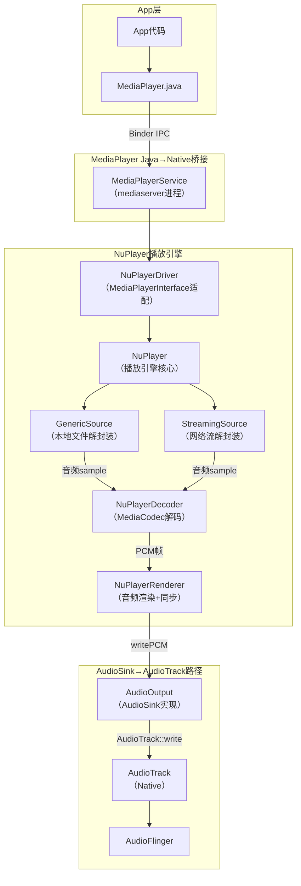
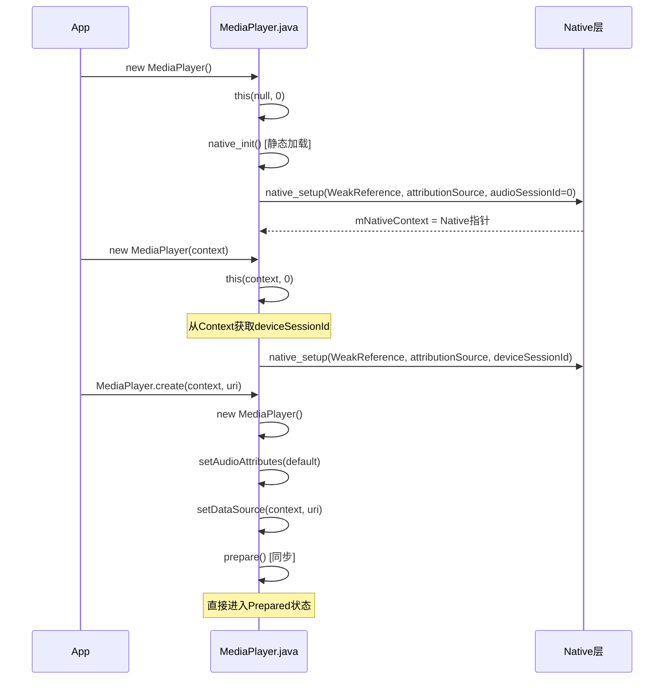
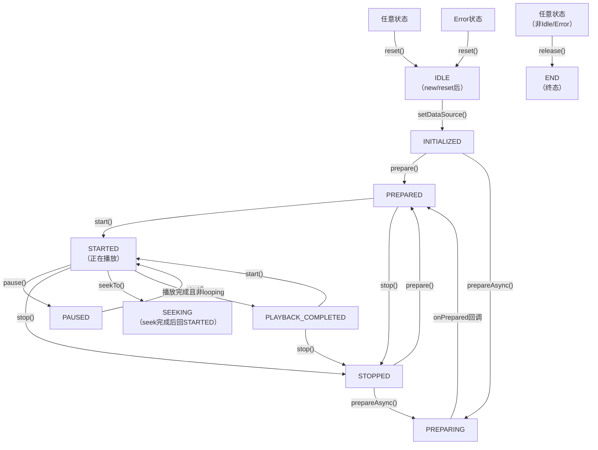
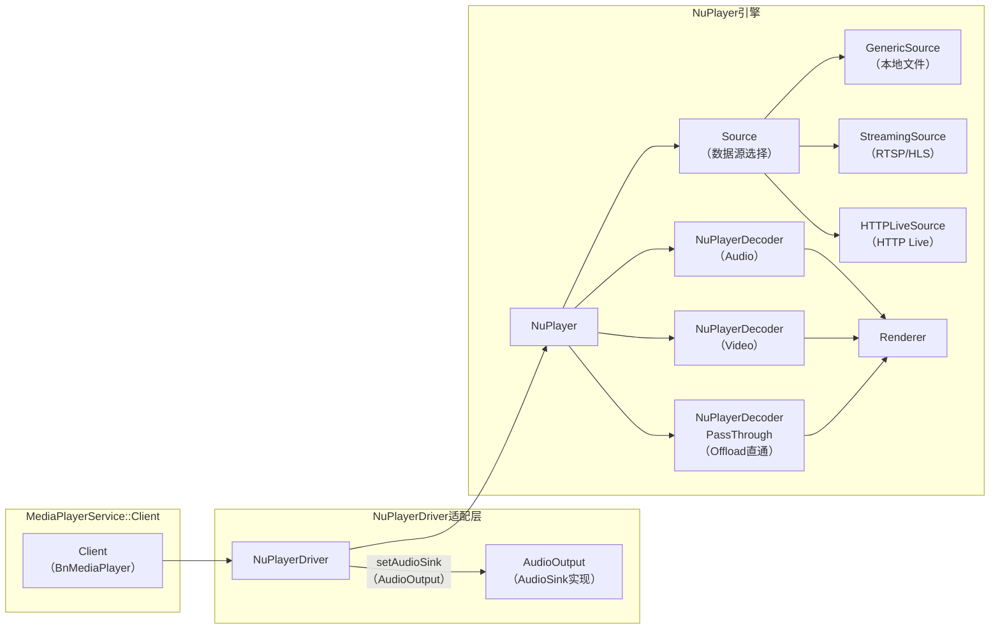
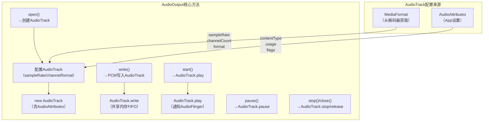
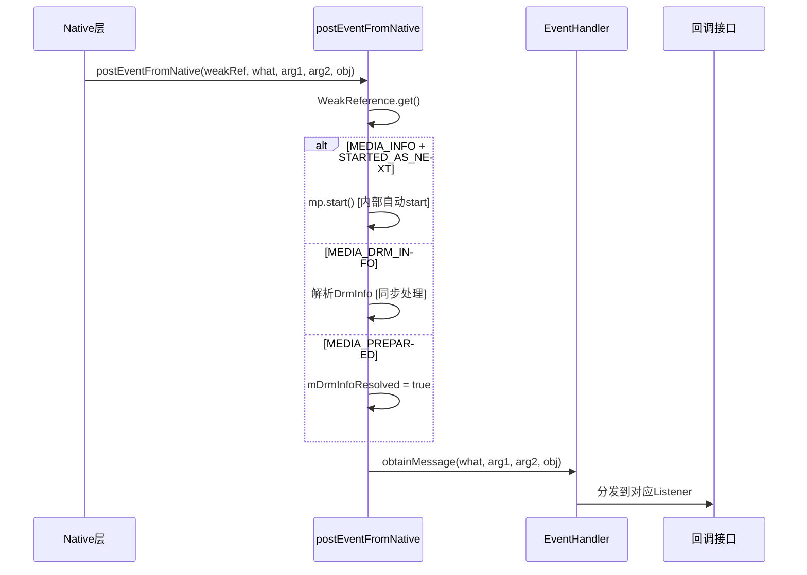
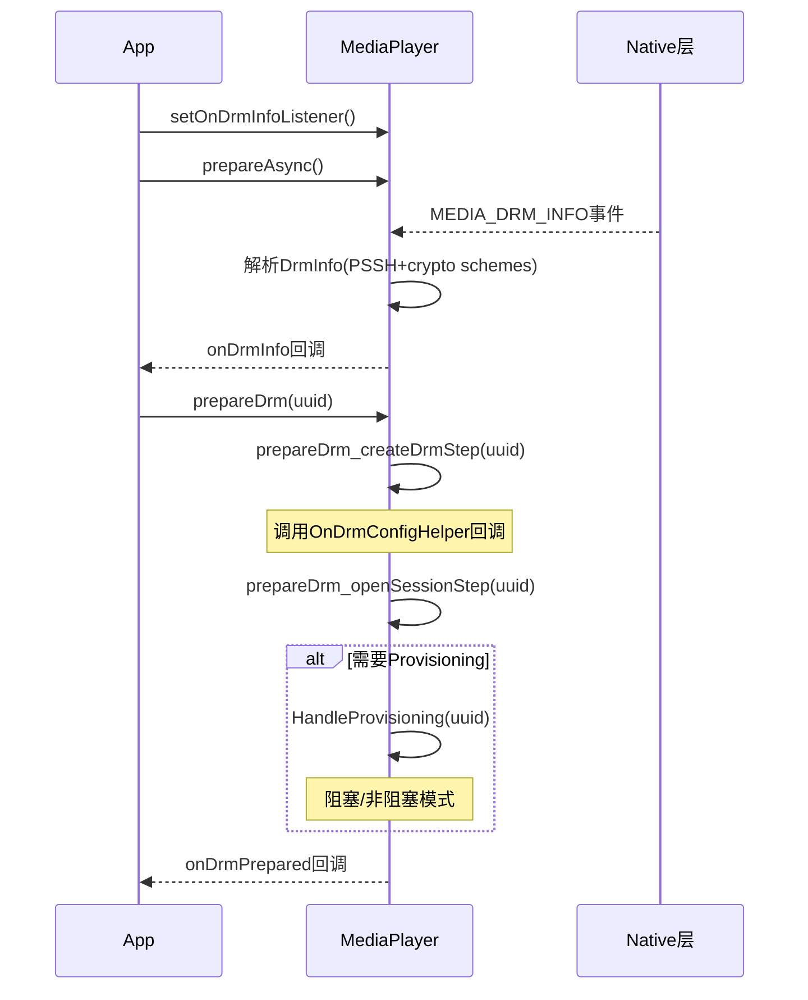

[← 2.6 AudioEffect — 音效](02_2.6_AudioEffect.md) | [← 返回Application Layer — 应用层API深度解析](README.md) | [返回导航](../README.md) | [2.8 SoundPool — 短音效播 →](02_2.8_SoundPool.md)

---

## 2.7 MediaPlayer — 多媒体播放器深度解析

### 2.7.1 模块职责与源码位置

MediaPlayer是Android最常用的多媒体播放API，支持音视频文件/流媒体播放。内部通过Native MediaPlayerService调用NuPlayer+MediaCodec解码，最终通过AudioSink→AudioTrack输出PCM音频。

**源码位置**：
- Java层：[`MediaPlayer.java`](frameworks/base/media/java/android/media/MediaPlayer.java)（5700+行）
- Native Binder：[`mediaplayer.cpp`](frameworks/av/media/libmedia/mediaplayer.cpp)
- MediaPlayerService：[`MediaPlayerService.cpp`](frameworks/av/media/libmediaplayerservice/MediaPlayerService.cpp)
- NuPlayerDriver：[`NuPlayerDriver.cpp`](frameworks/av/media/libmediaplayerservice/nuplayer/NuPlayerDriver.cpp)
- NuPlayer：[`NuPlayer.cpp`](frameworks/av/media/libmediaplayerservice/nuplayer/NuPlayer.cpp)

**类定义**（[`MediaPlayer.java`](frameworks/base/media/java/android/media/MediaPlayer.java:600)）：
```java
public class MediaPlayer extends PlayerBase
        implements VolumeAutomation, AudioRouting, MeteringDataPlayer {
    private long mNativeContext;     // Native层MediaPlayer指针
    private long mNativeSurfaceTexture; // SurfaceTexture指针
    private int  mListenerContext;   // 回调上下文
}
```

### 2.7.2 完整音频数据路径



**数据流核心**：NuPlayer架构取代了旧Stagefright，NuPlayerDecoder通过`MediaCodec`异步解码音频帧，NuPlayerRenderer负责音频/视频同步后通过AudioSink写入AudioTrack。

### 2.7.3 构造流程源码级解析

MediaPlayer提供3种构造方式（[`MediaPlayer.java`](frameworks/base/media/java/android/media/MediaPlayer.java:663)）：



**构造核心逻辑**（[`MediaPlayer.java`](frameworks/base/media/java/android/media/MediaPlayer.java:683)）：
```java
private MediaPlayer(Context context, int sessionId) {
    super(new AudioAttributes.Builder().build(), 0);
    // 从context获取设备特定sessionId
    int deviceSessionId = AudioSystem.getDeviceSessionId(sessionId);
    native_setup(new WeakReference<>(this),
        attributionSourceState.getParcel(),
        deviceSessionId > 0 ? deviceSessionId : sessionId);
}
```

### 2.7.4 完整状态机



**关键状态转换规则**：
- `create()`工厂方法创建的MediaPlayer直接进入Prepared状态，跳过Idle→setDataSource→prepare流程
- Error状态后必须调用`reset()`才能恢复，不能直接重试操作
- `release()`是终态，调用后对象不可再使用
- `prepare()`同步阻塞，适合本地文件；`prepareAsync()`异步回调，适合网络流
- Idle状态(new后)调用方法不会触发OnErrorListener；Idle状态(reset后)调用方法会触发OnErrorListener并进入Error状态

### 2.7.5 setDataSource方法族

MediaPlayer提供6种setDataSource重载（[`MediaPlayer.java`](frameworks/base/media/java/android/media/MediaPlayer.java:1047)）：

| 方法签名 | 适用场景 | Native调用 |
|----------|---------|-----------|
| `setDataSource(Context, Uri)` | ContentProvider/网络URI | `nativeSetDataSource(IMediaDataSource, headers)` |
| `setDataSource(Context, Uri, Map)` | 带HTTP头URI | `nativeSetDataSource(IMediaDataSource, headers)` |
| `setDataSource(String path)` | 本地文件路径 | `nativeSetDataSource(path, keys, values, cookies)` |
| `setDataSource(String, Map)` | 带头本地路径 | `nativeSetDataSource(path, keys, values, cookies)` |
| `setDataSource(FileDescriptor, long, long)` | 文件描述符+偏移 | `_setDataSource(fd, offset, length)` |
| `setDataSource(MediaDataSource)` | 自定义数据源 | `_setDataSource(MediaDataSource)` |

**URI解析流程**（[`MediaPlayer.java`](frameworks/base/media/java/android/media/MediaPlayer.java:1148)）：
```java
private boolean attemptDataSource(ContentResolver resolver, Uri uri) {
    // 1. 尝试打开asset文件
    AssetFileDescriptor afd = resolver.openAssetFileDescriptor(uri, "r");
    if (afd != null) {
        _setDataSource(afd.getFileDescriptor(), afd.getStartOffset(), afd.getLength());
        afd.close();
        return true;
    }
    // 2. 尝试打开普通文件
    // 3. 失败返回false
    return false;
}
```

### 2.7.6 prepare与prepareAsync

**同步prepare**（[`MediaPlayer.java`](frameworks/base/media/java/android/media/MediaPlayer.java:1334)）：
```java
public void prepare() throws IOException, IllegalStateException {
    // 创建PlayerIId Parcel用于跟踪
    Parcel piidParcel = createPlayerIIdParcel();
    _prepare(piidParcel);  // native同步阻塞
    // prepare返回后DRM信息一定已解析
    synchronized (mDrmLock) {
        mDrmInfoResolved = true;
    }
}
private native int _prepare(Parcel piidParcel) throws IOException, IllegalStateException;
```

**异步prepareAsync**（[`MediaPlayer.java`](frameworks/base/media/java/android/media/MediaPlayer.java:1366)）：
```java
public void prepareAsync() throws IllegalStateException {
    Parcel piidParcel = createPlayerIIdParcel();
    _prepareAsync(piidParcel);  // native异步，立即返回
    // DRM信息通过MEDIA_DRM_INFO事件异步获取
}
private native int _prepareAsync(Parcel piidParcel) throws IllegalStateException;
```

### 2.7.7 播放控制方法

**start**（[`MediaPlayer.java`](frameworks/base/media/java/android/media/MediaPlayer.java:1389)）：
```java
public void start() throws IllegalStateException {
    // 在baseStart()前获取音频流类型
    baseStart();  // PlayerBase: 请求音频焦点
    startImpl();
}
private void startImpl() {
    _start();  // native调用
    stayAwake(true);  // 获取WakeLock
}
private native void _start() throws IllegalStateException;
```

**pause/stop**（[`MediaPlayer.java`](frameworks/base/media/java/android/media/MediaPlayer.java:1440)）：
```java
public void stop() throws IllegalStateException {
    _stop();  // native调用
    stayAwake(false);
}
private native void _stop() throws IllegalStateException;

public void pause() throws IllegalStateException {
    _pause();  // native调用
    stayAwake(false);
}
private native void _pause() throws IllegalStateException;
```

**seekTo**（[`MediaPlayer.java`](frameworks/base/media/java/android/media/MediaPlayer.java:1993)）：
```java
// 3种Seek模式
SEEK_PREVIOUS_SYNC = 0   // 前一个同步点（默认）
SEEK_NEXT_SYNC = 1       // 后一个同步点
SEEK_CLOSEST_SYNC = 2    // 最近同步点
private native final void _seekTo(long msec, int mode);
```

### 2.7.8 NuPlayer架构详解



**NuPlayerDriver**是MediaPlayerInterface的实现，将MediaPlayerService的Client请求翻译为NuPlayer的异步消息调用。AudioOutput类实现AudioSink接口，内部持有AudioTrack实例。

### 2.7.9 AudioOutput→AudioTrack衔接机制

AudioOutput是MediaPlayerService内部对AudioSink的实现：



**关键衔接逻辑**：
1. `AudioOutput::open()`从NuPlayerRenderer接收音频格式参数（采样率、声道数、PCM格式），创建对应AudioTrack
2. App通过`MediaPlayer.setAudioAttributes()`设置的AudioAttributes，传递到AudioOutput→AudioTrack
3. NuPlayerRenderer在`onOpenAudioSink()`中调用`mAudioSink->open()`，在`onAudioDrain()`中调用`mAudioSink->write()`

### 2.7.10 Offload模式深度解析

MediaPlayer支持Audio Offload——将压缩音频直接传递到DSP硬件解码：

```mermaid
flowchart TB
    subgraph "Offload路径"
        NP_OFF["NuPlayer<br>检测Offload可用性"] -->|"压缩码流<br>（不解码）"| PT["NuPlayerDecoder<br>PassThrough"]
        PT -->|"压缩数据"| REN_OFF["Renderer<br>（Offload模式）"]
        REN_OFF -->|"write压缩数据"| AOS_OFF["AudioOutput<br>（Offload AudioSink）"]
        AOS_OFF -->|"AUDIO_OUTPUT_FLAG_COMPRESS_OFFLOAD"| AT_OFF["AudioTrack<br>（Offload模式）"]
        AT_OFF --> DSP["DSP硬件解码<br>→ AudioFlinger"]
    end

    subgraph "Normal路径"
        NP_NORM["NuPlayer"] -->|"解码→PCM"| DEC_NORM["NuPlayerDecoder<br>（MediaCodec）"]
        DEC_NORM -->|"PCM帧"| REN_NORM["Renderer"]
        REN_NORM -->|"write PCM"| AOS_NORM["AudioOutput"]
        AOS_NORM --> AT_NORM["AudioTrack<br>（正常PCM模式）"]
        AT_NORM --> AF_NORM["AudioFlinger"]
    end
```



**Offload限制**：
- 仅支持特定格式（AAC/MP3/FLAC等），由AudioPolicy判断
- Pause超过一定时间后需切换回Normal模式（DSP资源回收）
- 不支持音效处理（Offload绕过了AudioFlinger的EffectChain）
- seek时需flush AudioTrack并重新提交数据

### 2.7.11 回调事件体系

MediaPlayer定义了丰富的事件回调系统，所有事件通过Native JNI回调[`postEventFromNative()`](frameworks/base/media/java/android/media/MediaPlayer.java:3815)分发：



**回调接口完整列表**：

| 回调接口 | 设置方法 | 触发事件 | 触发时机 |
|----------|---------|---------|---------|
| OnPreparedListener | setOnPreparedListener | MEDIA_PREPARED | prepareAsync完成 |
| OnCompletionListener | setOnCompletionListener | MEDIA_PLAYBACK_COMPLETE | 播放到末尾 |
| OnSeekCompleteListener | setOnSeekCompleteListener | MEDIA_SEEK_COMPLETE | seek完成 |
| OnErrorListener | setOnErrorListener | MEDIA_ERROR | 异步错误 |
| OnInfoListener | setOnInfoListener | MEDIA_INFO | 信息/警告 |
| OnBufferingUpdateListener | setOnBufferingUpdateListener | MEDIA_BUFFERING_UPDATE | 缓冲进度 |
| OnVideoSizeChangedListener | setOnVideoSizeChangedListener | MEDIA_SET_VIDEO_SIZE | 视频尺寸变化 |
| OnTimedTextListener | setOnTimedTextListener | MEDIA_TIMED_TEXT | 定时文本 |
| OnDrmInfoListener | setOnDrmInfoListener | MEDIA_DRM_INFO | DRM信息可用 |
| OnDrmPreparedListener | setOnDrmPreparedListener | - | DRM准备完成 |
| OnTimedMetaDataAvailableListener | setOnTimedMetaDataAvailableListener | - | 定时元数据 |

**内部完成监听器**（[`MediaPlayer.java`](frameworks/base/media/java/android/media/MediaPlayer.java:3932)）：
```java
private final OnCompletionListener mOnCompletionInternalListener = new OnCompletionListener() {
    @Override
    public void onCompletion(MediaPlayer mp) {
        tryToDisableNativeRoutingCallback();
        baseStop();  // PlayerBase: 释放音频焦点
    }
};
```

### 2.7.12 错误码与INFO码体系

**错误码**（[`MediaPlayer.java`](frameworks/base/media/java/android/media/MediaPlayer.java:4408)）：

| 常量 | 值 | 含义 |
|------|---|------|
| MEDIA_ERROR_UNKNOWN | 1 | 未指定错误 |
| MEDIA_ERROR_SERVER_DIED | 100 | mediaserver进程死亡，必须重新创建MediaPlayer |
| MEDIA_ERROR_NOT_VALID_FOR_PROGRESSIVE_PLAYBACK | 200 | 视频索引不在文件开头 |
| MEDIA_ERROR_IO | -1004 | 文件/网络IO错误 |
| MEDIA_ERROR_MALFORMED | -1007 | 码流不符合编码标准 |
| MEDIA_ERROR_UNSUPPORTED | -1010 | 框架不支持该特性 |
| MEDIA_ERROR_TIMED_OUT | -110 | 操作超时（3-5秒） |
| MEDIA_ERROR_SYSTEM | -2147483648 | 底层系统错误 |

**INFO码**（[`MediaPlayer.java`](frameworks/base/media/java/android/media/MediaPlayer.java:4493)）：

| 常量 | 值 | 含义 |
|------|---|------|
| MEDIA_INFO_UNKNOWN | 1 | 未指定信息 |
| MEDIA_INFO_STARTED_AS_NEXT | 2 | 作为next player自动启动 |
| MEDIA_INFO_VIDEO_RENDERING_START | 3 | 首帧视频渲染 |
| MEDIA_INFO_VIDEO_TRACK_LAGGING | 700 | 视频解码滞后 |
| MEDIA_INFO_BUFFERING_START | 701 | 开始缓冲 |
| MEDIA_INFO_BUFFERING_END | 702 | 缓冲结束 |
| MEDIA_INFO_NETWORK_BANDWIDTH | 703 | 网络带宽信息(kbps) |
| MEDIA_INFO_BAD_INTERLEAVING | 800 | 音视频交错不良 |
| MEDIA_INFO_NOT_SEEKABLE | 801 | 不可seek（直播流） |
| MEDIA_INFO_METADATA_UPDATE | 802 | 元数据更新 |
| MEDIA_INFO_AUDIO_NOT_PLAYING | 804 | 音频未播放 |
| MEDIA_INFO_VIDEO_NOT_PLAYING | 805 | 视频未播放 |
| MEDIA_INFO_TIMED_TEXT_ERROR | 900 | 定时文本错误 |
| MEDIA_INFO_UNSUPPORTED_SUBTITLE | 901 | 不支持的字幕 |
| MEDIA_INFO_SUBTITLE_TIMED_OUT | 902 | 字幕读取超时 |

### 2.7.13 播放速率与音调控制

MediaPlayer支持3种音频变速模式（[`MediaPlayer.java`](frameworks/base/media/java/android/media/MediaPlayer.java:1819)）：

| 模式 | 常量 | 行为 |
|------|------|------|
| DEFAULT | PLAYBACK_RATE_AUDIO_MODE_DEFAULT(0) | 保持音调，超出范围自动静音 |
| STRETCH | PLAYBACK_RATE_AUDIO_MODE_STRETCH(1) | 时间拉伸保持音调，超范围失败 |
| RESAMPLE | PLAYBACK_RATE_AUDIO_MODE_RESAMPLE(2) | 重采样变速，音调随速率变化 |

```java
// easyPlaybackParams构建PlaybackParams
public PlaybackParams easyPlaybackParams(float rate, int audioMode) {
    PlaybackParams params = new PlaybackParams();
    params.allowDefaults();
    switch (audioMode) {
    case PLAYBACK_RATE_AUDIO_MODE_DEFAULT:
        params.setSpeed(rate).setPitch(1.0f); break;
    case PLAYBACK_RATE_AUDIO_MODE_STRETCH:
        params.setSpeed(rate).setPitch(1.0f)
            .setAudioFallbackMode(params.AUDIO_FALLBACK_MODE_FAIL); break;
    case PLAYBACK_RATE_AUDIO_MODE_RESAMPLE:
        params.setSpeed(rate).setPitch(rate); break;  // 音调随速率变
    }
    return params;
}
```

**Native方法**：
- [`setPlaybackParams(PlaybackParams)`](frameworks/base/media/java/android/media/MediaPlayer.java:1908) — 设置播放参数
- [`getPlaybackParams()`](frameworks/base/media/java/android/media/MediaPlayer.java:1918) — 获取当前播放参数
- [`setSyncParams(SyncParams)`](frameworks/base/media/java/android/media/MediaPlayer.java:1929) — 设置音视频同步参数
- [`getSyncParams()`](frameworks/base/media/java/android/media/MediaPlayer.java:1940) — 获取同步参数

### 2.7.14 音量控制与VolumeShaper

**基础音量控制**（[`MediaPlayer.java`](frameworks/base/media/java/android/media/MediaPlayer.java:2360)）：
```java
public native void setLooping(boolean looping);
public native boolean isLooping();
private native void _setVolume(float leftVolume, float rightVolume);
// 便利方法
public void setVolume(float volume) { setVolume(volume, volume); }
```

**VolumeShaper**（[`MediaPlayer.java`](frameworks/base/media/java/android/media/MediaPlayer.java:1482)）：
```java
// 应用VolumeShaper配置
private native int native_applyVolumeShaper(
    @NonNull VolumeShaper.Configuration configuration,
    @NonNull VolumeShaper.Operation operation);
// 获取VolumeShaper状态
private native @Nullable VolumeShaper.State native_getVolumeShaperState(int id);
// 创建VolumeShaper
public @NonNull VolumeShaper createVolumeShaper(
    @NonNull VolumeShaper.Configuration configuration) { ... }
```

VolumeShaper用于实现平滑的音量渐变效果（如Ducking、淡入淡出），由AudioFlinger的VolumeShaper处理器执行。

### 2.7.15 音频会话与辅助音效

**AudioSessionId**（[`MediaPlayer.java`](frameworks/base/media/java/android/media/MediaPlayer.java:2425)）：
```java
// 设置音频会话ID（必须在setDataSource前调用）
public void setAudioSessionId(int sessionId) {
    native_setAudioSessionId(sessionId);
    baseUpdateSessionId(sessionId);
}
// 获取音频会话ID
public native int getAudioSessionId();
```

**辅助音效**（[`MediaPlayer.java`](frameworks/base/media/java/android/media/MediaPlayer.java:2455)）：
```java
// 附加辅助音效（如环境混响）
public native void attachAuxEffect(int effectId);
// 设置辅助音效发送电平（0.0~1.0）
private native void _setAuxEffectSendLevel(float level);
```

### 2.7.16 音频路由控制

MediaPlayer实现了`AudioRouting`接口（[`MediaPlayer.java`](frameworks/base/media/java/android/media/MediaPlayer.java:1516)）：

```java
// 设置首选输出设备
public boolean setPreferredDevice(AudioDeviceInfo deviceInfo) {
    boolean status = native_setOutputDevice(preferredDeviceId);
    ...
}
// 获取首选输出设备
public AudioDeviceInfo getPreferredDevice() { ... }
// 获取当前路由设备
public AudioDeviceInfo getRoutedDevice() {
    int deviceId = native_getRoutedDeviceId();
    ...
}
// 设置路由变化回调
public void setOnRoutingChangedListener(OnRoutingChangedListener listener, Handler handler) { ... }
```

**Native路由方法**：
- [`native_setOutputDevice(int deviceId)`](frameworks/base/media/java/android/media/MediaPlayer.java:1675) — 设置输出设备
- [`native_getRoutedDeviceId()`](frameworks/base/media/java/android/media/MediaPlayer.java:1676) — 获取路由设备ID
- [`native_enableDeviceCallback(boolean enabled)`](frameworks/base/media/java/android/media/MediaPlayer.java:1677) — 启用设备回调

### 2.7.17 TrackInfo与轨道选择

**TrackInfo内部类**（[`MediaPlayer.java`](frameworks/base/media/java/android/media/MediaPlayer.java:2530)）：

| 轨道类型常量 | 值 | 含义 |
|------------|---|------|
| MEDIA_TRACK_TYPE_UNKNOWN | 0 | 未知类型 |
| MEDIA_TRACK_TYPE_VIDEO | 1 | 视频轨道 |
| MEDIA_TRACK_TYPE_AUDIO | 2 | 音频轨道 |
| MEDIA_TRACK_TYPE_TIMEDTEXT | 3 | 定时文本 |
| MEDIA_TRACK_TYPE_SUBTITLE | 4 | 字幕 |
| MEDIA_TRACK_TYPE_METADATA | 5 | 元数据 |

**轨道选择API**：
```java
// 获取所有轨道信息
public TrackInfo[] getTrackInfo() { ... }
// 选择轨道（仅音频/字幕/定时文本可运行时选择）
public void selectTrack(int index) { ... }
// 取消选择轨道
public void deselectTrack(int index) { ... }
// 获取当前选中的轨道索引
public int getSelectedTrack(int trackType) { ... }
```

**Haptic通道检测**（[`MediaPlayer.java`](frameworks/base/media/java/android/media/MediaPlayer.java:2554)）：
```java
public boolean hasHapticChannels() {
    return mFormat != null && mFormat.containsKey(MediaFormat.KEY_HAPTIC_CHANNEL_COUNT)
            && mFormat.getInteger(MediaFormat.KEY_HAPTIC_CHANNEL_COUNT) > 0;
}
```

### 2.7.18 WakeLock与屏幕控制

**WakeLock**（[`MediaPlayer.java`](frameworks/base/media/java/android/media/MediaPlayer.java:1693)）：
```java
public void setWakeMode(Context context, int mode) {
    // audio.offload.ignore_setawake属性可忽略WakeLock
    if (SystemProperties.getBoolean("audio.offload.ignore_setawake", false)) return;
    PowerManager pm = (PowerManager)context.getSystemService(Context.POWER_SERVICE);
    mWakeLock = pm.newWakeLock(mode|PowerManager.ON_AFTER_RELEASE, MediaPlayer.class.getName());
    mWakeLock.setReferenceCounted(false);
}
```

**屏幕保持**（[`MediaPlayer.java`](frameworks/base/media/java/android/media/MediaPlayer.java:1731)）：
```java
public void setScreenOnWhilePlaying(boolean screenOn) {
    if (mScreenOnWhilePlaying != screenOn) {
        mScreenOnWhilePlaying = screenOn;
        updateSurfaceScreenOn();  // SurfaceHolder.setKeepScreenOn()
    }
}
private void stayAwake(boolean awake) {
    if (mWakeLock != null) {
        if (awake && !mWakeLock.isHeld()) mWakeLock.acquire();
        else if (!awake && mWakeLock.isHeld()) mWakeLock.release();
    }
    mStayAwake = awake;
    updateSurfaceScreenOn();
}
```

### 2.7.19 无缝播放切换

**setNextMediaPlayer**（[`MediaPlayer.java`](frameworks/base/media/java/android/media/MediaPlayer.java:2202)）：
```java
public native void setNextMediaPlayer(MediaPlayer next);
```

当当前MediaPlayer播放完成时，框架自动无缝切换到next MediaPlayer。next player必须已prepare完成，且不应手动调用start()。如果当前player正在looping，next player不会被启动。

**内部实现**：Native层通过`MEDIA_INFO_STARTED_AS_NEXT`事件触发（[`MediaPlayer.java`](frameworks/base/media/java/android/media/MediaPlayer.java:3824)）：
```java
case MEDIA_INFO:
    if (arg1 == MEDIA_INFO_STARTED_AS_NEXT) {
        new Thread(new Runnable() {
            public void run() { mp.start(); }
        }).start();
        Thread.yield();
    }
    break;
```

### 2.7.20 DRM支持

MediaPlayer集成了Modular DRM框架（[`MediaPlayer.java`](frameworks/base/media/java/android/media/MediaPlayer.java:4636)）：



**DRM相关回调**：
- `OnDrmConfigHelper` — DRM配置回调（只能调用getDrmPropertyString/setDrmPropertyString）
- `OnDrmInfoListener` — DRM信息可用回调
- `OnDrmPreparedListener` — DRM准备完成回调

### 2.7.21 Native方法签名完整列表

| Native方法 | 行号 | 功能 |
|-----------|------|------|
| `native_init()` | L2518 | 静态初始化 |
| `native_setup(Object, Parcel, int)` | L2519 | 创建Native MediaPlayer |
| `native_finalize()` | L2521 | Native资源释放 |
| `_setVideoSurface(Surface)` | L728 | 设置视频Surface |
| `nativeSetDataSource(IMediaDataSource, String[])` | L1240 | URI数据源 |
| `_setDataSource(FileDescriptor, long, long)` | L1307 | FD数据源 |
| `_setDataSource(MediaDataSource)` | L1322 | 自定义数据源 |
| `_prepare(Parcel)` | L1354 | 同步准备 |
| `_prepareAsync(Parcel)` | L1379 | 异步准备 |
| `_start()` | L1422 | 开始播放 |
| `_stop()` | L1447 | 停止 |
| `_pause()` | L1461 | 暂停 |
| `_seekTo(long, int)` | L1993 | Seek |
| `getCurrentPosition()` | L2090 | 当前位置 |
| `getDuration()` | L2098 | 总时长 |
| `isPlaying()` | L1805 | 是否播放中 |
| `getVideoWidth()` | L1768 | 视频宽度 |
| `getVideoHeight()` | L1779 | 视频高度 |
| `setPlaybackParams(PlaybackParams)` | L1908 | 播放参数 |
| `getPlaybackParams()` | L1918 | 获取播放参数 |
| `setSyncParams(SyncParams)` | L1929 | 同步参数 |
| `getSyncParams()` | L1940 | 获取同步参数 |
| `setLooping(boolean)` | L2361 | 循环播放 |
| `isLooping()` | L2368 | 是否循环 |
| `_setVolume(float, float)` | L2396 | 音量 |
| `native_setAudioSessionId(int)` | L2431 | 音频会话ID |
| `getAudioSessionId()` | L2439 | 获取会话ID |
| `attachAuxEffect(int)` | L2455 | 附加辅助音效 |
| `_setAuxEffectSendLevel(float)` | L2480 | 辅助发送电平 |
| `setNextMediaPlayer(MediaPlayer)` | L2202 | 下一个播放器 |
| `_release()` | L2246 | 释放 |
| `_reset()` | L2289 | 重置 |
| `native_invoke(Parcel, Parcel)` | L2489 | 通用命令 |
| `native_getMetadata(boolean, boolean, Parcel)` | L2505 | 获取元数据 |
| `native_setMetadataFilter(Parcel)` | L2516 | 设置元数据过滤 |
| `native_getMetrics()` | L1796 | 获取Metrics |
| `native_applyVolumeShaper(Configuration, Operation)` | L1496 | VolumeShaper |
| `native_getVolumeShaperState(int)` | L1500 | VolumeShaper状态 |
| `native_setOutputDevice(int)` | L1675 | 设置输出设备 |
| `native_getRoutedDeviceId()` | L1676 | 获取路由设备 |
| `native_enableDeviceCallback(boolean)` | L1677 | 设备回调 |
| `native_pullBatteryData(Parcel)` | L3393 | 电池数据 |
| `native_setRetransmitEndpoint(String, int)` | L3440 | 重传端点 |
| `_releaseDrm()` | L5082 | 释放DRM |
| `_prepareDrm(byte[], byte[])` | L5539 | 准备DRM |
| `_getAudioStreamType()` | L1432 | 获取音频流类型 |

### 2.7.22 关键API使用模式

**典型播放流程**：
```java
// 1. 创建与配置
MediaPlayer mp = new MediaPlayer();
mp.setAudioAttributes(new AudioAttributes.Builder()
    .setUsage(AudioAttributes.USAGE_MEDIA)
    .setContentType(AudioAttributes.CONTENT_TYPE_MUSIC)
    .build());
mp.setDataSource(context, uri);

// 2. 异步准备（推荐）
mp.prepareAsync();
mp.setOnPreparedListener((mp1) -> mp1.start());

// 3. 播放控制
mp.start();        // → STARTED
mp.pause();        // → PAUSED
mp.seekTo(position, SEEK_CLOSEST_SYNC);
mp.stop();         // → STOPPED

// 4. 释放资源（必须）
mp.release();      // → END
```

**MediaPlayer vs ExoPlayer选择建议**：

| 特性 | MediaPlayer | ExoPlayer |
|------|-----------|-----------|
| API稳定性 | 系统API，向后兼容 | 库API，跟随版本更新 |
| 格式支持 | 依赖系统解码器 | 扩展性好，支持DASH/HLS/SmoothStreaming |
| 自定义 | 有限 | 高度可定制 |
| DRM | Modular DRM | Widevine + 自定义DRM |
| 后台播放 | 需配合Service | 同左 |
| 性能开销 | 较低 | 略高 |

---

[← 2.6 AudioEffect — 音效](02_2.6_AudioEffect.md) | [← 返回Application Layer — 应用层API深度解析](README.md) | [返回导航](../README.md) | [2.8 SoundPool — 短音效播 →](02_2.8_SoundPool.md)