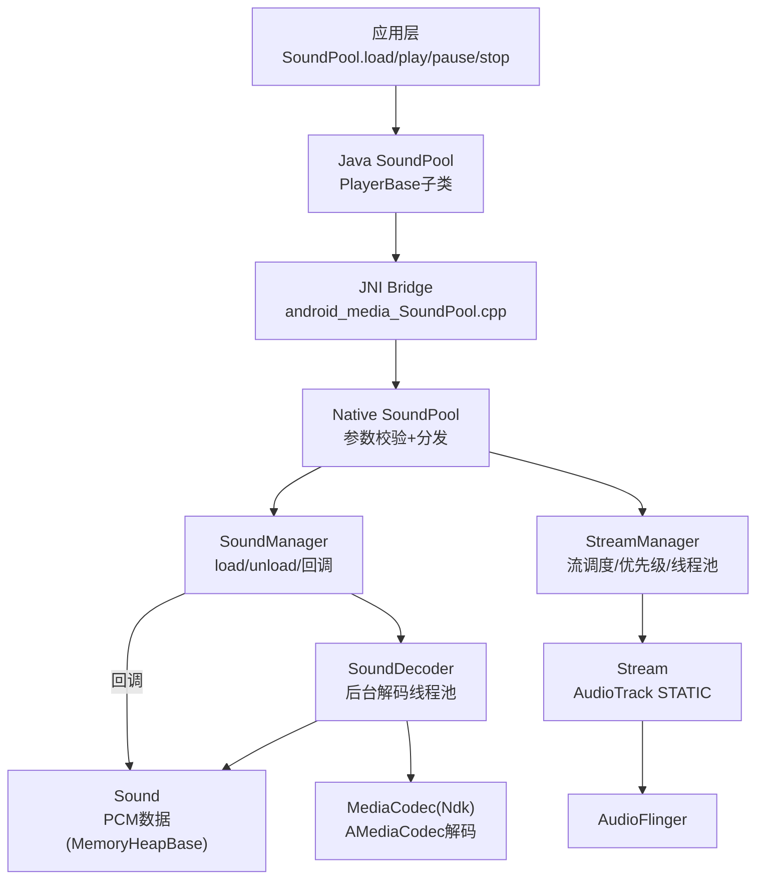
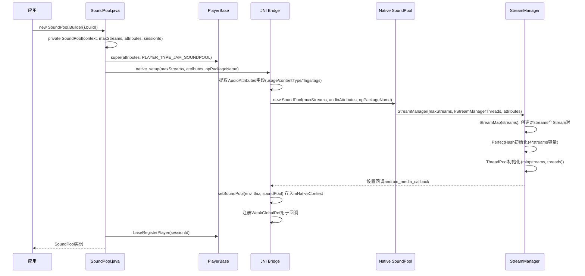
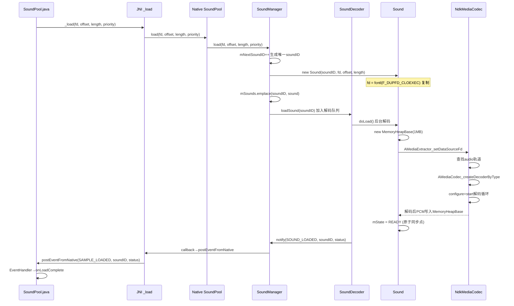
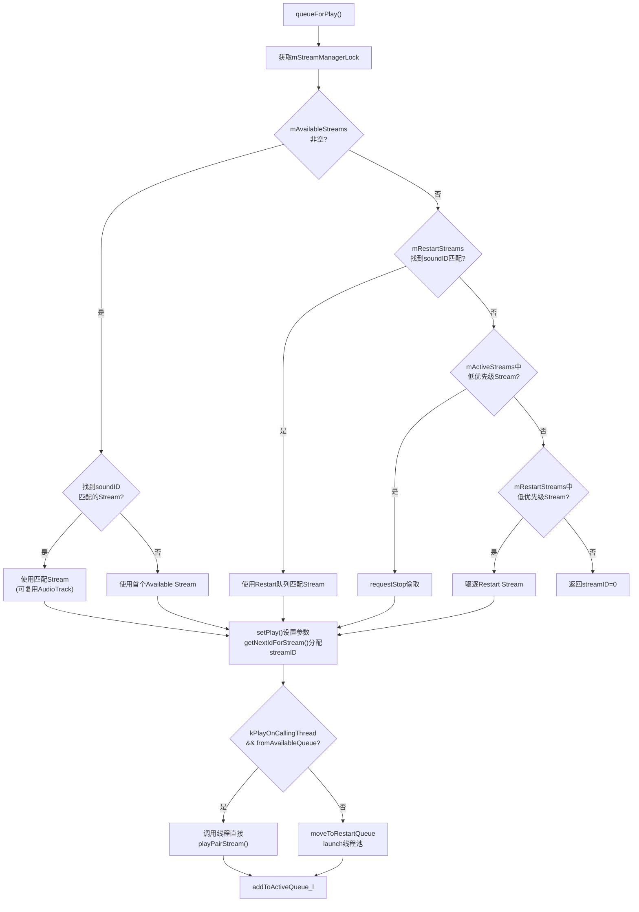
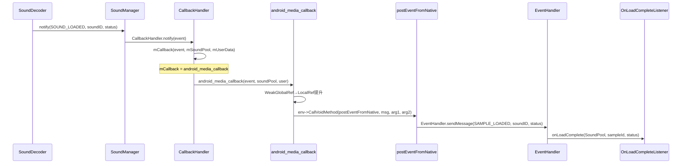
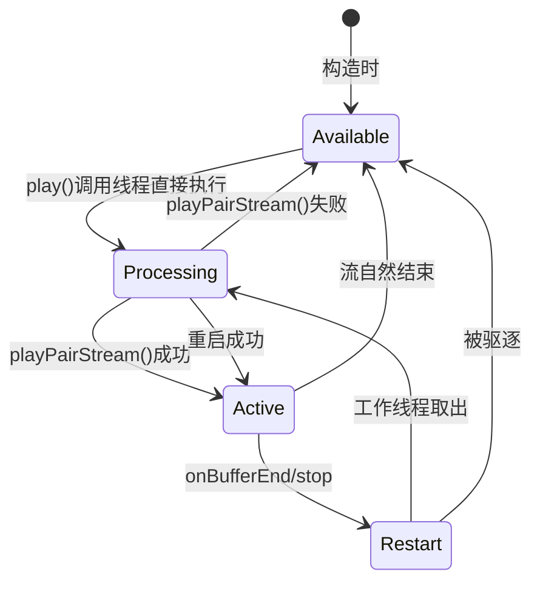
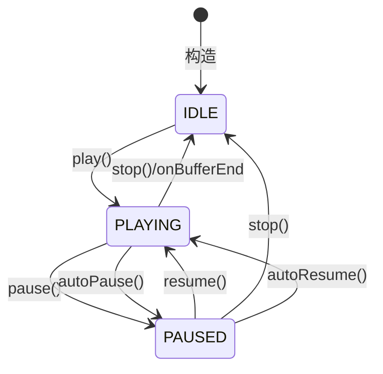

[← 2.7 MediaPlayer](02_2.7_MediaPlayer.md) | [← 返回Application Layer](README.md) | [返回导航](../README.md) | [2.9 MediaRecorder →](02_2.9_MediaRecorder.md)

---

## 2.8 SoundPool — 短音效播放引擎

### 2.8.1 模块职责与源码位置

SoundPool是Android专为短音效设计的低延迟播放引擎，核心特性包括：

- **预解码到内存**：加载时通过MediaCodec将音频解码为16-bit PCM，播放时无需实时解码
- **多流并发**：支持maxStreams个音效同时播放，超限时按优先级+年龄自动淘汰
- **流式控制**：每个播放实例(streamID)可独立控制音量/速率/循环/优先级
- **极低延迟**：PCM数据在内存中，播放时直接创建AudioTrack的STATIC模式写入

**源码位置**：

| 层级 | 文件 | 行数 | 职责 |
|------|------|------|------|
| Java API | [`SoundPool.java`](frameworks/base/media/java/android/media/SoundPool.java) | 651 | 公共API，Builder模式 |
| JNI桥接 | [`android_media_SoundPool.cpp`](frameworks/base/media/jni/soundpool/android_media_SoundPool.cpp) | 692 | JNI方法注册+回调分发 |
| Native核心 | [`SoundPool.h/cpp`](frameworks/base/media/jni/soundpool/SoundPool.h) | 76/249 | Native SoundPool，分发到Manager |
| Sound管理 | [`SoundManager.h/cpp`](frameworks/base/media/jni/soundpool/SoundManager.h) | 114/105 | 加载/卸载/回调管理 |
| 解码器 | [`SoundDecoder.h/cpp`](frameworks/base/media/jni/soundpool/SoundDecoder.h) | 53/116 | 后台解码线程池 |
| Sound数据 | [`Sound.h/cpp`](frameworks/base/media/jni/soundpool/Sound.h) | 94/244 | PCM数据存储+解码逻辑 |
| Stream管理 | [`StreamManager.h/cpp`](frameworks/base/media/jni/soundpool/StreamManager.h) | 491/454 | 流调度+优先级淘汰+线程池 |
| Stream播放 | [`Stream.h/cpp`](frameworks/base/media/jni/soundpool/Stream.h) | 191/475 | AudioTrack创建/播放/回调 |

### 2.8.2 整体架构



### 2.8.3 核心概念：soundID vs streamID

SoundPool中两个核心ID容易混淆，其区别至关重要：

| 维度 | soundID | streamID |
|------|---------|----------|
| 来源 | [`load()`](frameworks/base/media/java/android/media/SoundPool.java:195) 返回 | [`play()`](frameworks/base/media/java/android/media/SoundPool.java:314) 返回 |
| 语义 | 标识一个已加载的音效样本 | 标识一个正在播放的流实例 |
| 生命周期 | load到unload | play到stop/自然结束 |
| 唯一性 | 全局唯一，SoundPool内递增 | 每次play分配新ID |
| 一对多 | 一个soundID可产生多个streamID | 一个streamID对应一个soundID |
| 操作对象 | load/unload | pause/resume/stop/setVolume/setRate/setLoop/setPriority |
| Native管理 | [`SoundManager.mSounds`](frameworks/base/media/jni/soundpool/SoundManager.h:107) | [`StreamMap.mPerfectHash`](frameworks/base/media/jni/soundpool/StreamManager.h:348) |
| 生成方式 | `mNextSoundID++`，单调递增 | [`PerfectHash.generateKey()`](frameworks/base/media/jni/soundpool/StreamManager.h:245)，O(1)查找 |

### 2.8.4 构造流程源码解析

**2种构造方式**：

```java
// 方式1：旧构造（@Deprecated）
public SoundPool(int maxStreams, int streamType, int srcQuality) {
    this(null, maxStreams,
        new AudioAttributes.Builder()
            .setInternalLegacyStreamType(streamType).build(),
        AUDIO_SESSION_ID_GENERATE);
    PlayerBase.deprecateStreamTypeForPlayback(streamType, "SoundPool", "SoundPool()");
}  // SoundPool.java:151

// 方式2：Builder构造（推荐）
SoundPool sp = new SoundPool.Builder()
    .setMaxStreams(4)
    .setAudioAttributes(new AudioAttributes.Builder()
        .setUsage(AudioAttributes.USAGE_GAME).build())
    .setContext(context)
    .build();
```

**构造时序图**：



**关键实现细节**：

1. [`native_setup()`](frameworks/base/media/jni/soundpool/android_media_SoundPool.cpp:502)：从Java AudioAttributes提取4个字段构造`audio_attributes_t`，自动添加`AUDIO_FLAG_LOW_LATENCY`标志（见[`StreamManager`构造](frameworks/base/media/jni/soundpool/StreamManager.cpp:112)）
2. [`kStreamManagerThreads`](frameworks/base/media/jni/soundpool/SoundPool.cpp:42)：CPU核心数>=4时用2个工作线程，否则1个
3. Stream以**配对**方式创建：`mStreamPoolSize = streams * 2`，每对Stream共享一个AudioTrack

### 2.8.5 load/unload机制深度解析

**4种load重载**：

| 方法签名 | 数据源 | 特殊处理 |
|----------|--------|----------|
| [`load(String path, int priority)`](frameworks/base/media/java/android/media/SoundPool.java:195) | 文件路径 | ParcelFileDescriptor.open→_load |
| [`load(Context context, int resId, int priority)`](frameworks/base/media/java/android/media/SoundPool.java:218) | APK资源 | openRawResourceFd→_load |
| [`load(AssetFileDescriptor afd, int priority)`](frameworks/base/media/java/android/media/SoundPool.java:241) | Asset FD | 检查length>=0，_load |
| [`load(FileDescriptor fd, long offset, long length, int priority)`](frameworks/base/media/java/android/media/SoundPool.java:260) | 原始FD | 直接调用_load |

所有Java层load方法最终调用[`_load(FileDescriptor, long, long, int)`](frameworks/base/media/java/android/media/SoundPool.java:517)，经JNI到Native [`SoundPool::load()`](frameworks/base/media/jni/soundpool/SoundPool.cpp:83)。

**Native加载流程**：



**解码关键约束**：

- [`kDefaultHeapSize = 1MB`](frameworks/base/media/jni/soundpool/Sound.cpp:30)：每个Sound最大1MB PCM存储
- 44.1kHz立体声约5.6秒（`1MB / (44100 * 2 * 2)`），超出部分截断
- 解码使用NdkMediaCodec（非MediaCodec Java API），在后台线程池执行
- [`kDecoderThreads`](frameworks/base/media/jni/soundpool/SoundManager.cpp:28)：CPU>=4核心用2线程，否则1线程
- Sound的`mState`使用`std::atomic<sound_state>`作为同步点，READY后所有字段可安全读取

### 2.8.6 play机制深度解析

**Java层play源码**：

```java
public final int play(int soundID, float leftVolume, float rightVolume,
        int priority, int loop, float rate) {
    baseStart(0);  // PlayerBase: 请求音频焦点
    return _play(soundID, leftVolume, rightVolume, priority, loop, rate, getPlayerIId());
}  // SoundPool.java:314
```

**Native参数校验**（[`SoundPool::play()`](frameworks/base/media/jni/soundpool/SoundPool.cpp:98)）：

| 参数 | 校验规则 | 无效处理 |
|------|----------|----------|
| volume | clamp(0.f, 1.f) | 越界→设为1.f |
| rate | clamp(0.125f, 8.f) | 越界→clamp |
| priority | >= 0 | 负值忽略 |
| loop | >= -1 | 小于-1→设为-1 |

**StreamManager调度流程**（[`queueForPlay()`](frameworks/base/media/jni/soundpool/StreamManager.cpp:155)）：



**Stream配对机制**：SoundPool创建`2*maxStreams`个Stream对象，每两个Stream组成一对。配对机制的核心目的是实现**快速切换**：

- 同一对Stream中，同一时刻只有一个持有AudioTrack
- 新播放请求设置到配对Stream（无AudioTrack），等待当前Stream停止后接管AudioTrack
- 这避免了AudioTrack回调无法动态更换的限制

### 2.8.7 AudioTrack创建与STATIC模式

SoundPool使用AudioTrack的**STATIC模式**（共享内存直传PCM），这是低延迟的关键：

```cpp
// Stream::play_l() - Stream.cpp:329
mAudioTrack = new AudioTrack(
    AUDIO_STREAM_DEFAULT,      // 由AudioAttributes决定
    sampleRate,                 // 解码采样率 * rate
    sound->getFormat(),         // AUDIO_FORMAT_PCM_16_BIT
    channelMask,                // 从Sound获取或按通道数计算
    sound->getIMemory(),        // 关键：共享内存PCM数据
    AUDIO_OUTPUT_FLAG_NONE,     // 不使用offload
    mCallback,                  // StreamCallback
    0,                          // 默认notificationFrames
    AUDIO_SESSION_ALLOCATE,     // 自动分配sessionId
    AudioTrack::TRANSFER_DEFAULT, // 共享内存传输
    nullptr,                    // offloadInfo
    attributionSource,
    mStreamManager->getAttributes(), // 含LOW_LATENCY标志
    false,                      // doNotReconnect
    1.0f);                      // maxRequiredSpeed
```

**关键设计**：

1. **AudioTrack复用**（[`play_l()`](frameworks/base/media/jni/soundpool/Stream.cpp:296)）：如果新play的soundID与现有AudioTrack匹配，且`setSampleRate()`成功，则复用旧AudioTrack
2. **Toggle机制**（[`mToggle`](frameworks/base/media/jni/soundpool/Stream.h:183)）：每次创建新AudioTrack时toggle翻转，用于过滤旧AudioTrack的回调
3. **Static回调**：`onMoreData`/`onUnderrun`/`onMarker`/`onNewPos`/`onStreamEnd`等回调在STATIC模式下不应触发，仅`onBufferEnd`有意义
4. **速率实现**：`sampleRate = lround(sound->getSampleRate() * rate)`，通过AudioTrack的采样率转换实现变速播放

### 2.8.8 优先级与流淘汰机制

当活跃流数超过maxStreams时，SoundPool自动淘汰低优先级流：

**淘汰规则**（按优先级从高到低）：

1. **Available队列**：优先使用空闲Stream（无淘汰）
2. **Restart队列匹配soundID**：优先复用相同音效的Stream（可复用AudioTrack）
3. **Active队列偷取**：从`mActiveStreams`中找最低优先级Stream
4. **Restart队列驱逐**：从`mRestartStreams`中找配对Stream低优先级的

**优先级数值**：优先级从低到高（0=最低），相同优先级按**年龄**淘汰（[`kStealActiveStream_OldestFirst = true`](frameworks/base/media/jni/soundpool/StreamManager.cpp:36)）

**stop时的kStopWaitTimeNs**：

```cpp
inline constexpr int64_t kStopWaitTimeNs = 20 * NANOS_PER_MILLISECOND; // Stream.h:32
```

偷取Stream时等待20ms让音量渐降，避免glitch。

### 2.8.9 播放控制方法

| 方法 | 作用 | Native实现 | 关键逻辑 |
|------|------|-----------|----------|
| [`pause(streamID)`](frameworks/base/media/java/android/media/SoundPool.java:332) | 暂停指定流 | Stream::pause() | 状态PLAYING→PAUSED，AudioTrack.pause() |
| [`resume(streamID)`](frameworks/base/media/java/android/media/SoundPool.java:347) | 恢复指定流 | Stream::resume() | 状态PAUSED→PLAYING，AudioTrack.start() |
| [`autoPause()`](frameworks/base/media/java/android/media/SoundPool.java:360) | 暂停所有流 | Stream::autoPause() | 遍历所有Stream，设mAutoPaused=true |
| [`autoResume()`](frameworks/base/media/java/android/media/SoundPool.java:371) | 恢复autoPause暂停的流 | Stream::autoResume() | 仅恢复mAutoPaused=true的流 |
| [`stop(streamID)`](frameworks/base/media/java/android/media/SoundPool.java:383) | 停止指定流 | Stream::stop()+moveToRestartQueue | 释放AudioTrack资源 |
| [`setVolume(streamID, l, r)`](frameworks/base/media/java/android/media/SoundPool.java:389) | 设置流音量 | Stream::setVolume() | 直接调用AudioTrack.setVolume() |
| [`setPriority(streamID, priority)`](frameworks/base/media/java/android/media/SoundPool.java:429) | 设置流优先级 | Stream::setPriority() | 影响淘汰顺序 |
| [`setLoop(streamID, loop)`](frameworks/base/media/java/android/media/SoundPool.java:443) | 设置循环模式 | Stream::setLoop() | -1=永久循环，0=不循环 |
| [`setRate(streamID, rate)`](frameworks/base/media/java/android/media/SoundPool.java:461) | 设置播放速率 | Stream::setRate() | 0.5~2.0(Java文档)，0.125~8.0(Native) |

**autoPause/autoResume vs pause/resume的区别**：

- `pause/resume`：操作特定streamID，不影响autoPause标志
- `autoPause`：暂停所有正在播放的流，标记`mAutoPaused=true`
- `autoResume`：仅恢复被autoPause暂停的流（`mAutoPaused==true`）

### 2.8.10 回调事件体系

**Java层回调**：

```java
public interface OnLoadCompleteListener {
    void onLoadComplete(SoundPool soundPool, int sampleId, int status);
}  // SoundPool.java:483
```

**回调分发链路**：



**EventHandler线程选择**（[`setOnLoadCompleteListener()`](frameworks/base/media/java/android/media/SoundPool.java:496)）：

1. 优先使用当前线程的Looper
2. 其次使用Main Looper
3. 都不可用则不设置回调

**JNI回调安全机制**：

- Native持有Java SoundPool的`WeakGlobalRef`（见[`getSoundPoolJavaRefManager()`](frameworks/base/media/jni/soundpool/android_media_SoundPool.cpp:274)）
- 回调时先提升为LocalRef，失败则忽略（对象已释放）
- 使用`std::recursive_mutex`允许回调中调用`setCallback()`

### 2.8.11 音量控制与Mute机制

SoundPool的音量控制有特殊设计，与其他PlayerBase子类不同：

```java
// SoundPool.java:389 - 不调用baseSetVolume
public final void setVolume(int streamID, float leftVolume, float rightVolume) {
    _setVolume(streamID, leftVolume, rightVolume); // 直接Native调用
}

// SoundPool.java:414 - playerSetVolume用于mute/unmute
void playerSetVolume(boolean muting, float leftVolume, float rightVolume) {
    _mute(muting); // 不直接控制音量，而是mute/unmute
}
```

**Native mute实现**（[`Stream::mute()`](frameworks/base/media/jni/soundpool/Stream.cpp:62)）：

```cpp
void Stream::mute(bool muting) {
    std::lock_guard lock(mLock);
    mMuted = muting;
    if (mAudioTrack != nullptr) {
        if (mMuted) {
            mAudioTrack->setVolume(0.0f, 0.0f);  // 静音
        } else {
            mAudioTrack->setVolume(mLeftVolume, mRightVolume);  // 恢复原始音量
        }
    }
}
```

**设计原因**：SoundPool管理多个Stream，每个Stream有独立音量，`playerSetVolume`是PlayerBase的全局音量接口，所以只用它做全局mute/unmute。

### 2.8.12 Builder模式详解

```java
public static class Builder {
    private int mMaxStreams = 1;                    // 默认1个并发流
    private AudioAttributes mAudioAttributes;       // 默认null→USAGE_MEDIA
    private Context mContext;                       // 用于AttributionSource
    private int mSessionId = AUDIO_SESSION_ID_GENERATE;  // 自动生成sessionId

    public Builder setMaxStreams(int maxStreams) {
        if (maxStreams <= 0) throw new IllegalArgumentException(...);
        mMaxStreams = maxStreams;
        return this;
    }

    public Builder setAudioAttributes(AudioAttributes attributes) {
        if (attributes == null) throw new IllegalArgumentException(...);
        mAudioAttributes = attributes;
        return this;
    }

    public Builder setAudioSessionId(int sessionId) { ... }
    public Builder setContext(Context context) { ... }

    public SoundPool build() {
        if (mAudioAttributes == null) {
            mAudioAttributes = new AudioAttributes.Builder()
                    .setUsage(AudioAttributes.USAGE_MEDIA).build();
        }
        return new SoundPool(mContext, mMaxStreams, mAudioAttributes, mSessionId);
    }
}  // SoundPool.java:557
```

### 2.8.13 StreamManager四队列调度模型

StreamManager维护4个队列管理Stream生命周期：

| 队列 | 类型 | 含义 | 配对Stream状态 |
|------|------|------|---------------|
| `mAvailableStreams` | unordered_set | 空闲可用的Stream | 也空闲 |
| `mRestartStreams` | multimap<stopTimeNs, Stream*> | 等待停止后重启的Stream | 可能有pending play |
| `mActiveStreams` | list | 正在播放的Stream | 空闲 |
| `mProcessingStreams` | unordered_set | 被工作线程处理的Stream | - |

**队列状态转换**：



**线程池配置**（[`ThreadPool`](frameworks/base/media/jni/soundpool/StreamManager.h:118)）：

- 最大线程数：`min(maxStreams, min(kStreamManagerThreads, hardware_concurrency()))`
- 使用`JavaThread`（非std::thread），因为需要JVM Attach能力
- 线程空闲9秒后自动退出（[`kWaitTimeBeforeCloseNs`](frameworks/base/media/jni/soundpool/StreamManager.cpp:44)）

### 2.8.14 Native方法签名完整列表

| Java方法 | JNI签名 | Native方法 |
|----------|---------|-----------|
| `_load(FileDescriptor, long, long, int)` | `(Ljava/io/FileDescriptor;JJI)I` | `android_media_SoundPool_load_FD` |
| `unload(int)` | `(I)Z` | `android_media_SoundPool_unload` |
| `_play(int, float, float, int, int, float, int)` | `(IFFIIFI)I` | `android_media_SoundPool_play` |
| `pause(int)` | `(I)V` | `android_media_SoundPool_pause` |
| `resume(int)` | `(I)V` | `android_media_SoundPool_resume` |
| `autoPause()` | `()V` | `android_media_SoundPool_autoPause` |
| `autoResume()` | `()V` | `android_media_SoundPool_autoResume` |
| `stop(int)` | `(I)V` | `android_media_SoundPool_stop` |
| `_setVolume(int, float, float)` | `(IFF)V` | `android_media_SoundPool_setVolume` |
| `_mute(boolean)` | `(Z)V` | `android_media_SoundPool_mute` |
| `setPriority(int, int)` | `(II)V` | `android_media_SoundPool_setPriority` |
| `setLoop(int, int)` | `(II)V` | `android_media_SoundPool_setLoop` |
| `setRate(int, float)` | `(IF)V` | `android_media_SoundPool_setRate` |
| `native_setup(int, Object, String)` | `(ILjava/lang/Object;Ljava/lang/String;)I` | `android_media_SoundPool_native_setup` |
| `native_release()` | `()V` | `android_media_SoundPool_release` |

**JNI字段映射**：

```cpp
static struct fields_t {
    jfieldID    mNativeContext;   // SoundPool.mNativeContext (long)
    jmethodID   mPostEvent;       // SoundPool.postEventFromNative(int,int,int,Object)
    jclass      mSoundPoolClass;  // SoundPool class全局引用
} fields;  // android_media_SoundPool.cpp:32
```

### 2.8.15 JNI对象生命周期管理

SoundPool使用`ObjectManager<std::shared_ptr<SoundPool>>`管理Native对象：

```cpp
// android_media_SoundPool.cpp:169
auto& getSoundPoolManager() {
    static ObjectManager<std::shared_ptr<SoundPool>> soundPoolManager(fields.mNativeContext);
    return soundPoolManager;
}
```

- `native_setup()`：创建`std::shared_ptr<SoundPool>`存入Java `mNativeContext`字段
- `native_release()`：设置`nullptr`，引用计数降为0时自动析构Native SoundPool
- 同时维护`ConcurrentHashMap<SoundPool*, shared_ptr<JWeakValue>>`用于回调时的WeakRef查找

### 2.8.16 PlayerBase集成

SoundPool继承[`PlayerBase`](frameworks/base/media/java/android/media/PlayerBase.java)，受系统级音频管理：

| PlayerBase方法 | SoundPool实现 | 说明 |
|----------------|--------------|------|
| `playerSetVolume(muting, l, r)` | `_mute(muting)` | 只用于mute/unmute |
| `playerApplyVolumeShaper()` | return -1 | 不支持VolumeShaper |
| `playerGetVolumeShaperState()` | return null | 不支持VolumeShaper |
| `playerSetAuxEffectSendLevel()` | return SUCCESS | 不支持辅助音效 |
| `playerStart()` | FIXME空实现 | TODO: resume all paused |
| `playerPause()` | FIXME空实现 | TODO: pause all playing |
| `playerStop()` | FIXME空实现 | TODO: stop all playing |

**play()中的baseStart(0)**：每次play()都调用`baseStart(0)`请求音频焦点，deviceId=0表示未指定设备。

### 2.8.17 Sound解码流程详解

[`Sound::doLoad()`](frameworks/base/media/jni/soundpool/Sound.cpp:198)是核心解码逻辑：

```cpp
status_t Sound::doLoad() {
    mHeap = new MemoryHeapBase(kDefaultHeapSize);  // 分配1MB共享内存
    status = decode(mFd.get(), mOffset, mLength,
                    &sampleRate, &channelCount, &format, &channelMask,
                    mHeap, &mSizeInBytes);
    mFd.reset();  // 关闭fd（已解码完毕）
    
    if (status == NO_ERROR) {
        mData = new MemoryBase(mHeap, 0, mSizeInBytes);  // IMemory包装
        mSampleRate = sampleRate;
        mChannelCount = channelCount;
        mFormat = format;          // 通常AUDIO_FORMAT_PCM_16_BIT
        mChannelMask = channelMask;
        mState = READY;            // 原子同步点，最后设置
    } else {
        mState = DECODE_ERROR;
    }
}
```

**decode()函数**使用NdkMediaCodec API：

1. `AMediaExtractor_setDataSourceFd()` 打开文件
2. 遍历轨道找到`audio/`开头MIME类型
3. `AMediaCodec_createDecoderByType()` 创建解码器
4. 循环：dequeueInputBuffer→readSampleData→queueInputBuffer→dequeueOutputBuffer→memcpy到MemoryHeapBase
5. 输出格式中提取sampleRate/channelCount/channelMask

### 2.8.18 Stream状态机



**状态对应AudioTrack操作**：

| 转换 | AudioTrack操作 |
|------|---------------|
| IDLE→PLAYING | 创建AudioTrack + setVolume + setLoop + start() |
| PLAYING→PAUSED | AudioTrack.pause() |
| PAUSED→PLAYING | AudioTrack.start() |
| PLAYING→IDLE | AudioTrack.stop() + moveToRestartQueue |
| autoPause | AudioTrack.pause() + mAutoPaused=true |
| autoResume | AudioTrack.start() + mAutoPaused=false |

### 2.8.19 并发与线程安全

SoundPool的线程安全策略经过R版本的重新设计：

**kUseApiLock = false**（Android R起）：弱一致性模型

- 大部分API不加锁，依赖内部组件各自锁
- 仅`autoPause()`/`autoResume()`/`mute()`使用`mApiLock`
- 原因：autoPause需要原子地暂停所有流，mute需要自洽

**Stream使用Monitor锁策略**：

- 每个Stream有独立`mLock`
- 所有public方法在锁内执行
- `playPairStream()`可能在锁外释放AudioTrack（garbage机制）

**StreamManager锁顺序**：

```
SoundPool.mApiLock → StreamManager.mStreamManagerLock → Stream.mLock
```

### 2.8.20 PerfectHash查找优化

[`PerfectHash`](frameworks/base/media/jni/soundpool/StreamManager.h:213)是SoundPool自定义的无冲突哈希表：

- **无冲突**：因为Key(streamID)由系统分配，可控制分布
- **读无锁**：`std::atomic<V>[]`实现O(1)查找
- **写加锁**：`generateKey()`在`mHashLock`保护下分配单调递增Key
- **容量**：hashCapacity为`roundup(mStreamPoolSize * 2)`，建议2倍大小
- **替代方案考量**：线性搜索<40元素快于unordered_map，但PerfectHash更优

### 2.8.21 内存模型与限制

| 资源 | 限制 | 说明 |
|------|------|------|
| 每个Sound PCM | 1MB | `kDefaultHeapSize`，超出截断 |
| 最大并发Stream | 32 | [`kMaxStreams`](frameworks/base/media/jni/soundpool/StreamManager.cpp:31) |
| Stream对象数 | 2*maxStreams | 配对机制 |
| 采样率上限 | 192kHz | [`kMaxSampleRate`](frameworks/base/media/jni/soundpool/Sound.cpp:29) |
| 通道数 | 1~FCC_LIMIT | 解码后校验 |
| 速率范围 | 0.125~8.0(Native) | Java文档标0.5~2.0 |

### 2.8.22 典型使用模式与最佳实践

```java
// 典型游戏音效管理
SoundPool soundPool = new SoundPool.Builder()
    .setMaxStreams(4)                                    // 4路并发
    .setAudioAttributes(new AudioAttributes.Builder()
        .setUsage(AudioAttributes.USAGE_GAME)
        .setContentType(AudioAttributes.CONTENT_TYPE_SONIFICATION)
        .build())
    .build();

// 预加载音效
int soundId1 = soundPool.load(context, R.raw.explosion, 1);
int soundId2 = soundPool.load(context, R.raw.coin, 1);

soundPool.setOnLoadCompleteListener((sp, sampleId, status) -> {
    if (status == 0) {
        // 加载成功，可以播放
        int streamId = sp.play(sampleId, 1.0f, 1.0f, 1, 0, 1.0f);
    }
});

// 释放
soundPool.release();
```

**最佳实践**：

1. **提前load**：load是异步解码，应在需要播放前完成
2. **合理设置maxStreams**：过多并发浪费CPU，建议4-8
3. **优先级设计**：背景音乐低优先级，特效音高优先级
4. **及时release**：SoundPool占用Native内存，不用时必须release
5. **注意1MB限制**：长音效应使用MediaPlayer或AudioTrack

### 2.8.23 SoundPool vs AudioTrack vs MediaPlayer对比

| 维度 | SoundPool | AudioTrack | MediaPlayer |
|------|-----------|------------|-------------|
| 设计目标 | 短音效(游戏/通知) | 原始PCM流 | 完整媒体播放 |
| 延迟 | 极低(~5ms) | 低(~20ms) | 较高(~100ms) |
| 解码 | load时预解码 | App自行解码 | 内置解码器 |
| 内存 | 1MB/Sound PCM | 共享内存FIFO | 流式解码 |
| 并发 | 多流(maxStreams) | 单流 | 单流(可用setNext) |
| 优先级淘汰 | 自动 | 无 | 无(焦点) |
| 循环/速率 | 原生支持 | App实现 | 原生支持 |
| 音频焦点 | baseStart请求 | 手动请求 | 自动管理 |
| 适用长度 | <5秒 | 任意 | 任意 |

---

[← 2.7 MediaPlayer](02_2.7_MediaPlayer.md) | [← 返回Application Layer](README.md) | [返回导航](../README.md) | [2.9 MediaRecorder →](02_2.9_MediaRecorder.md)