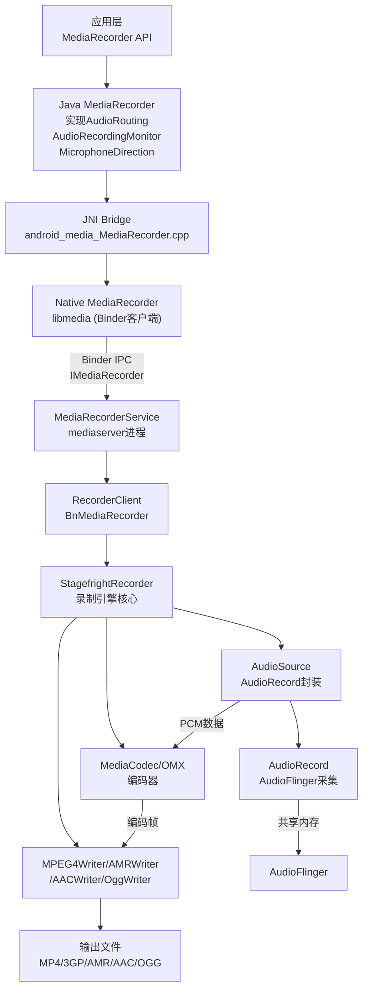
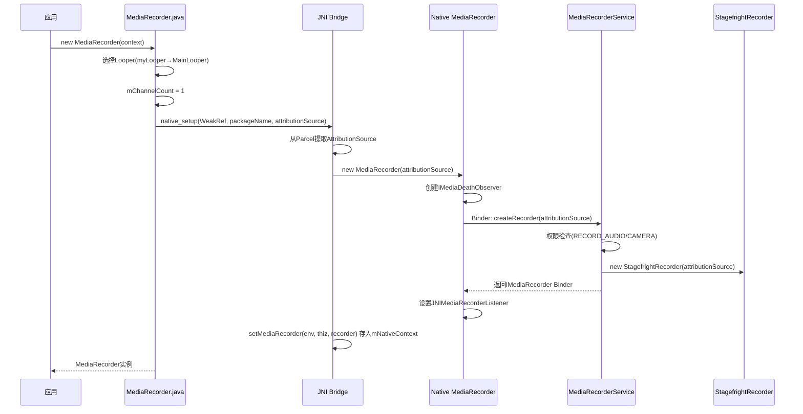
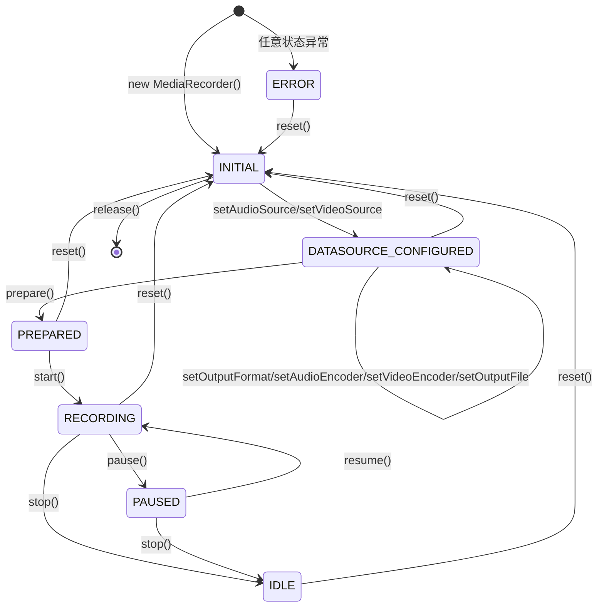
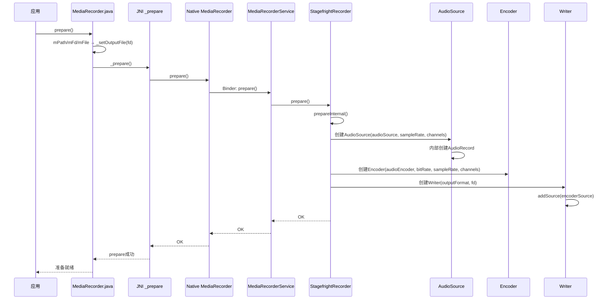
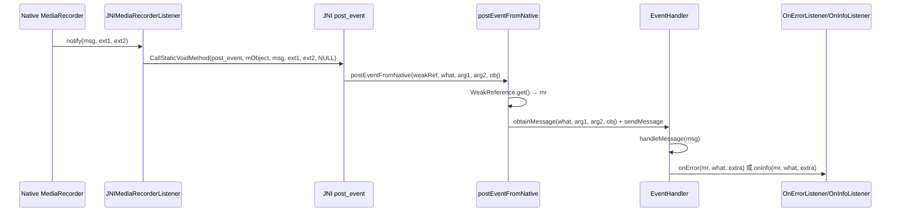

[← 2.8 SoundPool](02_2.8_SoundPool.md) | [← 返回Application Layer](README.md) | [返回导航](../README.md) | [2.10 ExoPlayer调用路径 →](02_2.10_ExoPlayer调用路径.md)

---

## 2.9 MediaRecorder — 音视频录制引擎

### 2.9.1 模块职责与源码位置

MediaRecorder是Android音视频录制的高层API，封装了完整的采集→编码→写文件流程。核心特性：

- **一站式录制**：内部创建AudioSource(AudioRecord)→Encoder(MediaCodec/OMX)→Writer(MPEG4Writer/AMRWriter等)
- **音视频同步**：支持音视频双轨道录制，Writer负责交织同步
- **多种容器格式**：MP4/3GP/AMR/AAC/OGG/WebM等
- **文件分段**：支持setMaxFileSize + setNextOutputFile实现无缝分段录制

**源码位置**：

| 层级 | 文件 | 行数 | 职责 |
|------|------|------|------|
| Java API | [`MediaRecorder.java`](frameworks/base/media/java/android/media/MediaRecorder.java) | 2088 | 公共API+状态机+回调 |
| JNI桥接 | [`android_media_MediaRecorder.cpp`](frameworks/base/media/jni/android_media_MediaRecorder.cpp) | ~620 | JNI方法注册+对象管理 |
| Native核心 | [`mediarecorder.cpp`](frameworks/av/media/libmedia/mediarecorder.cpp) | ~600 | Binder IPC客户端 |
| Service | [`MediaRecorderService.cpp`](frameworks/av/media/libmediaplayerservice/MediaRecorderService.cpp) | ~300 | 服务端RecorderClient管理 |
| 录制引擎 | [`StagefrightRecorder.cpp`](frameworks/av/media/libmediaplayerservice/StagefrightRecorder.cpp) | ~3000 | 核心录制引擎 |
| AudioSource | [`AudioSource.cpp`](frameworks/av/media/libstagefright/AudioSource.cpp) | ~500 | PCM采集(内含AudioRecord) |

### 2.9.2 整体架构



### 2.9.3 构造流程源码解析

**2种构造方式**：

```java
// 方式1：旧构造（@Deprecated）
@Deprecated
public MediaRecorder() {
    this(ActivityThread.currentApplication());
}  // MediaRecorder.java:142

// 方式2：带Context构造（推荐）
public MediaRecorder(@NonNull Context context) {
    Objects.requireNonNull(context);
    Looper looper;
    if ((looper = Looper.myLooper()) != null) {
        mEventHandler = new EventHandler(this, looper);
    } else if ((looper = Looper.getMainLooper()) != null) {
        mEventHandler = new EventHandler(this, looper);
    } else {
        mEventHandler = null;
    }
    mChannelCount = 1;
    try (ScopedParcelState attributionSourceState = context.getAttributionSource()
            .asScopedParcelState()) {
        native_setup(new WeakReference<>(this), ActivityThread.currentPackageName(),
                attributionSourceState.getParcel());
    }
}  // MediaRecorder.java:151
```

**构造时序图**：



**JNI对象管理**（[`android_media_MediaRecorder.cpp`](frameworks/base/media/jni/android_media_MediaRecorder.cpp:153)）：

```cpp
static sp<MediaRecorder> getMediaRecorder(JNIEnv* env, jobject thiz) {
    Mutex::Autolock l(sLock);
    MediaRecorder* const p = (MediaRecorder*)env->GetLongField(thiz, fields.context);
    return sp<MediaRecorder>(p);
}
```

- `mNativeContext`(long)存储Native MediaRecorder裸指针
- 使用`incStrong/decStrong`手动管理引用计数（非智能指针直接存储）
- 全局`sLock`互斥锁保护所有get/set操作

### 2.9.4 完整状态机



**状态检查关键规则**：

| Java API | 要求前置状态 | 后续状态 |
|----------|------------|---------|
| `setAudioSource` | INITIAL | DATASOURCE_CONFIGURED |
| `setVideoSource` | INITIAL | DATASOURCE_CONFIGURED |
| `setOutputFormat` | DATASOURCE_CONFIGURED | 保持(仅设置mOutputFormat) |
| `setAudioEncoder` | DATASOURCE_CONFIGURED + AudioSource已设 | 保持 |
| `setVideoEncoder` | DATASOURCE_CONFIGURED + VideoSource已设 | 保持 |
| `setOutputFile` | DATASOURCE_CONFIGURED | 保持 |
| `prepare()` | DATASOURCE_CONFIGURED | PREPARED |
| `start()` | PREPARED 或 RECORDING(重录) | RECORDING |
| `stop()` | RECORDING | IDLE(需完全重新配置) |
| `pause()` | RECORDING | PAUSED |
| `resume()` | PAUSED | RECORDING |
| `reset()` | 任意 | INITIAL |
| `release()` | 任意 | 终态 |

> **关键设计**：`stop()`后回到IDLE而非DATASOURCE_CONFIGURED，必须从setAudioSource重新开始。这与MediaPlayer的stop→STOPPED可重新prepare不同。

### 2.9.5 AudioSource体系详解

MediaRecorder的AudioSource直接映射为AudioRecord的内部source常量：

| AudioSource | 值 | HAL预处理 | 隐私敏感 | 权限要求 | 典型场景 |
|-------------|-----|----------|---------|---------|---------|
| `DEFAULT` | 0 | AGC+AEC+NS | 否 | RECORD_AUDIO | 默认录音 |
| `MIC` | 1 | AGC+AEC+NS | 否 | RECORD_AUDIO | 语音备忘 |
| `VOICE_UPLINK` | 2 | 无 | 否 | CAPTURE_AUDIO_OUTPUT | 通话上行 |
| `VOICE_DOWNLINK` | 3 | 无 | 否 | CAPTURE_AUDIO_OUTPUT | 通话下行 |
| `VOICE_CALL` | 4 | 无 | 否 | CAPTURE_AUDIO_OUTPUT | 双向通话 |
| `CAMCORDER` | 5 | 最少预处理 | **默认是** | RECORD_AUDIO | 视频录制 |
| `VOICE_RECOGNITION` | 6 | 关闭AGC+AEC | 否 | RECORD_AUDIO | 语音识别 |
| `VOICE_COMMUNICATION` | 7 | AEC+NS | **默认是** | RECORD_AUDIO | VoIP |
| `REMOTE_SUBMIX` | 8 | 无 | 否 | CAPTURE_AUDIO_OUTPUT | 投屏 |
| `UNPROCESSED` | 9 | 无预处理 | 否 | RECORD_AUDIO | 专业录音 |
| `VOICE_PERFORMANCE` | 10 | 最小延迟 | 否 | RECORD_AUDIO | 卡拉OK |
| `ECHO_REFERENCE` | 1997 | 无 | 否 | CAPTURE_AUDIO_OUTPUT(@SystemApi) | AEC参考 |
| `RADIO_TUNER` | 1998 | 无 | 否 | CAPTURE_AUDIO_OUTPUT(@SystemApi) | 广播 |
| `HOTWORD` | 1999 | 同VOICE_RECOGNITION | 否 | CAPTURE_AUDIO_HOTWORD(@SystemApi) | 热词检测 |
| `ULTRASOUND` | 2000 | 无 | 否 | ACCESS_ULTRASOUND(@SystemApi) | 超声波 |

**隐私敏感标记**（[`setPrivacySensitive()`](frameworks/base/media/java/android/media/MediaRecorder.java:779)）：

- `VOICE_COMMUNICATION`和`CAMCORDER`默认隐私敏感，禁止并发采集
- 可通过`setPrivacySensitive(false)`显式覆盖
- 仅允许6种公开AudioSource设置隐私标记
- 必须在`setAudioSource()`之后、`setOutputFormat()`之前调用

**JNI层AudioSource校验**（[`android_media_MediaRecorder.cpp`](frameworks/base/media/jni/android_media_MediaRecorder.cpp:213)）：

```cpp
static void android_media_MediaRecorder_setAudioSource(JNIEnv *env, jobject thiz, jint as) {
    if (as < AUDIO_SOURCE_DEFAULT ||
        (as >= AUDIO_SOURCE_CNT && as != AUDIO_SOURCE_FM_TUNER)) {
        jniThrowException(env, "java/lang/IllegalArgumentException", "Invalid audio source");
        return;
    }
    process_media_recorder_call(env, mr->setAudioSource(as), ...);
}
```

### 2.9.6 OutputFormat与AudioEncoder组合

| OutputFormat | 值 | 推荐AudioEncoder | 容器类型 | 支持视频 | 采样率约束 |
|-------------|-----|-----------------|---------|---------|-----------|
| `THREE_GPP` | 1 | AMR_NB / AMR_WB | 3GP | 是 | AMR: 8k/16kHz |
| `MPEG_4` | 2 | AAC / HE_AAC / AAC_ELD | MP4 | 是 | AAC: 8-96kHz |
| `AMR_NB` | 3 | AMR_NB | AMR裸流 | 否 | 固定8kHz |
| `AMR_WB` | 4 | AMR_WB | AMR裸流 | 否 | 固定16kHz |
| `AAC_ADIF` | 5 | AAC | AAC(@hide) | 否 | 8-96kHz |
| `AAC_ADTS` | 6 | AAC / HE_AAC | AAC帧序列 | 否 | 8-96kHz |
| `RTP_AVP` | 7 | AAC | RTP流(@hide) | 否 | 8-96kHz |
| `MPEG_2_TS` | 8 | AAC | MPEG2-TS | 是 | 8-96kHz |
| `WEBM` | 9 | VORBIS / OPUS | WebM | 是 | 8-48kHz |
| `HEIF` | 10 | — | HEIF(@hide) | 是 | — |
| `OGG` | 11 | OPUS | Ogg | 否 | Opus: 8-48kHz |

**AudioEncoder完整列表**：

| AudioEncoder | 值 | MIME类型 | 典型码率 |
|-------------|-----|---------|---------|
| `DEFAULT` | 0 | 同AAC | — |
| `AMR_NB` | 1 | audio/3gpp | 4.75-12.2 kbps |
| `AMR_WB` | 2 | audio/amr-wb | 6.6-23.85 kbps |
| `AAC` | 3 | audio/mp4a-latm | 64-256 kbps |
| `HE_AAC` | 4 | audio/mp4a-latm | 32-96 kbps |
| `AAC_ELD` | 5 | audio/mp4a-latm | 64-128 kbps |
| `VORBIS` | 6 | audio/vorbis | 64-320 kbps |
| `OPUS` | 7 | audio/opus | 6-510 kbps |

### 2.9.7 prepare()源码深度解析

[`prepare()`](frameworks/base/media/java/android/media/MediaRecorder.java:1298)是关键方法，完成Native侧Pipeline构建：

```java
public void prepare() throws IllegalStateException, IOException {
    if (mPath != null) {
        RandomAccessFile file = new RandomAccessFile(mPath, "rw");
        try {
            _setOutputFile(file.getFD());
        } finally {
            file.close();
        }
    } else if (mFd != null) {
        _setOutputFile(mFd);
    } else if (mFile != null) {
        RandomAccessFile file = new RandomAccessFile(mFile, "rw");
        try {
            _setOutputFile(file.getFD());
        } finally {
            file.close();
        }
    } else {
        throw new IOException("No valid output file");
    }
    _prepare();
}  // MediaRecorder.java:1298
```

**prepare时序图**：



**StagefrightRecorder::prepareInternal()关键逻辑**：

1. 创建AudioSource：根据audioSource创建AudioRecord，配置采样率/通道数
2. 创建Encoder：根据audioEncoder创建OMX/软件编码器节点
3. 创建Writer：根据outputFormat创建对应Writer(MPEG4Writer/AMRWriter/AACWriter/OggWriter)
4. 连接Pipeline：AudioSource→Encoder→Writer
5. Writer写文件头

### 2.9.8 setParameter参数体系

MediaRecorder通过[`setParameter()`](frameworks/base/media/java/android/media/MediaRecorder.java:1946)传递大量内部参数，Java层多个方法最终都转为键值对：

| Java方法 | Parameter键 | 格式 |
|----------|-----------|------|
| `setAudioSamplingRate(int)` | `audio-param-sampling-rate` | `audio-param-sampling-rate=44100` |
| `setAudioChannels(int)` | `audio-param-number-of-channels` | `audio-param-number-of-channels=2` |
| `setAudioEncodingBitRate(int)` | `audio-param-encoding-bitrate` | `audio-param-encoding-bitrate=128000` |
| `setVideoEncodingBitRate(int)` | `video-param-encoding-bitrate` | `video-param-encoding-bitrate=2000000` |
| `setVideoEncodingProfileLevel(int,int)` | `video-param-encoder-profile` + `video-param-encoder-level` | 两个参数 |
| `setOrientationHint(int)` | `video-param-rotation-angle-degrees` | `video-param-rotation-angle-degrees=90` |
| `setLocation(float,float)` | `param-geotag-latitude` + `param-geotag-longitude` | 两个参数 |
| `setCaptureRate(double)` | `time-lapse-enable` + `time-lapse-fps` | `time-lapse-enable=1&time-lapse-fps=30.0` |
| `setLogSessionId(LogSessionId)` | `log-session-id` | `log-session-id=hexstring` |

**参数校验**（Java层）：

- `setAudioSamplingRate`：必须>0（[`L1078`](frameworks/base/media/java/android/media/MediaRecorder.java:1078)）
- `setAudioChannels`：必须>0，同时更新mChannelCount（[`L1092`](frameworks/base/media/java/android/media/MediaRecorder.java:1092)）
- `setAudioEncodingBitRate`：必须>0（[`L1109`](frameworks/base/media/java/android/media/MediaRecorder.java:1109)）
- `setVideoEncodingBitRate`：必须>0（[`L1132`](frameworks/base/media/java/android/media/MediaRecorder.java:1132)）
- `setVideoEncodingProfileLevel`：profile和level都必须>=0（[`L1154`](frameworks/base/media/java/android/media/MediaRecorder.java:1154)）
- `setOrientationHint`：仅支持0/90/180/270（[`L909`](frameworks/base/media/java/android/media/MediaRecorder.java:909)）
- `setLocation`：latitude[-90,90]，longitude[-180,180]，精度x10000（[`L935`](frameworks/base/media/java/android/media/MediaRecorder.java:935)）

### 2.9.9 输出文件管理

**3种设置输出文件方式**：

| 方法 | 内部存储 | prepare()时处理 |
|------|---------|---------------|
| `setOutputFile(String path)` | `mPath = path` | RandomAccessFile→_setOutputFile(fd) |
| `setOutputFile(FileDescriptor fd)` | `mFd = fd` | 直接_setOutputFile(fd) |
| `setOutputFile(File file)` | `mFile = file` | RandomAccessFile→_setOutputFile(fd) |

**分段录制**（API 26+）：

```java
recorder.setMaxFileSize(maxBytes);
recorder.setOutputFile(firstFile);
recorder.prepare();
recorder.start();

// 当收到MAX_FILESIZE_APPROACHING(90%)回调时：
recorder.setNextOutputFile(secondFile);

// 当收到NEXT_OUTPUT_FILE_STARTED回调时：
// 第一个文件已写完，数据自动写入secondFile

// 当收到MAX_FILESIZE_REACHED回调时：
// 录制自动停止
```

**MPEG-4 MOOV预留空间**：setMaxFileSize/setMaxDuration时，MPEG4Writer会预留MOOV box空间，录制完成后未使用空间转为FREE box。设置过大会浪费磁盘空间。

### 2.9.10 EventHandler与回调机制

**事件类型定义**（[`EventHandler`](frameworks/base/media/java/android/media/MediaRecorder.java:1580)）：

| 事件常量 | 值 | 回调接口 | 含义 |
|---------|-----|---------|------|
| `MEDIA_RECORDER_EVENT_ERROR` | 1 | OnErrorListener | 录制错误 |
| `MEDIA_RECORDER_EVENT_INFO` | 2 | OnInfoListener | 信息/警告 |
| `MEDIA_RECORDER_TRACK_EVENT_ERROR` | 100 | OnErrorListener | 轨道错误 |
| `MEDIA_RECORDER_TRACK_EVENT_INFO` | 101 | OnInfoListener | 轨道信息 |
| `MEDIA_RECORDER_AUDIO_ROUTING_CHANGED` | 10000 | OnRoutingChangedListener | 音频路由变更 |

**Info事件码**：

| 常量 | 值 | 含义 |
|------|-----|------|
| `MEDIA_RECORDER_INFO_UNKNOWN` | 1 | 未知信息 |
| `MEDIA_RECORDER_INFO_MAX_DURATION_REACHED` | 800 | 达到最大时长 |
| `MEDIA_RECORDER_INFO_MAX_FILESIZE_REACHED` | 801 | 达到最大文件大小 |
| `MEDIA_RECORDER_INFO_MAX_FILESIZE_APPROACHING` | 802 | 接近最大文件大小(90%) |
| `MEDIA_RECORDER_INFO_NEXT_OUTPUT_FILE_STARTED` | 803 | 已切换到下一输出文件 |

**回调分发链路**：



**JNIMediaRecorderListener**（[`android_media_MediaRecorder.cpp`](frameworks/base/media/jni/android_media_MediaRecorder.cpp:79)）：

- 持有MediaRecorder class的GlobalRef（用于调用静态方法）
- 持有MediaRecorder Java对象的GlobalRef（WeakReference包装）
- `notify()`通过`CallStaticVoidMethod`调用Java `postEventFromNative`

### 2.9.11 AudioRouting接口实现

MediaRecorder实现[`AudioRouting`](frameworks/base/media/java/android/media/AudioRouting.java)接口，支持输入设备选择：

| 方法 | Native方法 | 功能 |
|------|-----------|------|
| `setPreferredDevice(AudioDeviceInfo)` | `native_setInputDevice(deviceId)` | 设置首选输入设备 |
| `getPreferredDevice()` | — | 返回Java层缓存的mPreferredDevice |
| `getRoutedDevice()` | `native_getRoutedDeviceId()` | 查询当前实际路由设备 |
| `addOnRoutingChangedListener()` | `native_enableDeviceCallback(true)` | 注册路由变更回调 |
| `removeOnRoutingChangedListener()` | `native_enableDeviceCallback(false)` | 取消路由变更回调 |

**路由变更回调机制**（[`EventHandler`](frameworks/base/media/java/android/media/MediaRecorder.java:1626)）：

```java
case MEDIA_RECORDER_AUDIO_ROUTING_CHANGED:
    AudioManager.resetAudioPortGeneration();
    synchronized (mRoutingChangeListeners) {
        for (NativeRoutingEventHandlerDelegate delegate
                : mRoutingChangeListeners.values()) {
            delegate.notifyClient();
        }
    }
    return;
```

### 2.9.12 AudioRecordingMonitor接口

MediaRecorder实现[`AudioRecordingMonitor`](frameworks/base/media/java/android/media/AudioRecordingMonitor.java)接口，监控录音配置变化：

```java
// MediaRecorder.java:1833
AudioRecordingMonitorImpl mRecordingInfoImpl =
        new AudioRecordingMonitorImpl((AudioRecordingMonitorClient) this);
```

| 方法 | 功能 |
|------|------|
| `registerAudioRecordingCallback(Executor, AudioRecordingCallback)` | 注册录音配置变更回调 |
| `unregisterAudioRecordingCallback(AudioRecordingCallback)` | 取消回调 |
| `getActiveRecordingConfiguration()` | 获取当前活跃录音配置 |

`AudioRecordingMonitorClient`接口实现：

```java
// MediaRecorder.java:1874
public int getPortId() {
    if (mNativeContext == 0) return 0;
    return native_getPortId();
}
```

### 2.9.13 MicrophoneDirection接口

MediaRecorder实现[`MicrophoneDirection`](frameworks/base/media/java/android/media/MicrophoneDirection.java)接口，控制麦克风方向和聚焦：

| 方法 | Native方法 | 功能 |
|------|-----------|------|
| `setPreferredMicrophoneDirection(int)` | `native_setPreferredMicrophoneDirection(direction)` | 设置逻辑麦克风方向 |
| `setPreferredMicrophoneFieldDimension(float)` | `native_setPreferredMicrophoneFieldDimension(zoom)` | 设置麦克风聚焦(-1到1) |

**getActiveMicrophones()**（[`L1768`](frameworks/base/media/java/android/media/MediaRecorder.java:1768)）：

- 调用`native_getActiveMicrophones()`获取活跃麦克风列表
- 失败时回退到`getRoutedDevice()`构造虚拟MicrophoneInfo
- 使用`mChannelCount`构造通道映射

### 2.9.14 Native方法签名完整列表

| Java方法 | JNI签名 | Native方法 |
|----------|---------|-----------|
| `setCamera(Camera)` | `(Landroid/hardware/Camera;)V` | `android_media_MediaRecorder_setCamera` |
| `setVideoSource(int)` | `(I)V` | `android_media_MediaRecorder_setVideoSource` |
| `setAudioSource(int)` | `(I)V` | `android_media_MediaRecorder_setAudioSource` |
| `setOutputFormat(int)` | `(I)V` | `android_media_MediaRecorder_setOutputFormat` |
| `setVideoSize(int,int)` | `(II)V` | `android_media_MediaRecorder_setVideoSize` |
| `setVideoFrameRate(int)` | `(I)V` | `android_media_MediaRecorder_setVideoFrameRate` |
| `setVideoEncoder(int)` | `(I)V` | `android_media_MediaRecorder_setVideoEncoder` |
| `setAudioEncoder(int)` | `(I)V` | `android_media_MediaRecorder_setAudioEncoder` |
| `setPrivacySensitive(boolean)` | `(Z)V` | `android_media_MediaRecorder_setPrivacySensitive` |
| `isPrivacySensitive()` | `()Z` | `android_media_MediaRecorder_isPrivacySensitive` |
| `_setOutputFile(FD)` | `(Ljava/io/FileDescriptor;)V` | `android_media_MediaRecorder_setOutputFileFD` |
| `_setNextOutputFile(FD)` | `(Ljava/io/FileDescriptor;)V` | `android_media_MediaRecorder_setNextOutputFileFD` |
| `_prepare()` | `()V` | `android_media_MediaRecorder_prepare` |
| `start()` | `()V` | `android_media_MediaRecorder_start` |
| `stop()` | `()V` | `android_media_MediaRecorder_stop` |
| `pause()` | `()V` | `android_media_MediaRecorder_pause` |
| `resume()` | `()V` | `android_media_MediaRecorder_resume` |
| `native_reset()` | `()V` | `android_media_MediaRecorder_reset` |
| `getMaxAmplitude()` | `()I` | `android_media_MediaRecorder_getMaxAmplitude` |
| `release()` | `()V` | `android_media_MediaRecorder_release` |
| `native_setup(Object,String,Parcel)` | `(Ljava/lang/Object;Ljava/lang/String;Landroid/os/Parcel;)V` | `android_media_MediaRecorder_native_setup` |
| `native_init()` | `()V` | 静态初始化 |
| `native_finalize()` | `()V` | 析构 |
| `setParameter(String)` | `(Ljava/lang/String;)V` | `android_media_MediaRecorder_setParameter` |
| `getSurface()` | `()Landroid/view/Surface;` | `android_media_MediaRecorder_getSurface` |
| `native_setInputDevice(int)` | `(I)Z` | 设备路由 |
| `native_getRoutedDeviceId()` | `()I` | 设备路由 |
| `native_enableDeviceCallback(bool)` | `(Z)V` | 设备路由 |
| `native_getActiveMicrophones(ArrayList)` | `(Ljava/util/ArrayList;)I` | 麦克风信息 |
| `native_setPreferredMicrophoneDirection(int)` | `(I)I` | 麦克风方向 |
| `native_setPreferredMicrophoneFieldDimension(float)` | `(F)I` | 麦克风聚焦 |
| `native_getPortId()` | `()I` | 录音端口ID |
| `native_getMetrics()` | `()Landroid/os/PersistableBundle;` | 性能指标 |
| `native_setInputSurface(Surface)` | `(Landroid/view/Surface;)V` | 持久输入Surface |

**JNI字段映射**：

```cpp
struct fields_t {
    jfieldID    context;     // MediaRecorder.mNativeContext (long)
    jfieldID    surface;     // MediaRecorder.mSurface (Surface)
    jmethodID   post_event;  // MediaRecorder.postEventFromNative(Object,int,int,Object)
};
```

### 2.9.15 stop()特殊行为

[`stop()`](frameworks/base/media/java/android/media/MediaRecorder.java:1350)有两个特殊行为需注意：

1. **RuntimeException**：如果start()后立即stop()（无有效音视频数据），会故意抛出RuntimeException，提示App清理无效输出文件
2. **回到IDLE**：stop()后状态回到IDLE，必须从setAudioSource重新配置，不能直接prepare

```java
// MediaRecorder.java:1350 注释
// Note that a RuntimeException is intentionally thrown to the
// application, if no valid audio/video data has been received when stop()
// is called. This happens if stop() is called immediately after start().
```

### 2.9.16 getMaxAmplitude()与VU表

[`getMaxAmplitude()`](frameworks/base/media/java/android/media/MediaRecorder.java:1400)返回自上次调用以来的最大绝对振幅：

- 仅在`setAudioSource()`之后有效
- 返回值范围0-32767（16-bit PCM的绝对值）
- 每次调用后重置计数器
- 典型用途：实现VU表/录音电平指示
- 内部由AudioSource跟踪最大采样值

### 2.9.17 Metrics常量体系

[`MetricsConstants`](frameworks/base/media/java/android/media/MediaRecorder.java:1969)定义了`getMetrics()`返回的PersistableBundle键值：

| 常量 | 键名 | 值类型 |
|------|------|--------|
| `AUDIO_BITRATE` | `android.media.mediarecorder.audio-bitrate` | int |
| `AUDIO_CHANNELS` | `android.media.mediarecorder.audio-channels` | int |
| `AUDIO_SAMPLERATE` | `android.media.mediarecorder.audio-samplerate` | int |
| `AUDIO_TIMESCALE` | `android.media.mediarecorder.audio-timescale` | int |
| `VIDEO_BITRATE` | `android.media.mediarecorder.video-bitrate` | int |
| `VIDEO_PROFILE` | `android.media.mediarecorder.video-encoder-profile` | int |
| `VIDEO_LEVEL` | `android.media.mediarecorder.video-encoder-level` | int |
| `FRAMERATE` | `android.media.mediarecorder.frame-rate` | int |
| `WIDTH` | `android.media.mediarecorder.width` | int |
| `HEIGHT` | `android.media.mediarecorder.height` | int |
| `ROTATION` | `android.media.mediarecorder.rotation` | int |
| `CAPTURE_FPS` | `android.media.mediarecorder.capture-fps` | double |
| `CAPTURE_FPS_ENABLE` | `android.media.mediarecorder.capture-fpsenable` | int |
| `MOVIE_TIMESCALE` | `android.media.mediarecorder.movie-timescale` | int |
| `VIDEO_TIMESCALE` | `android.media.mediarecorder.video-timescale` | int |
| `VIDEO_IFRAME_INTERVAL` | `android.media.mediarecorder.video-iframe-interval` | int |

### 2.9.18 典型使用模式

**基本录音**：

```java
MediaRecorder recorder = new MediaRecorder(context);
recorder.setAudioSource(MediaRecorder.AudioSource.MIC);
recorder.setOutputFormat(MediaRecorder.OutputFormat.MPEG_4);
recorder.setAudioEncoder(MediaRecorder.AudioEncoder.AAC);
recorder.setAudioEncodingBitRate(128000);
recorder.setAudioSamplingRate(44100);
recorder.setAudioChannels(2);
recorder.setOutputFile(outputPath);
recorder.prepare();
recorder.start();
// ... 录制中 ...
recorder.stop();
recorder.release();
```

**分段录制（大文件分段）**：

```java
recorder.setMaxFileSize(100 * 1024 * 1024); // 100MB
recorder.setOnInfoListener((mr, what, extra) -> {
    if (what == MediaRecorder.MEDIA_RECORDER_INFO_MAX_FILESIZE_APPROACHING) {
        mr.setNextOutputFile(nextFile);
    } else if (what == MediaRecorder.MEDIA_RECORDER_INFO_NEXT_OUTPUT_FILE_STARTED) {
        // 第一个文件已完成
    }
});
```

**带暂停/恢复的录制**：

```java
recorder.start();
// ... 录制 ...
recorder.pause();   // API 24+
// ... 用户操作 ...
recorder.resume();  // API 24+
recorder.stop();
```

### 2.9.19 MediaRecorder vs AudioRecord+MediaCodec对比

| 维度 | MediaRecorder | AudioRecord + MediaCodec |
|------|-------------|------------------------|
| 封装层次 | 高层一站式 | 底层自由组合 |
| 采集 | 内部AudioSource(AudioRecord) | App自行创建AudioRecord |
| 编码 | 内部自动Encoder(OMX/软编) | App自行配置MediaCodec |
| 写文件 | 内部Writer自动容器封装 | App自行写或MPEG4Writer |
| 实时PCM处理 | 不支持（数据直接进Encoder） | 支持（PCM中间处理） |
| 延迟 | 较高（完整pipeline） | 可控 |
| 灵活性 | 低，固定流程 | 高，每步可自定义 |
| 状态管理 | 单一状态机 | 各组件独立状态 |
| 错误恢复 | reset()后完全重新配置 | 各组件独立处理 |
| 音频路由 | AudioRouting接口 | AudioRecord完整路由 |
| 麦克风控制 | MicrophoneDirection接口 | AudioRecord直接控制 |
| 适用场景 | 简单录音/录像 | 自定义编码/实时处理 |

> **选择策略**：只需保存录音文件→MediaRecorder；需要实时PCM处理或自定义编码→AudioRecord+MediaCodec。

---

[← 2.8 SoundPool](02_2.8_SoundPool.md) | [← 返回Application Layer](README.md) | [返回导航](../README.md) | [2.10 ExoPlayer调用路径 →](02_2.10_ExoPlayer调用路径.md)