# 第三篇：Java Framework Layer

> [← 上一篇：Application Layer](02_Application_Layer.md) | [返回导航](README.md) | [下一篇：Native Framework →](04_Native_Framework_Layer.md)

---

## 3.1 AudioService — 音频系统服务中枢

### 模块职责
AudioService运行在system_server中，是所有音频策略操作的中枢。它协调音量控制、设备管理、焦点仲裁、铃声模式、蓝牙音频等，是Java Framework层与Native层之间的桥梁。

### 所属层级
System Service Layer → `frameworks/base/services/core/java/com/android/server/audio/`

### 核心类关系

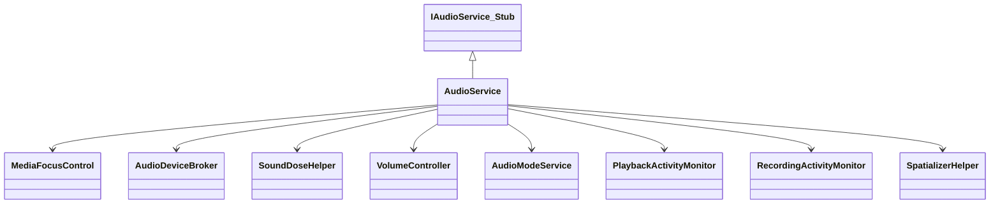

### 初始化入口

AudioService在`SystemServer.startOtherServices()`中启动：
```
SystemServer → new AudioService(context) → ServiceManager.addService(Context.AUDIO_SERVICE, audioService)
```

初始化关键步骤：
1. 创建`MediaFocusControl` — 焦点管理器
2. 创建`AudioDeviceBroker` — 设备热插拔管理
3. 创建`PlaybackActivityMonitor` — 播放状态追踪
4. 创建`RecordingActivityMonitor` — 录音状态追踪
5. 调用`AudioSystem.init()` — 初始化Native AudioSystem
6. 加载音频策略配置 — `AudioSystem.setAudioPolicyVolumeMapping()`

### 核心功能域

#### 音量控制
```
KeyEvent(VOL_UP/DOWN) → AudioService.handleVolumeKey() → adjustSuggestedStreamVolume()
  → VolumeGroupCache → AudioPolicyService.setVolumeIndexForAttributes()
```

#### 铃声模式管理
| 模式 | 行为 |
|------|------|
| RINGER_MODE_SILENT | 所有非ALARM/SYSTEM音量静音 |
| RINGER_MODE_VIBRATE | 铃声静音+振动 |
| RINGER_MODE_NORMAL | 正常 |

#### 设备连接管理
通过`AudioDeviceBroker`管理所有音频设备的连接/断开。

### Binder接口
AudioService实现`IAudioService`接口：

| 方法 | 功能 |
|------|------|
| `adjustVolume()` | 音量调节 |
| `setStreamVolume()` | 设置指定流类型音量 |
| `requestAudioFocus()` | 焦点请求 |
| `setWiredDeviceConnectionState()` | 有线设备连接 |
| `setBluetoothA2dpDeviceConnectionState()` | 蓝牙设备连接 |
| `setRingerMode()` | 铃声模式 |
| `registerPlaybackCallback()` | 注册播放状态回调 |

### 调试方法
```bash
dumpsys audio          # 完整音频状态dump
dumpsys audio | grep "Volume"   # 音量状态
dumpsys audio | grep "Ringer"   # 铃声模式
dumpsys audio | grep "Devices"  # 设备状态
```

---

## 3.2 MediaFocusControl — 焦点仲裁器

### 模块职责
MediaFocusControl是Android音频焦点仲裁的核心实现，管理所有App的焦点请求/释放，维护焦点栈，通知焦点变化。

### 核心类关系

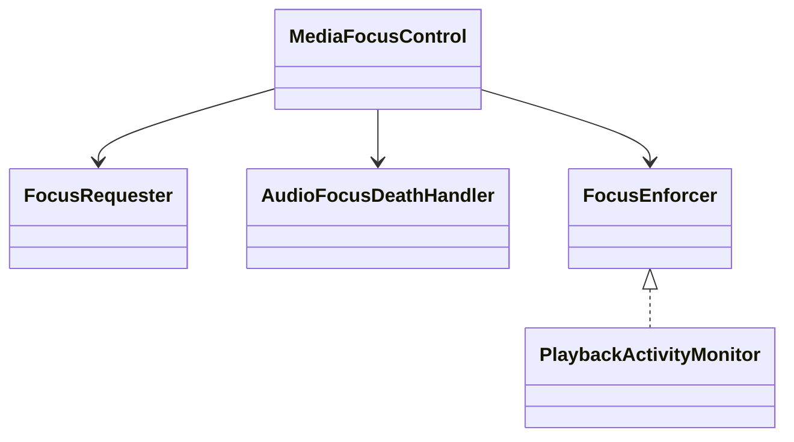

### 焦点栈模型

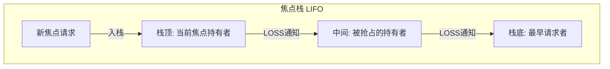

### 核心调用链

1. [`AudioManager.requestAudioFocus()`](frameworks/base/media/java/android/media/AudioManager.java:4757) → `service.requestAudioFocus()`
2. [`AudioService.requestAudioFocus()`](frameworks/base/services/core/java/com/android/server/audio/AudioService.java:9826) → `mMediaFocusControl.requestAudioFocus()`
3. [`MediaFocusControl.requestAudioFocus()`](frameworks/base/services/core/java/com/android/server/audio/MediaFocusControl.java:952):
   - 创建`FocusRequester`封装请求信息
   - 检查是否有外部AudioPolicy（AAOS场景）
   - 如果有 → `notifyExtFocusPolicyFocusRequest_syncAf()` → CarAudioFocus
   - 如果无 → 标准栈管理 → 通知失去焦点者

### 外部AudioPolicy机制（AAOS关键路径）

```mermaid
sequenceDiagram
    participant App, AudioSvc, MFC, CarAF, HAL
    App->>AudioSvc: requestAudioFocus()
    AudioSvc->>MFC: requestAudioFocus()
    MFC->>MFC: 检测到mFocusPolicy != null
    MFC->>CarAF: onAudioFocusRequest(afi)
    CarAF->>CarAF: evaluateFocusRequestLocked()
    CarAF-->>MFC: setFocusRequestResult(afi, response)
    MFC-->>App: 焦点结果
```

当AAOS通过`CarAudioService.setAudioFocusPolicy()`注册AudioPolicy后，所有焦点请求不再由MediaFocusControl的栈管理，而是转发给CarAudioFocus进行车载仲裁。

---

## 3.3 AudioAttributes — 音频属性模型

### 模块职责
AudioAttributes描述音频流的语义特征，取代传统的stream type，用于路由决策、焦点管理和音量分组。

### 核心属性

| 属性 | 说明 | 影响范围 |
|------|------|----------|
| **usage** | 使用场景(USAGE_MEDIA等) | 路由决策 |
| **contentType** | 内容类型(CONTENT_TYPE_MUSIC等) | 信号处理 |
| **flags** | 标志位(FLAG_AUDIBILITY_ENFORCED等) | 输出选择 |
| **tags** | 自定义标签 | OEM扩展 |

### usage → stream type映射（兼容层）

| usage | stream type |
|-------|-------------|
| USAGE_MEDIA | STREAM_MUSIC |
| USAGE_VOICE_COMMUNICATION | STREAM_VOICE_CALL |
| USAGE_NOTIFICATION | STREAM_NOTIFICATION |
| USAGE_ALARM | STREAM_ALARM |
| USAGE_ASSISTANCE_NAVIGATION | STREAM_SYSTEM |

### AudioAttributes → ProductStrategy → 路由

```
AudioAttributes(usage=MEDIA)
  → ProductStrategy("strategy_media")
    → EngineBase.getOutputDevicesForAttributes()
      → DeviceSelection(speaker/BT_A2DP/wired_headset)
```

---

## 3.4 VolumeController — 音量控制机制

### 音量调节全链路

```mermaid
sequenceDiagram
    participant KE, AS, APM, AF, HAL
    KE->>AS: VOL_UP/DOWN KeyEvent
    AS->>AS: adjustSuggestedStreamVolume()
    AS->>APM: setVolumeIndexForAttributes() [Binder]
    APM->>APM: VolumeGroup查找 + 曲线映射
    APM->>AF: setStreamVolume() [Binder]
    AF->>HAL: setVolume() (StreamOutHalInterface)
```

### 音量曲线(Volume Curve)
定义在`audio_policy_volumes.xml`中，将0-100的音量指数映射到dB衰减值：

```xml
<volume stream="AUDIO_STREAM_MUSIC" deviceCategory="DEVICE_CATEGORY_HEADSET">
    <point>0,-9000</point>
    <point>33,-3600</point>
    <point>66,-1600</point>
    <point>100,0</point>
</volume>
```

每个stream type × 设备类别(HEADSET/SPEAKER/EARPIECE)有独立曲线。

### Stream Type → VolumeGroup演进
- **传统**: 按Stream Type控制音量(STREAM_MUSIC, STREAM_RING等)
- **Android 9+**: 按VolumeGroup控制，VolumeGroup由AudioAttributes映射
- **好处**: 同一个VolumeGroup内的不同stream共享音量，用户体验更一致

---

## 3.5 AudioDeviceBroker — 设备热插拔管理

### 模块职责
AudioDeviceBroker在AudioService内部管理所有音频设备的连接/断开事件，协调有线、蓝牙、USB设备的策略处理。

### 设备连接处理流程

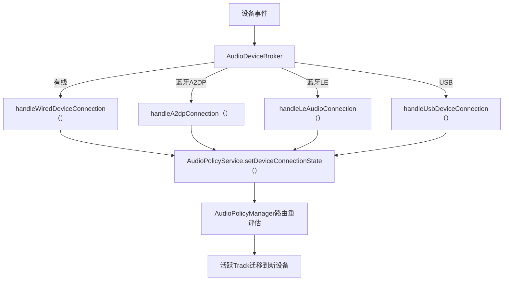

### 关键设计：消息队列化
设备事件通过`BrokerHandler`消息队列串行化处理：
- `BTA2DP_INTENT_MSG` → 蓝牙A2DP连接/断开
- `WIRED_DEVICE_CONNECT_MSG` → 有线设备
- `USB_DEVICE_CONNECT_MSG` → USB设备

**为什么队列化？** 设备连接涉及多步操作（断开旧设备→更新AudioPolicy→打开新输出→迁移Track），必须串行执行。

---

## 3.6 PlaybackActivityMonitor — 播放状态追踪

### 模块职责
追踪所有活跃的音频播放会话，用于隐私指示（绿色指示器）和焦点执行（ducking/fadeout/muting）。

### 核心数据结构

```mermaid
classDiagram
    class PlaybackActivityMonitor {
        +mPlayers : SparseIntMap~AudioPlaybackConfiguration~
        +mDuckingManager : DuckingManager
        +mFadingManager : FadeOutManager
        +mMutedPlayers : Set~Integer~
        +duckPlayers()
        +fadeOutPlayers()
        +mutePlayersForCall()
        +restoreVShapedPlayers()
        +trackPlayer()

    class AudioPlaybackConfiguration {
        +mPlayerInterfaceId : int
        +mClientUid : int
        +mClientPid : int
        +mPlayerType : int
        +mAudioAttributes : AudioAttributes
        +mPlayerState : int
        +getPlayerProxy()

    class DuckingManager {
        +mDuckers : ArrayMap~uid, DuckState~
        +duckUid()
        +unduckUid()

    class FadeOutManager {
        +FADE_OUT_DURATION_MS : 2000
        +fadeOutUid()
        +unfadeOutUid()

    PlaybackActivityMonitor --> DuckingManager
    PlaybackActivityMonitor --> FadeOutManager
    PlaybackActivityMonitor --> AudioPlaybackConfiguration
```

### 播放器类型与可Duck/Fadeout矩阵

| 播放器类型 | 可Duck | 可Fadeout | 说明 |
|-----------|--------|-----------|------|
| PLAYER_TYPE_UNKNOWN | 是 | 是 | 未知类型 |
| PLAYER_TYPE_JAVA | 是 | 是 | Java AudioTrack |
| PLAYER_TYPE_SONIC | 是 | 是 | Sonic播放器 |
| PLAYER_TYPE_AAUDIO | 是 | **否** | AAudio低延迟(不可fade) |
| PLAYER_TYPE_JAM_SOUNDPOOL | **否** | **否** | SoundPool(不可duck/fade) |
| PLAYER_TYPE_EXOPLAYER | 是 | 是 | ExoPlayer |

### 焦点执行完整时序

```mermaid
sequenceDiagram
    participant MFC, PAM, DUCKMGR, FADEMGR, PROXY, APP
    MFC->>PAM: duckPlayers(winner, loser, forceDuck)
    PAM->>PAM: 遍历mPlayers找同UID播放器
    PAM->>PAM: 检查: SPEECH不可duck
    PAM->>PAM: 检查: UNDUCKABLE_PLAYER_TYPES不可duck
    PAM->>DUCKMGR: duckUid(loserUid, apcsToDuck, strongDuck)
    DUCKMGR->>PROXY: PlayerProxy.setVolume(duckLevel)
    Note over PROXY: duckLevel由strongDuck决定:<br>USAGE_ASSISTANT→更低duck

    MFC->>PAM: fadeOutPlayers(winner, loser)
    PAM->>PAM: 检查: SPEECH不可fade
    PAM->>PAM: 检查: UNFADEABLE_PLAYER_TYPES不可fade
    PAM->>FADEMGR: fadeOutUid(loserUid, apcsToFade)
    FADEMGR->>PROXY: PlayerProxy.applyVolumeShaper(FADEOUT_VSHAPE)
    Note over PROXY: 2s淡出曲线: 1.0→0.65→0.0

    MFC->>PAM: restoreVShapedPlayers(winner)
    PAM->>DUCKMGR: unduckUid(winnerUid, mPlayers)
    PAM->>FADEMGR: unfadeOutUid(winnerUid, mPlayers)
    DUCKMGR->>PROXY: PlayerProxy.setVolume(1.0f)
    FADEMGR->>PROXY: PlayerProxy.applyVolumeShaper(PLAY_SKIP_RAMP)
```

### 通话Muting机制 — [`mutePlayersForCall()`](frameworks/base/services/core/java/com/android/server/audio/PlaybackActivityMonitor.java:831)

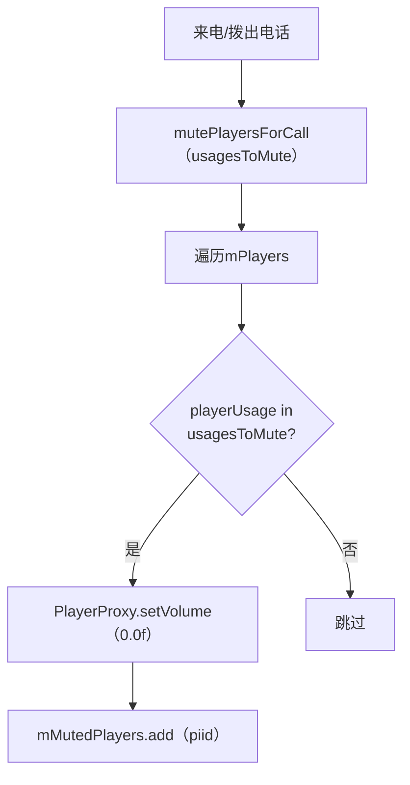

**默认Mute的Usage**: USAGE_GAME, USAGE_MEDIA, USAGE_NOTIFICATION (通话期间游戏/音乐/通知静音)

**恢复**: `unmutePlayersForCall()` → 遍历`mMutedPlayers` → `PlayerProxy.setVolume(1.0f)`

---

## 3.7 System Service — 关联系统服务

### 3.7.1 MediaSessionService — 媒体会话管理

MediaSessionService管理所有媒体会话(MediaSession)，与Audio系统通过PlaybackActivityMonitor交互。

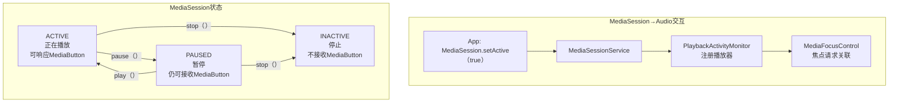

**关键交互**: PlaybackState中的`PlaybackState.STATE_PLAYING`映射到`PLAYER_STATE_STARTED`，用于焦点Ducking/FadeOut判断。

### 3.7.2 SoundTriggerService — 语音唤醒

SoundTriggerService管理硬件语音识别(Keyword Detection)，与Audio系统共享录音路径。

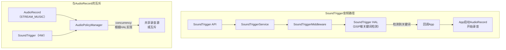

**关键点**: SoundTrigger在DSP端执行关键词检测，不占用CPU。检测到关键词后通知App启动AudioRecord采集音频。

### 3.7.3 Permission管理 — 音频权限体系

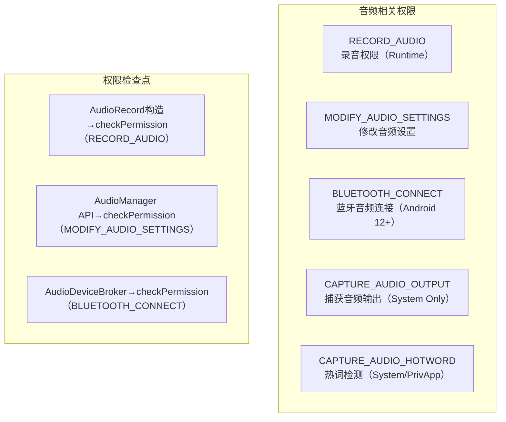

| 权限 | 保护级别 | 用途 | 检查位置 |
|------|---------|------|---------|
| RECORD_AUDIO | dangerous | 录音 | AudioRecord构造函数 |
| MODIFY_AUDIO_SETTINGS | normal | 音量/路由设置 | AudioManager |
| BLUETOOTH_CONNECT | dangerous | 蓝牙音频 | AudioDeviceBroker |
| CAPTURE_AUDIO_OUTPUT | signature\|privileged | 截获音频输出 | AudioPolicyService |
| CAPTURE_AUDIO_HOTWORD | signature\|privileged | 热词检测 | SoundTriggerService |

### 3.7.4 Settings联动 — 音频设置持久化

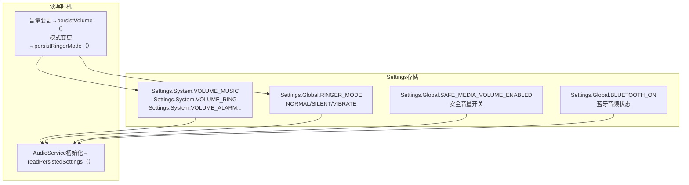

**关键点**:
- 音量索引按(device, streamType)键持久化
- 用户切换设备后自动恢复该设备的上次音量
- 安全音量状态跨重启持久化(SoundDose累计值不持久化，重启归零)

---

---

## 3.8 AudioMode状态机与通信设备路由

### 3.8.1 AudioMode — 音频模式状态机

AudioMode是Android音频系统的**第四大核心状态机**（与Focus/Volume/Device并列），决定了当前音频系统的全局工作模式，直接影响路由策略、音量别名和焦点行为。

**6种AudioMode**（源码: [`AudioSystem.java`](frameworks/base/media/java/android/media/AudioSystem.java)）

| 模式 | 值 | 触发场景 | 路由影响 | 权限要求 |
|------|---|---------|---------|---------|
| `MODE_NORMAL` | 0 | 默认/通话结束 | 媒体路由(扬声器/蓝牙A2DP) | 无 |
| `MODE_RINGTONE` | 1 | 来电振铃 | 铃声路由(扬声器/蓝牙SCO) | MODIFY_PHONE_STATE |
| `MODE_IN_CALL` | 2 | 语音通话 | 通话路由(听筒/蓝牙SCO) | MODIFY_PHONE_STATE |
| `MODE_IN_COMMUNICATION` | 3 | VoIP/视频通话 | 通信路由(耳机/蓝牙SCO/扬声器) | 无(非特权) |
| `MODE_CALL_SCREENING` | 4 | 来电筛选(Android 12+) | 通话路由 | MODIFY_PHONE_STATE |
| `MODE_CALL_REDIRECT` | 5 | 通话重定向(Android 12+) | 通话路由 | MODIFY_PHONE_STATE |

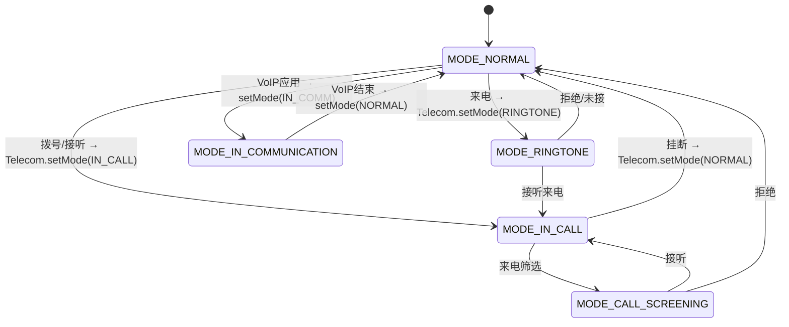

### 3.8.2 setMode()执行流程 — SetModeDeathHandler栈模型

AudioMode采用**栈模型**管理，与Focus栈类似但不同：特权App始终优先于非特权App。

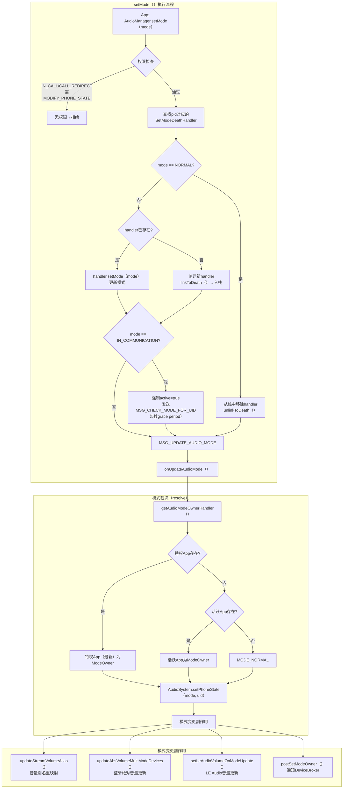

**源码位置**: [`AudioService.java:5777-5960`](frameworks/base/services/core/java/com/android/server/audio/AudioService.java:5777)

**SetModeDeathHandler.isActive()判定规则**:
- 特权App(有MODIFY_PHONE_STATE) → 始终active
- MODE_IN_COMMUNICATION → 需要playbackActive || recordingActive
- MODE_RINGTONE / MODE_CALL_SCREENING → 始终active
- 其他模式 → 需要特权

### 3.8.3 CommunicationDevice — 通信设备选择

Android 12引入`setCommunicationDevice()`替代已废弃的`setSpeakerphoneOn()/setBluetoothScoOn()`，提供更精确的通信设备控制。

```mermaid
flowchart TB
    subgraph "通信设备选择流程"
        APP["App: AudioManager.setCommunicationDevice（device）"] --> AS["AudioService.setCommunicationDevice（）"]
        AS --> BROKER["AudioDeviceBroker.setCommunicationDevice（）"]
        BROKER --> CRC_MGR["CommunicationRouteClient栈管理"]
        CRC_MGR --> TOP["topCommunicationRouteClient（）"]
        TOP --> MODE_CHECK{"AudioModeOwner活跃?"}
        MODE_CHECK -->|"是"| MODE_OWNER["ModeOwner PID对应的Client"]
        MODE_CHECK -->|"否"| FIRST["栈顶Client（最新）"]
        MODE_OWNER --> ROUTE["onUpdateCommunicationRouteClient（）"]
        FIRST --> ROUTE
        ROUTE --> SET_COMM["AudioSystem.setCommunicationDevice（portId）"]
        SET_COMM --> SCO_CHECK{"需要SCO?"}
        SCO_CHECK -->|"是（BT耳机）"| START_SCO["startBluetoothSco（）<br>建立SCO音频链路"]
        SCO_CHECK -->|"否"| DONE["完成"]
        START_SCO --> DONE


    end

```

**CommunicationRouteClient栈规则**（源码: [`AudioDeviceBroker.java:2099-2290`](frameworks/base/services/core/java/com/android/server/audio/AudioDeviceBroker.java:2099)）:

| 场景 | 栈操作 | 通信设备 |
|------|--------|---------|
| VoIP App选择BT SCO | 新Client入栈顶 | BT SCO |
| 电话来电(IN_CALL) | ModeOwner优先 | 听筒/BT SCO(由Mode决定) |
| VoIP App clearDevice | Client出栈 | 栈中下一个Client的设备 |
| ModeOwner切换 | 重新评估 | 新ModeOwner的设备 |
| App进程死亡 | binderDeth→Client出栈 | 重路由 |

**AudioMode与通信设备的联合路由决策**:

| AudioMode | 通信设备默认行为 | 可选设备 |
|-----------|---------------|---------|
| MODE_NORMAL | 无(媒体路由) | — |
| MODE_RINGTONE | 扬声器+蓝牙SCO | 扬声器/蓝牙SCO |
| MODE_IN_CALL | 听筒(默认) | 听筒/蓝牙SCO/USB |
| MODE_IN_COMMUNICATION | 上次通信设备 | 蓝牙SCO/扬声器/USB/有线耳机 |

> **关键交互**: AudioMode变更→`postSetModeOwner()`→`onUpdateCommunicationRouteClient()`→重新选择通信设备→可能触发SCO连接/断开。三者(AudioMode/Focus/Device)通过`mSetModeLock`同步。

---

## 3.9 录音并发仲裁机制 — Concurrent Capture

Android 10+支持多App并发录音，但仲裁规则极其复杂。核心逻辑在[`AudioPolicyService::updateActiveClients_l()`](frameworks/av/services/audiopolicy/service/AudioPolicyService.cpp:880)。

### 3.9.1 仲裁数据结构

| 字段 | 类型 | 说明 |
|------|------|------|
| `topActive` | `AudioRecordClient*` | 前台UI的活跃录音客户端 |
| `topSensitiveActive` | `AudioRecordClient*` | 隐私敏感录音的活跃客户端 |
| `latestActiveAssistant` | `AudioRecordClient*` | 最近活跃的语音助手 |
| `canCaptureOutput` | `bool` | 是否持有`CAPTURE_AUDIO_OUTPUT`特权权限 |
| `canCaptureHotword` | `bool` | 是否持有`CAPTURE_AUDIO_HOTWORD`特权权限 |

### 3.9.2 五层仲裁规则

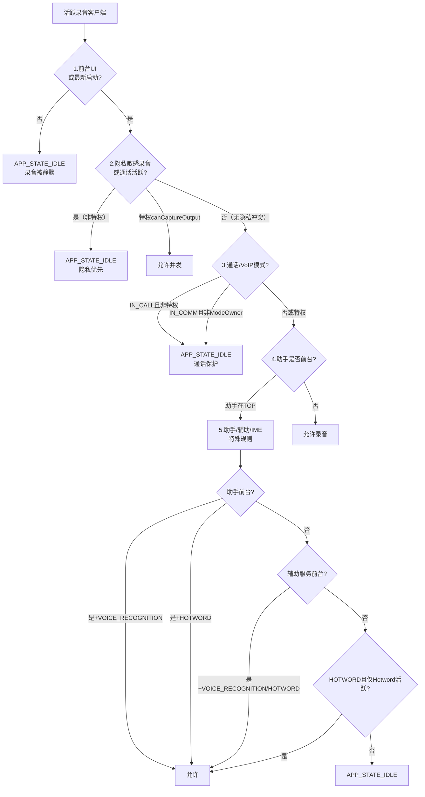

### 3.9.3 关键仲裁场景

| 场景 | 仲裁结果 | 规则来源 |
|------|---------|---------|
| 普通App前台 + 隐私敏感App活跃 | **隐私App优先**，普通App被静默 | `!topActive->canCaptureOutput` → `topActive=null` |
| 特权App持有CAPTURE_AUDIO_OUTPUT | **允许并发**，不受隐私限制 | `canCaptureOutput=true` → 绕过隐私检查 |
| 通话中(IN_CALL) + 非特权App录音 | **禁止录音** | `isInCall && !canCaptureCall` |
| VoIP模式(IN_COMM) + ModeOwner录音 | **允许** | `recordUid == mPhoneStateOwnerUid` |
| 语音助手前台 + VOICE_RECOGNITION | **允许** | 助手可使用VOICE_RECOGNITION源 |
| 语音助手后台 + HOTWORD | **允许**(仅Hotword活跃时) | `onlyHotwordActive && canCaptureIfInCallOrCommunication` |
| 辅助服务(A11y)前台 + VOICE_RECOGNITION | **允许** | `isA11yOnTop` 特殊规则 |
| RTT通话中 + IME + VOICE_RECOGNITION | **允许** | `rttCallActive && mUidPolicy->isCurrentImeUid` |

### 3.9.4 隐私敏感标志(privacySensitive)

```mermaid
---


```

> **核心原则**: 隐私敏感录音(如VoIP通话)优先于普通录音，防止"窃听"场景。

### 3.9.5 setAppState_l()

仲裁结果通过`setAppState_l()`通知AudioPolicyManager：

```cpp
// APP_STATE_TOP → 允许录音(正常路由到HAL)
// APP_STATE_IDLE → 静默录音(APM将AudioSource路由到空设备)
```

`silenceAllRecordings_l()`可在紧急场景(如安全音频焦点)下一次性静默所有非虚拟源录音。

---

## 3.10 RecordingActivityMonitor — 录音状态追踪

[`RecordingActivityMonitor`](frameworks/base/services/core/java/com/android/server/audio/RecordingActivityMonitor.java:47)实现`AudioSystem.AudioRecordingCallback`，追踪所有活跃录音会话。

### 3.10.1 核心数据结构

| 数据结构 | 说明 |
|----------|------|
| `RecordingState` | 单个录音会话状态(riid+isActive+config+deathHandler) |
| `mRecordStates` | `List<RecordingState>` — 所有录音状态列表 |
| `RecMonitorClient` | 注册的录音配置监听客户端(IRecordingConfigDispatcher) |

### 3.10.2 录音生命周期追踪

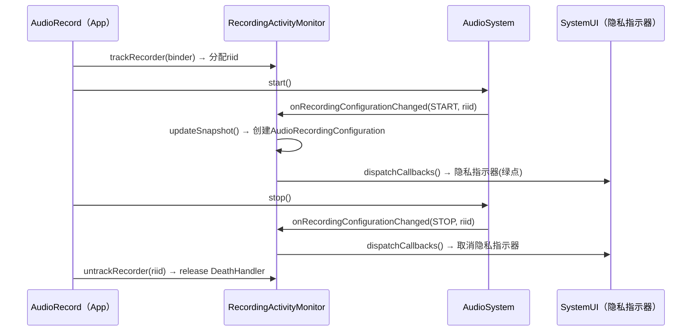

### 3.10.3 与PlaybackActivityMonitor对比

| 维度 | PlaybackActivityMonitor | RecordingActivityMonitor |
|------|------------------------|--------------------------|
| 追踪对象 | AudioTrack播放会话 | AudioRecord录音会话 |
| 执行能力 | duck/fadeout/mute播放器 | **仅追踪，无执行能力** |
| 隐私指示 | 无(播放不需指示) | 有(绿点麦克风图标) |
| 特殊逻辑 | DuckingManager/FadeOutManager | LegacyRemoteSubmix缓存 |
| 配置分发 | AudioPlaybackConfiguration | AudioRecordingConfiguration |

> **关键区别**: RecordingActivityMonitor仅负责**追踪+通知**，不执行任何录音控制。录音并发仲裁由Native层AudioPolicyService::updateActiveClients_l()执行，通过`setAppState_l()`将非授权App的录音路由到空设备(静默)。这与播放侧框架直接执行duck/fadeout/mute形成对比。

> [← 上一篇：Application Layer](02_Application_Layer.md) | [返回导航](README.md) | [下一篇：Native Framework →](04_Native_Framework_Layer.md)