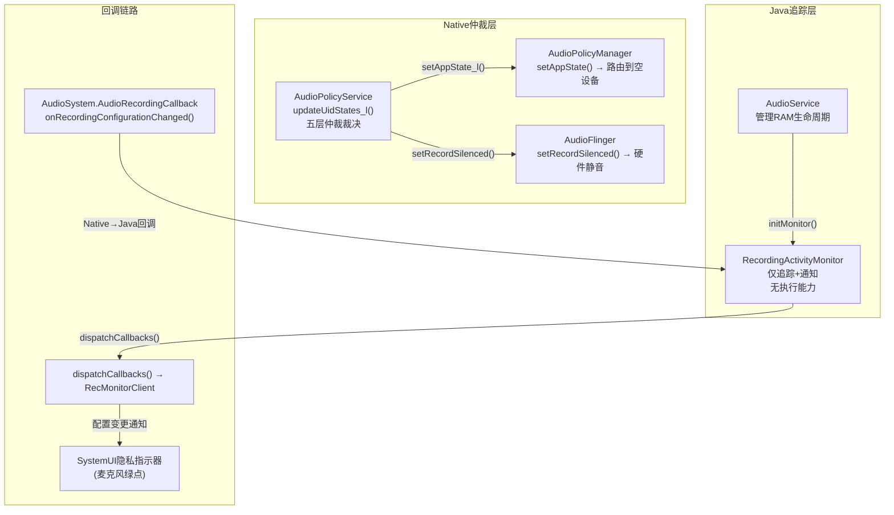
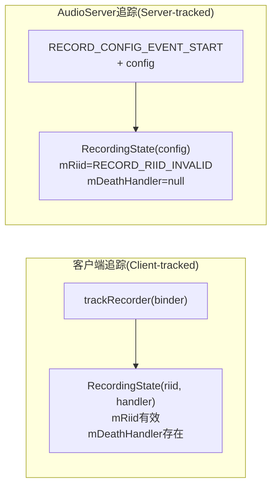
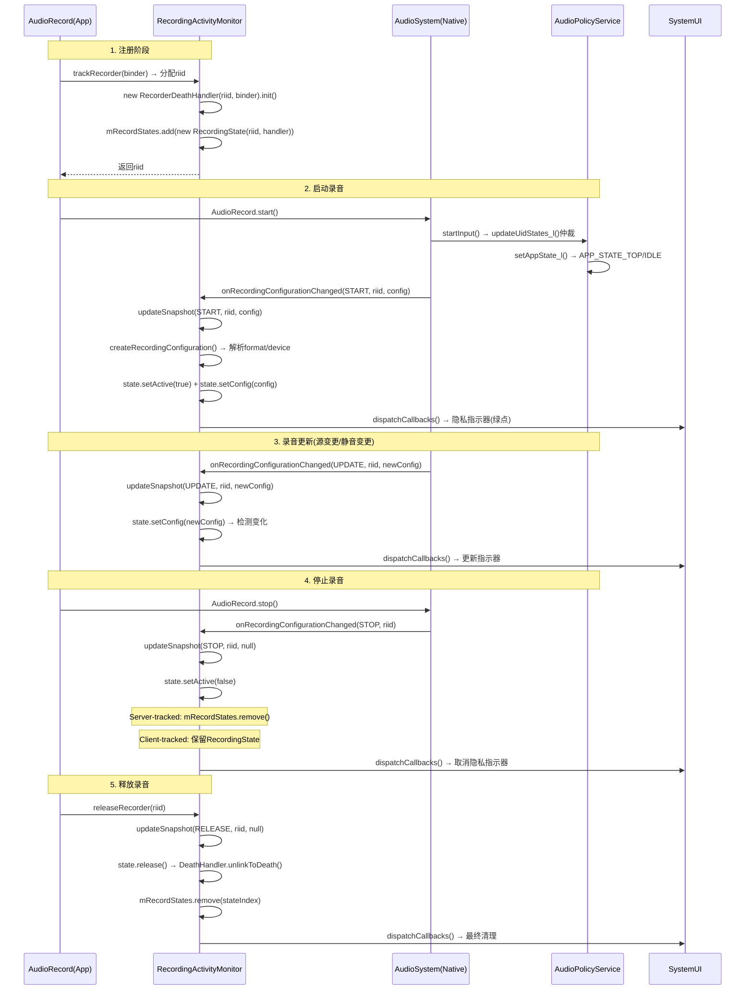
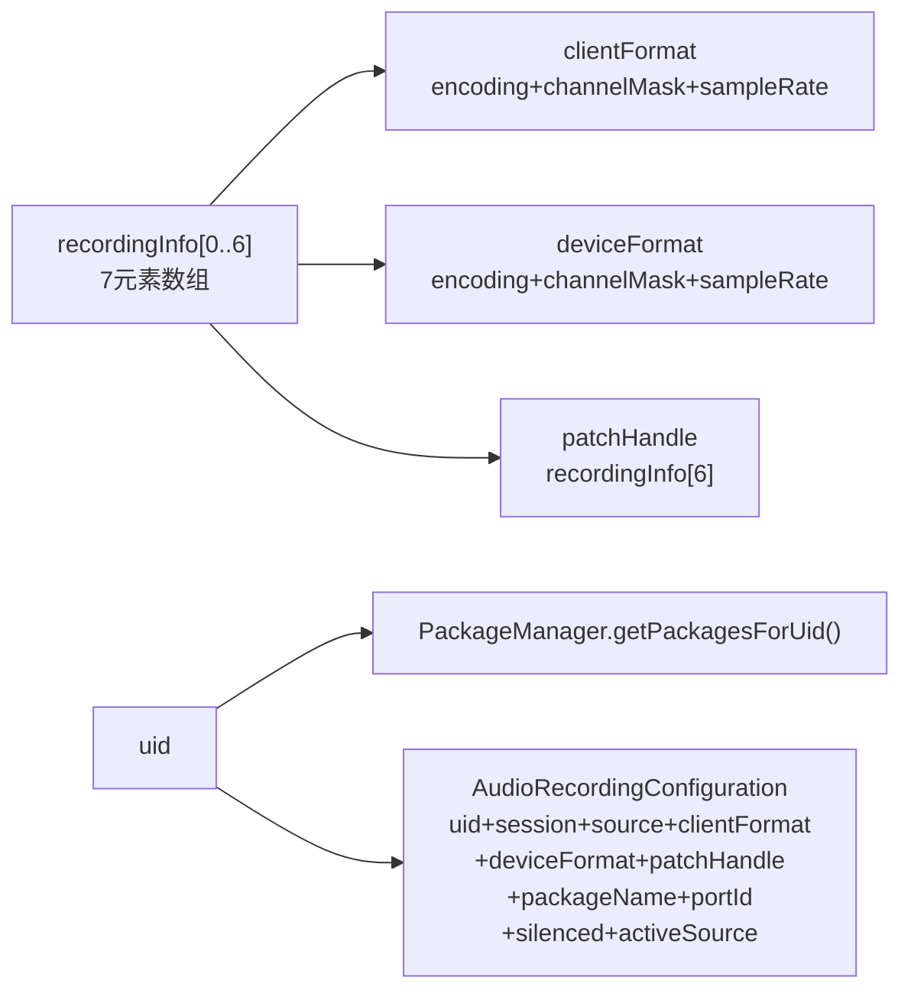
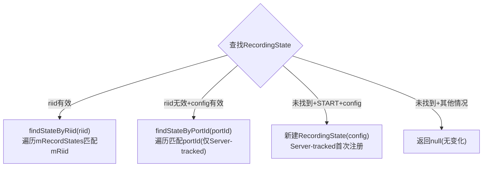
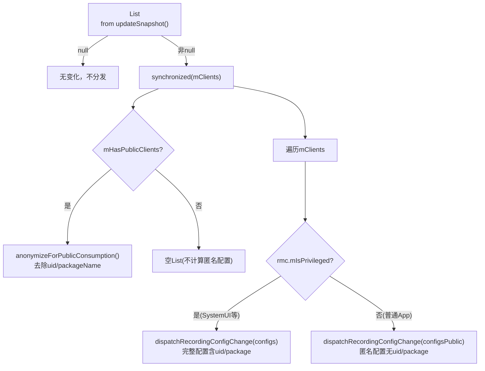
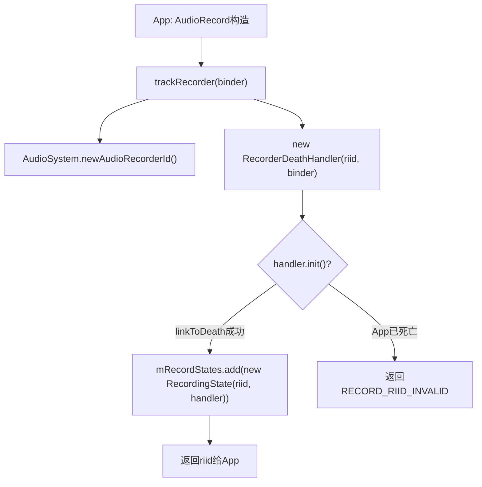
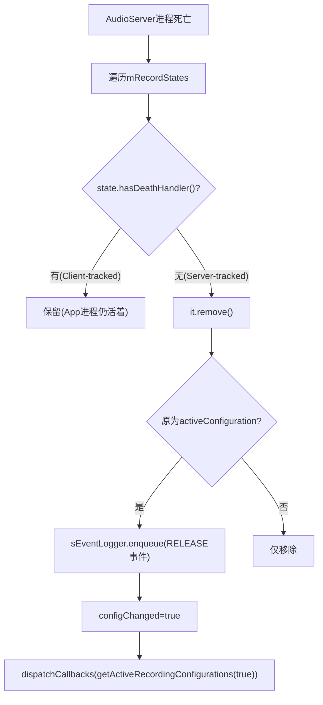
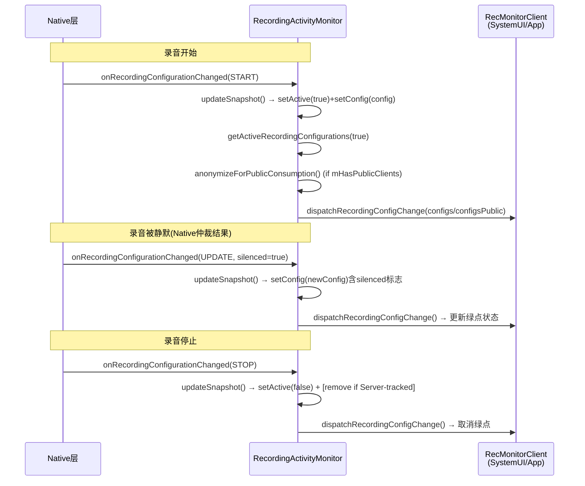

## 3.10 RecordingActivityMonitor — 录音状态追踪

> [← 上一个](03_3.9_录音并发仲裁机制-Concurrent_Capture.md) | [返回目录](README.md) | [下一篇 →](../04_Native_Framework_Layer/README.md)

---

[`RecordingActivityMonitor`](frameworks/base/services/core/java/com/android/server/audio/RecordingActivityMonitor.java:47)实现`AudioSystem.AudioRecordingCallback`接口，是AudioService中**唯一**的录音会话追踪器。其职责仅限于**追踪+通知**，不执行任何录音控制。录音并发仲裁由Native层[`AudioPolicyService`](frameworks/av/services/audiopolicy/service/AudioPolicyService.cpp)执行。

### 3.10.1 模块定位与架构角色



> **关键区别**: 播放侧[`PlaybackActivityMonitor`](03_3.6_PlaybackActivityMonitor-播放状态追踪.md)直接执行duck/fadeout/mute；录音侧RAM仅追踪，仲裁执行全部在Native层完成。

### 3.10.2 核心数据结构

#### RecordingState（源码 L67-132）

每个录音会话对应一个`RecordingState`实例：

| 字段 | 类型 | 说明 |
|------|------|------|
| `mRiid` | `int` | 录音实例ID，由[`AudioSystem.newAudioRecorderId()`](frameworks/base/media/java/android/media/AudioSystem.java)分配 |
| `mDeathHandler` | `RecorderDeathHandler` | Binder死亡监听器（客户端追踪的录音有handler；AudioServer追踪的录音handler=null） |
| `mIsActive` | `boolean` | 是否处于活跃录音状态 |
| `mConfig` | `AudioRecordingConfiguration` | 当前录音配置（uid/source/format/device/silenced等） |

**关键方法**：

| 方法 | 行号 | 说明 |
|------|------|------|
| `setActive(boolean)` | L111 | 设置活跃状态，返回`true`表示**状态变化**且`mConfig!=null` |
| `setConfig(AudioRecordingConfiguration)` | L118 | 更新配置，返回`true`表示**配置变化**且处于活跃状态 |
| `isActiveConfiguration()` | L100 | `mIsActive && mConfig != null` — 判断是否为"活跃+有配置"的有效状态 |
| `hasDeathHandler()` | L96 | `mDeathHandler != null` — 区分客户端追踪 vs AudioServer追踪 |
| `release()` | L104 | 释放DeathHandler（unlinkToDeath） |

#### 两种构造路径



- **客户端追踪**：App通过`AudioRecord.startRecording()`→`trackRecorder(binder)`注册，有DeathHandler监控进程死亡
- **AudioServer追踪**：Native回调触发`RECORD_CONFIG_EVENT_START`时自动创建，无DeathHandler（stop时自动移除）

#### RecMonitorClient（源码 L524-555）

监听录音配置变更的注册客户端：

| 字段 | 类型 | 说明 |
|------|------|------|
| `mDispatcherCb` | `IRecordingConfigDispatcher` | 回调接口（SystemUI/App注册） |
| `mIsPrivileged` | `boolean` | 是否为特权客户端（决定接收完整配置or匿名配置） |

#### RecorderDeathHandler（源码 L557-587）

App进程死亡时的清理机制：

| 字段 | 类型 | 说明 |
|------|------|------|
| `mRiid` | `int` | 对应的录音实例ID |
| `mRecorderToken` | `IBinder` | App的Binder令牌 |

**binderDied()行为**：App进程死亡 → `sMonitor.releaseRecorder(mRiid)` → 自动触发`RECORD_CONFIG_EVENT_RELEASE`事件 → 从`mRecordStates`移除 → dispatchCallbacks通知监听者

#### LegacyRemoteSubmix缓存（源码 L63-65）

| 字段 | 类型 | 说明 |
|------|------|------|
| `mLegacyRemoteSubmixRiid` | `AtomicInteger` | 缓存legacy remote submix录音的riid |
| `mLegacyRemoteSubmixActive` | `AtomicBoolean` | 缓存legacy remote submix的活跃状态 |

> **设计意图**: Remote Submix设备的活跃状态不在`mRecordStates`中缓存（因为可能被其他机制管理），因此用单独的Atomic变量追踪，用于AudioService判断是否需要固定设备路由。

### 3.10.3 录音生命周期追踪



### 3.10.4 onRecordingConfigurationChanged() — Native回调入口

**源码位置**: L146-171

```java
public void onRecordingConfigurationChanged(int event, int riid, int uid, int session,
                                            int source, int portId, boolean silenced,
                                            int[] recordingInfo, ...) {
```

**参数详解**：

| 参数 | 说明 |
|------|------|
| `event` | 事件类型：`RECORD_CONFIG_EVENT_START/UPDATE/STOP` |
| `riid` | 录音实例ID（由AudioServer追踪的录音有riid） |
| `uid` | 录音App的UID |
| `source` | AudioSource（MIC/VOICE_RECOGNITION/CAMCORDER等） |
| `portId` | Audio port ID（对应AudioFlinger中的录音端口） |
| `silenced` | 是否被仲裁静默（`APP_STATE_IDLE`→silenced=true） |
| `recordingInfo` | 7元素数组：[clientEncoding, clientChannelMask, clientSampleRate, deviceEncoding, deviceChannelMask, deviceSampleRate, patchHandle] |

**处理流程**（L146-171）：

1. **LegacyRemoteSubmix特殊处理** (L155-163): 如果source=`REMOTE_SUBMIX`且event=START/UPDATE，且device地址=`LEGACY_REMOTE_SUBMIX_ADDRESS`，则缓存riid和active状态到Atomic变量
2. **系统源过滤** (L165-169): `MediaRecorder.isSystemOnlyAudioSource(source)` → 仅日志记录，不分发回调（如`VOICE_UPLINK/DOWNLINK/VOICE_CALL`等系统源不对外暴露）
3. **分发回调** (L170): `dispatchCallbacks(updateSnapshot(event, riid, config))`

### 3.10.5 createRecordingConfiguration() — 配置对象构建

**源码位置**: L395-422

将Native传入的原始参数转换为Java层的`AudioRecordingConfiguration`对象：



> **recordingInfo数组结构**: `[clientEncoding, clientChannelMask, clientSampleRate, deviceEncoding, deviceChannelMask, deviceSampleRate, patchHandle]` — 前3个为客户端请求格式，中间3个为设备实际格式，最后1个为AudioPatch句柄。

### 3.10.6 updateSnapshot() — 状态快照更新引擎

**源码位置**: L432-494

这是RAM的核心逻辑，根据事件类型更新`mRecordStates`列表：

| 事件类型 | 行号 | 行为 | 返回条件 |
|----------|------|------|---------|
| `RECORD_CONFIG_EVENT_START` | L460-464 | `state.setActive(true)` + `state.setConfig(config)` | configChanged=config变化||active变化 |
| `RECORD_CONFIG_EVENT_UPDATE` | L466-468 | `state.setConfig(config)` | configChanged=config变化且active |
| `RECORD_CONFIG_EVENT_STOP` | L470-476 | `state.setActive(false)` + Server-tracked时remove | configChanged=active变化且config!=null |
| `RECORD_CONFIG_EVENT_RELEASE` | L478-481 | `state.release()` + remove | configChanged=原为activeConfiguration |

**查找策略** (L437-441)：



> **Stop事件差异**: Client-tracked录音stop后保留RecordingState（等待releaseRecorder清理）；Server-tracked录音stop后立即remove（因为下次start会重新创建）。

### 3.10.7 dispatchCallbacks() — 配置变更分发

**源码位置**: L239-261



**匿名化机制** (L277-286): `AudioRecordingConfiguration.anonymizedCopy(config)` — 创建去掉uid和packageName的配置副本，防止普通App获取其他App的录音隐私信息。

### 3.10.8 trackRecorder() / releaseRecorder() — 客户端注册管理

#### trackRecorder()（源码 L176-192）



#### releaseRecorder()（源码 L216-218）

直接调用`updateSnapshot(RELEASE, riid, null)` → state.release() + remove → 触发dispatchCallbacks

### 3.10.9 recorderEvent() — 客户端事件处理

**源码位置**: L197-211

App通过`AudioManager.setRecorderState(riid, event)`主动报告录音状态变更：

| 客户端event | 转换为configEvent |
|-------------|-----------------|
| `RECORDER_STATE_STARTED` | `RECORD_CONFIG_EVENT_START` |
| `RECORDER_STATE_STOPPED` | `RECORD_CONFIG_EVENT_STOP` |
| 其他 | `RECORD_CONFIG_EVENT_NONE`（跳过） |

**LegacyRemoteSubmix同步** (L198-200): 如果riid匹配缓存的`mLegacyRemoteSubmixRiid`，同步更新`mLegacyRemoteSubmixActive`状态。

### 3.10.10 onAudioServerDied() — AudioServer崩溃恢复

**源码位置**: L292-316

AudioServer进程死亡时，Server-tracked的录音全部失效（因为它们没有DeathHandler）：



> **设计意图**: Client-tracked录音的App进程可能仍然活着（AudioServer崩溃不影响App），因此保留其RecordingState等待AudioServer恢复后重新关联。Server-tracked录音则完全由AudioServer管理，崩溃后必须清除。

### 3.10.11 注册/注销监听回调

#### registerRecordingCallback()（源码 L318-331）

```java
void registerRecordingCallback(IRecordingConfigDispatcher rcdb, boolean isPrivileged)
```

- 创建`RecMonitorClient(rcdb, isPrivileged)`
- `rmc.init()` → linkToDeath监听客户端死亡
- `isPrivileged=false` → 设置`mHasPublicClients=true`（触发匿名配置计算）

#### unregisterRecordingCallback()（源码 L333-353）

- 遍历mClients匹配binder → remove + release
- 重新计算`mHasPublicClients`（遍历剩余客户端检查是否还有非特权客户端）

### 3.10.12 getActiveRecordingConfigurations() — 查询接口

**源码位置**: L355-370

```java
List<AudioRecordingConfiguration> getActiveRecordingConfigurations(boolean isPrivileged)
```

- 遍历`mRecordStates`，筛选`isActiveConfiguration()`为true的配置
- `isPrivileged=false` → `anonymizeForPublicConsumption()`匿名化
- `isPrivileged=true` → 返回完整配置

> **AudioRecordingConfiguration不可变**: 配置对象创建后永不更新。如果配置变化，RecordingState中的mConfig引用会替换为新对象（L364-365注释）。

### 3.10.13 isRecordingActiveForUid() — UID活跃检查

**源码位置**: L226-237

```java
boolean isRecordingActiveForUid(int uid)
```

遍历`mRecordStates`，查找`isActiveConfiguration() && getClientUid() == uid`的录音。AudioService用此方法判断某UID是否有活跃录音（如焦点/模式裁决中需要判断录音活跃性）。

### 3.10.14 initMonitor() — 初始化入口

**源码位置**: L288-290

```java
void initMonitor() {
    AudioSystem.setRecordingCallback(this);
}
```

在AudioService初始化阶段调用，将RAM注册为Native层`AudioSystem`的录音回调接收者。此后所有Native录音配置变更都会通过`onRecordingConfigurationChanged()`回调到此对象。

### 3.10.15 与PlaybackActivityMonitor的完整对比

| 维度 | PlaybackActivityMonitor | RecordingActivityMonitor |
|------|------------------------|--------------------------|
| 源码行数 | 1665行 | 649行 |
| 追踪对象 | AudioTrack播放会话 | AudioRecord录音会话 |
| 核心数据结构 | PlayerId>mPlaybackStateMap | RecordingState>mRecordStates |
| 执行能力 | duck/fadeout/mute播放器 | **仅追踪，无执行能力** |
| 隐私指示 | 无(播放不需指示) | 有(绿点麦克风图标) |
| 特殊逻辑 | DuckingManager/FadeOutManager/VolumeShaper | LegacyRemoteSubmix缓存 |
| 配置对象 | AudioPlaybackConfiguration | AudioRecordingConfiguration |
| 配置匿名化 | 无 | anonymizedCopy去除uid/package |
| Native仲裁 | 无(PAM直接执行) | AudioPolicyService.updateUidStates_l() |
| Server崩溃恢复 | 清除所有Server-tracked状态 | 同：清除无DeathHandler的状态 |
| DeathHandler | PlaybackDeathMonitor | RecorderDeathHandler |

### 3.10.16 完整回调链路



> **核心设计原则**: RecordingActivityMonitor是纯粹的**观察者模式**实现——它观察Native层录音状态变化，通知Java层监听者，但不参与任何录音控制决策。所有仲裁和静音执行在Native层完成，RAM仅被动接收结果（通过config中的`silenced`标志）。

---

> [← 上一篇：Application Layer](../02_Application_Layer/README.md) | [返回导航](README.md) | [下一篇：Native Framework →](../04_Native_Framework_Layer/README.md)