## 3.1 AudioService — 音频系统服务中枢

> [← 上一篇](../02_Application_Layer/README.md) | [返回目录](README.md) | [下一个 →](03_3.2_MediaFocusControl-焦点仲裁器.md)

---

### 模块职责

`AudioService` 运行在 `system_server` 进程中，是 Android 音频框架的**中枢调度器**。它协调音量控制、铃声模式管理、AudioMode状态机、设备连接管理、安全音量策略、音效加载等所有音频子系统，是 Java Framework 层与 Native AudioFlinger/AudioPolicyService 之间的核心桥梁。

**源码位置**：`frameworks/base/services/core/java/com/android/server/audio/AudioService.java`（13267行）

---

### 一、类声明与继承关系

```java
// L244-248
public class AudioService extends IAudioService.Stub
        implements AccessibilityManager.TouchExplorationStateChangeListener,
            AccessibilityManager.AccessibilityServicesStateChangeListener,
            AudioSystemAdapter.OnRoutingUpdatedListener,
            AudioSystemAdapter.OnVolRangeInitRequestListener
```

**继承体系分析**：

| 继承/实现 | 作用 |
|-----------|------|
| `IAudioService.Stub` | Binder服务端，暴露所有音频API给应用进程 |
| `TouchExplorationStateChangeListener` | 无障碍触摸探索状态变化回调 |
| `AccessibilityServicesStateChangeListener` | 无障碍服务状态变化回调 |
| `OnRoutingUpdatedListener` | Native路由更新回调，AudioPolicyManager设备路由变化时触发 |
| `OnVolRangeInitRequestListener` | Native音量范围初始化请求回调 |

**四大适配器模式**（L252-255）：

```java
private final AudioSystemAdapter mAudioSystem;   // Native AudioSystem操作适配器
private final SystemServerAdapter mSystemServer;  // 系统服务上下文适配器
private final SettingsAdapter mSettings;          // Settings数据库操作适配器
private final AudioPolicyFacade mAudioPolicy;     // 音频策略 facade
```

适配器设计使得 AudioService 可测试——单元测试可注入 Mock 适配器，避免直接依赖系统服务。

---

### 二、核心类关系架构图

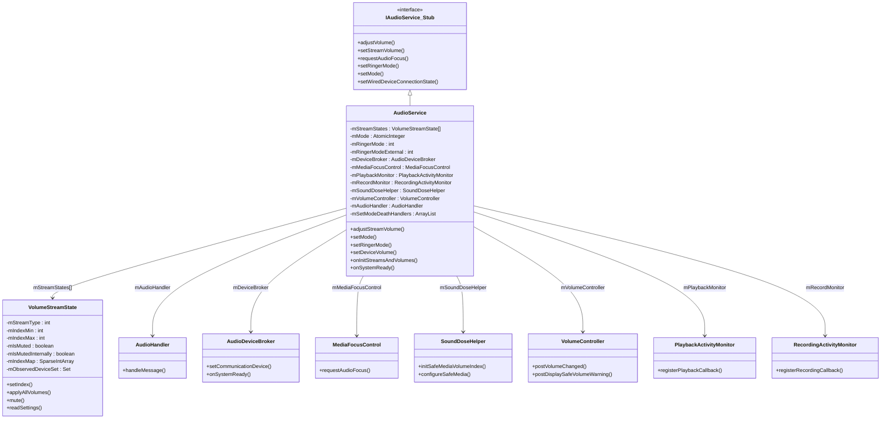

---

### 三、核心字段详解

#### 3.1 音量流状态数组

```java
// L423
private VolumeStreamState[] mStreamStates;
```

数组索引为 `AudioSystem.STREAM_*` 常量（0-11），每个元素维护对应流的**所有设备音量索引**、**静音状态**、**VolumeGroup关联**。

#### 3.2 音频模式原子变量

```java
// L439
private AtomicInteger mMode = new AtomicInteger(AudioSystem.MODE_NORMAL);
```

| 模式值 | 含义 | 典型场景 |
|--------|------|----------|
| `MODE_NORMAL(0)` | 正常模式 | 媒体播放 |
| `MODE_RINGTONE(1)` | 来铃模式 | 电话来电振铃 |
| `MODE_IN_CALL(2)` | 通话模式 | 电话通话中 |
| `MODE_IN_COMMUNICATION(3)` | 通信模式 | VoIP/视频通话 |
| `MODE_CALL_SCREENING(4)` | 呼叫筛选 | 筛选来电 |
| `MODE_CALL_REDIRECT(5)` | 呼叫重定向 | 系统级通话路由 |
| `MODE_COMMUNICATION_REDIRECT(6)` | 通信重定向 | 系统级通信路由 |

#### 3.3 铃声模式双状态

```java
private int mRingerMode;           // 内部铃声模式（实际生效值）
private int mRingerModeExternal;   // 外部铃声模式（应用可见值）
```

双状态设计原因：`RingerModeDelegate`（DND策略）可在 internal 和 external 之间插入过滤逻辑。例如 DND 优先级模式下，外部请求 `RINGER_MODE_NORMAL`，经 Delegate 过滤后内部实际生效 `RINGER_MODE_SILENT`。

#### 3.4 设备音量行为集合

```java
private Set<Integer> mFixedVolumeDevices;      // 固定音量设备（如某些HDMI）
private Set<Integer> mFullVolumeDevices;       // 全音量设备（HDMI CEC全音量模式）
private Map<Integer, AbsoluteVolumeDeviceInfo> mAbsoluteVolumeDeviceInfoMap;  // 绝对音量设备
```

| 行为类型 | 判定方法 | 音量策略 |
|----------|----------|----------|
| Fixed Volume | `isFixedVolumeDevice()` | 只能在0和最大值之间切换 |
| Full Volume | `isFullVolumeDevice()` | 本地不控制音量，通过HDMI CEC由外部设备控制 |
| Absolute Volume | `isAbsoluteVolumeDevice()` | 音量直接同步到远端设备（A2DP/LE Audio） |
| A2DP Absolute | `isA2dpAbsoluteVolumeDevice()` | A2DP蓝牙绝对音量专用判定 |

---

### 四、Handler消息体系

AudioService 通过 `AudioHandler`（内部类）处理异步消息，定义约50+消息类型（L348-406）：

```java
// 消息发送模式
private static final int SENDMSG_REPLACE = 0;  // 替换已存在的同类型消息
private static final int SENDMSG_NOOP = 1;      // 已存在则忽略新消息
private static final int SENDMSG_QUEUE = 2;     // 队列尾部追加
```

**核心消息分类表**：

| 类别 | 消息ID | 含义 | 触发场景 |
|------|--------|------|----------|
| **音量核心** | `MSG_SET_DEVICE_VOLUME(0)` | 设置设备音量 | 音量调节后下发 |
| | `MSG_PERSIST_VOLUME(1)` | 持久化音量到Settings | 音量变化延迟保存 |
| | `MSG_PERSIST_VOLUME_GROUP(2)` | 持久化音量组 | 音量组变化 |
| | `MSG_SET_ALL_VOLUMES(10)` | 重设所有流音量 | 别名流同步 |
| | `MSG_SET_DEVICE_STREAM_VOLUME(26)` | 设置指定流指定设备音量 | 外部指定 |
| | `MSG_UNMUTE_STREAM(18)` | 延迟取消静音 | 音量下调时的延迟解除 |
| | `MSG_REINIT_VOLUMES(34)` | 重初始化音量 | initStreamVolume失败重试 |
| **铃声/模式** | `MSG_PERSIST_RINGER_MODE(3)` | 持久化铃声模式 | 铃声模式变化 |
| | `MSG_UPDATE_RINGER_MODE(25)` | 更新铃声模式 | 外部铃声模式变化 |
| | `MSG_UPDATE_AUDIO_MODE(36)` | 更新AudioMode | setMode触发 |
| | `MSG_DISPATCH_AUDIO_MODE(40)` | 分发AudioMode变化 | mode成功切换后 |
| | `MSG_CHECK_MODE_FOR_UID(31)` | 检查UID活跃状态 | MODE_IN_COMMUNICATION定时检查 |
| **系统生命周期** | `MSG_SYSTEM_READY(16)` | 系统就绪 | SystemServer回调 |
| | `MSG_AUDIO_SERVER_DIED(4)` | AudioFlinger死亡 | ErrorCallback检测 |
| | `MSG_INDICATE_SYSTEM_READY(20)` | 通知Native系统就绪 | 重试机制 |
| | `MSG_INIT_STREAMS_VOLUMES(101)` | 初始化流音量 | 构造函数WakeLock下 |
| | `MSG_INIT_SPATIALIZER(102)` | 初始化空间音频 | 构造函数WakeLock下 |
| **设备管理** | `MSG_SET_FORCE_USE(8)` | 设置强制使用场景 | 底座/蓝牙/SCO变化 |
| | `MSG_BT_DEV_CHANGED(38)` | 蓝牙设备变化 | BT状态广播 |
| | `MSG_OBSERVE_DEVICES_FOR_ALL_STREAMS(27)` | 观察所有流设备 | 路由更新回调 |
| | `MSG_STREAM_DEVICES_CHANGED(32)` | 流设备变化通知 | VSS设备集合变化 |
| | `MSG_UPDATE_VOLUME_STATES_FOR_DEVICE(33)` | 更新设备音量状态 | 设备连接后 |
| **音效/空间音频** | `MSG_LOAD_SOUND_EFFECTS(7)` | 加载音效 | 系统就绪后 |
| | `MSG_PLAY_SOUND_EFFECT(5)` | 播放音效 | UI操作触发 |
| | `MSG_INIT_HEADTRACKING_SENSORS(42)` | 初始化头部追踪 | 空间音频初始化 |
| | `MSG_RESET_SPATIALIZER(50)` | 重置空间化器 | 路由变化 |
| **配置变化** | `MSG_CONFIGURATION_CHANGED(54)` | 配置变更 | 语言/SIM卡切换 |
| | `MSG_ROTATION_UPDATE(48)` | 屏幕旋转更新 | 监听旋转属性 |
| | `MSG_FOLD_UPDATE(49)` | 折叠屏状态更新 | 折叠屏设备 |

**WakeLock消息**（L100-102）：`MSG_INIT_STREAMS_VOLUMES` 和 `MSG_INIT_SPATIALIZER` 在 `queueMsgUnderWakeLock()` 下执行，保证初始化期间CPU不休眠。

---

### 五、流音量别名配置（L485-546）

别名机制是 AudioService 音量架构的核心设计：多个流类型可以共享同一个"主流"的音量，避免用户需要独立调节每个流。

**四套别名数组**：

| 配置名称 | 适用平台 | 关键别名规则 |
|----------|----------|--------------|
| `STREAM_VOLUME_ALIAS_VOICE` | 手机（带电话） | SYSTEM→RING, NOTIFICATION→RING, DTMF→RING, TTS→MUSIC, ACCESSIBILITY→MUSIC, ASSISTANT→MUSIC |
| `STREAM_VOLUME_ALIAS_TELEVISION` | 电视/机顶盒 | 几乎所有流→MUSIC，只有BLUETOOTH_SCO独立 |
| `STREAM_VOLUME_ALIAS_DEFAULT` | 平板/通用 | SYSTEM→RING, NOTIFICATION→RING, DTMF→RING（与VOICE类似但VOICE_CALL独立） |
| `STREAM_VOLUME_ALIAS_NONE` | **AAOS音量组模式** | **所有流独立，不设别名**——由VolumeGroup接管音量控制 |

**AAOS特殊性**：`STREAM_VOLUME_ALIAS_NONE` 让每个流独立管理音量索引，这是因为 AAOS 使用 `VolumeGroup`（基于 `AudioAttributes`）而非传统 `StreamType` 来控制音量。`config_handleVolumeAliasesUsingVolumeGroups` 为 `true` 时启用此模式。

```java
// L519-532 AAOS别名数组：每个流指向自身
STREAM_VOLUME_ALIAS_NONE = {
    STREAM_VOICE_CALL → STREAM_VOICE_CALL,
    STREAM_SYSTEM     → STREAM_SYSTEM,
    STREAM_RING       → STREAM_RING,       // 独立
    STREAM_MUSIC      → STREAM_MUSIC,
    STREAM_ALARM      → STREAM_ALARM,
    STREAM_NOTIFICATION → STREAM_NOTIFICATION,  // 独立！不别名到RING
    ...
}
```

---

### 六、构造函数与初始化时序

#### 6.1 构造函数深度解析（L1008-1255）

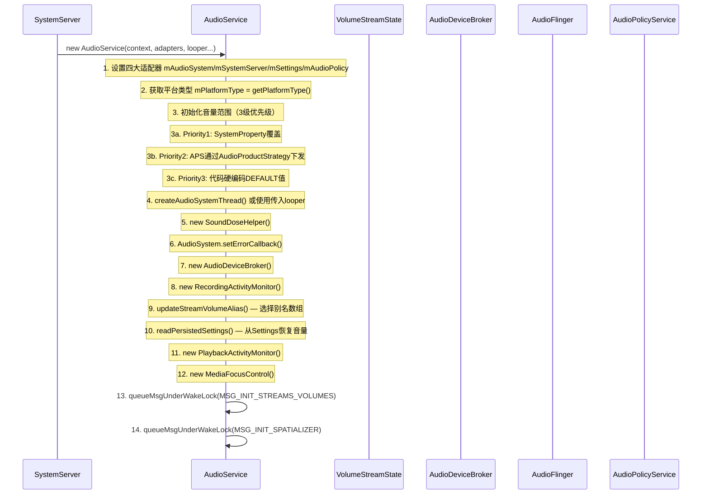

**音量范围初始化三级优先级**（L1054-1080）：

```
Priority 1 → SystemProperty (ro.config.vc_call_vol_steps, ro.config.media_vol_steps...)
Priority 2 → AudioPolicyService (AudioProductStrategy.getAudioAttributesForStrategy → getMaxVolumeIndexForAttributes)
Priority 3 → 硬编码默认值 (MAX_STREAM_VOLUME[] / MIN_STREAM_VOLUME[])
```

具体属性列表：

| 属性名 | 作用 | 默认值 |
|--------|------|--------|
| `ro.config.vc_call_vol_steps` | 通话最大音量步数 | 5 |
| `ro.config.vc_call_vol_default` | 通话默认音量 | max×3/4 |
| `ro.config.media_vol_steps` | 媒体最大音量步数 | 15 |
| `ro.config.media_vol_default` | 媒体默认音量 | TV:max/4, 其他:max/3 |
| `ro.config.alarm_vol_steps` | 闹钟最大音量步数 | 7 |
| `ro.config.alarm_vol_default` | 闹钟默认音量 | 6×max/7 |
| `ro.config.system_vol_steps` | 系统最大音量步数 | 7 |
| `ro.config.system_vol_default` | 系统默认音量 | max |
| `ro.config.assistant_vol_min` | 助手最小音量 | 1 |

#### 6.2 onInitStreamsAndVolumes（L1274-1325）

此方法在 WakeLock 保护下通过 `MSG_INIT_STREAMS_VOLUMES` 触发：

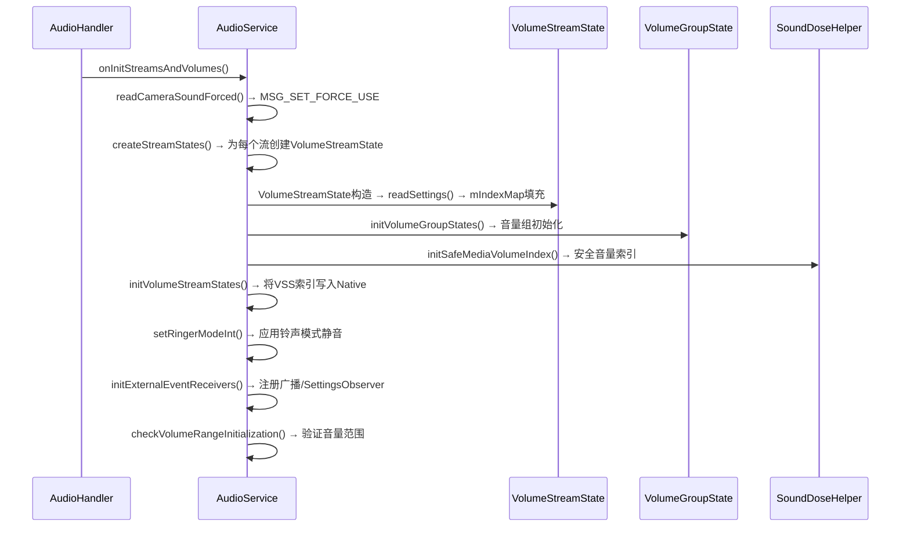

**关键步骤详解**：

1. **`createStreamStates()`**：遍历所有 `STREAM_*` 类型，为每个创建 `VolumeStreamState` 对象。构造时调用 `AudioSystem.initStreamVolume()` 通知 Native 该流的 min/max 范围，然后 `readSettings()` 从 Settings.System 读取各设备历史音量填充 `mIndexMap`。

2. **`initVolumeStreamStates()`**：将 Java 层的 `mIndexMap` 数据同步到 Native `AudioSystem`，完成音量索引的双向一致性。

3. **`setRingerModeInt()`**：初始化铃声模式，调用 `muteRingerModeStreams()` 根据铃声模式+DND策略决定哪些流需要静音。

#### 6.3 onSystemReady（L1434-1490）

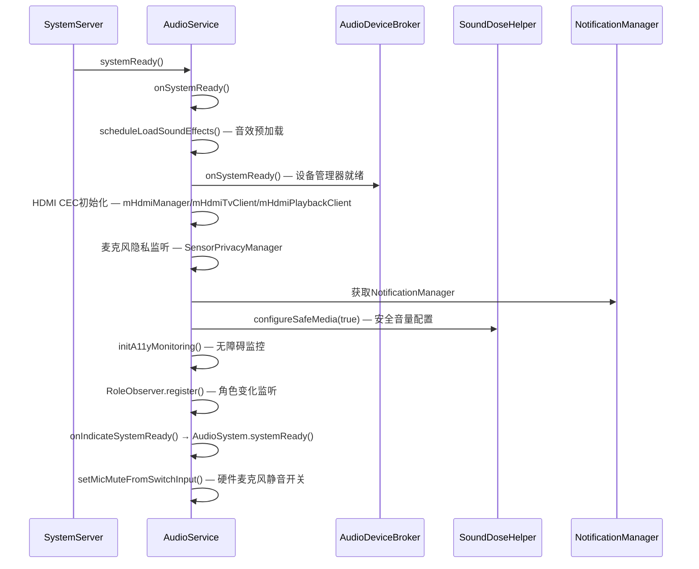

---

### 七、音量控制核心方法深度解析

#### 7.1 adjustStreamVolume（L3366-3660）

这是音量调节的**主入口方法**，处理音量键事件和API调用。

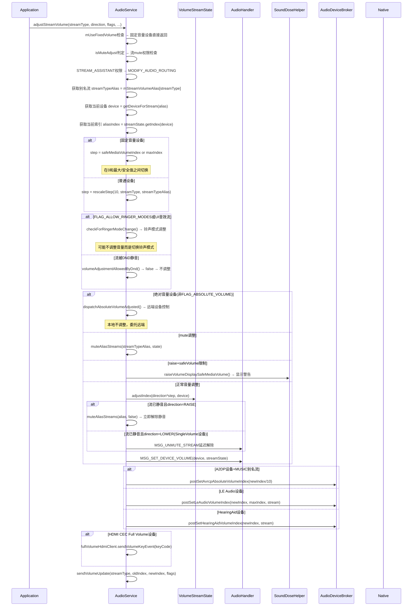

**关键参数说明**：

| 参数 | 类型 | 含义 |
|------|------|------|
| `streamType` | int | 目标流类型（STREAM_MUSIC等） |
| `direction` | int | ADJUST_RAISE/ADJUST_LOWER/ADJUST_MUTE/ADJUST_UNMUTE/ADJUST_TOGGLE_MUTE/ADJUST_SAME |
| `flags` | int | FLAG_SHOW_UI/FLAG_VIBRATE/FLAG_PLAY_SOUND/FLAG_ALLOW_RINGER_MODES/FLAG_BLUETOOTH_ABS_VOLUME等 |
| `keyEventMode` | int | ADJUST_MODE_NORMAL/START/END — 用于HDMI CEC长按键处理 |
| `hasModifyAudioSettings` | boolean | 调用者是否持有MODIFY_AUDIO_SETTINGS权限（影响音量下限） |

**`rescaleStep()`原理**：用户每按一次音量键（±1 UI步），内部需要转换为10个内部单位。但由于别名流的步数范围可能不同，`rescaleStep()` 按比例缩放：

```
step = 10 * maxAlias / maxStream（近似）
```

#### 7.2 音量应用链：setStreamVolumeInt → setDeviceVolume → setAllVolumes

```
adjustStreamVolume → MSG_SET_DEVICE_VOLUME
    → AudioHandler.onSetDeviceVolume()
        → VolumeStreamState.setDeviceVolume()
            → applyDeviceVolume_syncVSS()  // 计算并应用当前设备音量
            → 别名流同步: setAllVolumes(aliasStreamState)
            → MSG_PERSIST_VOLUME(延迟持久化)
```

**`setDeviceVolume()`**（L9016-9053）核心逻辑：

```java
private void setDeviceVolume(VolumeStreamState streamState, int device) {
    // 1. 对当前流应用音量到指定设备
    streamState.applyDeviceVolume_syncVSS(device);
    
    // 2. 对所有别名流同步音量
    for (int streamType = ...) {
        if (mStreamVolumeAlias[streamType] == streamState.mStreamType) {
            mStreamStates[streamType].applyDeviceVolume_syncVSS(device);
        }
    }
    
    // 3. 延迟持久化音量到Settings
    sendMsg(mAudioHandler, MSG_PERSIST_VOLUME, ...);
}
```

---

### 八、VolumeStreamState 完整深度解析（L8219-8926）

`VolumeStreamState`（简称VSS）是 AudioService 音量管理的**核心数据结构**，每个 `STREAM_*` 类型对应一个VSS实例，维护该流在所有输出设备上的音量索引。

#### 8.1 VSS 数据结构总览

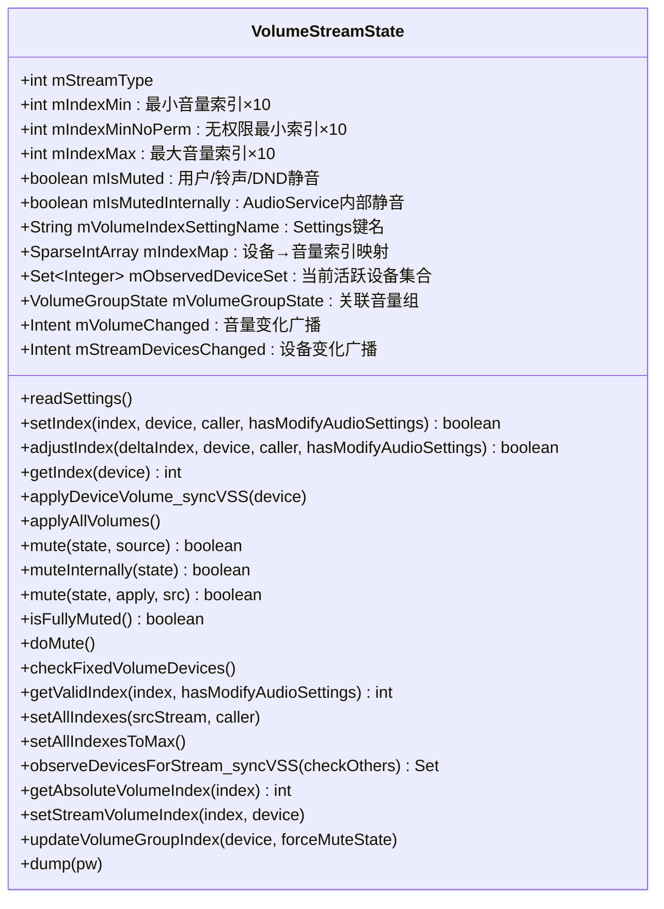

#### 8.2 mIndexMap 双层静音机制

`mIndexMap`（L8232-8257）是自定义 `SparseIntArray`，**key为设备类型（如DEVICE_OUT_SPEAKER），value为音量索引（×10精度）**。每次 `put/setValueAt` 自动调用 `record()` 将变更写入 MediaMetrics：

```java
// L8232-8257 mIndexMap的MediaMetrics记录
private void record(String event, int key, int value) {
    new MediaMetrics.Item("audio.volume." + streamToString(mStreamType) + "." + deviceName)
        .set(MediaMetrics.Property.EVENT, event)      // "put"或"setValueAt"
        .set(MediaMetrics.Property.INDEX, value)       // 新索引值
        .set(MediaMetrics.Property.MIN_INDEX, mIndexMin)
        .set(MediaMetrics.Property.MAX_INDEX, mIndexMax)
        .record();
}
```

**双层静音判定**：

| 静音层 | 字段 | 来源 | 何时生效 |
|--------|------|------|----------|
| 外部静音 | `mIsMuted` | 用户静音/铃声模式/DND策略 | `mute(state, source)` 设置 |
| 内部静音 | `mIsMutedInternally` | AudioService内部逻辑（如通话切换） | `muteInternally(state)` 设置 |
| 完全静音判定 | `isFullyMuted()` = `mIsMuted || mIsMutedInternally` | — | `applyDeviceVolume_syncVSS/applyAllVolumes` 使用 |

**设计意图**：`mIsMutedInternally` 允许 AudioService 在不改变用户可见的 `mIsMuted` 状态下，临时静音流（如通话开始时静音铃声流），通话结束后自动恢复。

#### 8.3 readSettings 持久化恢复逻辑（L8398-8443）

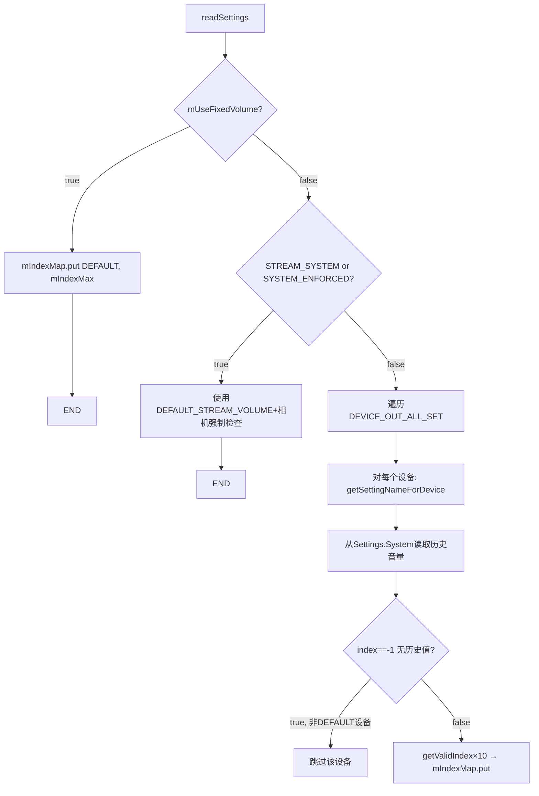

**Settings键名规则**（L8372-8381）：默认设备使用 `mVolumeIndexSettingName`（如`volume_stream_music`），其他设备追加后缀（如`volume_stream_music_speaker`）。

#### 8.4 setIndex 别名流同步详解（L8544-8620）

`setIndex()` 是音量索引变更的**核心写入方法**，它不仅更新当前流的 `mIndexMap`，还自动同步所有别名流：

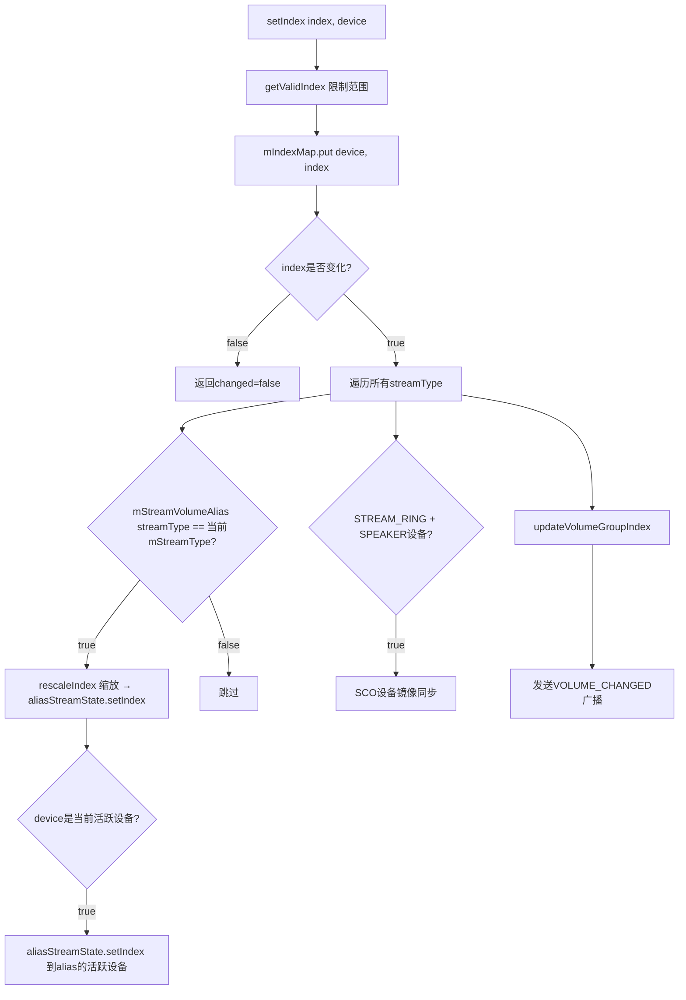

**别名流同步关键点**：
1. **`rescaleIndex()`**：将主流索引按比例缩放到别名流的索引范围（`scaledIndex = index * aliasMax / srcMax`）
2. **SCO镜像**（L8582-8590）：当 `STREAM_RING` 在 `DEVICE_OUT_SPEAKER` 上变更时，所有SCO设备的索引同步更新——确保蓝牙耳机来电铃声音量与扬声器一致
3. **广播条件**：只在 `isCurrentDevice`（变更设备是当前活跃设备）且 `oldIndex != newIndex` 时才发送 `VOLUME_CHANGED_ACTION` 广播

#### 8.5 applyDeviceVolume_syncVSS 音量应用逻辑（L8479-8495）

```java
// L8479-8495
void applyDeviceVolume_syncVSS(int device) {
    int index;
    if (isFullyMuted()) {
        index = 0;  // 双层静音→0
    } else if (isAbsoluteVolumeDevice(device) || isA2dpAbsoluteVolumeDevice(device)
            || AudioSystem.isLeAudioDeviceType(device)) {
        index = getAbsoluteVolumeIndex((getIndex(device) + 5)/10);  // 绝对音量预缩放
    } else if (isFullVolumeDevice(device)) {
        index = (mIndexMax + 5)/10;  // 全音量设备→最大值
    } else if (device == AudioSystem.DEVICE_OUT_HEARING_AID) {
        index = (mIndexMax + 5)/10;  // HearingAid→最大值
    } else {
        index = (getIndex(device) + 5)/10;  // 标准设备→/10四舍五入
    }
    setStreamVolumeIndex(index, device);  // 写入Native AudioSystem
}
```

**音量应用优先级链**：

| 条件 | index值 | 说明 |
|------|---------|------|
| `isFullyMuted()` | 0 | 双层静音，完全静音 |
| 绝对音量设备 | `getAbsoluteVolumeIndex()` | BT/LE Audio预缩放，防止低端设备音量过低 |
| 全音量设备 | `(mIndexMax+5)/10` | FixedVolume设备始终最大 |
| HearingAid | `(mIndexMax+5)/10` | 助听器始终最大增益 |
| 标准 | `(getIndex+5)/10` | 四舍五入到UI单位 |

**`getAbsoluteVolumeIndex()`**（L8446-8465）：蓝牙绝对音量预缩放机制——volume 0→0%，volume 1-3→低百分比（防止低端耳机最小音量仍然太大），volume ≥4→满增益。

#### 8.6 applyAllVolumes 全量应用（L8497-8536）

`applyAllVolumes()` 在设备切换、静音变更等场景调用，将 `mIndexMap` 中所有设备音量一次性写入 Native：

```
applyAllVolumes() 流程：
  1. 遍历mIndexMap中所有非DEFAULT设备 → 按applyDeviceVolume_syncVSS逻辑计算index
  2. 对每个设备发送 SoundDoseHelper.MSG_CSD_UPDATE_ATTENUATION（CSD音量衰减更新）
  3. 对每个设备调用 setStreamVolumeIndex(index, device)
  4. 最后应用DEFAULT设备音量（AudioPolicyManager fallback使用）
```

#### 8.7 mute/muteInternally 双路径静音（L8752-8843）

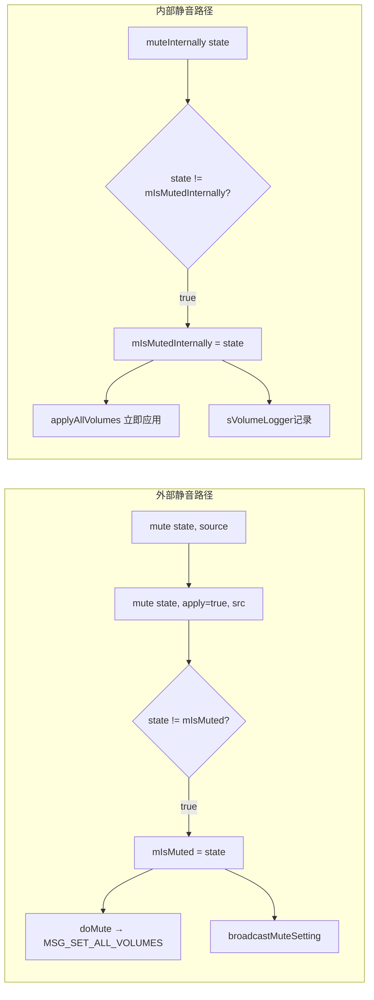

**关键差异**：

| 特征 | `mute()` | `muteInternally()` |
|------|----------|-------------------|
| 修改字段 | `mIsMuted` | `mIsMutedInternally` |
| 应用方式 | `doMute()` → `MSG_SET_ALL_VOLUMES`（异步） | `applyAllVolumes()`（同步立即） |
| 广播 | `broadcastMuteSetting()` 通知外部 | 仅 `sVolumeLogger` 内部日志 |
| 解除检查 | `isStreamMutedByRingerOrZenMode()` 防误解除 | 无检查 |
| 使用场景 | 铃声模式/DND/用户操作 | AudioService内部策略（通话切换等） |

`mute()` 的三参数版本 `mute(state, apply, src)`（L8804-8826）允许只更新缓存不应用（`apply=false`），用于先静音别名流再统一 `applyAllVolumes` 的场景。

---

### 九、铃声模式管理深度解析（L5397-5560）

铃声模式是移动设备最核心的用户体验之一——决定来电铃声、通知音和系统音的行为。AudioService 采用**双状态设计**，分离内部策略状态和外部可见状态。

#### 9.1 铃声模式双状态架构

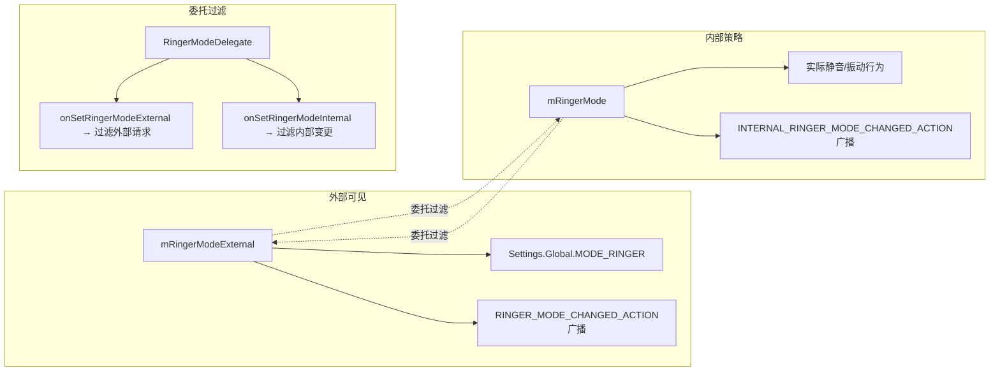

| 字段 | 类型 | 作用 | 持久化位置 |
|------|------|------|------------|
| `mRingerMode` | int | 内部实际铃声模式（决定静音行为） | `Settings.Global.MODE_RINGER` |
| `mRingerModeExternal` | int | 外部可见铃声模式（给应用/用户看） | `Settings.Global.MODE_RINGER_EXTERNAL` |

**RINGER_MODE枚举**：

| 值 | 名称 | 行为 |
|----|------|------|
| 0 | `RINGER_MODE_SILENT` | 完全静音，无振动 |
| 1 | `RINGER_MODE_VIBRATE` | 静音但振动 |
| 2 | `RINGER_MODE_NORMAL` | 正常响铃 |

#### 9.2 setRingerMode 双路径流程详解（L5397-5436）

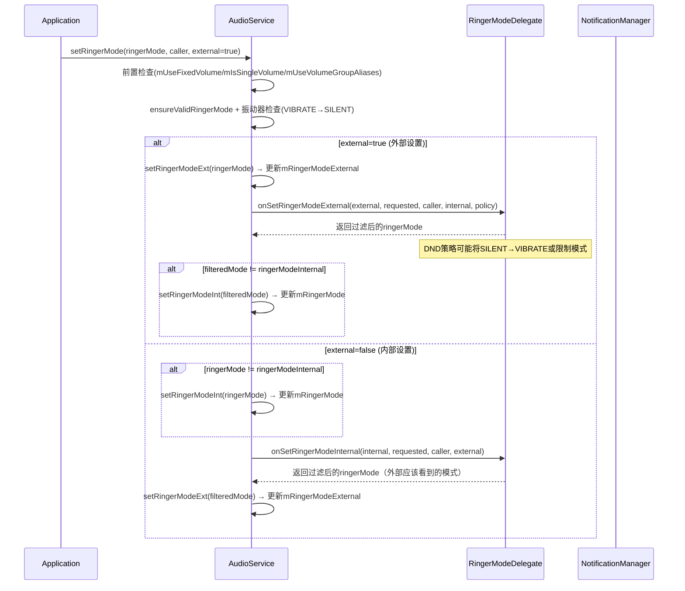

**关键设计**：
- **外部路径**：用户通过Settings/Volume面板设置 → 先更新外部状态 → RingerModeDelegate过滤（DND可能限制） → 再更新内部状态
- **内部路径**：DND/通话策略等内部触发 → 先更新内部状态 → RingerModeDelegate过滤（决定外部应该看到什么） → 再更新外部状态
- **RingerModeDelegate**：由 `NotificationManagerService` 实现，协调DND策略与铃声模式的关系

#### 9.3 muteRingerModeStreams 铃声静音执行逻辑（L5448-5515）

`muteRingerModeStreams()` 是铃声模式变更的**执行引擎**，遍历所有流决定哪些需要静音/解除静音：

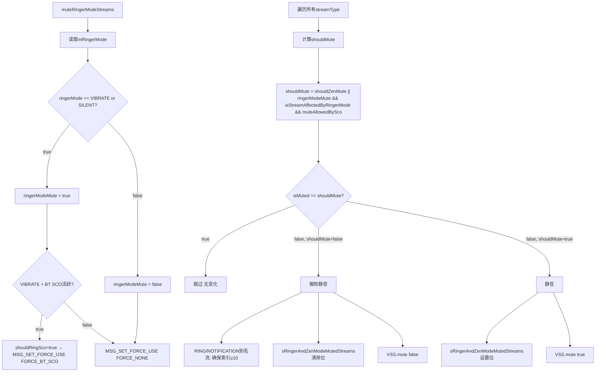

**核心静音判定公式**：

```
shouldMute = shouldZenMute(stream) || (ringerModeMute && isStreamAffectedByRingerMode(stream) && muteAllowedBySco)
```

| 判定函数 | 来源 | 说明 |
|----------|------|------|
| `shouldZenMute()` | DND策略 | NotificationManager的zen规则决定是否静音 |
| `isStreamAffectedByRingerMode()` | 系统配置 | `config_ringerModeAffectedStreams` 定义受铃声模式影响的流 |
| `muteAllowedBySco` | BT SCO状态 | VIBRATE+SCO活跃时RING流不静音（蓝牙耳机需要振动提示） |

**sRingerAndZenModeMutedStreams**：位掩码记录哪些流被铃声/DND静音，用于 `mute()` 时的防误解除检查（L8811-8817）。

**RING流索引保护**（L5480-5502）：解除静音时，RING/NOTIFICATION别名流如果索引为0，强制设为10（最小 audible 音量），确保铃声永远不会因为音量为0而无声。

---

### 十、AudioMode 状态机管理深度解析（L5777-5960）

AudioMode 是 Android 音频路由策略的核心状态机，决定了音频流的优先级路由和处理方式。AudioService 使用**栈式管理**——多个进程可以同时设置不同模式，栈顶模式生效。

#### 10.1 AudioMode 枚举与权限

| Mode值 | 名称 | 含义 | 权限要求 |
|--------|------|------|----------|
| 0 | `MODE_NORMAL` | 正常模式（无特殊音频路由） | 无 |
| 1 | `MODE_RINGTONE` | 来电振铃模式 | 无 |
| 2 | `MODE_IN_CALL` | 通话模式（电话双向音频） | `MODIFY_PHONE_STATE` |
| 3 | `MODE_IN_COMMUNICATION` | VoIP/通话模式 | 无 |
| 4 | `MODE_CALL_SCREENING` | 通话筛选模式 | 系统支持标志 |
| 5 | `MODE_CALL_REDIRECT` | 通话重定向 | `MODIFY_PHONE_STATE` |
| 6 | `MODE_COMMUNICATION_REDIRECT` | 通信重定向 | `MODIFY_PHONE_STATE` |

#### 10.2 SetModeDeathHandler 栈机制

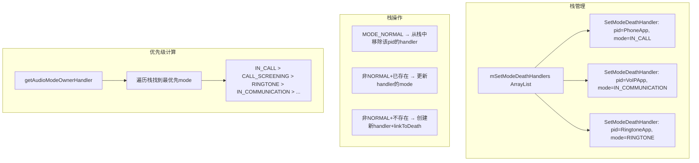

**`SetModeDeathHandler`** 是每个设置Mode的进程的代理对象，包含：
- `IBinder cb`：客户端Binder，用于死亡监听
- `int pid/uid`：进程标识
- `int mode`：当前设置的AudioMode
- `boolean isPrivileged`：是否持有 `MODIFY_PHONE_STATE` 权限
- `boolean playbackActive/recordingActive`：该进程的音频活动状态

**MODE_NORMAL移除机制**：当进程设置 `MODE_NORMAL` 时，从栈中移除其 handler 并 `unlinkToDeath`。如果进程意外死亡，`binderDied()` 回调也会自动移除，确保栈不会残留僵尸 handler。

#### 10.3 setMode 完整时序图（L5777-5893）

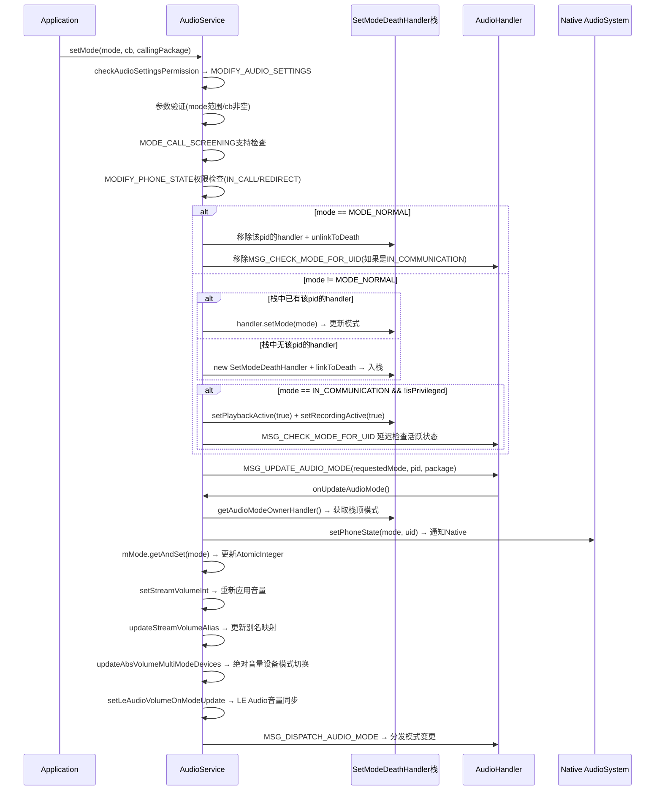

#### 10.4 MODE_IN_COMMUNICATION 活跃检查定时器

VoIP应用设置 `MODE_IN_COMMUNICATION` 后，AudioService 启动一个周期性检查（`MSG_CHECK_MODE_FOR_UID`，间隔 `CHECK_MODE_FOR_UID_PERIOD_MS`），验证该进程确实在进行音频播放/录制：

- **初始状态**：设置模式时强制标记 `playbackActive=true, recordingActive=true`，避免刚设置模式就开始播放的音频被截断
- **定时检查**：`AudioHandler.onCheckModeForUid()` 检查 `PlaybackActivityMonitor` 和 `RecordingActivityMonitor` 中该 uid 是否有活跃的音频流
- **超时退出**：如果连续无活跃音频，发送 `setMode(MODE_NORMAL)` 自动清理，防止进程"忘记"退出通信模式

---

### 十一、设备连接管理与委托模式

AudioService 将设备管理的具体操作**委托给 `AudioDeviceBroker`**，自身仅作为API入口和策略协调者。这种设计将设备状态管理、消息队列处理、蓝牙/有线设备管理隔离到独立模块。

#### 11.1 设备管理委托架构

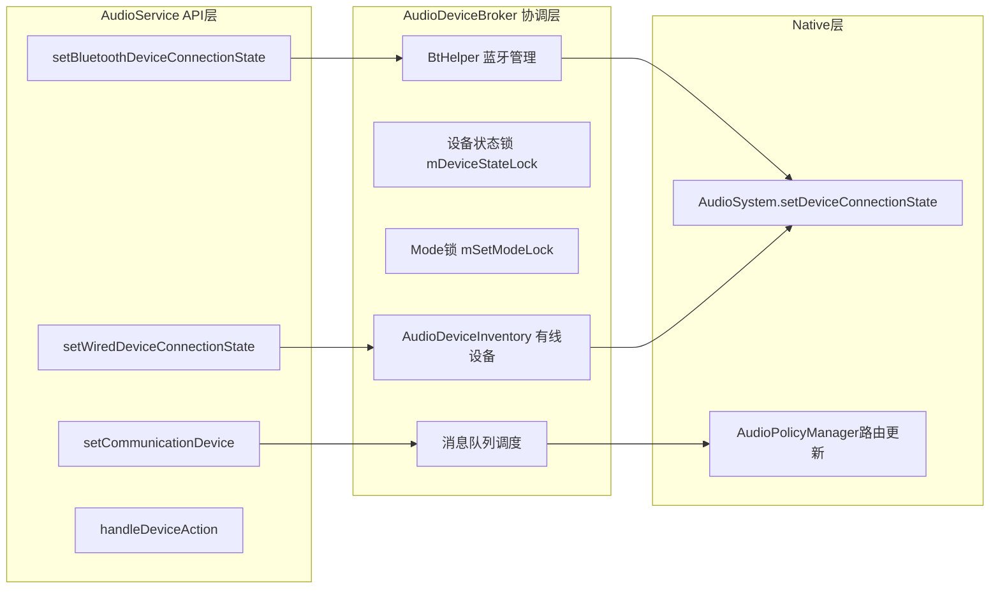

**三级委托链**：
1. **AudioService** → `mDeviceBroker.setWiredDeviceConnectionState()` / `mDeviceBroker.setCommunicationDevice()`
2. **AudioDeviceBroker** → `mDeviceInventory.setWiredDeviceConnectionState()` / `mBtHelper.handleBtDeviceAction()`
3. **AudioDeviceInventory** → `AudioSystem.setDeviceConnectionState()` 通知Native

#### 11.2 setCommunicationDevice 委托模式（L6254-6305）

```java
// L6254-6305
public boolean setCommunicationDevice(IBinder cb, int portId) {
    // 1. 权限检查
    // 2. portId验证 + 从AudioSystem获取AudioDeviceInfo
    // 3. isValidCommunicationDevice检查
    // 4. 委托到AudioDeviceBroker
    return mDeviceBroker.setCommunicationDevice(cb, pid, device, eventSource);
}
```

`AudioDeviceBroker.setCommunicationDevice()`（L312）处理通信设备（如蓝牙SCO、USB headset）的切换逻辑：
- 维护当前通信设备引用（`mCurrentCommunicationDevice`）
- 通过 `AudioSystem.setCommunicationDevice()` 切换Native路由
- 触发音量重算（新设备可能有不同的音量行为）

#### 11.3 setWiredDeviceConnectionState（L7474-7491）

```java
// L7474-7491
public void setWiredDeviceConnectionState(AudioDeviceAttributes attributes, int state, String caller) {
    super.setWiredDeviceConnectionState_enforcePermission();  // 权限检查
    // MediaMetrics记录
    mDeviceBroker.setWiredDeviceConnectionState(attributes, state, caller);  // 委托
}
```

`AudioDeviceInventory.setWiredDeviceConnectionState()`（L1502）执行：
- 验证设备类型是否属于有线设备集
- 调用 `AudioSystem.setDeviceConnectionState(deviceType, state, address)` 更新Native设备列表
- 触发 `postObserveDevicesForAllStreams()` → 流设备变更 → 音量重算

---

### 十二、AudioHandler 内部类与广播机制

#### 12.1 AudioHandler 消息处理

`AudioHandler` 是 AudioService 的核心消息分发器，继承 `Handler`，运行在独立的 `AudioSystemThread` 上。关键消息处理方法：

| MSG常量 | 处理方法 | 核心操作 |
|---------|----------|----------|
| `MSG_SET_DEVICE_VOLUME` | `onSetDeviceVolume()` | 调用VSS.setDeviceVolume → applyDeviceVolume_syncVSS |
| `MSG_SET_ALL_VOLUMES` | `onSetAllVolumes()` | 调用VSS.applyAllVolumes |
| `MSG_PERSIST_VOLUME` | `onPersistVolume()` | VSS.writeSettings → 持久化到Settings.System |
| `MSG_SET_FORCE_USE` | `onSetForceUse()` | AudioSystem.setForceUse → 路由策略强制 |
| `MSG_UPDATE_AUDIO_MODE` | `onUpdateAudioMode()` | setPhoneState → 模式切换+音量重算 |
| `MSG_PLAY_SOUND_EFFECT` | `onPlaySoundEffect()` | SoundPool播放系统音效 |
| `MSG_LOAD_SOUND_EFFECTS` | `onLoadSoundEffects()` | 预加载音效到SoundPool |
| `MSG_CHECK_MUSIC_ACTIVE` | `onCheckMusicActive()` | 安全音量警告检查 |
| `MSG_BROADCAST_AUDIO_BEHAVIOR` | `onBroadcastAudioBehavior()` | 音频行为通知广播 |
| `MSG_OBSERVE_DEVICES_FOR_ALL_STREAMS` | `onObserveDevicesForAllStreams()` | 所有流设备路由更新 |

#### 12.2 AudioServiceBroadcastReceiver

注册在 `initExternalEventReceivers()` 中，监听以下系统广播：

| Action | 来源 | AudioService响应 |
|--------|------|-----------------|
| `ACTION_SCREEN_ON/OFF` | DisplayManager | 安全音量检查/音效预加载 |
| `ACTION_USER_SWITCHED` | UserManager | 音量恢复/铃声模式切换 |
| `ACTION_CONFIGURATION_CHANGED` | System | 语言/SIM卡变化 → 音量别名重算 |
| `ACTION_PACKAGE_REMOVED` | PackageManager | 清理死亡进程的AudioMode/focus |
| `ACTION_MEDIA_BUTTON` | MediaSession | 音频键事件分发 |

#### 12.3 SettingsObserver

监听 `Settings.System/Global` 中与音频相关的设置变化：

| Settings键 | 观察类 | 变更响应 |
|------------|--------|----------|
| `MODE_RINGER` | SettingsObserver | `setRingerModeInt()` → 铃声模式更新 |
| `MODE_RINGER_EXTERNAL` | SettingsObserver | `setRingerModeExt()` → 外部模式同步 |
| `VOLUME_MUSIC/volume_stream_*` | SettingsObserver | `readSettings()` → 音量恢复 |
| `SAFE_MEDIA_VOLUME_ENABLED` | SettingsObserver | `configureSafeMedia()` → 安全音量开关 |
| `HDMI_SYSTEM_AUDIO_ENABLED` | SettingsObserver | HDMI CEC音量控制开关 |

---

### 十三、辅助类与接口

#### 13.1 VolumeController（音量UI控制）

`VolumeController` 管理 Android 系统音量面板的显示和交互：

- **绑定/解绑**：`setVolumeController()` — 系统UI进程注册回调接口
- **显示面板**：`displayVolumeChanged()` — 音量键事件触发，携带streamType/style/方向等参数
- **安全音量警告**：`displaySafeVolumeWarning()` — CSD（Continuous Sound Dose）超限时显示
- **通知更新**：`volumeSliderHapticGenerator()` — 触觉反馈生成器

#### 13.2 AudioServiceInternal

`AudioServiceInternal` 是 AudioService 提供给其他系统服务（如Telephony、NotificationManager）的**内部API接口**，不需要通过Binder：

| 方法 | 调用者 | 作用 |
|------|--------|------|
| `setRingerMode()` | NotificationManagerService | DND策略控制铃声模式 |
| `setMode()` | Telephony | 通话状态切换AudioMode |
| `forceRemoteSubmixStream()` | System | 远端混流强制音量 |
| `setSystemAudioState()` | HDMI CEC | HDMI系统音频状态 |

#### 13.3 AudioPolicyProxy

`AudioPolicyProxy` 代理与 `AudioPolicyService` 的交互，封装策略相关操作：

- 音量范围查询（`getMaxVolumeIndexForAttributes`）
- 音量组管理（`getVolumeGroups`）
- 产品策略映射（`AudioProductStrategy → AudioAttributes`）
- 动态策略注册/注销

---

### 十四、dump 方法与调试指南

#### 14.1 AudioService.dump 输出结构

通过 `adb shell dumpsys audio` 获取AudioService完整状态：

```
AudioService dump输出结构：
  1. 全局状态：mMode/mRingerMode/mRingerModeExternal/mMusicActiveMs等
  2. 各VolumeStreamState详情：
     - Muted/MutedInternally状态
     - Min/Max索引
     - mIndexMap所有设备音量值
  3. 各VolumeGroupState详情
  4. AudioMode栈：所有SetModeDeathHandler及其pid/mode
  5. sRingerAndZenModeMutedStreams位掩码
  6. 音量行为配置：mFixedVolumeDevices/mFullVolumeDevices等
  7. AudioDeviceBroker状态
  8. SoundDoseHelper安全音量状态
  9. MediaFocusControl焦点状态
```

#### 14.2 关键调试命令

| 命令 | 用途 |
|------|------|
| `adb shell dumpsys audio` | AudioService完整状态dump |
| `adb shell dumpsys audio | grep -i "stream"` | 查看流音量状态 |
| `adb shell dumpsys audio | grep -i "mode"` | 查看AudioMode栈 |
| `adb shell dumpsys audio | grep -i "mute"` | 查看静音状态 |
| `adb shell settings get global mode_ringer` | 读取铃声模式 |
| `adb shell settings get system volume_stream_music` | 读取媒体音量 |
| `adb shell media volume --stream --set --adj` | 音量调节测试 |
| `adb logcat -s AudioService AS.AudioDeviceBroker` | AudioService日志过滤 |
| `adb logcat -s AudioPolicy AudioFlinger` | Native层日志 |
| `adb shell dumpsys media.audio_policy` | AudioPolicyService状态 |

#### 14.3 常见调试场景

**场景1：音量键无响应**：
- 检查 `mUseFixedVolume` / `mIsSingleVolume` 是否阻止了音量调节
- 检查DND策略是否 `volumeAdjustmentAllowedByDnd()` 返回false
- 检查绝对音量设备是否将控制委托到远端（`dispatchAbsoluteVolumeAdjusted`）

**场景2：铃声模式不生效**：
- 检查 `mRingerMode` vs `mRingerModeExternal` 差异 → RingerModeDelegate过滤
- 检查 `sRingerAndZenModeMutedStreams` 位掩码 → 确认流是否被标记静音
- 检查 `shouldZenMuteStream()` → DND zen规则是否覆盖铃声模式

**场景3：通话音频路由异常**：
- 检查 `mMode` 值 → 确认是否为 `MODE_IN_CALL`
- 检查 `SetModeDeathHandler` 栈 → 是否有多个进程竞争模式
- 检查 `mDeviceBroker.setCommunicationDevice` → 通信设备是否正确切换

---

> [← 上一篇](../02_Application_Layer/README.md) | [返回目录](README.md) | [下一个 →](03_3.2_MediaFocusControl-焦点仲裁器.md)