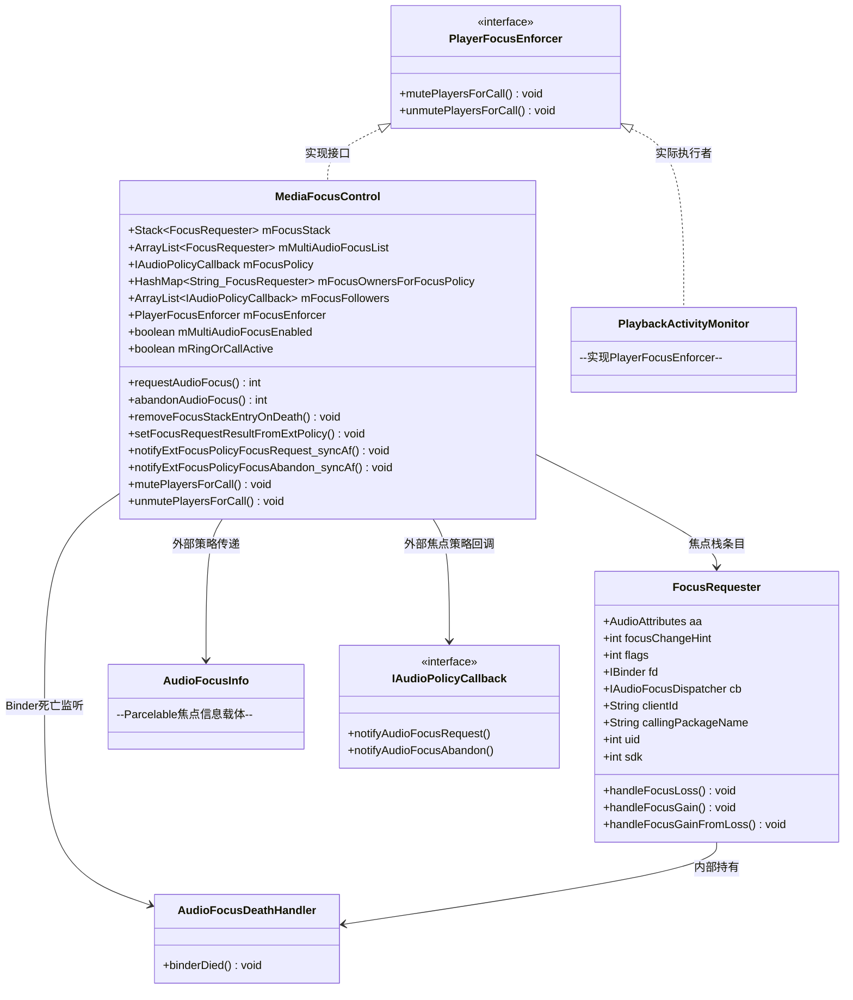
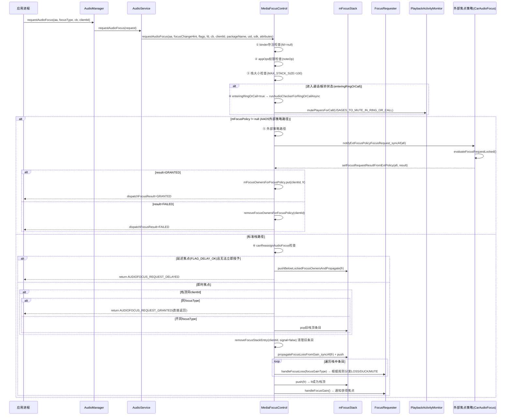
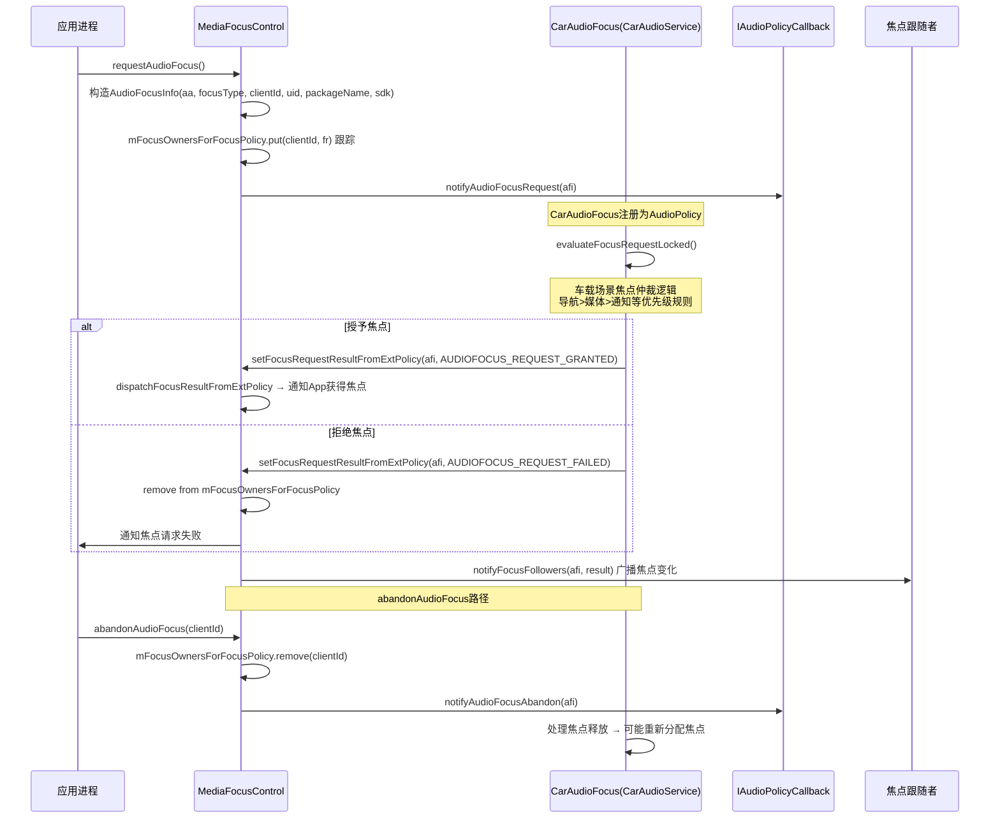
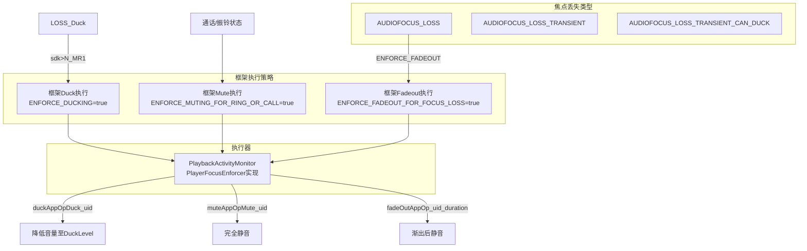

## 3.2 MediaFocusControl — 焦点仲裁器

> [← 上一个](03_3.1_AudioService-音频系统服务中枢.md) | [返回目录](README.md) | [下一个 →](03_3.3_AudioAttributes-音频属性模型.md)

---

## 模块职责与源码位置

**MediaFocusControl** 是Android音频焦点仲裁的核心实现类，负责：

1. **焦点请求仲裁** — 接收所有App的焦点请求，根据焦点类型与优先级决定授予或拒绝
2. **焦点栈维护** — 以LIFO栈结构管理焦点持有者，栈顶为当前焦点拥有者
3. **焦点丢失传播** — 向被抢占者分发`AUDIOFOCUS_LOSS`、`AUDIOFOCUS_LOSS_TRANSIENT`、`AUDIOFOCUS_LOSS_TRANSIENT_CAN_DUCK`等事件
4. **框架级焦点执行** — 对Ducking、Muting、Fadeout三种焦点响应执行框架级强制控制
5. **外部焦点策略转发** — AAOS场景下，将焦点请求转发给CarAudioFocus进行车载仲裁
6. **多焦点模式** — AAOS多音频焦点场景，允许多个GAIN请求者共存

**源码位置**：
- [`MediaFocusControl.java`](frameworks/base/services/core/java/com/android/server/audio/MediaFocusControl.java) — 1360行，核心实现
- 类声明：`public class MediaFocusControl implements PlayerFocusEnforcer`

---

## 核心类关系架构图



---

## 核心常量与字段详解

### 框架执行策略常量

| 常量名 | 值 | 含义 |
|--------|-----|------|
| `ENFORCE_DUCKING` | `true` | 框架自行执行Ducking，而非依赖App回调响应 |
| `ENFORCE_DUCKING_FOR_NEW` | `true` | 仅对SDK > N_MR1的App执行框架级Duck |
| `ENFORCE_MUTING_FOR_RING_OR_CALL` | `true` | 来电/通话期间框架自动mute媒体播放 |
| `ENFORCE_FADEOUT_FOR_FOCUS_LOSS` | `true` | 框架执行fadeout而非直接发LOSS |
| `MAX_STACK_SIZE` | `100` | 焦点栈最大容量，防止恶意App耗尽 |

### 核心字段详解

| 字段名 | 类型 | 含义 | 用途 |
|--------|------|------|------|
| `mFocusStack` | `Stack<FocusRequester>` | 焦点栈(LIFO) | 栈顶=当前焦点持有者，管理所有焦点请求者 |
| `mMultiAudioFocusList` | `ArrayList<FocusRequester>` | 多焦点列表 | AAOS多焦点模式，GAIN请求者共存不互抢 |
| `mFocusPolicy` | `IAudioPolicyCallback` | 外部焦点策略回调 | AAOS场景CarAudioFocus注册后，所有焦点转交其仲裁 |
| `mFocusOwnersForFocusPolicy` | `HashMap<String, FocusRequester>` | 外部策略焦点持有者映射 | clientId→FocusRequester，跟踪外部策略下的焦点持有者 |
| `mFocusFollowers` | `ArrayList<IAudioPolicyCallback>` | 焦点跟随者列表 | 注册焦点变化通知的AudioPolicy回调 |
| `mNotifyFocusOwnerOnDuck` | `boolean` | 默认`true` | 是否在框架执行Duck时通知焦点持有者 |
| `mRingOrCallActive` | `boolean` | 默认`false` | 是否在通话/振铃状态中 |
| `mMultiAudioFocusEnabled` | `boolean` | 多焦点模式开关 | AAOS场景允许多焦点共存 |
| `mFocusEnforcer` | `PlayerFocusEnforcer` | 焦点执行器 | 实际为PlaybackActivityMonitor，执行duck/mute/fadeout |

---

## 焦点栈数据结构深度解析

### 栈模型

焦点栈采用**LIFO(后进先出)**结构，栈顶元素是当前焦点持有者：

```
mFocusStack (Stack<FocusRequester>)
┌──────────────────────────────────────────┐
│  栈顶: FocusRequester(USAGE_MUSIC, GAIN) │ ← 当前焦点持有者
│  ─────────────────────────────────────── │
│  中层: FocusRequester(USAGE_ASSISTANCE,  │ ← 被GAIN_TRANSIENT抢占
│         GAIN_TRANSIENT_MAY_DUCK)         │    收到LOSS_TRANSIENT_CAN_DUCK
│  ─────────────────────────────────────── │
│  底层: FocusRequester(USAGE_NOTIFICATION │ ← 最早请求者
│         , GAIN_TRANSIENT)               │    收到LOSS_TRANSIENT
└──────────────────────────────────────────┘
```

### 焦点优先级规则

Android焦点类型优先级从高到低：

| 焦点类型 | 常量值 | 优先级 | 对被抢占者的影响 |
|----------|--------|--------|-----------------|
| `AUDIOFOCUS_GAIN` | 1 | 最高 | 永久抢占，被抢占者收到`LOSS` |
| `AUDIOFOCUS_GAIN_TRANSIENT` | 2 | 高 | 临时抢占，被抢占者收到`LOSS_TRANSIENT` |
| `AUDIOFOCUS_GAIN_TRANSIENT_MAY_DUCK` | 3 | 中 | 临时可Duck，被抢占者收到`LOSS_TRANSIENT_CAN_DUCK` |
| `AUDIOFOCUS_GAIN_TRANSIENT_EXCLUSIVE` | 4 | 最高(独占) | 系统级独占，被抢占者收到`LOSS_TRANSIENT` |

### locked焦点持有者

当焦点请求携带`FLAG_LOCK`标记时，该请求者成为"locked"焦点持有者。locked持有者在栈中的位置不会被新请求直接覆盖，新请求只能插入到locked持有者之下。

关键判断逻辑：
```java
// 判断栈中某条目是否为locked焦点持有者
private boolean isLockedFocusOwner(FocusRequester fr) {
    return (fr.getFlags() & AudioManager.AUDIOFOCUS_FLAG_LOCK) != 0;
}
```

---

## requestAudioFocus 完整流程

### 时序图



### requestAudioFocus 方法逐段解析

#### 第1段：前置检查(L952-982)

```java
public int requestAudioFocus(...) {
    // ① Binder存活检查：fd(IBinder)不为null且isBinderAlive()
    //   如果Binder已死亡，拒绝请求
    // ② AppOps权限检查：noteOp(OP_AUDIO_FOCUS, uid, packageName)
    //   检查App是否有音频焦点操作权限
    // ③ 栈大小检查：mFocusStack.size() >= MAX_STACK_SIZE(100)
    //   防止恶意App通过不断请求焦点耗尽栈空间
}
```

#### 第2段：通话/振铃状态判断(L983-995)

当请求焦点时检测到进入通话/振铃状态(`enteringRingOrCall`)：
- 设置`mRingOrCallActive = true`
- 异步执行`runAudioCheckerForRingOrCallAsync`(延迟100ms)
- 对`USAGES_TO_MUTE_IN_RING_OR_CALL`(USAGE_MEDIA, USAGE_GAME)的播放者执行mute

#### 第3段：外部焦点策略分支(L996-1040)

当`mFocusPolicy != null`(AAOS注册了CarAudioFocus)时：
- 构造`AudioFocusInfo`对象封装请求信息
- 调用`notifyExtFocusPolicyFocusRequest_syncAf`转发给外部策略
- 外部策略异步返回结果(GRANTED/FAILED)
- GRANTED: 存入`mFocusOwnersForFocusPolicy`映射
- FAILED: 从映射中移除

#### 第4段：延迟焦点处理(L1041-1060)

当请求携带`AUDIOFOCUS_FLAG_DELAY_OK`标记且当前无法立即授予焦点时：
- 调用`pushBelowLockedFocusOwnersAndPropagate`将请求插入到locked持有者之后
- 返回`AUDIOFOCUS_REQUEST_DELAYED`
- 当locked持有者释放焦点后，延迟请求自动晋升为栈顶

#### 第5段：栈顶同client处理(L1061-1085)

如果栈顶条目的clientId与当前请求相同：
- 相同focusType → 直接返回`AUDIOFOCUS_REQUEST_GRANTED`
- 不同focusType → pop旧栈顶，重新处理

#### 第6段：清理旧条目+焦点授予(L1086-1131)

- `removeFocusStackEntry(clientId, signal=false)` — 清理同clientId的旧栈条目(不通知)
- `propagateFocusLossFromGain_syncAf` — 遍历栈传播焦点丢失
- `push(fr)` — 将新请求推入栈顶
- 通知新焦点持有者`handleFocusGain`

---

## 外部焦点策略(AAOS)路径深度解析

### AAOS外部策略时序图



### 外部策略注册机制

CarAudioService在系统启动时通过以下方式注册外部焦点策略：

1. `CarAudioService.setAudioFocusPolicy()` → 向AudioService注册`IAudioPolicyCallback`
2. AudioService → `MediaFocusControl.setFocusPolicy(policy)`
3. `mFocusPolicy = policy` —此后所有焦点请求走外部策略路径

### 外部策略焦点跟踪

`mFocusOwnersForFocusPolicy`(HashMap<String, FocusRequester>)用于跟踪外部策略下的焦点持有者：

- **请求时**：`put(clientId, fr)` — 记录焦点持有者
- **结果返回时**：GRANTED保持映射，FAILED移除映射
- **释放时**：`remove(clientId)` — 从映射中移除

### 焦点跟随者(Focus Followers)

`mFocusFollowers`(ArrayList<IAudioPolicyCallback>)是注册接收焦点变化通知的AudioPolicy列表：

- 每次焦点变化都通过`notifyFocusFollowers`广播给所有跟随者
- 用于AAOS中其他音频策略模块感知焦点变化

---

## abandonAudioFocus 流程深度解析

### 方法签名与逻辑(L1136-1183)

```java
public int abandonAudioFocusFocusRequester(IAudioFocusDispatcher fl, String clientId,
    AudioAttributes aa, String callingPackageName, int uid) {
```

### 流程步骤

```
① 检查mFocusPolicy != null (外部策略路径)
   → notifyExtFocusPolicyFocusAbandon_syncAf(clientId)
   → 从mFocusOwnersForFocusPolicy移除
   → 通知外部策略焦点释放

② 标准栈路径:
   → removeFocusStackEntry(clientId, signal=true, notifyFocusFollowers=true)
   → 如果clientId在栈顶: pop + notifyTopOfAudioFocusStack (通知新栈顶获得焦点)
   → 如果clientId不在栈顶: 从栈中移除该条目

③ 退出通话/振铃状态判断(exitingRingOrCall):
   → exitingRingOrCall=true → unmutePlayersForCall
   → 恢复被mute的媒体播放
```

### 关键区别：signal参数

- `signal=true`(abandon时) — 通知栈顶和其他受影响条目
- `signal=false`(request时同clientId清理) — 不通知，静默移除旧条目

---

## 焦点栈管理方法深度解析

### removeFocusStackEntry

**功能**：从焦点栈中移除指定clientId的条目

```java
private void removeFocusStackEntry(String clientId, boolean signal,
    boolean notifyFocusFollowers)
```

**参数含义**：
| 参数 | 类型 | 含义 |
|------|------|------|
| `clientId` | String | 要移除的焦点请求者ID |
| `signal` | boolean | 是否通知新栈顶获得焦点 |
| `notifyFocusFollowers` | boolean | 是否通知焦点跟随者 |

**内部逻辑**：
1. 遍历栈查找clientId对应条目
2. 如果条目在栈顶：pop移除 + 如果signal=true则`notifyTopOfAudioFocusStack`
3. 如果条目不在栈顶：直接从栈中移除(不影响当前焦点分配)
4. 如果notifyFocusFollowers=true：广播焦点变化

### removeFocusStackEntryOnDeath

**功能**：Binder死亡时清理焦点条目

```java
private void removeFocusStackEntryOnDeath(String clientId)
```

**触发条件**：App进程死亡，AudioFocusDeathHandler.binderDied()回调

**关键行为**：
- 即使持有locked焦点的App死亡，也会强制移除其栈条目
- 通知新栈顶获得焦点(`notifyTopOfAudioFocusStack`)
- 外部策略路径：从`mFocusOwnersForFocusPolicy`移除 + 通知外部策略

### notifyTopOfAudioFocusStack

**功能**：通知栈顶焦点持有者获得焦点

```java
private void notifyTopOfAudioFocusStack()
```

**逻辑**：
1. 检查栈是否为空
2. 获取栈顶FocusRequester
3. 调用栈顶`handleFocusGain(AUDIOFOCUS_GAIN)`
4. 如果多焦点模式启用：遍历`mMultiAudioFocusList`通知所有GAIN持有者

### propagateFocusLossFromGain_syncAf

**功能**：新焦点请求获得焦点时，向栈中现有条目传播焦点丢失

```java
private void propagateFocusLossFromGain_syncAf(int focusGain, FocusRequester fr)
```

**核心逻辑**：
- 遍历栈中所有条目(从栈顶开始)
- 对每个条目根据focusGain类型判断其应接收的焦点丢失类型：
  - `GAIN` → 所有被覆盖条目收到`LOSS`
  - `GAIN_TRANSIENT` → 被覆盖条目收到`LOSS_TRANSIENT`
  - `GAIN_TRANSIENT_MAY_DUCK` → 被覆盖条目收到`LOSS_TRANSIENT_CAN_DUCK`(或框架执行Duck)
- 清理`isDefinitiveLoss`(永久丢失)的条目：从栈中移除收到`LOSS`的条目

**焦点丢失类型映射表**：

| 新请求焦点类型 | 被覆盖者收到的丢失类型 | isDefinitiveLoss |
|---------------|----------------------|-----------------|
| `GAIN` | `LOSS` | true → 从栈移除 |
| `GAIN_TRANSIENT` | `LOSS_TRANSIENT` | false → 保留在栈 |
| `GAIN_TRANSIENT_MAY_DUCK` | `LOSS_TRANSIENT_CAN_DUCK` | false → 保留在栈 |

### pushBelowLockedFocusOwnersAndPropagate

**功能**：延迟焦点请求插入到locked持有者之后

```java
private void pushBelowLockedFocusOwnersAndPropagate(FocusRequester fr)
```

**场景**：当焦点请求携带`FLAG_DELAY_OK`且栈中有locked持有者时：
1. 找到最后一个locked持有者的位置
2. 将新请求插入到该locked持有者之后
3. 新请求暂时不获得焦点(返回DELAYED)
4. 当locked持有者释放后，延迟请求自动晋升

---

## FocusRequester 类深度解析

FocusRequester是焦点栈的核心数据单元，封装一个焦点请求的所有信息：

### 字段定义

| 字段 | 类型 | 含义 |
|------|------|------|
| `aa` | AudioAttributes | 音频属性(usage, contentType等) |
| `focusChangeHint` | int | 焦点请求类型(GAIN/GAIN_TRANSIENT等) |
| `flags` | int | 焦点请求标志(FLAG_DELAY_OK, FLAG_LOCK等) |
| `fd` | IBinder | 请求者Binder对象(用于死亡监听) |
| `cb` | IAudioFocusDispatcher | 焦点变化回调接口 |
| `clientId` | String | 请求者唯一标识ID |
| `callingPackageName` | String | 请求者包名 |
| `uid` | int | 请求者UID |
| `sdk` | int | 请求者目标SDK版本 |

### handleFocusLoss — 焦点丢失处理

```java
void handleFocusLoss(int focusLoss, FocusRequester fr, boolean forceDuck)
```

**执行规则矩阵**：

| 条件 | 动作 | 说明 |
|------|------|------|
| `ENFORCE_DUCKING=true` && `focusLoss=LOSS_TRANSIENT_CAN_DUCK` && `sdk>N_MR1` | 框架执行Duck | PlaybackActivityMonitor.muteAppOpDuck(uid) |
| `ENFORCE_MUTING_FOR_RING_OR_CALL=true` && `mRingOrCallActive=true` | 框架执行Mute | PlaybackActivityMonitor.muteAppOpMute(uid) |
| `ENFORCE_FADEOUT_FOR_FOCUS_LOSS=true` && `focusLoss=LOSS` | 框架执行Fadeout | PlaybackActivityMonitor.fadeOutAppOp(uid, duration) |
| 其他 | 通知App回调 | cb.focusChange(focusLoss) |
| `mNotifyFocusOwnerOnDuck=true` && 框架执行了Duck | 同时通知App | cb.focusChange(LOSS_TRANSIENT_CAN_DUCK) |

### handleFocusGain — 焦点获得处理

```java
void handleFocusGain(int focusGain)
```

**逻辑**：
1. 如果框架之前执行了Duck/Mute/Fadeout → 框架恢复(unDuck/unMute/unFadeOut)
2. 通过`IAudioFocusDispatcher.focusChange(focusGain)`通知App

---

## 多焦点模式(AAOS)机制深度解析

### 多焦点模式概述

AAOS车载场景中，多个音频流可能需要同时播放(如导航提示+媒体音乐)。传统焦点栈模型只允许一个GAIN持有者，而多焦点模式允许多个GAIN请求者共存。

### 多焦点数据结构

```java
ArrayList<FocusRequester> mMultiAudioFocusList
```

### 多焦点启用条件

- `mMultiAudioFocusEnabled = true` — 由CarAudioService配置开启
- `mFocusPolicy == null` — 外部策略未注册时使用多焦点列表

### 多焦点请求流程

当请求`AUDIOFOCUS_GAIN`且多焦点模式启用时：

1. 检查请求者是否已在`mMultiAudioFocusList`中
2. 如果已存在且focusType相同 → 直接返回GRANTED
3. 如果已存在但focusType不同 → 更新focusType
4. 如果不存在 → 加入`mMultiAudioFocusList`
5. 通知请求者获得焦点

### 多焦点与通话/振铃的交互

当进入通话/振铃状态(`enteringRingOrCall`)时：

```
① mRingOrCallActive = true
② 遍历mMultiAudioFocusList中所有条目
③ 对每个条目调用handleFocusLossFromGain(AUDIOFOCUS_GAIN_TRANSIENT)
④ 通话/振铃结束后(exitingRingOrCall):
   遍历mMultiAudioFocusList恢复所有条目的焦点
```

### 多焦点与标准栈的共存

多焦点模式中，`GAIN_TRANSIENT`和`GAIN_TRANSIENT_MAY_DUCK`请求仍然走标准栈路径，只有`GAIN`请求进入多焦点列表。

---

## Duck/Fadeout/Mute 执行策略深度解析

### 三种焦点响应执行策略



### Duck执行细节

**条件**：
- `ENFORCE_DUCKING = true`
- 焦点丢失类型 = `LOSS_TRANSIENT_CAN_DUCK`
- 请求者SDK > N_MR1 (`ENFORCE_DUCKING_FOR_NEW = true`)

**执行方式**：`PlaybackActivityMonitor.muteAppOpDuck(uid)` — 将指定uid的播放音量降低到Duck级别

**通知策略**：
- `mNotifyFocusOwnerOnDuck = true`(默认) — 仍通知App收到`LOSS_TRANSIENT_CAN_DUCK`
- App可以选择自行处理Duck(如降低音量)，框架也会执行Duck

### Mute执行细节

**条件**：
- `ENFORCE_MUTING_FOR_RING_OR_CALL = true`
- `mRingOrCallActive = true` (通话/振铃状态)

**被Mute的Usage**：
```java
USAGES_TO_MUTE_IN_RING_OR_CALL = {
    AudioAttributes.USAGE_MEDIA,      // 媒体
    AudioAttributes.USAGE_GAME        // 游戏
}
```

**执行时机**：`runAudioCheckerForRingOrCallAsync` — 延迟`RING_CALL_MUTING_ENFORCEMENT_DELAY_MS=100ms`后执行

**恢复时机**：`exitingRingOrCall` → `unmutePlayersForCall` — 通话/振铃结束后恢复

### Fadeout执行细节

**条件**：
- `ENFORCE_FADEOUT_FOR_FOCUS_LOSS = true`
- 焦点丢失类型 = `LOSS` (永久丢失)

**执行方式**：`PlaybackActivityMonitor.fadeOutAppOp(uid, duration)` — 渐出音量后静音

**Fadeout时长**：由`getFocusRampTimeMs`决定(见焦点爬升时间表)

**异步处理**：Fadeout完成后通过`MSG_L_FOCUS_LOSS_AFTER_FADE`消息分发最终`LOSS`通知并释放焦点条目

---

## 焦点爬升时间表

`getFocusRampTimeMs`根据AudioAttributes的usage返回不同的音量爬升/渐出时间：

| Usage类别 | 爬升时间(ms) | 说明 |
|-----------|-------------|------|
| `USAGE_MEDIA` | 1000 | 媒体播放较长爬升，平滑恢复 |
| `USAGE_GAME` | 1000 | 游戏音效较长爬升 |
| `USAGE_ALARM` | 700 | 闹钟中等爬升，需快速恢复 |
| `USAGE_ASSISTANCE_SONIFICATION` | 700 | 辅助提示音中等爬升 |
| `USAGE_ASSISTANT` | 700 | 语音助手中等爬升 |
| `USAGE_RINGTONE` | 700 | 来电铃声中等爬升 |
| 其他 | 500或0 | 根据具体usage决定 |

**用途**：
- 焦点获得时：音量从0爬升到正常级别的时长
- Fadeout时：音量从正常级别渐出到0的时长

---

## 异步焦点事件处理

### Handler消息定义

MediaFocusControl内部使用Handler处理异步焦点事件：

| 消息常量 | 含义 | 触发场景 |
|----------|------|---------|
| `MSG_L_FOCUS_LOSS_AFTER_FADE` | Fadeout完成后分发LOSS | ENFORCE_FADEOUT执行fadeout后 |
| `MSL_L_FORGET_UID` | 延迟清理uid的fade记忆 | fadeout完成后延迟清理 |

### ForgetFadeUidInfo类

```java
private class ForgetFadeUidInfo {
    int mUid;          // 被fade的uid
    // 支持removeEqualsMessage：精确移除特定uid的FORGET消息
}
```

**用途**：防止同一uid的fade记忆在多次焦点变化中累积，延迟清理确保fade操作完整性。

### Fadeout异步流程

```
① FocusRequester.handleFocusLoss(LOSS) → 判断ENFORCE_FADEOUT=true
② PlaybackActivityMonitor.fadeOutAppOp(uid, duration) → 开始渐出
③ Handler延迟发送MSG_L_FORGET_UID → 清理fade记忆
④ Fadeout完成 → Handler发送MSG_L_FOCUS_LOSS_AFTER_FADE
⑤ 处理MSG_L_FOCUS_LOSS_AFTER_FADE:
   - 分发最终LOSS通知给App
   - 从焦点栈中释放该条目(isDefinitiveLoss=true → remove)
   - notifyTopOfAudioFocusStack通知新栈顶
```

---

## 通话/振铃焦点控制深度解析

### enteringRingOrCall判断

当焦点请求来自通话/振铃相关usage时，进入通话状态：

```java
// 判断是否为通话/振铃相关请求
boolean enteringRingOrCall = (focusGain == AUDIOFOCUS_GAIN_TRANSIENT)
    && (aa.getUsage() == USAGE_VOICE_COMMUNICATION_RINGTONE
        || aa.getUsage() == USAGE_VOICE_COMMUNICATION);
```

### 通话状态下的焦点行为

```
① mRingOrCallActive = true
② 延迟100ms执行runAudioCheckerForRingOrCallAsync:
   - 遍历所有播放者
   - 对USAGE_MEDIA和USAGE_GAME的播放者执行mutePlayersForCall
③ 所有新的GAIN请求在通话状态下被重新评估:
   - 原有GAIN持有者可能被降级为LOSS_TRANSIENT_CAN_DUCK
   - 或直接收到LOSS(取决于新请求的优先级)
```

### exitingRingOrCall判断

当通话/振铃焦点释放时，退出通话状态：

```java
boolean exitingRingOrCall = mRingOrCallActive
    && (aa.getUsage() == USAGE_VOICE_COMMUNICATION_RINGTONE
        || aa.getUsage() == USAGE_VOICE_COMMUNICATION);
```

**退出后行为**：
- `mRingOrCallActive = false`
- `unmutePlayersForCall` — 恢复被mute的媒体/游戏播放
- 重新评估焦点栈：可能触发焦点重新分配

---

## 焦点请求标志(Flags)详解

| Flag常量 | 值 | 含义 | 使用场景 |
|----------|-----|------|---------|
| `AUDIOFOCUS_FLAG_DELAY_OK` | 1<<0 | 允许延迟焦点授予 | 当无法立即获得焦点时，可等待 |
| `AUDIOFOCUS_FLAG_LOCK` | 1<<1 | 锁定焦点 | 通话/导航等关键音频锁定焦点不被抢占 |

**FLAG_DELAY_OK场景**：
- 请求者声明可以等待焦点(如后台音乐App)
- 当栈中有locked持有者时，DELAY_OK请求插入到locked持有者之后
- 返回`AUDIOFOCUS_REQUEST_DELAYED`
- locked持有者释放后，延迟请求自动晋升

**FLAG_LOCK场景**：
- 请求者声明其焦点不可被抢占(如紧急通话)
- locked持有者在栈中的位置不会被新请求覆盖
- 新请求只能插入到locked持有者之下

---

## 调试方法

### dump焦点栈信息

通过`dump`命令查看当前焦点栈状态：

```bash
# 查看AudioService dump信息中的焦点栈
adb shell dumpsys audio

# 输出中包含:
# "Audio Focus Stack entries:"
# 栈顶到栈底的FocusRequester信息(clientId, focusType, usage, uid等)
```

### 焦点请求跟踪

```bash
# 跟踪焦点请求/释放事件
adb logcat -s AudioFocus

# 关键日志标签:
# - "requestAudioFocus(): from client=xxx"
# - "abandonAudioFocus(): from client=xxx"
# - "focusLossEventForOwner: LOSS/LOSS_TRANSIENT/LOSS_TRANSIENT_CAN_DUCK"
# - "notifyExtFocusPolicyFocusRequest: external policy path"
```

### AAOS外部策略调试

```bash
# 查看CarAudioFocus焦点策略
adb shell dumpsys car_audio

# 输出中包含:
# - 当前焦点持有者
# - 焦点优先级规则
# - 多焦点模式状态
```

### 常见调试场景

| 场景 | 检查点 | 命令 |
|------|--------|------|
| 焦点请求被拒绝 | 检查栈大小、AppOps权限、焦点类型优先级 | `dumpsys audio` |
| 焦点未正确释放 | 检查Binder死亡、clientId匹配 | `dumpsys audio` + 进程存活检查 |
| Duck未执行 | 检查ENFORCE_DUCKING、SDK版本、Usage类型 | 日志: `AudioFocus` |
| 通话Mute异常 | 检查mRingOrCallActive、USAGES_TO_MUTE | 日志: `AudioFocus` |
| AAOS焦点仲裁 | 检查mFocusPolicy、CarAudioFocus | `dumpsys car_audio` |

---

## 总结

MediaFocusControl作为音频焦点仲裁的核心实现，通过以下机制保证Android音频系统的有序运行：

1. **焦点栈(LIFO)** — 严格的优先级管理，栈顶为当前焦点持有者
2. **框架级执行** — Duck/Mute/Fadeout三种策略，不依赖App自觉响应
3. **外部策略转发** — AAOS场景下将焦点仲裁转交给CarAudioFocus
4. **多焦点模式** — AAOS场景允许多个GAIN持有者共存
5. **Binder死亡处理** — 自动清理死亡App的焦点条目
6. **延迟焦点机制** — FLAG_DELAY_OK支持焦点等待和自动晋升
7. **locked焦点保护** — FLAG_LOCK保护关键音频不被抢占

这些机制共同构成了Android音频焦点系统的完整仲裁框架，在手机和车载场景中分别通过标准栈路径和外部策略路径实现焦点管理。

---

> [← 上一个](03_3.1_AudioService-音频系统服务中枢.md) | [返回目录](README.md) | [下一个 →](03_3.3_AudioAttributes-音频属性模型.md)