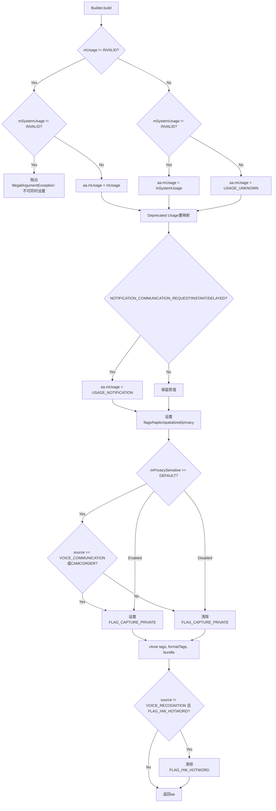
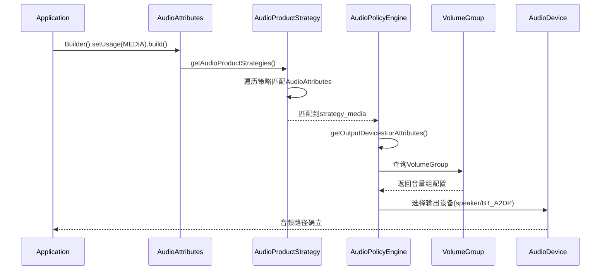
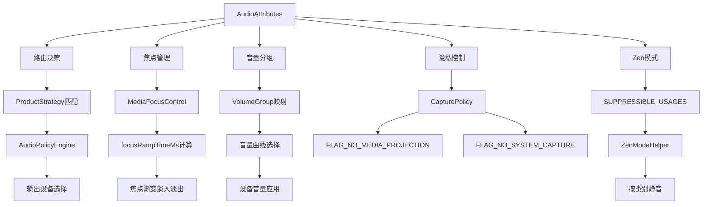
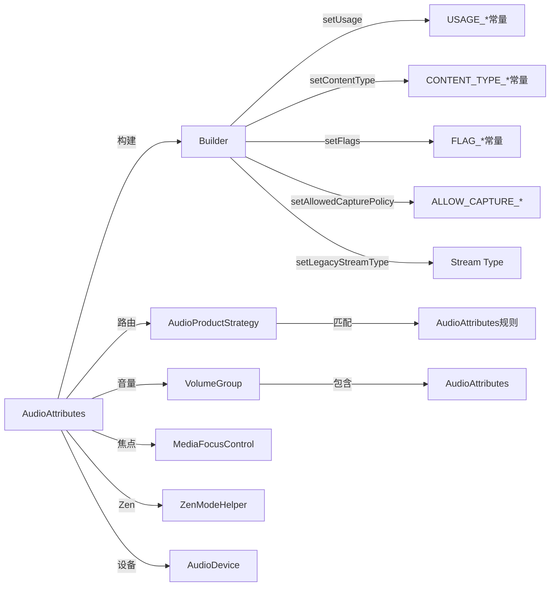

## 3.3 AudioAttributes — 音频属性模型

> [← 上一个](03_3.2_MediaFocusControl-焦点仲裁器.md) | [返回目录](README.md) | [下一个 →](03_3.4_VolumeController-音量控制机制.md)

---

### 模块职责

[`AudioAttributes`](frameworks/base/media/java/android/media/AudioAttributes.java:77) 是Android音频系统的**语义描述核心**，取代传统stream type，为音频流提供多维属性标注。它回答三个核心问题：

| 维度 | 属性 | 核心问题 | 影响域 |
|------|------|----------|--------|
| **Why** | `mUsage` | 为什么播放？使用场景是什么？ | 路由决策、音量分组、焦点策略 |
| **What** | `mContentType` | 播放的是什么内容？ | 信号后处理(DSP配置) |
| **How** | `mFlags` | 播放方式有何特殊要求？ | 输出设备选择、隐私控制、低延迟路径 |

**源码位置**：`frameworks/base/media/java/android/media/AudioAttributes.java`（1875行）

---

### 核心数据结构

```java
// AudioAttributes.java:558-568
private int mUsage = USAGE_UNKNOWN;       // 使用场景（路由决策主键）
private int mContentType = CONTENT_TYPE_UNKNOWN; // 内容类型（DSP处理依据）
private int mSource = AUDIO_SOURCE_INVALID;      // 录音源（仅AudioRecord使用）
private int mFlags = 0x0;                        // 行为标志位掩码
private HashSet<String> mTags;                    // 自定义标签集（OEM扩展）
private String mFormattedTags;                    // 格式化标签串（分号分隔）
private Bundle mBundle;                           // 扩展数据包（懒初始化）
```

#### 字段详解

| 字段 | 类型 | 默认值 | 说明 |
|------|------|--------|------|
| `mUsage` | `int` | `USAGE_UNKNOWN(0)` | 路由决策的核心依据，决定音频走哪条ProductStrategy |
| `mContentType` | `int` | `CONTENT_TYPE_UNKNOWN(0)` | 辅助信息，驱动DSP后处理模块选择（如AEC/NS配置） |
| `mSource` | `int` | `AUDIO_SOURCE_INVALID` | 仅用于录音端(AudioRecord)，标识音频采集源 |
| `mFlags` | `int` | `0x0` | 位掩码，控制播放行为的特殊约束（可读性/低延迟/隐私等） |
| `mTags` | `HashSet<String>` | `null` | OEM自定义路由标签，如`"car_audio"`用于CarAudioContext映射 |
| `mFormattedTags` | `String` | `null` | `mTags`的分号连接字符串，用于Parcel序列化和equals比较 |
| `mBundle` | `Bundle` | `null` | 懒初始化扩展数据，携带额外配置信息 |

---

### ContentType 完整枚举

contentType描述"播放的是什么类型的内容"，影响音频后处理链配置：

| 常量 | 值 | 语义 | 典型场景 | DSP影响 |
|------|-----|------|----------|---------|
| `CONTENT_TYPE_UNKNOWN` | 0 | 未知 | 未指定时的默认值 | 无特殊处理 |
| `CONTENT_TYPE_SPEECH` | 1 | 语音 | 电话、VoIP、语音助手 | 启用AEC/NS，关闭 Bass Boost |
| `CONTENT_TYPE_MUSIC` | 2 | 音乐 | 音乐播放器 | 启用均衡器/Bass Boost |
| `CONTENT_TYPE_MOVIE` | 3 | 影视 | 视频/电影音轨 | 启用环绕声处理 |
| `CONTENT_TYPE_SONIFICATION` | 4 | 提示音 | 按键音、通知音效 | 短音效，轻量处理 |
| `CONTENT_TYPE_ULTRASOUND` | 1997 | 超声波 | @SystemApi，需ACCESS_ULTRASOUND权限 | 近距离感知/手势检测 |

> **注意**：contentType为辅助信息，**不参与路由决策**。路由完全由usage驱动。

---

### Usage 完整枚举

Usage是AudioAttributes中**最核心的字段**，直接决定路由策略、音量分组和焦点行为。

#### SDK Usage（应用可用，16种）

| 常量 | 值 | 语义 | 典型场景 | Stream Type映射 |
|------|-----|------|----------|-----------------|
| `USAGE_UNKNOWN` | 0 | 未知 | 未指定 | STREAM_MUSIC |
| `USAGE_MEDIA` | 1 | 媒体 | 音乐/视频 | STREAM_MUSIC |
| `USAGE_VOICE_COMMUNICATION` | 2 | 语音通信 | 电话/VoIP | STREAM_VOICE_CALL |
| `USAGE_VOICE_COMMUNICATION_SIGNALLING` | 3 | 通信信令 | DTMF/忙音 | STREAM_DTMF |
| `USAGE_ALARM` | 4 | 闹钟 | 闹钟 | STREAM_ALARM |
| `USAGE_NOTIFICATION` | 5 | 通知 | 通用通知 | STREAM_NOTIFICATION |
| `USAGE_NOTIFICATION_RINGTONE` | 6 | 来电铃声 | 电话铃响 | STREAM_RING |
| `USAGE_NOTIFICATION_COMMUNICATION_REQUEST` | 7 | 通信请求 | @Deprecated→映射为USAGE_NOTIFICATION | STREAM_NOTIFICATION |
| `USAGE_NOTIFICATION_COMMUNICATION_INSTANT` | 8 | 即时消息 | @Deprecated→映射为USAGE_NOTIFICATION | STREAM_NOTIFICATION |
| `USAGE_NOTIFICATION_COMMUNICATION_DELAYED` | 9 | 延迟消息 | @Deprecated→映射为USAGE_NOTIFICATION | STREAM_NOTIFICATION |
| `USAGE_NOTIFICATION_EVENT` | 10 | 事件通知 | 低电量/提醒 | STREAM_NOTIFICATION |
| `USAGE_ASSISTANCE_ACCESSIBILITY` | 11 | 辅助功能 | 屏幕阅读器 | STREAM_ACCESSIBILITY |
| `USAGE_ASSISTANCE_NAVIGATION_GUIDANCE` | 12 | 导航 | 导航语音 | STREAM_MUSIC |
| `USAGE_ASSISTANCE_SONIFICATION` | 13 | 界面音效 | 按键/触控音 | STREAM_SYSTEM |
| `USAGE_GAME` | 14 | 游戏 | 游戏音频 | STREAM_MUSIC |
| `USAGE_VIRTUAL_SOURCE` | 15 | 虚拟源 | @hide，平台内部 | - |
| `USAGE_ASSISTANT` | 16 | 语音助手 | 智能助手 | STREAM_MUSIC |

#### System Usage（系统专用，4种，偏移量1000+）

| 常量 | 值 | 语义 | 权限要求 |
|------|-----|------|----------|
| `USAGE_CALL_ASSISTANT` | 17 | 通话助手 | MODIFY_PHONE_STATE + MODIFY_AUDIO_ROUTING |
| `USAGE_EMERGENCY` | 1000 | 紧急报警 | MODIFY_AUDIO_ROUTING |
| `USAGE_SAFETY` | 1001 | 安全提示 | MODIFY_AUDIO_ROUTING |
| `USAGE_VEHICLE_STATUS` | 1002 | 车辆状态 | MODIFY_AUDIO_ROUTING |
| `USAGE_ANNOUNCEMENT` | 1003 | 广播公告 | MODIFY_AUDIO_ROUTING |

> **关键规则**：`setUsage()`和`setSystemUsage()`互斥，同时调用会抛出`IllegalArgumentException`。

---

### Flags 位掩码定义

flags控制播放行为的特殊约束，采用位掩码方式可组合多个标志：

#### 公开Flags（SDK可设置）

| 常量 | 位 | 值 | 语义 | 影响范围 |
|------|-----|-----|------|----------|
| `FLAG_AUDIBILITY_ENFORCED` | 0 | 0x1 | 强制可听 | 仅走内置扬声器/有线耳机，排除无线设备 |
| `FLAG_HW_AV_SYNC` | 4 | 0x10 | 硬件AV同步 | 选择支持HW同步的输出路径 |
| `FLAG_LOW_LATENCY` | 8 | 0x100 | 低延迟 | @Deprecated，使用PERFORMANCE_MODE_LOW_LATENCY替代 |

#### 系统Flags（@SystemApi/@hide）

| 常量 | 位 | 值 | 语义 | 典型场景 |
|------|-----|-----|------|----------|
| `FLAG_SECURE` | 1 | 0x2 | 安全输出 | DRM内容播放 |
| `FLAG_SCO` | 2 | 0x4 | 蓝牙SCO | 语音通话蓝牙链路 |
| `FLAG_BEACON` | 3 | 0x8 | 广播可听 | TTS，最小后处理 |
| `FLAG_HW_HOTWORD` | 5 | 0x20 | 硬件热词 | 低功耗DSP热词检测 |
| `FLAG_BYPASS_INTERRUPTION_POLICY` | 6 | 0x40 | 绕过打断策略 | 紧急声音，忽略DND |
| `FLAG_BYPASS_MUTE` | 7 | 0x80 | 绕过静音 | 强制发声 |
| `FLAG_DEEP_BUFFER` | 9 | 0x200 | 深缓冲 | 省电媒体播放 |
| `FLAG_NO_MEDIA_PROJECTION` | 10 | 0x400 | 禁止MediaProjection捕获 | 隐私保护 |
| `FLAG_MUTE_HAPTIC` | 11 | 0x800 | 静音触觉通道 | 触觉反馈控制 |
| `FLAG_NO_SYSTEM_CAPTURE` | 12 | 0x1000 | 禁止任何捕获（含系统） | 最高隐私等级 |
| `FLAG_CAPTURE_PRIVATE` | 13 | 0x2000 | 私密录音 | 阻止助手捕获 |
| `FLAG_CONTENT_SPATIALIZED` | 14 | 0x4000 | 已空间化 | 避免双重空间化 |
| `FLAG_NEVER_SPATIALIZE` | 15 | 0x8000 | 永不空间化 | 单声道内容保护 |
| `FLAG_CALL_REDIRECTION` | 16 | 0x10000 | 通话重定向 | 通话音频重路由 |

#### Flag掩码常量

```java
FLAG_ALL = FLAG_AUDIBILITY_ENFORCED | FLAG_SECURE | ... | FLAG_CALL_REDIRECTION;  // 所有flags
FLAG_ALL_PUBLIC = FLAG_AUDIBILITY_ENFORCED | FLAG_HW_AV_SYNC | FLAG_LOW_LATENCY;     // 公开flags
FLAG_ALL_API_SET = FLAG_ALL_PUBLIC | FLAG_BYPASS_INTERRUPTION_POLICY | FLAG_BYPASS_MUTE; // API可设置
```

---

### 隐私控制：allowedCapturePolicy

Android 10引入的隐私捕获策略，控制其他应用是否可以录制此音频：

| 常量 | 值 | 语义 | 对应Flags |
|------|-----|------|-----------|
| `ALLOW_CAPTURE_BY_ALL` | 1 | 任何应用可捕获（默认值） | 无FLAG设置 |
| `ALLOW_CAPTURE_BY_SYSTEM` | 2 | 仅系统应用可捕获 | `FLAG_NO_MEDIA_PROJECTION` |
| `ALLOW_CAPTURE_BY_NONE` | 3 | 任何应用均不可捕获 | `FLAG_NO_MEDIA_PROJECTION | FLAG_NO_SYSTEM_CAPTURE` |

#### 策略转换逻辑（[`capturePolicyToFlags()`](frameworks/base/media/java/android/media/AudioAttributes.java:1775)）

```java
// ALLOW_CAPTURE_BY_NONE: 最严格
flags |= FLAG_NO_MEDIA_PROJECTION | FLAG_NO_SYSTEM_CAPTURE;
// ALLOW_CAPTURE_BY_SYSTEM: 中等
flags |= FLAG_NO_MEDIA_PROJECTION;
flags &= ~FLAG_NO_SYSTEM_CAPTURE;
// ALLOW_CAPTURE_BY_ALL: 最宽松
flags &= ~FLAG_NO_SYSTEM_CAPTURE & ~FLAG_NO_MEDIA_PROJECTION;
```

#### 读取策略逻辑（[`getAllowedCapturePolicy()`](frameworks/base/media/java/android/media/AudioAttributes.java:714)）

```java
if ((mFlags & FLAG_NO_SYSTEM_CAPTURE) == FLAG_NO_SYSTEM_CAPTURE) → ALLOW_CAPTURE_BY_NONE
else if ((mFlags & FLAG_NO_MEDIA_PROJECTION) == FLAG_NO_MEDIA_PROJECTION) → ALLOW_CAPTURE_BY_SYSTEM
else → ALLOW_CAPTURE_BY_ALL
```

> **不可捕获的usage**：`VOICE_COMMUNICATION*`、`NOTIFICATION*`、`ASSISTANCE*`、`ASSISTANT`无论策略设置如何均不可被MediaProjection捕获。

---

### Builder模式深度解析

[`Builder`](frameworks/base/media/java/android/media/AudioAttributes.java:752) 采用经典Builder模式，分离构建与表示：

#### Builder内部字段

```java
private int mUsage = USAGE_INVALID;           // 未设置时为INVALID，区别于USAGE_UNKNOWN
private int mSystemUsage = USAGE_INVALID;     // 系统usage，与mUsage互斥
private int mContentType = CONTENT_TYPE_UNKNOWN;
private int mSource = AUDIO_SOURCE_INVALID;   // 录音预设
private int mFlags = 0x0;
private boolean mMuteHapticChannels = true;   // 默认静音触觉
private boolean mIsContentSpatialized = false;
private int mSpatializationBehavior = SPATIALIZATION_BEHAVIOR_AUTO;
private HashSet<String> mTags = new HashSet<>();
private Bundle mBundle;
private int mPrivacySensitive = -1;           // -1=默认, 0=禁用, 1=启用
```

#### [`build()`](frameworks/base/media/java/android/media/AudioAttributes.java:805) 校验与构建逻辑



**关键构建规则**：
1. **Usage互斥**：`mUsage`和`mSystemUsage`不可同时设置，否则抛异常
2. **Deprecated重映射**：`USAGE_NOTIFICATION_COMMUNICATION_*`三种废弃usage在build时统一映射为`USAGE_NOTIFICATION`
3. **Haptic默认静音**：`mMuteHapticChannels`默认为true，自动设置`FLAG_MUTE_HAPTIC`
4. **隐私敏感继承**：VOIP和Camcorder源默认为隐私敏感
5. **HW_HOTWORD守卫**：非VOICE_RECOGNITION源会自动清除该flag

#### Setter方法一览

| 方法 | 访问级 | 参数 | 校验逻辑 |
|------|--------|------|----------|
| `setUsage(int)` | Public | SDK Usage常量 | switch校验，非法值抛异常 |
| `setSystemUsage(int)` | @SystemApi | System Usage常量 | `isSystemUsage()`校验 |
| `setContentType(int)` | Public | CONTENT_TYPE_* | switch校验 |
| `setInternalContentType(int)` | @SystemApi | 含ULTRASOUND | ULTRASOUND走特殊分支 |
| `setFlags(int)` | Public | FLAG_ALL_API_SET | 与FLAG_ALL_API_SET做AND过滤 |
| `replaceFlags(int)` | @hide | FLAG_ALL | 与FLAG_ALL做AND过滤 |
| `setAllowedCapturePolicy(int)` | Public | ALLOW_CAPTURE_* | 调用`capturePolicyToFlags()`转换 |
| `setIsContentSpatialized(boolean)` | Public | boolean | 存储到mIsContentSpatialized |
| `setSpatializationBehavior(int)` | Public | AUTO/NEVER | switch校验 |
| `setHapticChannelsMuted(boolean)` | Public | boolean | 默认true |
| `setLegacyStreamType(int)` | Public | Stream Type | 排除STREAM_ACCESSIBILITY |
| `setInternalLegacyStreamType(int)` | @hide | 含隐藏Stream | 优先查ProductStrategy |
| `setCapturePreset(int)` | @SystemApi | AudioSource | switch校验 |
| `setInternalCapturePreset(int)` | @SystemApi | 含HOTWORD等 | 扩展AudioSource |
| `setPrivacySensitive(boolean)` | @hide | boolean | 控制FLAG_CAPTURE_PRIVATE |
| `setHotwordModeEnabled(boolean)` | @SystemApi | boolean | 控制FLAG_HW_HOTWORD |
| `setForCallRedirection()` | @hide | 无 | 设置FLAG_CALL_REDIRECTION |
| `addTag(String)` | @hide | 标签字符串 | 直接添加到HashSet |
| `addBundle(Bundle)` | @SystemApi | Bundle | 非空校验，合并到mBundle |

---

### Usage → Stream Type 完整映射表

[`toVolumeStreamType()`](frameworks/base/media/java/android/media/AudioAttributes.java:1711) 实现从AudioAttributes到传统stream type的转换，是新旧架构的桥梁：

#### Flags优先映射（最高优先级）

| Flag | getVolumeControlStream | toLegacyStreamType |
|------|----------------------|-------------------|
| `FLAG_AUDIBILITY_ENFORCED` | STREAM_SYSTEM | STREAM_SYSTEM_ENFORCED |
| `FLAG_SCO` | STREAM_VOICE_CALL | STREAM_BLUETOOTH_SCO |
| `FLAG_BEACON` | STREAM_MUSIC | STREAM_TTS |

#### Usage映射（ProductStrategy优先，fallback到硬编码）

| Usage | Stream Type | 备注 |
|-------|-------------|------|
| `USAGE_MEDIA` | STREAM_MUSIC | |
| `USAGE_GAME` | STREAM_MUSIC | |
| `USAGE_ASSISTANCE_NAVIGATION_GUIDANCE` | STREAM_MUSIC | |
| `USAGE_ASSISTANT` | STREAM_MUSIC | |
| `USAGE_ASSISTANCE_SONIFICATION` | STREAM_SYSTEM | |
| `USAGE_VOICE_COMMUNICATION` | STREAM_VOICE_CALL | |
| `USAGE_CALL_ASSISTANT` | STREAM_VOICE_CALL | |
| `USAGE_VOICE_COMMUNICATION_SIGNALLING` | STREAM_VOICE_CALL / STREAM_DTMF | 区分getVolumeControlStream |
| `USAGE_ALARM` | STREAM_ALARM | |
| `USAGE_NOTIFICATION_RINGTONE` | STREAM_RING | |
| `USAGE_NOTIFICATION` | STREAM_NOTIFICATION | |
| `USAGE_NOTIFICATION_*` (deprecated) | STREAM_NOTIFICATION | |
| `USAGE_NOTIFICATION_EVENT` | STREAM_NOTIFICATION | |
| `USAGE_ASSISTANCE_ACCESSIBILITY` | STREAM_ACCESSIBILITY | |
| `USAGE_UNKNOWN` | STREAM_MUSIC | 默认兜底 |
| `USAGE_EMERGENCY/SAFETY/VEHICLE_STATUS/ANNOUNCEMENT` | STREAM_MUSIC | 系统usage |

> **ProductStrategy优先机制**：若`AudioProductStrategy.getAudioProductStrategies().size() > 0`，则优先通过`AudioProductStrategy.getLegacyStreamTypeForStrategyWithAudioAttributes()`查询映射，上述硬编码表仅作为fallback。

#### Stream Type → Usage 反向映射（[`usageForStreamType()`](frameworks/base/media/java/android/media/AudioAttributes.java:1633)）

| Stream Type | Usage |
|-------------|-------|
| STREAM_VOICE_CALL | USAGE_VOICE_COMMUNICATION |
| STREAM_SYSTEM / STREAM_SYSTEM_ENFORCED | USAGE_ASSISTANCE_SONIFICATION |
| STREAM_RING | USAGE_NOTIFICATION_RINGTONE |
| STREAM_MUSIC | USAGE_MEDIA |
| STREAM_ALARM | USAGE_ALARM |
| STREAM_NOTIFICATION | USAGE_NOTIFICATION |
| STREAM_BLUETOOTH_SCO | USAGE_VOICE_COMMUNICATION |
| STREAM_DTMF | USAGE_VOICE_COMMUNICATION_SIGNALLING |
| STREAM_ACCESSIBILITY | USAGE_ASSISTANCE_ACCESSIBILITY |
| STREAM_ASSISTANT | USAGE_ASSISTANT |
| STREAM_TTS | USAGE_UNKNOWN |

---

### AudioAttributes → ProductStrategy → 路由决策链



**核心决策链**：
1. **AudioAttributes** → [`AudioProductStrategy.getAudioProductStrategies()`](frameworks/base/media/java/android/media/audiopolicy/AudioProductStrategy.java) 匹配策略
2. **ProductStrategy** → `EngineBase.getOutputDevicesForAttributes()` 路由选择
3. **VolumeGroup** → 同一VolumeGroup共享音量曲线
4. **AudioDevice** → 最终输出设备

在AAOS中，CarAudioContext进一步扩展了此映射：
```
AudioAttributes(usage=MEDIA) → CarAudioContext(MUSIC) → CarVolumeGroup("media") → Vehicle Zone
```

---

### SUPPRESSIBLE_USAGES：Zen模式抑制表

[`SUPPRESSIBLE_USAGES`](frameworks/base/media/java/android/media/AudioAttributes.java:305) 定义了各usage在勿扰(Zen)模式下的行为：

| 抑制类别 | 值 | 触发条件 | 对应Usage |
|----------|-----|----------|-----------|
| `SUPPRESSIBLE_NOTIFICATION` | 1 | Zen禁止通知时静音 | NOTIFICATION, NOTIFICATION_COMMUNICATION_INSTANT/DELAYED, NOTIFICATION_EVENT |
| `SUPPRESSIBLE_CALL` | 2 | Zen禁止来电时静音 | NOTIFICATION_RINGTONE, NOTIFICATION_COMMUNICATION_REQUEST |
| `SUPPRESSIBLE_NEVER` | 3 | 永不被静音（即使全静音模式） | VOICE_COMMUNICATION, VOICE_COMMUNICATION_SIGNALLING, ASSISTANCE_ACCESSIBILITY, CALL_ASSISTANT |
| `SUPPRESSIBLE_ALARM` | 4 | Zen仅闹钟模式下静音 | USAGE_ALARM |
| `SUPPRESSIBLE_MEDIA` | 5 | Zen禁止媒体时静音 | MEDIA, ASSISTANCE_NAVIGATION_GUIDANCE, GAME, ASSISTANT, UNKNOWN |
| `SUPPRESSIBLE_SYSTEM` | 6 | Zen禁止系统音时静音 | ASSISTANCE_SONIFICATION |

---

### equals / hashCode / toString 实现

#### [`equals()`](frameworks/base/media/java/android/media/AudioAttributes.java:1415)

```java
// 比较mContentType, mFlags, mSource, mUsage, mFormattedTags
// 注意：mBundle不参与equals比较，mTags通过mFormattedTags间接比较
return (mContentType == that.mContentType)
    && (mFlags == that.mFlags)
    && (mSource == that.mSource)
    && (mUsage == that.mUsage)
    && (mFormattedTags.equals(that.mFormattedTags));
```

#### [`hashCode()`](frameworks/base/media/java/android/media/AudioAttributes.java:1430)

```java
// 注意：mBundle参与hashCode但不参与equals，这是一个设计缺陷
// 可能导致：equals相同但hashCode不同（违反hashCode契约）
return Objects.hash(mContentType, mFlags, mSource, mUsage, mFormattedTags, mBundle);
```

#### [`toString()`](frameworks/base/media/java/android/media/AudioAttributes.java:1435)

```java
"AudioAttributes:"
    + " usage=" + usageToString()
    + " content=" + contentTypeToString()
    + (mSource != INVALID ? " source=" + toLogFriendlyAudioSource(mSource) : "")
    + " flags=0x" + Integer.toHexString(mFlags).toUpperCase()
    + " tags=" + mFormattedTags
    + " bundle=" + (mBundle == null ? "null" : mBundle.toString())
```

---

### Parcelable 实现

#### 序列化（[`writeToParcel()`](frameworks/base/media/java/android/media/AudioAttributes.java:1349)）

```
写入顺序：mUsage → mContentType → mSource → mFlags → parcelFlags → tags → bundle
```

- **Tags两种序列化模式**：
  - 默认模式：写入`String[]`数组
  - `FLATTEN_TAGS`模式：写入`mFormattedTags`字符串（用于跨进程到native层）
- **Bundle序列化**：先写入标记（`ATTR_PARCEL_IS_NULL_BUNDLE=-1977` / `ATTR_PARCEL_IS_VALID_BUNDLE=1980`），再写入Bundle内容

#### 反序列化（[`AudioAttributes(Parcel)`](frameworks/base/media/java/android/media/AudioAttributes.java:1370)）

按写入顺序读取，根据Bundle标记判断是否存在mBundle数据。

---

### 空间化行为（Spatialization）

| 常量 | 值 | 语义 |
|------|-----|------|
| `SPATIALIZATION_BEHAVIOR_AUTO` | 0 | 跟随平台默认行为 |
| `SPATIALIZATION_BEHAVIOR_NEVER` | 1 | 永不空间化 |

关联Flags：
- `FLAG_CONTENT_SPATIALIZED`（0x4000）：标记内容已经空间化，避免双重处理
- `FLAG_NEVER_SPATIALIZE`（0x8000）：禁止空间化，保护单声道内容

[`getSpatializationBehavior()`](frameworks/base/media/java/android/media/AudioAttributes.java:703) 从flags中提取：
```java
return ((mFlags & FLAG_NEVER_SPATIALIZE) != 0)
    ? SPATIALIZATION_BEHAVIOR_NEVER : SPATIALIZATION_BEHAVIOR_AUTO;
```

---

### AudioAttributes在音频子系统中的作用



#### 在焦点管理中的作用
- **focusRampTimeMs**：不同usage的焦点丢失/获得渐变时间不同（如USAGE_MEDIA有较长渐变，USAGE_NOTIFICATION几乎瞬时）
- **焦点优先级**：usage影响焦点竞争优先级（VOICE_COMMUNICATION > ALARM > MEDIA > GAME）

#### 在音量分组中的映射
- 每个ProductStrategy关联一个VolumeGroup
- 同一VolumeGroup的usage共享音量曲线和音量级别
- 例：USAGE_MEDIA和USAGE_GAME属于同一VolumeGroup

#### 在AudioDevice路由中的关系
- AudioAttributes通过ProductStrategy映射到输出设备
- FLAG_AUDIBILITY_ENFORCED限制设备选择（排除无线设备）
- FLAG_SCO强制走蓝牙SCO路径
- FLAG_BEACON选择TTS路径

---

### getUsage() vs getSystemUsage()

```java
// getUsage() - 公开API，隐藏系统usage
public int getUsage() {
    if (isSystemUsage(mUsage)) {
        return USAGE_UNKNOWN;  // 系统usage对应用不可见
    }
    return mUsage;
}

// getSystemUsage() - @SystemApi，返回真实usage
public int getSystemUsage() {
    return mUsage;  // 返回完整值，含系统usage
}
```

**设计原因**：系统usage（如EMERGENCY/SAFETY）涉及安全，不应暴露给第三方应用。

---

### 类关系图



---

### 关键方法调用速查

| 方法 | 行号 | 功能 | 返回值 |
|------|------|------|--------|
| `getUsage()` | 585 | 获取usage（隐藏系统值） | int |
| `getSystemUsage()` | 599 | 获取真实usage（含系统值） | int |
| `getContentType()` | 577 | 获取内容类型 | int |
| `getFlags()` | 618 | 获取公开flags | int (FLAG_ALL_PUBLIC过滤) |
| `getAllFlags()` | 630 | 获取所有flags | int (FLAG_ALL过滤) |
| `getAllowedCapturePolicy()` | 714 | 获取捕获策略 | ALLOW_CAPTURE_* |
| `areHapticChannelsMuted()` | 661 | 触觉通道是否静音 | boolean |
| `isContentSpatialized()` | 671 | 内容是否已空间化 | boolean |
| `getSpatializationBehavior()` | 703 | 获取空间化行为 | AUTO/NEVER |
| `getVolumeControlStream()` | 1695 | 获取音量控制stream type | int |
| `toLegacyStreamType()` | 1707 | 转换为legacy stream type | int |
| `isSystemUsage()` | 1673 | 判断是否为系统usage | boolean |
| `capturePolicyToFlags()` | 1775 | 捕获策略转flags | int |
| `usageForStreamType()` | 1633 | stream type反查usage | int |
| `usageToString()` | 1479 | usage转字符串 | String |

---

> [← 上一个](03_3.2_MediaFocusControl-焦点仲裁器.md) | [返回目录](README.md) | [下一个 →](03_3.4_VolumeController-音量控制机制.md)