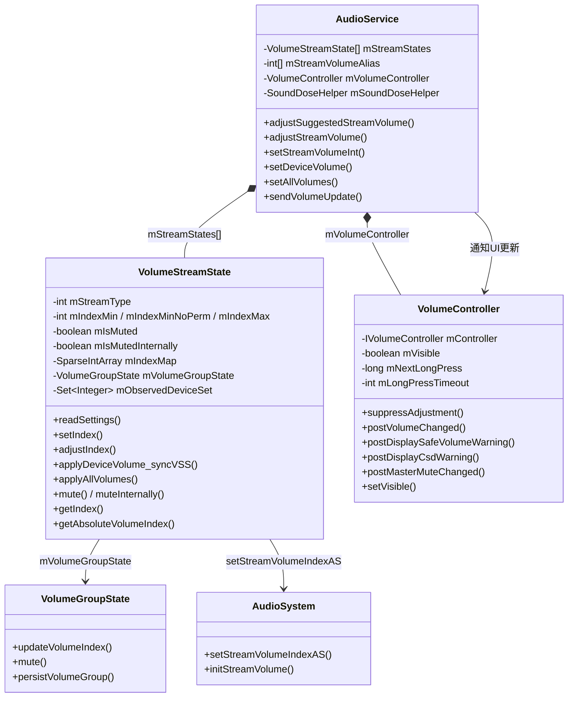
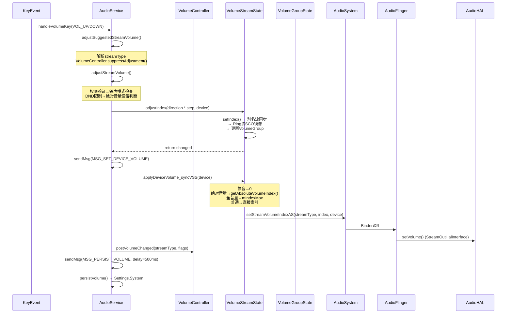
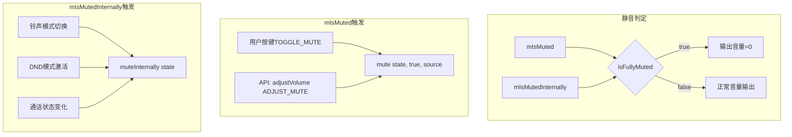
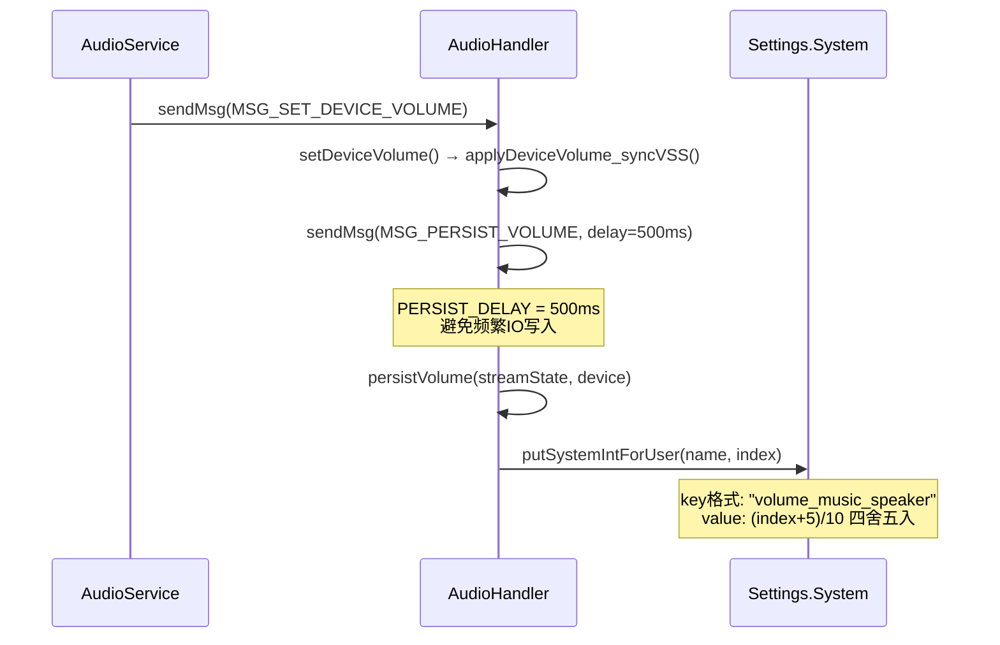
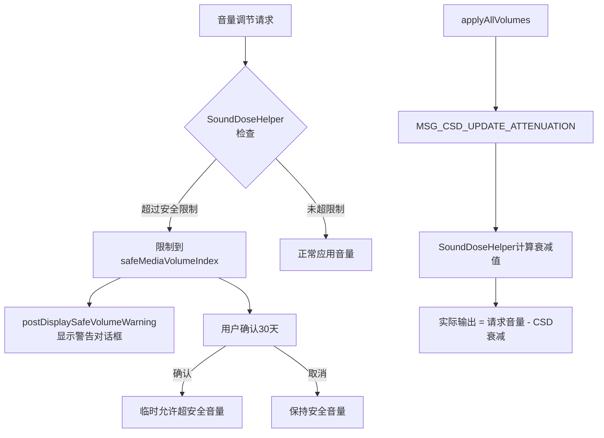

## 3.4 VolumeController — 音量控制机制

> [← 上一个](03_3.3_AudioAttributes-音频属性模型.md) | [返回目录](README.md) | [下一个 →](03_3.5_AudioDeviceBroker-设备热插拔管理.md)

---

### 模块职责

音量控制机制是 Android 音频框架的核心子系统，负责：
- 管理所有音频流的音量索引（per-device 粒度）
- 处理音量键事件到硬件音量应用的完整链路
- 维护音量别名（Stream Alias）与 VolumeGroup 的映射关系
- 实现双层静音（用户静音 / 内部静音）机制
- 支持绝对音量、固定音量、全音量等特殊设备行为
- 安全音量（SoundDose/CSD）保护与持久化

### 源码位置

| 组件 | 路径 |
|------|------|
| AudioService 主逻辑 | `frameworks/base/services/core/java/com/android/server/audio/AudioService.java` |
| VolumeStreamState 内部类 | AudioService.java L8219-8918 |
| VolumeController 内部类 | AudioService.java L11244-11411 |
| 音量别名数组定义 | AudioService.java L485-546 |
| SoundDoseHelper | `frameworks/base/services/core/java/com/android/server/audio/SoundDoseHelper.java` |
| AudioSystem JNI 接口 | `frameworks/base/core/jni/android_media_AudioSystem.cpp` |

---

### 核心类关系图



---

### 音量别名配置体系

Android 定义了 4 套音量别名数组，将 12 种 Stream Type 映射到实际控制音量的主 Stream：

| 别名配置 | 适用场景 | 特点 |
|----------|----------|------|
| `STREAM_VOLUME_ALIAS_VOICE` | 手机(Voice) | RING/SYSTEM/NOTIFICATION/DTMF/SYSTEM_ENFORCED → STREAM_RING |
| `STREAM_VOLUME_ALIAS_TELEVISION` | TV | 几乎所有流 → STREAM_MUSIC |
| `STREAM_VOLUME_ALIAS_DEFAULT` | 平板(Default) | 与VOICE类似但无ENFORCED特殊处理 |
| `STREAM_VOLUME_ALIAS_NONE` | AAOS(Car) | 每个流独立控制，不做别名映射 |

**AAOS 别名映射详情**（[`STREAM_VOLUME_ALIAS_NONE`](frameworks/base/services/core/java/com/android/server/audio/AudioService.java:519)）：
```
STREAM_VOICE_CALL      → STREAM_VOICE_CALL
STREAM_SYSTEM          → STREAM_SYSTEM
STREAM_RING            → STREAM_RING
STREAM_MUSIC           → STREAM_MUSIC
STREAM_ALARM           → STREAM_ALARM
STREAM_NOTIFICATION    → STREAM_NOTIFICATION
STREAM_BLUETOOTH_SCO   → STREAM_BLUETOOTH_SCO
STREAM_SYSTEM_ENFORCED → STREAM_SYSTEM_ENFORCED
STREAM_DTMF            → STREAM_DTMF
STREAM_TTS             → STREAM_TTS
STREAM_ACCESSIBILITY   → STREAM_ACCESSIBILITY
STREAM_ASSISTANT       → STREAM_ASSISTANT
```

别名机制的核心意义：当用户调节 STREAM_NOTIFICATION 音量时，实际修改的是其别名流 STREAM_RING 的 `VolumeStreamState`，保证铃声和通知音量同步变化。AAOS 使用 NONE 配置，意味着车机每个流独立控制，互不影响。

---

### VolumeStreamState 核心数据结构

```java
// AudioService.java L8219-8261
class VolumeStreamState {
    int mStreamType;               // 音频流类型 (0-11)
    int mIndexMin;                 // 最小音量索引(×10), 有MODIFY_AUDIO_SETTINGS权限
    int mIndexMinNoPerm;           // 无权限时的最小音量索引(×10)
    int mIndexMax;                 // 最大音量索引(×10)
    boolean mIsMuted;              // 用户静音标志
    boolean mIsMutedInternally;    // 内部静音标志(铃声模式/DND)
    String mVolumeIndexSettingName;// Settings中持久化的key前缀
    SparseIntArray mIndexMap;      // 设备→音量索引映射表(key:device, value:index×10)
    VolumeGroupState mVolumeGroupState; // 关联的VolumeGroup状态
    Set<Integer> mObservedDeviceSet;    // 当前流关联的输出设备集合
}
```

**关键设计说明**：
- **10倍索引**：内部索引为UI值的10倍（如 UI音量5 → 内部索引50），实现0.1步进精度
- **mIndexMap**：每个设备维护独立音量索引，切换设备时恢复该设备上次的音量
- **双层静音**：`isFullyMuted() = mIsMuted || mIsMutedInternally`，内部静音不影响用户可见的静音状态

---

### 音量调节完整链路



---

### 关键方法深度解析

#### 1. adjustSuggestedStreamVolume()

**源码位置**：[`AudioService.java:3243`](frameworks/base/services/core/java/com/android/server/audio/AudioService.java:3243)

**参数说明**：
| 参数 | 含义 |
|------|------|
| `direction` | 调节方向：ADJUST_RAISE(1)/ADJUST_LOWER(-1)/ADJUST_TOGGLE_MUTE等 |
| `suggestedStreamType` | 建议的流类型，USE_DEFAULT_STREAM_TYPE(-1)表示自动选择 |
| `flags` | 行为标志：FLAG_SHOW_UI/FLAG_PLAY_SOUND/FLAG_FROM_KEY等 |
| `hasModifyAudioSettings` | 调用者是否持有MODIFY_AUDIO_SETTINGS权限 |
| `keyEventMode` | 按键模式：ADJUST_MODE_NORMAL/START/END（影响HDMI CEC行为） |

**核心逻辑**：
1. **外部音量控制器检查**：如果注册了`mExtVolumeController`，直接转发，返回
2. **流类型解析**：
   - 用户指定流 → 直接使用
   - 自动模式 → `getActiveStreamType()`获取当前活跃流
   - 考虑`mVolumeControlStream`（音量面板指定的流）
3. **VolumeController抑制**：[`suppressAdjustment()`](frameworks/base/services/core/java/com/android/server/audio/AudioService.java:11267)判断是否需要首次按键只显示UI而不调音量
4. **转发到** `adjustStreamVolume()`

#### 2. adjustStreamVolume()

**源码位置**：[`AudioService.java:3366`](frameworks/base/services/core/java/com/android/server/audio/AudioService.java:3366)

**完整处理流程**：

```
1. mUseFixedVolume检查 → 固定音量设备直接返回
2. 方向验证 + 流类型验证
3. 静音调节权限检查（VOICE_CALL/BLUETOOTH_SCO需MODIFY_PHONE_STATE）
4. STREAM_ASSISTANT需MODIFY_AUDIO_ROUTING权限
5. 获取别名流 streamTypeAlias = mStreamVolumeAlias[streamType]
6. 计算step:
   - 固定音量设备: step = safeMediaVolumeIndex 或 mIndexMax
   - 普通设备: step = rescaleStep(10, streamType, streamTypeAlias)
7. 铃声模式交互:
   - FLAG_ALLOW_RINGER_MODES → checkForRingerModeChange()
   - DND限制 → volumeAdjustmentAllowedByDnd()
8. 绝对音量设备: dispatchAbsoluteVolumeAdjusted() → 直接返回
9. 音量调节:
   - 静音调节 → muteAliasStreams()
   - 安全音量限制 → raiseVolumeDisplaySafeMediaVolume()
   - 普通调节 → adjustIndex() + MSG_SET_DEVICE_VOLUME
10. 静音解除:
    - ADJUST_RAISE → 立即解除静音
    - ADJUST_LOWER + 单音量设备 → 延迟350ms解除(MSG_UNMUTE_STREAM)
11. 蓝牙同步:
    - A2DP → postSetAvrcpAbsoluteVolumeIndex()
    - LE Audio → postSetLeAudioVolumeIndex()
    - HearingAid → postSetHearingAidVolumeIndex()
12. HDMI CEC音量键:
    - 全音量HDMI设备 → sendVolumeKeyEvent()
13. sendVolumeUpdate() → 通知UI
```

#### 3. VolumeStreamState.setIndex()

**源码位置**：[`AudioService.java:8544`](frameworks/base/services/core/java/com/android/server/audio/AudioService.java:8544)

**核心逻辑**：
1. **索引合法性检查**：`getValidIndex()` 限制在 `[mIndexMin, mIndexMax]` 范围内
2. **别名流同步**：遍历所有streamType，若其别名指向当前流且设备索引不存在或已变化，则递归调用`setIndex()`同步
3. **当前设备特殊处理**：如果修改的设备是当前活跃设备，也同步到该别名流的活跃设备
4. **Ring流SCO镜像**：STREAM_RING的SPEAKER音量变化时，同步到所有SCO设备
5. **VolumeGroup更新**：`updateVolumeGroupIndex()` 同步到关联的VolumeGroupState
6. **广播发送**：当前设备上音量变化时，发送`VOLUME_CHANGED_ACTION`广播

#### 4. setDeviceVolume()

**源码位置**：[`AudioService.java:9016`](frameworks/base/services/core/java/com/android/server/audio/AudioService.java:9016)

```java
void setDeviceVolume(VolumeStreamState streamState, int device) {
    synchronized (VolumeStreamState.class) {
        // 1. SoundDose衰减更新
        sendMsg(..., MSG_CSD_UPDATE_ATTENUATION, ...);
        // 2. 应用当前流的设备音量
        streamState.applyDeviceVolume_syncVSS(device);
        // 3. 别名流同步应用
        for (int streamType = numStreamTypes - 1; streamType >= 0; streamType--) {
            if (mStreamVolumeAlias[streamType] == streamState.mStreamType) {
                // 绝对音量/A2DP/LE Audio设备需同步到别名流的不同设备
                mStreamStates[streamType].applyDeviceVolume_syncVSS(streamDevice);
            }
        }
    }
    // 4. 延迟500ms持久化
    sendMsg(mAudioHandler, MSG_PERSIST_VOLUME, SENDMSG_QUEUE,
            device, 0, streamState, PERSIST_DELAY /*500ms*/);
}
```

#### 5. applyDeviceVolume_syncVSS()

**源码位置**：[`AudioService.java:8479`](frameworks/base/services/core/java/com/android/server/audio/AudioService.java:8479)

**设备类型→音量策略映射**：

| 设备类型 | 音量计算 | 说明 |
|----------|----------|------|
| 普通设备(Speaker/Earpiece) | `(getIndex(device) + 5) / 10` | 四舍五入到整数 |
| 绝对音量设备(A2DP/HearingAid) | `getAbsoluteVolumeIndex()` | 预缩放处理 |
| 全音量设备(FullVolume) | `(mIndexMax + 5) / 10` | 始终最大音量 |
| HearingAid | `(mIndexMax + 5) / 10` | 始终最大音量 |
| 静音状态 | `0` | 完全静音 |

---

### 绝对音量与预缩放机制

蓝牙绝对音量设备（A2DP/LE Audio）使用[`getAbsoluteVolumeIndex()`](frameworks/base/services/core/java/com/android/server/audio/AudioService.java:8446)进行预缩放：

```java
// 预缩放系数 (AudioService.java:873)
float[] mPrescaleAbsoluteVolume = { 0.6f, 0.8f, 0.9f }; // 对应index 1,2,3

private int getAbsoluteVolumeIndex(int index) {
    if (index == 0) return 0;           // 音量0 → 0%增益
    else if (index <= 3)                // 低音量步进1-3 → 预缩放
        return (mIndexMax * mPrescaleAbsoluteVolume[index-1]) / 10;
    else return (mIndexMax + 5) / 10;   // 音量4+ → 全增益
}
```

**设计目的**：部分蓝牙配件在全增益模式下，即使最低音量也过于响亮。预缩放在低音量步进降低输出增益，音量0直接输出0%避免配件无法自身静音的问题。

---

### 双层静音机制



- [`mute()`](frameworks/base/services/core/java/com/android/server/audio/AudioService.java:8752)：用户可见的静音，发送`broadcastMuteSetting()`广播，通过`doMute()`触发`MSG_SET_ALL_VOLUMES`
- [`muteInternally()`](frameworks/base/services/core/java/com/android/server/audio/AudioService.java:8768)：系统内部静音，不通知用户，立即调用`applyAllVolumes()`

---

### VolumeController UI交互控制

[`VolumeController`](frameworks/base/services/core/java/com/android/server/audio/AudioService.java:11244)封装了`IVolumeController`回调接口，是AudioService与SystemUI音量面板的桥梁：

#### suppressAdjustment() — 首次按键抑制

**源码位置**：[`AudioService.java:11267`](frameworks/base/services/core/java/com/android/server/audio/AudioService.java:11267)

**行为逻辑**：
1. 静音操作不抑制
2. 非默认UI流不抑制（只涉及MUSIC流）
3. 媒体正在播放时不抑制 → 直接调节音量
4. 媒体未播放时：
   - **UI不可见** → 抑制调节，仅显示UI，启动长按超时计时器
   - **长按超时内** → 继续抑制
   - **长按超时后** → 停止抑制，正常调节音量

**设计意图**：音量键短按/长按首段仅弹出音量面板（可切换铃声模式），避免误触改变媒体音量；长按超过超时后才真正调节音量。

#### 关键回调方法

| 方法 | 触发时机 | 作用 |
|------|----------|------|
| `postVolumeChanged()` | 音量索引变化 | 通知UI更新音量条 |
| `postDisplaySafeVolumeWarning()` | 超过安全音量 | 显示听力保护警告对话框 |
| `postDisplayCsdWarning()` | CSD告警 | 显示声压剂量警告 |
| `postMasterMuteChanged()` | 主静音变化 | 通知UI静音状态 |
| `setVisible()` | UI显示/隐藏 | 更新mVisible状态 |
| `setA11yMode()` | 无障碍模式 | 通知UI切换无障碍模式 |

---

### 音量持久化机制



**Settings Key命名规则**：
- 默认设备：`volume_{stream_name}` (如 `volume_music`)
- 特定设备：`volume_{stream_name}_{device_name}` (如 `volume_music_speaker`)
- 固定音量设备（`mUseFixedVolume`）和单音量设备（非MUSIC流）不持久化

---

### 安全音量(SoundDose/CSD)机制



安全音量机制通过`SoundDoseHelper`实现：
- `safeMediaVolumeIndex`：按设备定义的安全音量上限
- `raiseVolumeDisplaySafeVolumeWarning()`：调节到安全上限时弹出警告
- CSD (Cummulative Sound Dose)：累积声压剂量监控，长时间高音量自动衰减

---

### 音量曲线映射机制

音量曲线定义在`audio_policy_volumes.xml`中，由AudioPolicyManager加载：

```xml
<volume stream="AUDIO_STREAM_MUSIC" deviceCategory="DEVICE_CATEGORY_HEADSET">
    <point>0,-9000</point>    <!-- 音量0% → -90dB -->
    <point>33,-3600</point>   <!-- 音量33% → -36dB -->
    <point>66,-1600</point>   <!-- 音量66% → -16dB -->
    <point>100,0</point>      <!-- 音量100% → 0dB -->
</volume>
```

**映射流程**：
1. Java层：`VolumeStreamState.getIndex(device)` 获取0-maxRange的整数索引
2. Native层：`AudioPolicyManager::volIndexToDb()` 通过曲线插值将索引转换为dB衰减值
3. AudioFlinger：将dB值转换为浮点增益因子应用到混音轨道

每个 Stream Type × Device Category（HEADSET/SPEAKER/EARPIECE/EARPIECE_SAFE）组合有独立曲线。

---

### Stream Type → VolumeGroup 演进

| 阶段 | 控制粒度 | 说明 |
|------|----------|------|
| Android 8及以前 | Stream Type | 按STREAM_MUSIC/STREAM_RING等独立控制 |
| Android 9+ | VolumeGroup | 按AudioAttributes映射的VolumeGroup控制 |
| Android 14 | VolumeGroup + CSD | 增加累积声压剂量保护 |

**VolumeGroup优势**：
- 同一VolumeGroup内的不同stream共享音量设置
- 如STREAM_RING和STREAM_NOTIFICATION同属一个VolumeGroup，调节一个另一个同步
- 更符合用户认知（"铃声音量"包含铃声+通知）

**VolumeStreamState与VolumeGroupState的关联**：
- `VolumeStreamState.setVolumeGroupState()` 建立双向关联
- `setIndex()` → `updateVolumeGroupIndex()` 同步索引到VolumeGroup
- `mute()` → `updateVolumeGroupIndex(forceMuteState=true)` 同步静音状态

---

### AAOS车机音量控制特点

AAOS使用`STREAM_VOLUME_ALIAS_NONE`配置，带来以下差异：

1. **流独立控制**：每个Stream Type独立管理音量，无别名同步
2. **CarAudioVolumeHandler**：CarAudioService可覆盖默认音量行为
3. **音量组由CarAudioConfiguration定义**：XML配置中自定义VolumeGroup
4. **AudioControl HAL音量**：`IAudioControl.setAudioVolumeGroupVolume()` 由HAL实现音量控制
5. **音量键路由**：通过CarAudioContext和ActiveAudioContext决定调节哪个VolumeGroup

---

### 关键常量与延迟值

| 常量 | 值 | 含义 |
|------|-----|------|
| `PERSIST_DELAY` | 500ms | 音量持久化延迟，避免频繁IO |
| `UNMUTE_STREAM_DELAY` | 350ms | 单音量设备降音量时延迟解除静音 |
| `mPrescaleAbsoluteVolume` | {0.6, 0.8, 0.9} | 蓝牙绝对音量低步进预缩放系数 |
| `MIN_STREAM_VOLUME[]` | 各流最小音量 | 各流定义的最小音量（0或1） |
| `MAX_STREAM_VOLUME[]` | 各流最大音量 | 各流定义的最大音量（通常7或15） |

---

> [← 上一个](03_3.3_AudioAttributes-音频属性模型.md) | [返回目录](README.md) | [下一个 →](03_3.5_AudioDeviceBroker-设备热插拔管理.md)