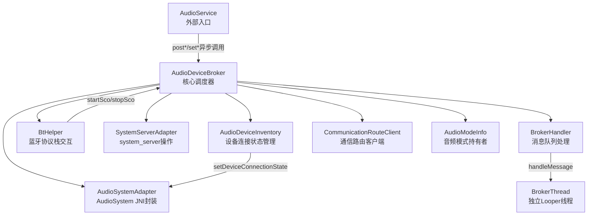
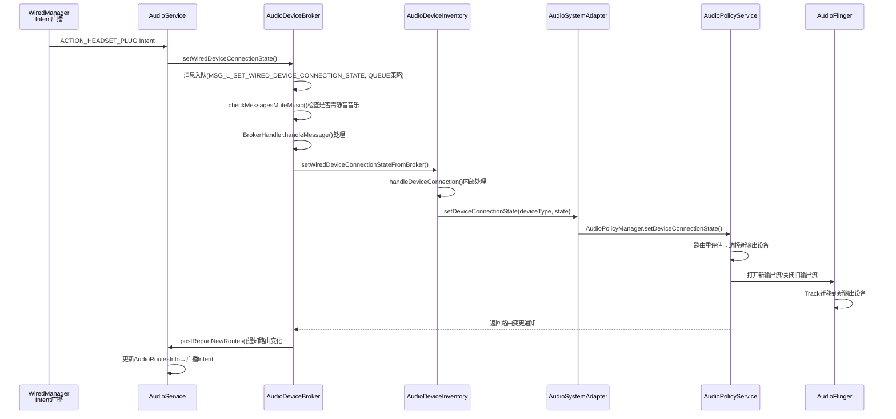
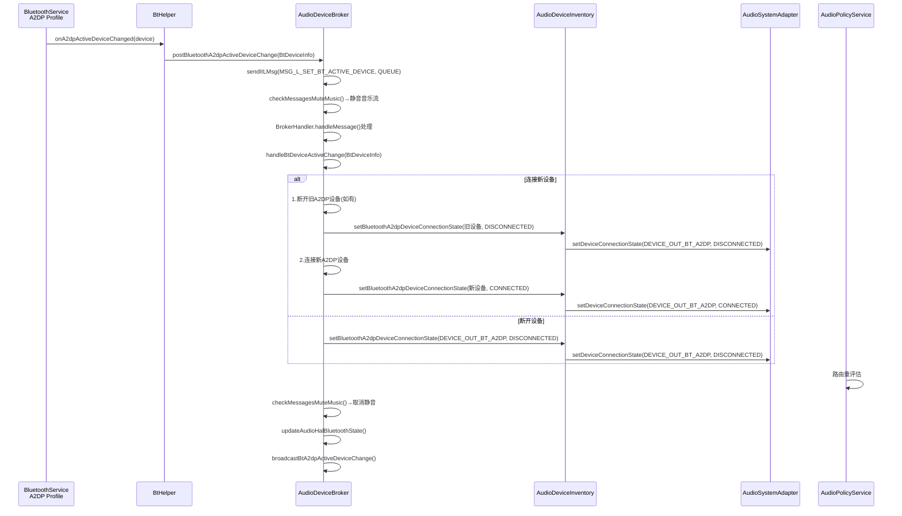
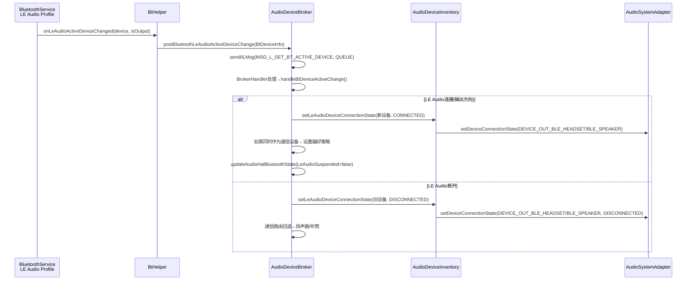
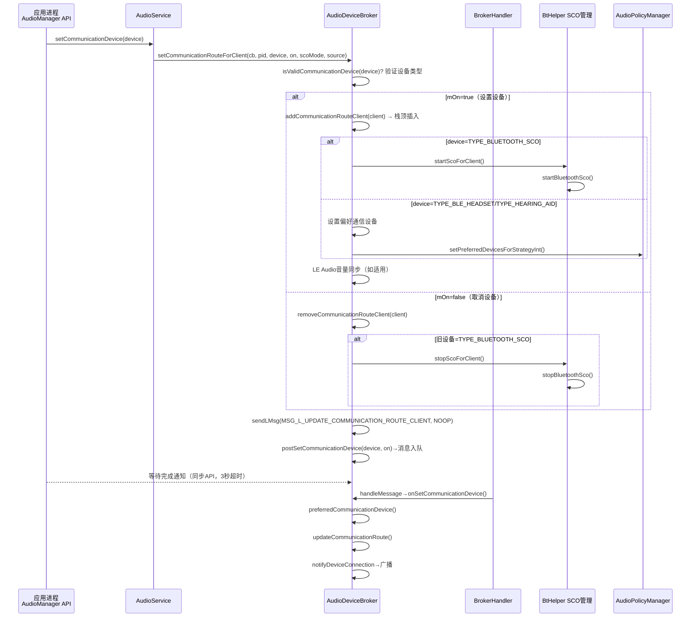
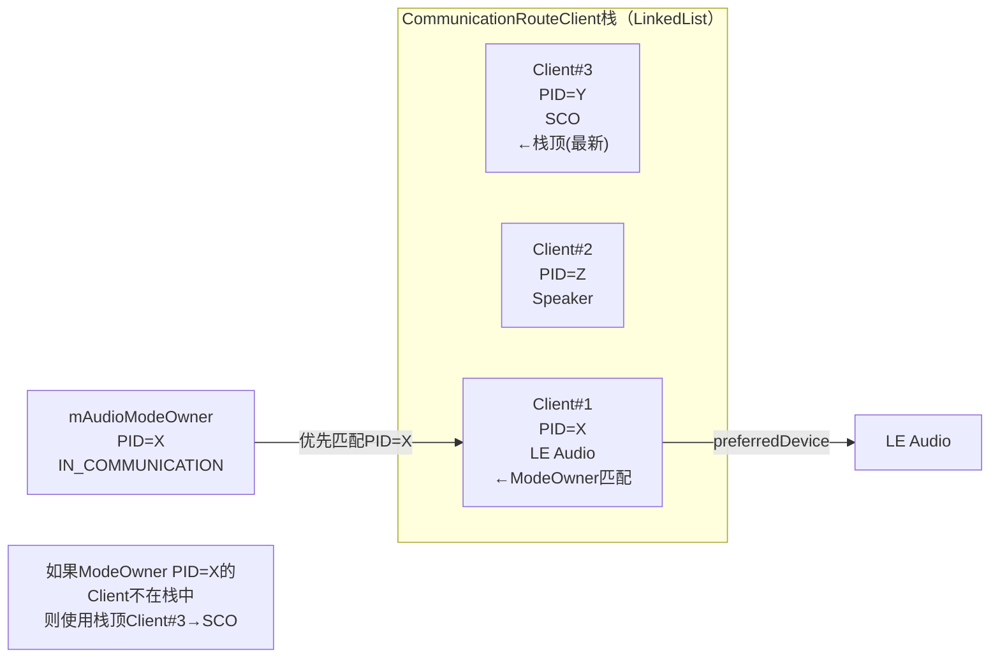
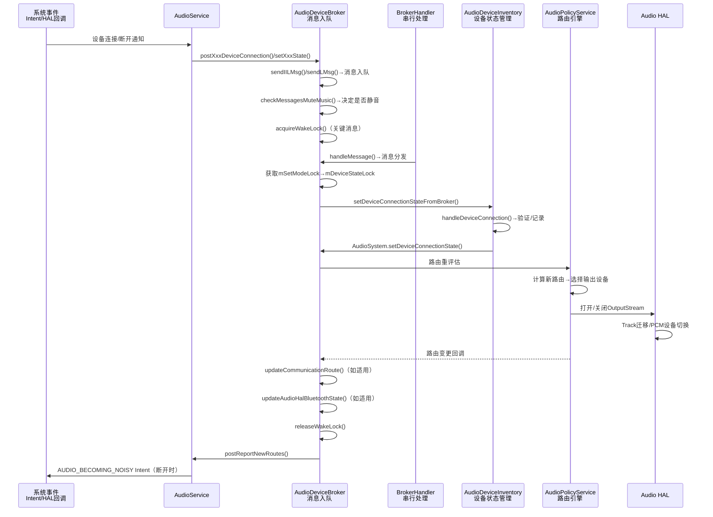

## 3.5 AudioDeviceBroker — 设备热插拔与通信路由管理

> [← 上一篇](03_3.4_VolumeController-音量控制机制.md) | [返回](README.md) | [下一篇 →](03_3.6_PlaybackActivityMonitor-播放状态追踪.md)

---

### 模块职责

[`AudioDeviceBroker`](frameworks/base/services/core/java/com/android/server/audio/AudioDeviceBroker.java:73) 是AudioService内部管理所有音频设备连接/断开事件的核心调度器。它协调有线设备、蓝牙设备（A2DP/SCO/LE Audio/Hearing Aid）、USB设备的热插拔策略，同时管理通信设备选择机制（speakerphone/Bluetooth SCO/LE Audio）。其设计遵循"消息队列化+锁分层"原则，确保设备状态变更的串行执行与线程安全。

核心职责包括：
- **设备热插拔调度**：有线/蓝牙/USB设备的连接与断开事件通过BrokerHandler消息队列串行处理
- **通信路由管理**：通过CommunicationRouteClient栈决定通信设备（通话/VoIP）路由
- **ForceUse机制**：管理FOR_MEDIA/FOR_COMMUNICATION等强制使用配置
- **蓝牙音频状态同步**：SCO开关、A2DP/LE Audio暂停状态向Audio HAL的传递
- **设备切换时的音量同步**：LE Audio设备切换时的音量对齐

---

### 类架构图



---

### 核心数据结构

#### AudioModeInfo — 音频模式持有者信息

源码位置：[`AudioModeInfo`](frameworks/base/services/core/java/com/android/server/audio/AudioDeviceBroker.java:130)

```java
static final class AudioModeInfo {
    final int mMode;   // 当前音频模式: MODE_NORMAL/MODE_RINGTONE/MODE_IN_CALL/MODE_IN_COMMUNICATION
    final int mPid;    // 模式持有者的进程ID
    final int mUid;    // 模式持有者的用户ID
}
```

[`mAudioModeOwner`](frameworks/base/services/core/java/com/android/server/audio/AudioDeviceBroker.java:152) 初始值为`MODE_NORMAL/0/0`。当通话或VoIP应用通过`AudioManager.setMode()`切换模式时，AudioService通过[`postSetModeOwner()`](frameworks/base/services/core/java/com/android/server/audio/AudioDeviceBroker.java:1101)更新此字段。**mAudioModeOwner.mPid直接影响通信路由选择优先级**——在`topCommunicationRouteClient()`中，与mAudioModeOwner.mPid匹配的Client具有最高优先权。

#### CommunicationRouteClient — 通信路由客户端栈

源码位置：[`CommunicationRouteClient`](frameworks/base/services/core/java/com/android/server/audio/AudioDeviceBroker.java:2102)

```java
private class CommunicationRouteClient implements IBinder.DeathRecipient {
    private final IBinder mCb;          // 客户端Binder，用于死亡检测
    private final int mPid;             // 客户端进程ID
    private AudioDeviceAttributes mDevice; // 客户端请求的通信设备
}
```

[`mCommunicationRouteClients`](frameworks/base/services/core/java/com/android/server/audio/AudioDeviceBroker.java:2099) 是一个`LinkedList<CommunicationRouteClient>`，**新请求总是插入栈顶（index 0）**。客户端死亡时自动触发`binderDied()`→`postCommunicationRouteClientDied()`→从栈中移除并重新评估路由。

#### CommunicationDeviceInfo — 通信设备请求信息

源码位置：[`CommunicationDeviceInfo`](frameworks/base/services/core/java/com/android/server/audio/AudioDeviceBroker.java:1368)

```java
static final class CommunicationDeviceInfo {
    final IBinder mCb;           // 客户端Binder标识
    final int mPid;              // 请求者PID
    final AudioDeviceAttributes mDevice; // 目标设备（null表示取消选择）
    final boolean mOn;           // true=设置设备, false=取消设备
    final int mScoAudioMode;     // SCO音频模式（仅SCO使用）
    final String mEventSource;   // 调用来源（日志标识）
    boolean mWaitForStatus;      // 是否等待完成状态（API依赖）
    boolean mStatus;             // 完成状态
}
```

关键设计：`setCommunicationDevice()`是**同步API**，调用线程通过`deviceInfo.wait()`等待BrokerHandler处理完成后获取`mStatus`，超时为[`SET_COMMUNICATION_DEVICE_TIMEOUT_MS`](frameworks/base/services/core/java/com/android/server/audio/AudioDeviceBroker.java:310)=3000ms。而`setSpeakerphoneOn()`/`startBluetoothScoForClient()`等是异步调用，`mWaitForStatus=false`。

#### BtDeviceInfo — 蓝牙设备变更信息

源码位置：[`BtDeviceInfo`](frameworks/base/services/core/java/com/android/server/audio/AudioDeviceBroker.java:727)

```java
static final class BtDeviceInfo {
    final BluetoothDevice mDevice;    // 蓝牙设备对象
    final int mState;                 // 连接状态: CONNECTED/DISCONNECTED
    final int mProfile;               // 蓝牙Profile: A2DP/HEARING_AID/LE_AUDIO/LE_AUDIO_BROADCAST
    final boolean mSupprNoisy;        // 是否抑制AUDIO_BECOMING_NOISY广播
    final int mVolume;                // 设备音量
    final boolean mIsLeOutput;        // LE Audio是否为输出方向
    final int mCodec;                 // A2DP编解码器类型
    final int mAudioSystemDevice;     // 对应的AudioSystem设备类型常量
    final int mMusicDevice;           // 媒体流当前设备
}
```

`equals()`方法仅比较`mProfile`和`mDevice`，用于消息队列中的消息匹配与去重。

#### BleVolumeInfo — LE Audio音量信息

源码位置：[`BleVolumeInfo`](frameworks/base/services/core/java/com/android/server/audio/AudioDeviceBroker.java:692)

```java
static final class BleVolumeInfo {
    final int mIndex;       // 目标音量索引
    final int mMaxIndex;    // 最大音量索引
    final int mStreamType;  // 音频流类型
}
```

用于LE Audio通信设备激活后的音量对齐操作。

#### VALID_COMMUNICATION_DEVICE_TYPES — 有效通信设备类型

源码位置：[`VALID_COMMUNICATION_DEVICE_TYPES`](frameworks/base/services/core/java/com/android/server/audio/AudioDeviceBroker.java:477)

```java
private static final int[] VALID_COMMUNICATION_DEVICE_TYPES = {
    TYPE_BUILTIN_SPEAKER,     // 内置扬声器（免提）
    TYPE_BLUETOOTH_SCO,       // 蓝牙SCO（经典蓝牙耳机）
    TYPE_WIRED_HEADSET,       // 有线耳机（带麦克风）
    TYPE_USB_HEADSET,         // USB耳机
    TYPE_BUILTIN_EARPIECE,    // 内置听筒
    TYPE_WIRED_HEADPHONES,    // 有线耳机（无麦克风）
    TYPE_HEARING_AID,         // 助听器
    TYPE_BLE_HEADSET,         // LE Audio耳机
    TYPE_USB_DEVICE,          // USB设备
    TYPE_BLE_SPEAKER,         // LE Audio扬声器
    TYPE_LINE_ANALOG,         // 模拟线路输出
    TYPE_HDMI,                // HDMI
    TYPE_AUX_LINE             // AUX线路
};
```

共13种设备类型被允许作为通信设备。`isValidCommunicationDevice()`用于验证`setCommunicationDevice()`的参数合法性。

---

### 锁体系设计

AudioDeviceBroker采用了三层锁体系以避免死锁并减少锁竞争：

| 锁对象 | 作用域 | 使用场景 |
|--------|--------|----------|
| [`mDeviceStateLock`](frameworks/base/services/core/java/com/android/server/audio/AudioDeviceBroker.java:118) | 设备状态检查/变更 | 所有设备连接、路由变更、ForceUse操作 |
| [`mSetModeLock`](frameworks/base/services/core/java/com/android/server/audio/AudioDeviceBroker.java:126) | AudioMode相关操作 | SCO管理、Mode Owner变更、通信路由Client操作 |
| [`mBluetoothAudioStateLock`](frameworks/base/services/core/java/com/android/server/audio/AudioDeviceBroker.java:893) | 蓝牙音频状态 | SCO/A2DP/LE Audio暂停状态变更 |
| [`sLastDeviceConnectionMsgTimeLock`](frameworks/base/services/core/java/com/android/server/audio/AudioDeviceBroker.java:113) | 消息时间戳排序 | 设备连接消息的时序保证 |

**锁获取顺序**：`mSetModeLock → mDeviceStateLock → mBluetoothAudioStateLock`。在BrokerHandler的消息处理中，涉及通信路由的消息（如MSG_L_SET_BT_ACTIVE_DEVICE、MSG_L_SET_COMMUNICATION_DEVICE_FOR_CLIENT）总是先获取`mSetModeLock`再获取`mDeviceStateLock`，确保与AudioService.mSetModeDeathHandlers的锁顺序一致，避免死锁。

`mBluetoothAudioStateLock`仅在蓝牙音频状态子系统中使用，不与主锁交叉持有。`sLastDeviceConnectionMsgTimeLock`是static锁，用于消息入队时的时间戳排序，与消息处理无竞争。

---

### 初始化流程

[`init()`](frameworks/base/services/core/java/com/android/server/audio/AudioDeviceBroker.java:209)方法在构造函数中调用：

```java
private void init() {
    setupMessaging(mContext);                        // 1. 创建BrokerThread+BrokerHandler
    initAudioHalBluetoothState();                    // 2. 初始化HAL蓝牙状态(BT_SCO=off, A2dpSuspended=false, LeAudioSuspended=false)
    initRoutingStrategyIds();                        // 3. 获取通信/无障碍策略ID
    mPreferredCommunicationDevice = null;            // 4. 清空偏好通信设备
    updateActiveCommunicationDevice();               // 5. 从AudioPolicyManager获取当前活跃通信设备
    mSystemServer.registerUserStartedReceiver(mContext); // 6. 注册用户启动广播接收器
}
```

[`initRoutingStrategyIds()`](frameworks/base/services/core/java/com/android/server/audio/AudioDeviceBroker.java:191)遍历所有`AudioProductStrategy`，找到支持`STREAM_VOICE_CALL`的策略作为`mCommunicationStrategyId`，支持`STREAM_ACCESSIBILITY`的策略作为`mAccessibilityStrategyId`。这两个ID后续用于`setPreferredDevicesForStrategyInt()`调用。

[`setupMessaging()`](frameworks/base/services/core/java/com/android/server/audio/AudioDeviceBroker.java:1570)创建独立的`BrokerThread`（线程名"AudioDeviceBroker"），在其上运行`Looper`并创建`BrokerHandler`。同时获取`PARTIAL_WAKE_LOCK`("handleAudioDeviceEvent")确保设备事件处理期间CPU不休眠，超时为[`BROKER_WAKELOCK_TIMEOUT_MS`](frameworks/base/services/core/java/com/android/server/audio/AudioDeviceBroker.java:77)=5000ms。

---

### BrokerHandler消息体系

#### 消息类型分类

BrokerHandler处理约30种消息，按功能分为以下类别：

**设备恢复与连接类**：
| 消息常量 | 值 | 说明 |
|----------|---|------|
| [`MSG_RESTORE_DEVICES`](frameworks/base/services/core/java/com/android/server/audio/AudioDeviceBroker.java:1877) | 1 | AudioFlinger死亡后恢复所有设备状态 |
| [`MSG_L_SET_WIRED_DEVICE_CONNECTION_STATE`](frameworks/base/services/core/java/com/android/server/audio/AudioDeviceBroker.java:1878) | 2 | 有线设备连接/断开 |
| [`MSG_TOGGLE_HDMI`](frameworks/base/services/core/java/com/android/server/audio/AudioDeviceBroker.java:1882) | 6 | HDMI切换 |
| [`MSG_L_SET_BT_ACTIVE_DEVICE`](frameworks/base/services/core/java/com/android/server/audio/AudioDeviceBroker.java:1883) | 7 | 蓝牙活跃设备变更 |
| [`MSG_L_BT_ACTIVE_DEVICE_CHANGE_EXT`](frameworks/base/services/core/java/com/android/server/audio/AudioDeviceBroker.java:1919) | 45 | 蓝牙活跃设备外部变更 |
| [`MSG_L_BLUETOOTH_DEVICE_CONFIG_CHANGE`](frameworks/base/services/core/java/com/android/server/audio/AudioDeviceBroker.java:1888) | 11 | 蓝牙设备配置变更 |

**ForceUse类**：
| 消息常量 | 值 | 说明 |
|----------|---|------|
| [`MSG_IIL_SET_FORCE_USE`](frameworks/base/services/core/java/com/android/server/audio/AudioDeviceBroker.java:1880) | 4 | 通用ForceUse设置 |
| [`MSG_IIL_SET_FORCE_BT_A2DP_USE`](frameworks/base/services/core/java/com/android/server/audio/AudioDeviceBroker.java:1881) | 5 | A2DP ForceUse设置 |

**通信路由类**：
| 消息常量 | 值 | 说明 |
|----------|---|------|
| [`MSG_L_SET_COMMUNICATION_DEVICE_FOR_CLIENT`](frameworks/base/services/core/java/com/android/server/audio/AudioDeviceBroker.java:1915) | 42 | 为客户端设置通信设备 |
| [`MSG_L_UPDATE_COMMUNICATION_ROUTE_CLIENT`](frameworks/base/services/core/java/com/android/server/audio/AudioDeviceBroker.java:1916) | 43 | 更新通信路由客户端 |
| [`MSG_L_COMMUNICATION_ROUTE_CLIENT_DIED`](frameworks/base/services/core/java/com/android/server/audio/AudioDeviceBroker.java:1908) | 34 | 客户端死亡处理 |
| [`MSG_I_SET_MODE_OWNER`](frameworks/base/services/core/java/com/android/server/audio/AudioDeviceBroker.java:1894) | 16 | 设置音频模式持有者 |
| [`MSG_I_SCO_AUDIO_STATE_CHANGED`](frameworks/base/services/core/java/com/android/server/audio/AudioDeviceBroker.java:1917) | 44 | SCO音频状态变更 |

**蓝牙Profile连接类**：
| 消息常量 | 值 | 说明 |
|----------|---|------|
| [`MSG_I_BT_SERVICE_DISCONNECTED_PROFILE`](frameworks/base/services/core/java/com/android/server/audio/AudioDeviceBroker.java:1896) | 22 | 蓝牙Profile断开 |
| [`MSG_IL_BT_SERVICE_CONNECTED_PROFILE`](frameworks/base/services/core/java/com/android/server/audio/AudioDeviceBroker.java:1897) | 23 | 蓝牙Profile连接 |

#### 消息发送策略（SENDMSG_REPLACE/NOOP/QUEUE）

源码位置：[`sendIILMsg()`](frameworks/base/services/core/java/com/android/server/audio/AudioDeviceBroker.java:1997)

```java
private static final int SENDMSG_REPLACE = 0;  // 替换已有同类型消息
private static final int SENDMSG_NOOP    = 1;  // 已有同类型消息则忽略
private static final int SENDMSG_QUEUE   = 2;  // 总是排队，保留已有消息
```

- **SENDMSG_REPLACE**：用于状态类消息（如`MSG_RESTORE_DEVICES`），最新状态覆盖旧状态
- **SENDMSG_NOOP**：用于一次性通知（如`MSG_REPORT_NEW_ROUTES`），避免重复
- **SENDMSG_QUEUE**：用于设备连接序列（如`MSG_L_SET_BT_ACTIVE_DEVICE`），确保断开→连接的顺序执行

#### 消息时序保证机制

[`sLastDeviceConnectionMsgTime`](frameworks/base/services/core/java/com/android/server/audio/AudioDeviceBroker.java:115)确保设备连接类消息的时序正确性。对于`MSG_L_SET_BT_ACTIVE_DEVICE`、`MSG_L_SET_WIRED_DEVICE_CONNECTION_STATE`、`MSG_IL_BTA2DP_TIMEOUT`等关键消息，如果计算出的发送时间`time`小于`sLastDeviceConnectMsgTime`，则自动追加30ms延迟，确保消息按入队顺序到达BrokerHandler。

#### WakeLock保护机制

[`isMessageHandledUnderWakelock()`](frameworks/base/services/core/java/com/android/server/audio/AudioDeviceBroker.java:1930)定义了需要在WakeLock保护下处理的消息类型（设备连接、HDMI切换、超时等）。这些消息入队时获取5秒WakeLock，处理完成后释放，确保设备切换过程中CPU不会休眠导致路由中断。

#### 音乐静音机制（MESSAGES_MUTE_MUSIC）

[`MESSAGES_MUTE_MUSIC`](frameworks/base/services/core/java/com/android/server/audio/AudioDeviceBroker.java:2044)集合包含A2DP相关的4种消息。当这些消息在队列中等待处理时，音乐流会被临时静音，避免在A2DP设备切换过程中音频从扬声器短暂泄漏。**例外**：如果音乐正在有线耳机上播放（通过`DEVICE_OVERRIDE_A2DP_ROUTE_ON_PLUG_SET`集合检测），则不静音。

---

### 有线设备连接处理流程

#### 时序图



#### 关键方法详解

[`setWiredDeviceConnectionState()`](frameworks/base/services/core/java/com/android/server/audio/AudioDeviceBroker.java:255)是外部入口，接收4个参数：

| 参数 | 类型 | 含义 |
|------|------|------|
| type | int | AudioSystem设备类型常量（如DEVICE_OUT_WIRED_HEADPHONE=0x8） |
| state | int | 连接状态：CONNECTED=1 / DISCONNECTED=0 |
| address | String | 设备地址（有线设备通常为空字符串） |
| name | String | 设备名称 |

内部调用`sendLMsg(MSG_L_SET_WIRED_DEVICE_CONNECTION_STATE, SENDMSG_QUEUE, obj)`将消息排队。QUEUE策略确保多个有线设备事件按顺序处理（例如耳机拔出→扬声器连接的先后关系）。

BrokerHandler处理此消息时，调用[`mDeviceInventory.setWiredDeviceConnectionStateFromBroker()`](frameworks/base/services/core/java/com/android/server/audio/AudioDeviceInventory.java)，后者执行：
1. 调用`handleDeviceConnection()`检查设备是否已连接（避免重复）
2. 调用`AudioSystem.setDeviceConnectionState()`通知AudioPolicyManager
3. 如果是断开事件，调用`AudioSystem.setDeviceConnectionState()`先断开，然后触发路由重评估
4. 调用`checkSendBecomingNoisyIntent()`在断开时发送`AUDIO_BECOMING_NOISY`广播（除非`mSupprNoisy=true`）

---

### 蓝牙A2DP设备连接/断开处理

#### 时序图



#### 关键方法详解

[`postBluetoothA2dpActiveDeviceChange()`](frameworks/base/services/core/java/com/android/server/audio/AudioDeviceBroker.java:860)由BtHelper回调触发，构建`BtDeviceInfo`对象：

```java
BtDeviceInfo btDeviceInfo = new BtDeviceInfo(device, state, BluetoothProfile.A2DP,
    supprNoisy, volume, codec, musicDevice);
```

- **mSupprNoisy**：A2DP连接时设为true（抑制NOISY广播），断开时设为false
- **mCodec**：来自A2DP codec配置，用于AudioPolicyManager的编解码器参数传递
- **mMusicDevice**：记录当前媒体流设备，用于A2DP恢复时的路由决策

[`handleBtDeviceActiveChange()`](frameworks/base/services/core/java/com/android/server/audio/AudioDeviceBroker.java:1460)是核心处理逻辑，流程如下：
1. **持有mSetModeLock + mDeviceStateLock**（双重锁保证线程安全）
2. 如果是A2DP断开事件，直接断开当前A2DP设备
3. 如果是A2DP连接事件，先断开旧A2DP设备（如果有），再连接新设备
4. 调用`updateAudioHalBluetoothState()`同步`A2dpSuspended=false`到Audio HAL
5. 如果处于IN_CALL/IN_COMMUNICATION模式，检查是否需要重新评估通信路由

---

### LE Audio设备切换流程

LE Audio（BLE Headset/BLE Speaker）在AOSP14中被正式纳入通信设备类型。LE Audio的切换涉及额外的音量同步步骤：



LE Audio的关键特性：
- **双模切换**：LE Audio设备可作为媒体输出（A2DP替代）和通信输出同时使用
- [`mIsLeOutput`](frameworks/base/services/core/java/com/android/server/audio/AudioDeviceBroker.java:747)标识LE Audio设备方向，输出方向(true)才走媒体路由
- **音量同步**：当LE Audio设备被设置为通信设备时，通过`BleVolumeInfo`对齐音量索引
- **兼容性处理**：LE Audio与Hearing Aid共存时，优先使用LE Audio（因为LE Audio是Hearing Aid的演进协议）

---

### 通信设备选择机制

#### 核心流程：setCommunicationRouteForClient

源码位置：[`setCommunicationRouteForClient()`](frameworks/base/services/core/java/com/android/server/audio/AudioDeviceBroker.java:369)

这是整个通信路由管理的入口方法，由AudioService的`setCommunicationDevice()`/`clearCommunicationDevice()`调用：



#### 通信路由优先级决策

[`preferredCommunicationDevice()`](frameworks/base/services/core/java/com/android/server/audio/AudioDeviceBroker.java:2169)决定当前应该使用哪个通信设备：

决策逻辑：
1. 从`topCommunicationRouteClient()`获取栈顶客户端请求的设备
2. 如果栈顶客户端的PID与`mAudioModeOwner.mPid`匹配，该客户端具有最高优先权
3. 如果PID不匹配，仍使用栈顶客户端的设备（**最新请求优先**原则）
4. 如果栈为空，回退到默认行为：IN_CALL模式→听筒，IN_COMMUNICATION模式→扬声器

[`topCommunicationRouteClient()`](frameworks/base/services/core/java/com/android/server/audio/AudioDeviceBroker.java:448)的具体逻辑：
```java
// 遍历栈，优先选择ModeOwner PID对应的Client
for (CommunicationRouteClient c : mCommunicationRouteClients) {
    if (c.mPid == mAudioModeOwner.mPid) {
        return c;  // ModeOwner优先
    }
}
// 没有ModeOwner对应的Client，返回栈顶（最新请求）
if (mCommunicationRouteClients.size() > 0) {
    return mCommunicationRouteClients.get(0);
}
return null;  // 栈空，回退默认
```

**设计意义**：当VoIP应用(PID=X)持有IN_COMMUNICATION模式并请求LE Audio设备时，即使另一个应用(PID=Y)后来请求了SCO设备，VoIP应用的LE Audio设备仍优先。这保证了通话期间通信路由的稳定性。

#### 通信设备栈管理示意



---

### ForceUse机制

[`setForceUse()`](frameworks/base/services/core/java/com/android/server/audio/AudioDeviceBroker.java:317)管理音频策略中的强制使用配置。ForceUse影响AudioPolicyManager的路由决策：

| ForceUse配置 | 使用场景 | 影响 |
|-------------|---------|------|
| FOR_COMMUNICATION | VoIP/通话模式 | 强制使用通信设备而非默认媒体设备 |
| FOR_MEDIA | 媒体播放 | 强制媒体路由到特定设备 |
| FOR_RECORD | 录音 | 强制录音输入源 |
| FOR_SYSTEM_SOUNDS | 系统音 | 强制系统音路由 |
| FOR_RINGTONE | 来电铃声 | 强制铃声路由 |
| FOR_ALARM | 闹钟 | 强制闹钟路由 |

**配置值**：
- `FORCE_SPEAKER`：强制使用扬声器
- `FORCE_BT_A2DP`：强制使用蓝牙A2DP
- `FORCE_HEADPHONES`：强制使用耳机
- `FORCE_BT_SCO`：强制使用蓝牙SCO
- `FORCE_WIRED_ACCESSORY`：强制使用有线配件
- `FORCE_NONE`：不强制（使用默认策略）
- `FORCE_BT_CAR_DOCK`/`FORCE_BT_DESK_DOCK`：蓝牙车载/桌面Dock

[`MSG_IIL_SET_FORCE_USE`](frameworks/base/services/core/java/com/android/server/audio/AudioDeviceBroker.java:1880)使用SENDMSG_REPLACE策略，即同一ForceUse类型的多次设置，只有最新值生效。

[`MSG_IIL_SET_FORCE_BT_A2DP_USE`](frameworks/base/services/core/java/com/android/server/audio/AudioDeviceBroker.java:1881)专门处理A2DP的ForceUse，其特殊之处在于：当A2DP被暂停（`mBtA2dpSuspended=true`）时，设置`FORCE_BT_A2DP`会自动替换为`FORCE_SPEAKER`，确保音频不会路由到暂停的A2DP设备。

---

### Audio HAL蓝牙状态同步

[`updateAudioHalBluetoothState()`](frameworks/base/services/core/java/com/android/server/audio/AudioDeviceBroker.java:934)将蓝牙音频状态参数同步到Audio HAL，确保HAL层能做出正确的路由决策：

| 参数名 | 值 | 设置时机 |
|--------|---|---------|
| BT_SCO | true/false | SCO启动/停止时 |
| A2dpSuspended | true/false | A2DP被通话暂停/恢复时 |
| LeAudioSuspended | true/false | LE Audio被通话暂停/恢复时 |

同步通过`AudioSystem.setParameters()`实现，底层路径为：
```
AudioDeviceBroker → AudioSystemAdapter → AudioSystem JNI → AudioFlinger → AudioPolicyManager → Audio HAL
```

**设计意义**：Audio HAL需要知道蓝牙设备的当前状态才能正确决策：
- 当SCO打开时，HAL知道应该将语音流路由到SCO
- 当A2DP被暂停时，HAL知道不应将媒体流路由到A2DP（避免通话期间音乐通过蓝牙耳机播放）
- 当LE Audio被暂停时，HAL知道应将语音流回退到传统SCO

[`initAudioHalBluetoothState()`](frameworks/base/services/core/java/com/android/server/audio/AudioDeviceBroker.java:224)在系统启动时初始化三个参数为默认状态（SCO=false, A2dpSuspended=false, LeAudioSuspended=false），确保HAL的初始状态与Java层一致。

---

### SCO管理机制

SCO（Synchronous Connection-Oriented）是经典蓝牙用于语音通话的链路类型。AudioDeviceBroker通过BtHelper管理SCO的生命周期：

#### SCO启动条件

[`startScoForClient()`](frameworks/base/services/core/java/com/android/server/audio/AudioDeviceBroker.java)仅在以下条件同时满足时才真正启动SCO：
1. 通信设备类型为`TYPE_BLUETOOTH_SCO`
2. 有已连接的SCO蓝牙设备（`mBtHelper.isBluetoothScoAvailable()`）
3. 音频模式为IN_CALL或IN_COMMUNICATION
4. 不是VoIP通话使用LE Audio的降级场景

#### SCO与LE Audio的互斥

当LE Audio设备被设置为通信设备时，SCO不应启动。这是通过[`USE_SET_COMMUNICATION_DEVICE`](frameworks/base/services/core/java/com/android/server/audio/AudioDeviceBroker.java:158) ChangeId控制的。启用该ChangeId后，通信路由完全由`setCommunicationDevice()`API管理，不再使用旧的`startBluetoothSco()/setSpeakerphoneOn()`API组合。

在兼容模式下（ChangeId未启用），`startBluetoothScoForClient()`仍然存在，但会检查：如果当前已有LE Audio通信设备，则不启动SCO，避免两个蓝牙语音链路同时活跃。

---

### 设备热插拔完整时序图

综合有线/蓝牙/USB所有设备类型的完整处理流程：



---

### 关键设计总结

| 设计要素 | 实现方式 | 目的 |
|----------|---------|------|
| 消息队列化 | BrokerThread+BrokerHandler | 串行化设备事件，保证执行顺序 |
| 锁分层 | mDeviceStateLock/mSetModeLock/mBluetoothAudioStateLock | 减少锁竞争，避免死锁 |
| 消息策略 | REPLACE/NOOP/QUEUE | 状态消息去重、事件消息保序 |
| 时序保证 | sLastDeviceConnectionMsgTime+30ms延迟 | 防止消息乱序 |
| WakeLock | PARTIAL_WAKE_LOCK(5s) | 关键设备切换期间CPU不休眠 |
| 音乐静音 | MESSAGES_MUTE_MUSIC集合 | A2DP切换时防止音频泄漏 |
| 通信路由栈 | LinkedList+PID优先匹配 | 保证通话稳定性和最新请求优先 |
| HAL参数同步 | AudioSystem.setParameters() | HAL层路由决策所需蓝牙状态 |
| 同步API等待 | CommunicationDeviceInfo.wait(3s) | setCommunicationDevice()同步返回 |
| Binder死亡检测 | IBinder.DeathRecipient | 客户端死亡自动回退通信路由 |

---

> [← 上一篇](03_3.4_VolumeController-音量控制机制.md) | [返回](README.md) | [下一篇 →](03_3.6_PlaybackActivityMonitor-播放状态追踪.md)