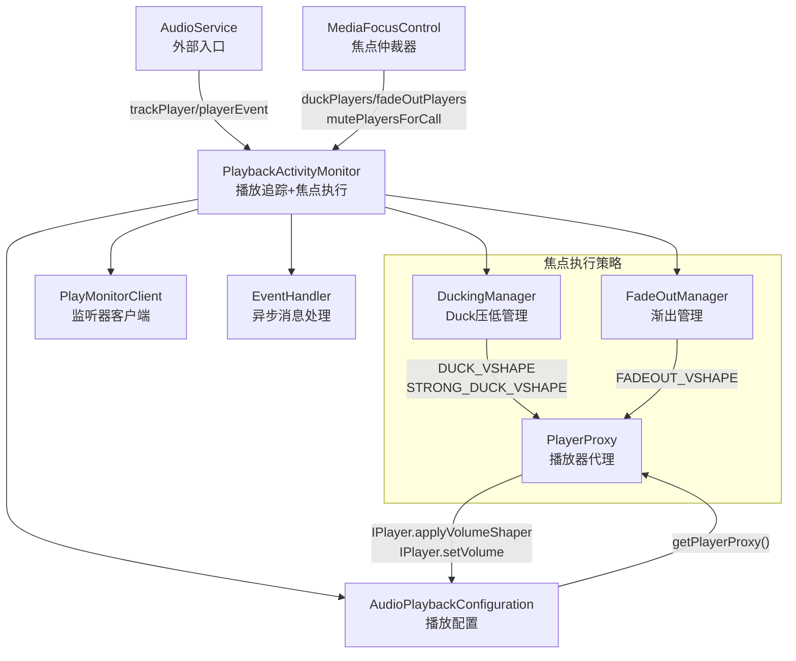
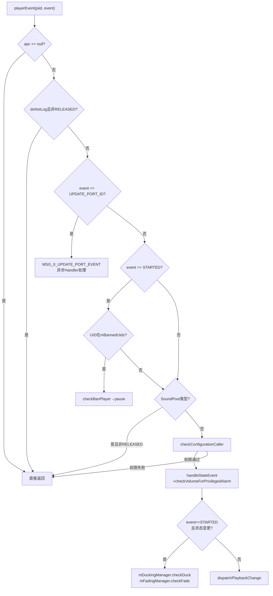
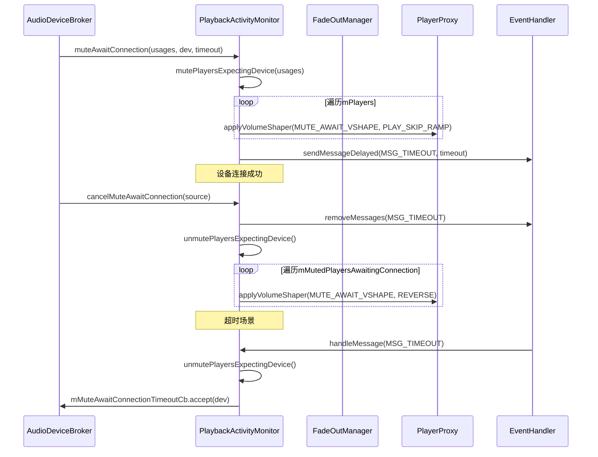
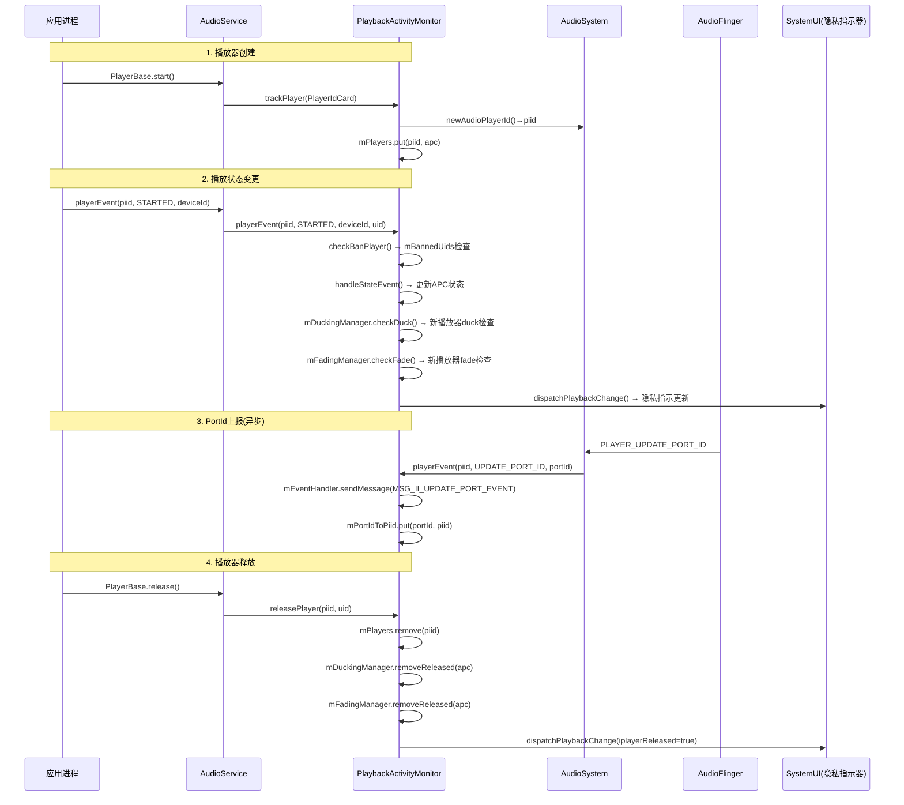
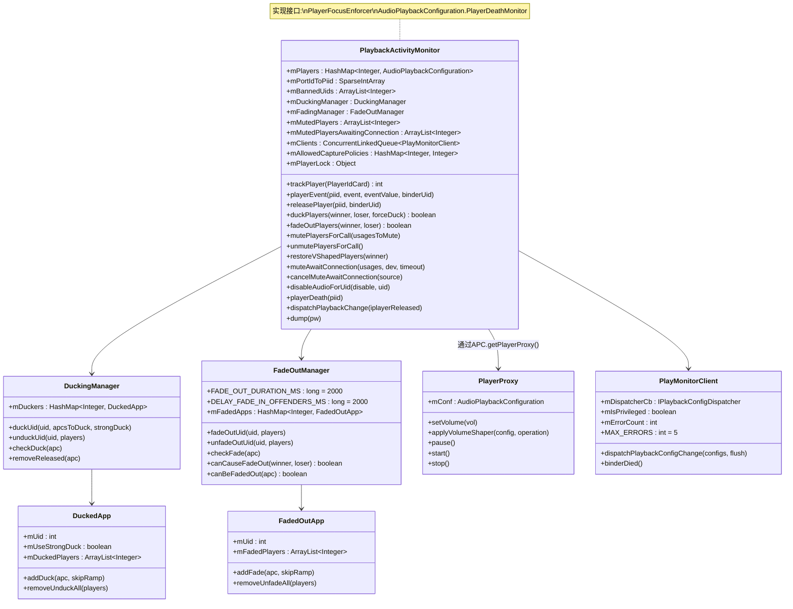

## 3.6 PlaybackActivityMonitor — 播放状态追踪与焦点执行器

> [← 上一篇](03_3.5_AudioDeviceBroker-设备热插拔管理.md) | [返回](README.md) | [下一篇 →](03_3.7_System_Service-关联系统服务.md)

---

### 模块职责

[`PlaybackActivityMonitor`](frameworks/base/services/core/java/com/android/server/audio/PlaybackActivityMonitor.java:76) 是AudioService中追踪所有活跃音频播放会话的核心组件，同时作为焦点策略的**执行器（PlayerFocusEnforcer）**。它实现了两个关键接口：
- [`PlayerFocusEnforcer`](frameworks/base/services/core/java/com/android/server/audio/PlaybackActivityMonitor.java:77) — 焦点duck/fadeout/mute操作的执行者，由MediaFocusControl调用
- [`AudioPlaybackConfiguration.PlayerDeathMonitor`](frameworks/base/services/core/java/com/android/server/audio/PlaybackActivityMonitor.java:77) — 播放器进程死亡时的清理回调

核心职责包括：
- **播放器生命周期追踪**：通过`trackPlayer/playerEvent/releasePlayer`完整记录播放器从创建到释放的状态变迁
- **焦点策略执行**：duck（压低音量）、fadeout（渐出）、mute（静音）三种音量干预手段
- **隐私指示器分发**：通过`dispatchPlaybackChange()`将活跃播放配置分发给所有注册监听器，用于系统UI的麦克风/扬声器隐私指示
- **UID封禁管理**：通过`mBannedUids`禁止特定UID的播放器启动
- **设备连接等待静音**：`muteAwaitConnection`机制在预期设备连接前静音特定usage的播放器

---

### 类架构图



---

### 核心数据结构

#### 播放器注册表 — mPlayers

源码位置：[`mPlayers`](frameworks/base/services/core/java/com/android/server/audio/PlaybackActivityMonitor.java:148)

```java
@GuardedBy("mPlayerLock")
private final HashMap<Integer, AudioPlaybackConfiguration> mPlayers =
        new HashMap<Integer, AudioPlaybackConfiguration>();
```

**键**：`piid`（Player Interface ID），由[`AudioSystem.newAudioPlayerId()`](frameworks/base/services/core/java/com/android/server/audio/PlaybackActivityMonitor.java:232)生成
**值**：`AudioPlaybackConfiguration`对象，包含播放器的完整信息

所有对`mPlayers`的读写操作必须在[`mPlayerLock`](frameworks/base/services/core/java/com/android/server/audio/PlaybackActivityMonitor.java:146)同步锁保护下进行。

#### Port ID映射表 — mPortIdToPiid

源码位置：[`mPortIdToPiid`](frameworks/base/services/core/java/com/android/server/audio/PlaybackActivityMonitor.java:152)

```java
@GuardedBy("mPlayerLock")
private final SparseIntArray mPortIdToPiid = new SparseIntArray();
```

将AudioFlinger层的`portId`映射到Framework层的`piid`。当AudioFlinger通过`PLAYER_UPDATE_PORT_ID`事件上报portId时，通过此表查找对应的播放器配置。AudioServer死亡时此表被清空（[`onAudioServerDied()`](frameworks/base/services/core/java/com/android/server/audio/PlaybackActivityMonitor.java:497)）。

#### UID封禁列表 — mBannedUids

源码位置：[`mBannedUids`](frameworks/base/services/core/java/com/android/server/audio/PlaybackActivityMonitor.java:171)

```java
private final ArrayList<Integer> mBannedUids = new ArrayList<Integer>();
```

被封禁的UID列表，由[`disableAudioForUid()`](frameworks/base/services/core/java/com/android/server/audio/PlaybackActivityMonitor.java:174)管理。被封禁UID的播放器在`PLAYER_STATE_STARTED`事件时会被立即pause，且无法更新状态。

#### 通话静音列表 — mMutedPlayers

源码位置：[`mMutedPlayers`](frameworks/base/services/core/java/com/android/server/audio/PlaybackActivityMonitor.java:757)

```java
private final ArrayList<Integer> mMutedPlayers = new ArrayList<Integer>();
```

在通话（RINGTONE/IN_CALL）期间被静音的播放器piid列表。由[`mutePlayersForCall()`](frameworks/base/services/core/java/com/android/server/audio/PlaybackActivityMonitor.java:831)添加，[`unmutePlayersForCall()`](frameworks/base/services/core/java/com/android/server/audio/PlaybackActivityMonitor.java:870)清除。

#### 设备连接等待静音 — mMutedPlayersAwaitingConnection

源码位置：[`mMutedPlayersAwaitingConnection`](frameworks/base/services/core/java/com/android/server/audio/PlaybackActivityMonitor.java:1451)

```java
@GuardedBy("mPlayerLock")
private final ArrayList<Integer> mMutedPlayersAwaitingConnection = new ArrayList<Integer>();
```

等待特定音频设备连接时被静音的播放器。配合[`mMutedUsagesAwaitingConnection`](frameworks/base/services/core/java/com/android/server/audio/PlaybackActivityMonitor.java:1457)（需要静音的usage列表）一起使用。

#### 捕获策略缓存 — mAllowedCapturePolicies

源码位置：[`mAllowedCapturePolicies`](frameworks/base/services/core/java/com/android/server/audio/PlaybackActivityMonitor.java:512)

```java
private final HashMap<Integer, Integer> mAllowedCapturePolicies =
        new HashMap<Integer, Integer>();
```

UID到`AudioAttributes.ALLOW_CAPTURE_*`策略的映射。通过[`setAllowedCapturePolicy()`](frameworks/base/services/core/java/com/android/server/audio/PlaybackActivityMonitor.java:525)设置，确保即使播放器声明了更宽松的捕获策略，也会被UID级别的限制覆盖。

---

### VolumeShaper配置详解

PlaybackActivityMonitor定义了4套系统级VolumeShaper曲线，用于不同的音量干预场景：

#### DUCK_VSHAPE — 标准Duck压低（-14dB）

源码位置：[`DUCK_VSHAPE`](frameworks/base/services/core/java/com/android/server/audio/PlaybackActivityMonitor.java:88)

| 参数 | 值 | 说明 |
|------|------|------|
| ID | `VOLUME_SHAPER_SYSTEM_DUCK_ID(1)` | 系统duck标识 |
| 曲线时间 | `[0.0, 1.0]` | 从开始到结束 |
| 曲线音量 | `[1.0, 0.2]` | 1→0.2，衰减约-14dB |
| 时长 | `getFocusRampTimeMs(MAY_DUCK, NOTIFICATION)` | 动态计算斜坡时间 |
| 时钟模式 | `OPTION_FLAG_CLOCK_TIME` | 使用真实时间而非帧时间 |

**衰减因子0.2** ≈ `10^(-14/20)` = -14dB，这是标准的duck压低量。

#### STRONG_DUCK_VSHAPE — 强Duck压低（-35dB）

源码位置：[`STRONG_DUCK_VSHAPE`](frameworks/base/services/core/java/com/android/server/audio/PlaybackActivityMonitor.java:103)

| 参数 | 值 | 说明 |
|------|------|------|
| ID | `VOLUME_SHAPER_SYSTEM_STRONG_DUCK_ID(4)` | 强duck标识 |
| 曲线音量 | `[1.0, 0.017783]` | 衰减约-35dB |
| 触发条件 | `reqCausesStrongDuck()`返回true | 仅USAGE_ASSISTANT触发 |

**衰减因子0.017783** ≈ `10^(-35/20)` = -35dB，由语音助手(USAGE_ASSISTANT)获得MAY_DUCK焦点时触发。

#### FADEOUT_VSHAPE — 渐出曲线（2秒）

源码位置：[`FADEOUT_VSHAPE`](frameworks/base/services/core/java/com/android/server/audio/FadeOutManager.java:51)

| 参数 | 值 | 说明 |
|------|------|------|
| ID | `VOLUME_SHAPER_SYSTEM_FADEOUT_ID(2)` | 渐出标识 |
| 曲线时间 | `[0.0, 0.25, 1.0]` | 三段曲线 |
| 曲线音量 | `[1.0, 0.65, 0.0]` | 1→0.65→0渐出 |
| 时长 | `2000ms` | 2秒渐出周期 |

**三段曲线设计**：前25%时间降到65%（用户可感知降低），后75%时间平滑降到0。REVERSE操作用于恢复时渐入。

#### MUTE_AWAIT_CONNECTION_VSHAPE — 等待设备连接静音

源码位置：[`MUTE_AWAIT_CONNECTION_VSHAPE`](frameworks/base/services/core/java/com/android/server/audio/PlaybackActivityMonitor.java:123)

| 参数 | 值 | 说明 |
|------|------|------|
| ID | `VOLUME_SHAPER_SYSTEM_MUTE_AWAIT_CONNECTION_ID(3)` | 等待连接标识 |
| 曲线音量 | `[1.0, 0.0]` | 立即静音 |
| 时长 | `100ms(UNMUTE_DURATION_MS)` | 仅用于恢复斜坡 |

**静音时使用`PLAY_SKIP_RAMP`跳过斜坡直接静音，恢复时使用`REVERSE`操作以100ms渐入恢复音量**。

---

### 播放器类型与可Duck/Fadeout矩阵

| 播放器类型 | 可Duck | 可Fadeout | 说明 |
|-----------|--------|-----------|------|
| `PLAYER_TYPE_UNKNOWN(0)` | ✅ | ✅ | 未知类型，默认允许 |
| `PLAYER_TYPE_JAVA(1)` | ✅ | ✅ | Java AudioTrack |
| `PLAYER_TYPE_SONIC(2)` | ✅ | ✅ | Sonic播放器 |
| `PLAYER_TYPE_AAUDIO(3)` | ❌ | ❌ | AAudio低延迟，不支持VolumeShaper |
| `PLAYER_TYPE_JAM_SOUNDPOOL(4)` | ❌ | ❌ | SoundPool，不支持VolumeShaper |
| `PLAYER_TYPE_EXOPLAYER(5)` | ✅ | ✅ | ExoPlayer |

**不可Duck的播放器类型**：[`UNDUCKABLE_PLAYER_TYPES`](frameworks/base/services/core/java/com/android/server/audio/PlaybackActivityMonitor.java:135) = `{AAUDIO, JAM_SOUNDPOOL}`

**不可Fadeout的播放器类型**：[`UNFADEABLE_PLAYER_TYPES`](frameworks/base/services/core/java/com/android/server/audio/FadeOutManager.java:67) = `{AAUDIO, JAM_SOUNDPOOL}`（与不可Duck完全一致）

**不可Fadeout的内容类型**：[`UNFADEABLE_CONTENT_TYPES`](frameworks/base/services/core/java/com/android/server/audio/FadeOutManager.java:70) = `{CONTENT_TYPE_SPEECH}`（语音内容不应渐出）

**可Fadeout的Usage**：[`FADEABLE_USAGES`](frameworks/base/services/core/java/com/android/server/audio/FadeOutManager.java:73) = `{USAGE_GAME, USAGE_MEDIA}`（仅媒体和游戏可渐出）

---

### 关键方法深度解析

#### trackPlayer() — 播放器注册

源码位置：[`trackPlayer()`](frameworks/base/services/core/java/com/android/server/audio/PlaybackActivityMonitor.java:231)

```java
public int trackPlayer(PlayerBase.PlayerIdCard pic) {
    final int newPiid = AudioSystem.newAudioPlayerId();
    final AudioPlaybackConfiguration apc =
            new AudioPlaybackConfiguration(pic, newPiid,
                    Binder.getCallingUid(), Binder.getCallingPid());
    apc.init();
    synchronized (mAllowedCapturePolicies) {
        int uid = apc.getClientUid();
        if (mAllowedCapturePolicies.containsKey(uid)) {
            updateAllowedCapturePolicy(apc, mAllowedCapturePolicies.get(uid));
        }
    }
    synchronized(mPlayerLock) {
        mPlayers.put(newPiid, apc);
        maybeMutePlayerAwaitingConnection(apc);
    }
    return newPiid;
}
```

**调用链**：`PlayerBase.start()` → `AudioService.trackPlayer()` → `PlaybackActivityMonitor.trackPlayer()`

**关键逻辑**：
1. 通过`AudioSystem.newAudioPlayerId()`获取全局唯一piid
2. 创建`AudioPlaybackConfiguration`，记录调用者的UID/PID
3. `apc.init()`初始化IPlayer代理和DeathRecipient
4. 检查UID级别的`mAllowedCapturePolicies`，若UID有更严格的捕获策略则覆盖
5. 将APC注册到`mPlayers`表
6. **调用`maybeMutePlayerAwaitingConnection()`** — 如果当前有等待设备连接的静音请求，且此播放器的usage在`mMutedUsagesAwaitingConnection`列表中，则立即静音

#### playerEvent() — 播放状态事件处理

源码位置：[`playerEvent()`](frameworks/base/services/core/java/com/android/server/audio/PlaybackActivityMonitor.java:344)

```java
public void playerEvent(int piid, int event, int eventValue, int binderUid) {
    synchronized(mPlayerLock) {
        final AudioPlaybackConfiguration apc = mPlayers.get(piid);
        // 1. 空检查
        if (apc == null) return;
        
        // 2. "不记录"播放器过滤（除了RELEASED事件）
        final boolean doNotLog = mDoNotLogPiidList.contains(piid);
        if (doNotLog && event != PLAYER_STATE_RELEASED) return;
        
        // 3. PORT_ID事件走异步Handler处理
        if (event == PLAYER_UPDATE_PORT_ID) {
            mEventHandler.sendMessage(
                mEventHandler.obtainMessage(MSG_II_UPDATE_PORT_EVENT, eventValue, piid));
            return;
        }
        
        // 4. STARTED事件检查UID封禁
        if (event == PLAYER_STATE_STARTED) {
            for (Integer uidInteger: mBannedUids) {
                if (checkBanPlayer(apc, uidInteger)) return;
            }
        }
        
        // 5. SoundPool过滤
        if (apc.getPlayerType() == PLAYER_TYPE_JAM_SOUNDPOOL && event != PLAYER_STATE_RELEASED) return;
        
        // 6. 权限校验 + 特权闹钟处理
        if (checkConfigurationCaller(piid, apc, binderUid)) {
            checkVolumeForPrivilegedAlarm(apc, event);
            change = apc.handleStateEvent(event, eventValue);
        }
        
        // 7. Duck/Fade检查
        if (change && event == PLAYER_STATE_STARTED) {
            mDuckingManager.checkDuck(apc);
            mFadingManager.checkFade(apc);
        }
    }
}
```

**核心决策流程**：



**关键细节**：
- `PLAYER_UPDATE_PORT_ID`事件通过Handler异步处理，因为portId映射更新不需要同步阻塞
- `PLAYER_STATE_STARTED`时同时检查Duck和Fade状态 — 如果此UID已经被duck/fade，新启动的播放器也需要立即被duck/fade
- `checkBanPlayer()`调用`apc.getPlayerProxy().pause()`来物理阻止被封禁UID的播放

#### duckPlayers() — Duck压低执行

源码位置：[`duckPlayers()`](frameworks/base/services/core/java/com/android/server/audio/PlaybackActivityMonitor.java:762)

```java
@Override
public boolean duckPlayers(FocusRequester winner, FocusRequester loser, boolean forceDuck) {
    synchronized (mPlayerLock) {
        if (mPlayers.isEmpty()) return true;
        
        final Iterator<AudioPlaybackConfiguration> apcIterator = mPlayers.values().iterator();
        final ArrayList<AudioPlaybackConfiguration> apcsToDuck = new ArrayList<>();
        
        while (apcIterator.hasNext()) {
            final AudioPlaybackConfiguration apc = apcIterator.next();
            if (!winner.hasSameUid(apc.getClientUid())
                    && loser.hasSameUid(apc.getClientUid())
                    && apc.getPlayerState() == PLAYER_STATE_STARTED) {
                // 1. SPEECH检查：非强制duck时，SPEECH内容类型不可duck
                if (!forceDuck && apc.getAudioAttributes().getContentType() == CONTENT_TYPE_SPEECH) {
                    return false; // 语音内容duck后不可辨识，让应用自行处理
                }
                // 2. 不可duck播放器类型检查
                if (ArrayUtils.contains(UNDUCKABLE_PLAYER_TYPES, apc.getPlayerType())) {
                    return false; // AAudio/SoundPool不支持VolumeShaper
                }
                apcsToDuck.add(apc);
            }
        }
        // 3. 通过DuckingManager执行duck
        mDuckingManager.duckUid(loser.getClientUid(), apcsToDuck, reqCausesStrongDuck(winner));
    }
    return true;
}
```

**决策矩阵**：

| 条件 | 结果 | 说明 |
|------|------|------|
| loser UID != 播放器UID | 不duck | 只duck焦点失败方的播放器 |
| winner UID == 播放器UID | 不duck | 焦点获胜方的播放器不duck |
| 播放器非STARTED状态 | 不进入列表 | 只duck活跃播放器 |
| `CONTENT_TYPE_SPEECH` + 非forceDuck | **返回false** | 让应用自行处理焦点loss |
| AUDIO/SoundPool类型 | **返回false** | VolumeShaper不可用 |
| `reqCausesStrongDuck`=true | **STRONG_DUCK(-35dB)** | 语音助手场景 |
| 其他符合条件 | **DUCK(-14dB)** | 标准duck |

**`reqCausesStrongDuck()`判定逻辑**（源码位置：[`reqCausesStrongDuck()`](frameworks/base/services/core/java/com/android/server/audio/PlaybackActivityMonitor.java:810)）：
- 焦点请求类型必须是`AUDIOFOCUS_GAIN_TRANSIENT_MAY_DUCK`
- 请求的AudioAttributes usage必须是`USAGE_ASSISTANT`
- 只有语音助手获得MAY_DUCK焦点时才触发强duck(-35dB)

#### DuckingManager内部机制

源码位置：[`DuckingManager`](frameworks/base/services/core/java/com/android/server/audio/PlaybackActivityMonitor.java:1093)

```java
private static final class DuckingManager {
    private final HashMap<Integer, DuckedApp> mDuckers = new HashMap<>();
    
    // DuckedApp内部类
    private static final class DuckedApp {
        private final boolean mUseStrongDuck;  // 决定使用DUCK还是STRONG_DUCK曲线
        private final ArrayList<Integer> mDuckedPlayers = new ArrayList<>();
        
        void addDuck(AudioPlaybackConfiguration apc, boolean skipRamp) {
            final int piid = apc.getPlayerInterfaceId();
            if (mDuckedPlayers.contains(piid)) return; // 防止重复duck
            apc.getPlayerProxy().applyVolumeShaper(
                mUseStrongDuck ? STRONG_DUCK_VSHAPE : DUCK_VSHAPE,
                skipRamp ? PLAY_SKIP_RAMP : PLAY_CREATE_IF_NEEDED);
            mDuckedPlayers.add(piid);
        }
        
        void removeUnduckAll(HashMap<Integer, AudioPlaybackConfiguration> players) {
            for (int piid : mDuckedPlayers) {
                AudioPlaybackConfiguration apc = players.get(piid);
                apc.getPlayerProxy().applyVolumeShaper(
                    mUseStrongDuck ? STRONG_DUCK_ID : DUCK_ID,
                    VolumeShaper.Operation.REVERSE);
            }
            mDuckedPlayers.clear();
        }
    }
}
```

**duck与unduck的VolumeShaper操作对照**：
- **duck**：`applyVolumeShaper(DUCK_VSHAPE, PLAY_CREATE_IF_NEEDED)` — 创建并启动duck曲线
- **unduck**：`applyVolumeShaper(DUCK_ID, REVERSE)` — 反转duck曲线恢复音量
- **skipRamp场景**（播放器新启动时需要立即duck）：`PLAY_SKIP_RAMP`跳过斜坡直接跳到目标音量

#### fadeOutPlayers() — 渐出执行

源码位置：[`fadeOutPlayers()`](frameworks/base/services/core/java/com/android/server/audio/PlaybackActivityMonitor.java:904)

```java
@Override
public boolean fadeOutPlayers(FocusRequester winner, FocusRequester loser) {
    synchronized (mPlayerLock) {
        if (mPlayers.isEmpty()) return false;
        // 1. 前置检查：是否满足fadeOut条件
        if (!FadeOutManager.canCauseFadeOut(winner, loser)) return false;
        
        final ArrayList<AudioPlaybackConfiguration> apcsToFadeOut = new ArrayList<>();
        while (apcIterator.hasNext()) {
            final AudioPlaybackConfiguration apc = apcIterator.next();
            if (!winner.hasSameUid(apc.getClientUid())
                    && loser.hasSameUid(apc.getClientUid())
                    && apc.getPlayerState() == PLAYER_STATE_STARTED) {
                // 2. 检查播放器是否可被fadeout
                if (!FadeOutManager.canBeFadedOut(apc)) return false;
                apcsToFadeOut.add(apc);
            }
        }
        // 3. 通过FadeOutManager执行fadeout
        if (loserHasActivePlayers) {
            mFadingManager.fadeOutUid(loser.getClientUid(), apcsToFadeOut);
        }
    }
    return loserHasActivePlayers;
}
```

**`canCauseFadeOut()`前置条件**（源码位置：[`canCauseFadeOut()`](frameworks/base/services/core/java/com/android/server/audio/FadeOutManager.java:72)）：

| 条件 | 结果 | 说明 |
|------|------|------|
| winner contentType == SPEECH | 不允许fadeout | 语音焦点获得者不应引起其他音频渐出 |
| loser有`PAUSES_ON_DUCKABLE_LOSS`标志 | 不允许fadeout | 失败方声明在可duck焦点丢失时自行暂停 |

**`canBeFadedOut()`播放器条件**（源码位置：[`canBeFadedOut()`](frameworks/base/services/core/java/com/android/server/audio/FadeOutManager.java:92)）：

| 条件 | 结果 | 说明 |
|------|------|------|
| AAudio/SoundPool类型 | 不可fade | VolumeShaper不支持 |
| `CONTENT_TYPE_SPEECH` | 不可fade | 语音不应被渐出 |
| usage不在`{GAME, MEDIA}`中 | 不可fade | 只有媒体/游戏usage可渐出 |

**FadeOutManager.FadedOutApp执行逻辑**：

```java
void addFade(AudioPlaybackConfiguration apc, boolean skipRamp) {
    final int piid = apc.getPlayerInterfaceId();
    if (mFadedPlayers.contains(piid)) return; // 防止重复
    apc.getPlayerProxy().applyVolumeShaper(
        FADEOUT_VSHAPE,
        skipRamp ? PLAY_SKIP_RAMP : PLAY_CREATE_IF_NEEDED);
    mFadedPlayers.add(piid);
}
```

恢复时使用`VolumeShaper.Operation.REVERSE`反转FADEOUT_VSHAPE曲线，实现渐入恢复。FadeOutManager还设置了`DELAY_FADE_IN_OFFENDERS_MS = 2000ms`的延迟，确保"不遵守焦点的违规者"在恢复时有2秒延迟渐入。

#### mutePlayersForCall() / unmutePlayersForCall() — 通话静音

源码位置：[`mutePlayersForCall()`](frameworks/base/services/core/java/com/android/server/audio/PlaybackActivityMonitor.java:831)

```java
@Override
public void mutePlayersForCall(int[] usagesToMute) {
    synchronized (mPlayerLock) {
        for (Integer piid : mPlayers.keySet()) {
            final AudioPlaybackConfiguration apc = mPlayers.get(piid);
            final int playerUsage = apc.getAudioAttributes().getUsage();
            // 检查播放器usage是否在需要静音的列表中
            for (int usageToMute : usagesToMute) {
                if (playerUsage == usageToMute) {
                    apc.getPlayerProxy().setVolume(0.0f);  // 直接设置音量为0
                    mMutedPlayers.add(piid);
                }
            }
        }
    }
}
```

**关键差异**：通话静音使用`PlayerProxy.setVolume(0.0f)`而非VolumeShaper。这是最简单直接的静音方式，不需要渐变曲线。

**恢复逻辑**（[`unmutePlayersForCall()`](frameworks/base/services/core/java/com/android/server/audio/PlaybackActivityMonitor.java:870)）：

```java
public void unmutePlayersForCall() {
    synchronized (mPlayerLock) {
        for (int piid : mMutedPlayers) {
            final AudioPlaybackConfiguration apc = mPlayers.get(piid);
            if (apc != null) {
                apc.getPlayerProxy().setVolume(1.0f);  // 直接恢复音量
            }
        }
        mMutedPlayers.clear();
    }
}
```

**`usagesToMute`参数**：由MediaFocusControl根据当前音频模式（RINGTONE/IN_CALL）决定。通常包括`USAGE_MEDIA`、`USAGE_GAME`等非通信类usage。

#### restoreVShapedPlayers() — VolumeShaper恢复

源码位置：[`restoreVShapedPlayers()`](frameworks/base/services/core/java/com/android/server/audio/PlaybackActivityMonitor.java:822)

```java
@Override
public void restoreVShapedPlayers(FocusRequester winner) {
    synchronized (mPlayerLock) {
        mDuckingManager.unduckUid(winner.getClientUid(), mPlayers);
        mFadingManager.unfadeOutUid(winner.getClientUid(), mPlayers);
    }
}
```

**调用时机**：当焦点获胜方（winner）释放焦点或失去焦点时，需要恢复之前被duck/fade的播放器。

**恢复机制**：
- `unduckUid()` → 对每个被duck的播放器调用`applyVolumeShaper(DUCK_ID/STRONG_DUCK_ID, REVERSE)`
- `unfadeOutUid()` → 对每个被fadeout的播放器调用`applyVolumeShaper(FADEOUT_VSHAPE, REVERSE)`

两者都使用VolumeShaper的`REVERSE`操作，让曲线反向运行实现音量恢复（渐入）。

---

### PlayerProxy — 播放器代理

源码位置：[`PlayerProxy`](frameworks/base/media/java/android/media/PlayerProxy.java:33)

PlayerProxy是PlaybackActivityMonitor与实际播放器通信的桥梁。它封装了`IPlayer` Binder接口，提供以下关键方法：

```java
public class PlayerProxy {
    private final AudioPlaybackConfiguration mConf;
    
    // 直接音量设置（通话静音使用）
    public void setVolume(float vol) {
        mConf.getIPlayer().setVolume(vol);
    }
    
    // VolumeShaper曲线应用（duck/fadeout使用）
    public void applyVolumeShaper(VolumeShaper.Configuration configuration,
            VolumeShaper.Operation operation) {
        mConf.getIPlayer().applyVolumeShaper(configuration.toParcelable(),
                operation.toParcelable());
    }
    
    // 播放控制
    public void pause() { mConf.getIPlayer().pause(); }
    public void start() { mConf.getIPlayer().start(); }
    public void stop() { mConf.getIPlayer().stop(); }
}
```

**三种音量干预手段对比**：

| 方式 | 方法 | 曲线 | 适用场景 | 恢复方式 |
|------|------|------|---------|---------|
| Duck | `applyVolumeShaper(DUCK_VSHAPE, PLAY)` | -14dB渐降 | 焦点MAY_DUCK | `applyVolumeShaper(DUCK_ID, REVERSE)` |
| Strong Duck | `applyVolumeShaper(STRONG_DUCK_VSHAPE, PLAY)` | -35dB渐降 | 语音助手 | `applyVolumeShaper(STRONG_DUCK_ID, REVERSE)` |
| Fadeout | `applyVolumeShaper(FADEOUT_VSHAPE, PLAY)` | 2秒渐出到0 | 焦点完全丢失 | `applyVolumeShaper(FADEOUT_VSHAPE, REVERSE)` |
| Call Mute | `setVolume(0.0f)` | 无曲线 | 通话静音 | `setVolume(1.0f)` |
| Await Mute | `applyVolumeShaper(MUTE_AWAIT_VSHAPE, SKIP_RAMP)` | 即时静音 | 等待设备连接 | `applyVolumeShaper(MUTE_AWAIT_VSHAPE, REVERSE)` |
| Ban | `pause()` | 无 | UID封禁 | 无恢复，手动操作 |

---

### 隐私指示器回调分发

#### dispatchPlaybackChange() — 播放配置分发

源码位置：[`dispatchPlaybackChange()`](frameworks/base/services/core/java/com/android/server/audio/PlaybackActivityMonitor.java:708)

```java
private void dispatchPlaybackChange(boolean iplayerReleased) {
    synchronized (mPlayerLock) {
        if (mPlayers.isEmpty()) return;
        configsSystem = new ArrayList<>(mPlayers.values());
    }
    
    for (PlayMonitorClient pmc : mClients) {
        if (!pmc.reachedMaxErrorCount()) {
            if (pmc.isPrivileged()) {
                pmc.dispatchPlaybackConfigChange(configsSystem, iplayerReleased);
            } else {
                configsPublic = anonymizeForPublicConsumption(configsSystem);
                pmc.dispatchPlaybackConfigChange(configsPublic, false);
            }
        }
    }
}
```

**特权与非特权客户端的区别**：

| 特权客户端(S) | 非特权客户端(P) |
|---------------|----------------|
| 获得完整`configsSystem` | 获得`anonymizeForPublicConsumption()`后的匿名副本 |
| 包含所有活跃和非活跃播放器 | 只包含`isActive()`的播放器 |
| `iplayerReleased=true`时触发flush命令 | 不需要flush（没有IPlayer接口） |

**匿名化处理**（[`anonymizeForPublicConsumption()`](frameworks/base/services/core/java/com/android/server/audio/PlaybackActivityMonitor.java:741)）：只返回活跃播放器的匿名副本（`AudioPlaybackConfiguration.anonymizedCopy()`），去除IPlayer代理等敏感信息，用于系统UI隐私指示器。

#### PlayMonitorClient — 监听器客户端管理

源码位置：[`PlayMonitorClient`](frameworks/base/services/core/java/com/android/server/audio/PlaybackActivityMonitor.java:1009)

```java
private static final class PlayMonitorClient implements IBinder.DeathRecipient {
    private static final int MAX_ERRORS = 5;      // 最大错误次数
    private final IPlaybackConfigDispatcher mDispatcherCb; // Binder回调
    private final boolean mIsPrivileged;           // 是否为系统客户端
    
    // 客户端死亡时自动注销
    void binderDied() {
        sListenerDeathMonitor.unregisterPlaybackCallback(mDispatcherCb);
    }
    
    // 错误计数超过MAX_ERRORS时停止分发
    boolean reachedMaxErrorCount() { return mErrorCount >= MAX_ERRORS; }
}
```

---

### 设备连接等待静音机制

#### muteAwaitConnection() — 等待设备静音

源码位置：[`muteAwaitConnection()`](frameworks/base/services/core/java/com/android/server/audio/PlaybackActivityMonitor.java:1421)

```java
void muteAwaitConnection(int[] usagesToMute, AudioDeviceAttributes dev, long timeOutMs) {
    synchronized (mPlayerLock) {
        mutePlayersExpectingDevice(usagesToMute);
        // 设置超时定时器
        mEventHandler.sendMessageDelayed(
            mEventHandler.obtainMessage(MSG_L_TIMEOUT_MUTE_AWAIT_CONNECTION, dev),
            timeOutMs);
    }
}
```

**典型场景**：蓝牙耳机连接时，先静音USAGE_MEDIA的播放器，等耳机连接完成后取消静音。若超时则自动取消静音并回调通知AudioDeviceBroker。

**时序图**：



---

### 播放器生命周期追踪时序图



---

### 特权闹钟音量管理

源码位置：[`checkVolumeForPrivilegedAlarm()`](frameworks/base/services/core/java/com/android/server/audio/PlaybackActivityMonitor.java:302)

当具有`FLAG_BYPASS_INTERRUPTION_POLICY | FLAG_BYPASS_MUTE`标志和`USAGE_ALARM`的特权闹钟播放器启动时，系统将闹钟流音量强制设为最大值：

```java
private void checkVolumeForPrivilegedAlarm(AudioPlaybackConfiguration apc, int event) {
    if ((apc.getAudioAttributes().getAllFlags() & FLAGS_FOR_SILENCE_OVERRIDE)
                == FLAGS_FOR_SILENCE_OVERRIDE &&
        apc.getAudioAttributes().getUsage() == USAGE_ALARM &&
        mContext.checkPermission(MODIFY_PHONE_STATE, pid, uid) == GRANTED) {
        // 闹钟启动：保存当前音量，设为最大
        if (mPrivilegedAlarmActiveCount++ == 0) {
            mSavedAlarmVolume = AudioSystem.getStreamVolumeIndex(STREAM_ALARM, SPEAKER);
            AudioSystem.setStreamVolumeIndexAS(STREAM_ALARM, mMaxAlarmVolume, SPEAKER);
        }
        // 闹钟停止：恢复保存的音量
        if (--mPrivilegedAlarmActiveCount == 0) {
            AudioSystem.setStreamVolumeIndexAS(STREAM_ALARM, mSavedAlarmVolume, SPEAKER);
        }
    }
}
```

**使用计数器`mPrivilegedAlarmActiveCount`**确保多个特权闹钟同时活跃时音量不会过早恢复。

---

### dump调试方法

源码位置：[`dump()`](frameworks/base/services/core/java/com/android/server/audio/PlaybackActivityMonitor.java:617)

通过`adb shell dumpsys audio`可获取以下PlaybackActivityMonitor调试信息：

| 输出段 | 内容 | 说明 |
|--------|------|------|
| `playback listeners` | `(S)`特权/`(P)`非特权客户端列表 | 监听器注册状态 |
| `players` | 所有APC的详细信息 | 包含(not logged)标记 |
| `ducked players piids` | DuckingManager dump | 被duck的UID+piid列表 |
| `faded out players piids` | FadeOutManager dump | 被fadeout的UID+piid列表 |
| `muted player piids due to call/ring` | mMutedPlayers列表 | 通话静音的piid |
| `banned uids` | mBannedUids列表 | 被封禁的UID |
| `muted players awaiting device connection` | mMutedPlayersAwaitingConnection | 等待设备连接的静音piid |
| `portId to piid map` | mPortIdToPiid映射 | AudioFlinger端口映射 |
| `allowed capture policies` | UID→策略映射 | 捕获策略缓存 |
| 事件日志 | sEventLogger(100条) | 最近播放活动事件 |

---

### 类关系总图



---

> [← 上一篇](03_3.5_AudioDeviceBroker-设备热插拔管理.md) | [返回](README.md) | [下一篇 →](03_3.7_System_Service-关联系统服务.md)