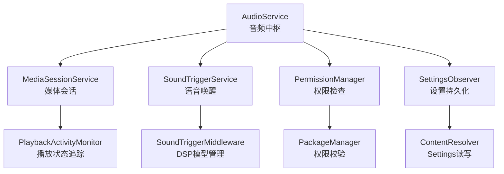
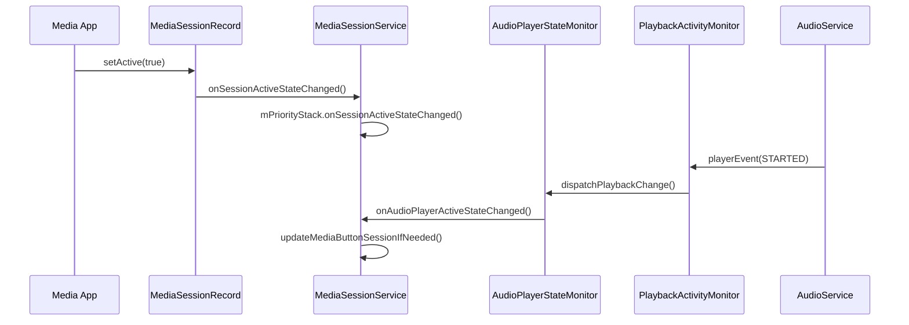
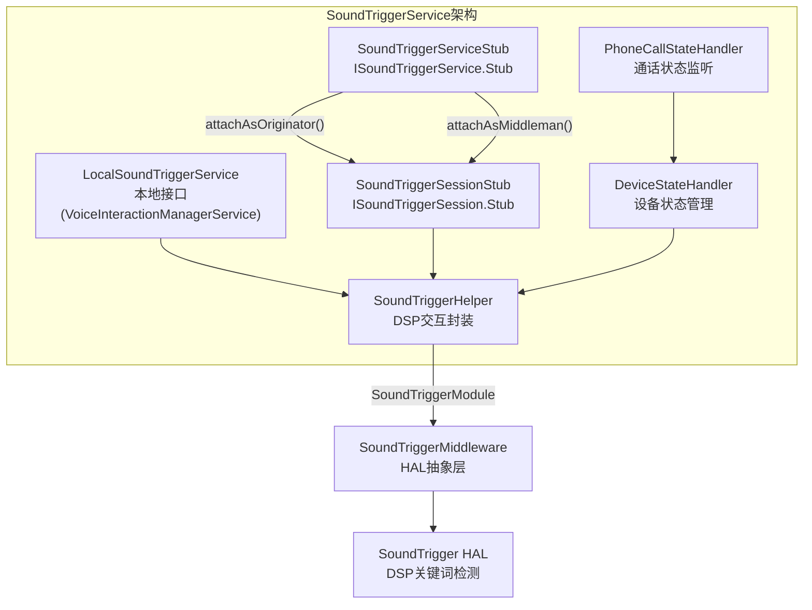
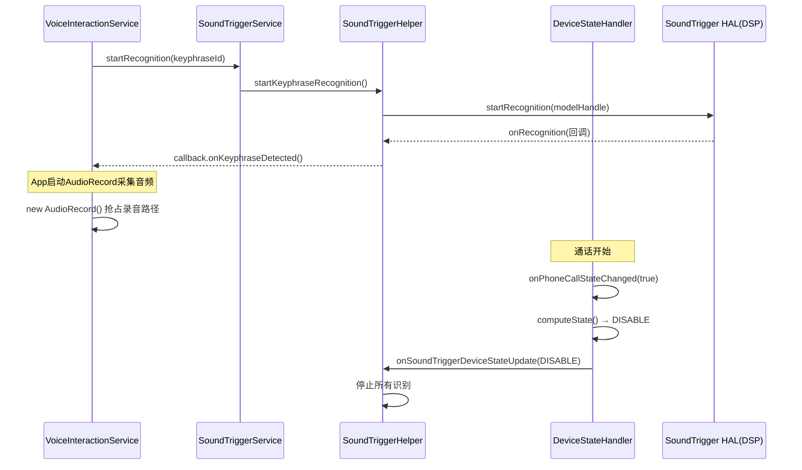
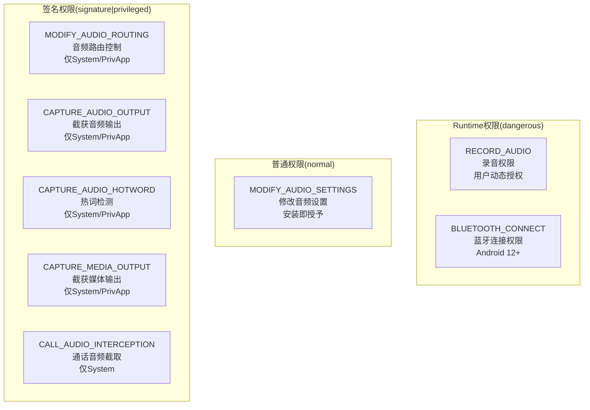
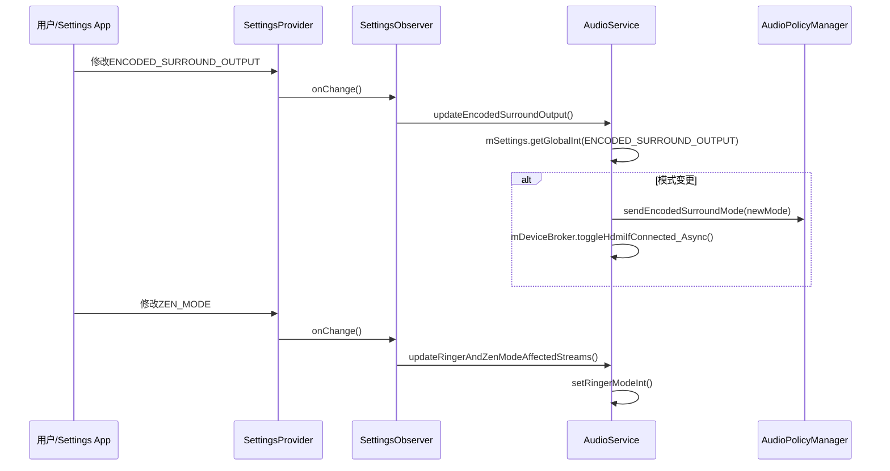

## 3.7 System Service — 关联系统服务

> [← 上一个](03_3.6_PlaybackActivityMonitor-播放状态追踪.md) | [返回目录](README.md) | [下一个 →](03_3.8_AudioMode状态机与通信设备路由.md)

---

AudioService并非孤立运行，它与多个系统服务深度耦合，共同构成完整的音频服务生态。本章解析四大关联模块：MediaSessionService（媒体会话管理）、SoundTriggerService（语音唤醒）、Permission管理（音频权限体系）、Settings联动（音频设置持久化）。



---

### 3.7.1 MediaSessionService — 媒体会话管理

#### 模块职责

[`MediaSessionService`](frameworks/base/services/core/java/com/android/server/media/MediaSessionService.java:106) 继承自 `SystemService` 并实现 `Monitor` 接口，负责管理所有应用的媒体会话（MediaSession），协调媒体按钮分发、音量控制路由和播放优先级栈。

#### 核心数据结构

| 字段 | 类型 | 说明 |
|------|------|------|
| [`mUserRecords`](frameworks/base/services/core/java/com/android/server/media/MediaSessionService.java:134) | `SparseArray<FullUserRecord>` | 按fullUserId索引的用户记录，每个用户持有独立的优先级栈 |
| [`mGlobalPrioritySession`](frameworks/base/services/core/java/com/android/server/media/MediaSessionService.java:150) | `MediaSessionRecord` | 全局优先级会话（如电话），优先于所有普通会话 |
| [`mCurrentFullUserRecord`](frameworks/base/services/core/java/com/android/server/media/MediaSessionService.java:149) | `FullUserRecord` | 当前前台用户记录 |
| [`mAudioPlayerStateMonitor`](frameworks/base/services/core/java/com/android/server/media/MediaSessionService.java:151) | `AudioPlayerStateMonitor` | 监听Audio系统播放状态变化，驱动MediaButton会话更新 |

#### 关键方法深度解析

**1. [`onStart()`](frameworks/base/services/core/java/com/android/server/media/MediaSessionService.java:191) — 服务启动入口**

```
onStart()
  ├─ publishBinderService(Context.MEDIA_SESSION_SERVICE, mSessionManagerImpl)
  ├─ Watchdog.getInstance().addMonitor(this)  // 死锁监控
  ├─ mAudioPlayerStateMonitor = AudioPlayerStateMonitor.getInstance(mContext)
  ├─ mAudioPlayerStateMonitor.registerListener(listener)  // 监听播放状态变化
  │    └─ 回调: user.mPriorityStack.updateMediaButtonSessionIfNeeded()
  ├─ updateUser()  // 初始化用户记录
  ├─ instantiateCustomProvider()  // OEM自定义策略
  └─ mRecordThread.start()  // 启动Session记录线程
```

核心逻辑：在 `onStart()` 中注册 [`AudioPlayerStateMonitor`](frameworks/base/services/core/java/com/android/server/media/AudioPlayerStateMonitor.java:42) 监听器，当 Audio 系统的 `AudioPlaybackConfiguration` 发生变化时，触发优先级栈更新。这是 MediaSessionService 与 AudioService 的关键桥接点。

**2. [`onSessionActiveStateChanged()`](frameworks/base/services/core/java/com/android/server/media/MediaSessionService.java:261) — 会话活跃状态变更**

```java
// MediaSessionService.java:261
void onSessionActiveStateChanged(MediaSessionRecordImpl record) {
    synchronized (mLock) {
        FullUserRecord user = getFullUserRecordLocked(record.getUserId());
        if (record.isSystemPriority()) {
            // 系统优先级会话（如电话）：直接通知addressed player变更
            user.pushAddressedPlayerChangedLocked();
        } else {
            // 普通会话：交由优先级栈处理
            user.mPriorityStack.onSessionActiveStateChanged(record);
        }
        mHandler.postSessionsChanged(record);  // 通知所有监听者
    }
}
```

参数说明：
- `record`：状态变更的会话记录，实现 `MediaSessionRecordImpl` 接口
- `isSystemPriority()`：判断是否为系统优先级会话（如电话铃声），此类会话不进入优先级栈，而是直接作为全局优先级处理

**3. [`createSessionInternal()`](frameworks/base/services/core/java/com/android/server/media/MediaSessionService.java:654) — 创建媒体会话**

```java
// MediaSessionService.java:654
private MediaSessionRecord createSessionInternal(int callerPid, int callerUid,
        int userId, String callerPackageName, ISessionCallback cb,
        String tag, Bundle sessionInfo) {
    synchronized (mLock) {
        // 1. OEM策略检查
        int policies = mCustomMediaSessionPolicyProvider
            .getSessionPoliciesForApplication(callerUid, callerPackageName);
        // 2. 会话数限制检查（每UID上限100）
        if (sessionCount >= SESSION_CREATION_LIMIT_PER_UID
                && !hasMediaControlPermission(callerPid, callerUid)) {
            throw new RuntimeException("Created too many sessions");
        }
        // 3. 创建MediaSessionRecord并加入优先级栈
        session = new MediaSessionRecord(callerPid, callerUid, userId, ...);
        user.mPriorityStack.addSession(session);
    }
}
```

#### MediaSessionRecord 核心字段

[`MediaSessionRecord`](frameworks/base/services/core/java/com/android/server/media/MediaSessionRecord.java:97) 实现了 `IBinder.DeathRecipient` 和 `MediaSessionRecordImpl`，是会话在服务端的完整表示：

| 字段 | 说明 |
|------|------|
| `mOwnerPid/mOwnerUid` | 会话所有者进程/UID |
| `mPlaybackState` | 当前播放状态，决定优先级 |
| `mVolumeType` | 音量控制类型：LOCAL(本地)或REMOTE(远程) |
| `mAudioAttrs` | 关联的AudioAttributes |
| `mFlags` | 会话标志位 |
| `ALWAYS_PRIORITY_STATES` | 快进/快退/跳曲等状态，始终提升优先级 |
| `TRANSITION_PRIORITY_STATES` | 缓冲/连接/播放状态，从非优先级转入时提升 |

#### 与AudioService的交互链路



[`AudioPlayerStateMonitor`](frameworks/base/services/core/java/com/android/server/media/AudioPlayerStateMonitor.java:42) 通过 `AudioManager.registerAudioPlaybackCallback()` 注册到 AudioService，在播放配置变化时将事件投递到 MediaSessionService 的处理线程，驱动 MediaButton 会话的自动切换。

---

### 3.7.2 SoundTriggerService — 语音唤醒

#### 模块职责

[`SoundTriggerService`](frameworks/base/services/voiceinteraction/java/com/android/server/soundtrigger/SoundTriggerService.java:140) 管理所有基于DSP的语音/声音模型识别，提供关键词检测（Hotword Detection）和通用声音识别能力。它与 Audio 系统共享录音路径，需处理与 AudioRecord 的互斥关系。

#### 核心架构



#### 关键方法深度解析

**1. [`onStart()`](frameworks/base/services/voiceinteraction/java/com/android/server/soundtrigger/SoundTriggerService.java:255) — 服务启动**

```java
// SoundTriggerService.java:255
public void onStart() {
    publishBinderService(Context.SOUND_TRIGGER_SERVICE, mServiceStub);
    publishLocalService(SoundTriggerInternal.class, mLocalSoundTriggerService);
}
```

双重接口发布：Binder服务面向第三方应用，LocalService面向同进程的 `VoiceInteractionManagerService`。

**2. [`onBootPhase()`](frameworks/base/services/voiceinteraction/java/com/android/server/soundtrigger/SoundTriggerService.java:261) — 启动阶段初始化**

```
onBootPhase(PHASE_THIRD_PARTY_APPS_CAN_START):
  ├─ mDbHelper = new SoundTriggerDbHelper(mContext)  // 初始化声纹模型数据库
  ├─ 注册PowerSaveMode监听 → mDeviceStateHandler.onPowerModeChanged()
  ├─ 创建PhoneCallStateHandler → 监听通话状态
  └─ mMiddlewareService = ISoundTriggerMiddlewareService.Stub.asInterface(...)
       // 连接SoundTriggerMiddleware服务
```

**3. [`SoundTriggerServiceStub.attachAsOriginator()`](frameworks/base/services/voiceinteraction/java/com/android/server/soundtrigger/SoundTriggerService.java:398) — 创建会话**

```java
// SoundTriggerService.java:398
public ISoundTriggerSession attachAsOriginator(Identity originatorIdentity,
        ModuleProperties moduleProperties, IBinder client) {
    int sessionId = mSessionIdCounter.getAndIncrement();
    try (SafeCloseable ignored = PermissionUtil.establishIdentityDirect(originatorIdentity)) {
        return new SoundTriggerSessionStub(client,
            newSoundTriggerHelper(moduleProperties, eventLogger), eventLogger);
    }
}
```

权限模型：使用 `PermissionUtil.establishIdentityDirect()` 建立调用者身份上下文，中间人模式使用 `establishIdentityIndirect()` + `SOUNDTRIGGER_DELEGATE_IDENTITY` 权限。

#### DeviceStateHandler — 设备状态机

[`DeviceStateHandler`](frameworks/base/services/voiceinteraction/java/com/android/server/soundtrigger/DeviceStateHandler.java:41) 管理SoundTrigger的运行状态，综合通话和省电模式计算最终状态：

```java
// DeviceStateHandler.java:49
public enum SoundTriggerDeviceState {
    DISABLE,   // 强制禁用所有SoundTrigger会话
    CRITICAL,  // 仅允许关键(critical)会话运行
    ENABLE     // 允许所有SoundTrigger会话
}
```

状态计算逻辑（[`computeState()`](frameworks/base/services/voiceinteraction/java/com/android/server/soundtrigger/DeviceStateHandler.java:183)）：
- **通话中** → `DISABLE`（DSP被电话音频路径占用，必须禁用）
- **省电模式 ALL_ENABLED** → `ENABLE`
- **省电模式 CRITICAL_ONLY** → `CRITICAL`
- **省电模式 ALL_DISABLED** → `DISABLE`

通话结束后的延迟通知机制：[`CALL_INACTIVE_MSG_DELAY_MS = 1000`](frameworks/base/services/voiceinteraction/java/com/android/server/soundtrigger/DeviceStateHandler.java:43)，避免短暂通话间隙导致DSP频繁切换。

#### 与Audio系统的互斥关系



**互斥关键点**：SoundTrigger使用DSP执行关键词检测，不占用CPU但占用录音硬件路径。当检测到关键词后，App需启动AudioRecord采集音频，此时DSP释放录音路径给AudioRecord。通话期间DSP被电话音频路径占用，SoundTrigger必须停止。

#### SoundModelStatTracker — 模型运行统计

[`SoundModelStatTracker`](frameworks/base/services/voiceinteraction/java/com/android/server/soundtrigger/SoundTriggerService.java:160) 追踪每个声纹模型的运行状态：

| 字段 | 说明 |
|------|------|
| `mStartCount` | 模型启动次数 |
| `mTotalTimeMsec` | 累计运行时长(ms) |
| `mLastStartTimestampMsec` | 最后启动时间戳 |
| `mIsStarted` | 当前是否运行中 |

---

### 3.7.3 Permission管理 — 音频权限体系

#### 模块职责

AudioService 内部实现了多层权限检查机制，涵盖普通应用、系统应用和特权应用的不同权限等级。权限检查分布在 AudioService、AudioPolicyService、SoundTriggerService 等多个组件中。

#### 权限层级架构



#### 关键权限检查方法

**1. [`checkAudioSettingsPermission()`](frameworks/base/services/core/java/com/android/server/audio/AudioService.java:7024) — MODIFY_AUDIO_SETTINGS检查**

```java
// AudioService.java:7024
boolean checkAudioSettingsPermission(String method) {
    if (callingOrSelfHasAudioSettingsPermission()) {
        return true;
    }
    Log.w(TAG, "Audio Settings Permission Denial: " + method
            + " from pid=" + Binder.getCallingPid()
            + ", uid=" + Binder.getCallingUid());
    return false;
}

// AudioService.java:7035
private boolean callingOrSelfHasAudioSettingsPermission() {
    return mContext.checkCallingOrSelfPermission(
        Manifest.permission.MODIFY_AUDIO_SETTINGS)
        == PackageManager.PERMISSION_GRANTED;
}
```

此方法保护的关键API包括：
- `setMicrophoneMute()` (line 5216)
- `setMode()` (line 5784)
- `setSpeakerphoneOn()` (line 6348)
- `setBluetoothScoOn()` / `setBluetoothA2dpOn()` (line 6386/6444)
- `startBluetoothSco()` / `stopBluetoothSco()` (line 6473/6541)

**2. [`callerHasPermission()`](frameworks/base/services/core/java/com/android/server/audio/AudioService.java:11710) — 通用权限检查**

```java
// AudioService.java:11710
private boolean callerHasPermission(String permission) {
    return mContext.checkCallingPermission(permission)
        == PackageManager.PERMISSION_GRANTED;
}
```

用于 AudioPolicy 和 AudioMix 相关操作，检查 `MODIFY_AUDIO_ROUTING`、`CAPTURE_AUDIO_OUTPUT`、`CAPTURE_MEDIA_OUTPUT`、`CALL_AUDIO_INTERCEPTION` 等签名级权限。

**3. MODIFY_AUDIO_ROUTING — 音频路由核心权限**

`MODIFY_AUDIO_ROUTING` 是Android音频系统最高权限之一，保护了以下关键操作：

| 保护的操作 | 行号 | 说明 |
|-----------|------|------|
| `setFocusRequestResult()` | 1928 | 焦点请求结果设置 |
| `setAudioPortConfig()` | 1943 | 音频端口配置 |
| `registerAudioPolicy()` | 4973 | 注册音频策略 |
| `adjustStreamVolume()` | 3397 | 精确音量调节 |
| `removeAudioPolicy()` | - | 注销音频策略 |
| `setPreferredMixerAttributes()` | 12018 | 设置首选混音属性 |

**4. [`checkUpdateForPolicy()`](frameworks/base/services/core/java/com/android/server/audio/AudioService.java:11810) — AudioPolicy权限双重检查**

```java
// AudioService.java:11810
private AudioPolicyProxy checkUpdateForPolicy(IAudioPolicyCallback pcb,
        String errorMsg) {
    // 1. 权限检查
    final boolean hasPermissionForPolicy =
        (PackageManager.PERMISSION_GRANTED == mContext.checkCallingPermission(
            android.Manifest.permission.MODIFY_AUDIO_ROUTING));
    if (!hasPermissionForPolicy) { return null; }
    // 2. 策略注册检查
    final AudioPolicyProxy app = mAudioPolicies.get(pcb.asBinder());
    if (app == null) { return null; }
    return app;
}
```

#### RECORD_AUDIO权限的UserRestriction机制

AudioService 通过 `UserManager.DISALLOW_RECORD_AUDIO` 实现用户级录音禁令：

```java
// AudioService.java:9601-9614
// 后台用户：禁止录音
UserManagerService.getInstance().setUserRestriction(
    UserManager.DISALLOW_RECORD_AUDIO, true, userId);
// 前台用户：允许录音
UserManagerService.getInstance().setUserRestriction(
    UserManager.DISALLOW_RECORD_AUDIO, false, userId);
```

后台用户切换时，AudioService 还会主动杀死持有 RECORD_AUDIO 权限的后台进程（[`killBackgroundUserProcessesWithRecordAudioPermission()`](frameworks/base/services/core/java/com/android/server/audio/AudioService.java:9599)），确保录音隐私安全。

#### SoundTrigger权限体系

SoundTriggerService 的权限检查更加精细：

| 权限 | 用途 | 检查方式 |
|------|------|---------|
| `SOUNDTRIGGER_DELEGATE_IDENTITY` | 中间人代理身份 | `PermissionUtil.establishIdentityIndirect()` |
| `MANAGE_SOUND_TRIGGER` | 管理SoundTrigger注入 | `PermissionChecker.checkCallingPermissionForPreflight()` |
| `RECORD_AUDIO` (AppOps) | 运行时录音操作检查 | `AppOpsManager.checkOpNoThrow(OPSTR_RECORD_AUDIO)` |

[`MyAppOpsListener`](frameworks/base/services/voiceinteraction/java/com/android/server/soundtrigger/SoundTriggerService.java:358) 监听 `OPSTR_RECORD_AUDIO` 操作模式变更，当用户撤销录音权限时，回调通知SoundTriggerHelper停止识别。

---

### 3.7.4 Settings联动 — 音频设置持久化

#### 模块职责

AudioService 通过 `ContentResolver` 和 `SettingsProvider` 持久化音频配置，在启动时读取、运行时监听变更，确保音频状态跨重启保持一致。

#### 持久化数据项总览

| Settings键 | 命名空间 | 说明 |
|------------|---------|------|
| `MODE_RINGER` | Global | 铃响模式(NORMAL/SILENT/VIBRATE) |
| `VOLUME_*[device]` | System | 各流类型/设备音量索引 |
| `MODE_RINGER_STREAMS_AFFECTED` | System | 铃响模式影响的流位掩码 |
| `MUTE_STREAMS_AFFECTED` | System | 静音影响的流位掩码 |
| `MASTER_MONO` | System | 单声道开关 |
| `MASTER_BALANCE` | System | 左右声道平衡 |
| `ENCODED_SURROUND_OUTPUT` | Global | 环绕声输出模式(AUTO/NEVER/ALWAYS/MANUAL) |
| `ENCODED_SURROUND_OUTPUT_ENABLED_FORMATS` | Global | 手动启用的环绕声格式 |
| `DOCK_AUDIO_MEDIA_ENABLED` | Global | 底座音频媒体启用 |
| `ZEN_MODE` | Global | 勿扰模式状态 |
| `ZEN_MODE_CONFIG_ETAG` | Global | 勿扰配置版本号 |
| `VOICE_INTERACTION_SERVICE` | Secure | 语音交互服务组件名 |
| `SOUND_EFFECTS_ENABLED` | System | 触摸音效开关 |
| `VOLUME_HUSH_GESTURE` | Secure | 静音手势设置 |
| `SPATIAL_AUDIO_ENABLED` | Secure | 空间音频开关 |

#### 关键方法深度解析

**1. [`readPersistedSettings()`](frameworks/base/services/core/java/com/android/server/audio/AudioService.java:2655) — 启动时读取持久化配置**

```java
// AudioService.java:2655
private void readPersistedSettings() {
    if (!mSystemServer.isPrivileged()) { return; }  // 非特权进程跳过
    final ContentResolver cr = mContentResolver;

    // 1. 读取铃响模式并校验
    int ringerModeFromSettings = mSettings.getGlobalInt(
        cr, Settings.Global.MODE_RINGER, AudioManager.RINGER_MODE_NORMAL);
    int ringerMode = ringerModeFromSettings;
    if (!isValidRingerMode(ringerMode)) {
        ringerMode = AudioManager.RINGER_MODE_NORMAL;  // 非法值回退
    }
    if ((ringerMode == RINGER_MODE_VIBRATE) && !mHasVibrator) {
        ringerMode = RINGER_MODE_SILENT;  // 无振动器回退
    }

    // 2. 同步更新内部状态
    synchronized(mSettingsLock) {
        mRingerMode = ringerMode;
        updateRingerAndZenModeAffectedStreams();
        readDockAudioSettings(cr);
        sendEncodedSurroundMode(cr, "readPersistedSettings");
        updateAssistantUIdLocked(/* forceUpdate= */ true);
    }
}
```

调用时机：AudioService构造函数中 `mStreamVolumeAlias[]` 初始化之后立即调用（line 1218），确保后续所有音量操作基于正确的持久化值。

**2. [`persistVolumeGroup()`](frameworks/base/services/core/java/com/android/server/audio/AudioService.java:8085) — 音量组持久化**

```java
// AudioService.java:8085
private void persistVolumeGroup(int device) {
    // 已有公共流类型支持的组无需冗余持久化
    if (mUseFixedVolume || mHasValidStreamType) { return; }
    boolean success = mSettings.putSystemIntForUser(mContentResolver,
        getSettingNameForDevice(device),   // 键格式: "volume_group_<name>_<device>"
        getIndex(device),
        isMusic() ? UserHandle.USER_SYSTEM : UserHandle.USER_CURRENT);
}
```

音量持久化策略：
- **公共流类型**（MUSIC/RING/ALARM等）：由VolumeStreamState通过 `System.VOLUME_*` 键持久化
- **纯VolumeGroup**（无公共流类型对应）：通过 `persistVolumeGroup()` 持久化
- **固定音量设备**（`mUseFixedVolume`）：不持久化，始终最大
- **MUSIC流**：使用 `USER_SYSTEM` 跨用户共享，其他流使用 `USER_CURRENT`

**3. [`SettingsObserver`](frameworks/base/services/core/java/com/android/server/audio/AudioService.java:9388) — 运行时设置变更监听**

```java
// AudioService.java:9388
private class SettingsObserver extends ContentObserver {
    SettingsObserver() {
        // 注册监听的Settings键
        mContentResolver.registerContentObserver(
            Settings.Global.getUriFor(Settings.Global.ZEN_MODE), false, this);
        mContentResolver.registerContentObserver(
            Settings.Global.getUriFor(Settings.Global.ENCODED_SURROUND_OUTPUT), false, this);
        mContentResolver.registerContentObserver(
            Settings.System.getUriFor(Settings.System.MASTER_MONO), false, this);
        mContentResolver.registerContentObserver(
            Settings.System.getUriFor(Settings.System.MASTER_BALANCE), false, this);
        mContentResolver.registerContentObserver(
            Settings.Secure.getUriFor(Settings.Secure.VOICE_INTERACTION_SERVICE), false, this);
        // ... 更多注册
    }

    @Override
    public void onChange(boolean selfChange) {
        synchronized (mSettingsLock) {
            updateRingerAndZenModeAffectedStreams();
            setRingerModeInt(getRingerModeInternal(), false);
            readDockAudioSettings(mContentResolver);
            updateMasterMono(mContentResolver);
            updateMasterBalance(mContentResolver);
            updateEncodedSurroundOutput();     // 环绕声模式变更
            updateAssistantUIdLocked(false);   // 助手UID更新
        }
    }
}
```

#### 设置变更处理时序



#### 环绕声输出状态机

[`ENCODED_SURROUND_OUTPUT`](frameworks/base/services/core/java/com/android/server/audio/AudioService.java:2337) 的四种模式及转换：

| 模式 | 值 | 行为 |
|------|---|------|
| `AUTO` | 0 | 自动检测支持环绕声的设备 |
| `NEVER` | 1 | 永不输出环绕声（仅PCM） |
| `ALWAYS` | 2 | 始终输出环绕声 |
| `MANUAL` | 3 | 手动选择启用的格式(配合ENABLED_FORMATS) |

`MANUAL` 模式下通过 [`ENCODED_SURROUND_OUTPUT_ENABLED_FORMATS`](frameworks/base/services/core/java/com/android/server/audio/AudioService.java:2449) 精确控制哪些环绕声格式被启用。

#### 音量恢复机制

当设备重新连接时，AudioService 从 Settings 中恢复该设备的上次音量：

1. VolumeStreamState 维护 `mIndexMap<SparseIntArray>`，以设备类型为键存储音量索引
2. 音量变更时通过 `persistVolume()` / `persistVolumeGroup()` 写入Settings
3. 设备连接时通过 `readSettings()` 读取历史音量并应用

关键持久化路径：
```
音量变更 → AudioHandler.MSG_PERSIST_VOLUME → persistVolume()
                                              → Settings.System.putInt(VOLUME_<stream>_<device>)
设备连接 → AudioDeviceBroker → VolumeStreamState.setIndex()
                              → readSettings() → Settings.System.getInt()
```

---

> [← 上一个](03_3.6_PlaybackActivityMonitor-播放状态追踪.md) | [返回目录](README.md) | [下一个 →](03_3.8_AudioMode状态机与通信设备路由.md)