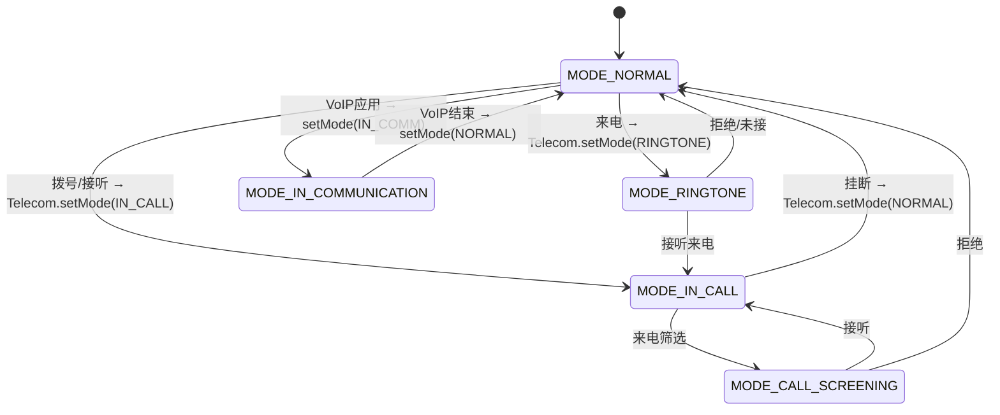
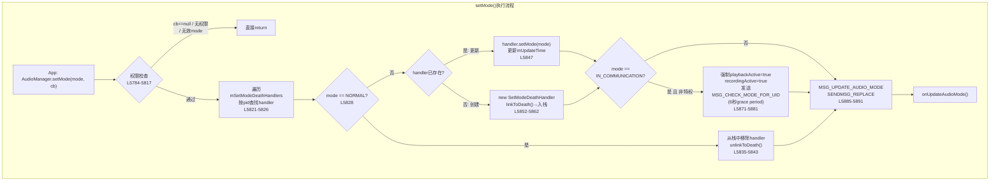
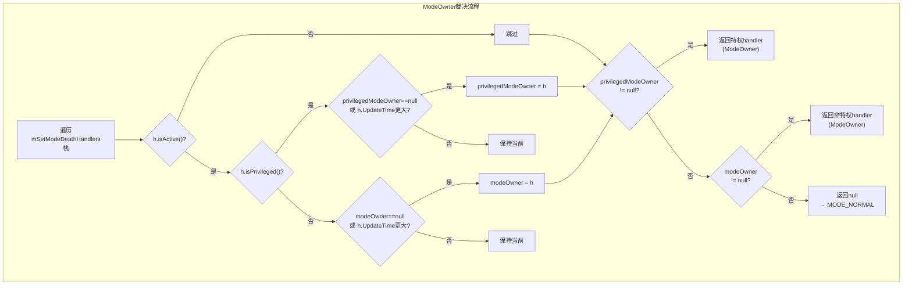
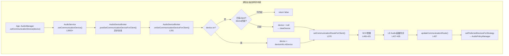
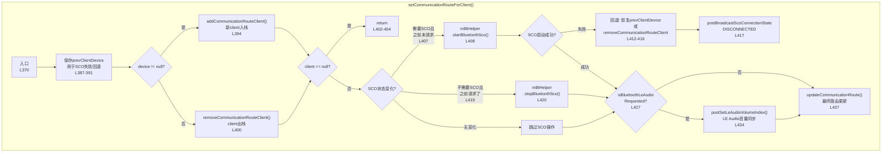
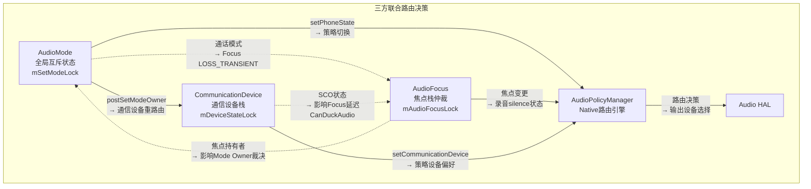
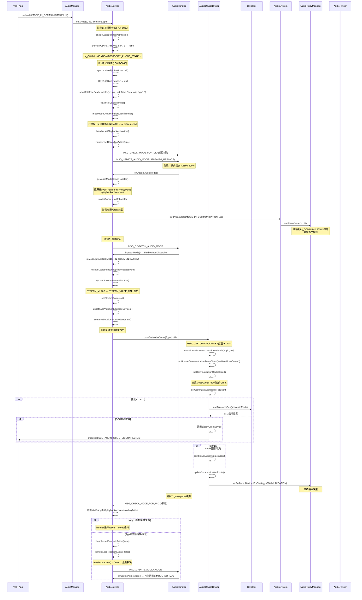

## 3.8 AudioMode状态机与通信设备路由

> [← 上一个](03_3.7_System_Service-关联系统服务.md) | [返回目录](README.md) | [下一个 →](03_3.9_录音并发仲裁机制-Concurrent_Capture.md)

---

### 3.8.1 AudioMode定义与6种模式详解

AudioMode是Android音频系统的**第四大核心状态机**（与Focus/Volume/Device并列），决定了当前音频系统的全局工作模式，直接影响路由策略、音量别名映射和焦点行为。AudioMode的本质是一个**全局互斥状态**——同一时刻整个系统只有一个Mode生效，通过栈模型仲裁多个竞争者。

**6种AudioMode定义**（源码: [`AudioSystem.java`](frameworks/base/media/java/android/media/AudioSystem.java)）

| 模式 | 值 | 触发场景 | 路由影响 | 权限要求 |
|------|---|---------|---------|---------|
| `MODE_NORMAL` | 0 | 默认/通话结束 | 媒体路由(扬声器/蓝牙A2DP) | 无 |
| `MODE_RINGTONE` | 1 | 来电振铃 | 铃声路由(扬声器/蓝牙SCO) | MODIFY_PHONE_STATE |
| `MODE_IN_CALL` | 2 | 语音通话 | 通话路由(听筒/蓝牙SCO) | MODIFY_PHONE_STATE |
| `MODE_IN_COMMUNICATION` | 3 | VoIP/视频通话 | 通信路由(耳机/蓝牙SCO/扬声器) | 无(非特权可设) |
| `MODE_CALL_SCREENING` | 4 | 来电筛选(Android 12+) | 通话路由 | MODIFY_PHONE_STATE + mIsCallScreeningModeSupported |
| `MODE_CALL_REDIRECT` | 5 | 通话重定向(Android 12+) | 通话路由 | MODIFY_PHONE_STATE |
| `MODE_COMMUNICATION_REDIRECT` | 6 | 通信重定向(Android 12+) | 通信路由 | MODIFY_PHONE_STATE |

> **注意**: `NUM_MODES = 7`，模式值范围 [0, 6]。`MODE_CURRENT = -1` 是特殊值，表示"保持当前模式不变"。

**权限分层设计**:

```
┌──────────────────────────────────────────────────────┐
│ 无权限要求                                           │
│   MODE_NORMAL / MODE_IN_COMMUNICATION               │
├──────────────────────────────────────────────────────┤
│ MODIFY_PHONE_STATE                                  │
│   MODE_IN_CALL / MODE_CALL_REDIRECT                 │
│   MODE_COMMUNICATION_REDIRECT                       │
├──────────────────────────────────────────────────────┤
│ MODIFY_PHONE_STATE + mIsCallScreeningModeSupported   │
│   MODE_CALL_SCREENING                               │
└──────────────────────────────────────────────────────┘
```

这种分层确保了电话App（持有`MODIFY_PHONE_STATE`）始终优先于VoIP App，而来电筛选还需要系统属性支持。



**AudioMode对音频系统的全局影响**:

| 影响维度 | MODE_NORMAL | MODE_IN_CALL / MODE_RINGTONE | MODE_IN_COMMUNICATION |
|---------|-------------|------------------------------|----------------------|
| 音量别名 | STREAM_MUSIC→MUSIC | STREAM_MUSIC→RING/VOICE | STREAM_MUSIC→VOICE |
| 默认路由 | 扬声器/A2DP | 听筒/SCO | 上次通信设备 |
| Focus策略 | 标准焦点 | 通话焦点优先 | VoIP焦点优先 |
| SCO策略 | 不启动 | 按需启动SCO | 按需启动SCO |
| 录音静音 | 标准APP_STATE | 通话App→TOP | VoIP App→TOP |

---

### 3.8.2 setMode()执行流程深度解析

[`AudioService.setMode()`](frameworks/base/services/core/java/com/android/server/audio/AudioService.java:5777) 是AudioMode状态机的唯一入口，所有模式变更都通过此方法执行。该方法在`mSetModeLock`保护下完成栈操作和模式裁决。



#### 阶段一：参数校验与权限检查 (L5777-5817)

```java
// L5777-5798: 基础校验
public void setMode(int mode, IBinder cb, String callingPackage) {
    int pid = Binder.getCallingPid();
    int uid = Binder.getCallingUid();
    
    // 1. checkAudioSettingsPermission - 所有setMode调用都需要
    if (!checkAudioSettingsPermission("setMode()")) { return; }
    
    // 2. cb不能为null - 需要binder来监听客户端死亡
    if (cb == null) { return; }
    
    // 3. mode范围检查: [MODE_CURRENT(-1), NUM_MODES(7))
    if (mode < AudioSystem.MODE_CURRENT || mode >= AudioSystem.NUM_MODES) { return; }
    
    // 4. MODE_CURRENT转换为当前实际mode
    if (mode == AudioSystem.MODE_CURRENT) { mode = getMode(); }
```

**三层权限校验** (L5800-5817):

| 校验层 | 条件 | 权限 | 行号 |
|-------|------|------|------|
| Call Screening支持 | `mode == MODE_CALL_SCREENING` | `mIsCallScreeningModeSupported` 系统属性 | L5800 |
| 电话模式保护 | `MODE_IN_CALL / MODE_CALL_REDIRECT / MODE_COMMUNICATION_REDIRECT` | `MODIFY_PHONE_STATE` | L5809 |
| 基础权限 | 所有模式 | `checkAudioSettingsPermission` (MODIFY_AUDIO_SETTINGS) | L5784 |

#### 阶段二：栈操作 (L5819-5883)

在`mSetModeLock`保护下执行栈操作，核心逻辑是根据mode值和handler存在状态决定操作类型：

**MODE_NORMAL处理** (L5828-5844):
- 若pid对应的handler存在 → 从栈中移除 → `unlinkToDeath()`解除死亡监听
- 若handler的mode是`MODE_IN_COMMUNICATION`且非特权 → 取消`MSG_CHECK_MODE_FOR_UID`定时消息
- 这确保了VoIP App退出时不会留下定时检查消息

**非NORMAL模式处理** (L5845-5882):
- handler已存在 → `handler.setMode(mode)`更新模式和`mUpdateTime`时间戳
- handler不存在 → 创建新的`SetModeDeathHandler`，`linkToDeath()`注册死亡监听，加入栈

**MODE_IN_COMMUNICATION特殊处理** (L5867-5882):
- 仅对**非特权App**执行（特权App不需要grace period）
- 强制`playbackActive = true` + `recordingActive = true`，使handler在grace period内保持active
- 发送`MSG_CHECK_MODE_FOR_UID`消息，延迟`CHECK_MODE_FOR_UID_PERIOD_MS`(6000ms)后检查真实活跃状态
- **设计意图**: 避免VoIP App在调用`setMode()`和实际开始播放/录音之间因时间差导致模式被抢占

#### 阶段三：触发模式更新 (L5885-5892)

```java
sendMsg(mAudioHandler,
        MSG_UPDATE_AUDIO_MODE,    // 消息类型
        SENDMSG_REPLACE,          // 替换模式(只保留最新)
        mode,                     // arg1: 请求的mode
        pid,                      // arg2: 请求者pid
        callingPackage,           // obj: 调用包名
        0);                       // delay: 无延迟
```

> **关键**: 使用`SENDMSG_REPLACE`而非`SENDMSG_QUEUE`，确保快速连续的setMode调用只触发一次`onUpdateAudioMode()`，避免中间状态的无效处理。

---

### 3.8.3 SetModeDeathHandler栈模型与ModeOwner裁决

AudioMode采用**栈模型**管理，与Focus栈类似但机制不同：特权App始终优先于非特权App，且非特权App需要证明自己"活跃"才能参与竞争。

#### SetModeDeathHandler核心数据结构

[`SetModeDeathHandler`](frameworks/base/services/core/java/com/android/server/audio/AudioService.java:5602) 实现了`IBinder.DeathRecipient`接口，每个请求过非NORMAL模式的进程在栈中对应一个handler实例。

```java
// L5602-5611: 核心字段
private class SetModeDeathHandler implements IBinder.DeathRecipient {
    private final IBinder mCb;           // 客户端binder，用于死亡监听
    private final int mPid;              // 客户端进程ID
    private final int mUid;              // 客户端用户ID
    private final boolean mIsPrivileged; // 是否持有MODIFY_PHONE_STATE权限
    private final String mPackage;       // 调用者包名
    private int mMode;                   // 当前请求的AudioMode
    private long mUpdateTime;            // 最后更新时间(用于裁决优先级)
    private boolean mPlaybackActive;     // 播放是否活跃(非特权IN_COMMUNICATION使用)
    private boolean mRecordingActive;    // 录音是否活跃(非特权IN_COMMUNICATION使用)
}
```

**字段说明**:

| 字段 | 类型 | 含义 | 裁决作用 |
|------|------|------|---------|
| `mIsPrivileged` | boolean | 构造时确定，持有`MODIFY_PHONE_STATE` | 特权handler在裁决中始终优先 |
| `mUpdateTime` | long | `System.currentTimeMillis()` | 同优先级下，时间最新的胜出 |
| `mPlaybackActive` | boolean | 由`MSG_CHECK_MODE_FOR_UID`更新 | 非特权IN_COMMUNICATION的active判定条件 |
| `mRecordingActive` | boolean | 由`MSG_CHECK_MODE_FOR_UID`更新 | 非特权IN_COMMUNICATION的active判定条件 |

#### isActive()裁决规则 (L5696-5702)

```java
// L5696-5702: active判定 - 决定handler是否参与ModeOwner竞争
public boolean isActive() {
    return mIsPrivileged                                          // 规则1: 特权App始终active
            || ((mMode == AudioSystem.MODE_IN_COMMUNICATION)      // 规则2: IN_COMMUNICATION需playback或recording
                && (mRecordingActive || mPlaybackActive))
            || mMode == AudioSystem.MODE_RINGTONE                 // 规则3: RINGTONE始终active
            || mMode == AudioSystem.MODE_CALL_SCREENING;          // 规则4: CALL_SCREENING始终active
}
```

**active判定决策树**:

```
isActive()?
├── mIsPrivileged == true? → YES (特权App: Telecom/InCallUI)
├── mMode == MODE_IN_COMMUNICATION?
│   ├── playbackActive || recordingActive? → YES
│   └── 否 → NO (VoIP App在grace period后无活跃操作则失活)
├── mMode == MODE_RINGTONE? → YES (振铃始终active)
├── mMode == MODE_CALL_SCREENING? → YES (来电筛选始终active)
└── 其他 → NO (不应到达此分支,因为其他模式需要特权)
```

> **注意**: `MODE_CALL_REDIRECT`和`MODE_COMMUNICATION_REDIRECT`需要`MODIFY_PHONE_STATE`权限，因此一定走特权分支。

#### getAudioModeOwnerHandler()裁决算法 (L5724-5747)

[`getAudioModeOwnerHandler()`](frameworks/base/services/core/java/com/android/server/audio/AudioService.java:5724) 遍历整个栈，选出当前ModeOwner。算法分两轮：

```java
// L5724-5747: ModeOwner裁决算法
private SetModeDeathHandler getAudioModeOwnerHandler() {
    SetModeDeathHandler modeOwner = null;           // 非特权候选
    SetModeDeathHandler privilegedModeOwner = null;  // 特权候选
    for (SetModeDeathHandler h : mSetModeDeathHandlers) {
        if (h.isActive()) {
            if (h.isPrivileged()) {
                // 特权: 取mUpdateTime最新的
                if (privilegedModeOwner == null
                        || h.getUpdateTime() > privilegedModeOwner.getUpdateTime()) {
                    privilegedModeOwner = h;
                }
            } else {
                // 非特权: 取mUpdateTime最新的
                if (modeOwner == null
                        || h.getUpdateTime() > modeOwner.getUpdateTime()) {
                    modeOwner = h;
                }
            }
        }
    }
    return privilegedModeOwner != null ? privilegedModeOwner : modeOwner;
}
```

**裁决优先级**:

```
1. 特权handler(最新UpdateTime) > 2. 非特权handler(最新UpdateTime) > 3. null(MODE_NORMAL)
```



#### 典型裁决场景

| 场景 | 栈内容 | ModeOwner | 生效Mode |
|------|--------|-----------|---------|
| 仅VoIP App活跃 | [VoIP(IN_COMM, active)] | VoIP handler | MODE_IN_COMMUNICATION |
| VoIP + 来电 | [VoIP(IN_COMM), Telecom(IN_CALL, privileged)] | Telecom handler | MODE_IN_CALL |
| VoIP失活 + 振铃 | [VoIP(IN_COMM, inactive), Telecom(RINGTONE, privileged)] | Telecom handler | MODE_RINGTONE |
| VoIP + VoIP(后入栈) | [VoIP1(IN_COMM, active), VoIP2(IN_COMM, active)] | VoIP2(UpdateTime更新) | MODE_IN_COMMUNICATION |
| 所有App退出NORMAL | [] | null | MODE_NORMAL |

#### binderDied()进程死亡处理 (L5624-5641)

当持有AudioMode的App进程死亡时，`binderDied()`回调被触发：

```java
// L5624-5641
public void binderDied() {
    synchronized (mDeviceBroker.mSetModeLock) {
        int index = mSetModeDeathHandlers.indexOf(this);
        if (index < 0) {
            // 已被其他路径移除
            return;
        }
        mSetModeDeathHandlers.remove(index);
        // 发送MODE_CURRENT让onUpdateAudioMode()重新裁决
        sendMsg(mAudioHandler, MSG_UPDATE_AUDIO_MODE, SENDMSG_QUEUE,
                AudioSystem.MODE_CURRENT, android.os.Process.myPid(),
                mContext.getPackageName(), 0);
    }
}
```

> **注意**: `binderDied()`发送的是`SENDMSG_QUEUE`（排队执行），而`setMode()`发送的是`SENDMSG_REPLACE`（替换去重）。这是因为进程死亡必须被处理，不能被丢弃。

---

### 3.8.4 onUpdateAudioMode()副作用链完整解析

[`onUpdateAudioMode()`](frameworks/base/services/core/java/com/android/server/audio/AudioService.java:5896) 是AudioMode变更的核心执行器，负责将裁决结果传播到整个音频系统。

#### 主执行流程 (L5896-5960)

```java
// L5896-5914: 获取ModeOwner裁决结果
void onUpdateAudioMode(int requestedMode, int requesterPid, String requesterPackage,
                       boolean force) {
    int mode = AudioSystem.MODE_NORMAL;
    int uid = 0;
    int pid = 0;
    SetModeDeathHandler currentModeHandler = getAudioModeOwnerHandler();
    if (currentModeHandler != null) {
        mode = currentModeHandler.getMode();
        uid = currentModeHandler.getUid();
        pid = currentModeHandler.getPid();
    }
    // 仅当mode发生变化或force=true时才执行
    if (mode != mMode.get() || force) {
```

#### 副作用链详解

```mermaid
flowchart TB
    subgraph "onUpdateAudioMode()副作用链"
        GET_OWNER["1. getAudioModeOwnerHandler()<br>裁决ModeOwner<br>L5904"]
        GET_OWNER --> SET_PHONE["2. AudioSystem.setPhoneState(mode, uid)<br>通知Native层<br>L5918"]
        SET_PHONE --> CHECK_STATUS{"status ==<br>AUDIO_STATUS_OK?"}
        CHECK_STATUS -->|"失败"| LOG_FAIL["Log.w: failed to set mode<br>L5958"]
        CHECK_STATUS -->|"成功"| DISPATCH["3a. MSG_DISPATCH_AUDIO_MODE<br>→ dispatchMode()通知<br>IAudioModeDispatcher<br>L5926"]
        DISPATCH --> CACHE["3b. mMode.getAndSet(mode)<br>更新Java层缓存<br>L5928"]
        CACHE --> LOG["3c. mModeLogger.enqueue<br>PhoneStateEvent记录<br>L5930"]
        LOG --> VOL_ALIAS["4. updateStreamVolumeAlias(true)<br>音量别名重映射<br>L5947"]
        VOL_ALIAS --> VOL_INT["5. setStreamVolumeInt()<br>应用新音量<br>L5944"]
        VOL_INT --> ABS_VOL["6. updateAbsVolumeMultiModeDevices()<br>蓝牙绝对音量更新<br>L5950"]
        ABS_VOL --> LE_VOL["7. setLeAudioVolumeOnModeUpdate()<br>LE Audio音量同步<br>L5952"]
        LE_VOL --> MODE_OWNER["8. mDeviceBroker.postSetModeOwner()<br>通知DeviceBroker<br>→ 触发通信设备重路由<br>L5956"]
    end
```



**副作用详细说明**:

| 步骤 | 方法 | 行号 | 作用 | 影响范围 |
|------|------|------|------|---------|
| 1 | `getAudioModeOwnerHandler()` | L5904 | 栈遍历裁决ModeOwner | 确定生效mode/uid/pid |
| 2 | `AudioSystem.setPhoneState(mode, uid)` | L5918 | 通知AudioPolicyManager模式变更 | Native路由策略切换 |
| 3a | `MSG_DISPATCH_AUDIO_MODE` | L5926 | 通过`dispatchMode()`通知所有`IAudioModeDispatcher` | Telecom等监听方 |
| 3b | `mMode.getAndSet(mode)` | L5928 | 原子更新Java层mode缓存 | 后续getMode()查询 |
| 3c | `mModeLogger.enqueue()` | L5930 | 记录PhoneStateEvent用于dumpsys调试 | 音频调试日志 |
| 4 | `updateStreamVolumeAlias(true)` | L5947 | 重新映射音量流别名(如MUSIC→VOICE) | 音量行为变更 |
| 5 | `setStreamVolumeInt()` | L5944 | 应用新音量到设备 | 实际音量输出 |
| 6 | `updateAbsVolumeMultiModeDevices()` | L5950 | 更新蓝牙绝对音量 | A2DP/LE Audio |
| 7 | `setLeAudioVolumeOnModeUpdate()` | L5952 | LE Audio模式切换后音量同步 | BLE Headset |
| 8 | `postSetModeOwner(mode, pid, uid)` | L5956 | 通知DeviceBroker新的ModeOwner | 通信设备重路由 |

#### postSetModeOwner到通信设备重路由的传播路径

```
AudioService.onUpdateAudioMode()
  → mDeviceBroker.postSetModeOwner(mode, pid, uid)          [异步消息]
    → AudioDeviceBroker.MSG_I_SET_MODE_OWNER处理             [L1714]
      → mAudioModeOwner = new AudioModeInfo(mode, pid, uid)  [L1717]
      → onUpdateCommunicationRouteClient("setNewModeOwner")   [L1719]
        → updateCommunicationRoute()                          [L2238]
        → topCommunicationRouteClient() → 重新选择通信设备     [L2239]
        → setCommunicationRouteForClient()                    [L2245]
```

> **关键**: `postSetModeOwner`使用`SENDMSG_REPLACE`，如果短时间内有多次ModeOwner变更，只处理最后一次。此外，`MODE_RINGTONE`时不触发`onUpdateCommunicationRouteClient`(L5718)，因为振铃期间不需要改变通信设备。

#### 音量别名重映射机制

AudioMode变更会触发音量别名重映射，这是通过`updateStreamVolumeAlias(true)`实现的。不同模式下，相同StreamType映射到不同的VolumeAlias：

| StreamType | MODE_NORMAL | MODE_IN_CALL | MODE_IN_COMMUNICATION | MODE_RINGTONE |
|-----------|-------------|--------------|----------------------|---------------|
| STREAM_MUSIC | STREAM_MUSIC | STREAM_VOICE_CALL | STREAM_VOICE_CALL | STREAM_RING |
| STREAM_RING | STREAM_RING | STREAM_VOICE_CALL | STREAM_VOICE_CALL | STREAM_RING |
| STREAM_VOICE_CALL | STREAM_VOICE_CALL | STREAM_VOICE_CALL | STREAM_VOICE_CALL | STREAM_VOICE_CALL |

这意味着在通话模式下，用户按音量键调节"媒体音量"实际上调节的是"通话音量"，符合用户直觉。

---

### 3.8.5 CommunicationDevice通信设备选择机制

Android 12引入[`AudioManager.setCommunicationDevice()`](frameworks/base/media/java/android/media/AudioManager.java)替代已废弃的`setSpeakerphoneOn()/setBluetoothScoOn()`，提供更精确的通信设备控制。通信设备选择与AudioMode紧密耦合——ModeOwner决定了哪个进程的设备请求优先。

#### 通信设备API演进

| API版本 | 方法 | 废弃状态 | 问题 |
|---------|------|---------|------|
| API 1+ | `setSpeakerphoneOn(true)` | API 31废弃 | 全局切换，无法区分进程 |
| API 1+ | `setBluetoothScoOn(true)` | API 31废弃 | 全局切换，SCO管理不精确 |
| API 31+ | `setCommunicationDevice(device)` | **当前推荐** | 进程级控制，支持SCO/LE Audio/USB |

#### setCommunicationDevice()调用链



#### 合法通信设备类型

[`VALID_COMMUNICATION_DEVICE_TYPES`](frameworks/base/services/core/java/com/android/server/audio/AudioDeviceBroker.java:477) 定义了可作为通信设备的设备类型：

| 设备类型 | 常量 | 典型场景 |
|---------|------|---------|
| TYPE_BUILTIN_SPEAKER | 2 | 免提通话 |
| TYPE_BUILTIN_EARPIECE | 1 | 默认通话听筒 |
| TYPE_BLUETOOTH_SCO | 7 | 蓝牙耳机通话 |
| TYPE_BLE_HEADSET | 26 | LE Audio耳机通话 |
| TYPE_BLE_SPEAKER | 27 | LE Audio扬声器通话 |
| TYPE_WIRED_HEADSET | 3 | 有线耳机通话 |
| TYPE_WIRED_HEADPHONES | 4 | 有线耳机(无麦克风) |
| TYPE_USB_HEADSET | 22 | USB耳机通话 |
| TYPE_USB_DEVICE | 23 | USB声卡 |
| TYPE_HEARING_AID | 23 | 助听器 |
| TYPE_LINE_ANALOG | 25 | 模拟线路输出 |
| TYPE_HDMI | 9 | HDMI音频输出 |
| TYPE_AUX_LINE | 19 | AUX线路输出 |

---

### 3.8.6 CommunicationRouteClient栈管理

[`CommunicationRouteClient`](frameworks/base/services/core/java/com/android/server/audio/AudioDeviceBroker.java:2102) 是通信设备路由的栈模型实现，与SetModeDeathHandler栈并行管理。

#### 数据结构

```java
// L2102-2111: CommunicationRouteClient核心字段
private class CommunicationRouteClient implements IBinder.DeathRecipient {
    private final IBinder mCb;                    // 客户端binder
    private final int mPid;                       // 客户端进程ID
    private AudioDeviceAttributes mDevice;         // 请求的通信设备
}
```

#### 栈操作方法

**addCommunicationRouteClient** (L2285-2295):
```java
private CommunicationRouteClient addCommunicationRouteClient(
        IBinder cb, int pid, AudioDeviceAttributes device) {
    // 先移除同binder的旧client（保证唯一性）
    removeCommunicationRouteClient(cb, true);
    CommunicationRouteClient client = new CommunicationRouteClient(cb, pid, device);
    if (client.registerDeathRecipient()) {
        mCommunicationRouteClients.add(0, client);  // 新client插入栈顶(index 0)
        return client;
    }
    return null;  // linkToDeath失败 → 进程已死亡
}
```

**removeCommunicationRouteClient** (L2270-2282):
```java
private CommunicationRouteClient removeCommunicationRouteClient(
        IBinder cb, boolean unregister) {
    for (CommunicationRouteClient cl : mCommunicationRouteClients) {
        if (cl.getBinder() == cb) {
            if (unregister) {
                cl.unregisterDeathRecipient();  // unlinkToDeath
            }
            mCommunicationRouteClients.remove(cl);
            return cl;
        }
    }
    return null;
}
```

#### topCommunicationRouteClient()优先级裁决 (L448-458)

```java
private CommunicationRouteClient topCommunicationRouteClient() {
    // 优先级1: ModeOwner PID对应的Client
    for (CommunicationRouteClient crc : mCommunicationRouteClients) {
        if (crc.getPid() == mAudioModeOwner.mPid) {
            return crc;
        }
    }
    // 优先级2: 无ModeOwner时，栈顶(index 0)Client
    if (!mCommunicationRouteClients.isEmpty() && mAudioModeOwner.mPid == 0) {
        return mCommunicationRouteClients.get(0);
    }
    // 优先级3: 无Client
    return null;
}
```

**CommunicationRouteClient栈 vs SetModeDeathHandler栈对比**:

| 维度 | SetModeDeathHandler栈 | CommunicationRouteClient栈 |
|------|----------------------|--------------------------|
| 管理对象 | AudioMode请求 | 通信设备请求 |
| 优先级规则 | 特权 > 非特权(最新) | ModeOwner PID > 栈顶 |
| 栈插入位置 | 尾部(add) | 头部(add(0)) |
| active判定 | `isActive()`复杂规则 | 由ModeOwner间接决定 |
| 死亡处理 | `binderDied()` → MSG_UPDATE_AUDIO_MODE | `binderDied()` → setCommunicationRouteForClient(null) |
| 锁保护 | `mSetModeLock` | `mDeviceStateLock` |

#### 通信设备选择场景矩阵

| 场景 | ModeOwner | 通信设备栈 | topClient | 最终设备 |
|------|-----------|-----------|-----------|---------|
| VoIP通话+BT SCO | VoIP App | [VoIP→BT SCO] | VoIP(PID匹配) | BT SCO |
| 电话+VoIP | Telecom | [VoIP→BT SCO, Telecom→earpiece] | Telecom(PID匹配) | earpiece |
| 无ModeOwner+VoIP | 无 | [VoIP→speaker] | 栈顶(index 0) | speaker |
| App死亡 | 无 | [VoIP→BT SCO] (VoIP已死) | 无(binderDied清理) | 默认设备 |

---

### 3.8.7 SCO音频链路建立与回退机制

SCO (Synchronous Connection-Oriented) 是蓝牙经典音频的通话链路，[`setCommunicationRouteForClient()`](frameworks/base/services/core/java/com/android/server/audio/AudioDeviceBroker.java:370) 包含完整的SCO生命周期管理。

#### SCO链路管理流程 (L370-438)



#### SCO失败回退机制 (L406-418)

SCO链路建立可能因蓝牙耳机未连接、蓝牙协议栈异常等原因失败。失败时的回退策略：

```java
// L406-418: SCO失败回退
boolean isBtScoRequested = isBluetoothScoRequested();
if (isBtScoRequested && (!wasBtScoRequested || !isBluetoothScoActive())) {
    if (!mBtHelper.startBluetoothSco(scoAudioMode, eventSource)) {
        // SCO启动失败 → 回退到之前的状态
        if (prevClientDevice != null) {
            // 恢复该pid之前的设备选择
            addCommunicationRouteClient(cb, pid, prevClientDevice);
        } else {
            // 没有之前的设备 → 直接移除
            removeCommunicationRouteClient(cb, true);
        }
        // 通知App SCO断开
        postBroadcastScoConnectionState(AudioManager.SCO_AUDIO_STATE_DISCONNECTED);
    }
}
```

**回退场景**:

| 场景 | prevClientDevice | 回退行为 |
|------|-----------------|---------|
| VoIP首次选BT SCO失败 | null | removeCommunicationRouteClient → 清除请求 |
| VoIP从speaker切BT SCO失败 | speaker | addCommunicationRouteClient(speaker) → 恢复speaker |
| 电话从earpiece切BT SCO失败 | earpiece | addCommunicationRouteClient(earpiece) → 恢复earpiece |

#### LE Audio音量同步 (L423-435)

LE Audio与经典蓝牙SCO不同——设备类型不变(BLE_HEADSET同时用于A2DP和通话)，但需要确保音量正确：

```java
// L427-435: LE Audio音量同步
if (isBluetoothLeAudioRequested()) {
    final int streamType = mAudioService.getBluetoothContextualVolumeStream();
    final int leAudioVolIndex = getVssVolumeForDevice(streamType, device.getInternalType());
    final int leAudioMaxVolIndex = getMaxVssVolumeForStream(streamType);
    postSetLeAudioVolumeIndex(leAudioVolIndex, leAudioMaxVolIndex, streamType);
}
```

> **设计原因**: LE Audio设备在A2DP和通话模式之间不切换设备端口，但音量级别不同。当AudioMode切换到通话模式时，需要重新同步LE Audio设备的音量到通话音量级别。

#### SCO音频模式 (scoAudioMode)

`startBluetoothSco()`接受` scoAudioMode`参数，控制SCO链路的音频质量：

| scoAudioMode | 值 | 含义 | 适用场景 |
|-------------|---|------|---------|
| SCO_MODE_UNDEFINED | -1 | 未指定，使用默认 | 一般通信设备选择 |
| SCO_MODE_VOICE_CALL | 0 | CVSD编码(窄带) | 电话通话 |
| SCO_MODE_CALL_SCREENING | 1 | 来电筛选SCO | 来电筛选 |
| SCO_MODE_VIRTUAL_CALL | 2 | 虚拟通话 | VoIP应用 |
| SCO_MODE_RAW | 3 | 原始PCM | 特殊音频传输 |
| SCO_MODE_XTHERMAL | 4 | 热管理 | 低功耗模式 |

---

### 3.8.8 AudioMode/Focus/Device三方联合路由决策

AudioMode、AudioFocus和CommunicationDevice三个状态机通过`mSetModeLock`和`mDeviceStateLock`双重锁实现联合路由决策。三者之间的关系不是简单的级联，而是相互影响的三角关系。

#### 三方关系架构



#### 锁层级与死锁防护

联合路由涉及多个锁，必须按固定顺序获取以防止死锁：

```
锁获取顺序（从外到内）:
  mSetModeLock → mDeviceStateLock → mBluetoothAudioStateLock
```

`MSG_I_SET_MODE_OWNER`处理(L5714-5722)展示了典型的双重锁获取：

```java
case MSG_I_SET_MODE_OWNER:
    synchronized (mSetModeLock) {           // 外层锁: AudioMode
        synchronized (mDeviceStateLock) {   // 内层锁: 通信设备
            mAudioModeOwner = (AudioModeInfo) msg.obj;
            if (mAudioModeOwner.mMode != AudioSystem.MODE_RINGTONE) {
                onUpdateCommunicationRouteClient("setNewModeOwner");
            }
        }
    }
    break;
```

#### AudioMode变更触发的完整联动链

```
1. App调用setMode()
   ├── [mSetModeLock] 栈操作 + 裁决
   ├── MSG_UPDATE_AUDIO_MODE
   │   ├── getAudioModeOwnerHandler() → 裁决ModeOwner
   │   ├── AudioSystem.setPhoneState(mode, uid) → Native层策略切换
   │   │   ├── AudioPolicyManager: 切换phone state
   │   │   ├── 重新评估所有Track路由
   │   │   └── 可能触发Focus变更(IN_CALL → 焦点重新分配)
   │   ├── updateStreamVolumeAlias(true) → 音量别名重映射
   │   ├── setStreamVolumeInt() → 应用新音量
   │   ├── updateAbsVolumeMultiModeDevices() → 蓝牙绝对音量
   │   ├── setLeAudioVolumeOnModeUpdate() → LE Audio音量
   │   └── postSetModeOwner(mode, pid, uid) → 通信设备重路由
   │       ├── [mSetModeLock → mDeviceStateLock] 双重锁
   │       ├── mAudioModeOwner更新
   │       ├── onUpdateCommunicationRouteClient()
   │       │   ├── topCommunicationRouteClient() → 新ModeOwner的设备请求
   │       │   └── setCommunicationRouteForClient() → SCO/设备切换
   │       └── updateCommunicationRoute() → AudioPolicy最终路由
   └── done
```

#### MODE_RINGTONE特殊豁免

`MODE_RINGTONE`时不触发通信设备重路由(L5718):

```java
if (mAudioModeOwner.mMode != AudioSystem.MODE_RINGTONE) {
    onUpdateCommunicationRouteClient("setNewModeOwner");
}
```

**原因**: 振铃期间通信设备应该保持之前的设置不变。如果用户正在用蓝牙耳机听音乐并收到来电，振铃期间应继续使用当前音频输出设备，直到用户接听后才切换到通话路由。

#### 兼容性处理

[`communnicationDeviceLeAudioCompatOn()`](frameworks/base/services/core/java/com/android/server/audio/AudioDeviceBroker.java:2312) 和 [`communnicationDeviceHaCompatOn()`](frameworks/base/services/core/java/com/android/server/audio/AudioDeviceBroker.java:2324) 处理了旧App的兼容性问题：

```java
// L2312-2327: 兼容性处理
private boolean communnicationDeviceLeAudioCompatOn() {
    // MODE_IN_COMMUNICATION + 非targetSdk>=S的App → 强制LE Audio
    return mAudioModeOwner.mMode == AudioSystem.MODE_IN_COMMUNICATION
            && !(CompatChanges.isChangeEnabled(USE_SET_COMMUNICATION_DEVICE, mAudioModeOwner.mUid)
                 || mAudioModeOwner.mUid == Process.SYSTEM_UID);
}

private boolean communnicationDeviceHaCompatOn() {
    // MODE_IN_COMMUNICATION + 非系统UID → 强制Hearing Aid
    return mAudioModeOwner.mMode == AudioSystem.MODE_IN_COMMUNICATION
            && !(mAudioModeOwner.mUid == Process.SYSTEM_UID);
}
```

| 条件 | IN_CALL (Telecom) | IN_COMMUNICATION (系统App) | IN_COMMUNICATION (3p App) |
|------|-------------------|---------------------------|--------------------------|
| LE Audio兼容 | 不强制 | 不强制(系统UID) | 强制BLE_HEADSET |
| Hearing Aid兼容 | 不强制 | 不强制(系统UID) | 强制HEARING_AID |

---

### 3.8.9 Native层仲裁执行(setAppState_l)

AudioMode变更传播到Native层后，[`AudioPolicyService`](frameworks/av/services/audiopolicy/service/AudioPolicyService.cpp) 通过`setAppState_l()`执行录音静音仲裁，这是AudioMode对录音客户端影响的核心机制。

#### setAppState_l()源码解析 (L1168-1195)

```cpp
// L1168-1195: 录音客户端状态仲裁
void AudioPolicyService::setAppState_l(sp<AudioRecordClient> client, app_state_t state) {
    AutoCallerClear acc;
    
    // 步骤1: 通知AudioPolicyManager更新App状态
    if (mAudioPolicyManager) {
        mAudioPolicyManager->setAppState(client->portId, state);
    }
    
    // 步骤2: 通过AudioFlinger执行静音/取消静音
    sp<IAudioFlinger> af = AudioSystem::get_audio_flinger();
    if (af) {
        bool silenced = state == APP_STATE_IDLE;  // IDLE = 静音
        if (client->silenced != silenced) {        // 状态变化时才执行
            if (client->active) {
                if (silenced) {
                    // APP_STATE_IDLE → 停止录音(privacy敏感)
                    finishRecording(client->attributionSource, client->attributes.source);
                } else {
                    // APP_STATE_TOP → 允许录音(开始录音)
                    std::stringstream msg;
                    msg << "Audio recording un-silenced on session " << client->session;
                    if (!startRecording(client->attributionSource, String16(msg.str().c_str()),
                            client->attributes.source)) {
                        silenced = true;  // startRecording失败 → 保持静音
                    }
                }
            }
            af->setRecordSilenced(client->portId, silenced);  // AudioFlinger执行静音
            client->silenced = silenced;
        }
    }
}
```

#### app_state_t状态映射

[`apmStatFromAmState()`](frameworks/av/services/audiopolicy/service/AudioPolicyService.cpp:1126) 将ActivityManager进程状态映射为音频策略状态：

```cpp
// L1126-1135
app_state_t AudioPolicyService::apmStatFromAmState(int amState) {
    if (amState == ActivityManager::PROCESS_STATE_UNKNOWN) {
        return APP_STATE_IDLE;           // 未知 → 静音
    } else if (amState <= ActivityManager::PROCESS_STATE_TOP) {
        return APP_STATE_TOP;            // 前台/可见 → 允许录音
    }
    return APP_STATE_FOREGROUND;         // 后台 → 中间状态(策略决定)
}
```

| app_state_t | ActivityManager状态 | 录音行为 | silencd值 |
|-------------|-------------------|---------|----------|
| APP_STATE_IDLE | UNKNOWN / 后台(非活跃) | 静音(finishRecording) | true |
| APP_STATE_FOREGROUND | 前台Service | 策略决定 | 策略决定 |
| APP_STATE_TOP | TOP / 可见Activity | 允许录音(startRecording) | false |

#### silenceAllRecordings_l()全局静音 (L1116-1123)

当系统需要立即切断所有录音（如通话开始时），调用此方法：

```cpp
// L1116-1123: 全局录音静音
void AudioPolicyService::silenceAllRecordings_l() {
    for (size_t i = 0; i < mAudioRecordClients.size(); i++) {
        sp<AudioRecordClient> current = mAudioRecordClients[i];
        if (!isVirtualSource(current->attributes.source)) {
            // 仅静音真实录音源，虚拟源(HOTWORD等)不受影响
            setAppState_l(current, APP_STATE_IDLE);
        }
    }
}
```

**虚拟源豁免**: `isVirtualSource()`检查录音源是否为虚拟源（如`HOTWORD`、`FM_TUNER`等），这些源不受通话静音影响。

#### Native层仲裁与AudioMode的关联

```
AudioMode变更(IN_CALL/IN_COMMUNICATION)
  → AudioPolicyManager.setPhoneState()
    → 重新评估App优先级
      → AudioPolicyService收到App进程优先级更新
        → setAppState_l(client, APP_STATE_TOP/IDLE)
          → AudioFlinger.setRecordSilenced(portId, silenced)
            → 录音Track被静音/取消静音
```

**典型场景**: 电话来电时，VoIP App的录音被静音(`APP_STATE_IDLE`)，而电话App的录音被提升(`APP_STATE_TOP`)。挂断电话后，VoIP App恢复录音权限。

---

### 3.8.10 AudioMode变更完整时序图

以下时序图展示了从App调用`setMode()`到Native层完成路由切换的完整过程，涵盖AudioMode、Focus、Device三方联动。



#### 关键设计总结

| 设计决策 | 原因 | 体现位置 |
|---------|------|---------|
| 特权App始终优先 | 电话通话是最高优先级，不能被VoIP抢占 | `isActive()` L5697 |
| 非特权IN_COMMUNICATION需活跃证明 | 防止VoIP App忘记clearMode导致系统卡在通信模式 | `isActive()` L5698 |
| 6秒grace period | VoIP App从setMode到实际播放有延迟，需要缓冲 | L5871-5880 |
| MODE_RINGTONE不触发通信设备重路由 | 振铃期间不应改变当前音频输出 | L5718 |
| SENDMSG_REPLACE去重 | 快速连续setMode只处理最后一次 | L5887 |
| SCO失败回退prevClientDevice | 确保SCO失败不会导致无设备可用 | L412-416 |
| 双重锁(mSetModeLock→mDeviceStateLock) | 保证AudioMode和Device变更的原子性 | L1715-1716 |

---

>  [← 上一个](03_3.7_System_Service-关联系统服务.md) | [返回目录](README.md) | [下一个 →](03_3.9_录音并发仲裁机制-Concurrent_Capture.md)