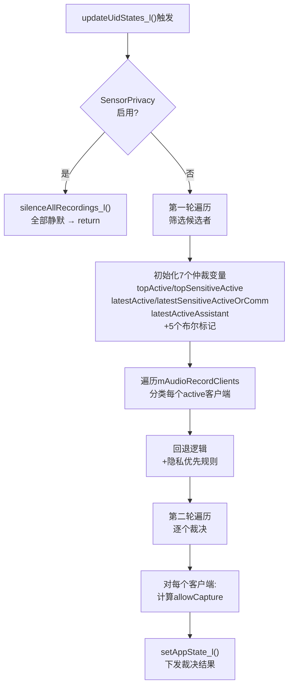
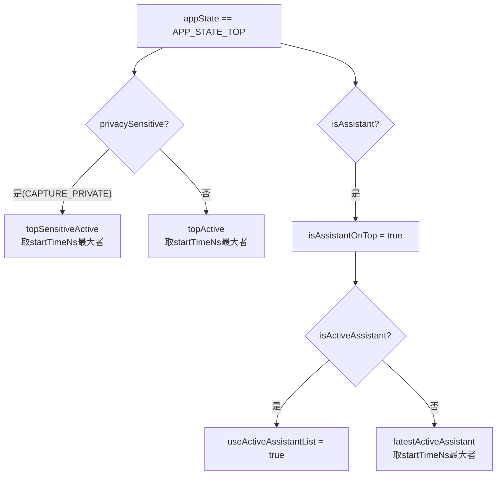
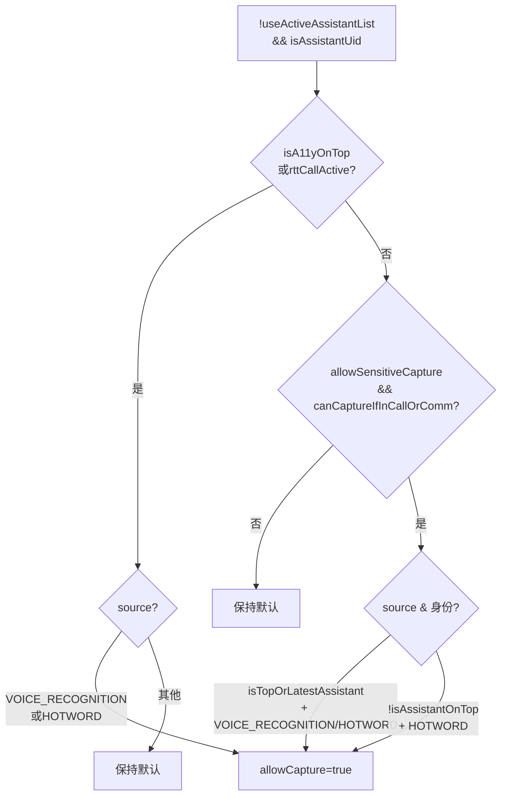
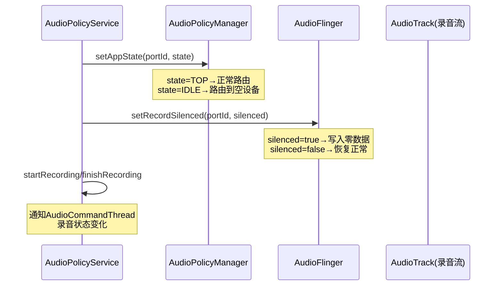
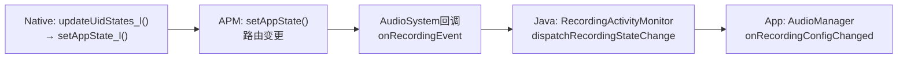

## 3.9 录音并发仲裁机制 — Concurrent Capture

> [← 上一个](03_3.8_AudioMode状态机与通信设备路由.md) | [返回目录](README.md) | [下一个→](03_3.10_RecordingActivityMonitor-录音状态追踪.md)

---

### 3.9.1 录音并发架构总览

Android 10+支持多App并发录音，但并非"无限制并发"——Native层`AudioPolicyService`通过两轮遍历仲裁模型决定每个录音客户端是被允许还是被静默。Java层`RecordingActivityMonitor`则负责状态追踪与回调通知，两者分工明确：

| 层级 | 组件 | 职责 |
|------|------|------|
| **Native仲裁层** | [`AudioPolicyService::updateUidStates_l()`](frameworks/av/services/audiopolicy/service/AudioPolicyService.cpp:809) | 基于UID优先级/隐私标志/通话状态裁决每个客户端的`APP_STATE` |
| **Native执行层** | [`AudioPolicyService::setAppState_l()`](frameworks/av/services/audiopolicy/service/AudioPolicyService.cpp:1168) | 将裁决结果下发给APM路由引擎与AudioFlinger静音模块 |
| **Java追踪层** | `RecordingActivityMonitor` | 接收Native层状态变更回调，通知App端录音状态变化 |

核心仲裁入口[`updateUidStates_l()`](frameworks/av/services/audiopolicy/service/AudioPolicyService.cpp:809)在以下场景被触发：
- 录音客户端active状态变更（start/stop）
- UID优先级变更（前台/后台切换）
- AudioMode变更（通话/VoIP进入/退出）
- SensorPrivacy开关切换

### 3.9.2 AudioRecordClient核心数据结构

[`AudioRecordClient`](frameworks/av/services/audiopolicy/service/AudioPolicyService.h:972)是仲裁的原子单元，每个录音客户端在`getInputForAttr()`时创建，`releaseInput()`时销毁：

```cpp
// AudioPolicyService.h L972-998
class AudioRecordClient : public AudioClient {
public:
    AudioRecordClient(const audio_attributes_t attributes,
                      const audio_io_handle_t io,
                      const audio_session_t session, audio_port_handle_t portId,
                      const audio_port_handle_t deviceId,
                      const AttributionSourceState& attributionSource,
                      bool canCaptureOutput, bool canCaptureHotword,
                      wp<AudioCommandThread> commandThread);
    bool hasOp() const;  // L990: AppOps权限检查
    // --- 核心字段 ---
    const AttributionSourceState attributionSource;  // L994: 含uid/package/attribution链
    nsecs_t startTimeNs;       // L995: 录音启动时间戳(仲裁时序依据)
    const bool canCaptureOutput;   // L996: 是否持有CAPTURE_AUDIO_OUTPUT特权
    const bool canCaptureHotword;  // L997: 是否持有CAPTURE_AUDIO_HOTWORD特权
    bool silenced;                 // L998: 当前是否被静音
private:
    sp<OpRecordAudioMonitor> mOpRecordAudioMonitor;  // L1001: AppOps运行时监控
};
```

**权限维度映射**：

| 字段 | 权限来源 | 仲裁影响 |
|------|---------|---------|
| [`canCaptureOutput`](frameworks/av/services/audiopolicy/service/AudioPolicyService.h:996) | `CAPTURE_AUDIO_OUTPUT`系统特权 | 绕过隐私优先规则 + 绕过通话录音限制 |
| [`canCaptureHotword`](frameworks/av/services/audiopolicy/service/AudioPolicyService.h:997) | `CAPTURE_AUDIO_HOTWORD`系统特权 | 允许HOTWORD源录音 |
| [`hasOp()`](frameworks/av/services/audiopolicy/service/AudioPolicyService.h:990) | `AppOpsManager.RECORD_AUDIO`运行时授权 | denied → 强制禁止（L1029-1031） |
| `privacySensitive` | `AUDIO_FLAG_CAPTURE_PRIVATE`属性标志 | 进入topSensitiveActive通道，优先于普通录音 |

### 3.9.3 updateUidStates_l()仲裁主流程 — 两轮遍历模型



**初始化阶段**（[L850-870](frameworks/av/services/audiopolicy/service/AudioPolicyService.cpp:850)）：

| 变量 | 类型 | 初始值 | 含义 |
|------|------|--------|------|
| `topActive` | `sp<AudioRecordClient>` | nullptr | 前台TOP中最新启动的**非隐私敏感**客户端 |
| `latestActive` | `sp<AudioRecordClient>` | nullptr | 全部(含非TOP)中最新启动的**非隐私敏感**客户端 |
| `topSensitiveActive` | `sp<AudioRecordClient>` | nullptr | 前台TOP中最新启动的**隐私敏感**客户端 |
| `latestSensitiveActiveOrComm` | `sp<AudioRecordClient>` | nullptr | 全部中最新启动的**隐私敏感**客户端(含通信模式优先) |
| `latestActiveAssistant` | `sp<AudioRecordClient>` | nullptr | 最新的前台助手客户端(非活跃助手列表中) |
| `isA11yOnTop` | `bool` | `mUidPolicy->isA11yOnTop()` | 辅助服务是否在前台TOP |
| `isInCall` | `bool` | `mPhoneState == IN_CALL` | 是否处于电话通话模式 |
| `isInCommunication` | `bool` | `mPhoneState == IN_COMMUNICATION` | 是否处于VoIP通信模式 |
| `rttCallActive` | `bool` | `(isInCall||isInCommunication) && isRttEnabled()` | RTT实时文本通话是否活跃 |
| `onlyHotwordActive` | `bool` | `true` | 是否所有活跃客户端都使用HOTWORD源(第二轮判断用) |

### 3.9.4 第一轮遍历：候选者筛选

[第一轮遍历](frameworks/av/services/audiopolicy/service/AudioPolicyService.cpp:878)对每个`active`且`appState != IDLE`的客户端进行分类：

**排除规则**（[L889-896](frameworks/av/services/audiopolicy/service/AudioPolicyService.cpp:889)）：
- `appState == APP_STATE_IDLE` → 直接跳过（后台且无优先级）
- `isAccessibility` → 不参与top/latest候选（避免掩盖普通App）
- `isVirtualSource` → 不参与top/latest候选（虚拟源始终允许）

**APP_STATE_TOP分类**（[L902-925](frameworks/av/services/audiopolicy/service/AudioPolicyService.cpp:902)）：



**latestActive/latestSensitiveActive筛选**（[L928-950](frameworks/av/services/audiopolicy/service/AudioPolicyService.cpp:928)）：

排除条件（不参与latest候选）：
- `source == AUDIO_SOURCE_HOTWORD` — HOTWORD源不参与，避免掩盖普通App
- `(isA11yOnTop || rttCallActive) && isAssistant` — 特殊模式下助手不参与latest

对于隐私敏感类客户端，有**通信模式优先规则**（[L933-941](frameworks/av/services/audiopolicy/service/AudioPolicyService.cpp:933)）：
- `isInCommunication`时，`mPhoneStateOwnerUid`的客户端**强制优先**为`latestSensitiveActiveOrComm`，即使其`startTimeNs`更小

**onlyHotwordActive更新**（[L952-954](frameworks/av/services/audiopolicy/service/AudioPolicyService.cpp:952)）：
- 每遇到`source != AUDIO_SOURCE_HOTWORD`的客户端，`onlyHotwordActive`置为false

**isPhoneStateOwnerActive更新**（[L955-958](frameworks/av/services/audiopolicy/service/AudioPolicyService.cpp:955)）：
- `currentUid == mPhoneStateOwnerUid && !isVirtualSource` → `isPhoneStateOwnerActive = true`

### 3.9.5 隐私优先规则与回退逻辑

**回退逻辑**（[L961-978](frameworks/av/services/audiopolicy/service/AudioPolicyService.cpp:961)）：
- `topActive == nullptr` → 用`latestActive`回退（无前台App时取最新后台App）
- `topSensitiveActive == nullptr` → 用`latestSensitiveActiveOrComm`回退
- `isInCommunication && topSensitiveActive已有值 && latestActiveUid == mPhoneStateOwnerUid` → **通信模式Owner覆盖前台隐私敏感**（[L969-978](frameworks/av/services/audiopolicy/service/AudioPolicyService.cpp:969))

**隐私优先规则**（[L985-988](frameworks/av/services/audiopolicy/service/AudioPolicyService.cpp:985)）：

```cpp
// L985-988: 当隐私敏感录音和普通录音同时活跃时
if (topActive != nullptr && topSensitiveActive != nullptr
        && !topActive->canCaptureOutput) {
    topActive = nullptr;  // 普通录音候选被清除!
}
```

**核心含义**：若隐私敏感录音（如VoIP通话）和普通录音同时活跃，除非普通录音客户端持有`CAPTURE_AUDIO_OUTPUT`特权，否则**普通录音候选者被彻底清除**（`topActive = nullptr`）。这确保隐私敏感录音不会被"窃听式"普通录音并行干扰。

### 3.9.6 第二轮遍历：逐个裁决

[第二轮遍历](frameworks/av/services/audiopolicy/service/AudioPolicyService.cpp:990)对每个`active`客户端计算`allowCapture`布尔值，最终通过[`setAppState_l()`](frameworks/av/services/audiopolicy/service/AudioPolicyService.cpp:1110)下发：

**身份标记计算**（[L999-1004](frameworks/av/services/audiopolicy/service/AudioPolicyService.cpp:999)）：

| 标记 | 计算方式 | 含义 |
|------|---------|------|
| `isTopOrLatestActive` | `current.uid == topActive.uid` | 是否是第一轮选出的普通录音候选者 |
| `isTopOrLatestSensitive` | `current.uid == topSensitiveActive.uid` | 是否是第一轮选出的隐私敏感候选者 |
| `isTopOrLatestAssistant` | `current.uid == latestActiveAssistant.uid` | 是否是第一轮选出的助手候选者 |

**allowCapture默认规则**（[L1022-1027](frameworks/av/services/audiopolicy/service/AudioPolicyService.cpp:1022)）：

```cpp
bool allowSensitiveCapture =
    !isSensitiveActive || isTopOrLatestSensitive || current->canCaptureOutput;
bool allowCapture = !isAssistantOnTop          // 1. 助手不在TOP
        && (isTopOrLatestActive || isTopOrLatestSensitive) // 2. 是候选者之一
        && allowSensitiveCapture               // 3. 无隐私冲突
        && canCaptureIfInCallOrCommunication(current);     // 4. 无通话冲突
```

四个条件**全部满足**才默认允许录音。任一条件失败即进入特殊规则通道。

### 3.9.7 canCaptureIfInCallOrCommunication lambda

[L1006-1015](frameworks/av/services/audiopolicy/service/AudioPolicyService.cpp:1006)定义了通话/通信模式下的录音限制lambda：

```cpp
auto canCaptureIfInCallOrCommunication = [&](const auto &recordClient) {
    uid_t recordUid = aidl2legacy(recordClient->attributionSource.uid);
    bool canCaptureCall = recordClient->canCaptureOutput;
    bool canCaptureCommunication = recordClient->canCaptureOutput
        || !isPhoneStateOwnerActive      // 通信Mode Owner不活跃 → 无冲突
        || recordUid == mPhoneStateOwnerUid; // 自己就是Mode Owner → 允许
    return !(isInCall && !canCaptureCall)              // IN_CALL需特权
        && !(isInCommunication && !canCaptureCommunication); // IN_COMM需特权或无冲突
};
```

| 模式 | 限制条件 | 绕过方式 |
|------|---------|---------|
| `IN_CALL` | 非特权客户端禁止录音 | `canCaptureOutput = true` |
| `IN_COMMUNICATION` | 非特权+PhoneStateOwner活跃+非Owner → 禁止 | `canCaptureOutput` 或 `!isPhoneStateOwnerActive` 或 `uid == mPhoneStateOwnerUid` |

**设计意图**：通话中禁止普通App录音防止窃听；VoIP通信中仅通信发起方和特权App可录音。

### 3.9.8 特殊客户端规则详解

第二轮遍历中，`allowCapture`默认规则之后有6种特殊规则通道（按优先级依次检查）：

#### 规则1: AppOps禁止（[L1029-1031](frameworks/av/services/audiopolicy/service/AudioPolicyService.cpp:1029)）

```cpp
if (!current->hasOp()) {
    allowCapture = false;  // AppOps RECORD_AUDIO被denied → 强制禁止
}
```

`hasOp()`调用[`OpRecordAudioMonitor::hasOp()`](frameworks/av/services/audiopolicy/service/AudioPolicyService.h:990)，是**最高优先级检查**——即使其他规则允许，AppOps denied也强制禁止。

#### 规则2: 虚拟源豁免（[L1032-1034](frameworks/av/services/audiopolicy/service/AudioPolicyService.cpp:1032)）

```cpp
else if (isVirtualSource(source)) {
    allowCapture = true;  // 远程混音/通话音频TX/RX → 始终允许
}
```

虚拟源（`AUDIO_SOURCE_REMOTE_SUBMIX`等）不消耗真实麦克风，无需仲裁。

#### 规则3: 助手规则 — 非活跃列表（[L1035-1058](frameworks/av/services/audiopolicy/service/AudioPolicyService.cpp:1035)）



三条子规则：
- **A11y/RTT优先通道**：辅助服务在TOP或RTT通话活跃时，助手用`VOICE_RECOGNITION/HOTWORD`源可直接录音
- **助手候选通道**：允许隐私/通话条件下，`isTopOrLatestAssistant` + `VOICE_RECOGNITION/HOTWORD` → 允许
- **HOTWORD兜底通道**：助手不在TOP时，任何助手用`HOTWORD`源可录音（后台唤醒场景）

#### 规则4: 助手规则 — 活跃列表（[L1059-1076](frameworks/av/services/audiopolicy/service/AudioPolicyService.cpp:1059)）

```cpp
else if (useActiveAssistantList && isActiveAssistantUid(currentUid)) {
    // 子规则与规则3类似，但无需isTopOrLatestAssistant条件
    // 活跃助手列表中的助手，允许条件下可直接用VOICE_RECOGNITION/HOTWORD
}
```

活跃助手列表（由`ActivityManager`维护）中的助手享有更宽松的权限——无需是"最新助手候选者"。

#### 规则5: 辅助服务(A11y)规则（[L1077-1093](frameworks/av/services/audiopolicy/service/AudioPolicyService.cpp:1077)）

```cpp
else if (mUidPolicy->isA11yUid(currentUid)) {
    // 通道A: !isAssistantOnTop && allowSensitiveCapture && canCaptureIfInCall → 允许
    // 通道B: isA11yOnTop && (VOICE_RECOGNITION || HOTWORD) → 允许
}
```

辅助服务的两条通道：
- **助手不在TOP时**：辅助服务可绕过助手占用，在无隐私/通话冲突下录音
- **辅助服务在TOP时**：使用`VOICE_RECOGNITION/HOTWORD`源无条件允许

#### 规则6: HOTWORD源规则（[L1094-1103](frameworks/av/services/audiopolicy/service/AudioPolicyService.cpp:1094)）

```cpp
else if (source == AUDIO_SOURCE_HOTWORD) {
    if (onlyHotwordActive && canCaptureIfInCallOrCommunication(current)) {
        allowCapture = true;  // 所有活跃者都用HOTWORD → 允许并发
    }
}
```

当**所有**活跃录音客户端都使用`HOTWORD`源时（`onlyHotwordActive = true`），且无通话冲突，允许并发——这是多唤醒词引擎并发监听的场景。

#### 规则7: IME规则（[L1103-1108](frameworks/av/services/audiopolicy/service/AudioPolicyService.cpp:1103)）

```cpp
else if (mUidPolicy->isCurrentImeUid(currentUid)) {
    if (rttCallActive && source == AUDIO_SOURCE_VOICE_RECOGNITION) {
        allowCapture = true;  // RTT通话中IME可用VOICE_RECOGNITION源录音
    }
}
```

仅RTT（实时文本）通话活跃时，输入法(IME)可使用`VOICE_RECOGNITION`源录音，用于语音转文字输入。

### 3.9.9 setAppState_l()执行机制

[`setAppState_l()`](frameworks/av/services/audiopolicy/service/AudioPolicyService.cpp:1168)是仲裁结果的**唯一执行通道**，三重执行：



**关键逻辑**（[L1177-1192](frameworks/av/services/audiopolicy/service/AudioPolicyService.cpp:1177)）：

```cpp
bool silenced = state == APP_STATE_IDLE;
if (client->silenced != silenced) {   // 状态变化才执行
    if (client->active) {
        if (silenced) {
            finishRecording(...);       // 静默→停止录音追踪
        } else {
            startRecording(...);        // 解除静默→开始录音追踪
            // startRecording失败 → silenced强制为true
        }
    }
    af->setRecordSilenced(portId, silenced);  // AudioFlinger执行静音
    client->silenced = silenced;              // 更新客户端标记
}
```

**状态映射**：[`apmStatFromAmState()`](frameworks/av/services/audiopolicy/service/AudioPolicyService.cpp:1126)将ActivityManager进程状态转为APM状态：

| AM状态 | APM状态 | 录音行为 |
|--------|---------|---------|
| `PROCESS_STATE_UNKNOWN` | `APP_STATE_IDLE` | 静默 |
| `≤ PROCESS_STATE_TOP` | `APP_STATE_TOP` | 正常录音 |
| `> PROCESS_STATE_TOP` | `APP_STATE_FOREGROUND` | 正常录音(前台服务) |

### 3.9.10 silenceAllRecordings_l()紧急静音

[`silenceAllRecordings_l()`](frameworks/av/services/audiopolicy/service/AudioPolicyService.cpp:1116)在SensorPrivacy启用时执行（[L873-876](frameworks/av/services/audiopolicy/service/AudioPolicyService.cpp:873)）：

```cpp
void AudioPolicyService::silenceAllRecordings_l() {
    for (size_t i = 0; i < mAudioRecordClients.size(); i++) {
        sp<AudioRecordClient> current = mAudioRecordClients[i];
        if (!isVirtualSource(current->attributes.source)) {  // 虚拟源排除
            setAppState_l(current, APP_STATE_IDLE);          // 全部静默
        }
    }
}
```

**排除虚拟源**：`AUDIO_SOURCE_REMOTE_SUBMIX`等虚拟源不受SensorPrivacy影响，因为它们不使用物理传感器。

### 3.9.11 Java层RecordingActivityMonitor与Native层仲裁的协作关系

Native层仲裁完成后，状态变更通过以下路径传递到Java层：



`RecordingActivityMonitor`（下一个详述）维护一个`RecordingInfo`列表，记录每个活跃录音的详细配置。Native层仲裁结果通过`onRecordConfigChanged`回调同步到Java层，Java层再通过`AudioManager.OnRecordingConfigChangedListener`通知App端。

### 3.9.12 关键仲裁场景速查表

| 场景 | 仲裁结果 | 规则来源行号 |
|------|---------|-------------|
| **SensorPrivacy启用** | 全部静默(除虚拟源) | [L873-876](frameworks/av/services/audiopolicy/service/AudioPolicyService.cpp:873) |
| **AppOps RECORD_AUDIO denied** | 强制禁止 | [L1029-1031](frameworks/av/services/audiopolicy/service/AudioPolicyService.cpp:1029) |
| **虚拟源(remote submix等)** | 始终允许 | [L1032-1034](frameworks/av/services/audiopolicy/service/AudioPolicyService.cpp:1032) |
| **普通App前台 + 隐私App活跃** | 隐私App优先，普通App被静默 | [L985-988](frameworks/av/services/audiopolicy/service/AudioPolicyService.cpp:985) |
| **特权App(CAPTURE_AUDIO_OUTPUT)** | 绕过隐私+通话限制 | [L996](frameworks/av/services/audiopolicy/service/AudioPolicyService.h:996) |
| **IN_CALL通话中 + 非特权录音** | 禁止 | [L1009-1013](frameworks/av/services/audiopolicy/service/AudioPolicyService.cpp:1009) |
| **IN_COMM VoIP + PhoneStateOwner录音** | 允许(自身是ModeOwner) | [L1011-1012](frameworks/av/services/audiopolicy/service/AudioPolicyService.cpp:1011) |
| **助手前台 + VOICE_RECOGNITION** | 允许(活跃助手列表) | [L1059-1076](frameworks/av/services/audiopolicy/service/AudioPolicyService.cpp:1059) |
| **助手后台 + HOTWORD** | 允许(仅当助手不在TOP) | [L1055](frameworks/av/services/audiopolicy/service/AudioPolicyService.cpp:1055) |
| **A11y前台 + VOICE_RECOGNITION** | 允许 | [L1089-1092](frameworks/av/services/audiopolicy/service/AudioPolicyService.cpp:1089) |
| **所有活跃者都用HOTWORD** | 允许并发(无通话时) | [L1099-1101](frameworks/av/services/audiopolicy/service/AudioPolicyService.cpp:1099) |
| **RTT通话 + IME + VOICE_RECOGNITION** | 允许 | [L1106](frameworks/av/services/audiopolicy/service/AudioPolicyService.cpp:1106) |
| **IN_COMM VoIP + 前台隐私敏感 + ModeOwner** | ModeOwner覆盖前台隐私优先 | [L969-978](frameworks/av/services/audiopolicy/service/AudioPolicyService.cpp:969) |

> **核心原则**：隐私敏感录音优先于普通录音 → 特权权限可绕过 → 通话模式限制最严 → 助手/A11y/IME有特殊通道 → HOTWORD源有兜底并发机制。

---

> [← 上一个](03_3.8_AudioMode状态机与通信设备路由.md) | [返回目录](README.md) | [下一个→](03_3.10_RecordingActivityMonitor-录音状态追踪.md)