# 第四篇：Native Framework Layer

> [← 上一篇：Java Framework](03_Java_Framework_Layer.md) | [返回导航](README.md) | [下一篇：AudioFlinger →](05_AudioFlinger.md)

---

## 4.1 JNI Bridge — Java到Native的桥梁

### 模块职责
JNI层将Java层的音频API调用转换为Native C++层的实际操作，是App进程进入Native世界的必经之路。

### 核心JNI文件

| Java类 | JNI文件 | 关键方法 |
|--------|---------|----------|
| AudioTrack | `android_media_AudioTrack.cpp` | native_setup, native_start, native_write |
| AudioRecord | `android_media_AudioRecord.cpp` | native_setup, native_start, native_read |
| AudioEffect | `android_media_AudioEffect.cpp` | native_create, native_command |
| AudioSystem | `android_media_AudioSystem.cpp` | native_setParameters, native_getParameters |

### JNI调用模式

```mermaid
graph LR
    subgraph Java
        AT_J["AudioTrack.play（）"]
    end
    subgraph JNI
        JNI["android_media_AudioTrack_start（）"]
    end
    subgraph Native
        AT_N["NativeAudioTrack.start（）"]
    end
    AT_J -->|"JNI Call"| JNI -->|"sp<AudioTrack>"| AT_N
```

**关键设计**：JNI层持有Native对象的`sp<>`智能指针，通过`jlong`传递给Java层（Java只看到一个long值，不直接操作Native对象）。

---

## 4.2 libaudioclient — Native音频客户端库

### 模块职责
libaudioclient是App进程使用的Native音频客户端库，封装了与AudioFlinger和AudioPolicyService的Binder IPC通信。

### 核心类

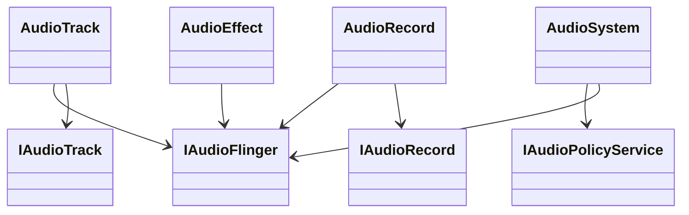

### AudioTrack Native核心流程

### AudioTrack Native层实现详解

#### 创建Track（[`AudioTrack::createTrack_l()`](frameworks/av/media/libaudioclient/AudioTrack.cpp:1807)）

```mermaid
sequenceDiagram
    participant App, NativeAT, AF, APS, APM
    App->>NativeAT: set（） → createTrack_l（）
    NativeAT->>AF: IAudioFlinger.createTrack（） [Binder]
    AF->>APS: getOutputForAttr（） [内部Binder]
    APS->>APM: getOutputForAttr（）
    APM-->>APS: outputId + portId
    APS-->>AF: 路由结果
    AF->>AF: 创建PlaybackThread::Track
    AF-->>NativeAT: IAudioTrack + cblk共享内存
    NativeAT->>NativeAT: 构造Proxy，映射共享内存
```

**CreateTrackInput参数**（[`IAudioFlinger.h:186`](frameworks/av/media/libaudioclient/include/media/IAudioFlinger.h:186)）：

| 参数 | 类型 | 说明 |
|------|------|------|
| `attr` | audio_attributes_t | 音频属性（usage+content_type+tags） |
| `config` | audio_config_t | 采样率/通道掩码/格式 |
| `clientInfo` | AudioClient | PID/UID/TID（Fast track需TID） |
| `sharedBuffer` | IMemory | Static模式共享buffer |
| `flags` | audio_output_flags_t | PRIMARY/FAST/DEEP_BUFFER/COMPRESS_OFFLOAD等 |
| `frameCount` | size_t | 请求的buffer帧数 |
| `sessionId` | audio_session_t | 会话ID |
| `speed` | float | 初始播放速度 |
| `selectedDeviceId` | audio_port_handle_t | 指定路由设备 |

#### start流程详解（[`AudioTrack::start()`](frameworks/av/media/libaudioclient/AudioTrack.cpp:782)）

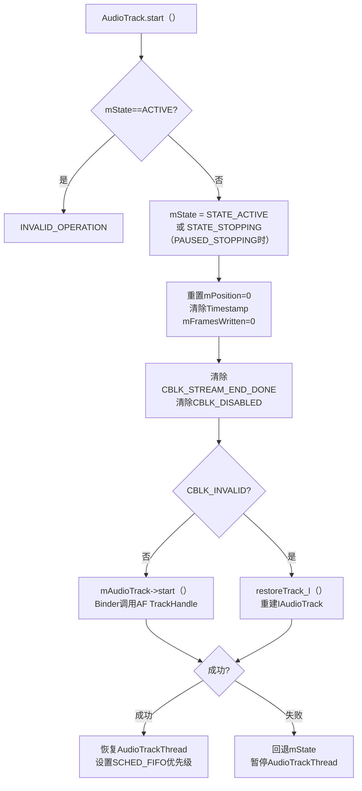

**关键设计**：
- `CBLK_INVALID`检查：start前检测Track是否已被AudioFlinger销毁（设备变更/AF重启），若是则自动restore
- `DEAD_OBJECT`处理：start()返回DEAD_OBJECT时自动触发restoreTrack_l()重建Track
- 优先级提升：Fast track线程获得SCHED_FIFO调度优先级，降低延迟

#### stop流程详解（[`AudioTrack::stop()`](frameworks/av/media/libaudioclient/AudioTrack.cpp:922)）

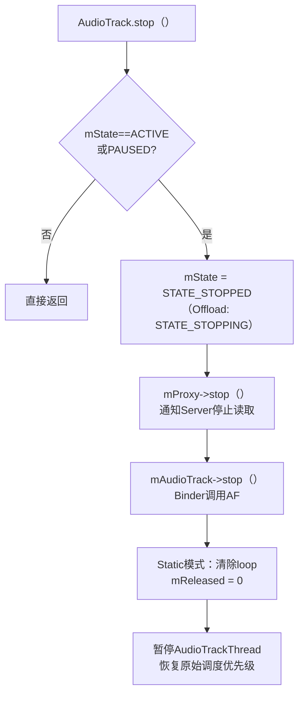

#### write流程详解（[`AudioTrack::write()`](frameworks/av/media/libaudioclient/AudioTrack.cpp:2310)）

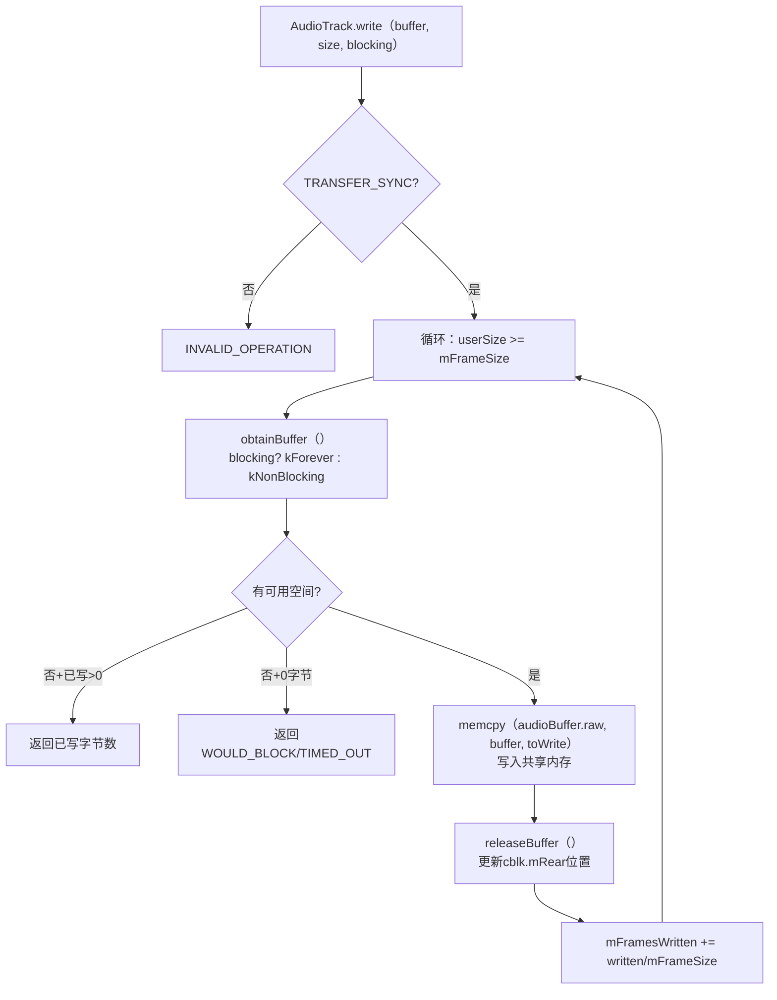

**write的核心设计**：
- `obtainBuffer()`通过ClientProxy操作共享内存cblk，计算可用写入空间
- 阻塞模式：使用futex等待AF消费数据腾出空间
- 非阻塞模式：立即返回WOULD_BLOCK
- **纯共享内存操作**：数据传输阶段完全没有Binder调用

### AudioRecord Native层实现详解

#### 创建Record（[`AudioRecord::createRecord_l()`](frameworks/av/media/libaudioclient/AudioRecord.cpp:782)）

```mermaid
sequenceDiagram
    participant App, NativeAR, AF, APS, APM
    App->>NativeAR: set（） → createRecord_l（）
    NativeAR->>AF: IAudioFlinger.createRecord（） [Binder]
    AF->>APS: getInputForAttr（） [内部Binder]
    APS->>APM: getInputForAttr（）
    APM-->>APS: inputId + portId
    APS-->>AF: 路由结果
    AF->>AF: 创建RecordThread::RecordTrack
    AF-->>NativeAR: IAudioRecord + cblk共享内存
    NativeAR->>NativeAR: 构造AudioRecordClientProxy<br>映射共享内存
```

**CreateRecordInput参数**：

| 参数 | 类型 | 说明 |
|------|------|------|
| `attr` | audio_attributes_t | 录音属性（source+flags+tags） |
| `config` | audio_config_t | 采样率/通道掩码/格式 |
| `clientInfo` | AudioClient | PID/UID/TID |
| `riid` | record_interface_id_t | 录音追踪ID |
| `flags` | audio_input_flags_t | FAST/RAW等 |
| `frameCount` | size_t | 请求的buffer帧数 |
| `sessionId` | audio_session_t | 会话ID |
| `selectedDeviceId` | audio_port_handle_t | 指定输入设备 |
| `maxSharedAudioHistoryMs` | uint32_t | 最大共享音频历史时长 |

> **重试机制**：createRecord_l对FAILED_TRANSACTION会自动重试最多3次（间隔20-50ms），这是AudioPolicy和AudioFlinger状态不一致时的临时恢复策略。

#### start/stop/read流程

**start**（[`AudioRecord::start()`](frameworks/av/media/libaudioclient/AudioRecord.cpp:420)）：
```
1. flush mProxy → 丢弃buffer中的旧数据
2. mActive = true
3. mAudioRecord->start() → Binder调用AF RecordHandle
4. CBLK_INVALID → restoreRecord_l()重建Record
5. 设置SCHED_FIFO优先级（Fast track）
```

**stop**（[`AudioRecord::stop()`](frameworks/av/media/libaudioclient/AudioRecord.cpp:503)）：
```
1. mActive = false
2. mProxy->interrupt() → 唤醒等待中的read
3. mAudioRecord->stop() → Binder调用AF
4. 恢复原始调度优先级
```

**read**（[`AudioRecord::read()`](frameworks/av/media/libaudioclient/AudioRecord.cpp:1201)）：
```
循环：
  → obtainBuffer() → 从cblk获取可读数据位置
  → memcpy_by_audio_format(buffer, audioBuffer.raw)
    // 支持格式转换：server格式 → client请求格式
  → releaseBuffer() → 更新cblk.mFront位置
  → mFramesRead += bytesRead/mFrameSize
```

> **格式转换**：read()中使用`memcpy_by_audio_format()`自动将Server配置的格式转换为Client请求的格式，这是AudioTrack write()不具备的（write要求格式匹配）。

### AudioSystem关键方法详解

AudioSystem是Native层的"AudioManager"，封装了与AudioFlinger和AudioPolicyService的通信：

#### 音量控制方法

| 方法 | 目标服务 | 说明 |
|------|---------|------|
| [`setStreamVolume()`](frameworks/av/media/libaudioclient/include/media/AudioSystem.h:119) | AF | 设置单个流的音量值 |
| [`getStreamVolume()`](frameworks/av/media/libaudioclient/include/media/AudioSystem.h:121) | AF | 获取单个流的音量值 |
| [`setStreamMute()`](frameworks/av/media/libaudioclient/include/media/AudioSystem.h:125) | AF | 静音/取消静音单个流 |
| [`setMasterVolume()`](frameworks/av/media/libaudioclient/include/media/AudioSystem.h:111) | AF | 设置主音量 |
| [`setMasterMute()`](frameworks/av/media/libaudioclient/include/media/AudioSystem.h:115) | AF | 设置主静音 |
| [`setVoiceVolume()`](frameworks/av/media/libaudioclient/include/media/AudioSystem.h:216) | AF | 设置通话音量 |

#### 参数设置方法

| 方法 | 目标服务 | 说明 |
|------|---------|------|
| [`setParameters(ioHandle, kvp)`](frameworks/av/media/libaudioclient/include/media/AudioSystem.h:149) | AF | 向指定I/O流设置键值对参数 |
| [`getParameters(ioHandle, keys)`](frameworks/av/media/libaudioclient/include/media/AudioSystem.h:150) | AF | 从指定I/O流获取键值对参数 |
| [`setParameters(kvp)`](frameworks/av/media/libaudioclient/include/media/AudioSystem.h:152) | AF | 全局设置键值对参数 |
| [`getParameters(keys)`](frameworks/av/media/libaudioclient/include/media/AudioSystem.h:153) | AF | 全局获取键值对参数 |

#### 设备与路由方法

| 方法 | 目标服务 | 说明 |
|------|---------|------|
| [`setDeviceConnectionState()`](frameworks/av/media/libaudioclient/include/media/AudioSystem.h:283) | APS | 设备连接/断开状态通知 |
| [`getDeviceConnectionState()`](frameworks/av/media/libaudioclient/include/media/AudioSystem.h:286) | APS | 查询设备连接状态 |
| [`setPhoneState()`](frameworks/av/media/libaudioclient/include/media/AudioSystem.h:292) | APS | 设置通话模式 |
| [`setForceUse()`](frameworks/av/media/libaudioclient/include/media/AudioSystem.h:293) | APS | 设置强制使用配置 |
| [`getForceUse()`](frameworks/av/media/libaudioclient/include/media/AudioSystem.h:294) | APS | 查询强制使用配置 |
| [`getOutputForAttr()`](frameworks/av/media/libaudioclient/include/media/AudioSystem.h:316) | APS | 获取音频输出路由 |
| [`getInputForAttr()`](frameworks/av/media/libaudioclient/include/media/AudioSystem.h:351) | APS | 获取音频输入路由 |

#### 回调注册方法

| 方法 | 说明 |
|------|------|
| [`setDynPolicyCallback()`](frameworks/av/media/libaudioclient/include/media/AudioSystem.h:165) | 注册动态策略变更回调 |
| [`setRecordConfigCallback()`](frameworks/av/media/libaudioclient/include/media/AudioSystem.h:166) | 注册录音配置变更回调 |
| [`setRoutingCallback()`](frameworks/av/media/libaudioclient/include/media/AudioSystem.h:167) | 注册路由变更回调 |
| [`setVolInitReqCallback()`](frameworks/av/media/libaudioclient/include/media/AudioSystem.h:168) | 注册音量范围初始化请求回调 |

---

## 4.3 Binder IPC机制

### 音频系统Binder接口体系

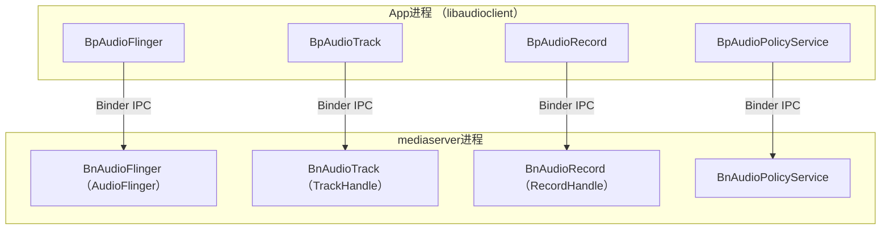

### Binder接口详细方法

#### IAudioFlinger — 核心音频服务接口

[`IAudioFlinger.h`](frameworks/av/media/libaudioclient/include/media/IAudioFlinger.h:186)

**Track/Record管理**：

| 方法 | 参数 | 说明 |
|------|------|------|
| `createTrack()` | CreateTrackRequest → CreateTrackResponse | 创建播放Track，返回IAudioTrack+cblk |
| `createRecord()` | CreateRecordRequest → CreateRecordResponse | 创建采集Record，返回IAudioRecord+cblk |
| `createEffect()` | CreateEffectRequest → CreateEffectResponse | 创建音效实例 |

**流管理**：

| 方法 | 说明 |
|------|------|
| `openOutput()` | 打开HAL输出流（创建PlaybackThread） |
| `openInput()` | 打开HAL输入流（创建RecordThread） |
| `openDuplicateOutput()` | 创建重复输出（同一数据写两路） |
| `closeOutput()` / `closeInput()` | 关闭输出/输入流 |
| `suspendOutput()` / `restoreOutput()` | 挂起/恢复输出 |

**音量控制**：

| 方法 | 说明 |
|------|------|
| `setMasterVolume()` / `setMasterMute()` | 主音量/主静音 |
| `setStreamVolume()` / `setStreamMute()` | 单流音量/单流静音 |
| `setVoiceVolume()` | 通话音量 |
| `setMasterBalance()` | 主声道平衡（左/右） |
| `setMicMute()` / `getMicMute()` | 麦克风静音控制 |
| `setRecordSilenced()` | 静音指定录音端口 |

**路由Patch**：

| 方法 | 说明 |
|------|------|
| `createAudioPatch()` | 创建音频路由Patch（source→sink） |
| `releaseAudioPatch()` | 释放音频路由Patch |
| `listAudioPatches()` | 列出所有音频路由Patch |

**参数与状态**：

| 方法 | 说明 |
|------|------|
| `setParameters()` / `getParameters()` | 设置/获取键值对参数 |
| `setMode()` | 设置音频模式（NORMAL/RING/IN_CALL） |
| `getAudioPort()` | 获取音频端口属性 |
| `setAudioPortConfig()` | 设置端口配置 |
| `registerClient()` | 注册IAudioFlingerClient |

#### IAudioTrack — 播放Track代理接口

| 方法 | 参数 | 说明 |
|------|------|------|
| `start()` | — | 开始播放（Binder，触发AF Track激活） |
| `stop()` | — | 停止播放（异步，AF继续消费到当前位置） |
| `pause()` | — | 暂停播放 |
| `flush()` | — | 清空共享内存buffer（停止状态下才有效） |
| `write()` | data+size | 非共享内存模式写入（很少使用） |
| `getTimestamp()` | AudioTimestamp | 获取播放时间戳 |
| `setVolume()` | float left/right | 设置Track音量 |
| `setPlaybackRate()` | AudioPlaybackRate | 设置播放速率/音调 |
| `setBufferSizeInFrames()` | size_t | 动态调整buffer大小 |
| `selectPresentation()` | presentationId | 选择音频呈现方式 |

> **设计要点**：start/stop/pause/flush通过Binder IPC触发AF端状态变化，而数据传输（write到共享内存）完全不经过Binder。

#### IAudioRecord — 录音Record代理接口

| 方法 | 参数 | 说明 |
|------|------|------|
| `start()` | event, triggerSession | 开始录音（支持同步事件触发） |
| `stop()` | — | 停止录音 |
| `read()` | data+size | 非共享内存模式读取（很少使用） |
| `getTimestamp()` | AudioTimestamp | 获取录音时间戳 |
| `setPreferredMicDirection()` | MicDirection | 设置首选麦克风方向 |
| `setPreferredMicFieldDimension()` | float | 设置麦克风场维度 |
| `setAudioSource()` | audio_source_t | 更换录音源 |
| `setGain()` | float | 设置录音增益 |

> **同步事件触发**：start()支持`SYNC_EVENT_START`，例如在某个session开始播放时同步启动录音（用于卡拉OK/实时反馈场景）。

#### IAudioPolicyService — 音频策略服务接口

| 方法 | 说明 |
|------|------|
| `getOutputForAttr()` | 获取音频输出路由（属性→outputId+portId） |
| `getInputForAttr()` | 获取音频输入路由（属性→inputId+portId） |
| `setDeviceConnectionState()` | 设备连接状态变更通知 |
| `getDeviceConnectionState()` | 查询设备连接状态 |
| `setPhoneState()` | 设置通话模式 |
| `setForceUse()` / `getForceUse()` | 设置/查询强制使用配置（蓝牙/扬声器） |
| `setVolumeIndexForAttributes()` | 按音频属性设置音量指数 |
| `getVolumeIndexForAttributes()` | 查询音量指数 |
| `getMinVolumeIndexForAttributes()` | 获取最小音量指数 |
| `getMaxVolumeIndexForAttributes()` | 获取最大音量指数 |
| `registerClient()` | 注册IAudioPolicyServiceClient监听 |
| `getAudioPolicyConfig()` | 获取音频策略配置（用于CarAudioService） |
| `createAudioPatch()` | 创建策略层路由Patch |
| `releaseAudioPatch()` | 释放策略层路由Patch |
| `setSurroundFormatEnabled()` | 启用/禁用环绕声格式 |

---

## 4.4 共享内存机制深度解析

### audio_track_cblk_t — 共享内存控制块详解

[`AudioTrackShared.h:207-279`](frameworks/av/include/private/media/AudioTrackShared.h:207)

```
┌────────────────────────────────────────────────────────┐
│ audio_track_cblk_t (控制块头部 ~128字节)               │
├────────────────────────────────────────────────────────┤
│ mServer: AF已消费帧数(异步更新,仅供参考)               │
│ mFutex: 事件标志, Client等待(P)/Server唤醒(V)         │
│ mMinimum: Server唤醒Client的最低可用空间阈值            │
│ mVolumeLR: 立体声音量(AudioTrack专用)                  │
│ mSampleRate: App请求的采样率                            │
│ mPlaybackRateQueue: 播放速率状态队列                    │
│ mSendLevel: 辅助效果发送电平                            │
│ mExtendedTimestampQueue: 扩展时间戳队列                │
│ mBufferSizeInFrames: 有效buffer大小(可动态调整)        │
│ mStartThresholdInFrames: 开始播放最小帧数阈值          │
│ mFlags: CBLK_*标志组合                                 │
│ mState: TrackBase当前状态(atomic)                      │
├────────────────────────────────────────────────────────┤
│ AudioTrackSharedStreaming / Static (union)              │
│   Streaming: mFront/mRear/mFlush/mStop                 │
│             mUnderrunFrames/mUnderrunCount             │
│   Static: mSingleStateQueue/mPosLoopQueue              │
├────────────────────────────────────────────────────────┤
│ PCM数据buffer (frameCount * frameSize字节)             │
│ [帧0][帧1][帧2]...[帧N] 环形缓冲区                    │
└────────────────────────────────────────────────────────┘
```

### Streaming模式FIFO同步机制

[`AudioTrackShared.h:134-145`](frameworks/av/include/private/media/AudioTrackShared.h:134)

**核心：mFront/mRear环形缓冲区位置同步**

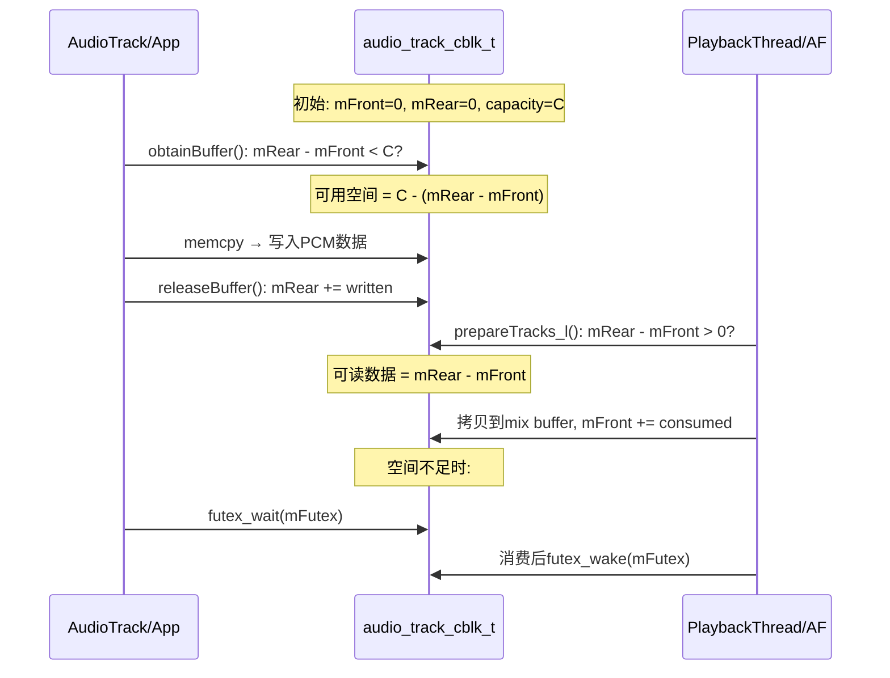

**核心同步原语**：
- `volatile int32_t mFront/mRear`：无锁同步，原子读写
- `mFutex`：Linux futex系统调用实现高效等待/唤醒
- `mFlush`：Client发出flush，Server检测后丢弃数据
- `mStop`：Client标记stop位置，Server不读超过此位置

### Proxy体系详解

Proxy是AudioTrack/AudioRecord操作共享内存的抽象层：

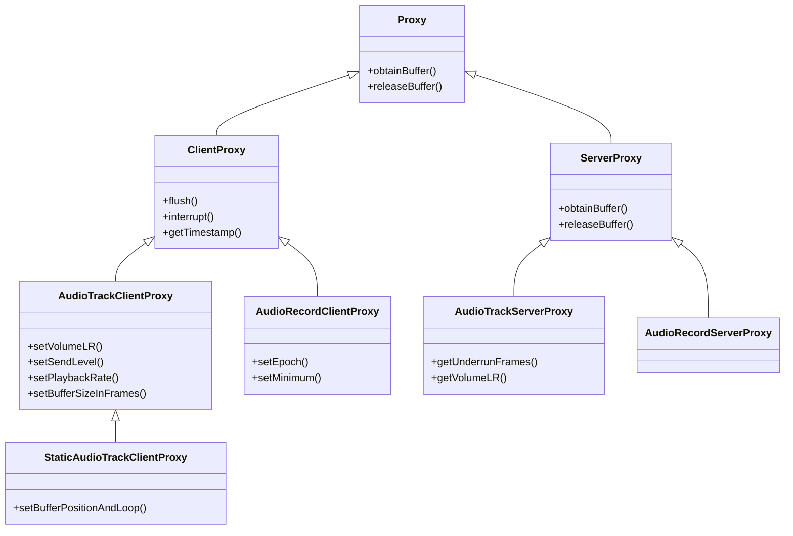

> **Proxy设计意义**：封装共享内存底层volatile操作，Client/Server各自使用不同Proxy防止误操作对方字段

### CBLK标志位详解

| 标志 | 位 | 说明 | 设置者 | 清除者 |
|------|-----|------|--------|--------|
| `CBLK_INVALID` | 0x80 | Track失效需restore | Server/Client | Client(restore后) |
| `CBLK_STREAM_END_DONE` | 0x40 | Offload流结束 | Server | Client(start时) |
| `CBLK_UNDERRUN` | 0x04 | underrun发生 | Server | Client(读取时) |
| `CBLK_LOOP_CYCLE` | 0x02 | 完成一次循环 | Server | Client(回调时) |
| `CBLK_LOOP_FINAL` | 0x01 | 完成最终循环 | Server | Client(回调时) |
| `CBLK_BUFFER_END` | 0x08 | 到达buffer末尾 | Server | Client(回调时) |
| `CBLK_DISABLED` | 0x10 | Track被禁用 | Server | Client(start时) |

> **CBLK_INVALID触发场景**：设备路由变更(蓝牙断开)、AudioFlinger重启(DEAD_OBJECT)、AudioPolicy强制重新路由

### 零拷贝路径总结

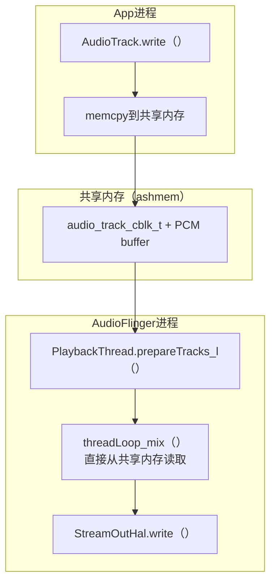

> **零拷贝本质**：数据App→HAL只经一次用户空间拷贝(App→共享内存)，AF直接从共享内存读混音，无需额外进程间拷贝。

---

> [← 上一篇：Java Framework](03_Java_Framework_Layer.md) | [返回导航](README.md) | [下一篇：AudioFlinger →](05_AudioFlinger.md)


┌──────────────────────────────────────────┐
│ audio_track_cblk_t (控制块头部)           │
├──────────────────────────────────────────┤
│ user: App写入帧位置                       │
│ server: AF读取帧位置                      │
│ userBase: App写入基准偏移                  │
│ serverBase: AF读取基准偏移                 │
│ frameCount: buffer总帧数                  │
│ flushCount: flush操作计数                 │
│ ...其他同步字段                            │
├──────────────────────────────────────────┤
│ PCM数据buffer (frameCount * frameSize)   │
│ [帧0][帧1][帧2]...[帧N]                  │
└──────────────────────────────────────────┤


### 共享内存操作流程

mermaid
sequenceDiagram
    participant App, cblk, AF
    App->>cblk: obtainBuffer() → 计算可写入空间
    App->>cblk: memcpy(data, buffer+user) → 写入PCM数据
    App->>cblk: releaseBuffer() → 更新user位置
    AF->>cblk: prepareTracks_l() → 计算可读取数据量
    AF->>cblk: mixer读取buffer+server → 混音处理
    AF->>cblk: 更新server位置


### 内存映射方式
1. **malloc + ashmem**：传统方式，App侧malloc分配，通过ashmem共享给AF
2. **ion/pmem**：某些SoC使用ION内存分配器
3. **NOP映射**：DirectOutputThread/OffloadThread直接映射App buffer到HAL

---

## 4.5 AIDL IPC接口重构 — 从Binder C++到AIDL

AOSP14将音频IPC从传统Binder C++迁移到AIDL（Android Interface Definition Language），这是Treble架构分离的延续。AIDL生成的代码自动处理parceling/unparceling，提供类型安全，并支持稳定的ABI。

### 4.5.1 IAudioFlingerService AIDL接口

源码路径: [`IAudioFlingerService.aidl`](frameworks/av/media/libaudioclient/aidl/android/media/IAudioFlingerService.aidl:32)

#### 方法列表

IAudioFlingerService.aidl定义了AudioFlinger的全部公开IPC接口，共约70个方法：

| 方法分类 | AIDL方法 | 说明 |
|----------|----------|------|
| **Track/Record创建** | `createTrack(CreateTrackRequest)` → `CreateTrackResponse` | 创建播放Track，参数通过parcelable封装 |
| | `createRecord(CreateRecordRequest)` → `CreateRecordResponse` | 创建录制Record，参数通过parcelable封装 |
| **查询** | `sampleRate(ioHandle)` → int | 查询输出采样率 |
| | `format(output)` → AudioFormatDescription | 查询输出格式 |
| | `frameCount(ioHandle)` → long | 查询输出帧数 |
| | `latency(output)` → int | 查询输出延迟(ms) |
| **主音量/静音** | `setMasterVolume(value)` / `masterVolume()` | 主音量控制 |
| | `setMasterMute(muted)` / `masterMute()` | 主静音控制 |
| | `setMasterBalance(balance)` / `getMasterBalance()` | 主左右平衡 |
| **Stream音量** | `setStreamVolume(stream, value, output)` | Stream音量 |
| | `setStreamMute(stream, muted)` / `streamMute(stream)` | Stream静音 |
| **模式/麦克风** | `setMode(mode)` | 设置音频模式 |
| | `setMicMute(state)` / `getMicMute()` | 麦克风静音 |
| **参数** | `setParameters(ioHandle, keyValuePairs)` / `getParameters(...)` | HAL参数设置 |
| **客户端注册** | `registerClient(IAudioFlingerClient)` | 注册IO变更通知 |
| **输出/输入打开** | `openOutput(OpenOutputRequest)` / `openInput(OpenInputRequest)` | 打开HAL输出/输入 |
| **Patch/Port** | `createAudioPatch(patch)` / `releaseAudioPatch(handle)` | 音频路由patch |
| | `getAudioPort(port)` / `setAudioPortConfig(config)` | 音频端口配置 |
| **Effect** | `createEffect(CreateEffectRequest)` / `queryEffect(index)` | 音效创建查询 |
| **系统通知** | `systemReady()` / `audioPolicyReady()` | 系统就绪通知(oneway) |
| **SoundDose** | `getSoundDoseInterface(callback)` → ISoundDose | CSD接口获取 |
| **蓝牙延迟** | `supportsBluetoothVariableLatency()` / `setBluetoothVariableLatencyEnabled(...)` | BT可变延迟 |
| **AAudio MMAP** | `getMmapPolicyInfos(policyType)` / `getAAudioMixerBurstCount()` | MMAP策略查询 |

#### 与传统IAudioFlinger.h对比

[`IAudioFlinger.h`](frameworks/av/media/libaudioclient/include/media/IAudioFlinger.h:69)中的`IAudioFlinger`是纯虚接口类，它定义了与AIDL完全对应的方法签名，但使用C++原生类型（`audio_io_handle_t`、`audio_stream_type_t`等）而非AIDL parcelable类型。

迁移状态对比：

| 项目 | IAudioFlinger.h (Binder C++) | IAudioFlingerService.aidl | 状态 |
|------|------------------------------|---------------------------|------|
| 方法签名 | C++原生类型 | AIDL parcelable类型 | **完全迁移** — 所有方法都有AIDL版本 |
| 参数传递 | 手动parcel/unparcel | AIDL自动生成 | **AIDL优先** |
| 服务注册 | `BnAudioFlinger`(旧) → 已废弃 | [`AudioFlingerServerAdapter`](frameworks/av/media/libaudioclient/include/media/IAudioFlinger.h:513) : `BnAudioFlingerService` | **AIDL路径** |
| 客户端获取 | `BpAudioFlinger`(旧) → 已废弃 | `BpAudioFlingerService`(AIDL生成) | **AIDL路径** |
| 数据类型 | `CreateTrackInput/Output`内部类 | [`CreateTrackRequest`](frameworks/av/media/libaudioclient/aidl/android/media/CreateTrackRequest.aidl:32) / `CreateTrackResponse` parcelable | **AIDL优先** |

> **关键设计**: AOSP14中IAudioFlinger.h不再是独立Binder接口，而是作为[`AudioFlingerServerAdapter::Delegate`](frameworks/av/media/libaudioclient/include/media/IAudioFlinger.h:520)的基类。AudioFlinger类继承Delegate，Adapter将AIDL调用转发到Delegate(即AudioFlinger)的C++方法。

#### IAudioFlingerService创建流程

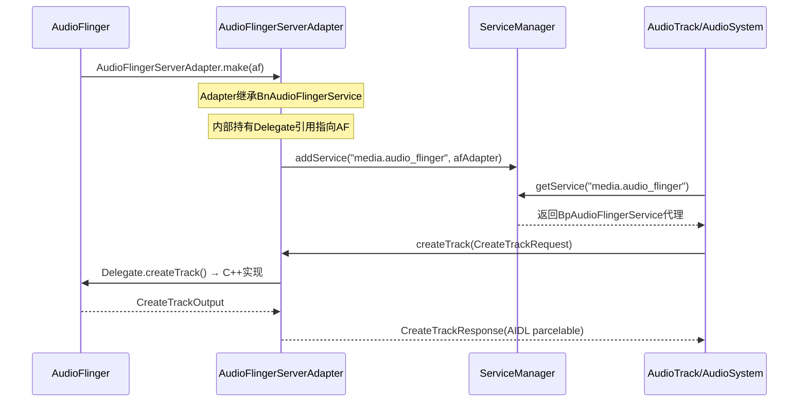

#### 继承体系

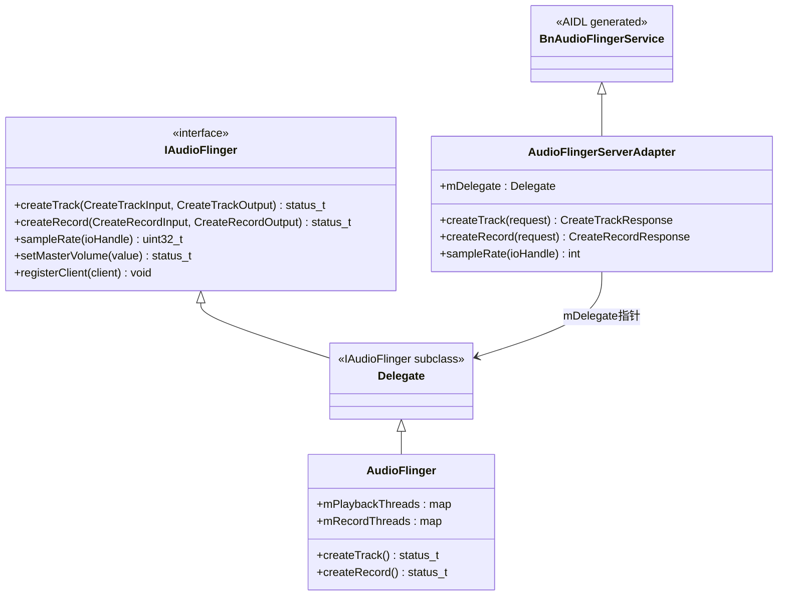

### 4.5.2 IAudioTrackCallback/IAudioRecordCallback — Track/Record事件回调

源码: [`IAudioTrackCallback.aidl`](frameworks/av/media/libaudioclient/aidl/android/media/IAudioTrackCallback.aidl:25)

#### IAudioTrackCallback方法

IAudioTrackCallback.aidl目前定义了一个方法：

| 方法 | 说明 |
|------|------|
| `onCodecFormatChanged(byte[] audioMetadata)` | 编码格式变更通知（oneway异步） |

> **注意**: 传统Binder C++版本的IAudioTrackCallback包含更多回调：`onStreamEnd()`、`onUnderrun()`、`onOverflow()`。AIDL版本仅迁移了`onCodecFormatChanged`，其他回调仍通过共享内存+cblk机制间接通知（underrun计数通过`audio_track_cblk_t`字段传递）。

#### 回调注册时机

[`CreateTrackRequest.aidl`](frameworks/av/media/libaudioclient/aidl/android/media/CreateTrackRequest.aidl:39)中包含`IAudioTrackCallback audioTrackCallback`字段，在`createTrack()`调用时一并传入：

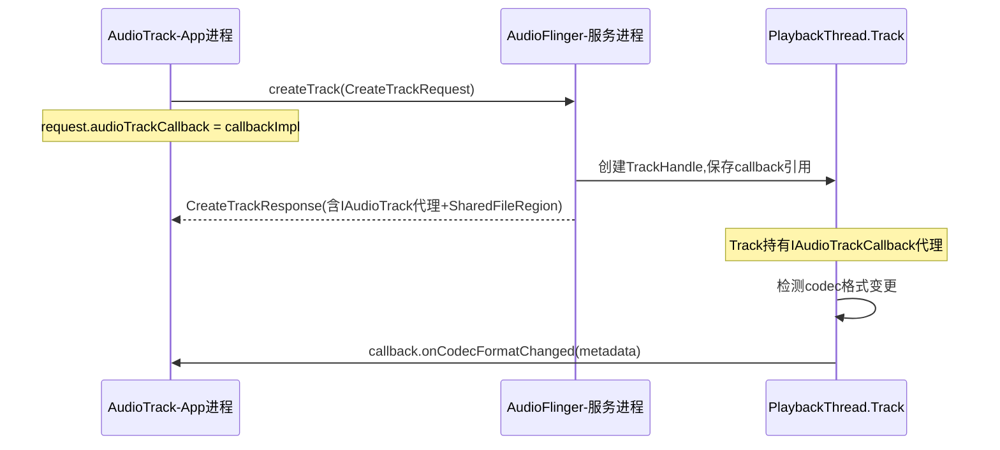

#### IAudioRecord回调

[`IAudioRecord.aidl`](frameworks/av/media/libaudioclient/aidl/android/media/IAudioRecord.aidl:26)定义了录制端接口，方法包括`start()`、`stop()`、`getActiveMicrophones()`、`setPreferredMicrophoneDirection()`、`setPreferredMicrophoneFieldDimension()`、`shareAudioHistory()`。录制端无独立callback AIDL接口， overrun/格式变更通过类似机制处理。

### 4.5.3 IAudioFlingerClient — AudioFlinger客户端通知

源码: [`IAudioFlingerClient.aidl`](frameworks/av/media/libaudioclient/aidl/android/media/IAudioFlingerClient.aidl:30)

#### 方法列表

| 方法 | 说明 |
|------|------|
| `ioConfigChanged(AudioIoConfigEvent event, AudioIoDescriptor ioDesc)` | IO配置变更通知(输出打开/关闭/路由变更)，oneway异步 |
| `onSupportedLatencyModesChanged(int output, AudioLatencyMode[] latencyModes)` | 输出流支持的延迟模式变更通知，oneway异步 |

#### 客户端注册时机

[`IAudioFlingerService.aidl`](frameworks/av/media/libaudioclient/aidl/android/media/IAudioFlingerService.aidl:93)中的`registerClient(IAudioFlingerClient)`方法用于注册。AudioSystem初始化时调用此方法，每个进程只允许注册一次（单例模式）。

#### AudioFlinger死亡通知链路

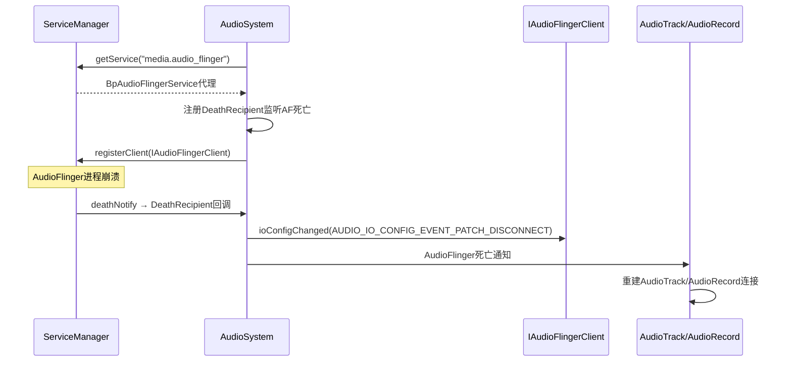

### 4.5.4 AIDL vs Binder C++接口对比

#### 对比表

| 维度 | Binder C++ (旧) | AIDL (新) |
|------|------------------|-----------|
| **代码生成** | 手工编写Bn/Bp代理 | AIDL工具自动生成Bn/Bp |
| **类型安全** | 手动parcel，易出错 | 编译期类型检查 |
| **ABI稳定性** | 无保证，布局变化即break | Stable AIDL，跨版本兼容 |
| **性能** | 直接C++调用，零转换开销 | 需AidlConversion层转换类型 |
| **参数复杂度** | flat参数列表 | parcelable封装，结构化 |
| **回调机制** | BpCallback手动parcel | AIDL oneway自动生成 |
| **维护成本** | 高 — 需同步更新.h/.cpp | 低 — 修改aidl即可 |

#### 向后兼容策略

AudioFlingerServerAdapter是过渡期的核心桥梁，它实现了"双路径"架构：

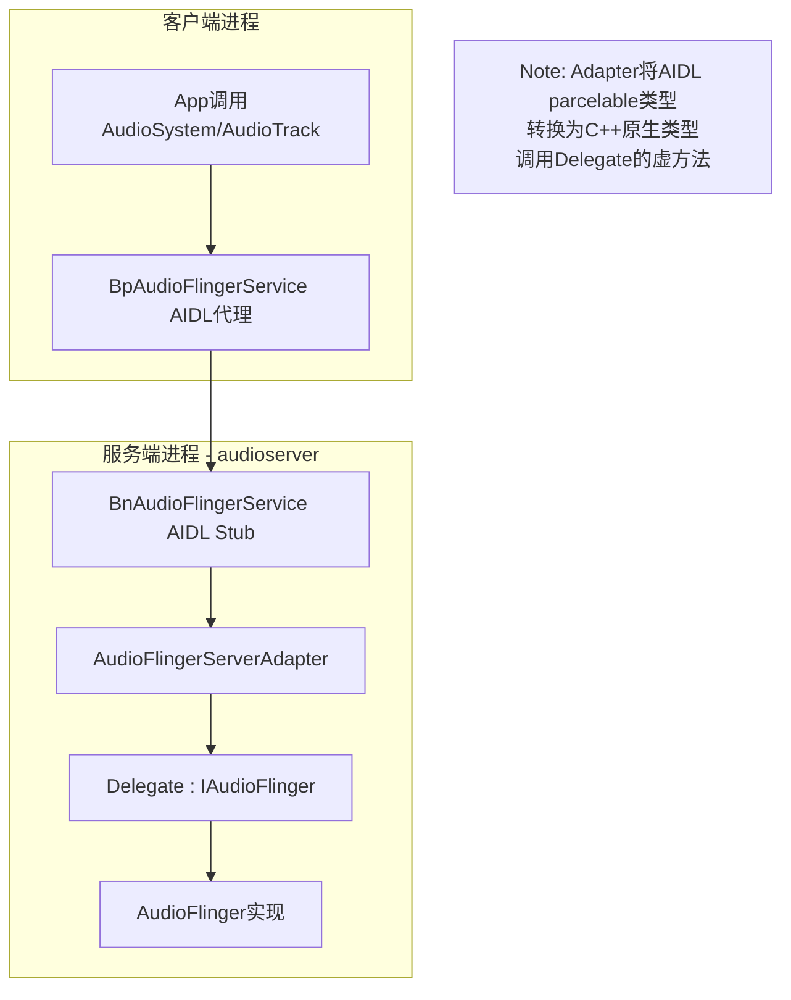

> **AidlConversion层**: [`AidlConversion.h`](frameworks/av/media/libaudioclient/include/media/AidlConversion.h)提供`convertToAidl()`/`convertFromAidl()`模板函数，在Adapter层完成`audio_stream_type_t`↔`AudioStreamType`、`audio_config_t`↔`AudioConfig`等类型双向转换。这是AIDL迁移的性能开销所在。

---

## 4.6 audio_utils核心工具类

源码目录: [`system/media/audio_utils/include/audio_utils/`](system/media/audio_utils/include/audio_utils/)

audio_utils是AOSP音频子系统的底层工具库，被AudioFlinger、AudioPolicyManager、AudioMixer等大量使用。04章作为Native Framework层，需要覆盖这些关键基础设施。

### 4.6.1 ChannelMix — 多声道混音矩阵

源码: [`ChannelMix.h`](system/media/audio_utils/include/audio_utils/ChannelMix.h:21)

#### 声道掩码→混音矩阵映射

[`ChannelMix.h`](system/media/audio_utils/include/audio_utils/ChannelMix.h:36)的核心函数是`fillChannelMatrix<OUTPUT_CHANNEL_MASK>()`，它以编译期模板参数（INPUT/OUTPUT声道掩码）生成混音系数矩阵：

```
模板签名:
template <audio_channel_mask_t OUTPUT_CHANNEL_MASK, size_t M>
constexpr bool fillChannelMatrix(
    audio_channel_mask_t INPUT_CHANNEL_MASK,
    float (&matrix)[M][outputChannelCount])
```

#### 5.1→Stereo下混矩阵

以5.1→2.0下混为例（符合ITU-R 775-2、ATSC A/52标准）：

| 输入声道 | FL输出系数 | FR输出系数 | 说明 |
|----------|-----------|-----------|------|
| Front Left | 1.0 | 0 | 直通 |
| Front Right | 0 | 1.0 | 直通 |
| Front Center | 0.707 (√2/2) | 0.707 | -3dB等功率分配 |
| LFE | 0.5 | 0.5 | 半幅混入(防扬声器过载) |
| Back Left | 0.707 | 0 | -3dB侧声道 |
| Back Right | 0 | 0.707 | -3dB侧声道 |

> `-3dB = √2/2 ≈ 0.707` 是等功率分配系数：中心声道同时送入L和R，每路减半功率以保持总功率不变。

#### sparseChannelMatrixMultiply

[`sparseChannelMatrixMultiply`](system/media/audio_utils/include/audio_utils/ChannelMix.h:26)是编译期优化的混音执行函数，利用模板特化避免运行时switch分支，直接生成针对特定声道组合的SIMD优化代码。

#### 与AudioMixer的调用关系

AudioMixer在混音过程中，当Track声道数与输出声道数不匹配时调用ChannelMix进行声道转换：

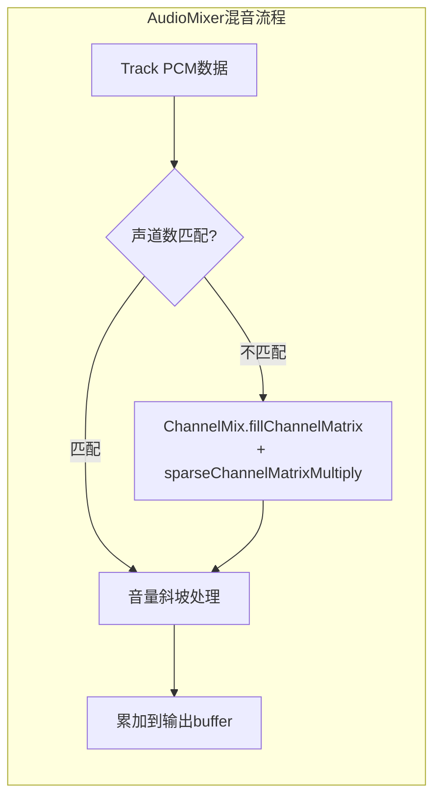

### 4.6.2 resampler — 采样率转换引擎

AOSP音频子系统有**两套**SRC实现：

1. **audio_utils/resampler** (C API): [`resampler.h`](system/media/audio_utils/include/audio_utils/resampler.h:62) — 用于RecordBufferConverter，面向录音路径
2. **AudioResampler** (C++ API): [`AudioResampler.h`](frameworks/av/media/libaudioprocessing/include/media/AudioResampler.h:32) — 用于AudioMixer/PlaybackThread，面向播放路径

#### 3种SRC实现 (AudioResampler体系)

| 实现类 | 质量 | 算法 | 用途 |
|--------|------|------|------|
| [`AudioResamplerOrder1`](frameworks/av/media/libaudioprocessing/AudioResampler.cpp:43) | LOW | 线性插值(1阶) | VoIP/低延迟场景 |
| [`AudioResamplerCubic`](frameworks/av/media/libaudioprocessing/AudioResamplerCubic.h:29) | MED | 三次插值(3阶) | 一般播放 |
| [`AudioResamplerSinc`](frameworks/av/media/libaudioprocessing/AudioResamplerSinc.h:35) | HIGH/VERY_HIGH | 多相FIR(Polyphase) | 高质量重采样 |
| [`AudioResamplerDyn`](frameworks/av/media/libaudioprocessing/AudioResamplerDyn.h:42) | DYN_LOW/MED/HIGH | 动态FIR | 多声道动态采样率 |

#### quality常量映射

[`resampler.h`](system/media/audio_utils/include/audio_utils/resampler.h:26)定义了质量等级常量：

| 常量 | 值 | 说明 |
|------|---|------|
| `RESAMPLER_QUALITY_MAX` | 10 | 最高质量上限 |
| `RESAMPLER_QUALITY_DEFAULT` | 4 | 默认(FIR) |
| `RESAMPLER_QUALITY_VOIP` | 3 | VoIP(低延迟优先) |
| `RESAMPLER_QUALITY_DESKTOP` | 5 | 桌面级 |

#### AudioResamplerSinc内部架构 (Polyphase FIR)

AudioResamplerSinc采用多相分解(Polyphase decomposition)实现FIR重采样：
- 将长FIR滤波器分解为N个短子滤波器(phase)
- 输入帧的fractional位置决定选择哪个phase
- 内置系数表：48KHz→44.1KHz等常见转换有专用系数

#### 与PlaybackThread的调用链

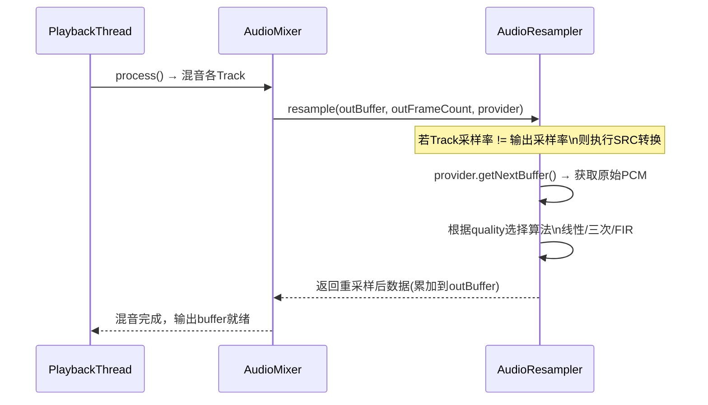

### 4.6.3 fifo — 共享内存FIFO

源码: [`fifo.h`](system/media/audio_utils/include/audio_utils/fifo.h:46)

#### audio_utils::fifo与audio_track_cblk_t的关系

`audio_utils::fifo`是4.4节中`audio_track_cblk_t`共享内存机制的**底层抽象**。`cblk_t`中的`user`/`server`索引本质上就是fifo的producer/consumer索引：

| 机制 | Producer(写端) | Consumer(读端) | 索引同步 |
|------|----------------|----------------|----------|
| `audio_track_cblk_t` | App(AudioTrack) | AF(PlaybackThread) | user/server字段 |
| `audio_utils::fifo` | `fifo_writer` | `fifo_reader` | `mWriterRear`/`mThrottleFront` |

#### FIFO框架类体系

[`fifo.h`](system/media/audio_utils/include/audio_utils/fifo.h:46)定义了三个层次：

| 类 | 说明 |
|----|------|
| [`audio_utils_fifo_base`](system/media/audio_utils/include/audio_utils/fifo.h:46) | 索引管理基类，仅操作frame索引，不涉及buffer |
| [`audio_utils_fifo`](system/media/audio_utils/include/audio_utils/fifo.h:144) | 知晓frameSize和buffer指针，不拥有buffer |
| `audio_utils_fifo_writer` / `audio_utils_fifo_reader` | 写入/读取操作类 |

#### 同步模式

[`audio_utils_fifo_sync`](system/media/audio_utils/include/audio_utils/fifo.h:29)枚举定义了四种同步策略：

| 模式 | 值 | 说明 | 适用场景 |
|------|---|------|----------|
| `SINGLE_THREADED` | 0 | 无同步，单线程 | 单线程测试 |
| `SLEEP` | 1 | clock_nanosleep轮询 | 单进程阻塞 |
| `PRIVATE` | 2 | futex，单进程 | 同进程多线程 |
| `SHARED` | 3 | futex，跨进程共享内存 | **AudioTrack与AF间** |

> `SHARED`模式是AudioTrack共享内存的核心同步机制。Producer(App)和Consumer(AF)通过共享内存中的futex word进行跨进程唤醒/等待。

#### 与4.4节共享内存机制的关联

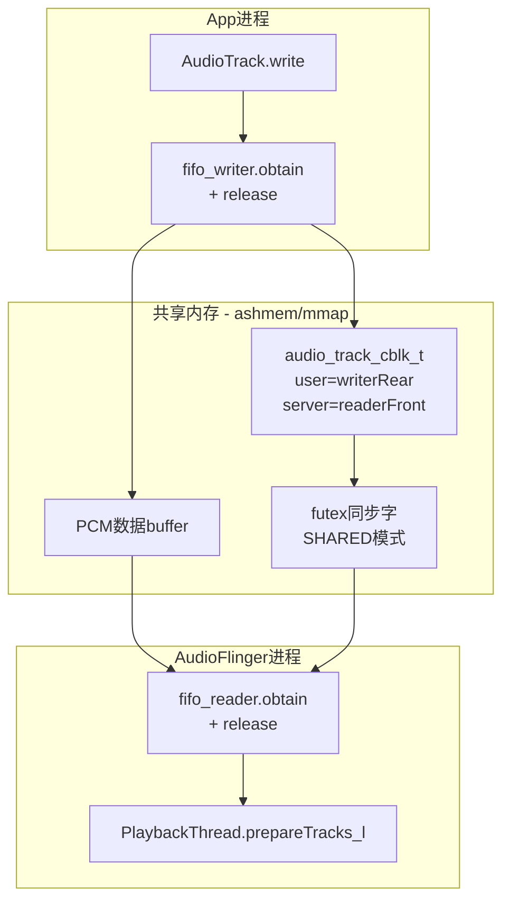

### 4.6.4 其他关键工具类速查

| 类名 | 头文件 | 说明 | 被谁使用 |
|------|--------|------|----------|
| [`BiquadFilter`](system/media/audio_utils/include/audio_utils/BiquadFilter.h:46) | BiquadFilter.h | 3级Biquad IIR滤波器，支持NEON优化 | SoundDose A-weighting(声剂量A计权) |
| [`Balance`](system/media/audio_utils/include/audio_utils/Balance.h:28) | Balance.h | 左右声道平衡控制 | AudioFlinger setMasterBalance() |
| [`Statistics`](system/media/audio_utils/include/audio_utils/Statistics.h:254) | Statistics.h | 统计采样(均值/方差/峰值) | underrun统计、AudioMixer性能分析 |
| [`TimestampVerifier`](system/media/audio_utils/include/audio_utils/TimestampVerifier.h:35) | TimestampVerifier.h | 时间戳连续性验证 | AAudio MMAP模式时间戳校验 |
| [`PowerLog`](system/media/audio_utils/include/audio_utils/PowerLog.h:41) | PowerLog.h | 功率日志(周期性记录功率值) | SoundDose Mel计算日志 |
| LogPlot | [`LogPlot.h`](system/media/audio_utils/include/audio_utils/LogPlot.h:28) | 功率数据可视化(文本图表) | SoundDose调试输出 |

> **BiquadFilter**: SoundDose模块使用3级Biquad IIR实现A计权滤波(A-weighting)，将频域功率转换为感知响度等级，用于CSD(Continuous Sound Dose)安全监测。

---

> [← 上一篇：Java Framework](03_Java_Framework_Layer.md) | [返回导航](README.md) | [下一篇：AudioFlinger →](05_AudioFlinger.md)