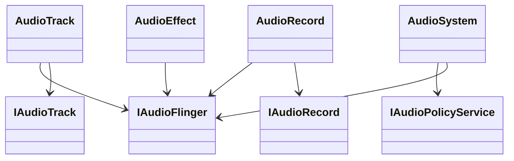
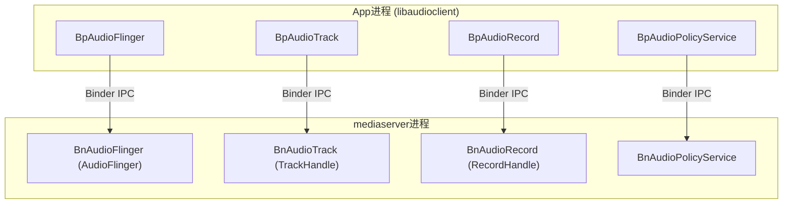
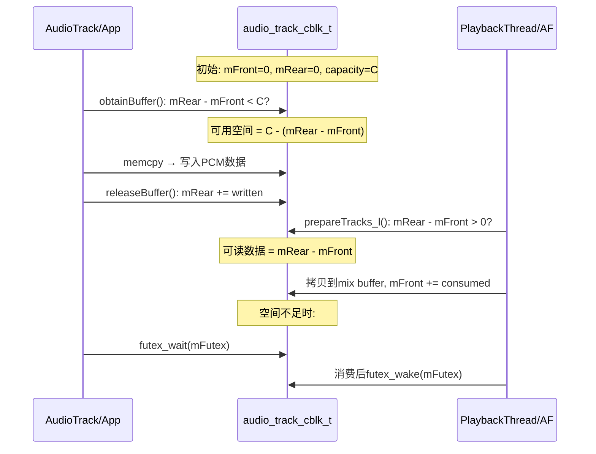
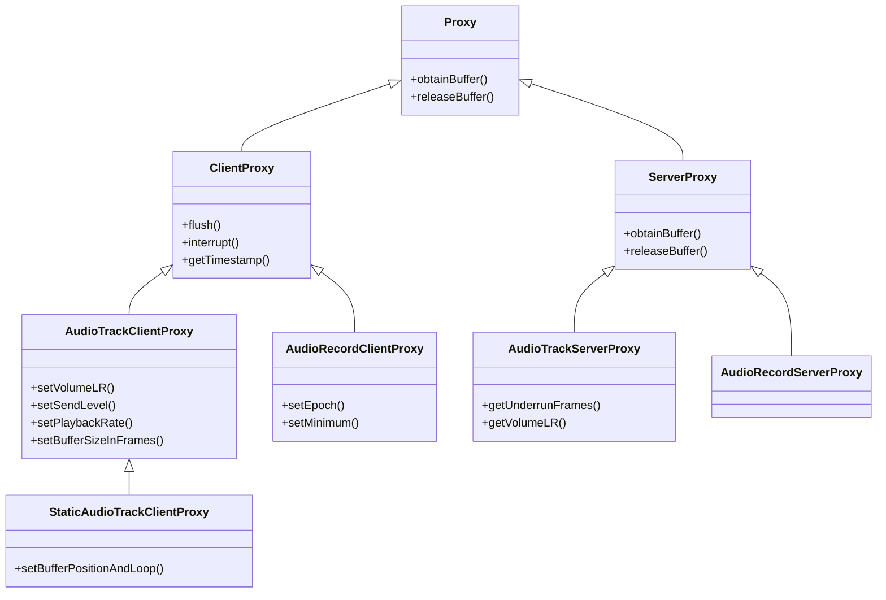
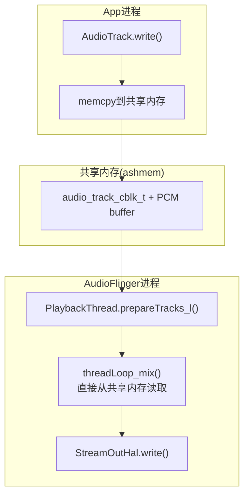

# 第四篇：Native Framework Layer

> [← 上一篇：Java Framework](03_Java_Framework_Layer.md) | [返回导航](README.md) | [下一篇：AudioFlinger →](05_AudioFlinger.md)

---

## 4.1 JNI Bridge — Java到Native的桥梁

### 模块职责
JNI层将Java层的音频API调用转换为Native C++层的实际操作，是App进程进入Native世界的必经之路。

### 核心JNI文件

| Java类 | JNI文件 | 关键方法 |
|--------|---------|----------|
| AudioTrack | `android_media_AudioTrack.cpp` | native_setup, native_start, native_write |
| AudioRecord | `android_media_AudioRecord.cpp` | native_setup, native_start, native_read |
| AudioEffect | `android_media_AudioEffect.cpp` | native_create, native_command |
| AudioSystem | `android_media_AudioSystem.cpp` | native_setParameters, native_getParameters |

### JNI调用模式

```mermaid
graph LR
    subgraph Java
        AT_J["AudioTrack.play()"]
    end
    subgraph JNI
        JNI["android_media_AudioTrack_start()"]
    end
    subgraph Native
        AT_N["NativeAudioTrack.start()"]
    end
    AT_J -->|"JNI Call"| JNI -->|"sp<AudioTrack>"| AT_N
```

**关键设计**：JNI层持有Native对象的`sp<>`智能指针，通过`jlong`传递给Java层（Java只看到一个long值，不直接操作Native对象）。

---

## 4.2 libaudioclient — Native音频客户端库

### 模块职责
libaudioclient是App进程使用的Native音频客户端库，封装了与AudioFlinger和AudioPolicyService的Binder IPC通信。

### 核心类



### AudioTrack Native核心流程

#### 创建Track（[`AudioTrack::createTrack_l()`](frameworks/av/media/libaudioclient/AudioTrack.cpp:1807)）

```mermaid
sequenceDiagram
    participant App, NativeAT, AF, APS, APM
    App->>NativeAT: set() → createTrack_l()
    NativeAT->>AF: IAudioFlinger.createTrack() [Binder]
    AF->>APS: getOutputForAttr() [内部Binder]
    APS->>APM: getOutputForAttr()
    APM-->>APS: outputId + portId
    APS-->>AF: 路由结果
    AF->>AF: 创建PlaybackThread::Track
    AF-->>NativeAT: IAudioTrack + cblk共享内存
    NativeAT->>NativeAT: 构造Proxy，映射共享内存
```

#### 写入数据（AudioTrack::write）

```
AudioTrack.write(data, size)
  → obtainBuffer()  // 从cblk获取可用写入位置
  → memcpy(data, cblkBuffer+user, size)  // 写入共享内存
  → releaseBuffer()  // 更新cblk.user位置
  → 无Binder调用！纯共享内存操作
```

**关键洞察**：数据传输阶段完全没有Binder调用，纯共享内存操作，这就是零拷贝的核心。

### AudioSystem — Native音频系统接口

AudioSystem是Native层的"AudioManager"，封装了与AudioPolicyService的通信：

| 方法 | 目标 | 用途 |
|------|------|------|
| `getOutputForAttr()` | APS | 获取输出流ID |
| `getInputForAttr()` | APS | 获取输入流ID |
| `setDeviceConnectionState()` | APS | 设备连接状态 |
| `setParameters()` | AF | 设置键值对参数 |
| `getParameters()` | AF | 获取键值对参数 |

---

## 4.3 Binder IPC机制

### 音频系统Binder接口体系



### Binder接口详细方法

#### IAudioFlinger

| 方法 | 说明 |
|------|------|
| `createTrack()` | 创建播放Track |
| `createRecord()` | 创建采集Record |
| `openOutput()` | 打开输出流 |
| `openInput()` | 打开输入流 |
| `createAudioPatch()` | 创建音频路由Patch |
| `setStreamVolume()` | 设置音量 |
| `setParameters()` | 设置参数键值对 |

#### IAudioTrack

| 方法 | 说明 |
|------|------|
| `start()` | 开始播放 |
| `stop()` | 停止播放 |
| `pause()` | 暂停 |
| `flush()` | 清空buffer |
| `write()` | 非共享内存模式写入 |

#### IAudioPolicyService

| 方法 | 说明 |
|------|------|
| `getOutputForAttr()` | 获取输出路由 |
| `getInputForAttr()` | 获取输入路由 |
| `setDeviceConnectionState()` | 设备连接状态 |
| `setVolumeIndexForAttributes()` | 音量设置 |
| `registerClient()` | 注册客户端监听 |

---

## 4.4 共享内存机制深度解析

### audio_track_cblk_t — 共享内存控制块详解

[`AudioTrackShared.h:207-279`](frameworks/av/include/private/media/AudioTrackShared.h:207)

```
┌────────────────────────────────────────────────────────┐
│ audio_track_cblk_t (控制块头部 ~128字节)               │
├────────────────────────────────────────────────────────┤
│ mServer: AF已消费帧数(异步更新,仅供参考)               │
│ mFutex: 事件标志, Client等待(P)/Server唤醒(V)         │
│ mMinimum: Server唤醒Client的最低可用空间阈值            │
│ mVolumeLR: 立体声音量(AudioTrack专用)                  │
│ mSampleRate: App请求的采样率                            │
│ mPlaybackRateQueue: 播放速率状态队列                    │
│ mSendLevel: 辅助效果发送电平                            │
│ mExtendedTimestampQueue: 扩展时间戳队列                │
│ mBufferSizeInFrames: 有效buffer大小(可动态调整)        │
│ mStartThresholdInFrames: 开始播放最小帧数阈值          │
│ mFlags: CBLK_*标志组合                                 │
│ mState: TrackBase当前状态(atomic)                      │
├────────────────────────────────────────────────────────┤
│ AudioTrackSharedStreaming / Static (union)              │
│   Streaming: mFront/mRear/mFlush/mStop                 │
│             mUnderrunFrames/mUnderrunCount             │
│   Static: mSingleStateQueue/mPosLoopQueue              │
├────────────────────────────────────────────────────────┤
│ PCM数据buffer (frameCount * frameSize字节)             │
│ [帧0][帧1][帧2]...[帧N] 环形缓冲区                    │
└────────────────────────────────────────────────────────┘
```

### Streaming模式FIFO同步机制

[`AudioTrackShared.h:134-145`](frameworks/av/include/private/media/AudioTrackShared.h:134)

**核心：mFront/mRear环形缓冲区位置同步**



**核心同步原语**：
- `volatile int32_t mFront/mRear`：无锁同步，原子读写
- `mFutex`：Linux futex系统调用实现高效等待/唤醒
- `mFlush`：Client发出flush，Server检测后丢弃数据
- `mStop`：Client标记stop位置，Server不读超过此位置

### Proxy体系详解

Proxy是AudioTrack/AudioRecord操作共享内存的抽象层：



> **Proxy设计意义**：封装共享内存底层volatile操作，Client/Server各自使用不同Proxy防止误操作对方字段

### CBLK标志位详解

| 标志 | 位 | 说明 | 设置者 | 清除者 |
|------|-----|------|--------|--------|
| `CBLK_INVALID` | 0x80 | Track失效需restore | Server/Client | Client(restore后) |
| `CBLK_STREAM_END_DONE` | 0x40 | Offload流结束 | Server | Client(start时) |
| `CBLK_UNDERRUN` | 0x04 | underrun发生 | Server | Client(读取时) |
| `CBLK_LOOP_CYCLE` | 0x02 | 完成一次循环 | Server | Client(回调时) |
| `CBLK_LOOP_FINAL` | 0x01 | 完成最终循环 | Server | Client(回调时) |
| `CBLK_BUFFER_END` | 0x08 | 到达buffer末尾 | Server | Client(回调时) |
| `CBLK_DISABLED` | 0x10 | Track被禁用 | Server | Client(start时) |

> **CBLK_INVALID触发场景**：设备路由变更(蓝牙断开)、AudioFlinger重启(DEAD_OBJECT)、AudioPolicy强制重新路由

### 零拷贝路径总结



> **零拷贝本质**：数据App→HAL只经一次用户空间拷贝(App→共享内存)，AF直接从共享内存读混音，无需额外进程间拷贝。

---

> [← 上一篇：Java Framework](03_Java_Framework_Layer.md) | [返回导航](README.md) | [下一篇：AudioFlinger →](05_AudioFlinger.md)

```
┌──────────────────────────────────────────┐
│ audio_track_cblk_t (控制块头部)           │
├──────────────────────────────────────────┤
│ user: App写入帧位置                       │
│ server: AF读取帧位置                      │
│ userBase: App写入基准偏移                  │
│ serverBase: AF读取基准偏移                 │
│ frameCount: buffer总帧数                  │
│ flushCount: flush操作计数                 │
│ ...其他同步字段                            │
├──────────────────────────────────────────┤
│ PCM数据buffer (frameCount * frameSize)   │
│ [帧0][帧1][帧2]...[帧N]                  │
└──────────────────────────────────────────┤
```

### 共享内存操作流程

```mermaid
sequenceDiagram
    participant App, cblk, AF
    App->>cblk: obtainBuffer() → 计算可写入空间
    App->>cblk: memcpy(data, buffer+user) → 写入PCM数据
    App->>cblk: releaseBuffer() → 更新user位置
    AF->>cblk: prepareTracks_l() → 计算可读取数据量
    AF->>cblk: mixer读取buffer+server → 混音处理
    AF->>cblk: 更新server位置
```

### 内存映射方式
1. **malloc + ashmem**：传统方式，App侧malloc分配，通过ashmem共享给AF
2. **ion/pmem**：某些SoC使用ION内存分配器
3. **NOP映射**：DirectOutputThread/OffloadThread直接映射App buffer到HAL

---

> [← 上一篇：Java Framework](03_Java_Framework_Layer.md) | [返回导航](README.md) | [下一篇：AudioFlinger →](05_AudioFlinger.md)