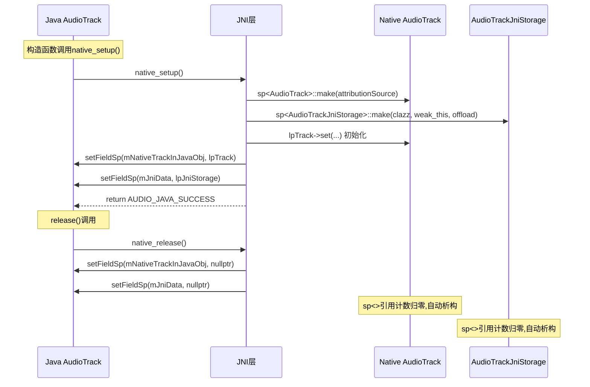
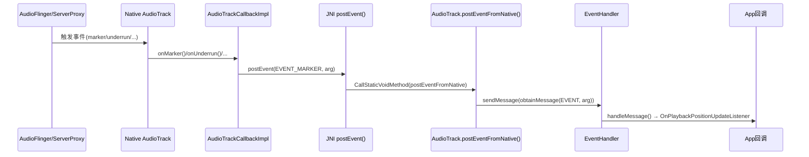
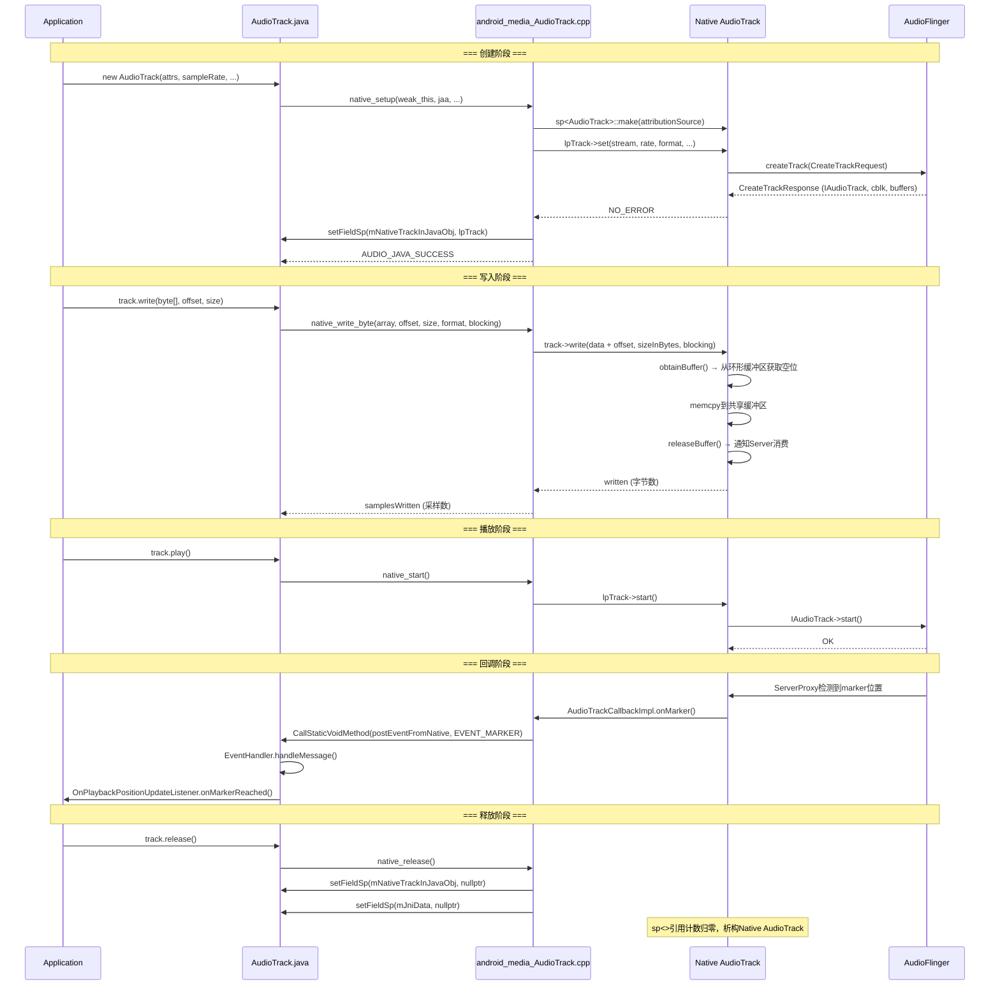

[← 03章 Java Framework Layer](../03_Java_Framework_Layer/README.md) | [← 返回Native Framework Layer](README.md) | [返回导航](../README.md) | [4.2 libaudioclient →](04_4.2_libaudioclient-Native音频客户端库.md)

## 4.1 JNI Bridge — Java到Native的桥梁

### 模块职责与源码位置

JNI层是Android音频系统中Java世界与Native C++世界之间的桥梁。当App进程调用`AudioTrack.write()`或`AudioRecord.read()`时，调用链经过JNI层进入Native AudioTrack/AudioRecord，再通过Binder IPC到达AudioFlinger。

**核心JNI文件列表：**

| Java类 | JNI文件 | 源码行数 | 关键JNI函数 |
|--------|---------|----------|-------------|
| AudioTrack | [`android_media_AudioTrack.cpp`](frameworks/base/core/jni/android_media_AudioTrack.cpp) | 1598 | native_setup/start/write/stop/pause/flush/release |
| AudioRecord | [`android_media_AudioRecord.cpp`](frameworks/base/core/jni/android_media_AudioRecord.cpp) | 914 | native_setup/start/read/stop/release |
| AudioEffect | `android_media_AudioEffect.cpp` | ~1200 | native_create/command/getParameter |
| AudioSystem | `android_media_AudioSystem.cpp` | ~600 | native_setParameters/getParameters |

---

### 4.1.1 JNI方法注册机制

JNI方法的注册在进程启动时由Android Runtime完成，采用**静态注册表**方式。

#### AudioTrack JNI注册

[`register_android_media_AudioTrack()`](frameworks/base/core/jni/android_media_AudioTrack.cpp:1557) 在进程启动时被调用：

```cpp
// frameworks/base/core/jni/android_media_AudioTrack.cpp:1557
int register_android_media_AudioTrack(JNIEnv *env)
{
    // 1. 注册所有native方法
    int res = RegisterMethodsOrDie(env, kClassPathName, gMethods, NELEM(gMethods));

    // 2. 缓存Java类的字段ID和方法ID
    jclass audioTrackClass = FindClassOrDie(env, kClassPathName);

    // 3. 获取postEventFromNative静态方法ID
    javaAudioTrackFields.postNativeEventInJava = GetStaticMethodIDOrDie(env,
            audioTrackClass, "postEventFromNative",
            "(Ljava/lang/Object;IIILjava/lang/Object;)V");

    // 4. 获取mNativeTrackInJavaObj字段ID (存储Native AudioTrack指针)
    javaAudioTrackFields.nativeTrackInJavaObj = GetFieldIDOrDie(env,
            audioTrackClass, "mNativeTrackInJavaObj", "J");

    // 5. 获取mJniData字段ID (存储JNI Storage指针)
    javaAudioTrackFields.jniData = GetFieldIDOrDie(env,
            audioTrackClass, "mJniData", "J");

    // 6. 获取mStreamType字段ID
    javaAudioTrackFields.fieldStreamType = GetFieldIDOrDie(env,
            audioTrackClass, "mStreamType", "I");
    ...
}
```

#### AudioTrack JNI方法注册表

[`gMethods[]`](frameworks/base/core/jni/android_media_AudioTrack.cpp:1449) 定义了所有native方法映射（共44个方法）：

| Java native方法 | JNI签名 | C++实现函数 |
|----------------|---------|------------|
| `native_setup` | `(Ljava/lang/Object;...Ljava/lang/String;)I` | [`android_media_AudioTrack_setup()`](frameworks/base/core/jni/android_media_AudioTrack.cpp:243) |
| `native_start` | `()V` | [`android_media_AudioTrack_start()`](frameworks/base/core/jni/android_media_AudioTrack.cpp:521) |
| `native_stop` | `()V` | [`android_media_AudioTrack_stop()`](frameworks/base/core/jni/android_media_AudioTrack.cpp:536) |
| `native_pause` | `()V` | [`android_media_AudioTrack_pause()`](frameworks/base/core/jni/android_media_AudioTrack.cpp:551) |
| `native_flush` | `()V` | [`android_media_AudioTrack_flush()`](frameworks/base/core/jni/android_media_AudioTrack.cpp:566) |
| `native_write_byte` | `([BIIIZ)I` | [`android_media_AudioTrack_writeArray<jbyteArray>`](frameworks/base/core/jni/android_media_AudioTrack.cpp:679) |
| `native_write_short` | `([SIIIZ)I` | [`android_media_AudioTrack_writeArray<jshortArray>`](frameworks/base/core/jni/android_media_AudioTrack.cpp:679) |
| `native_write_float` | `([FIIIZ)I` | [`android_media_AudioTrack_writeArray<jfloatArray>`](frameworks/base/core/jni/android_media_AudioTrack.cpp:679) |
| `native_write_native_bytes` | `(Ljava/nio/ByteBuffer;IIIZ)I` | [`android_media_AudioTrack_write_native_bytes()`](frameworks/base/core/jni/android_media_AudioTrack.cpp:721) |
| `native_release` | `()V` | [`android_media_AudioTrack_release()`](frameworks/base/core/jni/android_media_AudioTrack.cpp:594) |
| `native_setVolume` | `(FF)V` | [`android_media_AudioTrack_set_volume()`](frameworks/base/core/jni/android_media_AudioTrack.cpp:580) |
| `native_get_position` | `()I` | `android_media_AudioTrack_get_position` |
| `native_get_timestamp` | `([J)I` | `android_media_AudioTrack_get_timestamp` |
| `native_applyVolumeShaper` | `(LVolumeShaper$Configuration;LVolumeShaper$Operation;)I` | `android_media_AudioTrack_apply_volume_shaper` |

#### AudioRecord JNI方法注册表

[`gMethods[]`](frameworks/base/core/jni/android_media_AudioRecord.cpp:823) 定义了AudioRecord的native方法映射（共26个方法）：

| Java native方法 | JNI签名 | C++实现函数 |
|----------------|---------|------------|
| `native_setup` | `(Ljava/lang/Object;...JII)I` | [`android_media_AudioRecord_setup()`](frameworks/base/core/jni/android_media_AudioRecord.cpp:143) |
| `native_start` | `(II)I` | [`android_media_AudioRecord_start()`](frameworks/base/core/jni/android_media_AudioRecord.cpp:321) |
| `native_stop` | `()V` | [`android_media_AudioRecord_stop()`](frameworks/base/core/jni/android_media_AudioRecord.cpp:336) |
| `native_read_in_byte_array` | `([BIIZ)I` | [`android_media_AudioRecord_readInArray<jbyteArray>`](frameworks/base/core/jni/android_media_AudioRecord.cpp:408) |
| `native_read_in_short_array` | `([SIIZ)I` | [`android_media_AudioRecord_readInArray<jshortArray>`](frameworks/base/core/jni/android_media_AudioRecord.cpp:408) |
| `native_read_in_float_array` | `([FIIZ)I` | [`android_media_AudioRecord_readInArray<jfloatArray>`](frameworks/base/core/jni/android_media_AudioRecord.cpp:408) |
| `native_read_in_direct_buffer` | `(Ljava/lang/Object;IZ)I` | [`android_media_AudioRecord_readInDirectBuffer()`](frameworks/base/core/jni/android_media_AudioRecord.cpp:450) |
| `native_release` | `()V` | [`android_media_AudioRecord_release()`](frameworks/base/core/jni/android_media_AudioRecord.cpp:352) |
| `native_get_min_buff_size` | `(III)I` | [`android_media_AudioRecord_get_min_buff_size()`](frameworks/base/core/jni/android_media_AudioRecord.cpp:558) |
| `native_get_timestamp` | `(LAudioTimestamp;I)I` | `android_media_AudioRecord_get_timestamp` |
| `native_get_active_microphones` | `(Ljava/util/ArrayList;)I` | `android_media_AudioRecord_get_active_microphones` |

---

### 4.1.2 Java对象与Native对象的关联机制

JNI层的核心设计是**将Native C++对象的指针存储在Java对象的long字段中**，Java层只看到一个64位整数。

#### audio_track_fields_t 结构体

[`audio_track_fields_t`](frameworks/base/core/jni/android_media_AudioTrack.cpp:55) 定义了JNI层需要访问的Java字段：

```cpp
struct audio_track_fields_t {
    jmethodID postNativeEventInJava;  // AudioTrack.postEventFromNative() 方法ID
    jfieldID  nativeTrackInJavaObj;   // mNativeTrackInJavaObj - 存储Native AudioTrack的sp<>指针
    jfieldID  jniData;                // mJniData - 存储AudioTrackJniStorage的sp<>指针
    jfieldID  fieldStreamType;        // mStreamType - 流类型字段
};
```

#### 对象存取辅助函数

[`getAudioTrack()`](frameworks/base/core/jni/android_media_AudioTrack.cpp:231) 从Java对象中取出Native AudioTrack的智能指针：

```cpp
sp<AudioTrack> getAudioTrack(JNIEnv* env, jobject thiz) {
    return getFieldSp<AudioTrack>(env, thiz, javaAudioTrackFields.nativeTrackInJavaObj);
}
```

`setFieldSp()` 则将Native对象的`sp<>`指针存入Java字段。内部实现是将`sp<>`的裸指针转为`jlong`存储，并通过全局引用计数管理生命周期。

#### 对象生命周期



---

### 4.1.3 native_setup 深度解析

[`android_media_AudioTrack_setup()`](frameworks/base/core/jni/android_media_AudioTrack.cpp:243) 是JNI层最复杂的函数，负责创建并初始化Native AudioTrack对象。

#### 函数签名

```cpp
static jint android_media_AudioTrack_setup(
    JNIEnv *env, jobject thiz, jobject weak_this,
    jobject jaa,                    // AudioAttributes
    jintArray jSampleRate,          // 采样率
    jint channelPositionMask,       // 通道位置掩码
    jint channelIndexMask,          // 通道索引掩码
    jint audioFormat,               // 音频格式
    jint buffSizeInBytes,           // 缓冲区大小(字节)
    jint memoryMode,                // MODE_STREAM=1 / MODE_STATIC=0
    jintArray jSession,             // Session ID
    jobject jAttributionSource,     // 归因源
    jlong nativeAudioTrack,         // 已有Native AudioTrack指针(0=新建)
    jboolean offload,               // 是否Offload模式
    jint encapsulationMode,         // 封装模式
    jobject tunerConfiguration,     // Tuner配置
    jstring opPackageName)          // 包名
```

#### 核心流程

1. **参数解析**：从Java数组中提取采样率、Session ID等
2. **格式转换**：Java channel mask → Native channel mask，Java format → Native format
3. **FrameCount计算**：`frameCount = buffSizeInBytes / (channelCount * bytesPerSample)`
4. **根据memoryMode分支**：
   - `MODE_STREAM`：使用`TRANSFER_SYNC`或`TRANSFER_SYNC_NOTIF_CALLBACK`
   - `MODE_STATIC`：分配共享内存，使用`TRANSFER_SHARED`
5. **创建Native AudioTrack**：调用`lpTrack->set()`
6. **存储Native对象**：`setFieldSp()`将指针存入Java字段

#### MODE_STREAM 分支

```cpp
// frameworks/base/core/jni/android_media_AudioTrack.cpp:367
case MODE_STREAM:
    status = lpTrack->set(AUDIO_STREAM_DEFAULT,
                          sampleRateInHertz,
                          format,
                          nativeChannelMask,
                          offload ? 0 : frameCount,
                          offload ? AUDIO_OUTPUT_FLAG_COMPRESS_OFFLOAD
                                  : AUDIO_OUTPUT_FLAG_NONE,
                          lpJniStorage,    // callback
                          0,               // notificationFrames
                          0,               // shared mem
                          true,            // threadCanCallJava
                          sessionId,
                          offload ? AudioTrack::TRANSFER_SYNC_NOTIF_CALLBACK
                                  : AudioTrack::TRANSFER_SYNC,
                          (offload || encapsulationMode) ? &offloadInfo : NULL,
                          attributionSource,
                          paa.get());
    break;
```

#### MODE_STATIC 分支

```cpp
// frameworks/base/core/jni/android_media_AudioTrack.cpp:388
case MODE_STATIC:
{
    // 分配共享内存
    const auto iMem = allocSharedMem(buffSizeInBytes);
    status = lpTrack->set(AUDIO_STREAM_DEFAULT,
                          sampleRateInHertz,
                          format,
                          nativeChannelMask,
                          frameCount,
                          AUDIO_OUTPUT_FLAG_NONE,
                          lpJniStorage,
                          0,               // notificationFrames
                          iMem,            // 共享内存
                          true,
                          sessionId,
                          AudioTrack::TRANSFER_SHARED,
                          nullptr,
                          attributionSource,
                          paa.get());
    break;
}
```

[`allocSharedMem()`](frameworks/base/core/jni/android_media_AudioTrack.cpp:223) 为Static模式分配共享内存：

```cpp
sp<IMemory> allocSharedMem(int sizeInBytes) {
    const auto heap = sp<MemoryHeapBase>::make(sizeInBytes, 0, "AudioTrack Heap Base");
    if (heap->getBase() == MAP_FAILED || heap->getBase() == nullptr) {
        return nullptr;
    }
    return sp<MemoryBase>::make(heap, 0, sizeInBytes);
}
```

---

### 4.1.4 native_write 数据写入流程

AudioTrack的write操作支持多种数据类型，通过C++模板实现代码复用。

#### 模板化writeArray

[`android_media_AudioTrack_writeArray<T>()`](frameworks/base/core/jni/android_media_AudioTrack.cpp:679) 处理byte/short/float数组的写入：

```cpp
template <typename T>
static jint android_media_AudioTrack_writeArray(JNIEnv *env, jobject thiz,
                                                T javaAudioData,
                                                jint offsetInSamples, jint sizeInSamples,
                                                jint javaAudioFormat,
                                                jboolean isWriteBlocking) {
    sp<AudioTrack> lpTrack = getAudioTrack(env, thiz);
    // 获取Java数组指针
    auto cAudioData = envGetArrayElements(env, javaAudioData, NULL);
    // 调用writeToTrack
    jint samplesWritten = writeToTrack(lpTrack, javaAudioFormat, cAudioData,
            offsetInSamples, sizeInSamples, isWriteBlocking == JNI_TRUE);
    // 释放Java数组
    envReleaseArrayElements(env, javaAudioData, cAudioData, 0);
    return samplesWritten;
}
```

#### writeToTrack 核心逻辑

[`writeToTrack()`](frameworks/base/core/jni/android_media_AudioTrack.cpp:651) 区分STREAM和STATIC模式的写入：

```cpp
template <typename T>
static jint writeToTrack(const sp<AudioTrack>& track, jint audioFormat, const T *data,
                         jint offsetInSamples, jint sizeInSamples, bool blocking) {
    ssize_t written = 0;
    size_t sizeInBytes = sizeInSamples * sizeof(T);
    if (track->sharedBuffer() == 0) {
        // MODE_STREAM: 调用Native AudioTrack.write()
        written = track->write(data + offsetInSamples, sizeInBytes, blocking);
        if (written == (ssize_t) WOULD_BLOCK) {
            written = 0;
        }
    } else {
        // MODE_STATIC: 直接memcpy到共享内存
        if ((size_t)sizeInBytes > track->sharedBuffer()->size()) {
            sizeInBytes = track->sharedBuffer()->size();
        }
        memcpy(track->sharedBuffer()->unsecurePointer(), data + offsetInSamples, sizeInBytes);
        written = sizeInBytes;
    }
    if (written >= 0) {
        return written / sizeof(T);  // 返回采样数
    }
    return interpretWriteSizeError(written);
}
```

**关键差异**：
- **STREAM模式**：调用`AudioTrack::write()`，内部通过`obtainBuffer/releaseBuffer`操作共享环形缓冲区
- **STATIC模式**：直接`memcpy`到共享内存，数据一次性写入

#### Direct ByteBuffer写入

[`android_media_AudioTrack_write_native_bytes()`](frameworks/base/core/jni/android_media_AudioTrack.cpp:721) 支持ByteBuffer：

```cpp
static jint android_media_AudioTrack_write_native_bytes(JNIEnv *env, jobject thiz,
        jobject javaByteBuffer, jint byteOffset, jint sizeInBytes,
        jint javaAudioFormat, jboolean isWriteBlocking) {
    sp<AudioTrack> lpTrack = getAudioTrack(env, thiz);
    const jbyte* bytes = reinterpret_cast<const jbyte*>(env->GetDirectBufferAddress(javaByteBuffer));
    jint written = writeToTrack(lpTrack, javaAudioFormat, bytes, byteOffset,
            sizeInBytes, isWriteBlocking == JNI_TRUE);
    return written;
}
```

---

### 4.1.5 AudioRecord JNI层深度解析

#### native_setup 流程

[`android_media_AudioRecord_setup()`](frameworks/base/core/jni/android_media_AudioRecord.cpp:143) 与AudioTrack类似，但参数不同：

```cpp
static jint android_media_AudioRecord_setup(JNIEnv *env, jobject thiz, jobject weak_this,
                                            jobject jaa, jintArray jSampleRate, jint channelMask,
                                            jint channelIndexMask, jint audioFormat,
                                            jint buffSizeInBytes, jintArray jSession,
                                            jobject jAttributionSource, jlong nativeRecordInJavaObj,
                                            jint sharedAudioHistoryMs, jint halFlags)
```

核心创建逻辑：

```cpp
// frameworks/base/core/jni/android_media_AudioRecord.cpp:245
const status_t status =
    lpRecorder->set(paa->source,           // 音频源
                    sampleRateInHertz,
                    format,
                    localChanMask,
                    frameCount,
                    callbackData,           // AudioRecordJNIStorage回调
                    0,                      // notificationFrames
                    true,                   // threadCanCallJava
                    sessionId,
                    AudioRecord::TRANSFER_DEFAULT,
                    flags,
                    -1, -1,                 // 默认uid/pid
                    paa.get(),
                    AUDIO_PORT_HANDLE_NONE,
                    MIC_DIRECTION_UNSPECIFIED,
                    MIC_FIELD_DIMENSION_DEFAULT,
                    sharedAudioHistoryMs);
```

#### native_read 数据读取

[`android_media_AudioRecord_readInArray<T>()`](frameworks/base/core/jni/android_media_AudioRecord.cpp:408) 模板函数：

```cpp
template <typename T>
static jint android_media_AudioRecord_readInArray(JNIEnv *env, jobject thiz,
                                                  T javaAudioData,
                                                  jint offsetInSamples, jint sizeInSamples,
                                                  jboolean isReadBlocking) {
    sp<AudioRecord> lpRecorder = getAudioRecord(env, thiz);
    auto *recordBuff = envGetArrayElements(env, javaAudioData, NULL);
    const size_t sizeInBytes = sizeInSamples * sizeof(*recordBuff);
    ssize_t readSize = lpRecorder->read(
            recordBuff + offsetInSamples, sizeInBytes, isReadBlocking == JNI_TRUE);
    envReleaseArrayElements(env, javaAudioData, recordBuff, 0);
    if (readSize < 0) {
        return interpretReadSizeError(readSize);
    }
    return (jint)(readSize / sizeof(*recordBuff));  // 返回采样数
}
```

---

### 4.1.6 Native→Java回调机制

JNI层不仅需要从Java调到Native，还需要从Native回调到Java（如通知marker位置、underrun等事件）。

#### AudioTrackCallbackImpl

[`AudioTrackCallbackImpl`](frameworks/base/core/jni/android_media_AudioTrack.cpp:66) 继承自`AudioTrack::IAudioTrackCallback`，处理Native事件到Java的转发：

```cpp
class AudioTrackCallbackImpl : public AudioTrack::IAudioTrackCallback {
public:
    enum event_type {
        EVENT_MORE_DATA = 0,
        EVENT_UNDERRUN = 1,
        EVENT_LOOP_END = 2,
        EVENT_MARKER = 3,
        EVENT_NEW_POS = 4,
        EVENT_BUFFER_END = 5,
        EVENT_NEW_IAUDIOTRACK = 6,
        EVENT_STREAM_END = 7,
        EVENT_CAN_WRITE_MORE_DATA = 9
    };

    void onMarker(uint32_t markerPosition) override {
        postEvent(EVENT_MARKER);
    }
    void onNewPos(uint32_t newPos) override {
        postEvent(EVENT_NEW_POS);
    }
    void onStreamEnd() override {
        if (!mIsOffload) return;
        postEvent(EVENT_STREAM_END);
    }
    size_t onCanWriteMoreData(const AudioTrack::Buffer& buffer) override {
        const size_t availableForWrite = buffer.size();
        const int arg = availableForWrite > INT32_MAX ? INT32_MAX : (int) availableForWrite;
        postEvent(EVENT_CAN_WRITE_MORE_DATA, arg);
        return 0;
    }
};
```

#### postEvent 核心实现

[`postEvent()`](frameworks/base/core/jni/android_media_AudioTrack.cpp:133) 通过JNI调用Java的静态方法：

```cpp
void postEvent(int event, int arg = 0) {
    auto env = getJNIEnvOrDie();
    env->CallStaticVoidMethod(
            mAudioTrackClass,                          // AudioTrack.class
            javaAudioTrackFields.postNativeEventInJava, // postEventFromNative方法ID
            mAudioTrackWeakRef,                        // AudioTrack弱引用
            event,                                     // 事件类型
            arg,                                       // 参数
            0,                                         // 保留参数
            NULL);                                     // 附加对象
}
```

Java端的[`postEventFromNative()`](frameworks/base/media/java/android/media/AudioTrack.java) 收到调用后，向Handler发送消息：



#### AudioRecordJNIStorage

[`AudioRecordJNIStorage`](frameworks/base/core/jni/android_media_AudioRecord.cpp:66) 实现类似的回调机制：

```cpp
class AudioRecordJNIStorage : public AudioRecord::IAudioRecordCallback {
    enum class EventType {
        EVENT_MORE_DATA = 0,
        EVENT_OVERRUN = 1,
        EVENT_MARKER = 2,
        EVENT_NEW_POS = 3,
        EVENT_NEW_IAUDIORECORD = 4,
    };

    void onMarker(uint32_t) override { postEvent(EventType::EVENT_MARKER); }
    void onNewPos(uint32_t) override { postEvent(EventType::EVENT_NEW_POS); }

    void postEvent(EventType event, int arg = 0) const {
        JNIEnv *env = getJNIEnvOrDie();
        env->CallStaticVoidMethod(
            static_cast<jclass>(mAudioRecordClass.get()),
            javaAudioRecordFields.postNativeEventInJava,
            mAudioRecordWeakRef.get(), static_cast<int>(event), arg, 0, nullptr);
    }
};
```

---

### 4.1.7 AudioTrackJniStorage 详解

[`AudioTrackJniStorage`](frameworks/base/core/jni/android_media_AudioTrack.cpp:154) 是JNI层的辅助存储类：

```cpp
class AudioTrackJniStorage : public virtual RefBase,
                             public AudioTrackCallbackImpl
{
public:
    AudioTrackJniStorage(jclass audioTrackClass, jobject audioTrackRef, bool isOffload = false)
          : AudioTrackCallbackImpl(audioTrackClass, audioTrackRef, isOffload) {}

    sp<JNIDeviceCallback> mDeviceCallback;       // 设备回调
    sp<JNIAudioTrackCallback> mAudioTrackCallback; // 音频Track回调

    jobject getAudioTrackWeakRef() const { return mAudioTrackWeakRef; }
};
```

**存储内容**：
- `mDeviceCallback`：设备连接/断开回调（路由变化通知）
- `mAudioTrackCallback`：Offload模式下的write-more-data通知
- 继承自`AudioTrackCallbackImpl`：持有Java类引用和弱引用

---

### 4.1.8 JNI层错误处理

JNI层将Native错误码转换为Java错误码，使用[`nativeToJavaStatus()`](frameworks/base/core/jni/android_media_AudioRecord.cpp:396) 辅助函数：

#### AudioTrack错误码

```cpp
#define AUDIOTRACK_ERROR_SETUP_AUDIOSYSTEM         (-16)
#define AUDIOTRACK_ERROR_SETUP_INVALIDCHANNELMASK  (-17)
#define AUDIOTRACK_ERROR_SETUP_INVALIDFORMAT       (-18)
#define AUDIOTRACK_ERROR_SETUP_INVALIDSTREAMTYPE   (-19)
#define AUDIOTRACK_ERROR_SETUP_NATIVEINITFAILED    (-20)
```

#### AudioRecord错误码

```cpp
#define AUDIORECORD_ERROR_SETUP_ZEROFRAMECOUNT      (-16)
#define AUDIORECORD_ERROR_SETUP_INVALIDCHANNELMASK  (-17)
#define AUDIORECORD_ERROR_SETUP_INVALIDFORMAT       (-18)
#define AUDIORECORD_ERROR_SETUP_INVALIDSOURCE       (-19)
#define AUDIORECORD_ERROR_SETUP_NATIVEINITFAILED    (-20)
```

#### write/read错误转换

[`interpretWriteSizeError()`](frameworks/base/core/jni/android_media_AudioTrack.cpp:638) 处理写入错误：

```cpp
static inline jint interpretWriteSizeError(ssize_t writeSize) {
    if (writeSize == WOULD_BLOCK) {
        return (jint)0;                    // 非阻塞模式返回0
    } else if (writeSize == NO_INIT) {
        return AUDIO_JAVA_DEAD_OBJECT;     // 服务端死亡
    } else {
        return nativeToJavaStatus(writeSize);
    }
}
```

---

### 4.1.9 JNI层完整调用时序图



---

### 4.1.10 JNI字段映射总结

| Java字段 | 类型 | Native对应 | 用途 |
|---------|------|-----------|------|
| `mNativeTrackInJavaObj` | `long` | `sp<AudioTrack>` | Native AudioTrack智能指针 |
| `mJniData` | `long` | `sp<AudioTrackJniStorage>` | JNI回调存储 |
| `mStreamType` | `int` | `audio_stream_type_t` | 流类型 |
| `mNativeAudioRecordHandle` | `long` | `sp<AudioRecord>` | Native AudioRecord智能指针 |
| `mNativeJNIDataHandle` | `long` | `sp<AudioRecordJNIStorage>` | JNI回调存储 |

---

[← 03章 Java Framework Layer](../03_Java_Framework_Layer/README.md) | [← 返回Native Framework Layer](README.md) | [返回导航](../README.md) | [4.2 libaudioclient →](04_4.2_libaudioclient-Native音频客户端库.md)