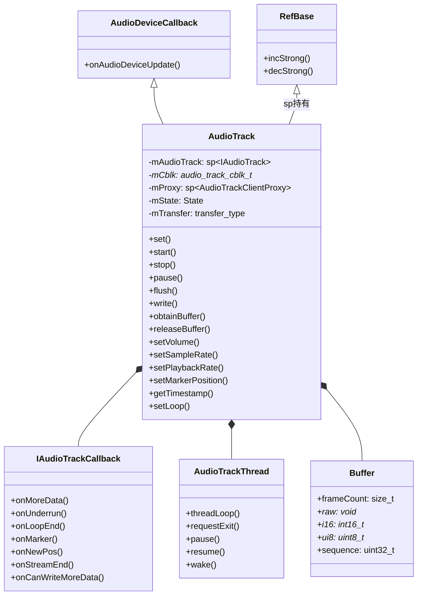
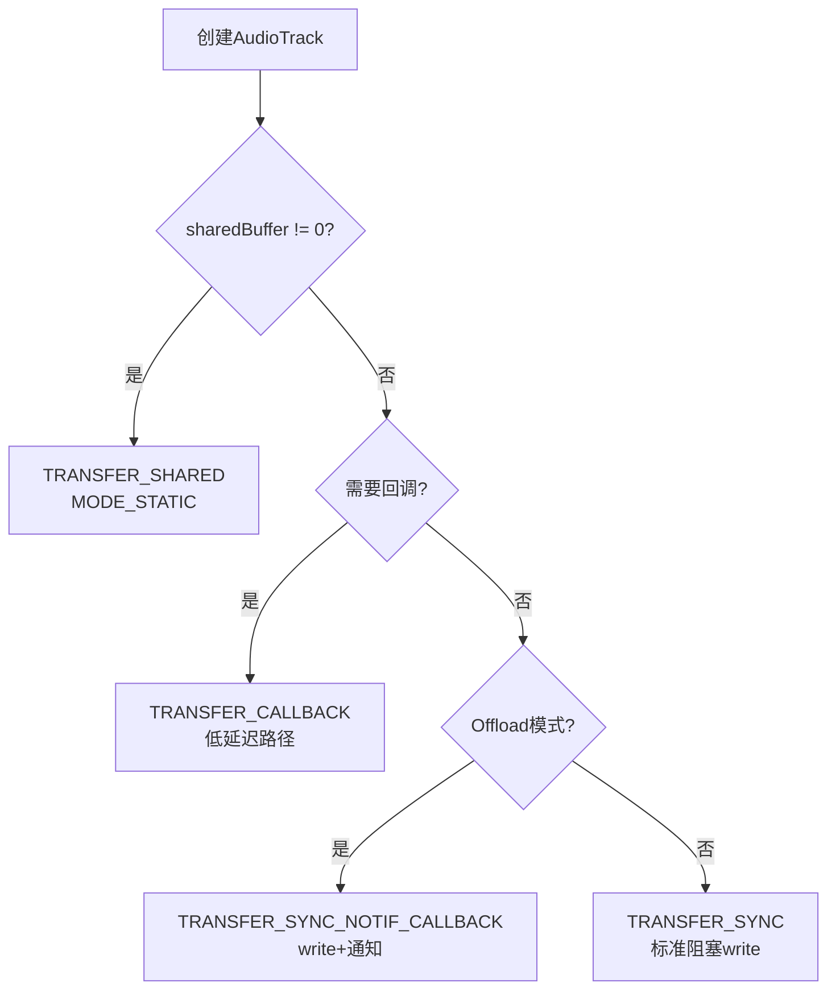
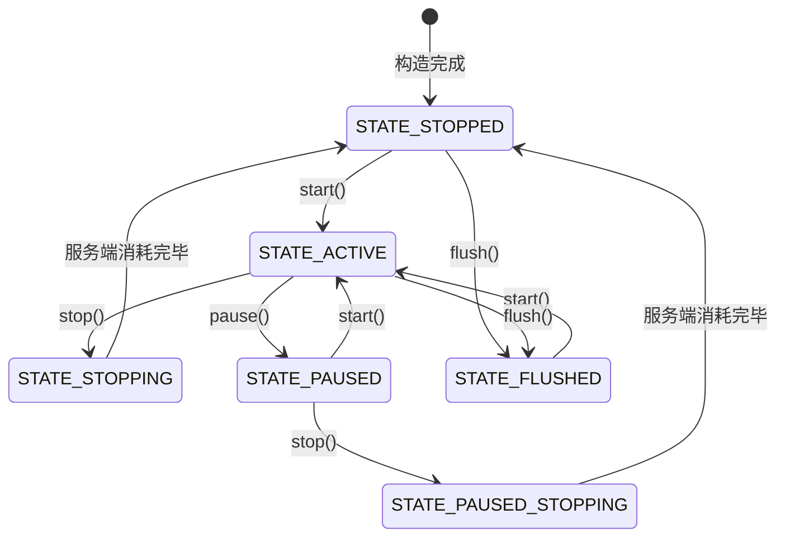
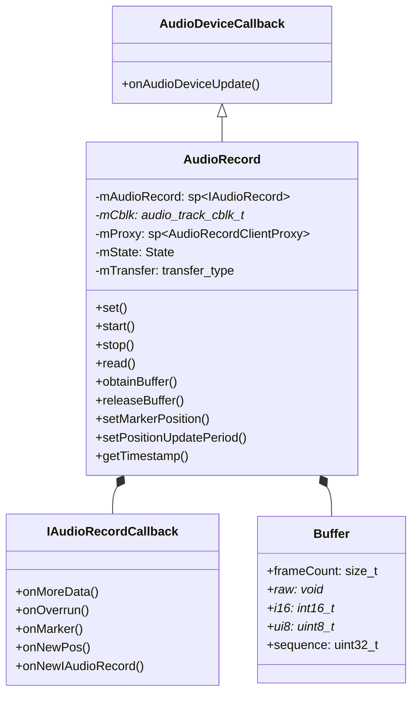
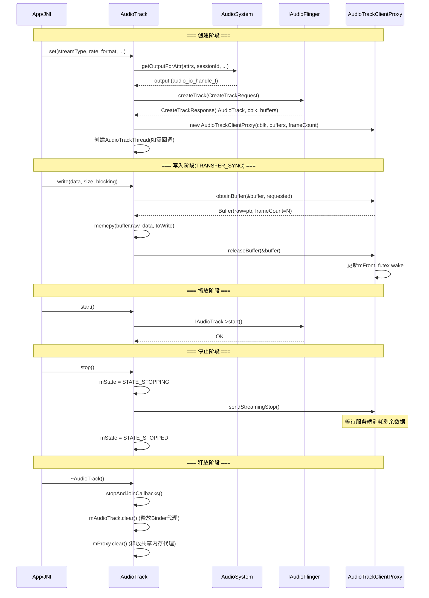
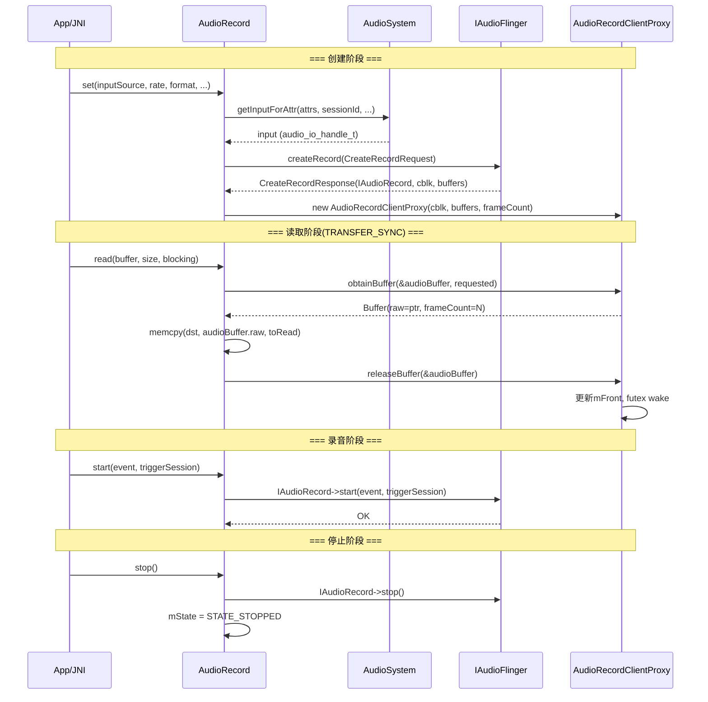

[← 4.1 JNI Bridge](04_4.1_JNI_Bridge-Java到Native的桥梁.md) | [← 返回Native Framework Layer](README.md) | [返回导航](../README.md) | [4.3 Binder IPC →](04_4.3_Binder_IPC机制.md)

## 4.2 libaudioclient — Native音频客户端库

### 模块职责与源码位置

libaudioclient是Android音频系统的Native客户端库，运行在每个App进程中。它封装了与AudioFlinger通信的所有Binder IPC细节，提供面向对象的C++ API。App进程通过JNI桥接到此库，再经Binder IPC与audioserver进程中的AudioFlinger交互。

**核心类与源码位置：**

| 类名 | 头文件 | 实现文件 | 职责 |
|------|--------|----------|------|
| [`AudioTrack`](frameworks/av/media/libaudioclient/include/media/AudioTrack.h) | AudioTrack.h (1539行) | AudioTrack.cpp | 播放音频流的Native客户端 |
| [`AudioRecord`](frameworks/av/media/libaudioclient/include/media/AudioRecord.h) | AudioRecord.h (~700行) | AudioRecord.cpp | 录音音频流的Native客户端 |
| [`AudioSystem`](frameworks/av/media/libaudioclient/include/media/AudioSystem.h) | AudioSystem.h | AudioSystem.cpp | 音频系统全局查询/设置接口 |
| [`AudioTrackClientProxy`](frameworks/av/include/private/media/AudioTrackShared.h) | AudioTrackShared.h | — | 共享内存客户端代理(播放) |
| [`AudioRecordClientProxy`](frameworks/av/include/private/media/AudioTrackShared.h) | AudioTrackShared.h | — | 共享内存客户端代理(录音) |

---

### 4.2.1 AudioTrack类深度解析

#### 类继承关系



#### transfer_type 数据传输模式

[`transfer_type`](frameworks/av/media/libaudioclient/include/media/AudioTrack.h:248) 枚举定义了6种数据传输方式：

| 模式 | 值 | 说明 | 适用场景 |
|------|---|------|---------|
| `TRANSFER_DEFAULT` | 0 | 未显式指定，由其他参数推断 | — |
| `TRANSFER_CALLBACK` | 1 | 回调模式，`EVENT_MORE_DATA`触发填充 | 低延迟播放、OpenSL ES |
| `TRANSFER_OBTAIN` | 2 | 手动调用`obtainBuffer/releaseBuffer` | 需要精细控制缓冲区 |
| `TRANSFER_SYNC` | 3 | 同步`write()`，阻塞写入 | Java `MODE_STREAM`，最常用 |
| `TRANSFER_SHARED` | 4 | 共享内存模式，一次写入 | Java `MODE_STATIC` |
| `TRANSFER_SYNC_NOTIF_CALLBACK` | 5 | 同步write + `EVENT_CAN_WRITE_MORE_DATA`通知 | Offload解码播放 |

**transfer_type选择决策：**



#### event_type 事件类型

[`event_type`](frameworks/av/media/libaudioclient/include/media/AudioTrack.h:58) 枚举定义了回调事件：

| 事件 | 值 | 触发条件 | transfer_type限制 |
|------|---|---------|------------------|
| `EVENT_MORE_DATA` | 0 | 需要更多播放数据 | 仅`TRANSFER_CALLBACK` |
| `EVENT_UNDERRUN` | 1 | 缓冲区欠载 | 不适用于static track |
| `EVENT_LOOP_END` | 2 | 循环终点，重新开始 | 仅static track |
| `EVENT_MARKER` | 3 | 到达标记位置 | — |
| `EVENT_NEW_POS` | 4 | 到达周期通知位置 | — |
| `EVENT_BUFFER_END` | 5 | static track播放完毕 | 仅static track |
| `EVENT_NEW_IAUDIOTRACK` | 6 | IAudioTrack被重建 | 路由变化/服务崩溃 |
| `EVENT_STREAM_END` | 7 | offload数据全部播完 | 仅offload track |
| `EVENT_CAN_WRITE_MORE_DATA` | 9 | 可以写入更多数据 | 仅`TRANSFER_SYNC_NOTIF_CALLBACK` |

#### IAudioTrackCallback 接口

[`IAudioTrackCallback`](frameworks/av/media/libaudioclient/include/media/AudioTrack.h:152) 是AOSP14引入的新式回调接口，替代旧的C风格函数指针：

```cpp
class IAudioTrackCallback : public virtual RefBase {
protected:
    virtual size_t onMoreData(const AudioTrack::Buffer& buffer) { return 0; }
    virtual void onUnderrun() {}
    virtual void onLoopEnd(int32_t loopsRemaining) {}
    virtual void onMarker(uint32_t markerPosition) {}
    virtual void onNewPos(uint32_t newPos) {}
    virtual void onBufferEnd() {}
    virtual void onNewIAudioTrack() {}
    virtual void onStreamEnd() {}
    virtual size_t onCanWriteMoreData(const AudioTrack::Buffer& buffer) { return 0; }
};
```

#### Buffer 内部类

[`Buffer`](frameworks/av/media/libaudioclient/include/media/AudioTrack.h:97) 是数据传输的核心结构：

```cpp
class Buffer {
public:
    size_t size() const { return mSize; }
    size_t getFrameCount() const { return frameCount; }
    uint8_t * data() const { return ui8; }

    size_t      frameCount;    // 输入: 请求的帧数 / 输出: 可用帧数
private:
    size_t      mSize;         // 输入: 忽略 / 输出: 可用字节数 = frameCount * frameSize
    union {
        void*       raw;       // 输出: 缓冲区指针
        int16_t*    i16;       // 16位PCM指针
        uint8_t*    ui8;       // 8位PCM指针
    };
    uint32_t    sequence;      // IAudioTrack实例序列号，obtain时设置、release时确认
};
```

#### State 状态机

[`State`](frameworks/av/media/libaudioclient/include/media/AudioTrack.h:1319) 枚举定义了6种状态：



| 状态 | 说明 |
|------|------|
| `STATE_ACTIVE` | 正在播放，回调活跃 |
| `STATE_STOPPED` | 停止，位置计数器归零 |
| `STATE_PAUSED` | 暂停，可由start()恢复 |
| `STATE_PAUSED_STOPPING` | 暂停后调用stop()，等待音量ramp down |
| `STATE_FLUSHED` | 已flush，缓冲区清空 |
| `STATE_STOPPING` | 正在停止，等待服务端排空剩余数据 |

#### set() 方法 — 初始化核心

[`set()`](frameworks/av/media/libaudioclient/include/media/AudioTrack.h:402) 是AudioTrack的初始化方法，包含20+参数：

```cpp
status_t set(audio_stream_type_t streamType,
             uint32_t sampleRate,
             audio_format_t format,
             audio_channel_mask_t channelMask,
             size_t frameCount = 0,
             audio_output_flags_t flags = AUDIO_OUTPUT_FLAG_NONE,
             const wp<IAudioTrackCallback>& callback = nullptr,
             int32_t notificationFrames = 0,
             const sp<IMemory>& sharedBuffer = 0,
             bool threadCanCallJava = false,
             audio_session_t sessionId = AUDIO_SESSION_ALLOCATE,
             transfer_type transferType = TRANSFER_DEFAULT,
             const audio_offload_info_t *offloadInfo = nullptr,
             const AttributionSourceState& attributionSource = AttributionSourceState(),
             const audio_attributes_t* pAttributes = nullptr,
             bool doNotReconnect = false,
             float maxRequiredSpeed = 1.0f,
             audio_port_handle_t selectedDeviceId = AUDIO_PORT_HANDLE_NONE);
```

**set()内部流程：**

1. 参数校验（format/channelMask/sampleRate合法性）
2. 根据transfer_type和sharedBuffer确定最终传输模式
3. 调用`AudioSystem::getOutputForAttr()`获取输出句柄
4. 调用`createTrack_l()`通过Binder IPC在AudioFlinger创建Track
5. 初始化Proxy和回调线程

#### createTrack_l() — Binder IPC创建Track

[`createTrack_l()`](frameworks/av/media/libaudioclient/include/media/AudioTrack.h:1215) 是与AudioFlinger建立连接的核心方法：

1. 构造`CreateTrackRequest`（包含所有配置参数）
2. 调用`IAudioFlinger::createTrack(request)` → 返回`CreateTrackResponse`
3. 从Response中获取：`IAudioTrack` Binder代理、共享内存(cblk+buffers)
4. 映射共享内存到当前进程地址空间
5. 创建`AudioTrackClientProxy`管理环形缓冲区

#### write() — 同步写入

[`write()`](frameworks/av/media/libaudioclient/include/media/AudioTrack.h:963) 内部调用`obtainBuffer/releaseBuffer`循环：

```cpp
ssize_t AudioTrack::write(const void* buffer, size_t size, bool blocking) {
    // 1. 检查状态（TRANSFER_SHARED不支持write）
    // 2. 循环写入:
    while (remaining > 0) {
        status = obtainBuffer(&audioBuffer, ...);  // 获取空闲缓冲区
        memcpy(audioBuffer.raw, src, toWrite);     // 拷贝数据
        releaseBuffer(&audioBuffer);               // 释放给服务端消费
    }
    // 3. 返回实际写入字节数或错误码
}
```

#### 关键成员变量

| 成员 | 类型 | 说明 |
|------|------|------|
| [`mAudioTrack`](frameworks/av/media/libaudioclient/include/media/AudioTrack.h:1263) | `sp<IAudioTrack>` | Binder代理，与AudioFlinger中Track对应 |
| [`mCblk`](frameworks/av/media/libaudioclient/include/media/AudioTrack.h:1265) | `audio_track_cblk_t*` | 共享控制块指针 |
| [`mProxy`](frameworks/av/media/libaudioclient/include/media/AudioTrack.h:1466) | `sp<AudioTrackClientProxy>` | 流式播放代理 |
| [`mStaticProxy`](frameworks/av/media/libaudioclient/include/media/AudioTrack.h:1465) | `sp<StaticAudioTrackClientProxy>` | 静态播放代理 |
| [`mSharedBuffer`](frameworks/av/media/libaudioclient/include/media/AudioTrack.h:1306) | `sp<IMemory>` | 静态模式的共享数据内存 |
| [`mState`](frameworks/av/media/libaudioclient/include/media/AudioTrack.h:1326) | `State` | 当前状态 |
| [`mTransfer`](frameworks/av/media/libaudioclient/include/media/AudioTrack.h:1307) | `transfer_type` | 数据传输模式 |
| [`mFlags`](frameworks/av/media/libaudioclient/include/media/AudioTrack.h:1426) | `audio_output_flags_t` | 输出标志(FAST/DIRECT/OFFLOAD) |
| [`mVolume`](frameworks/av/media/libaudioclient/include/media/AudioTrack.h:1276) | `float[2]` | 左右声道音量 |
| [`mFrameCount`](frameworks/av/media/libaudioclient/include/media/AudioTrack.h:1285) | `size_t` | 缓冲区帧数 |
| [`mCallback`](frameworks/av/media/libaudioclient/include/media/AudioTrack.h:1342) | `wp<IAudioTrackCallback>` | 事件回调 |

---

### 4.2.2 AudioRecord类深度解析

#### 类继承关系



#### transfer_type (AudioRecord)

[`transfer_type`](frameworks/av/media/libaudioclient/include/media/AudioRecord.h:143) 枚举仅4种（比AudioTrack少）：

| 模式 | 值 | 说明 |
|------|---|------|
| `TRANSFER_DEFAULT` | 0 | 由参数推断，通常为`TRANSFER_SYNC` |
| `TRANSFER_CALLBACK` | 1 | 回调模式，`EVENT_MORE_DATA`通知可读数据 |
| `TRANSFER_OBTAIN` | 2 | 手动obtainBuffer/releaseBuffer |
| `TRANSFER_SYNC` | 3 | 同步`read()`，最常用 |

AudioRecord没有`TRANSFER_SHARED`和`TRANSFER_SYNC_NOTIF_CALLBACK`，因为录音不存在静态缓冲区和offload概念。

#### IAudioRecordCallback 接口

[`IAudioRecordCallback`](frameworks/av/media/libaudioclient/include/media/AudioRecord.h:104) 定义了5个回调方法：

```cpp
class IAudioRecordCallback : public virtual RefBase {
protected:
    virtual size_t onMoreData(const AudioRecord::Buffer& buffer) { return 0; }
    virtual void onOverrun() {}                           // 缓冲区溢出
    virtual void onMarker(uint32_t markerPosition) {}     // 到达标记位置
    virtual void onNewPos(uint32_t newPos) {}             // 周期位置通知
    virtual void onNewIAudioRecord() {}                   // IAudioRecord被重建
};
```

#### set() 方法

[`set()`](frameworks/av/media/libaudioclient/include/media/AudioRecord.h:228) 初始化录音：

```cpp
status_t set(audio_source_t inputSource,         // 音频源(MIC/VOICE_RECOGNITION等)
             uint32_t sampleRate,
             audio_format_t format,
             audio_channel_mask_t channelMask,
             size_t frameCount = 0,
             const wp<IAudioRecordCallback> &callback = nullptr,
             uint32_t notificationFrames = 0,
             bool threadCanCallJava = false,
             audio_session_t sessionId = AUDIO_SESSION_ALLOCATE,
             transfer_type transferType = TRANSFER_DEFAULT,
             audio_input_flags_t flags = AUDIO_INPUT_FLAG_NONE,
             uid_t uid = AUDIO_UID_INVALID,
             pid_t pid = -1,
             const audio_attributes_t* pAttributes = nullptr,
             audio_port_handle_t selectedDeviceId = AUDIO_PORT_HANDLE_NONE,
             audio_microphone_direction_t selectedMicDirection = MIC_DIRECTION_UNSPECIFIED,
             float selectedMicFieldDimension = MIC_FIELD_DIMENSION_DEFAULT,
             int32_t maxSharedAudioHistoryMs = 0);  // AOSP14新增：共享音频历史
```

**关键参数解析：**
- `inputSource`：`AUDIO_SOURCE_MIC`(1) / `AUDIO_SOURCE_VOICE_RECOGNITION`(6) 等
- `selectedMicDirection`：麦克风方向(`MIC_DIRECTION_UNSPECIFIED`/`FRONT`/`BACK`)
- `maxSharedAudioHistoryMs`：AOSP14新增，允许访问启动前的音频历史

#### read() — 同步读取

[`read()`](frameworks/av/media/libaudioclient/include/media/AudioRecord.h:571) 内部实现与write对称：

```cpp
ssize_t AudioRecord::read(void* buffer, size_t size, bool blocking) {
    // 1. 状态检查
    // 2. 循环读取:
    while (remaining > 0) {
        status = obtainBuffer(&audioBuffer, ...);  // 获取已填充缓冲区
        memcpy(dst, audioBuffer.raw, toRead);      // 拷贝数据
        releaseBuffer(&audioBuffer);               // 释放给服务端填充
    }
    // 3. 返回实际读取字节数
}
```

#### AudioRecord与AudioTrack的差异

| 特性 | AudioTrack | AudioRecord |
|------|-----------|-------------|
| 数据流方向 | App → AudioFlinger | AudioFlinger → App |
| 共享缓冲区 | App写(生产者)，AF读(消费者) | AF写(生产者)，App读(消费者) |
| Proxy方向 | mFront由App推进，mRear由AF推进 | mRear由AF推进，mFront由App推进 |
| transfer_type | 6种 | 4种（无SHARED/SYNC_NOTIF_CALLBACK） |
| 静态模式 | 支持(MODE_STATIC) | 不支持 |
| Offload | 支持 | 不支持 |
| flush | 排空未播放数据(mFront=mRear) | 排空未读取数据(mFront=mRear) |
| 音量控制 | setVolume(L/R) | 不适用 |
| 采样率动态调整 | setSampleRate() | 固定，不可调整 |
| 特有功能 | setLoop()/VolumeShaper | 共享音频历史/getActiveMicrophones |

---

### 4.2.3 AudioTrackClientProxy 详解

[`AudioTrackClientProxy`](frameworks/av/include/private/media/AudioTrackShared.h:445) 是播放端共享内存的客户端代理，管理环形缓冲区的写端。

#### 核心方法

| 方法 | 说明 |
|------|------|
| `obtainBuffer()` | 从环形缓冲区获取可写空间（继承自ClientProxy） |
| `releaseBuffer()` | 提交已写入的数据（继承自ClientProxy） |
| `setSendLevel()` | 设置Aux Effect发送电平 |
| `setVolumeLR()` | 设置左右声道音量（写入cblk.mVolumeLR） |
| `setSampleRate()` | 设置采样率（写入cblk.mSampleRate） |
| `setPlaybackRate()` | 设置播放速率（写入cblk.mPlaybackRateQueue） |
| `sendStreamingFlushStop()` | 发送flush/stop命令到服务端 |
| `flush()` | 重置环形缓冲区(mFlush++) |
| `stop()` | 设置停止标志(mStop++) |
| `getUnderrunFrames()` | 获取欠载帧数 |
| `getUnderrunCount()` | 获取欠载次数 |

#### 静态播放代理

[`StaticAudioTrackClientProxy`](frameworks/av/include/private/media/AudioTrackShared.h:502) 用于MODE_STATIC模式：

| 方法 | 说明 |
|------|------|
| `setLoop(loopStart, loopEnd, loopCount)` | 设置循环播放 |
| `setBufferPosition(position)` | 设置播放位置 |
| `setBufferPositionAndLoop(position, loopStart, loopEnd, loopCount)` | 同时设置位置和循环 |
| `getBufferPosition()` | 获取当前播放位置 |
| `getBufferPositionAndLoopCount()` | 获取位置和已完成的循环数 |

---

### 4.2.4 AudioRecordClientProxy 详解

[`AudioRecordClientProxy`](frameworks/av/include/private/media/AudioTrackShared.h:558) 是录音端共享内存的客户端代理：

```cpp
class AudioRecordClientProxy : public ClientProxy {
public:
    AudioRecordClientProxy(audio_track_cblk_t* cblk, void *buffers,
                           size_t frameCount, size_t frameSize)
        : ClientProxy(cblk, buffers, frameCount, frameSize, false /*isOut*/) {}

    // 录音flush: 直接将front设为rear，丢弃所有未读数据
    void flush() {
        // 与AudioTrack不同，录音flush是同步操作
        mCblk->u.mStreaming.mFlush = std::atomic_load(&mCblk->u.mStreaming.mRear);
    }
};
```

**关键差异**：录音的`flush()`直接设置`mFlush = mRear`，因为录音端是消费者，flush意味着丢弃所有未消费的数据。

---

### 4.2.5 AudioTrack完整生命周期时序图



---

### 4.2.6 AudioRecord完整生命周期时序图



---

### 4.2.7 AudioTrack内部线程模型

#### AudioTrackThread

[`AudioTrackThread`](frameworks/av/media/libaudioclient/include/media/AudioTrack.h:1170) 是AudioTrack的内部回调处理线程，仅在以下情况创建：

- `TRANSFER_CALLBACK`：需要处理`EVENT_MORE_DATA`回调
- 设置了marker/position通知
- Offload模式

#### processAudioBuffer()

[`processAudioBuffer()`](frameworks/av/media/libaudioclient/include/media/AudioTrack.h:1209) 是线程的主循环体，返回下次调度时间：

| 返回值 | 含义 |
|--------|------|
| `0` | 立即再次运行 |
| `> 0` | 在指定纳秒后再次运行 |
| `NS_WHENEVER` (-1) | 仍活跃但无特定截止时间 |
| `NS_INACTIVE` (-2) | 不活跃，等待重新start |
| `NS_NEVER` (-3) | 永不再运行 |

#### 线程优先级

AudioTrackThread在start()时提升线程优先级：

```cpp
// start()中设置调度参数
int policy = sched_getscheduler(0);
set_sched_policy(tid, SP_FOREGROUND);  // 提升为前台调度
```

---

### 4.2.8 Track重建机制(restoreTrack_l)

当IAudioTrack Binder连接因以下原因失效时，AudioTrack需要重建：

1. **AudioFlinger崩溃**：Binder死亡通知
2. **路由变化**：输出设备改变，原Track不再适合
3. **服务端主动失效**：invalidate操作

[`restoreTrack_l()`](frameworks/av/media/libaudioclient/include/media/AudioTrack.h:1223) 处理重建：

1. 保存当前状态（音量、采样率、播放速率等）
2. 调用`createTrack_l()`重新创建IAudioTrack
3. 恢复之前的状态参数
4. 如果之前是ACTIVE状态，重新start()

**mDoNotReconnect标志**：若设为true，则不自动重建，返回`DEAD_OBJECT`让应用自行处理。

---

### 4.2.9 Offload与Direct模式

#### 判断方法

```cpp
bool isOffloaded_l() const {
    return (mFlags & AUDIO_OUTPUT_FLAG_COMPRESS_OFFLOAD) != 0;
}
bool isDirect_l() const {
    return (mFlags & AUDIO_OUTPUT_FLAG_DIRECT) != 0;
}
bool isOffloadedOrDirect_l() const {
    return (mFlags & (AUDIO_OUTPUT_FLAG_COMPRESS_OFFLOAD | AUDIO_OUTPUT_FLAG_DIRECT)) != 0;
}
```

#### Offload Track特性

- 使用`TRANSFER_SYNC_NOTIF_CALLBACK`
- `EVENT_CAN_WRITE_MORE_DATA`通知App可以写入更多压缩数据
- `EVENT_STREAM_END`通知所有数据播完
- 不支持`setSampleRate()`动态调采样率
- flush/stop行为与普通Track不同

#### Direct Track特性

- 使用`AUDIO_OUTPUT_FLAG_DIRECT`
- 通常用于低延迟直通路径
- 格式必须与HAL输出完全匹配
- 不经过AudioFlinger的混音器

---

### 4.2.10 音量与播放速率控制

#### 音量设置

```cpp
// 双声道独立音量
status_t setVolume(float left, float right);

// 统一音量（所有声道）
status_t setVolume(float volume);

// 通过Proxy写入共享内存
mProxy->setVolumeLR(gain_minifloat_pack(
    float_to_gain_minifloat(left),
    float_to_gain_minifloat(right)));
```

音量值存储在[`cblk.mVolumeLR`](frameworks/av/include/private/media/AudioTrackShared.h:237)，使用`gain_minifloat_packed_t`格式，AudioFlinger的混音器直接从共享内存读取。

#### 播放速率

```cpp
status_t setPlaybackRate(const AudioPlaybackRate &playbackRate);
```

`AudioPlaybackRate`包含speed(速度)和pitch(音调)，支持timestretch。通过`cblk.mPlaybackRateQueue`传递到服务端。

#### VolumeShaper

[`applyVolumeShaper()`](frameworks/av/media/libaudioclient/include/media/AudioTrack.h:984) 支持音量自动渐变动画：

```cpp
media::VolumeShaper::Status applyVolumeShaper(
    const sp<media::VolumeShaper::Configuration>& configuration,
    const sp<media::VolumeShaper::Operation>& operation);
sp<media::VolumeShaper::State> getVolumeShaperState(int id);
```

VolumeShaper用于实现淡入淡出、Ducking等音量动画效果。

---

### 4.2.11 位置通知与标记

AudioTrack支持两种位置通知机制：

#### Marker通知

```cpp
status_t setMarkerPosition(uint32_t marker);
```

当播放位置到达marker时，触发`EVENT_MARKER`回调。只触发一次。

#### 周期通知

```cpp
status_t setPositionUpdatePeriod(uint32_t updatePeriod);
```

每隔`updatePeriod`帧触发一次`EVENT_NEW_POS`回调。

#### Static模式位置

```cpp
status_t setPosition(uint32_t position);  // 仅static模式
status_t setLoop(uint32_t loopStart, uint32_t loopEnd, int loopCount);
```

Static模式还支持设置循环播放区域，loopCount=-1表示无限循环。

---

### 4.2.12 Timestamp获取

#### 基础Timestamp

```cpp
status_t getTimestamp(AudioTimestamp& timestamp);
```

返回`position`(帧数)和`time`(纳秒时间戳)的映射关系。

#### ExtendedTimestamp

```cpp
status_t getTimestamp(ExtendedTimestamp *timestamp);
```

扩展版本，提供多时间源信息：

| Location | 说明 |
|----------|------|
| `LOCATION_CLIENT` | 客户端写入位置 |
| `LOCATION_SERVER` | 服务端混音位置 |
| `LOCATION_KERNEL` | HAL/内核播放位置 |

ExtendedTimestamp支持64位帧位置，不会在~27小时后溢出。

---

### 4.2.13 成员变量分类总览

| 分类 | 成员 | 说明 |
|------|------|------|
| **Binder连接** | mAudioTrack, mCblkMemory, mCblk, mOutput | 与AudioFlinger的IPC通道 |
| **共享内存** | mProxy, mStaticProxy, mSharedBuffer | 客户端代理与数据缓冲区 |
| **音频参数** | mFormat, mChannelCount, mChannelMask, mSampleRate, mFrameSize, mFrameCount | 不可变音频配置 |
| **传输控制** | mTransfer, mFlags, mOrigFlags | 数据传输方式和输出标志 |
| **播放状态** | mState, mStatus, mInitialized | 生命周期状态 |
| **音量/速率** | mVolume[2], mSendLevel, mPlaybackRate, mSampleRate | 运行时可调参数 |
| **位置追踪** | mServer, mPosition, mReleased, mFramesWritten | 帧位置计数器 |
| **回调** | mCallback, mAudioTrackThread, mNotificationFramesReq/Act | 回调与通知配置 |
| **设备路由** | mSelectedDeviceId, mRoutedDeviceId, mDeviceCallback | 设备选择与通知 |
| **会话** | mSessionId, mPortId, mPlayerIId | 音频会话与策略标识 |
| **缓存AF值** | mAfLatency, mAfFrameCount, mAfSampleRate, mAfChannelCount, mAfFormat | AudioFlinger输出属性缓存 |
| **Metrics** | mMediaMetrics, mMetricsId, mCallerName, mLogSessionId | 诊断与度量 |

---

[← 4.1 JNI Bridge](04_4.1_JNI_Bridge-Java到Native的桥梁.md) | [← 返回Native Framework Layer](README.md) | [返回导航](../README.md) | [4.3 Binder IPC →](04_4.3_Binder_IPC机制.md)