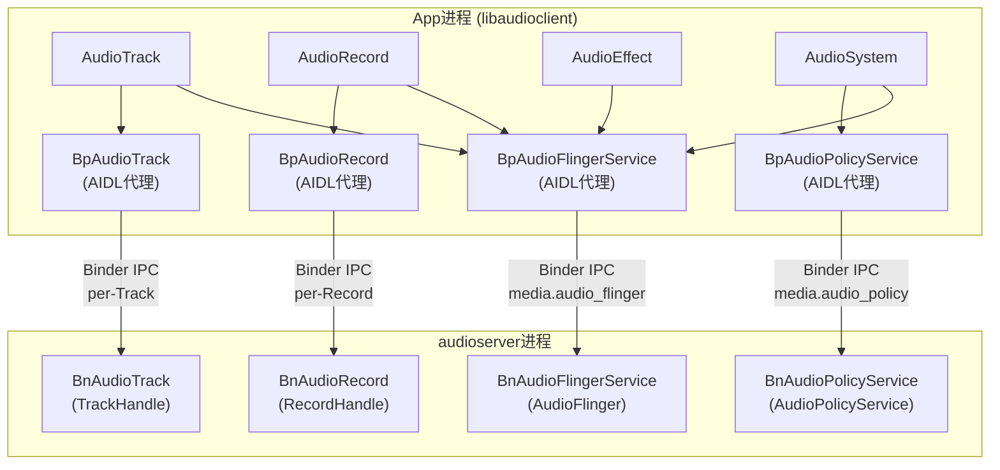
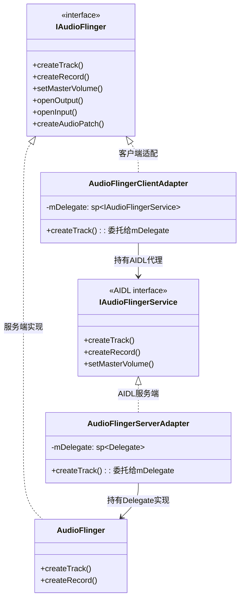
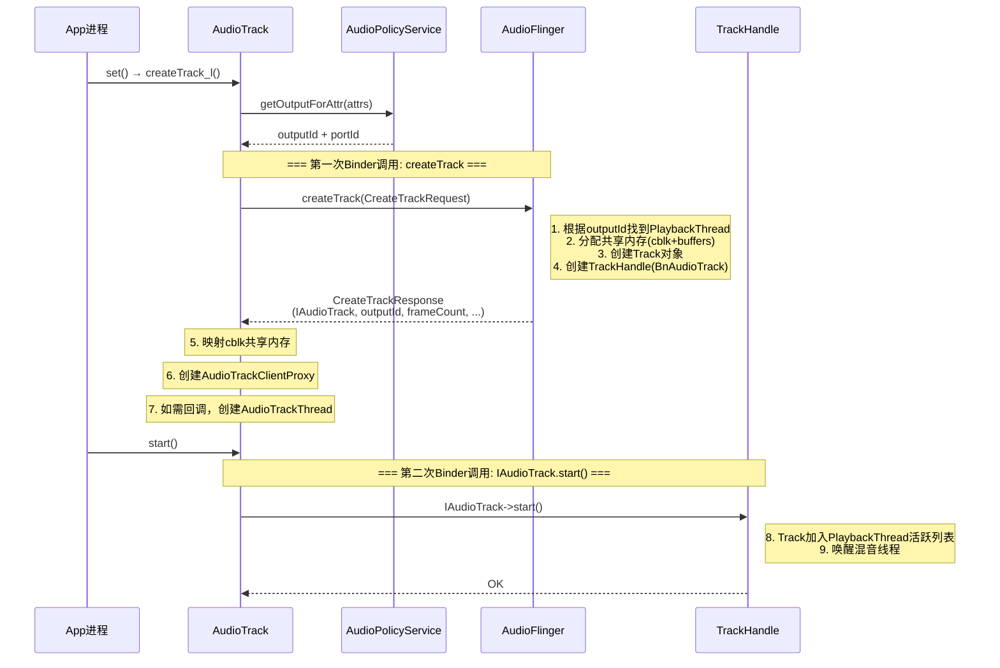
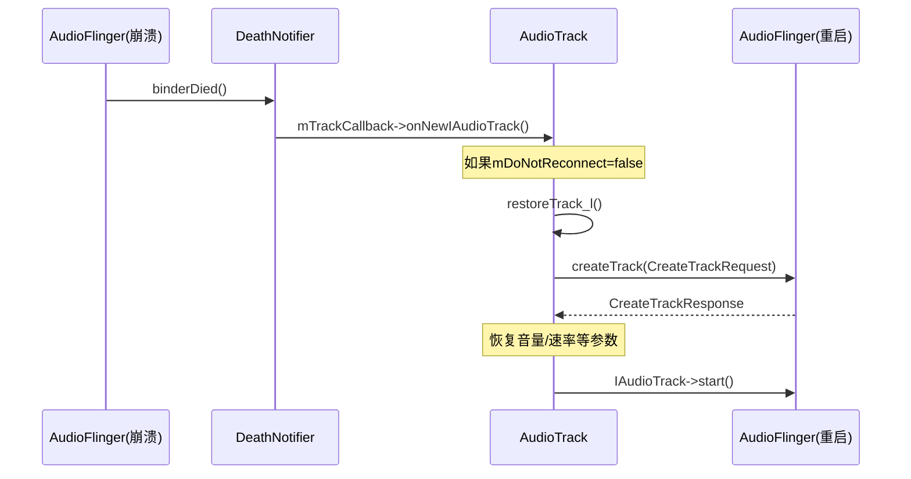
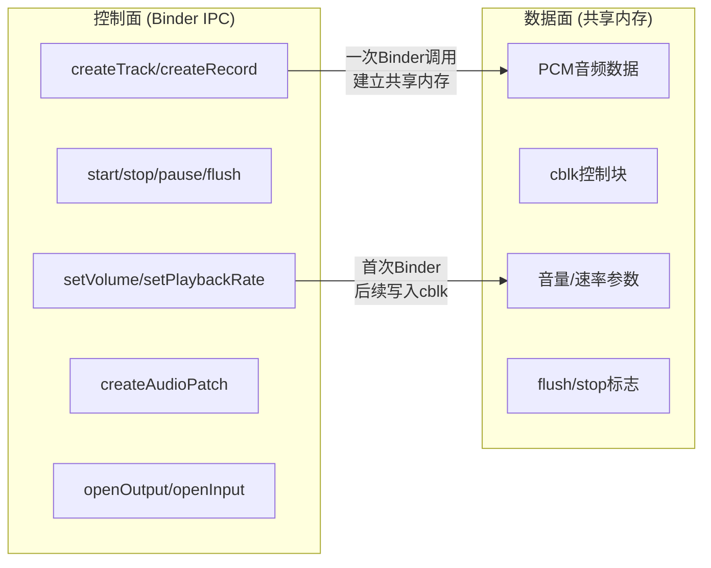

[← 4.2 libaudioclient](04_4.2_libaudioclient-Native音频客户端库.md) | [← 返回Native Framework Layer](README.md) | [返回导航](../README.md) | [4.4 共享内存 →](04_4.4_共享内存机制深度解析.md)

## 4.3 Binder IPC机制 — 音频进程间通信

### 概述

Android音频系统的Binder IPC连接了App进程中的libaudioclient与audioserver进程中的AudioFlinger。控制命令（创建Track、start/stop、音量设置等）通过Binder传输，而音频数据本身通过共享内存传递，实现了控制面与数据面的分离。

**关键设计原则：**
- 控制命令走Binder IPC（低频、小数据量）
- 音频数据走共享内存（高频、大数据量）
- App进程与audioserver进程完全隔离

---

### 4.3.1 Binder接口体系架构



**服务名映射：**

| 服务名 | 接口 | 进程 | 用途 |
|--------|------|------|------|
| `media.audio_flinger` | IAudioFlingerService | audioserver | 音频混音/路由核心服务 |
| `media.audio_policy` | IAudioPolicyService | audioserver | 音频策略/路由决策服务 |

---

### 4.3.2 IAudioFlinger接口深度解析

[`IAudioFlinger`](frameworks/av/media/libaudioclient/include/media/IAudioFlinger.h:69) 是音频系统最核心的Binder接口，AOSP14中已迁移至AIDL（`IAudioFlingerService`），通过适配器模式兼容旧接口。

#### AIDL迁移与适配器模式

AOSP14引入了双层适配器架构：



- [`AudioFlingerClientAdapter`](frameworks/av/media/libaudioclient/include/media/IAudioFlinger.h:483)：客户端适配器，将旧`IAudioFlinger`调用转换为`IAudioFlingerService` AIDL调用
- [`AudioFlingerServerAdapter`](frameworks/av/media/libaudioclient/include/media/IAudioFlinger.h:575)：服务端适配器，将AIDL请求分发给`AudioFlinger`实现

#### CreateTrackInput/Output 数据结构

[`CreateTrackInput`](frameworks/av/media/libaudioclient/include/media/IAudioFlinger.h:77) 和 [`CreateTrackOutput`](frameworks/av/media/libaudioclient/include/media/IAudioFlinger.h:101) 是`createTrack()`的请求/响应结构：

**CreateTrackInput（App → AudioFlinger）：**

| 字段 | 类型 | 方向 | 说明 |
|------|------|------|------|
| `attr` | `audio_attributes_t` | 输入 | 音频属性（用法/内容类型/标志） |
| `config` | `audio_config_t` | 输入 | 音频配置（采样率/格式/声道） |
| `clientInfo` | `AudioClient` | 输入 | 客户端信息（UID/PID/包名） |
| `sharedBuffer` | `sp<IMemory>` | 输入 | 静态模式共享数据 |
| `speed` | `float` | 输入 | 初始播放速度 |
| `audioTrackCallback` | `sp<IAudioTrackCallback>` | 输入 | 事件回调接口 |
| `flags` | `audio_output_flags_t` | 输入/输出 | 输出标志（可能被AF修改） |
| `frameCount` | `size_t` | 输入/输出 | 请求/实际帧数 |
| `notificationFrameCount` | `size_t` | 输入/输出 | 通知帧数 |
| `selectedDeviceId` | `audio_port_handle_t` | 输入/输出 | 选择的设备 |
| `sessionId` | `audio_session_t` | 输入/输出 | 会话ID |

**CreateTrackOutput（AudioFlinger → App）：**

| 字段 | 类型 | 方向 | 说明 |
|------|------|------|------|
| `flags` | `audio_output_flags_t` | 输入/输出 | 实际输出标志 |
| `frameCount` | `size_t` | 输入/输出 | 实际分配帧数 |
| `notificationFrameCount` | `size_t` | 输入/输出 | 实际通知帧数 |
| `selectedDeviceId` | `audio_port_handle_t` | 输入/输出 | 实际路由设备 |
| `sessionId` | `audio_session_t` | 输入/输出 | 实际会话ID |
| `sampleRate` | `uint32_t` | 输出 | 实际采样率 |
| `streamType` | `audio_stream_type_t` | 输出 | 解析后的流类型 |
| `afFrameCount` | `size_t` | 输出 | AF缓冲区帧数 |
| `afSampleRate` | `uint32_t` | 输出 | AF采样率 |
| `afLatencyMs` | `uint32_t` | 输出 | AF延迟(ms) |
| `afChannelMask` | `audio_channel_mask_t` | 输出 | AF声道掩码 |
| `afFormat` | `audio_format_t` | 输出 | AF格式 |
| `outputId` | `audio_io_handle_t` | 输出 | 输出流句柄 |
| `portId` | `audio_port_handle_t` | 输出 | 音频端口ID |
| `audioTrack` | `sp<IAudioTrack>` | 输出 | Track的Binder代理 |

#### CreateRecordInput/Output 数据结构

[`CreateRecordInput`](frameworks/av/media/libaudioclient/include/media/IAudioFlinger.h:120) 和 [`CreateRecordOutput`](frameworks/av/media/libaudioclient/include/media/IAudioFlinger.h:140) 是`createRecord()`的请求/响应结构：

**CreateRecordOutput独有字段：**

| 字段 | 类型 | 说明 |
|------|------|------|
| `cblk` | `sp<IMemory>` | 共享控制块内存 |
| `buffers` | `sp<IMemory>` | 共享数据缓冲区内存 |
| `audioRecord` | `sp<IAudioRecord>` | Record的Binder代理 |
| `serverConfig` | `audio_config_base_t` | 服务端实际音频配置 |
| `halConfig` | `audio_config_base_t` | HAL实际音频配置 |

> 注意：`createTrack()`返回的cblk/buffers通过`IAudioTrack`接口单独获取，而`createRecord()`直接在CreateRecordOutput中返回。

---

### 4.3.3 IAudioFlinger核心方法分类

#### Track/Record管理

| 方法 | 签名 | 说明 |
|------|------|------|
| [`createTrack()`](frameworks/av/media/libaudioclient/include/media/IAudioFlinger.h:165) | `CreateTrackRequest → CreateTrackResponse` | 创建播放Track |
| [`createRecord()`](frameworks/av/media/libaudioclient/include/media/IAudioFlinger.h:172) | `CreateRecordRequest → CreateRecordResponse` | 创建录音Record |

#### 输出/输入流管理

| 方法 | 说明 |
|------|------|
| [`openOutput()`](frameworks/av/media/libaudioclient/include/media/IAudioFlinger.h:259) | 打开HAL输出流，创建PlaybackThread |
| [`openInput()`](frameworks/av/media/libaudioclient/include/media/IAudioFlinger.h:264) | 打开HAL输入流，创建RecordThread |
| [`closeOutput()`](frameworks/av/media/libaudioclient/include/media/IAudioFlinger.h:261) | 关闭输出流 |
| [`closeInput()`](frameworks/av/media/libaudioclient/include/media/IAudioFlinger.h:265) | 关闭输入流 |
| [`openDuplicateOutput()`](frameworks/av/media/libaudioclient/include/media/IAudioFlinger.h:260) | 创建重复输出（同一数据写两路） |
| [`suspendOutput()`](frameworks/av/media/libaudioclient/include/media/IAudioFlinger.h:262) | 挂起输出 |
| [`restoreOutput()`](frameworks/av/media/libaudioclient/include/media/IAudioFlinger.h:263) | 恢复输出 |

#### 音量控制

| 方法 | 说明 |
|------|------|
| [`setMasterVolume()`](frameworks/av/media/libaudioclient/include/media/IAudioFlinger.h:219) | 主音量 |
| [`setMasterMute()`](frameworks/av/media/libaudioclient/include/media/IAudioFlinger.h:220) | 主静音 |
| [`setStreamVolume()`](frameworks/av/media/libaudioclient/include/media/IAudioFlinger.h:228) | 按流类型音量 |
| [`setStreamMute()`](frameworks/av/media/libaudioclient/include/media/IAudioFlinger.h:230) | 按流类型静音 |
| [`setVoiceVolume()`](frameworks/av/media/libaudioclient/include/media/IAudioFlinger.h:268) | 通话音量 |
| [`setMasterBalance()`](frameworks/av/media/libaudioclient/include/media/IAudioFlinger.h:224) | 左右声道平衡 |
| [`setMicMute()`](frameworks/av/media/libaudioclient/include/media/IAudioFlinger.h:240) | 麦克风静音 |
| [`setRecordSilenced()`](frameworks/av/media/libaudioclient/include/media/IAudioFlinger.h:242) | 静音指定录音端口 |

#### 音频路由Patch

| 方法 | 说明 |
|------|------|
| [`createAudioPatch()`](frameworks/av/media/libaudioclient/include/media/IAudioFlinger.h:314) | 创建音频路由(source→sink) |
| [`releaseAudioPatch()`](frameworks/av/media/libaudioclient/include/media/IAudioFlinger.h:317) | 释放音频路由 |
| [`listAudioPatches()`](frameworks/av/media/libaudioclient/include/media/IAudioFlinger.h:319) | 列出所有Patch |
| [`getAudioPort()`](frameworks/av/media/libaudioclient/include/media/IAudioFlinger.h:311) | 获取音频端口属性 |
| [`setAudioPortConfig()`](frameworks/av/media/libaudioclient/include/media/IAudioFlinger.h:321) | 设置端口配置 |

#### 设备与参数

| 方法 | 说明 |
|------|------|
| [`setParameters()`](frameworks/av/media/libaudioclient/include/media/IAudioFlinger.h:244) | 设置键值对参数到HAL |
| [`getParameters()`](frameworks/av/media/libaudioclient/include/media/IAudioFlinger.h:246) | 从HAL获取参数 |
| [`setMode()`](frameworks/av/media/libaudioclient/include/media/IAudioFlinger.h:237) | 设置音频模式(NORMAL/RING/IN_CALL) |
| [`setDeviceConnectedState()`](frameworks/av/media/libaudioclient/include/media/IAudioFlinger.h:370) | 设备连接状态变更 |
| [`invalidateTracks()`](frameworks/av/media/libaudioclient/include/media/IAudioFlinger.h:384) | 批量使能Track失效 |

#### AAudio/低延迟相关

| 方法 | 说明 |
|------|------|
| [`getMmapPolicyInfos()`](frameworks/av/media/libaudioclient/include/media/IAudioFlinger.h:362) | 获取MMap策略信息 |
| [`getAAudioMixerBurstCount()`](frameworks/av/media/libaudioclient/include/media/IAudioFlinger.h:365) | AAudio混音burst数 |
| [`getAAudioHardwareBurstMinUsec()`](frameworks/av/media/libaudioclient/include/media/IAudioFlinger.h:367) | AAudio硬件最小burst时长 |
| [`setRequestedLatencyMode()`](frameworks/av/media/libaudioclient/include/media/IAudioFlinger.h:373) | 请求延迟模式 |
| [`getSupportedLatencyModes()`](frameworks/av/media/libaudioclient/include/media/IAudioFlinger.h:375) | 获取支持的延迟模式 |

#### Sound Dose（AOSP14新增）

| 方法 | 说明 |
|------|------|
| [`getSoundDoseInterface()`](frameworks/av/media/libaudioclient/include/media/IAudioFlinger.h:378) | 获取SoundDose接口（CSD合规） |

---

### 4.3.4 IAudioTrack接口

[`IAudioTrack`](frameworks/av/media/libaudioclient/include/media/IAudioTrack.h) 是每个播放Track的独立Binder接口，由`createTrack()`返回。

**核心方法：**

| 方法 | 说明 | 调用频率 |
|------|------|---------|
| `start()` | 开始播放 | 低频(状态切换) |
| `stop()` | 停止播放 | 低频 |
| `pause()` | 暂停播放 | 低频 |
| `flush()` | 清空缓冲区 | 低频 |
| `getTimestamp()` | 获取播放时间戳 | 中频 |
| `setVolume(float left, float right)` | 设置音量 | 低频 |
| `setPlaybackRate(AudioPlaybackRate)` | 设置播放速率 | 低频 |
| `setBufferSizeInFrames(size_t)` | 动态调整缓冲区 | 低频 |
| `selectPresentation(int presentationId)` | 选择音频呈现方式 | 极低频 |

> **设计要点**：start/stop/pause/flush通过Binder IPC触发AudioFlinger端状态变化，而数据传输（write到共享内存）完全不经过Binder。这是零拷贝设计的关键。

---

### 4.3.5 IAudioRecord接口

[`IAudioRecord`](frameworks/av/media/libaudioclient/include/media/IAudioRecord.h) 是每个录音Record的独立Binder接口。

**核心方法：**

| 方法 | 说明 | 特色 |
|------|------|------|
| `start(AudioRecord::SyncEvent)` | 开始录音 | 支持同步事件触发 |
| `stop()` | 停止录音 | — |
| `getTimestamp(AudioTimestamp)` | 获取录音时间戳 | — |
| `setPreferredMicDirection(MicDirection)` | 设置麦克风方向 | — |
| `setPreferredMicFieldDimension(float)` | 设置麦克风场维度 | — |
| `setAudioSource(audio_source_t)` | 更换录音源 | 动态切换 |
| `setGain(float)` | 设置录音增益 | — |

**同步事件触发**：`start()`支持`SYNC_EVENT_START`，例如在某个session开始播放时同步启动录音（用于卡拉OK/实时反馈场景）。

---

### 4.3.6 createTrack完整Binder交互时序



**createTrack()的Binder调用开销：**
- 一次Binder事务传输CreateTrackRequest
- 服务端分配共享内存，返回IAudioTrack Binder对象+共享内存fd
- 通过`mmap()`映射共享内存到App进程
- 后续数据传输不再经过Binder

---

### 4.3.7 IAudioFlingerClient回调注册

[`registerClient()`](frameworks/av/media/libaudioclient/include/media/IAudioFlinger.h:250) 注册一个`IAudioFlingerClient`回调接口，用于接收audioserver主动推送的通知：

```cpp
virtual void registerClient(const sp<media::IAudioFlingerClient>& client) = 0;
```

**IAudioFlingerClient回调方法：**

| 方法 | 说明 |
|------|------|
| `ioConfigChanged()` | 输出/输入流配置变化通知 |
| `latencyChanged()` | 延迟变化通知(AOSP14新增) |

每个App进程只注册一次（AudioFlinger忽略同一PID的重复注册），由[`AudioSystem`](frameworks/av/media/libaudioclient/include/media/AudioSystem.h)在首次使用时自动注册。

**ioConfigChanged事件类型：**

| 事件 | 说明 |
|------|------|
| `OUTPUT_OPENED` | 输出流打开 |
| `OUTPUT_CLOSED` | 输出流关闭 |
| `OUTPUT_CONFIG_CHANGED` | 输出流配置变化 |
| `INPUT_OPENED` | 输入流打开 |
| `INPUT_CLOSED` | 输入流关闭 |
| `INPUT_CONFIG_CHANGED` | 输入流配置变化 |
| `STREAM_CONFIG_CHANGED` | 流配置变化 |
| `CLIENTS_CHANGED` | 客户端列表变化 |

---

### 4.3.8 Binder死亡通知与Track重建

当audioserver进程崩溃时，App进程中的Binder代理会收到死亡通知。AudioTrack通过`DeathNotifier`内部类处理此场景：



**两种处理策略：**
1. **自动重建**（`mDoNotReconnect=false`）：`restoreTrack_l()`自动重连
2. **通知应用**（`mDoNotReconnect=true`）：回调`EVENT_NEW_IAUDIOTRACK`，让应用自行处理

---

### 4.3.9 IAudioFlingerService AIDL接口

AOSP14将`IAudioFlinger`从手写Binder迁移到AIDL定义：

- AIDL定义：`android/media/IAudioFlingerService.aidl`
- 客户端代理：`BpAudioFlingerService`（AIDL自动生成）
- 服务端桩：`BnAudioFlingerService`（AIDL自动生成）
- 适配器：[`AudioFlingerClientAdapter`](frameworks/av/media/libaudioclient/include/media/IAudioFlinger.h:483) 和 [`AudioFlingerServerAdapter`](frameworks/av/media/libaudioclient/include/media/IAudioFlinger.h:575)

**AIDL迁移优势：**
1. 自动生成序列化/反序列化代码
2. 类型安全的参数传递
3. 支持nullable/@utf8InCpp等注解
4. 更好的版本兼容性

**TransactionCode枚举**：[`Delegate::TransactionCode`](frameworks/av/media/libaudioclient/include/media/IAudioFlinger.h:596) 将每个AIDL方法映射到事务码，用于`onTransactWrapper()`钩子（日志/权限检查）：

```cpp
enum class TransactionCode {
    CREATE_TRACK = BnAudioFlingerService::TRANSACTION_createTrack,
    CREATE_RECORD = BnAudioFlingerService::TRANSACTION_createRecord,
    SET_MASTER_VOLUME = BnAudioFlingerService::TRANSACTION_setMasterVolume,
    // ... 50+ 事务码
};
```

---

### 4.3.10 Binder线程模型

#### audioserver端Binder线程池

audioserver进程的Binder线程池默认大小为16（由`ProcessState::setThreadPoolMaxThreadCount()`设置），用于处理来自多个App进程的并发请求。

#### 关键Binder调用频率

| 方法 | 典型频率 | 耗时 | 说明 |
|------|---------|------|------|
| `createTrack()` | 每个Track创建一次 | ~5ms | 含共享内存分配 |
| `start()/stop()` | 播放状态切换 | ~1ms | 简单状态变更 |
| `setVolume()` | 音量变化时 | <1ms | 写入cblk |
| `getTimestamp()` | 每帧/每10ms | <1ms | 读取服务端位置 |
| `createAudioPatch()` | 路由变化时 | ~10ms | 涉及HAL配置 |
| `openOutput()` | 设备热插拔 | ~50ms | HAL流打开 |

#### Binder调用优化

1. **音量通过共享内存传递**：`setVolume()`实际写入`cblk.mVolumeLR`，而非每次Binder调用
2. **播放速率通过队列传递**：`setPlaybackRate()`写入`cblk.mPlaybackRateQueue`
3. **flush/stop通过原子变量**：通过`mFlush`/`mStop`计数器传递给服务端

---

### 4.3.11 IAudioPolicyService Binder接口

[`IAudioPolicyService`](frameworks/av/media/libaudioclient/include/media/IAudioPolicyService.h) 是音频策略决策服务，与AudioFlinger分离：

**核心方法：**

| 方法 | 说明 |
|------|------|
| `getOutputForAttr()` | 根据音频属性获取输出路由 |
| `getInputForAttr()` | 根据音频属性获取输入路由 |
| `setDeviceConnectionState()` | 设备连接状态变更 |
| `setPhoneState()` | 设置通话模式 |
| `setForceUse()/getForceUse()` | 强制使用配置 |
| `setVolumeIndexForAttributes()` | 按属性设置音量 |
| `createAudioPatch()/releaseAudioPatch()` | 策略层路由Patch |
| `registerClient()` | 注册IAudioPolicyServiceClient |
| `getAudioPolicyConfig()` | 获取策略配置(用于CarAudioService) |

**与IAudioFlinger的分工：**
- `IAudioPolicyService`：决定"怎么路由"（策略决策）
- `IAudioFlinger`：执行"怎么混音"（策略执行）

---

### 4.3.12 Binder IPC数据流总结



**零拷贝数据路径：**
1. App通过`obtainBuffer()`获取共享内存中的可写区域
2. App直接`memcpy()`写入PCM数据
3. App通过`releaseBuffer()`更新`mFront`指针
4. AudioFlinger混音线程直接从共享内存读取数据
5. 整个数据传输路径无Binder调用、无额外拷贝

---

[← 4.2 libaudioclient](04_4.2_libaudioclient-Native音频客户端库.md) | [← 返回Native Framework Layer](README.md) | [返回导航](../README.md) | [4.4 共享内存 →](04_4.4_共享内存机制深度解析.md)