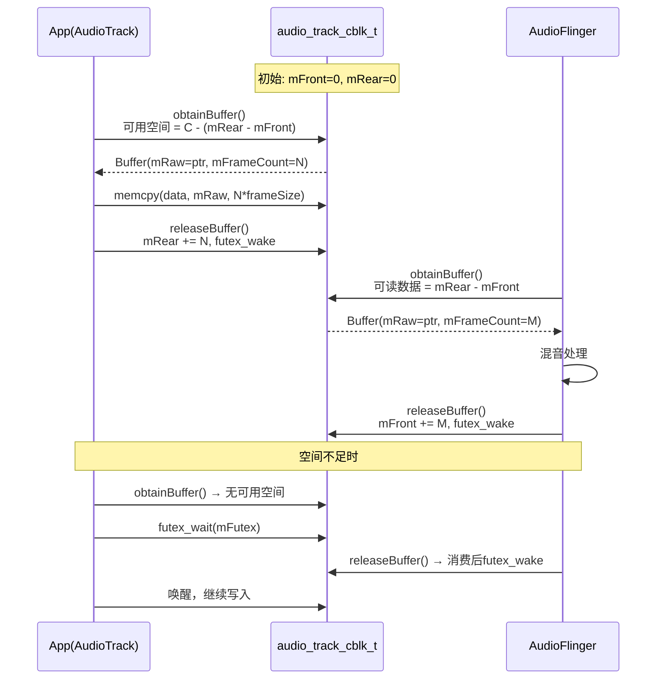
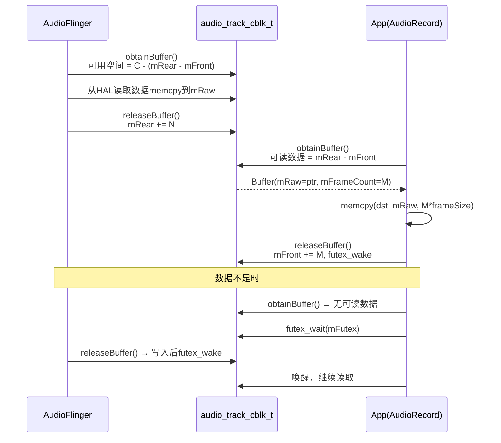
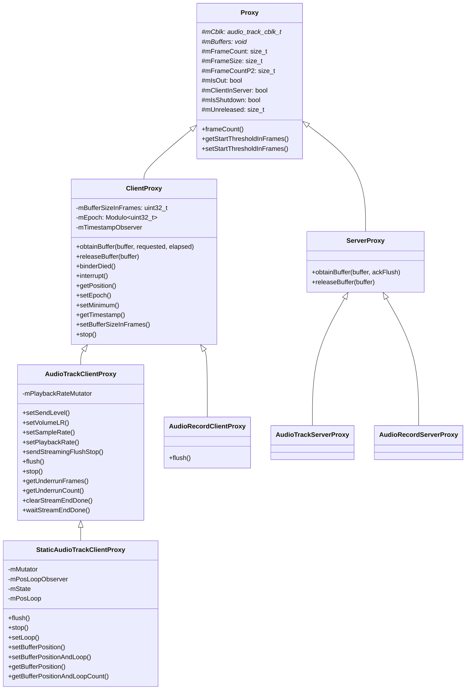
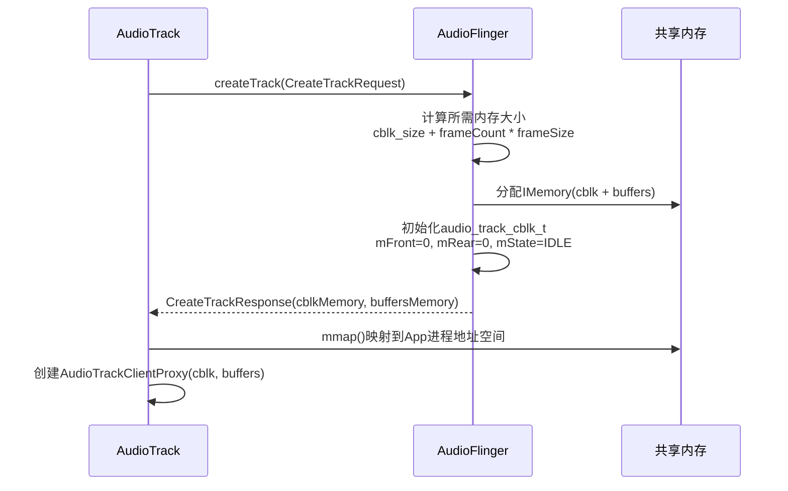
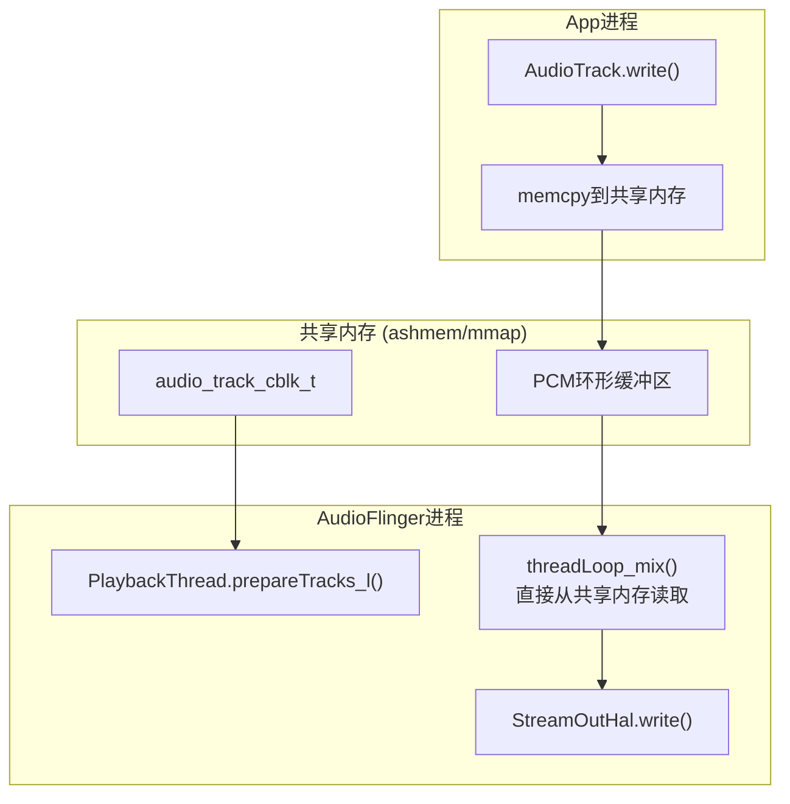

[← 4.3 Binder IPC](04_4.3_Binder_IPC机制.md) | [← 返回Native Framework Layer](README.md) | [返回导航](../README.md) | [4.5 AIDL重构 →](04_4.5_AIDL_IPC接口重构-从Binder_C++到AIDL.md)

## 4.4 共享内存机制深度解析

### 概述

音频系统的共享内存是App进程与AudioFlinger之间零拷贝数据传输的核心。控制命令走Binder IPC，而PCM音频数据通过共享内存环形缓冲区传递，避免了进程间数据拷贝。

**源码位置：** [`AudioTrackShared.h`](frameworks/av/include/private/media/AudioTrackShared.h) (801行)

**核心组件：**
- [`audio_track_cblk_t`](frameworks/av/include/private/media/AudioTrackShared.h:207)：共享控制块结构体
- [`AudioTrackSharedStreaming`](frameworks/av/include/private/media/AudioTrackShared.h:134)：流式模式同步结构
- [`AudioTrackSharedStatic`](frameworks/av/include/private/media/AudioTrackShared.h:190)：静态模式同步结构
- Proxy体系：Client/Server两端操作共享内存的代理层

---

### 4.4.1 共享内存布局

#### 整体内存布局

```
┌──────────────────────────────────────────────────────────────┐
│ IMemory (由AudioFlinger分配的共享内存)                        │
├──────────────────────────────────────────────────────────────┤
│ audio_track_cblk_t (控制块, ~128字节)                        │
│   mServer, mFutex, mMinimum, mVolumeLR, mSampleRate,       │
│   mPlaybackRateQueue, mSendLevel, mExtendedTimestampQueue,  │
│   mBufferSizeInFrames, mFlags, mState,                      │
│   union { mStreaming / mStatic }                            │
├──────────────────────────────────────────────────────────────┤
│ PCM数据缓冲区 (frameCount * frameSize字节)                   │
│   [帧0][帧1][帧2]...[帧N] 环形缓冲区                         │
└──────────────────────────────────────────────────────────────┘
```

#### audio_track_cblk_t 字段详解

[`audio_track_cblk_t`](frameworks/av/include/private/media/AudioTrackShared.h:207) 是共享内存的头部控制块，包含所有同步信息：

| 字段 | 类型 | 偏移 | 访问模式 | 说明 |
|------|------|------|---------|------|
| [`mServer`](frameworks/av/include/private/media/AudioTrackShared.h:225) | `uint32_t` | 0 | Server写/Client读 | AF已消耗(播放)或已生产(录音)的帧数 |
| `mPad1` | `uint32_t` | 4 | — | 未使用对齐填充 |
| [`mFutex`](frameworks/av/include/private/media/AudioTrackShared.h:234) | `volatile int32_t` | 8 | 双向 | futex事件标志，Client等待/Server唤醒 |
| [`mMinimum`](frameworks/av/include/private/media/AudioTrackShared.h:242) | `uint32_t` | 12 | Client写/Server读 | Server唤醒Client的最低可用空间阈值 |
| [`mVolumeLR`](frameworks/av/include/private/media/AudioTrackShared.h:245) | `gain_minifloat_packed_t` | 16 | Client写/Server读 | 立体声音量(仅AudioTrack) |
| [`mSampleRate`](frameworks/av/include/private/media/AudioTrackShared.h:247) | `uint32_t` | 20 | Client写/Server读 | 客户端请求的采样率(仅AudioTrack) |
| [`mPlaybackRateQueue`](frameworks/av/include/private/media/AudioTrackShared.h:250) | `PlaybackRateQueue::Shared` | 24 | Client写/Server读 | 播放速率状态队列 |
| [`mSendLevel`](frameworks/av/include/private/media/AudioTrackShared.h:253) | `uint16_t` | — | Client写/Server读 | Aux效果发送电平(U4.12) |
| [`mExtendedTimestampQueue`](frameworks/av/include/private/media/AudioTrackShared.h:258) | `ExtendedTimestampQueue::Shared` | — | Server写/Client读 | 扩展时间戳队列 |
| [`mBufferSizeInFrames`](frameworks/av/include/private/media/AudioTrackShared.h:262) | `volatile uint32_t` | — | Client写/Server读 | 有效缓冲区大小(可动态调整) |
| [`mStartThresholdInFrames`](frameworks/av/include/private/media/AudioTrackShared.h:263) | `volatile uint32_t` | — | Client写/Server读 | 开始播放最小帧数阈值 |
| [`mFlags`](frameworks/av/include/private/media/AudioTrackShared.h:267) | `volatile int32_t` | — | 双向 | CBLK_*标志组合 |
| [`mState`](frameworks/av/include/private/media/AudioTrackShared.h:269) | `std::atomic<int32_t>` | — | 双向 | TrackBase状态(IDLE/ACTIVE/PAUSING) |
| [`u.mStreaming`](frameworks/av/include/private/media/AudioTrackShared.h:273) | `AudioTrackSharedStreaming` | — | 双向 | 流式模式同步数据 |
| [`u.mStatic`](frameworks/av/include/private/media/AudioTrackShared.h:274) | `AudioTrackSharedStatic` | — | 双向 | 静态模式同步数据 |

---

### 4.4.2 Streaming模式FIFO同步

#### AudioTrackSharedStreaming 结构

[`AudioTrackSharedStreaming`](frameworks/av/include/private/media/AudioTrackShared.h:134) 实现流式模式的环形缓冲区同步：

```cpp
struct AudioTrackSharedStreaming {
    volatile int32_t mFront;              // 消费者读位置(播放:AF, 录音:App)
    volatile int32_t mRear;               // 生产者写位置(播放:App, 录音:AF)
    volatile int32_t mFlush;              // flush计数器，Client递增
    volatile int32_t mStop;               // stop帧位置，Client设置
    volatile uint32_t mUnderrunFrames;     // 欠载帧数，Server递增
    volatile uint32_t mUnderrunCount;      // 欠载次数，Server递增
};
```

#### 环形缓冲区原理

```
                    mFront          mRear
                       ↓               ↓
┌───┬───┬───┬───┬───┬───┬───┬───┬───┬───┐
│ ✓ │ ✓ │ ✓ │ ✓ │ ✓ │   │   │   │   │   │
└───┴───┴───┴───┴───┴───┴───┴───┴───┴───┘
  ←── 已消费 ──→←── 待消费 ──→←── 可写入 ──→

  ✓ = 已填充数据    空 = 可用空间

  已填充帧数 = mRear - mFront  (Modulo运算)
  可用空间   = frameCount - (mRear - mFront)
```

**关键约束：**
- `mFront`和`mRear`使用连续递增的帧计数，通过Modulo运算映射到实际缓冲区位置
- 缓冲区大小必须是2的幂次（`mFrameCountP2`），支持高效的取模运算
- 所有位置操作使用`volatile`关键字确保多进程可见性

#### 播放模式写入/读取流程



#### 录音模式读取流程

录音方向相反：AF是生产者(推进mRear)，App是消费者(推进mFront)：



---

### 4.4.3 Static模式同步机制

#### AudioTrackSharedStatic 结构

[`AudioTrackSharedStatic`](frameworks/av/include/private/media/AudioTrackShared.h:190) 用于静态模式（MODE_STATIC），数据预先写入共享缓冲区，只传递控制状态：

```cpp
struct AudioTrackSharedStatic {
    StaticAudioTrackSingleStateQueue::Shared mSingleStateQueue;  // Client→Server状态
    StaticAudioTrackPosLoopQueue::Shared mPosLoopQueue;          // Server→Client位置
};
```

#### StaticAudioTrackState 状态传递

[`StaticAudioTrackState`](frameworks/av/include/private/media/AudioTrackShared.h:151) 通过`SingleStateQueue`传递循环和位置设置：

```cpp
struct StaticAudioTrackState {
    uint32_t mLoopStart;          // 循环起始帧
    uint32_t mLoopEnd;            // 循环结束帧
    int32_t  mLoopCount;          // 循环次数(-1=无限)
    uint32_t mLoopSequence;       // 循环参数变更序列号
    uint32_t mPosition;           // 播放位置
    uint32_t mPositionSequence;   // 位置变更序列号
};
```

**序列号机制**：`mLoopSequence`和`mPositionSequence`用于判断Client→Server的更新顺序。序列号较大的一方先执行。

#### StaticAudioTrackPosLoop 反馈

[`StaticAudioTrackPosLoop`](frameworks/av/include/private/media/AudioTrackShared.h:172) 由Server写入，Client读取当前位置和循环状态：

```cpp
struct StaticAudioTrackPosLoop {
    uint32_t mBufferPosition;     // 当前播放位置
    int32_t  mLoopCount;          // 剩余循环次数
};
```

---

### 4.4.4 CBLK标志位详解

[`CBLK_*`](frameworks/av/include/private/media/AudioTrackShared.h:38) 标志位用于Client与Server之间的状态通知：

| 标志 | 值 | 说明 | 设置者 | 清除者 |
|------|-----|------|--------|--------|
| `CBLK_UNDERRUN` | 0x01 | 播放欠载 | Server | Client(回调时) |
| `CBLK_FORCEREADY` | 0x02 | 强制Track就绪 | Server | — |
| `CBLK_INVALID` | 0x04 | Track失效需restore | Server/Client | Client(restore后) |
| `CBLK_DISABLED` | 0x08 | 连续欠载导致禁用 | Server | Client(start时) |
| `CBLK_LOOP_CYCLE` | 0x20 | 完成一次循环(非最终) | Server | Client(回调时) |
| `CBLK_LOOP_FINAL` | 0x40 | 完成最终循环 | Server | Client(回调时) |
| `CBLK_BUFFER_END` | 0x80 | 到达buffer末尾 | Server | Client(回调时) |
| `CBLK_OVERRUN` | 0x100 | 录音溢出 | Server | Client(回调时) |
| `CBLK_INTERRUPT` | 0x200 | Client中断 | Client | Client(obtainBuffer) |
| `CBLK_STREAM_END_DONE` | 0x400 | Offload流结束 | Server | Client |

**CBLK_INVALID触发场景：**
1. 设备路由变更（蓝牙断开/连接）
2. AudioFlinger重启（DEAD_OBJECT）
3. AudioPolicy强制重新路由
4. `invalidateTracks()`批量失效

#### mState 状态

[`mState`](frameworks/av/include/private/media/AudioTrackShared.h:269) 反映TrackBase在共享内存中的状态：

| 状态 | 值 | 说明 |
|------|---|------|
| `CBLK_STATE_IDLE` | 0 | 空闲，未激活 |
| `CBLK_STATE_ACTIVE` | 6 | 活跃，正在播放/录音 |
| `CBLK_STATE_PAUSING` | 7 | 正在暂停(音量ramp down) |

---

### 4.4.5 futex同步机制

[`mFutex`](frameworks/av/include/private/media/AudioTrackShared.h:234) 使用Linux futex(Fast Userspace muTEX)实现高效的等待/唤醒：

**工作机制：**
1. Client调用`obtainBuffer()`发现无可用空间
2. 读取`mFutex`，如果无待处理唤醒(`~CBLK_FUTEX_WAKE`)，调用`futex_wait()`
3. Server消费数据后，设置`mFutex |= CBLK_FUTEX_WAKE`，调用`futex_wake()`
4. Client被唤醒，重新检查可用空间

**优化细节：**
- `CBLK_FUTEX_WAKE`(0x01)：延迟唤醒标志，避免不必要的futex系统调用
- `mMinimum`：Server在可用空间 >= mMinimum时才唤醒Client，减少唤醒次数
- futex_wait使用`FUTEX_WAIT_PRIVATE`标志（同一进程内的共享内存场景）

---

### 4.4.6 Proxy体系深度解析

Proxy是操作共享内存的抽象层，隔离Client/Server对底层volatile字段的直接操作。

#### 类继承关系



#### Proxy基类

[`Proxy`](frameworks/av/include/private/media/AudioTrackShared.h:289) 是所有Proxy的基类，持有共享内存的指针：

```cpp
class Proxy : public RefBase {
protected:
    audio_track_cblk_t* const mCblk;    // 控制块指针
    void* const     mBuffers;            // 缓冲区起始地址
    const size_t    mFrameCount;         // 缓冲区帧数
    const size_t    mFrameSize;          // 每帧字节数
    const size_t    mFrameCountP2;       // 向上取整到2的幂
    const bool      mIsOut;              // true=播放, false=录音
    const bool      mClientInServer;     // true=OutputTrack(AF内部)
    bool            mIsShutdown;         // 检测到共享内存损坏
    size_t          mUnreleased;         // 已obtain未release的帧数
};
```

#### ClientProxy

[`ClientProxy`](frameworks/av/include/private/media/AudioTrackShared.h:324) 是App端操作共享内存的代理：

**obtainBuffer() 详解：**

[`obtainBuffer()`](frameworks/av/include/private/media/AudioTrackShared.h:366) 是获取缓冲区空间的核心方法：

输入参数：
- `buffer->mFrameCount`：期望获取的最大帧数
- `requested`：超时设置（NULL/`kNonBlocking`/`kForever`/具体时间）

输出参数：
- `buffer->mFrameCount`：实际可用的连续帧数
- `buffer->mNonContig`：额外的非连续帧数
- `buffer->mRaw`：缓冲区指针

返回值：

| 状态 | 说明 |
|------|------|
| `NO_ERROR` | 成功，mFrameCount > 0 |
| `WOULD_BLOCK` | 非阻塞模式且无可用帧 |
| `TIMED_OUT` | 超时（可能因虚假唤醒） |
| `DEAD_OBJECT` | Server已死亡或Track失效 |
| `-EINTR` | 被interrupt()中断 |
| `NO_INIT` | 共享内存损坏 |
| `NOT_ENOUGH_DATA` | 连续欠载导致Track被禁用 |

**releaseBuffer() 详解：**

[`releaseBuffer()`](frameworks/av/include/private/media/AudioTrackShared.h:377) 提交已处理的帧：

- `buffer->mFrameCount`：要释放的帧数（必须 ≤ 未释放帧数）
- 支持分多次释放同一批obtain的帧
- 释放后更新`mFront`(录音)或`mRear`(播放)并futex_wake

#### AudioTrackClientProxy

[`AudioTrackClientProxy`](frameworks/av/include/private/media/AudioTrackShared.h:445) 是播放端特有的Proxy：

**音量/速率控制方法（无内存屏障，写入即生效）：**

| 方法 | 共享内存字段 | 说明 |
|------|------------|------|
| [`setVolumeLR()`](frameworks/av/include/private/media/AudioTrackShared.h:465) | `mCblk->mVolumeLR` | 直接写入共享内存 |
| [`setSampleRate()`](frameworks/av/include/private/media/AudioTrackShared.h:469) | `mCblk->mSampleRate` | 直接写入 |
| [`setPlaybackRate()`](frameworks/av/include/private/media/AudioTrackShared.h:473) | `mPlaybackRateMutator` | 通过SingleStateQueue |
| [`setSendLevel()`](frameworks/av/include/private/media/AudioTrackShared.h:460) | `mCblk->mSendLevel` | U4.12定点数 |

**flush/stop机制：**

[`sendStreamingFlushStop()`](frameworks/av/include/private/media/AudioTrackShared.h:479) 通过递增`mFlush`/`mStop`计数器通知Server：

- `flush(true)`：递增`mFlush`，Server检测到后丢弃mFront到mRear之间的数据
- `stop()`：设置`mStop = mRear`，Server不读超过此位置

#### AudioRecordClientProxy

[`AudioRecordClientProxy`](frameworks/av/include/private/media/AudioTrackShared.h:558) 是录音端Proxy，构造时`isOut=false`：

```cpp
class AudioRecordClientProxy : public ClientProxy {
public:
    AudioRecordClientProxy(audio_track_cblk_t* cblk, void *buffers,
                           size_t frameCount, size_t frameSize)
        : ClientProxy(cblk, buffers, frameCount, frameSize,
            false /*isOut*/, false /*clientInServer*/) { }

    // 录音flush: 直接将front推进到rear，丢弃所有未读数据
    uint32_t flush() {
        int32_t rear = android_atomic_acquire_load(&mCblk->u.mStreaming.mRear);
        int32_t front = mCblk->u.mStreaming.mFront;
        android_atomic_release_store(rear, &mCblk->u.mStreaming.mFront);
        return (Modulo<int32_t>(rear) - front).unsignedValue();
    }
};
```

**与AudioTrackClientProxy.flush()的差异：**
- 播放flush：递增mFlush计数器，Server异步检测并丢弃数据
- 录音flush：直接设置`mFront = mRear`，立即生效（因为Client是消费者，自己操作mFront）

---

### 4.4.7 MirroredVariable机制

[`MirroredVariable`](frameworks/av/include/private/media/AudioTrackShared.h:68) 是AOSP14引入的镜像变量模板，用于Server端变量同时更新本地副本和共享内存中的镜像：

```cpp
template <typename T, template <typename> class Container = std::atomic>
class MirroredVariable {
public:
    MirroredVariable& operator=(const T& t) {
        t_ = t;             // 更新本地副本
        if (mirror_ != nullptr) {
            *mirror_ = t;   // 同步更新共享内存镜像
        }
        return *this;
    }

    void setMirror(Container<U> *other_mirror) {
        mirror_ = reinterpret_cast<Container<T>*>(other_mirror);
        if (mirror != nullptr) {
            *mirror_ = t_;  // 初始化镜像值
        }
    }

private:
    T t_{};                       // 本地副本
    Container<T>* mirror_ = nullptr;  // 共享内存中的镜像指针
};
```

**设计目的：** Server端的某些变量（如音量、播放位置等）需要本地快速访问，同时需要Client可见。MirroredVariable确保每次赋值同时更新两个位置。

**类型约束：** 使用`std::atomic`确保跨进程访问的原子性，`static_assert`验证类型兼容性。

---

### 4.4.8 SingleStateQueue状态队列

共享内存中使用`SingleStateQueue`传递非原子性的复合状态，避免加锁：

**使用场景：**

| 队列 | 传递方向 | 用途 |
|------|---------|------|
| `PlaybackRateQueue` | Client→Server | 传递AudioPlaybackRate(speed+pitch) |
| `ExtendedTimestampQueue` | Server→Client | 传递ExtendedTimestamp |
| `StaticAudioTrackSingleStateQueue` | Client→Server | 传递Static模式循环/位置 |
| `StaticAudioTrackPosLoopQueue` | Server→Client | 传递Static模式当前位置/循环数 |

**SingleStateQueue原理：**
- Mutator端（写入方）push新状态
- Observer端（读取方）poll最新状态
- 无锁设计，通过原子序列号同步
- 适合低频更新、高频读取的场景

---

### 4.4.9 共享内存分配与映射

#### 分配流程



#### 内存大小计算

```
总大小 = sizeof(audio_track_cblk_t)  // 控制块(~128字节)
       + roundUp(frameCount) * frameSize  // PCM数据缓冲区
```

frameCount由AudioFlinger根据以下因素决定：
1. 请求的frameCount（Client指定）
2. AF输出缓冲区的frameCount
3. 最小缓冲区要求（避免underrun）
4. Fast Track的特殊要求

---

### 4.4.10 零拷贝数据路径总结



**零拷贝本质：** 数据从App到HAL只经一次用户空间拷贝（App→共享内存），AudioFlinger混音器直接从共享内存读取PCM数据，无需额外的进程间拷贝。

**与Binder的对比：**

| 特性 | Binder IPC | 共享内存 |
|------|-----------|---------|
| 数据方向 | 请求/响应模式 | 生产者-消费者模式 |
| 拷贝次数 | 至少2次(发送→内核→接收) | 1次(写入方memcpy) |
| 延迟 | ~1ms(单次Binder事务) | ~10μs(futex唤醒) |
| 适用数据量 | 小数据(控制命令) | 大数据(PCM音频) |
| 同步方式 | Binder驱动 | futex + volatile |

---

### 4.4.11 缓冲区大小动态调整

[`mBufferSizeInFrames`](frameworks/av/include/private/media/AudioTrackShared.h:262) 允许运行时动态调整有效缓冲区大小：

```cpp
// ClientProxy::setBufferSizeInFrames()
uint32_t ClientProxy::setBufferSizeInFrames(uint32_t requestedSize) {
    // 1. 限制范围: [mMinimum, mFrameCount]
    // 2. 写入共享内存: mCblk->mBufferSizeInFrames = requestedSize
    // 3. 更新本地缓存: mBufferSizeInFrames = requestedSize
    // 4. 返回实际设置的大小
}
```

**使用场景：**
- 降低延迟：减小缓冲区，代价是增加underrun风险
- 提高稳定性：增大缓冲区，代价是增加延迟
- App可通过`AudioTrack.setBufferSizeInFrames()`动态调整

---

### 4.4.12 共享内存损坏检测

Proxy中设置了`mIsShutdown`标志用于检测共享内存损坏：

```cpp
// obtainBuffer()中检查
if (mIsShutdown) {
    return NO_INIT;  // 共享内存已损坏
}
```

**损坏原因：**
1. 另一端进程异常退出，导致volatile字段处于不一致状态
2. 共享内存被意外释放
3. 并发写入导致的位置计数器异常

检测到损坏后，Proxy返回`NO_INIT`，上层AudioTrack需要重建连接。

---

[← 4.3 Binder IPC](04_4.3_Binder_IPC机制.md) | [← 返回Native Framework Layer](README.md) | [返回导航](../README.md) | [4.5 AIDL重构 →](04_4.5_AIDL_IPC接口重构-从Binder_C++到AIDL.md)