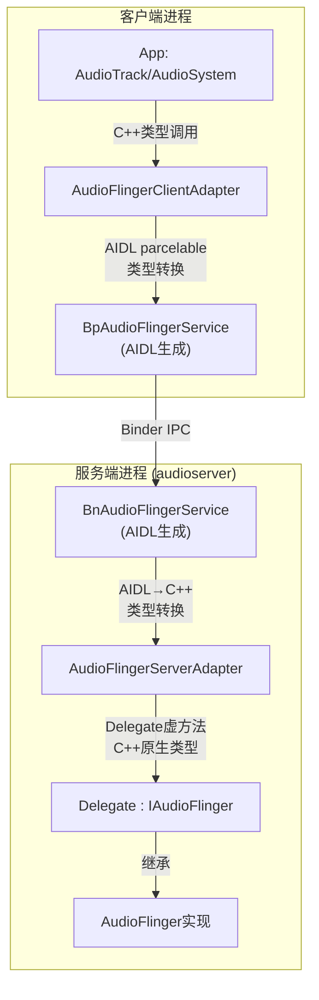
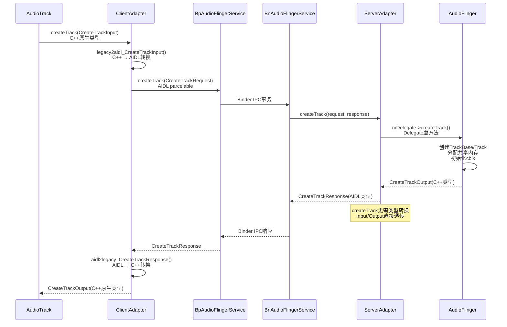

[← 4.4 共享内存](04_4.4_共享内存机制深度解析.md) | [← 返回Native Framework Layer](README.md) | [返回导航](../README.md) | [4.6 audio_utils →](04_4.6_audio_utils核心工具类.md)

## 4.5 AIDL IPC接口重构 — 从Binder C++到AIDL

### 概述

AOSP14将音频IPC从传统Binder C++迁移到AIDL（Android Interface Definition Language），这是Treble架构分离的延续。AIDL生成的代码自动处理parceling/unparceling，提供类型安全，并支持稳定的ABI。

**核心源码：**
- AIDL定义：[`IAudioFlingerService.aidl`](frameworks/av/media/libaudioclient/aidl/android/media/IAudioFlingerService.aidl) (295行)
- 适配器实现：[`IAudioFlinger.cpp`](frameworks/av/media/libaudioclient/IAudioFlinger.cpp) (1450+行)
- 适配器声明：[`IAudioFlinger.h`](frameworks/av/media/libaudioclient/include/media/IAudioFlinger.h) (741行)
- 类型转换：[`AidlConversion.cpp`](frameworks/av/media/libaudioclient/AidlConversion.cpp)

**AIDL文件清单：** [`aidl/android/media/`](frameworks/av/media/libaudioclient/aidl/android/media/) 目录下共82个.aidl文件

---

### 4.5.1 IAudioFlingerService AIDL接口

[`IAudioFlingerService.aidl`](frameworks/av/media/libaudioclient/aidl/android/media/IAudioFlingerService.aidl) 定义了AudioFlinger的全部公开IPC接口，共约50个方法：

#### 方法分类详解

| 方法分类 | AIDL方法 | 说明 |
|----------|----------|------|
| **Track/Record创建** | `createTrack(CreateTrackRequest)` → `CreateTrackResponse` | 创建播放Track，参数通过parcelable封装 |
| | `createRecord(CreateRecordRequest)` → `CreateRecordResponse` | 创建录制Record，参数通过parcelable封装 |
| **查询** | `sampleRate(ioHandle)` → int | 查询输出采样率 |
| | `format(output)` → AudioFormatDescription | 查询输出格式 |
| | `frameCount(ioHandle)` → long | 查询输出帧数 |
| | `latency(output)` → int | 查询输出延迟(ms) |
| | `frameCountHAL(ioHandle)` → long | HAL层帧数 |
| **主音量/静音** | `setMasterVolume(value)` / `masterVolume()` | 主音量控制 |
| | `setMasterMute(muted)` / `masterMute()` | 主静音控制 |
| | `setMasterBalance(balance)` / `getMasterBalance()` | 主左右平衡 |
| **Stream音量** | `setStreamVolume(stream, value, output)` | Stream音量 |
| | `setStreamMute(stream, muted)` / `streamMute(stream)` | Stream静音 |
| **模式/麦克风** | `setMode(mode)` | 设置音频模式 |
| | `setMicMute(state)` / `getMicMute()` | 麦克风静音 |
| | `setRecordSilenced(portId, silenced)` | 静音指定录音 |
| **参数** | `setParameters(ioHandle, keyValuePairs)` / `getParameters(...)` | HAL参数设置 |
| **客户端注册** | `registerClient(IAudioFlingerClient)` | 注册IO变更通知(单例/进程) |
| **输出/输入** | `openOutput(OpenOutputRequest)` / `openInput(OpenInputRequest)` | 打开HAL输出/输入 |
| | `openDuplicateOutput(output1, output2)` / `closeOutput/closeInput` | 输出复制/关闭 |
| | `suspendOutput/restoreOutput` | 输出挂起/恢复 |
| **Patch/Port** | `createAudioPatch(patch)` / `releaseAudioPatch(handle)` | 音频路由patch |
| | `getAudioPort(port)` / `setAudioPortConfig(config)` | 音频端口配置 |
| | `listAudioPatches(maxCount)` | 列出所有patch |
| **Effect** | `createEffect(CreateEffectRequest)` | 音效创建 |
| | `queryEffect(index)` / `queryNumberEffects()` | 音效查询 |
| | `getEffectDescriptor(uuid, typeUuid, flag)` | 音效描述符 |
| | `moveEffects(session, srcOutput, dstOutput)` | 移动效果器 |
| | `setEffectSuspended(effectId, sessionId, suspended)` | 挂起效果器 |
| **系统通知** | `systemReady()` / `audioPolicyReady()` | 系统就绪通知(**oneway**) |
| **SoundDose** | `getSoundDoseInterface(callback)` → ISoundDose | CSD接口获取 |
| **蓝牙延迟** | `supportsBluetoothVariableLatency()` | BT可变延迟支持查询 |
| | `setBluetoothVariableLatencyEnabled(enabled)` | BT可变延迟开关 |
| | `isBluetoothVariableLatencyEnabled()` | BT可变延迟状态 |
| **AAudio MMAP** | `getMmapPolicyInfos(policyType)` | MMAP策略查询 |
| | `getAAudioMixerBurstCount()` / `getAAudioHardwareBurstMinUsec()` | MMAP参数 |
| **Track失效** | `invalidateTracks(portIds)` | 按portId批量失效Track |
| **配置** | `getAudioPolicyConfig()` | 获取AudioPolicy配置(仅AIDL) |

#### oneway方法

AIDL中标记`oneway`的方法是异步调用，不等待服务端返回：

| 方法 | 说明 |
|------|------|
| `systemReady()` | 系统就绪通知，不需要阻塞等待 |
| `audioPolicyReady()` | AudioPolicy就绪通知 |

---

### 4.5.2 双层适配器架构

AOSP14采用"适配器模式"实现从Binder C++到AIDL的平滑迁移，存在客户端和服务端两个适配器。

#### 架构全景



#### AudioFlingerClientAdapter — 客户端适配器

[`AudioFlingerClientAdapter`](frameworks/av/media/libaudioclient/include/media/IAudioFlinger.h:468) 包装AIDL代理，提供C++原生接口：

```cpp
class AudioFlingerClientAdapter : public IAudioFlinger {
public:
    explicit AudioFlingerClientAdapter(
            const sp<media::IAudioFlingerService>& delegate)
        : mDelegate(delegate) {}

    // 将C++参数转换为AIDL类型，调用AIDL代理
    status_t createTrack(const media::CreateTrackInput& input,
                         media::CreateTrackOutput* output) override {
        // 1. C++ → AIDL类型转换
        media::CreateTrackRequest requestAidl =
            VALUE_OR_RETURN_STATUS(legacy2aidl_CreateTrackInput(request));
        // 2. 调用AIDL代理
        media::CreateTrackResponse responseAidl;
        Return<void> ret = mDelegate->createTrack(requestAidl, &responseAidl);
        // 3. AIDL → C++类型转换
        return aidl2legacy_CreateTrackResponse(responseAidl, output);
    }

private:
    const sp<media::IAudioFlingerService> mDelegate;  // AIDL代理
};
```

**客户端适配器转换方向：** C++原生类型 → AIDL parcelable类型（请求），AIDL → C++（响应）

#### AudioFlingerServerAdapter — 服务端适配器

[`AudioFlingerServerAdapter`](frameworks/av/media/libaudioclient/include/media/IAudioFlinger.h:513) 继承`BnAudioFlingerService`，将AIDL调用转发到C++实现：

```cpp
class AudioFlingerServerAdapter : public media::BnAudioFlingerService {
public:
    // 服务端适配器构造，设置音频调度优先级
    explicit AudioFlingerServerAdapter(
            const sp<AudioFlingerServerAdapter::Delegate>& delegate)
        : mDelegate(delegate) {
        setMinSchedulerPolicy(SCHED_NORMAL, ANDROID_PRIORITY_AUDIO);
    }

    // AIDL方法 → C++ Delegate方法
    Status createTrack(const media::CreateTrackRequest& request,
                       media::CreateTrackResponse* _aidl_return) override {
        return Status::fromStatusT(
            mDelegate->createTrack(request, *_aidl_return));
    }

    // 需要类型转换的方法
    Status sampleRate(int32_t ioHandle, int32_t* _aidl_return) override {
        // AIDL int32_t → C++ audio_io_handle_t
        audio_io_handle_t ioHandleLegacy = VALUE_OR_RETURN_BINDER(
            aidl2legacy_int32_t_audio_io_handle_t(ioHandle));
        // 调用C++实现
        // C++ uint32_t → AIDL int32_t
        *_aidl_return = VALUE_OR_RETURN_BINDER(
            convertIntegral<int32_t>(mDelegate->sampleRate(ioHandleLegacy)));
        return Status::ok();
    }

private:
    const sp<AudioFlingerServerAdapter::Delegate> mDelegate;
};
```

**服务端适配器转换方向：** AIDL parcelable类型 → C++原生类型

#### Delegate接口

[`Delegate`](frameworks/av/media/libaudioclient/include/media/IAudioFlinger.h:520) 是ServerAdapter的核心，AudioFlinger类直接继承它：

```cpp
class Delegate : public IAudioFlinger {
    // 暴露TransactionCode枚举用于TimeCheck
    enum class TransactionCode {
        CREATE_TRACK = BnAudioFlingerService::TRANSACTION_createTrack,
        CREATE_RECORD = BnAudioFlingerService::TRANSACTION_createRecord,
        SAMPLE_RATE = BnAudioFlingerService::TRANSACTION_sampleRate,
        // ... 50+事务码
    };

protected:
    // 可选钩子：每次事务调用前后执行
    virtual status_t onTransactWrapper(
        TransactionCode code, const Parcel& data,
        uint32_t flags, const std::function<status_t()>& delegate) {
        return delegate();  // 默认直接透传
    }

    // 可选钩子：dumpsys实现
    virtual status_t dump(int fd, const Vector<String16>& args) {
        return OK;  // 默认空实现
    }
};
```

**onTransactWrapper用途：**
- 权限检查（AudioFlinger用它检查调用者权限）
- 事务日志/性能监控（TimeCheck）
- 请求限流/拒绝服务防护

---

### 4.5.3 IAudioTrack AIDL接口

[`IAudioTrack.aidl`](frameworks/av/media/libaudioclient/aidl/android/media/IAudioTrack.aidl) 定义了播放Track的Binder接口：

| 方法 | 返回类型 | 说明 |
|------|---------|------|
| `getCblk()` | `SharedFileRegion` | 获取共享内存控制块 |
| `start()` | int(status_t) | 启动播放 |
| `stop()` | void | 停止播放 |
| `flush()` | void | 刷新缓冲区 |
| `pause()` | void | 暂停播放 |
| `attachAuxEffect(effectId)` | int | 附加辅助效果 |
| `setParameters(keyValuePairs)` | int | 设置HAL参数 |
| `selectPresentation(presentationId, programId)` | int | 选择演示 |
| `getTimestamp(timestamp)` | int | 获取时间戳 |
| `signal()` | void | 通知播放线程控制块变更 |
| `applyVolumeShaper(configuration, operation)` | int | 应用音量整形 |
| `getVolumeShaperState(id)` | VolumeShaperState | 获取音量整形状态 |
| `getDualMonoMode()` | AudioDualMonoMode | 获取双单声道模式 |
| `setDualMonoMode(mode)` | void | 设置双单声道模式 |
| `getAudioDescriptionMixLevel()` | float | 获取音频描述混合级别 |
| `setAudioDescriptionMixLevel(leveldB)` | void | 设置音频描述混合级别 |
| `getPlaybackRateParameters()` | AudioPlaybackRate | 获取播放速率 |
| `setPlaybackRateParameters(playbackRate)` | void | 设置播放速率 |

**关键设计：** `getCblk()`返回[`SharedFileRegion`](frameworks/av/media/libshmem/aidl/android/media/SharedFileRegion.aidl)，这是AIDL版本的共享内存文件描述符传递，替代了旧版Binder的`binderDup()`方式。

---

### 4.5.4 IAudioRecord AIDL接口

[`IAudioRecord.aidl`](frameworks/av/media/libaudioclient/aidl/android/media/IAudioRecord.aidl) 定义了录音Record的Binder接口：

| 方法 | 返回类型 | 说明 |
|------|---------|------|
| `start(event, triggerSession)` | void | 启动录音(event:同步事件类型) |
| `stop()` | void | 停止录音 |
| `getActiveMicrophones(activeMicrophones)` | void | 获取活跃麦克风列表 |
| `setPreferredMicrophoneDirection(direction)` | void | 设置麦克风方向 |
| `setPreferredMicrophoneFieldDimension(zoom)` | void | 设置麦克风缩放 |
| `shareAudioHistory(packageName, startMs)` | void | 分享音频历史 |

**与IAudioTrack的差异：**
- IAudioRecord没有`flush()/pause()/getCblk()`方法
- `start()`需要传入同步事件参数（用于同步录音启动）
- 新增`shareAudioHistory()`用于AAOS音频历史共享
- 没有VolumeShaper/DualMonoMode等播放特有功能

---

### 4.5.5 IAudioTrackCallback/IAudioFlingerClient回调

#### IAudioTrackCallback

[`IAudioTrackCallback.aidl`](frameworks/av/media/libaudioclient/aidl/android/media/IAudioTrackCallback.aidl) 目前仅定义一个方法：

```java
interface IAudioTrackCallback {
    oneway void onCodecFormatChanged(in byte[] audioMetadata);
}
```

**与传统Binder C++的对比：**

| 回调事件 | Binder C++ | AIDL | 通知机制 |
|---------|-----------|------|---------|
| 编解码格式变更 | IAudioTrackCallback.onCodecFormatChanged | ✅ AIDL oneway | Binder回调 |
| 欠载(underrun) | IAudioTrackCallback.onUnderrun | ❌ | 共享内存cblk标志 |
| 流结束 | IAudioTrackCallback.onStreamEnd | ❌ | 共享内存cblk标志 |
| 溢出(overflow) | IAudioTrackCallback.onOverflow | ❌ | 共享内存cblk标志 |

**设计理由：** underrun/overflow/streamEnd是高频事件，通过Binder回调会造成大量IPC开销。使用共享内存cblk标志位+CBLK_FUTEX_WAKE机制，由Client端轮询/等待读取，性能远优于Binder回调。

#### IAudioFlingerClient

[`IAudioFlingerClient.aidl`](frameworks/av/media/libaudioclient/aidl/android/media/IAudioFlingerClient.aidl) 定义了AudioFlinger到客户端的异步通知：

| 方法 | 说明 |
|------|------|
| `ioConfigChanged(event, ioDesc)` | IO配置变更通知(**oneway**) |
| `onSupportedLatencyModesChanged(output, latencyModes)` | 延迟模式变更通知(**oneway**) |

**ioConfigChanged事件类型：**

| AudioIoConfigEvent | 说明 |
|--------------------|------|
| OUTPUT_OPENED | 输出流打开 |
| OUTPUT_CLOSED | 输出流关闭 |
| OUTPUT_CONFIG_CHANGED | 输出配置变更(采样率/格式等) |
| INPUT_OPENED | 输入流打开 |
| INPUT_CLOSED | 输入流关闭 |
| INPUT_CONFIG_CHANGED | 输入配置变更 |
| STREAM_CONFIG_CHANGED | Stream配置变更 |
| PATCH_LIST_UPDATED | Patch列表更新 |
| OPENED_DEVICES_CHANGED | 已打开设备变更 |

**注册时机：** AudioSystem初始化时调用`registerClient()`，每个进程只允许注册一次（单例模式）。

---

### 4.5.6 AidlConversion类型转换层

AIDL与C++类型转换是迁移的核心开销。[`AidlConversion.cpp`](frameworks/av/media/libaudioclient/AidlConversion.cpp) 提供双向转换函数：

#### 核心转换函数分类

| 转换方向 | 函数模式 | 示例 |
|---------|---------|------|
| AIDL → C++ | `aidl2legacy_*` | `aidl2legacy_int32_t_audio_io_handle_t()` |
| C++ → AIDL | `legacy2aidl_*` | `legacy2aidl_audio_io_handle_t_int32_t()` |
| 整型转换 | `convertIntegral<Dst>(src)` | `convertIntegral<int32_t>(uint32_t)` |
| 枚举映射 | `aidl2legacy_AudioStreamType_audio_stream_type_t()` | AIDL AudioStreamType ↔ C++ audio_stream_type_t |

#### 错误处理宏

```cpp
// 客户端适配器使用
#define VALUE_OR_RETURN_STATUS(x)  \       // 返回status_t
    ({ auto _tmp = (x); ... })

// 服务端适配器使用
#define VALUE_OR_RETURN_BINDER(x)  \       // 返回Binder Status
    ({ auto _tmp = (x); ... })
```

**关键类型映射表：**

| C++类型 | AIDL类型 | 转换函数 |
|---------|---------|---------|
| `audio_io_handle_t` (int) | `int32_t` | `aidl2legacy_int32_t_audio_io_handle_t` |
| `audio_stream_type_t` (enum) | `AudioStreamType` | `aidl2legacy_AudioStreamType_audio_stream_type_t` |
| `audio_format_t` (uint32_t) | `AudioFormatDescription` | `legacy2aidl_audio_format_t_AudioFormatDescription` |
| `audio_channel_mask_t` (uint32_t) | `AudioChannelLayout` | `legacy2aidl_audio_channel_mask_t_AudioChannelLayout` |
| `audio_config_t` (struct) | `AudioConfig` | `aidl2legacy_AudioConfig_audio_config_t` |
| `audio_attributes_t` (struct) | `AudioAttributesInternal` | `aidl2legacy_AudioAttributesInternal_audio_attributes_t` |
| `audio_port_v7` (struct) | `AudioPortFw` | `legacy2aidl_audio_port_v7_AudioPortFw` |
| `audio_patch` (struct) | `AudioPatchFw` | `legacy2aidl_audio_patch_AudioPatchFw` |

#### 性能开销分析

| 操作 | 无转换(直通) | 有转换 | 开销 |
|------|------------|--------|------|
| `setMasterVolume(float)` | ~1μs | ~1μs | 几乎为零(float直通) |
| `sampleRate(handle)` | ~5μs | ~8μs | 整型转换+错误检查 |
| `format(output)` | ~5μs | ~15μs | AudioFormatDescription构造 |
| `createTrack(request)` | ~200μs | ~250μs | 多字段结构体转换 |

**结论：** 简单方法(setMasterVolume等float直通)几乎无开销；复杂方法(createTrack等多字段结构体)转换开销约20-25%，但在总Binder IPC延迟(>1ms)中占比极小。

---

### 4.5.7 createTrack完整AIDL交互时序



**优化细节：** `createTrack`和`createRecord`在ServerAdapter中直接透传，不做类型转换。这是因为`CreateTrackRequest/Response`的AIDL parcelable与C++ `CreateTrackInput/Output`已做了内部对齐，Adapter直接透传更高效。

---

### 4.5.8 TransactionCode枚举

[`Delegate::TransactionCode`](frameworks/av/media/libaudioclient/include/media/IAudioFlinger.h:524) 枚举了所有AIDL事务码，直接映射到AIDL生成的`BnAudioFlingerService::TRANSACTION_*`常量：

| 事务码 | 值 | 用途 |
|--------|---|------|
| `CREATE_TRACK` | `TRANSACTION_createTrack` | 创建播放Track |
| `CREATE_RECORD` | `TRANSACTION_createRecord` | 创建录音Record |
| `SAMPLE_RATE` | `TRANSACTION_sampleRate` | 查询采样率 |
| `SET_MASTER_VOLUME` | `TRANSACTION_setMasterVolume` | 设置主音量 |
| `REGISTER_CLIENT` | `TRANSACTION_registerClient` | 注册客户端 |
| `OPEN_OUTPUT` | `TRANSACTION_openOutput` | 打开输出 |
| `CREATE_AUDIO_PATCH` | `TRANSACTION_createAudioPatch` | 创建音频Patch |
| `CREATE_EFFECT` | `TRANSACTION_createEffect` | 创建效果器 |
| `SYSTEM_READY` | `TRANSACTION_systemReady` | 系统就绪通知 |
| `GET_SOUND_DOSE_INTERFACE` | `TRANSACTION_getSoundDoseInterface` | CSD接口 |
| `INVALIDATE_TRACKS` | `TRANSACTION_invalidateTracks` | 批量失效Track |

**用途：** `onTransactWrapper()`钩子接收`TransactionCode`参数，AudioFlinger用它做：
1. **权限检查**：某些事务码需要特定权限（如`SET_MASTER_VOLUME`需要`android.permission.MODIFY_AUDIO_SETTINGS`）
2. **TimeCheck**：监控每个事务的执行时间，超时报警
3. **审计日志**：记录关键操作

---

### 4.5.9 AIDL vs Binder C++全面对比

| 维度 | Binder C++ (旧) | AIDL (新) |
|------|------------------|-----------|
| **代码生成** | 手工编写Bn/Bp代理 | AIDL工具自动生成 |
| **类型安全** | 手动parcel，易出错 | 编译期类型检查 |
| **ABI稳定性** | 无保证，布局变化即break | Stable AIDL，跨版本兼容 |
| **性能** | 直接C++调用，零转换开销 | 需AidlConversion层转换类型 |
| **参数复杂度** | flat参数列表 | parcelable封装，结构化 |
| **回调机制** | BpCallback手动parcel | AIDL oneway自动生成 |
| **维护成本** | 高 — 需同步更新.h/.cpp | 低 — 修改aidl即可 |
| **跨版本兼容** | 无保障 | Stable AIDL保证 |
| **服务注册** | `defaultServiceManager()->addService()` | 同，但使用AIDL生成的Bn |
| **共享内存传递** | `binderDup()` | `SharedFileRegion` parcelable |

#### 迁移完成度

| 组件 | AIDL定义 | 适配器 | 状态 |
|------|---------|--------|------|
| IAudioFlingerService | ✅ 50+方法 | ClientAdapter + ServerAdapter | **完全迁移** |
| IAudioTrack | ✅ 17方法 | TrackHandle(服务端) | **完全迁移** |
| IAudioRecord | ✅ 6方法 | RecordHandle(服务端) | **完全迁移** |
| IAudioTrackCallback | ✅ 1方法(oneway) | Track回调 | **部分迁移**（仅codec格式变更） |
| IAudioFlingerClient | ✅ 2方法(oneway) | Client回调 | **完全迁移** |
| IAudioPolicyService | ✅ 40+方法 | — | **完全迁移** |

---

### 4.5.10 Parcelable数据结构

AIDL使用parcelable替代C++结构体，主要定义：

| Parcelable | 替代C++结构 | 关键字段 |
|-----------|------------|---------|
| `CreateTrackRequest` | `CreateTrackInput` | attr, config, clientInfo, sharedBuffer, speed, flags, frameCount |
| `CreateTrackResponse` | `CreateTrackOutput` | flags, frameCount, sampleRate, streamType, afLatencyMs, outputId, portId, audioTrack, cblk, buffers |
| `CreateRecordRequest` | `CreateRecordInput` | attr, config, clientInfo, riid, maxSharedAudioHistoryMs |
| `CreateRecordResponse` | `CreateRecordOutput` | cblk, buffers, audioRecord, serverConfig, halConfig |
| `OpenOutputRequest` | — | device, flags, config, halOutput |
| `OpenOutputResponse` | — | output, config, halOutput |
| `AudioIoDescriptor` | — | ioHandle, sound, recording, source, sink |
| `SharedFileRegion` | `IMemory` | fd, offset, size — 共享内存文件描述符 |

**SharedFileRegion** 是AIDL版本的共享内存传递机制，替代了旧版`IMemory`。它包含：
- `fd`：文件描述符（通过Binder传输时自动dup）
- `offset`：共享内存偏移
- `size`：共享内存大小

---

### 4.5.11 服务注册与获取

#### 服务端注册

```cpp
// AudioFlinger::onFirstRef()
sp<AudioFlingerServerAdapter> adapter =
    new AudioFlingerServerAdapter(this);  // this即AudioFlinger(Delegate子类)
defaultServiceManager()->addService(
    String16(IAudioFlinger::DEFAULT_SERVICE_NAME),  // "media.audio_flinger"
    adapter);
```

#### 客户端获取

```cpp
// AudioSystem::get_audio_flinger()
sp<media::IAudioFlingerService> afService =
    media::IAudioFlingerService::asService(
        String16(IAudioFlinger::DEFAULT_SERVICE_NAME));
sp<AudioFlingerClientAdapter> adapter =
    new AudioFlingerClientAdapter(afService);
```

**双重包装链路：**
```
App → AudioFlingerClientAdapter → BpAudioFlingerService → Binder → BnAudioFlingerService → AudioFlingerServerAdapter → AudioFlinger
```

---

[← 4.4 共享内存](04_4.4_共享内存机制深度解析.md) | [← 返回Native Framework Layer](README.md) | [返回导航](../README.md) | [4.6 audio_utils →](04_4.6_audio_utils核心工具类.md)