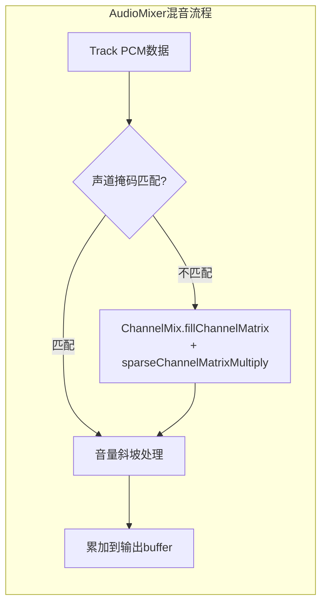
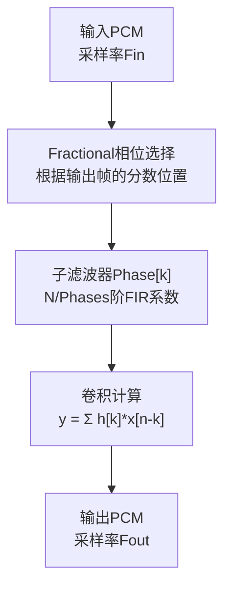
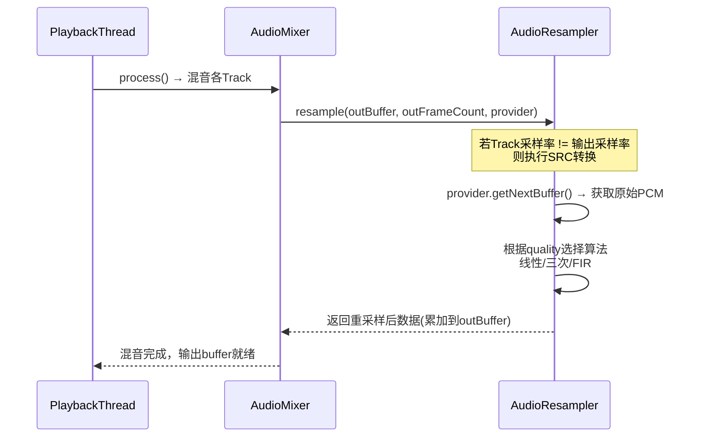
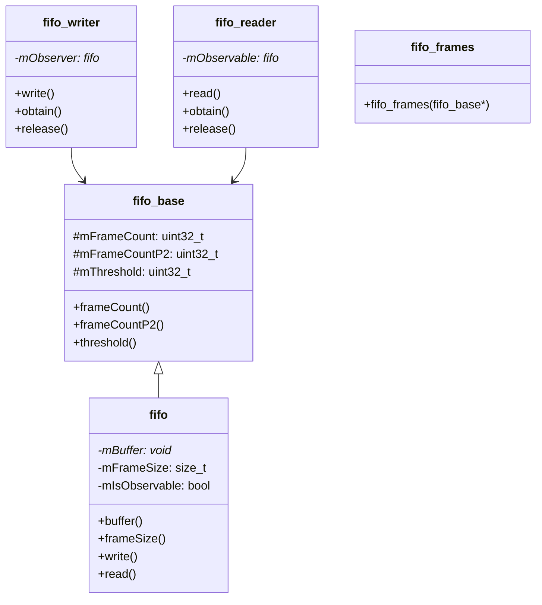
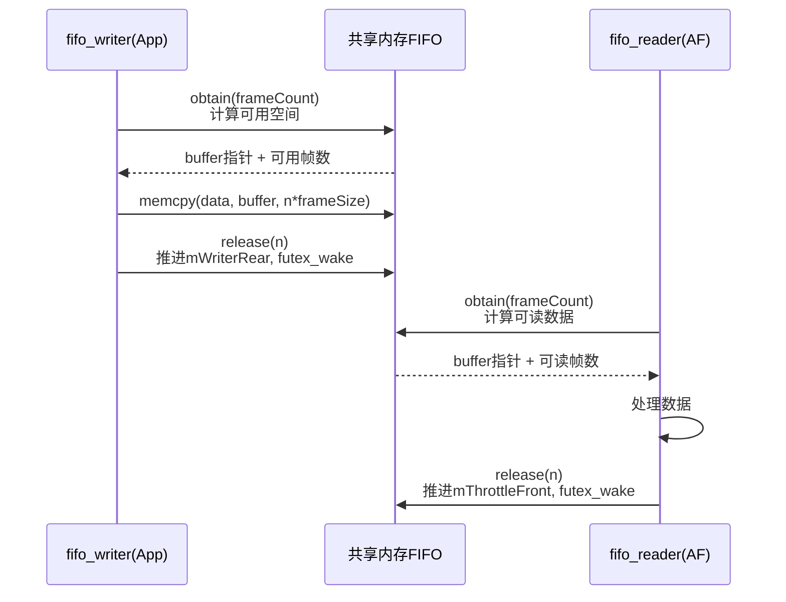
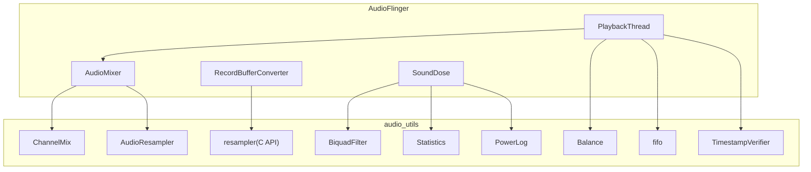
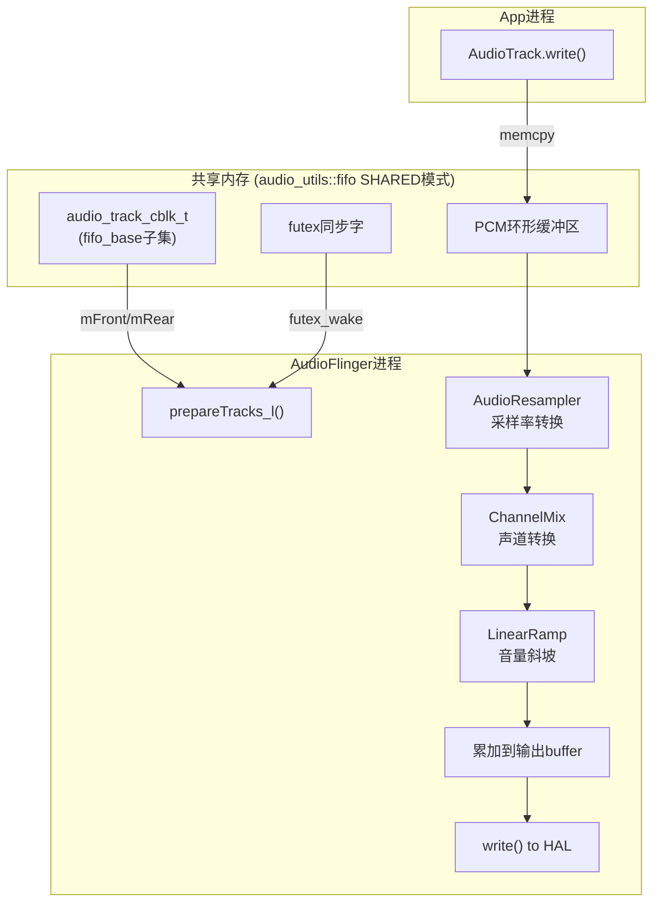

[← 4.5 AIDL重构](04_4.5_AIDL_IPC接口重构-从Binder_C++到AIDL.md) | [← 返回Native Framework Layer](README.md) | [返回导航](../README.md) | [05 AudioFlinger →](../05_AudioFlinger/README.md)

## 4.6 audio_utils核心工具类

### 概述

audio_utils是AOSP音频子系统的底层工具库，提供声道混音、采样率转换、FIFO管理、滤波器等基础能力。它被AudioFlinger、AudioPolicyManager、AudioMixer等核心组件大量使用。

**源码目录：** [`system/media/audio_utils/include/audio_utils/`](system/media/audio_utils/include/audio_utils/)

---

### 4.6.1 ChannelMix — 多声道混音矩阵

源码: [`ChannelMix.h`](system/media/audio_utils/include/audio_utils/ChannelMix.h)

#### 核心函数

[`fillChannelMatrix<OUTPUT_CHANNEL_MASK>()`](system/media/audio_utils/include/audio_utils/ChannelMix.h) 以编译期模板参数生成混音系数矩阵：

```cpp
template <audio_channel_mask_t OUTPUT_CHANNEL_MASK, size_t M>
constexpr bool fillChannelMatrix(
    audio_channel_mask_t INPUT_CHANNEL_MASK,
    float (&matrix)[M][outputChannelCount])
```

**编译期优化：** 输出声道掩码是模板参数，编译器可针对特定输出配置生成特化代码，避免运行时分支。

#### 5.1→Stereo下混矩阵（ITU-R 775-2标准）

| 输入声道 | FL输出系数 | FR输出系数 | 说明 |
|----------|-----------|-----------|------|
| Front Left | 1.0 | 0 | 直通 |
| Front Right | 0 | 1.0 | 直通 |
| Front Center | 0.707 (√2/2) | 0.707 | -3dB等功率分配 |
| LFE | 0.5 | 0.5 | 半幅混入(防扬声器过载) |
| Back Left | 0.707 | 0 | -3dB侧声道 |
| Back Right | 0 | 0.707 | -3dB侧声道 |

**-3dB原理：** `√2/2 ≈ 0.707`是等功率分配系数。中心声道同时送入L和R，每路减半功率，总功率保持不变：`0.707² + 0.707² ≈ 1.0`。

#### 7.1→Stereo下混矩阵

| 输入声道 | FL | FR | 说明 |
|----------|-----|-----|------|
| Front Left | 1.0 | 0 | 直通 |
| Front Right | 0 | 1.0 | 直通 |
| Front Center | 0.707 | 0.707 | -3dB |
| LFE | 0.5 | 0.5 | 防过载 |
| Side Left | 0.707 | 0 | -3dB侧声道 |
| Side Right | 0 | 0.707 | -3dB侧声道 |
| Back Left | 0.707 | 0 | -3dB后声道 |
| Back Right | 0 | 0.707 | -3dB后声道 |

**注意：** Side和Back都使用0.707系数，混入对应侧的前方声道。

#### Mono→Stereo上混

| 输入声道 | FL | FR |
|----------|-----|-----|
| Center/Mono | 1.0 | 1.0 |

Mono直接双声道复制，无需-3dB（因为没有功率叠加问题）。

#### sparseChannelMatrixMultiply

[`sparseChannelMatrixMultiply`](system/media/audio_utils/include/audio_utils/ChannelMix.h) 是编译期优化的混音执行函数：

```cpp
template <audio_channel_mask_t OUTPUT_CHANNEL_MASK,
          audio_channel_mask_t INPUT_CHANNEL_MASK,
          typename T, size_t M, size_t N>
void sparseChannelMatrixMultiply(
    const T *src, T *dst, const float (&matrix)[M][N])
```

**优化原理：**
1. 利用模板特化，编译器直接展开稀疏矩阵的非零元素
2. 避免运行时switch/if分支判断声道组合
3. 编译器可对特定声道组合生成SIMD优化代码
4. 矩阵中大量零元素（直通/无关声道）被编译期消除

#### 与AudioMixer的调用关系



---

### 4.6.2 resampler — 采样率转换引擎

AOSP音频子系统有**两套**SRC实现：

| 体系 | API | 源码位置 | 用途 |
|------|-----|---------|------|
| audio_utils/resampler | C API | [`resampler.h`](system/media/audio_utils/include/audio_utils/resampler.h) | 录音路径(RecordBufferConverter) |
| AudioResampler | C++ API | [`AudioResampler.h`](frameworks/av/media/libaudioprocessing/include/media/AudioResampler.h) | 播放路径(AudioMixer/PlaybackThread) |

#### AudioResampler体系 — 4种实现

| 实现类 | 质量 | 算法 | 用途 | 源码 |
|--------|------|------|------|------|
| [`AudioResamplerOrder1`](frameworks/av/media/libaudioprocessing/AudioResampler.cpp) | LOW | 线性插值(1阶) | VoIP/低延迟场景 | AudioResampler.cpp |
| [`AudioResamplerCubic`](frameworks/av/media/libaudioprocessing/AudioResamplerCubic.h) | MED | 三次插值(3阶Hermite) | 一般播放 | AudioResamplerCubic.cpp |
| [`AudioResamplerSinc`](frameworks/av/media/libaudioprocessing/AudioResamplerSinc.h) | HIGH/VERY_HIGH | 多相FIR(Polyphase) | 高质量重采样 | AudioResamplerSinc.cpp |
| [`AudioResamplerDyn`](frameworks/av/media/libaudioprocessing/AudioResamplerDyn.h) | DYN_LOW/MED/HIGH | 动态FIR | 多声道动态SRC | AudioResamplerDyn.cpp |

#### 质量常量

[`resampler.h`](system/media/audio_utils/include/audio_utils/resampler.h) 定义了质量等级：

| 常量 | 值 | 说明 | 对应实现 |
|------|---|------|---------|
| `RESAMPLER_QUALITY_VOIP` | 3 | VoIP(低延迟优先) | Order1线性插值 |
| `RESAMPLER_QUALITY_DEFAULT` | 4 | 默认(FIR) | Sinc多相FIR |
| `RESAMPLER_QUALITY_DESKTOP` | 5 | 桌面级 | Sinc高质量FIR |
| `RESAMPLER_QUALITY_MAX` | 10 | 最高质量上限 | — |

#### AudioResamplerSinc — Polyphase FIR架构



**Polyphase分解原理：**
1. 将L阶FIR滤波器分解为`Phases`个短子滤波器
2. 输出帧的fractional位置（0~1之间）决定选择哪个phase
3. 每个子滤波器长度 = L / Phases
4. 内置系数表：常见转换(48K→44.1K)有预计算系数

**Resampler创建流程：**

```cpp
// AudioResampler::create() 工厂方法
AudioResampler* AudioResampler::create(
        AudioResampler::src_quality quality,
        int channelCount,
        int32_t sampleRate) {
    switch (quality) {
        case LOW_QUALITY:
            return new AudioResamplerOrder1(channelCount, sampleRate);
        case MED_QUALITY:
            return new AudioResamplerCubic(channelCount, sampleRate);
        case HIGH_QUALITY:
        case VERY_HIGH_QUALITY:
            return new AudioResamplerSinc(channelCount, sampleRate, quality);
        case DYN_LOW_QUALITY:
        case DYN_MED_QUALITY:
        case DYN_HIGH_QUALITY:
            return new AudioResamplerDyn(channelCount, sampleRate, quality);
    }
}
```

#### 与PlaybackThread的调用链



---

### 4.6.3 fifo — 共享内存FIFO

源码: [`fifo.h`](system/media/audio_utils/include/audio_utils/fifo.h)

#### audio_utils::fifo与audio_track_cblk_t的关系

`audio_utils::fifo`是4.4节中`audio_track_cblk_t`共享内存机制的**底层抽象**。cblk_t中的mFront/mRear索引本质上就是fifo的consumer/producer索引：

| 机制 | Producer(写端) | Consumer(读端) | 索引同步 |
|------|----------------|----------------|----------|
| `audio_track_cblk_t` (播放) | App(AudioTrack) 推进mRear | AF(PlaybackThread) 推进mFront | volatile + futex |
| `audio_utils::fifo` (播放) | `fifo_writer` 推进mWriterRear | `fifo_reader` 推进mThrottleFront | atomic + futex |

#### FIFO框架类体系



| 类 | 说明 |
|----|------|
| [`audio_utils_fifo_base`](system/media/audio_utils/include/audio_utils/fifo.h) | 索引管理基类，仅操作frame索引，不涉及buffer |
| [`audio_utils_fifo`](system/media/audio_utils/include/audio_utils/fifo.h) | 知晓frameSize和buffer指针，不拥有buffer |
| `audio_utils_fifo_writer` | 写入操作类：obtain()获取空间，release()提交数据 |
| `audio_utils_fifo_reader` | 读取操作类：obtain()获取数据，release()释放空间 |

#### 同步模式

[`audio_utils_fifo_sync`](system/media/audio_utils/include/audio_utils/fifo.h) 枚举定义了四种同步策略：

| 模式 | 值 | 说明 | 适用场景 |
|------|---|------|----------|
| `SINGLE_THREADED` | 0 | 无同步，单线程 | 单线程测试 |
| `SLEEP` | 1 | clock_nanosleep轮询 | 单进程阻塞 |
| `PRIVATE` | 2 | futex，单进程 | 同进程多线程 |
| `SHARED` | 3 | futex，跨进程共享内存 | **AudioTrack与AF间** |

**SHARED模式详解：**
- Producer(App)和Consumer(AF)通过共享内存中的futex word进行跨进程唤醒/等待
- 使用`FUTEX_WAKE`/`FUTEX_WAIT`系统调用
- 与audio_track_cblk_t的mFutex机制完全对应

#### fifo_writer写入流程



---

### 4.6.4 BiquadFilter — IIR滤波器

源码: [`BiquadFilter.h`](system/media/audio_utils/include/audio_utils/BiquadFilter.h)

#### 核心结构

```cpp
template <typename T>
class BiquadFilter {
    static constexpr size_t kNumIndices = 2;  // 二阶IIR需要2个历史样本

    struct Biquad {
        T b0, b1, b2;   // 前馈系数(分子)
        T a1, a2;       // 反馈系数(分母, a0=1归一化)
    };

    Biquad mCoef[kMaxBiquads];     // 级联Biquad系数
    size_t mNumBiquads;             // 级联级数
    T mState[kMaxBiquads][kNumIndices][2]; // 历史状态[x(n-1), x(n-2)]
};
```

**传递函数：**
```
H(z) = (b0 + b1*z^-1 + b2*z^-2) / (1 + a1*z^-1 + a2*z^-2)
```

#### 使用场景

| 场景 | 级联级数 | 滤波器类型 | 用途 |
|------|---------|-----------|------|
| SoundDose A-weighting | 3级 | 带通滤波器 | 频域功率→感知响度(A计权) |
| AudioEffect Equalizer | 可变 | 峰值/陷波滤波器 | 频段均衡 |
| ToneGenerator | 1级 | 带通 | DTMF音调生成 |

**SoundDose A计权：** 3级Biquad IIR实现A-weighting滤波，将频域功率转换为感知响度等级，用于CSD(Continuous Sound Dose)安全监测。A计权模拟人耳对不同频率的感知灵敏度，低频和高频被衰减，中频(2-5kHz)最敏感。

#### NEON优化

BiquadFilter针对ARM NEON做了SIMD优化：
- 单指令处理4个float的乘加运算
- 级联Biquad的逐级处理可向量化
- 状态更新使用NEON load/store

---

### 4.6.5 Balance — 左右声道平衡

源码: [`Balance.h`](system/media/audio_utils/include/audio_utils/Balance.h)

#### 核心功能

Balance类实现左右声道平衡控制，被AudioFlinger的`setMasterBalance()`使用：

```cpp
class Balance {
public:
    // 设置平衡值: -1.0=全左, 0.0=居中, 1.0=全右
    void setBalance(float balance);

    // 处理音频数据，应用平衡
    void process(float *buffer, size_t frames);

private:
    float mBalance = 0.0f;        // 当前平衡值
    float mRamp = 0.0f;           // 斜坡当前值
    float mTargetRamp = 0.0f;     // 目标斜坡值
    static constexpr float kMinRamp = 1e-6;  // 最小斜坡步进
};
```

**斜坡处理：** 避免平衡值突变导致的音频爆音(click/pop)。从当前值线性斜坡到目标值，斜坡速度约每帧1ms。

**平衡算法：**

| balance值 | 左声道增益 | 右声道增益 |
|-----------|-----------|-----------|
| -1.0 (全左) | 1.0 | 0.0 |
| -0.5 | 1.0 | 0.5 |
| 0.0 (居中) | 1.0 | 1.0 |
| +0.5 | 0.5 | 1.0 |
| +1.0 (全右) | 0.0 | 1.0 |

**设计特点：** 向"大"侧声道保持1.0增益不变，只衰减"小"侧。这避免了两侧同时衰减导致的整体音量下降。

---

### 4.6.6 Statistics — 统计采样

源码: [`Statistics.h`](system/media/audio_utils/include/audio_utils/Statistics.h)

#### 核心功能

Statistics模板类提供运行时统计采样，用于性能监控和异常检测：

```cpp
template <typename T>
class Statistics {
public:
    void add(const T& value);       // 添加采样值
    T mean() const;                 // 均值
    T variance() const;             // 方差
    T stddev() const;               // 标准差
    T min() const;                  // 最小值
    T max() const;                  // 最大值
    size_t n() const;               // 采样数
    void reset();                   // 重置统计
};
```

#### 音频系统使用场景

| 场景 | 采样对象 | 用途 |
|------|---------|------|
| AudioMixer | 混音处理时间 | 性能异常检测 |
| PlaybackThread | underrun间隔 | 欠载模式分析 |
| AAudio | MMAP时间戳偏差 | 时间戳连续性验证 |
| SoundDose | Mel值分布 | 声剂量统计分析 |

**Welford算法：** Statistics使用Welford在线算法计算方差，只需一次遍历且数值稳定，适合实时流式统计。

---

### 4.6.7 TimestampVerifier — 时间戳验证

源码: [`TimestampVerifier.h`](system/media/audio_utils/include/audio_utils/TimestampVerifier.h)

#### 核心功能

TimestampVerifier验证音频时间戳的连续性和合理性，用于AAudio MMAP模式：

```cpp
class TimestampVerifier {
public:
    // 添加时间戳样本
    void add(int64_t framePosition, int64_t presentationTimeNs);

    // 验证时间戳是否连续
    status_t verify() const;

    // 获取时间戳误差统计
    const Statistics<double>& getStatistics() const;

private:
    int64_t mLastFramePosition = 0;
    int64_t mLastPresentationTime = 0;
    Statistics<double> mStatistics;  // 时间戳误差统计
};
```

**验证规则：**
1. 时间戳必须单调递增（帧位置和时间都不能回退）
2. 帧增量与时间增量的比值应在合理范围内（接近采样率）
3. 连续时间戳之间的偏差不应超过阈值

**使用场景：** AAudio MMAP模式中，App直接与HAL共享内存交互，TimestampVerifier确保HAL提供的时间戳有效，防止时间戳异常导致音频故障。

---

### 4.6.8 PowerLog — 功率日志

源码: [`PowerLog.h`](system/media/audio_utils/include/audio_utils/PowerLog.h)

#### 核心功能

PowerLog周期性记录音频功率值，用于SoundDose的CSD(Continuous Sound Dose)监测：

```cpp
class PowerLog {
public:
    // 构造函数: 采样率、日志间隔、历史条目数
    PowerLog(uint32_t sampleRate, uint32_t entries = 1000,
             double durationMs = 1000.0);

    // 添加功率采样
    void log(float power);

    // 获取功率历史
    std::string dump() const;

private:
    std::vector<Entry> mEntries;    // 循环缓冲区
    size_t mIndex = 0;              // 当前写入位置
    double mDurationMs;             // 聚合时间窗口
};
```

**与SoundDose的关系：** SoundDose模块持续计算音频的Mel值(CSD核心指标)，PowerLog记录这些功率值的历史分布，用于：
1. CSD合规性审计（证明声剂量监测正常工作）
2. 调试异常声剂量报警
3. 功率趋势分析

---

### 4.6.9 LogPlot — 功率数据可视化

源码: [`LogPlot.h`](system/media/audio_utils/include/audio_utils/LogPlot.h)

#### 核心功能

LogPlot将功率数据渲染为文本图表，用于dumpsys和日志输出：

```
功率(dB)
  0 |█████████████████████████████
-10 |██████████████████
-20 |████████████
-30 |████████
-40 |████
-50 |██
-60 |█
    +----------------------------→ 时间
```

**使用方式：** dumpsys audio中输出SoundDose功率历史图表。

---

### 4.6.10 其他工具类速查

| 类名 | 头文件 | 说明 | 被谁使用 |
|------|--------|------|----------|
| [`BiquadFilter`](system/media/audio_utils/include/audio_utils/BiquadFilter.h) | BiquadFilter.h | 级联Biquad IIR滤波器(NEON优化) | SoundDose A-weighting |
| [`Balance`](system/media/audio_utils/include/audio_utils/Balance.h) | Balance.h | 左右声道平衡控制(斜坡) | AudioFlinger setMasterBalance() |
| [`Statistics`](system/media/audio_utils/include/audio_utils/Statistics.h) | Statistics.h | 运行时统计采样(Welford) | underrun分析、性能监控 |
| [`TimestampVerifier`](system/media/audio_utils/include/audio_utils/TimestampVerifier.h) | TimestampVerifier.h | 时间戳连续性验证 | AAudio MMAP模式 |
| [`PowerLog`](system/media/audio_utils/include/audio_utils/PowerLog.h) | PowerLog.h | 功率日志(周期性记录) | SoundDose Mel计算日志 |
| [`LogPlot`](system/media/audio_utils/include/audio_utils/LogPlot.h) | LogPlot.h | 功率数据文本图表 | SoundDose调试输出 |
| [`ChannelMix`](system/media/audio_utils/include/audio_utils/ChannelMix.h) | ChannelMix.h | 多声道混音矩阵(编译期模板) | AudioMixer声道转换 |
| [`fifo`](system/media/audio_utils/include/audio_utils/fifo.h) | fifo.h | 共享内存FIFO(4种同步模式) | audio_track_cblk_t底层 |
| [`resampler`](system/media/audio_utils/include/audio_utils/resampler.h) | resampler.h | 采样率转换(C API) | RecordBufferConverter |
| [`LinearRamp`](system/media/audio_utils/include/audio_utils/LinearRamp.h) | LinearRamp.h | 线性斜坡(避免爆音) | 音量/参数渐变 |
| [`type_traits`](system/media/audio_utils/include/audio_utils/type_traits.h) | type_traits.h | 音频类型特征 | 编译期类型检查 |

---

### 4.6.11 工具类与AudioFlinger组件的调用关系



---

### 4.6.12 audio_utils与4.4节共享内存的完整数据路径



**完整处理链路：** App写入 → 共享内存(fifo) → AF读取 → SRC采样率转换 → ChannelMix声道转换 → 音量斜坡 → 混音累加 → HAL输出

---

[← 4.5 AIDL重构](04_4.5_AIDL_IPC接口重构-从Binder_C++到AIDL.md) | [← 返回Native Framework Layer](README.md) | [返回导航](../README.md) | [05 AudioFlinger →](../05_AudioFlinger/README.md)