# 第五篇：AudioFlinger

> [← 上一篇：Native Framework](04_Native_Framework_Layer.md) | [返回导航](README.md) | [下一篇：Audio Policy Engine →](06_Audio_Policy_Engine.md)

---

## 5.1 AudioFlinger — 音频数据面引擎

### 模块职责
AudioFlinger是Android音频系统的数据面引擎，运行在mediaserver进程中，负责：
- 混音：将多个AudioTrack的PCM数据混合到一个输出流
- 采集：从HAL读取输入数据分发给多个AudioRecord
- 效果处理：管理EffectChain对音频数据进行效果处理
- 路由：通过PatchPanel管理音频端口之间的连接
- 音量：应用音量和ducking衰减

### 所属层级
Native Service → `frameworks/av/services/audioflinger/`

### 初始化入口
AudioFlinger在`main_mediaserver.cpp`中注册为Binder服务：
```
main_mediaserver → new AudioFlinger() → IServiceManager.addService("media.audio_flinger", audioFlinger)
```

---

## 5.2 Thread体系 — AudioFlinger的核心执行单元

### Thread继承图谱

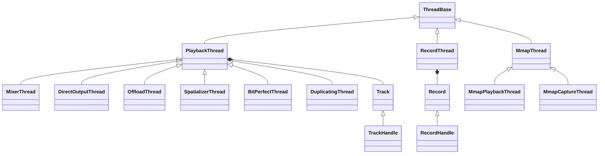

### Thread类型决策逻辑（[`openOutput_l()`](frameworks/av/services/audioflinger/AudioFlinger.cpp:2982)）

| flags条件 | Thread类型 | 场景 | 特点 |
|-----------|-----------|------|------|
| AUDIO_OUTPUT_FLAG_MMAP_NOIRQ | MmapPlaybackThread | AAudio MMAP模式 | 共享内存直传，不经过AF混音 |
| AUDIO_OUTPUT_FLAG_BIT_PERFECT | BitPerfectThread | AAOS位完美输出 | 不修改PCM数据格式/位深 |
| AUDIO_OUTPUT_FLAG_SPATIALIZER | SpatializerThread | 空间音频 | 空间化处理后再输出 |
| AUDIO_OUTPUT_FLAG_COMPRESS_OFFLOAD | OffloadThread | 码流卸载 | MP3/AAC等压缩格式直传HAL |
| AUDIO_OUTPUT_FLAG_DIRECT | DirectOutputThread | 直通输出 | 非混音，单Track直接输出 |
| 默认(无特殊flags) | MixerThread | 标准混音 | 多Track混音后输出 |

**为什么需要这么多Thread类型？**

| 问题 | 解决 | Thread |
|------|------|--------|
| 多App同时播放需要混合 | 混音多个Track到一个输出 | MixerThread |
| 延迟敏感场景（专业音频） | 绕过AF混音直传DSP | MmapPlaybackThread |
| 压缩码流无需解码混音 | 直接传压缩数据到DSP解码 | OffloadThread |
| 多声道/高采样率输出 | 不混音保留原始格式 | DirectOutputThread |
| 车载位完美音频要求 | 不做任何格式转换 | BitPerfectThread(AAOS14新增) |
| 空间音频处理 | 专门线程处理空间化 | SpatializerThread |
| 多输出同步（如HDMI+扬声器） | 复制到多个输出 | DuplicatingThread |

---

## 5.3 PlaybackThread核心循环

### threadLoop — AudioFlinger的心跳

[`PlaybackThread::threadLoop()`](frameworks/av/services/audioflinger/Threads.cpp:3853)是AudioFlinger最核心的循环：

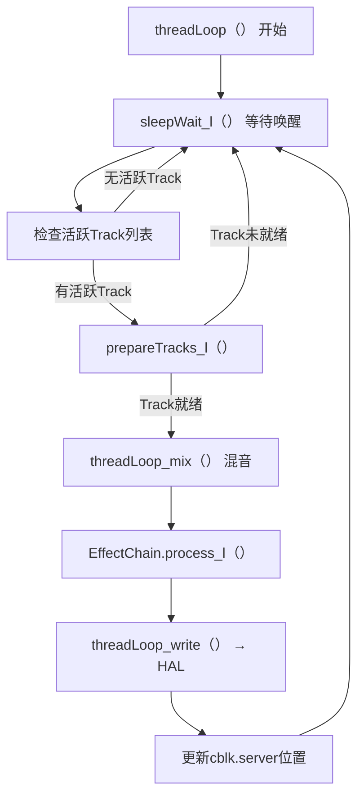

### prepareTracks_l() — 混音准备

关键逻辑：
1. 遍历所有活跃Track，检查cblk是否有新数据（`framesReady = cblk.user - cblk.server`）
2. 设置Track的volume（ducking衰减、焦点音量等）
3. 标记Track为READY或INVALID
4. 返回就绪Track数量，0则不执行mix+write

### threadLoop详细执行流程

[`Threads.cpp:3853-4200`](frameworks/av/services/audioflinger/Threads.cpp:3853)

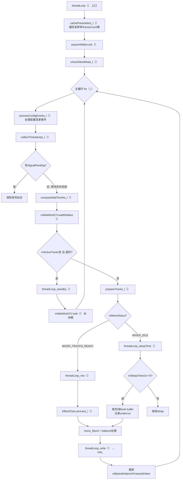

**关键步骤详解**：

#### 1. prepareTracks_l() — 决定哪些Track参与混音

遍历mActiveTracks列表，对每个Track执行：

```cpp
// 检查共享内存中有多少帧数据可读
framesReady = track->framesReady();
if (framesReady == 0) {
    // 无数据：标记为UNDERRUN或IDLE
    if (track->isStopping()) {
        // Offload Track停止中且无数据 → 完成
        track->mState = TrackBase::STOPPED;
    }
} else {
    // 有数据：设置volume和format
    // 检查ducking/焦点衰减 → 设置实际volume
    // 标记为READY
}
```

> **volume计算顺序**：master volume × stream volume × duck attenuation × balance → 最终每个Track的左右声道gain

#### 2. threadLoop_mix() — 执行混音

```cpp
// AudioMixer::process()
// 对每个READY的Track:
//   1. 从共享内存读取PCM数据(通过AudioTrackServerProxy)
//   2. 重采样到输出采样率(如需要)
//   3. 应用音量gain
//   4. 混音到mMixerBuffer(float格式)
// 输出: mMixerBuffer → memcpy到mSinkBuffer或mEffectBuffer
```

#### 3. threadLoop_write() — 写入HAL

```cpp
// 根据Thread类型:
// MixerThread: mOutputSink->write(mSinkBuffer, frames)
// DirectOutputThread: mOutputSink->write(trackBuffer, frames)
// OffloadThread: mOutputSink->write(compressedBuffer, frames)
```

#### 4. Underrun检测与计数

[`Threads.cpp:4130-4138`](frameworks/av/services/audioflinger/Threads.cpp:4130)

```cpp
// 当mSleepTimeUs==0且无数据可mix时，填充0到sink buffer
for (const auto& track : activeTracks) {
    if (track->mFillingUpStatus == Track::FS_ACTIVE
            && !track->isStopped() && !track->isPaused()) {
        // 记录underrun帧数
        track->mAudioTrackServerProxy->tallyUnderrunFrames(mNormalFrameCount);
    }
}
```

### AudioFlinger::createTrack()完整流程

[`AudioFlinger.cpp:1105-1310`](frameworks/av/services/audioflinger/AudioFlinger.cpp:1105)

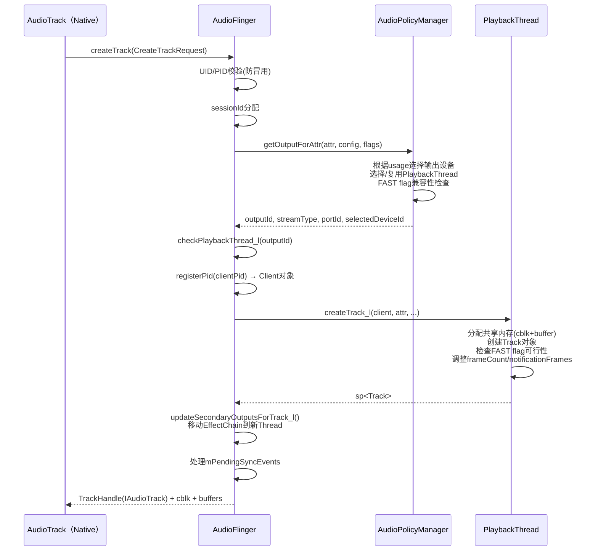

**关键决策点**：

1. **getOutputForAttr**：AudioPolicyManager决定路由到哪个PlaybackThread。同类型的AudioAttributes可能路由到同一个MixerThread（共享混音），也可能路由到独立的DirectOutputThread。

2. **FAST flag处理**：即使Client请求FAST，AudioFlinger也需要检查：
   - 当前Thread是否支持FastMixer
   - Fast Track数量是否已满
   - Track格式是否兼容
   不满足则降级为Normal Track

3. **EffectChain迁移**：如果同sessionId的EffectChain在其他Thread上，createTrack会将其迁移到新Thread，确保Effect与Track在同一个Thread处理。

4. **SecondaryOutputs**：某些场景（如HDMI+扬声器同步输出），一个Track需要同时写入多个输出。通过updateSecondaryOutputsForTrack_l()设置。

### AudioFlinger::createRecord() — 录音端创建

[`AudioFlinger.cpp:2390-2575`](frameworks/av/services/audioflinger/AudioFlinger.cpp:2390)

与createTrack对称，但有独特机制：

**FAST flag降级重试**（createRecord独有）：
```cpp
for (;;) {
    lStatus = AudioSystem::getInputForAttr(..., output.flags, ...);
    recordTrack = thread->createRecordTrack_l(...);
    if (lStatus == BAD_TYPE) {
        continue;  // FAST不支持 → 去掉FAST重新请求
    }
    break;
}
```

### threadLoop_mix() — AudioMixer混音

AudioMixer是MixerThread的核心组件：
- 支持多Track同时混音（最多32个Track）
- 支持float/16bit/24bit格式输入，输出为float
- 每个Track有独立的volume、format、channel配置
- 混音结果写入mSinkBuffer

---

## 5.4 FastMixer — 低延迟混音路径

### 模块职责
FastMixer是MixerThread内部的低延迟子线程，在SCHED_FIFO调度策略下运行，减少混音延迟。

### FastMixer架构

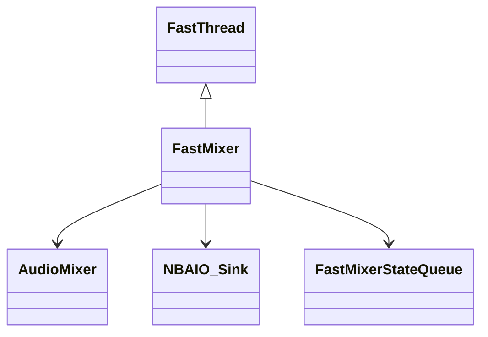

[`FastMixer`](frameworks/av/services/audioflinger/FastMixer.h:34)继承FastThread，核心成员：
- `mMixer`: AudioMixer实例
- `mOutputSink`: NBAIO_Sink写入HAL
- `mSQ`: FastMixerStateQueue，与NormalMixer通信
- `mSinkBuffer`: 混音输出buffer
- `mMixerBuffer`: AudioMixer内部buffer（float格式）

### FastMixer vs NormalMixer

| 维度 | FastMixer | NormalMixer |
|------|-----------|-------------|
| 调度策略 | SCHED_FIFO（实时） | SCHED_OTHER（普通） |
| 优先级 | 高 | 低 |
| 锁 | 无锁（atomic操作） | Mutex锁 |
| 延迟 | <10ms | 20-50ms |
| Track限制 | Fast Track（特殊条件） | 所有Track |
| 效果 | 不支持 | 支持 |

**Fast Track条件**：Track必须满足特定格式/采样率/通道要求，才能在FastMixer路径上混音。不满足条件的Track走NormalMixer路径。

---

## 5.5 Buffer管理与共享内存

### Buffer分配策略

| 场景 | App buffer大小 | AF buffer大小 | 说明 |
|------|---------------|---------------|------|
| MODE_STREAM | 由App指定(getMinBufferSize) | AF内部buffer | 双buffer结构 |
| MODE_STATIC | App一次性提供 | 无额外AF buffer | App buffer直接映射 |
| FastMixer | 较小(2-3 periods) | 小buffer | 降低延迟 |
| NormalMixer | 较大(4-8 periods) | 大buffer | 增加容错 |
| Offload | 压缩码流buffer | 无混音buffer | 直传HAL |

### Underrun处理

当App写入速度不够快导致PlaybackThread无数据时：
1. MixerThread：填充0（静音）→ 继续混音输出 → 记录underrun计数
2. FastMixer：标记underrun → 尽快恢复
3. DirectOutputThread：暂停输出等待数据
4. 通知App：通过`IAudioTrack`回调发送UNDERRUN事件

---

## 5.6 PatchPanel — 音频路由管理

### 模块职责
[`PatchPanel`](frameworks/av/services/audioflinger/PatchPanel.h:24)管理AudioFlinger内部的音频端口连接，实现软件路由。

### 核心功能

| 方法 | 说明 |
|------|------|
| `createAudioPatch()` | 创建音频路由（源端口→目标端口） |
| `releaseAudioPatch()` | 释放路由 |
| `listAudioPorts()` | 列出所有音频端口 |
| `getAudioPort()` | 获取端口属性 |
| `getDownstreamSoftwarePatches()` | 获取下游软件路由 |

### SoftwarePatch — 软件路由

当音频需要从一个HAL模块路由到另一个HAL模块时（如FM广播→扬声器），AudioFlinger创建SoftwarePatch：
- 创建一个RecordThread从源设备读取
- 创建一个PlaybackThread向目标设备写入
- 两者通过内部Track连接，形成"软件桥"


---

## 5.7 Track/Record — 音频流端点

### Track（PlaybackThread内部对象）

Track是PlaybackThread内部的音频流端点，代表一个App的AudioTrack在AudioFlinger侧的镜像：

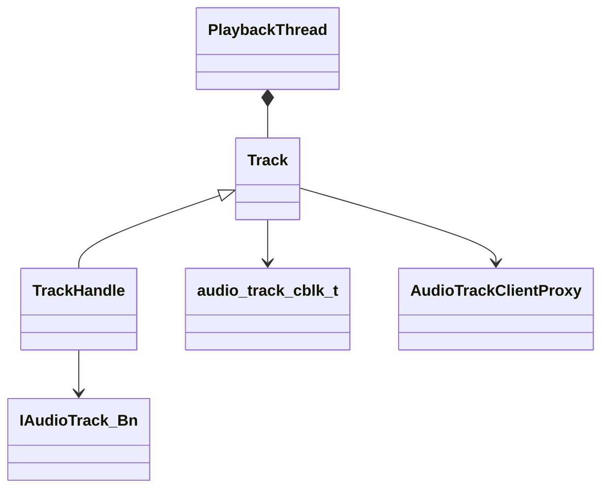

- **Track**: 管理共享内存读取、音量设置、状态控制
- **TrackHandle**: Binder服务端，实现IAudioTrack接口，App通过此接口控制
- **AudioTrackClientProxy**: 从共享内存读取App写入的PCM数据

### Record（RecordThread内部对象）

与Track对称，是AudioRecord在AF侧的镜像：
- 从HAL读取 → 写入共享内存 → App从共享内存读取

---

## 5.8 Thread继承体系与匹配规则

### 5.8.1 AudioFlinger线程类型完整继承体系

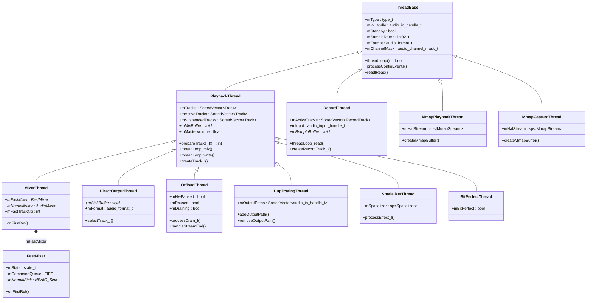

### 5.8.2 MixerThread双路径架构详解

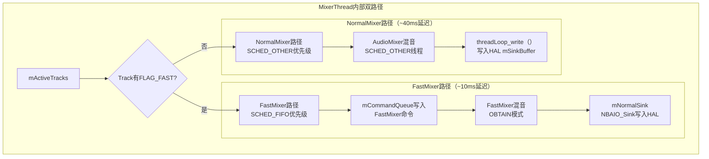

| 参数 | FastMixer | NormalMixer |
|------|-----------|------------|
| 线程优先级 | SCHED_FIFO | SCHED_OTHER |
| 缓冲区大小 | 小(~2-4ms) | 大(~20-40ms) |
| 混音方式 | 简单copy | AudioMixer多轨 |
| 适用Track | TRANSFER_CALLBACK/SYNC | TRANSFER_SHARED(write) |
| 延迟 | ~10ms | ~40ms |

> **FastMixer限制**: 最多支持`mFastTrackNb`(通常8个)Fast Track，超出则降级到NormalMixer。Fast Track不支持VolumeShaper和大部分Effect。

### 5.8.3 各Thread类型的适用场景

| Thread类型 | 适用场景 | 输出Flag | 特殊能力 | 延迟范围 |
|-----------|---------|----------|---------|---------|
| MixerThread | 通用混音 | NONE/FAST/DEEP_BUFFER | 双路径(Fast+Normal) | 10ms(Fast)/40ms(Normal) |
| DirectOutputThread | 独占输出(不支持混音) | DIRECT | 单Track独占一个输出 | ~10ms |
| OffloadThread | 码流Offload(MP3/AAC到DSP) | COMPRESS_OFFLOAD | DSP解码，CPU省电 | ~100ms |
| DuplicatingThread | 多设备同步输出 | NONE | 复制数据到多个下游Thread | 取最慢下游 |
| SpatializerThread | 空间音频(Spatial Audio) | SPATIALIZER | 头相关传输函数(HRTF) | ~20ms |
| BitPerfectThread | 位完美输出(无重采样) | BIT_PERFECT | 不做任何处理直通 | 取源延迟 |
| MmapPlaybackThread | MMAP低延迟播放 | MMAP_NOIRQ | 共享内存直通(无threadLoop) | <3ms |
| RecordThread | 录音输入 | NONE/FAST | 重采样+Effect处理 | 输入延迟 |
| MmapCaptureThread | MMAP低延迟录音 | MMAP_NOIRQ | 共享内存直通 | <3ms |

### 5.8.4 Thread与Track的匹配规则

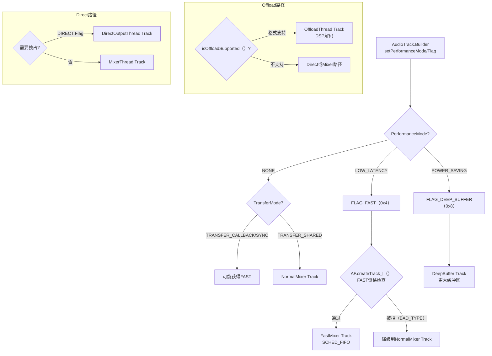

---

## 5.9 音乐播放全栈调用链

### 5.9.1 AudioTrack创建时序

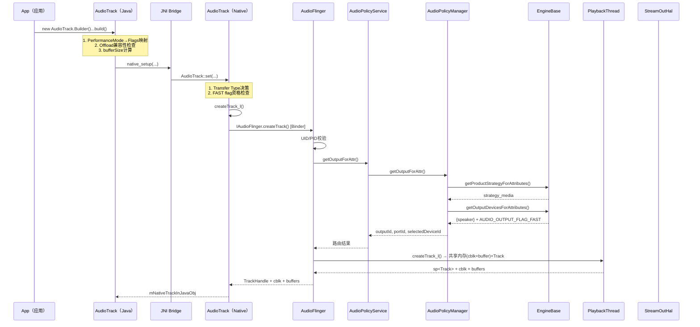

### 5.9.2 播放数据流时序

```mermaid
sequenceDiagram
    participant App, AT_N, Cblk, PT, Mixer, Effect, HAL

    App->>AT_N: start()
    AT_N->>PT: IAudioTrack.start() [Binder]
    PT->>PT: Track加入mActiveTracks

    loop 每个App写入周期
        App->>AT_N: write(pcmData)
        AT_N->>Cblk: obtainBuffer → memcpy → releaseBuffer
    end

    loop 每个混音周期(~20ms NormalMixer, ~10ms FastMixer)
        PT->>PT: prepareTracks_l()
        PT->>Mixer: AudioMixer.process() → 混音
        PT->>Effect: EffectChain.process_l()
        PT->>HAL: mOutputSink->write()
        PT->>Cblk: mFront += consumed [唤醒App]
    end
```

---

## 5.10 录音全栈调用链

从App层AudioRecord到HAL层的完整录音数据流路径。

### 5.10.1 AudioRecord创建时序

```mermaid
sequenceDiagram
    participant App, AR_J, AR_N, AF, APS, APM, RT, HAL
    App->>AR_J: new AudioRecord(AudioAttributes, AudioFormat, bufferSize)
    AR_J->>AR_N: native_setup() [JNI]
    AR_N->>AF: IAudioFlinger.openInput() [Binder]
    AF->>APM: openInput(module, config, source)
    APM->>APM: getInputForAttr() → 选择RecordThread类型
    APM-->>AF: inputHwDev + config
    AF->>RT: new RecordThread(inputHwDev)
    AF->>HAL: openInputStream(config)
    HAL-->>AF: streamIn + config
    AF-->>AR_N: IAudioRecord [Binder代理]
    AR_N->>AR_N: 创建audio_track_cblk_t共享内存
    AR_N-->>AR_J: INIT_SUCCESS
```

### 5.10.2 录音数据流时序

```mermaid
sequenceDiagram
    participant App, AR_N, Cblk, RT, Resampler, Effect, HAL, Mic
    App->>AR_N: startRecording()
    AR_N->>RT: IAudioRecord.start() [Binder]
    RT->>RT: RecordThread加入mActiveTracks

    loop 每个录音周期(~20ms)
        HAL->>Mic: 读取PCM数据
        Mic->>HAL: 中断/DMA传输
        HAL->>RT: streamIn.read(inputBuffer)
        RT->>Effect: EffectChain.process_l() [AEC/NS处理]
        RT->>Resampler: Resampler.process() [采样率转换]
        RT->>Cblk: memcpy到共享内存 + 更新mFront
        Cblk-->>AR_N: mFront更新 [唤醒App]
    end

    loop 每个App读取周期
        App->>AR_N: read(buffer, size)
        AR_N->>Cblk: obtainBuffer → memcpy → releaseBuffer
        AR_N-->>App: 返回PCM数据
    end
```

### 5.10.3 RecordThread类型与路由

| RecordThread类型 | 输入设备 | Flag | 特殊处理 |
|-----------------|---------|------|---------|
| RecordThread | 麦克风/有线耳机 | NONE | 标准录音+重采样+Effect |
| MmapCaptureThread | 麦克风(MMAP) | MMAP_NOIRQ | 共享内存直通，无threadLoop |

**录音路由决策**（AudioPolicyManager）:

| AudioSource | 路由优先级 | HAL预处理 |
|-------------|----------|----------|
| `VOICE_RECOGNITION` | 主MIC > 有线 > BT SCO | **关闭AGC+AEC** |
| `VOICE_COMMUNICATION` | BT SCO > 有线 > 主MIC | **AEC+NS** |
| `MIC` | 主MIC > 有线 > BT SCO | AGC可选 |
| `CAMCORDER` | 主MIC(与摄像头同向) | 无 |

> **关键区别**: 播放路径是"App→AF→HAL"(推模型)，录音路径是"HAL→AF→App"(拉模型)。RecordThread从HAL读取数据推入共享内存，App从共享内存拉取数据。

---

## 5.11 AudioMixer与Resampler — 混音引擎核心

### 5.11.1 AudioMixer继承体系

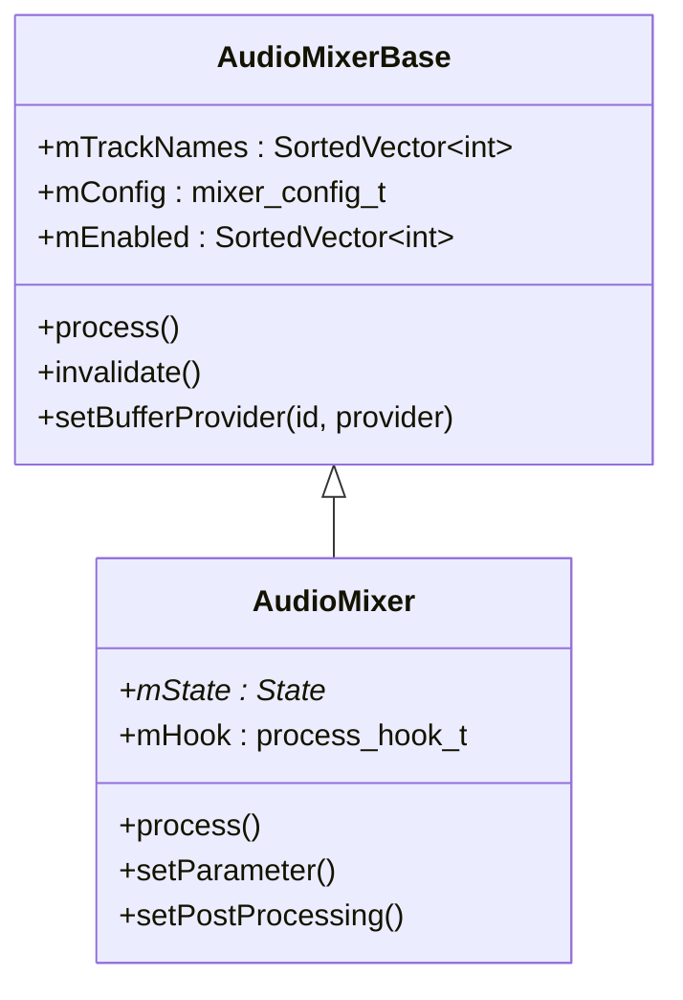

**源码位置**: [`AudioMixerBase.h`](frameworks/av/media/libaudioprocessing/include/media/AudioMixerBase.h) / [`AudioMixer.h`](frameworks/av/media/libaudioprocessing/include/media/AudioMixer.h)

### 5.11.2 混音处理流程

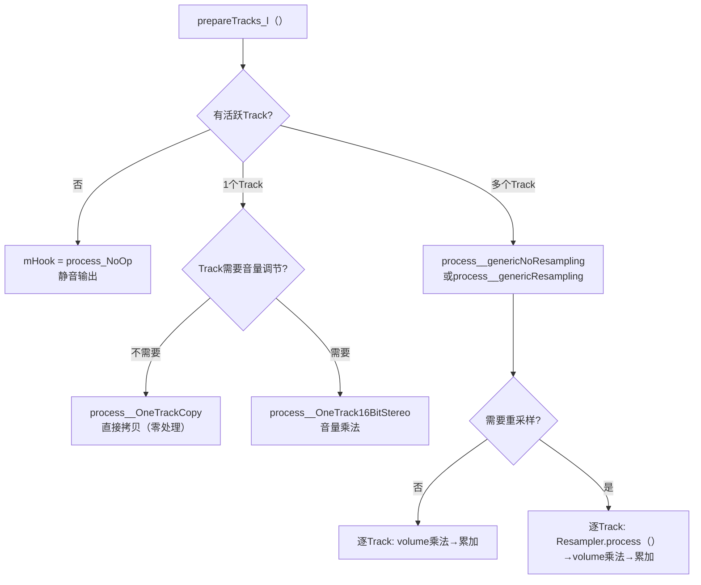

**Hook机制**: AudioMixer使用函数指针Hook动态选择处理路径，避免每次混音都做条件判断。`setParameter()`时根据Track参数更新Hook指向最优实现。

### 5.11.3 AudioResampler继承体系

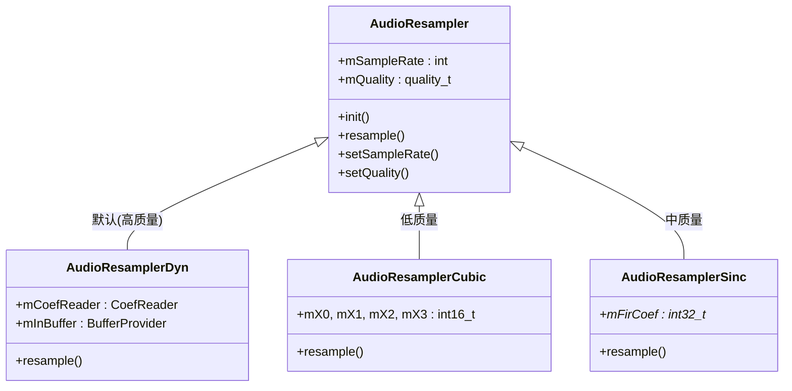

**源码位置**: [`libaudioprocessing/`](frameworks/av/media/libaudioprocessing/)

| Resampler类型 | 质量 | CPU开销 | 算法 | 适用场景 |
|--------------|------|---------|------|---------|
| `Cubic` | LOW | 最低 | 三次插值 | 后台播放/省电 |
| `Sinc` | MED | 中等 | Sinc插值(固定系数) | 一般播放 |
| `Dyn` | HIGH/VERY_HIGH | 最高 | 多相FIR滤波(动态系数) | 专业音频/HiFi |

> **性能关键路径**: AudioMixer.process()在每个混音周期执行(NormalMixer ~20ms, FastMixer ~10ms)，是音频系统CPU消耗最大的路径。Hook机制+SIMD优化(NEON)确保实时性。


## 5.12 DeviceEffectManager — 设备级音效管理

**职责**: 管理绑定到特定音频输出设备（而非Audio Session）的音效，在音频Patch创建时自动激活设备级音效代理。

**源码位置**: [`DeviceEffectManager.h`](frameworks/av/services/audioflinger/DeviceEffectManager.h) / [`DeviceEffectManager.cpp`](frameworks/av/services/audioflinger/DeviceEffectManager.cpp)

### 5.12.1 架构概述

[`DeviceEffectManager`](frameworks/av/services/audioflinger/DeviceEffectManager.h:23) 继承自 [`PatchCommandThread::PatchCommandListener`](frameworks/av/services/audioflinger/PatchCommandThread.h:35)，监听Patch的创建与释放事件，在设备路由变化时自动管理音效的激活与去激活。与Session级EffectChain不同，设备级音效绑定到硬件输出设备，不随Track销毁而移除。

| 核心成员 | 类型 | 说明 |
|---------|------|------|
| [`mDeviceEffects`](frameworks/av/services/audioflinger/DeviceEffectManager.h:72) | `map<AudioDeviceTypeAddr, sp<DeviceEffectProxy>>` | 设备地址→音效代理映射 |
| [`mMyCallback`](frameworks/av/services/audioflinger/DeviceEffectManager.h:71) | `sp<DeviceEffectManagerCallback>` | 音效回调接口 |
| [`mAudioFlinger`](frameworks/av/services/audioflinger/DeviceEffectManager.h:70) | `AudioFlinger&` | 所属AudioFlinger引用 |

| 核心方法 | 说明 |
|---------|------|
| [`createEffect_l()`](frameworks/av/services/audioflinger/DeviceEffectManager.h:33) | 创建设备级音效，关联到指定AudioDeviceTypeAddr |
| [`removeEffect()`](frameworks/av/services/audioflinger/DeviceEffectManager.h:43) | 移除指定的DeviceEffectProxy |
| [`onCreateAudioPatch()`](frameworks/av/services/audioflinger/DeviceEffectManager.h:62) | Patch创建回调，激活匹配设备的音效代理 |
| [`onReleaseAudioPatch()`](frameworks/av/services/audioflinger/DeviceEffectManager.h:64) | Patch释放回调，去激活相关音效代理 |
| [`createEffectHal()`](frameworks/av/services/audioflinger/DeviceEffectManager.h:44) | 创建HAL层音效实例 |

### 5.12.2 DeviceEffectProxy工作机制

DeviceEffectProxy是设备级音效的代理对象，每个`AudioDeviceTypeAddr`对应一个Proxy。当Patch创建且路由到对应设备时，Proxy自动创建真实的HAL音效实例并激活；Patch释放时自动销毁HAL实例。

### 5.12.3 设备级 vs Session级音效对比

| 维度 | 设备级音效(DeviceEffect) | Session级音效(EffectChain) |
|------|------------------------|--------------------------|
| 绑定对象 | 硬件输出设备(AudioDeviceTypeAddr) | Audio Session |
| 生命周期 | 跟随设备路由，不随Track销毁 | 跟随Track/Session生命周期 |
| 激活时机 | Patch创建→onCreateAudioPatch | Track添加到EffectChain |
| 典型场景 | 外接DAC音效、扬声器校准 | 均衡器、混响、重低音 |
| 管理类 | DeviceEffectManager | EffectChain |

### 5.12.4 设备音效激活流程

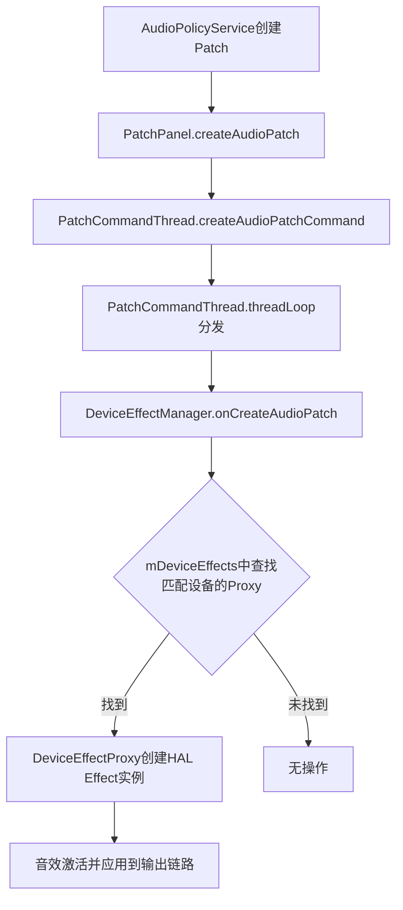

---

## 5.13 MelReporter — MEL声暴露报告

**职责**: 监听音频Patch创建/释放，启动MEL(Maximum Exposure Level)计算，实现IEC 62368-1/EN 50332-3听力保护标准。

**源码位置**: [`MelReporter.h`](frameworks/av/services/audioflinger/MelReporter.h) / [`MelReporter.cpp`](frameworks/av/services/audioflinger/MelReporter.cpp)

### 5.13.1 双路径架构

MelReporter支持两种MEL计算路径，HAL优先，框架回退：

| 路径 | 方法 | 说明 | 认证保证 |
|------|------|------|---------|
| HAL SoundDose | [`activateHalSoundDoseComputation()`](frameworks/av/services/audioflinger/MelReporter.h:53) | 从`IModule.getSoundDose()`获取HAL接口 | 可认证 |
| 内部CSD计算 | [`activateInternalSoundDoseComputation()`](frameworks/av/services/audioflinger/MelReporter.h:62) | 框架回退方案，不保证认证 | 不可认证 |

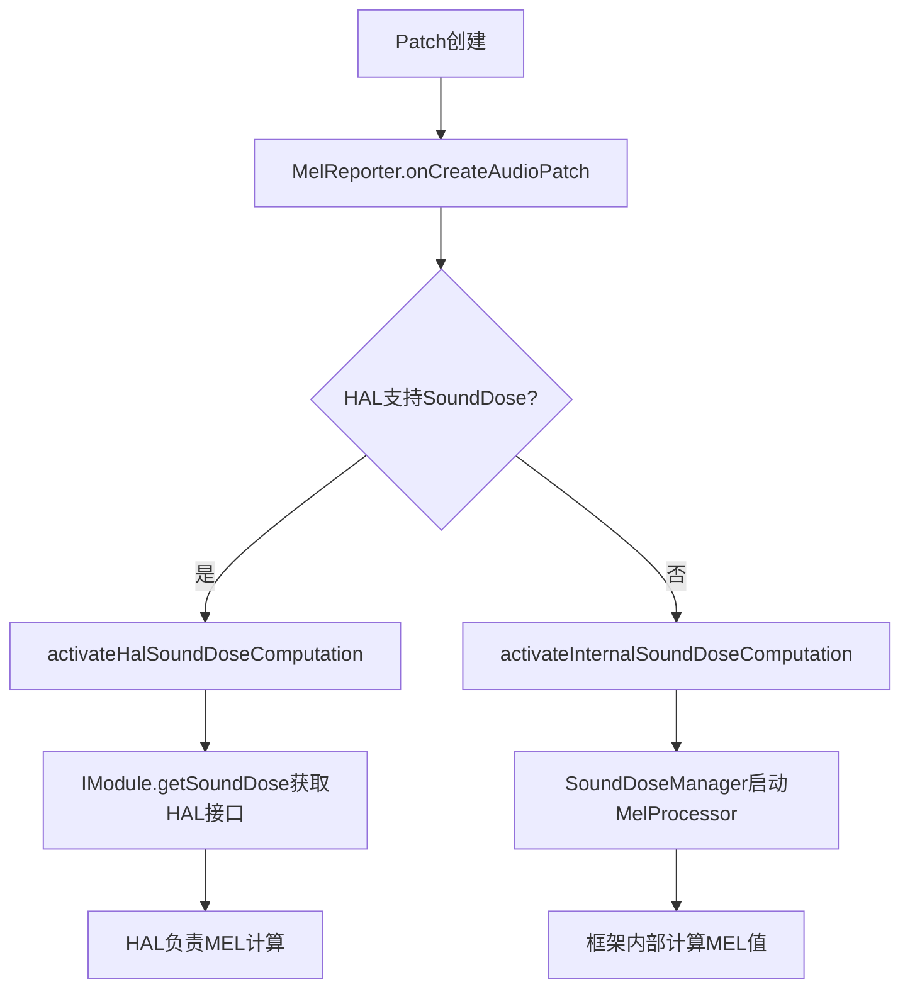

### 5.13.2 CSD计算过滤规则

[`updateMetadataForCsd()`](frameworks/av/services/audioflinger/MelReporter.h:78) 根据Track的AudioUsage决定是否启用CSD计算。仅`MEDIA`和`GAME` usage触发CSD计算，其他类型（如VOICE_CALL、ALARM）不纳入声剂量统计。

| 核心成员 | 类型 | 说明 |
|---------|------|------|
| [`mSoundDoseManager`](frameworks/av/services/audioflinger/MelReporter.h:105) | `sp<SoundDoseManager>` | CSD计算管理器 |
| [`mActiveMelPatches`](frameworks/av/services/audioflinger/MelReporter.h:81) | `vector<ActiveMelPatch>` | 当前活跃的MEL Patch列表 |

| 核心方法 | 说明 |
|---------|------|
| [`onCreateAudioPatch()`](frameworks/av/services/audioflinger/MelReporter.h:69) | Patch创建回调，启动MEL计算 |
| [`onReleaseAudioPatch()`](frameworks/av/services/audioflinger/MelReporter.h:71) | Patch释放回调，停止MEL计算 |
| [`updateMetadataForCsd()`](frameworks/av/services/audioflinger/MelReporter.h:78) | 更新Track元数据，决定CSD是否启用 |
| [`shouldComputeMelForDeviceType()`](frameworks/av/services/audioflinger/MelReporter.h:88) | 判断设备类型是否需要MEL计算 |

### 5.13.3 关键阈值参数

| 参数 | 值 | 说明 |
|------|---|------|
| [`kDefaultRs2UpperBound`](frameworks/av/services/audioflinger/sounddose/SoundDoseManager.h:40) | 100 dBA | RS2默认上限，可设置范围80-100 dBA |
| [`kCsdWindowSeconds`](frameworks/av/services/audioflinger/sounddose/SoundDoseManager.h:38) | 604800 (7天) | CSD滚动窗口时长 |
| [`kMaxTimestampDeltaInSec`](frameworks/av/services/audioflinger/MelReporter.h:26) | 120秒 | 最大时间戳差值 |

### 5.13.4 MEL计算启动流程

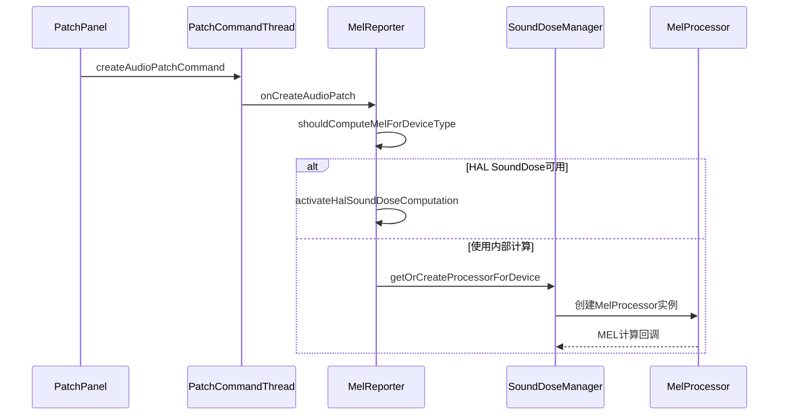

---

## 5.14 SoundDoseManager — CSD声剂量管理

**职责**: 管理CSD(Concurrent Sound Dose)计算和回调通知，聚合7天窗口内的声暴露量，在超过RS2阈值时通知AudioService降低音量。

**源码位置**: [`SoundDoseManager.h`](frameworks/av/services/audioflinger/sounddose/SoundDoseManager.h) / [`SoundDoseManager.cpp`](frameworks/av/services/audioflinger/sounddose/SoundDoseManager.cpp)

### 5.14.1 类关系图

```mermaid
classDiagram
    class SoundDoseManager {
        -mMelAggregator : MelAggregator
        -mRs2UpperBound : float
        -mProcessors : map
        +getOrCreateProcessorForDevice()
        +removeStreamProcessor()
        +setOutputRs2UpperBound()
        +getSoundDoseInterface()
        +setHalSoundDoseInterface()
        +onNewMelValues()
        +onMomentaryExposure()
    }
    class MelProcessor {
        +process()
        +setSampleRate()
        +setAttenuation()
    }
    class MelAggregator {
        +aggregate()
        +getCsd()
        +reset()
    }
    class SoundDose {
        +setOutputRs2UpperBound()
        +resetCsd()
        +getCsd()
    }
    class ISoundDoseCallback {
        +onMomentaryExposureWarning()
        +onNewCsdValue()
    }
    SoundDoseManager --> MelProcessor : 每设备每流创建
    SoundDoseManager --> MelAggregator : 7天窗口聚合
    SoundDoseManager --> SoundDose : BnSoundDose实现
    SoundDoseManager --> ISoundDoseCallback : 超限回调
    MelProcessor --> SoundDoseManager : MelCallback
```

### 5.14.2 核心方法

| 方法 | 说明 |
|------|------|
| [`getOrCreateProcessorForDevice()`](frameworks/av/services/audioflinger/sounddose/SoundDoseManager.h:57) | 为指定设备和流创建/获取MelProcessor |
| [`removeStreamProcessor()`](frameworks/av/services/audioflinger/sounddose/SoundDoseManager.h:68) | 移除流的MelProcessor |
| [`setOutputRs2UpperBound()`](frameworks/av/services/audioflinger/sounddose/SoundDoseManager.h:76) | 设置RS2上限阈值(80-100 dBA) |
| [`getSoundDoseInterface()`](frameworks/av/services/audioflinger/sounddose/SoundDoseManager.h:84) | 获取ISoundDose AIDL接口 |
| [`onNewMelValues()`](frameworks/av/services/audioflinger/sounddose/SoundDoseManager.h:118) | MelCallback：新MEL值回调 |
| [`onMomentaryExposure()`](frameworks/av/services/audioflinger/sounddose/SoundDoseManager.h:121) | MelCallback：瞬时暴露超限回调 |

### 5.14.3 ISoundDose AIDL接口

[`SoundDose`](frameworks/av/services/audioflinger/sounddose/SoundDoseManager.h:124) 内部类实现了`BnSoundDose`接口，供AudioService查询和配置声剂量参数：

| 接口方法 | 说明 |
|---------|------|
| [`setOutputRs2UpperBound()`](frameworks/av/services/audioflinger/sounddose/SoundDoseManager.h:135) | 设置RS2上限 |
| [`resetCsd()`](frameworks/av/services/audioflinger/sounddose/SoundDoseManager.h:136) | 重置CSD累计值 |
| [`getCsd()`](frameworks/av/services/audioflinger/sounddose/SoundDoseManager.h:142) | 查询当前CSD值 |
| [`setCsdEnabled()`](frameworks/av/services/audioflinger/sounddose/SoundDoseManager.h:140) | 启用/禁用CSD计算 |
| [`updateAttenuation()`](frameworks/av/services/audioflinger/sounddose/SoundDoseManager.h:138) | 更新衰减值 |

### 5.14.4 听力保护触发流程

```mermaid
flowchart TB
    A[MelProcessor每帧计算MEL值] --> B{MEL大于RS2阈值?}
    B -->|是| C[onMomentaryExposure回调]
    C --> D[ISoundDoseCallback.onMomentaryExposureWarning]
    D --> E[AudioService收到通知]
    E --> F[降低音量/弹出警告通知]
    A --> G[onNewMelValues回调]
    G --> H[MelAggregator聚合7天窗口]
    H --> I{CSD超过安全阈值?}
    I -->|是| J[ISoundDoseCallback.onNewCsdValue]
    J --> K[AudioService更新声剂量状态]
```

---

## 5.15 PatchCommandThread — Patch异步命令线程

**职责**: 异步执行`createAudioPatch`和`releaseAudioPatch`命令，避免PatchPanel操作与音效管理之间的死锁。

**源码位置**: [`PatchCommandThread.h`](frameworks/av/services/audioflinger/PatchCommandThread.h) / [`PatchCommandThread.cpp`](frameworks/av/services/audioflinger/PatchCommandThread.cpp)

### 5.15.1 为什么需要异步

[`PatchPanel::createAudioPatch()`](frameworks/av/services/audioflinger/PatchCommandThread.h:25) 从AudioPolicyService调用时持有APM锁，但音效管理（DeviceEffectManager/MelReporter）需要回调APM获取音效信息。如果同步回调会导致**死锁**：
- 线程A：持有APM锁 → 等待音效管理完成
- 线程B（音效管理）：需要APM锁 → 等待线程A释放

解决方案：PatchCommandThread将Patch操作放入队列异步执行，回调在独立线程完成，避免锁交叉。

### 5.15.2 命令类型与数据结构

| 命令类型 | 枚举值 | 数据类 | 说明 |
|---------|-------|--------|------|
| [`CREATE_AUDIO_PATCH`](frameworks/av/services/audioflinger/PatchCommandThread.h:31) | 0 | [`CreateAudioPatchData`](frameworks/av/services/audioflinger/PatchCommandThread.h:76) | 包含handle和Patch |
| [`RELEASE_AUDIO_PATCH`](frameworks/av/services/audioflinger/PatchCommandThread.h:32) | 1 | [`ReleaseAudioPatchData`](frameworks/av/services/audioflinger/PatchCommandThread.h:85) | 仅包含handle |

```mermaid
classDiagram
    class Command {
        +mCommand : int
        +mData : CommandData
    }
    class CommandData {
        <<abstract>>
    }
    class CreateAudioPatchData {
        +mHandle : audio_patch_handle_t
        +mPatch : Patch
    }
    class ReleaseAudioPatchData {
        +mHandle : audio_patch_handle_t
    }
    class PatchCommandListener {
        <<interface>>
        +onCreateAudioPatch()
        +onReleaseAudioPatch()
    }
    Command --> CommandData
    CommandData <|-- CreateAudioPatchData
    CommandData <|-- ReleaseAudioPatchData
    PatchCommandListener <|.. DeviceEffectManager
    PatchCommandListener <|.. MelReporter
```

### 5.15.3 Listener模式

[`PatchCommandListener`](frameworks/av/services/audioflinger/PatchCommandThread.h:35) 接口定义了两个回调方法，当前有两个Listener实现：

| Listener | 类 | 说明 |
|----------|---|------|
| 设备音效 | [`DeviceEffectManager`](frameworks/av/services/audioflinger/DeviceEffectManager.h:23) | Patch创建时激活设备级音效 |
| 声暴露 | [`MelReporter`](frameworks/av/services/audioflinger/MelReporter.h:32) | Patch创建时启动MEL计算 |

### 5.15.4 Patch命令异步处理时序

```mermaid
sequenceDiagram
    participant APM as AudioPolicyService
    participant PP as PatchPanel
    participant PCT as PatchCommandThread
    participant DEM as DeviceEffectManager
    participant MR as MelReporter

    APM->>PP: createAudioPatch-持有APM锁
    PP->>PP: 执行Patch创建
    PP->>PCT: createAudioPatchCommand-入队
    APM->>APM: 释放APM锁

    PCT->>PCT: threadLoop取出命令
    PCT->>DEM: onCreateAudioPatch
    DEM->>DEM: 激活设备级音效-可安全回调APM
    PCT->>MR: onCreateAudioPatch
    MR->>MR: 启动MEL计算
```

### 5.15.5 关键成员

| 成员 | 类型 | 说明 |
|------|------|------|
| [`mCommands`](frameworks/av/services/audioflinger/PatchCommandThread.h:98) | `deque<sp<Command>>` | 待处理命令队列 |
| [`mWaitWorkCV`](frameworks/av/services/audioflinger/PatchCommandThread.h:97) | `condition_variable` | 线程等待条件变量 |
| [`mListeners`](frameworks/av/services/audioflinger/PatchCommandThread.h:101) | `vector<sp<PatchCommandListener>>` | 已注册的Listener列表 |

---

## 5.16 BufLog — 缓冲区调试日志

**职责**: 将音频缓冲区PCM数据dump到磁盘文件，用于调试音效处理结果、验证PCM数据正确性、排查杂音问题。

**源码位置**: [`BufLog.h`](frameworks/av/services/audioflinger/BufLog.h) / [`BufLog.cpp`](frameworks/av/services/audioflinger/BufLog.cpp)

### 5.16.1 BUFLOG宏

[`BUFLOG`](frameworks/av/services/audioflinger/BufLog.h:88) 宏是核心接口，参数说明：

| 参数 | 类型 | 说明 |
|------|------|------|
| `STREAMID` | int [0-15] | 流ID，最多16个流同时捕获 |
| `TAG` | char* | 标签字符串，用于文件名和日志 |
| `FORMAT` | int | 音频格式(audio_format_t) |
| `CHANNELS` | int | 通道数 |
| `SAMPLINGRATE` | int | 采样率(Hz) |
| `MAXBYTES` | int | 文件最大字节数，0为不限 |
| `BUF` | void* | 音频缓冲区指针 |
| `SIZE` | int | 当前缓冲区字节数 |

### 5.16.2 文件命名与存储

文件命名格式：`YYYYMMDDHHMMSS_id_format_channels_samplingrate.raw`

存储路径：[`/data/misc/audioserver`](frameworks/av/services/audioflinger/BufLog.h:110)

生成的文件为原始PCM数据，可用Audacity等工具以对应格式导入分析。

### 5.16.3 Release版本控制

[`BUFLOG_NDEBUG`](frameworks/av/services/audioflinger/BufLog.h:69) 宏控制是否启用BufLog：
- Release版本（`NDEBUG=1`）：`BUFLOG_NDEBUG=1`，BUFLOG宏展开为空操作
- Debug版本（`NDEBUG未定义`）：`BUFLOG_NDEBUG=0`，BUFLOG宏正常工作
- 可在源文件顶部手动`#define BUFLOG_NDEBUG 0`强制启用

### 5.16.4 其他宏

| 宏 | 说明 |
|---|------|
| [`BUFLOG_EXISTS`](frameworks/av/services/audioflinger/BufLog.h:94) | 检查BufLog单例是否存在 |
| [`BUFLOG_RESET`](frameworks/av/services/audioflinger/BufLog.h:98) | 停止捕获并关闭所有流，后续BUFLOG调用创建新流 |

### 5.16.5 使用示例

```cpp
// 在音效处理代码中添加：
#define BUFLOG_NDEBUG 0    // 强制启用
#include "BufLog.h"

// 在音效处理函数中dump输出缓冲区
int format       = mConfig.outputCfg.format;
int channels     = audio_channel_count_from_out_mask(mConfig.outputCfg.channels);
int samplingRate = mConfig.outputCfg.samplingRate;
int frameCount   = mConfig.outputCfg.buffer.frameCount;
int frameSize    = audio_bytes_per_sample((audio_format_t)format) * channels;
int buffSize     = frameCount * frameSize;
long maxBytes    = 10 * samplingRate * frameSize;  // 最多10秒
BUFLOG(11, "loudness_enhancer_out", format, channels, samplingRate,
       maxBytes, mConfig.outputCfg.buffer.raw, buffSize);
```

### 5.16.6 典型调试场景

```mermaid
flowchart LR
    A[音效处理前] --> B[BUFLOG捕获输入PCM]
    B --> C[音效处理]
    C --> D[BUFLOG捕获输出PCM]
    D --> E[对比输入输出RAW文件]
    E --> F{验证音效是否正确工作}
    F -->|杂音| G[检查PCM数据异常]
    F -->|无声| H[检查音效是否 bypass]
    F -->|正常| I[调试完成]
```

---

## 5.17 SpatializerThread与BitPerfectThread — 特殊输出线程

**源码位置**: [`Threads.h`](frameworks/av/services/audioflinger/Threads.h) / [`Threads.cpp`](frameworks/av/services/audioflinger/Threads.cpp)

### 5.17.1 SpatializerThread — 空间音频处理线程

[`SpatializerThread`](frameworks/av/services/audioflinger/Threads.h:1836) 继承自MixerThread，专门处理空间音频（Spatial Audio）音效。

**触发条件**: `AUDIO_OUTPUT_FLAG_SPATIALIZER`标志位打开时，AudioFlinger创建SpatializerThread而非普通MixerThread。

**核心特性**:
- 从MixerThread分离出来，专门处理Spatializer音效链
- 拥有独立的mixer配置（`mixerConfig`参数）
- 包含[`mFinalDownMixer`](frameworks/av/services/audioflinger/Threads.h:1860)：最终下混音效Handle，将多声道空间音频下混到立体声
- 支持延迟模式设置[`setRequestedLatencyMode()`](frameworks/av/services/audioflinger/Threads.h:1850)
- 与HeadTracker配合实现头部追踪空间音频

| 核心成员 | 类型 | 说明 |
|---------|------|------|
| [`mRequestedLatencyMode`](frameworks/av/services/audioflinger/Threads.h:1858) | `audio_latency_mode_t` | 请求的延迟模式，默认FREE |
| [`mFinalDownMixer`](frameworks/av/services/audioflinger/Threads.h:1860) | `sp<EffectHandle>` | 最终下混音效Handle |

### 5.17.2 BitPerfectThread — 位完美输出线程

[`BitPerfectThread`](frameworks/av/services/audioflinger/Threads.h:2359) 继承自MixerThread，是AOSP14新增的线程类型，满足车载HiFi场景下原始音频数据直传HAL/DSP的需求。

**触发条件**: `AUDIO_OUTPUT_FLAG_BIT_PERFECT`标志位打开时创建。

**核心特性**:
- 不修改PCM数据格式、位深、采样率
- 仅当活跃Track数为1且Track标记为bit-perfect时启用直传模式
- 直传模式：Track PCM数据通过TEE_BUFFER直接拷贝到SinkBuffer，跳过Mixer
- 多Track时回退到普通Mixer混音模式

| 核心成员 | 类型 | 说明 |
|---------|------|------|
| [`mIsBitPerfect`](frameworks/av/services/audioflinger/Threads.h:2369) | `bool` | 当前是否为bit-perfect直传模式 |
| [`mVolumeLeft`](frameworks/av/services/audioflinger/Threads.h:2370) | `float` | 左声道音量 |
| [`mVolumeRight`](frameworks/av/services/audioflinger/Threads.h:2371) | `float` | 右声道音量 |

### 5.17.3 BitPerfectThread关键逻辑

[`prepareTracks_l()`](frameworks/av/services/audioflinger/Threads.cpp:11037) 中的bit-perfect判断逻辑：

```cpp
// 仅当活跃Track数为1且标记为bit-perfect时启用直传
if (mActiveTracks.size() == 1 && mActiveTracks[0]->isBitPerfect()) {
    // 设置TEE_BUFFER直接写入SinkBuffer
    mAudioMixer->setParameter(trackId, AudioMixer::TRACK,
                              AudioMixer::TEE_BUFFER, (void*)mSinkBuffer);
    mIsBitPerfect = true;
} else {
    // 多Track回退，清除TEE_BUFFER
    mIsBitPerfect = false;
}
```

[`threadLoop_mix()`](frameworks/av/services/audioflinger/Threads.cpp:11070) 中通过`mHasDataCopiedToSinkBuffer`标记是否跳过后续写入：
- `mIsBitPerfect=true`：数据已通过TEE_BUFFER直接写入SinkBuffer，无需额外拷贝
- `mIsBitPerfect=false`：走正常Mixer混音流程

### 5.17.4 输出线程类型对比

| 特性 | MixerThread | DirectOutputThread | OffloadThread | SpatializerThread | BitPerfectThread |
|------|------------|-------------------|---------------|-------------------|-----------------|
| 触发Flag | DEFAULT | DIRECT | COMPRESS_OFFLOAD | SPATIALIZER | BIT_PERFECT |
| 输入Track | 多Track混合 | 单Track | 单Track压缩 | 多Track+空间化 | 单/多Track |
| 格式转换 | 是(重采样+混音) | 有限转换 | 硬件解码 | 是(空间化+下混) | 否(直传) |
| 音效链 | 完整EffectChain | 简化 | 无 | 空间音效链 | 最小化 |
| 典型场景 | 通用播放 | 低延迟直出 | 硬件解码播放 | 空间音频/头部追踪 | 车载HiFi/位完美 |
| AOSP14状态 | 稳定 | 稳定 | 稳定 | 稳定 | **新增** |

```mermaid
flowchart TB
    subgraph 输出线程类型
        MT[MixerThread<br/>多Track混合]
        DOT[DirectOutputThread<br/>单Track直出]
        OT[OffloadThread<br/>硬件解码]
        ST[SpatializerThread<br/>空间音频处理]
        BPT[BitPerfectThread<br/>位完美直传]
    end

    MT -->|AUDIO_OUTPUT_FLAG_SPATIALIZER| ST
    MT -->|AUDIO_OUTPUT_FLAG_BIT_PERFECT| BPT
    DOT -->|单Track无混合| DOT
    OT -->|COMPRESS_OFFLOAD| OT

    BPT --> BPT1{活跃Track数=1<br/>且isBitPerfect?}
    BPT1 -->|是| BPT2[TEE_BUFFER直传SinkBuffer]
    BPT1 -->|否| BPT3[回退Mixer混音]
```

---

> [← 上一篇：Native Framework](04_Native_Framework_Layer.md) | [返回导航](README.md) | [下一篇：Audio Policy Engine →](06_Audio_Policy_Engine.md)