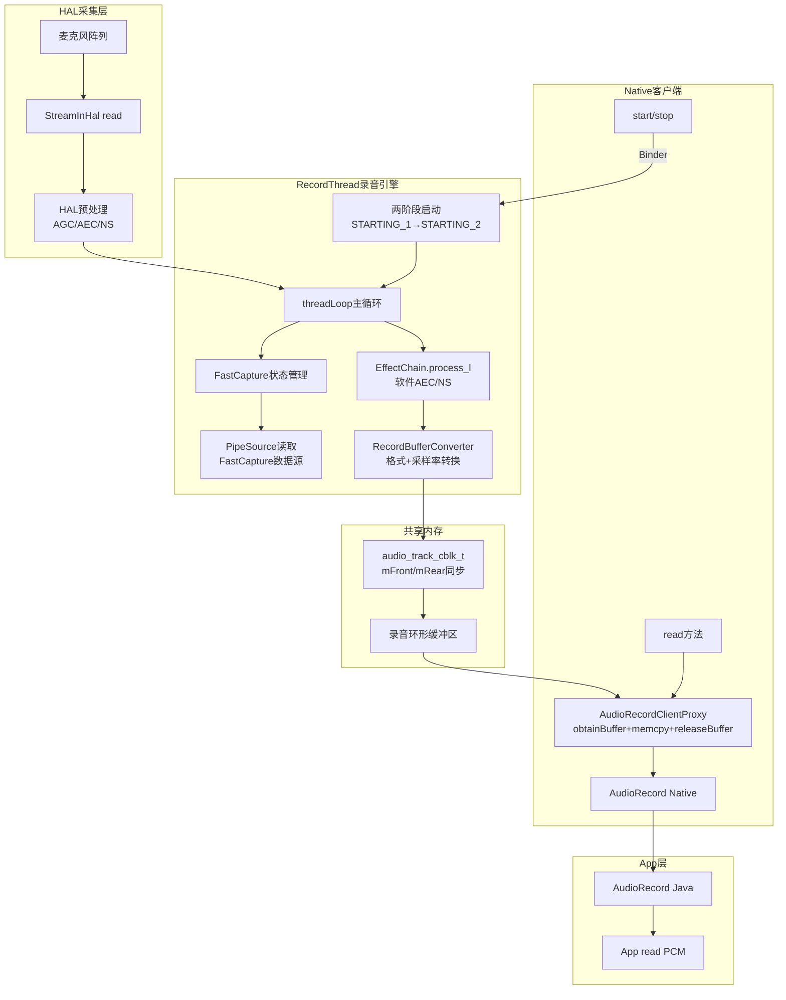
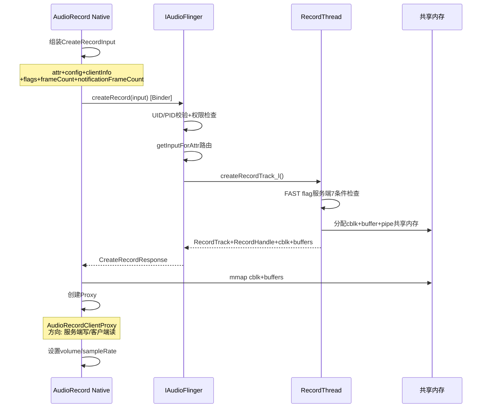
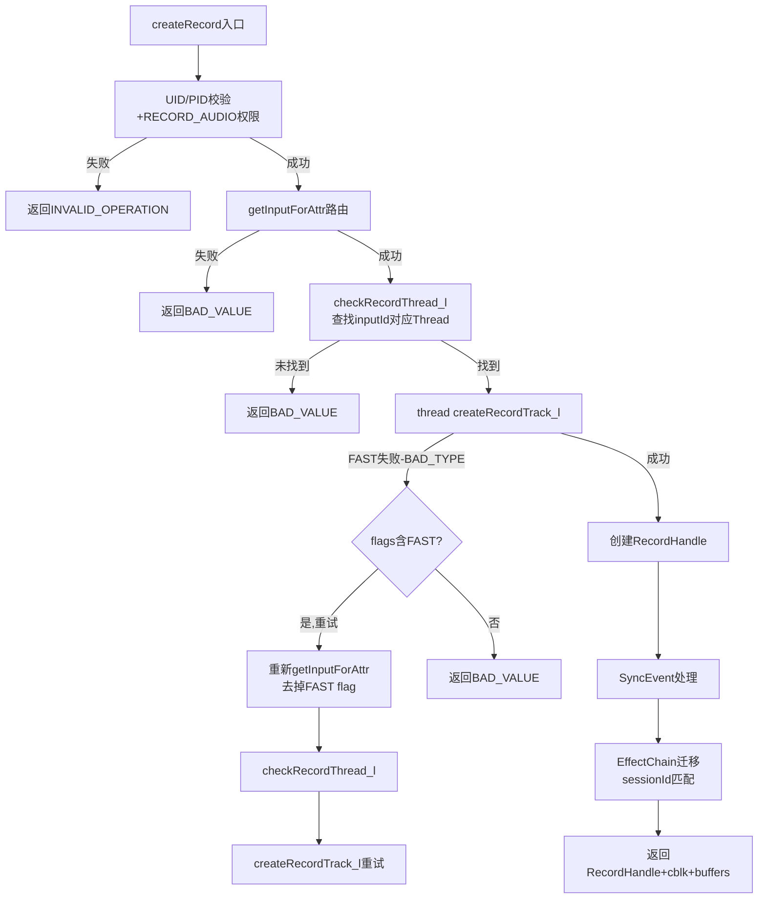
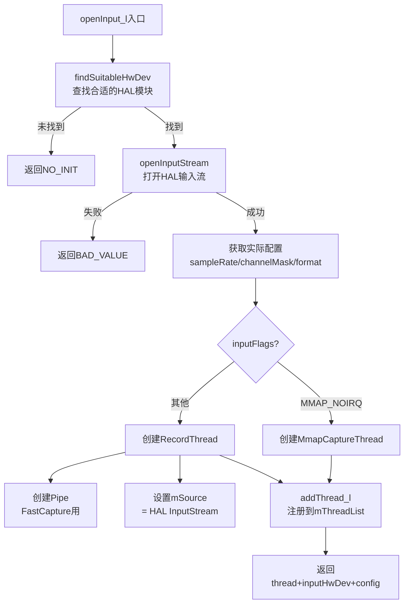
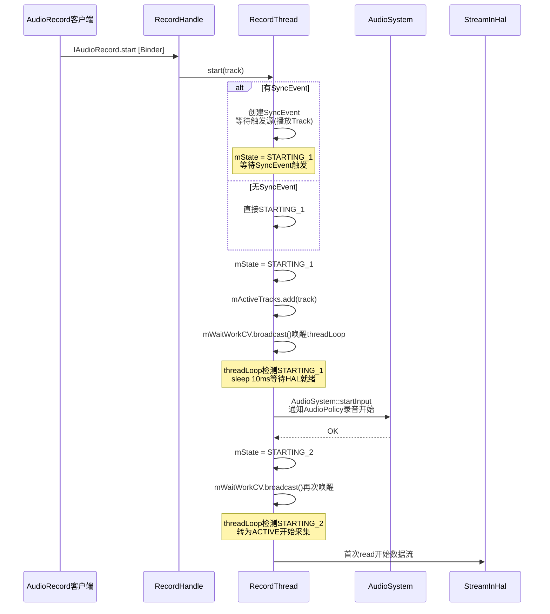
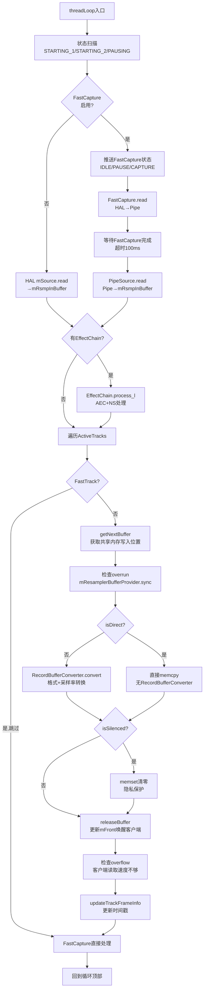
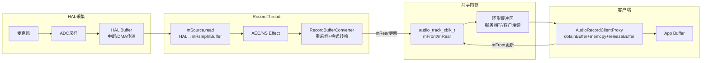

## 5.10 录音全栈调用链

> [← 上一个](05_5.9_音乐播放全栈调用链.md) | [← 返回AudioFlinger](README.md) | [返回导航](../README.md) | [下一个 →](05_5.11_AudioMixer与Resampler-混音引擎核心.md)

---

本文基于AOSP14源码，深度解析从HAL层PCM采集到App层AudioRecord读取的完整录音数据流路径。与播放链的"推模型"不同，录音链采用"HAL→AF→App"的拉模型，RecordThread从HAL读取数据推入共享内存，App从共享内存拉取数据。

### 5.10.1 录音全栈架构总览



### 5.10.2 AudioRecord::set()参数决策与创建流程

[`AudioRecord::set()`](frameworks/av/media/libaudioclient/AudioRecord.cpp:250) 是录音链的入口方法。

#### AudioSource与路由决策

| AudioSource | 路由优先级 | HAL预处理 | AudioPolicy Flags | 典型场景 |
|---|---|---|---|---|
| `VOICE_RECOGNITION` | 主MIC > 有线 > BT SCO | **关闭AGC+AEC** | `AUDIO_INPUT_FLAG_FAST` | 语音助手 |
| `VOICE_COMMUNICATION` | BT SCO > 有线 > 主MIC | **AEC+NS** | `AUDIO_INPUT_FLAG_VOIP_SCO` | VoIP通话 |
| `MIC` | 主MIC > 有线 > BT SCO | AGC可选 | NONE | 录音笔 |
| `CAMCORDER` | 主MIC(与摄像头同向) | 无 | `AUDIO_INPUT_FLAG_NONE` | 视频录制 |
| `VOICE_DOWNLINK` | 通话下行 | 无 | `AUDIO_INPUT_FLAG_NONE` | 通话录音 |
| `VOICE_CALL` | 通话双向 | 无 | `AUDIO_INPUT_FLAG_NONE` | 通话录音 |
| `VOICE_UPLINK` | 通话上行 | 无 | `AUDIO_INPUT_FLAG_NONE` | 通话录音 |
| `FM_TUNER` | FM调谐器 | 无 | `AUDIO_INPUT_FLAG_NONE` | FM录制 |
| `HOTWORD` | 主MIC | 关闭AGC | `AUDIO_INPUT_FLAG_FAST` | 热词检测 |

#### FAST Flag录音端资格检查

```cpp
// AudioRecord FAST flag检查 (AudioRecord.cpp:350)
if ((flags & AUDIO_INPUT_FLAG_FAST) != 0) {
    // 1. 必须是线性PCM
    if (!audio_is_linear_pcm(format)) {
        flags = (audio_input_flags_t)(flags & ~AUDIO_INPUT_FLAG_FAST);
    }
    // 2. 必须有callback(非SYNC模式)
    if (cbf == NULL) {
        flags = (audio_input_flags_t)(flags & ~AUDIO_INPUT_FLAG_FAST);
    }
}
```

#### createRecord_l()共享内存与Proxy创建

[`AudioRecord::createRecord_l()`](frameworks/av/media/libaudioclient/AudioRecord.cpp:700) 与播放端createTrack_l()类似，但方向相反：



**CreateRecordInput关键字段**（[`AudioRecord.cpp:720`](frameworks/av/media/libaudioclient/AudioRecord.cpp:720)）：

```cpp
IAudioFlinger::CreateRecordInput input;
input.attr = mAttributes;           // 音频属性(source/capturePreset/flags)
input.config = mConfig;             // audio_config_t(sampleRate/channelMask/format)
input.clientInfo = mClientInfo;     // UID/PID
input.flags = mFlags;               // input flags(FAST/VOIP_SCO等)
input.frameCount = mReqFrameCount;  // 请求的帧数
input.notificationFrameCount = mNotificationFramesAct; // 回调通知帧数
input.selectedDeviceId = mSelectedDeviceId; // 指定输入设备
```

### 5.10.3 AudioFlinger::createRecord()路由与Track构造

[`AudioFlinger::createRecord()`](frameworks/av/services/audioflinger/AudioFlinger.cpp:2390) 是服务端创建RecordTrack的入口。



#### FAST Flag重试循环

录音端特有的FAST flag重试机制（[`AudioFlinger.cpp:2460`](frameworks/av/services/audioflinger/AudioFlinger.cpp:2460)）：

```cpp
// FAST flag重试循环
for (int retry = 0; retry < 2; retry++) {
    status_t status = thread->createRecordTrack_l(...);

    if (status == BAD_TYPE && retry == 0) {
        // BAD_TYPE: FAST flag服务端检查失败
        // 策略: 去掉FAST flag重新路由
        input.flags = (audio_input_flags_t)(
            input.flags & ~AUDIO_INPUT_FLAG_FAST);

        // 重新路由
        status_t routeStatus = AudioSystem::getInputForAttr(
            &input.attr, &input, &selectedDeviceId, &portId);
        if (routeStatus != NO_ERROR) break;

        // 查找新的RecordThread
        thread = checkRecordThread_l(input.inputId);
        if (thread == 0) break;
        continue;  // 重试
    }
    break;  // 成功或其他错误
}
```

| 重试次数 | flags | 路由目标 | 可能的Thread |
|---|---|---|---|
| 第1次 | 含AUDIO_INPUT_FLAG_FAST | FastCapture Thread | RecordThread(有FastCapture) |
| 第2次 | 无FAST flag | Normal RecordThread | RecordThread(无FastCapture) |

#### EffectChain迁移

```cpp
// RecordTrack加入sessionId对应的EffectChain (AudioFlinger.cpp:2520)
sp<EffectChain> chain = thread->getEffectChain_l(sessionId);
if (chain != 0) {
    // 设置RecordTrack的mainBuffer指向EffectChain的buffer
    track->setMainBuffer(chain->inBuffer());
} else {
    // 无EffectChain，直接使用mRsmpInBuffer
    track->setMainBuffer(thread->mRsmpInBuffer);
}
```

### 5.10.4 RecordThread::createRecordTrack_l() FAST flag服务器端决策

[`RecordThread::createRecordTrack_l()`](frameworks/av/services/audioflinger/Threads.cpp:8622) 是服务端RecordTrack构造的核心。

#### FAST Flag服务器端7条件检查

```cpp
// FAST flag服务器端7条件检查 (Threads.cpp:8640)
if (isLinearPCM(format) &&              // 1. 必须是线性PCM
    channelMask == mChannelMask &&       // 2. 通道掩码必须匹配Thread
    sampleRate == mSampleRate &&         // 3. 采样率必须匹配Thread
    hasFastCapture() &&                  // 4. Thread有FastCapture
    mFastTrackAvailMask != 0 &&         // 5. 有可用的FastTrack槽位
    frameCount <= mPipeFramesP2 &&       // 6. 帧数不超过Pipe大小
    !sharedAudioHistory) {               // 7. 不共享音频历史
    isFastTrack = true;
} else {
    isFastTrack = false;
    // 降级flags
    input.flags = (audio_input_flags_t)(input.flags & ~AUDIO_INPUT_FLAG_FAST);
}
```

| 条件编号 | 条件 | 原因 |
|---|---|---|
| 1 | `isLinearPCM(format)` | FastCapture只处理PCM |
| 2 | `channelMask == mChannelMask` | FastCapture不做通道转换 |
| 3 | `sampleRate == mSampleRate` | FastCapture不做重采样 |
| 4 | `hasFastCapture()` | Thread已初始化FastCapture |
| 5 | `mFastTrackAvailMask != 0` | FastTrack槽位有限 |
| 6 | `frameCount <= mPipeFramesP2` | Pipe缓冲区有大小限制 |
| 7 | `!sharedAudioHistory` | 共享历史模式不支持FAST |

#### EffectChain兼容性检查

```cpp
// 检查EffectChain是否兼容FAST (Threads.cpp:8700)
if (isFastTrack) {
    sp<EffectChain> chain = getEffectChain_l(sessionId);
    if (chain != 0 && !chain->isCompatibleWithFastTrack()) {
        isFastTrack = false;
        // 降级但不返回错误
    }
}
```

#### frameCount与notificationFrameCount计算

```cpp
// FAST Track帧数 (Threads.cpp:8720)
if (isFastTrack) {
    // FastCapture Track: 帧数由Pipe大小决定
    // 典型: mPipeFramesP2 = 1024或2048
    frameCount = min(frameCount, mPipeFramesP2);
    notificationFrameCount = frameCount / 2;  // 50%水位通知
} else {
    // Normal Track: 基于延迟计算
    // minFrameCount = (sampleRate * latency) / 1000
    size_t minFrameCount = calculateMinFrameCount(
        sampleRate, mSampleRate, mFrameCount);
    frameCount = max(frameCount, minFrameCount);
}
```

#### RecordTrack构造

```cpp
// RecordTrack构造 (Threads.cpp:8780)
track = new RecordTrack(this, client, sampleRate, format,
                        channelMask, frameCount, sessionId,
                        isFastTrack, uid, pid, portId,
                        notificationFrameCount, sharedAudioHistory);

// 添加到mTracks列表
mTracks.add(track);
```

**RecordTrack vs Track构造参数对比**：

| 参数 | Track(播放) | RecordTrack(录音) |
|---|---|---|
| 数据方向 | 客户端→服务端 | 服务端→客户端 |
| Proxy类型 | AudioTrackClientProxy/ServerProxy | AudioRecordClientProxy/ServerProxy |
| 共享内存写端 | Client(写mRear) | Server(写mRear) |
| 共享内存读端 | Server(读mFront) | Client(读mFront) |
| mainBuffer | 指向mSinkBuffer或EffectChain | 指向mRsmpInBuffer或EffectChain |
| 静音机制 | 无 | isSilenced()→memset清零 |

### 5.10.5 AudioFlinger::openInput_l()输入流创建

[`AudioFlinger::openInput_l()`](frameworks/av/services/audioflinger/AudioFlinger.cpp:3352) 负责打开HAL输入流并创建RecordThread。



**openInput_l核心逻辑**（[`AudioFlinger.cpp:3352`](frameworks/av/services/audioflinger/AudioFlinger.cpp:3352)）：

```cpp
status_t AudioFlinger::openInput_l(audio_module_handle_t module,
                                    audio_io_handle_t *input,
                                    audio_config_t *config,
                                    audio_devices_t devices,
                                    const String8& address,
                                    uint32_t latency,
                                    audio_input_flags_t flags)
{
    // 1. 查找合适的HAL设备
    sp<DeviceHalInterface> hwDev = findSuitableHwDev(module);

    // 2. 打开HAL输入流
    sp<StreamInHalInterface> inStream;
    status_t status = hwDev->openInputStream(
        devices, flags, config, address, &inStream);

    // 3. 获取实际配置(HAL可能修改)
    // config现在包含HAL实际支持的配置

    // 4. 创建对应的Thread
    if (flags & AUDIO_INPUT_FLAG_MMAP_NOIRQ) {
        // MMAP模式: 创建MmapCaptureThread
        thread = new MmapCaptureThread(this, *input, hwDev, inStream, ...);
    } else {
        // 标准模式: 创建RecordThread
        thread = new RecordThread(this, inStream, *input, devices, ...);
    }

    // 5. 注册Thread
    addThread_l(*input, thread);

    return NO_ERROR;
}
```

**RecordThread初始化关键成员**：

| 成员 | 含义 | 初始值 |
|---|---|---|
| `mSource` | HAL输入流 | openInputStream返回 |
| `mRsmpInBuffer` | 重采样输入缓冲区 | HAL read目标 |
| `mRsmpInFramesP2` | 重采样缓冲区帧数(2的幂) | 根据latency计算 |
| `mRsmpInRear` | 重采样缓冲区写入位置 | 0 |
| `mPipe` | FastCapture的Pipe | FastCapture启用时创建 |
| `mPipeSource` | Pipe读取端 | FastCapture启用时创建 |
| `mFastCapture` | FastCapture状态 | FastCapture启用时创建 |

### 5.10.6 RecordThread::start()两阶段启动与SyncEvent

[`RecordThread::start()`](frameworks/av/services/audioflinger/Threads.cpp:8820) 实现了录音的两阶段启动机制和SyncEvent同步。

#### 两阶段启动机制



**start()核心逻辑**（[`Threads.cpp:8820`](frameworks/av/services/audioflinger/Threads.cpp:8820)）：

```cpp
status_t RecordThread::start(RecordTrack* recordTrack)
{
    AutoMutex lock(mLock);

    // 1. SyncEvent处理
    if (recordTrack->mSyncStartEvent != 0) {
        // 有同步事件: 等待触发源的播放Track启动
        // 触发源通过mSyncStartEvent->triggerSession()标识
        recordTrack->mFramesToDrop = -1;  // 负值: 等待SyncEvent
    }

    // 2. 设置Track状态
    recordTrack->mState = TrackBase::ACTIVE;

    // 3. 添加到活跃列表
    mActiveTracks.add(recordTrack);

    // 4. 第一阶段启动
    mStartReason = START_REASON_START;
    mWaitWorkCV.broadcast();  // 唤醒threadLoop

    return NO_ERROR;
}
```

#### threadLoop中的两阶段处理

```cpp
// RecordThread::threadLoop中的状态扫描 (Threads.cpp:8050)
for (size_t i = 0; i < size; i++) {
    sp<RecordTrack> activeTrack = mActiveTracks[i];

    switch (activeTrack->mState) {
    case TrackBase::STARTING_1:
        // 第一阶段: 等待HAL就绪
        sleep(10);  // 10ms等待
        mStartReason = START_REASON_START;
        break;

    case TrackBase::STARTING_2:
        // 第二阶段: 通知AudioPolicy开始采集
        AudioSystem::startInput(mId, activeTrack->mPortId);
        activeTrack->mState = TrackBase::ACTIVE;
        break;

    case TrackBase::PAUSING:
        // 暂停
        AudioSystem::stopInput(mId, activeTrack->mPortId);
        activeTrack->mState = TrackBase::PAUSED;
        break;

    case TrackBase::ACTIVE:
        // 正常采集
        break;
    }
}
```

#### SyncEvent帧丢弃机制

```cpp
// SyncEvent帧丢弃处理 (Threads.cpp:8467)
if (activeTrack->mFramesToDrop == 0) {
    // 正常写入: 无帧丢弃
    activeTrack->releaseBuffer(&activeTrack->mSink);
} else if (activeTrack->mFramesToDrop > 0) {
    // 正向丢弃: 丢弃指定数量的帧
    // 用于SyncEvent同步: 丢弃触发前的旧数据
    activeTrack->mFramesToDrop -= framesOut;
    if (activeTrack->mFramesToDrop <= 0) {
        activeTrack->clearSyncStartEvent();
    }
} else {
    // 负向丢弃: 等待SyncEvent触发
    // mFramesToDrop < 0 表示仍在等待
    activeTrack->mFramesToDrop += framesOut;
    if (activeTrack->mFramesToDrop >= 0 ||
        activeTrack->mSyncStartEvent == 0 ||
        activeTrack->mSyncStartEvent->isCancelled()) {
        // 超时或取消: 放弃等待
        activeTrack->clearSyncStartEvent();
    }
}
```

### 5.10.7 RecordThread::threadLoop()录音数据流核心

[`RecordThread::threadLoop()`](frameworks/av/services/audioflinger/Threads.cpp:7991) 是录音引擎的主循环，负责从HAL读取数据、Effect处理、重采样和写入共享内存。

#### threadLoop主循环架构



#### FastCapture状态管理

```cpp
// FastCapture状态推送 (Threads.cpp:8100)
if (hasFastCapture()) {
    FastCaptureStateQueue::Mutate mutate;
    // 根据活跃Track数量决定FastCapture状态
    if (mActiveTracks.size() > 0) {
        // 有活跃Track → CAPTURE状态
        if (mFastCaptureFutex != FastCaptureStateQueue::CAPTURE) {
            mutate = FastCaptureStateQueue::CAPTURE;
            mFastCaptureFutex = FastCaptureStateQueue::CAPTURE;
        }
    } else {
        // 无活跃Track → IDLE状态
        if (mFastCaptureFutex != FastCaptureStateQueue::IDLE) {
            mutate = FastCaptureStateQueue::IDLE;
            mFastCaptureFutex = FastCaptureStateQueue::IDLE;
        }
    }
}

// 等待FastCapture完成数据写入到Pipe (Threads.cpp:8140)
mWaitWorkCV.waitRelative(mLock, kFastCaptureWaitNs);  // 100ms超时
```

#### HAL数据读取

```cpp
// 从HAL或PipeSource读取数据 (Threads.cpp:8180)
ssize_t framesRead;
if (hasFastCapture()) {
    // FastCapture模式: 从PipeSource读取
    framesRead = mPipeSource->read(mRsmpInBuffer + mRsmpInRear,
                                    mRsmpInFramesP2 - mRsmpInRear,
                                    ...);
} else {
    // Normal模式: 从HAL读取
    framesRead = mSource->read(mRsmpInBuffer + mRsmpInRear,
                               mRsmpInFramesP2 - mRsmpInRear,
                               ...);
}
```

#### EffectChain录音处理

```cpp
// EffectChain处理 (Threads.cpp:8250)
if (mEffectChains.size() != 0) {
    // 设置EffectChain输入buffer
    for (size_t i = 0; i < mEffectChains.size(); i++) {
        mEffectChains[i]->setInputBuffer(mRsmpInBuffer);
        // AEC/NS等录音Effect处理
        mEffectChains[i]->process_l();
    }
}
```

#### RecordBufferConverter格式转换

```cpp
// RecordBufferConverter处理 (Threads.cpp:8454)
framesOut = activeTrack->mRecordBufferConverter->convert(
    activeTrack->mSink.raw,           // 目标: 共享内存
    activeTrack->mResamplerBufferProvider,  // 源: mRsmpInBuffer
    framesOut);                        // 要转换的帧数

// RecordBufferConverter内部执行:
// 1. 采样率转换: mSampleRate → track->mSampleRate (Resampler)
// 2. 通道掩码转换: mChannelMask → track->mChannelMask
// 3. 格式转换: mFormat → track->mFormat (int16↔float等)
// 4. 通道数转换: mChannelCount → track->mChannelCount
```

#### 静音与隐私保护

```cpp
// isSilenced检查 (Threads.cpp:8472)
if (activeTrack->isSilenced()) {
    // 静音: 清零共享内存数据
    // 场景: App在后台但无录音权限(隐私保护)
    memset(activeTrack->mSink.raw, 0, framesOut * activeTrack->frameSize());
}
activeTrack->releaseBuffer(&activeTrack->mSink);
```

#### Overrun检测与处理

```cpp
// Overrun检测 (Threads.cpp:8416)
activeTrack->mResamplerBufferProvider->sync(&framesIn, &hasOverrun);
if (hasOverrun) {
    overrun = OVERRUN_TRUE;
}

// Overrun处理 (Threads.cpp:8504)
switch (overrun) {
case OVERRUN_TRUE:
    // 客户端读取速度不够，缓冲区溢出
    if (!activeTrack->setOverflow()) {
        ALOGW("RecordThread: buffer overflow");
    }
    break;
case OVERRUN_FALSE:
    activeTrack->clearOverflow();
    break;
case OVERRUN_UNKNOWN:
    break;
}
```

### 5.10.8 AudioRecord::start()/stop()客户端控制

#### AudioRecord::start()

[`AudioRecord::start()`](frameworks/av/media/libaudioclient/AudioRecord.cpp:420) 客户端启动录音：

```cpp
status_t AudioRecord::start()
{
    AutoMutex lock(mLock);

    // 1. 状态检查
    if (mActive) {
        return NO_ERROR;  // 已在录音，幂等返回
    }

    // 2. 清空共享内存旧数据
    mProxy->flush();

    // 3. 设置活跃标志
    mActive = true;

    // 4. Binder调用服务端RecordTrack::start()
    status_t status = mAudioRecord->start();
    if (status != NO_ERROR) {
        mActive = false;
        return status;
    }

    // 5. 恢复AudioRecordThread(回调模式)
    if (mAudioRecordThread != 0) {
        mAudioRecordThread->resume();
    }

    // 6. 处理服务端重启(CBLK_INVALID)
    if (status == DEAD_OBJECT) {
        status = restoreRecord_l("start");
    }

    return status;
}
```

**mProxy->flush()详解**：录音启动时需要清空共享内存中的旧数据，避免读到上一轮录音的残留数据。flush()将mRear重置到mFront位置，使framesAvailable为0。

#### AudioRecord::stop()

[`AudioRecord::stop()`](frameworks/av/media/libaudioclient/AudioRecord.cpp:503) 客户端停止录音：

```cpp
void AudioRecord::stop()
{
    AutoMutex lock(mLock);

    if (!mActive) {
        return;  // 已停止，幂等返回
    }

    // 1. 清除活跃标志
    mActive = false;

    // 2. 中断回调(如果正在等待)
    mProxy->interrupt();

    // 3. Binder调用服务端RecordTrack::stop()
    mAudioRecord->stop();

    // 4. 暂停AudioRecordThread(回调模式)
    if (mAudioRecordThread != 0) {
        mAudioRecordThread->pause();
    }
}
```

#### AudioRecord::read()数据读取

```cpp
ssize_t AudioRecord::read(void* buffer, size_t size, bool blocking)
{
    // 1. 检查Transfer Type
    if (mTransfer != TRANSFER_SYNC) {
        return INVALID_OPERATION;  // 仅TRANSFER_SYNC允许
    }

    // 2. 读取循环
    size_t read = 0;
    while (read < size) {
        // 2a. obtainBuffer - 获取共享内存可读位置
        audio_track_cblk_t* cblk = mCblk;
        uint32_t framesAvail = cblk->framesAvailable();
        if (framesAvail == 0) {
            if (!blocking) break;
            // 等待服务端写入新数据
            status_t status = obtainBuffer(&audioBuffer, ...);
            if (status != NO_ERROR) break;
        }

        // 2b. memcpy从共享内存读取
        size_t toRead = min(framesAvail, (size - read) / mFrameSize);
        memcpy((uint8_t*)buffer + read, audioBuffer.i8, toRead * mFrameSize);

        // 2c. releaseBuffer - 通知服务端已消费
        releaseBuffer(&audioBuffer);

        read += toRead * mFrameSize;
    }

    return read;
}
```

#### 客户端共享内存读写方向对比

```
┌─────────────────────────────────────────────────────────────┐
│              播放 vs 录音 共享内存方向对比                     │
├─────────────────────────────────────────────────────────────┤
│                                                             │
│  播放(App→HAL):                                             │
│  ┌─────────┐     mRear++     ┌─────────┐    mFront++       │
│  │  Client  │ ────write────→ │  Buffer  │ ────read───→     │
│  │(App端)   │                │(共享内存) │          Server  │
│  └─────────┘                 └─────────┘    (AF端)         │
│                                                             │
│  录音(HAL→App):                                              │
│  ┌─────────┐    mFront++     ┌─────────┐    mRear++        │
│  │  Client  │ ────read─────→ │  Buffer  │ ←────write────   │
│  │(App端)   │                │(共享内存) │           Server  │
│  └─────────┘                 └─────────┘     (AF端)        │
└─────────────────────────────────────────────────────────────┘
```

### 5.10.9 录音延迟分解与性能优化

#### 录音延迟分解

```
总延迟 = 硬件延迟 + HAL Buffer延迟 + AF Buffer延迟 + App Buffer延迟

┌─────────────────────────────────────────────────────────────────┐
│ 延迟分解                                                        │
├─────────────────┬───────────────┬───────────────────────────────┤
│ 延迟层级        │ 典型值        │ 计算方式                      │
├─────────────────┼───────────────┼───────────────────────────────┤
│ 硬件延迟        │ 1-5ms         │ ADC+麦克风响应延迟             │
├─────────────────┼───────────────┼───────────────────────────────┤
│ HAL Buffer      │ 5-20ms        │ HAL实现决定                   │
├─────────────────┼───────────────┼───────────────────────────────┤
│ AF Buffer       │ 20ms(Normal)  │ mRsmpInFramesP2/sampleRate   │
│                 │ 10ms(FastCap) │ mFrameCount/sampleRate        │
├─────────────────┼───────────────┼───────────────────────────────┤
│ App Buffer      │ 20-40ms       │ frameCount/sampleRate         │
├─────────────────┼───────────────┼───────────────────────────────┤
│ Effect处理      │ 5-15ms        │ AEC+NS算法延迟                │
├─────────────────┼───────────────┼───────────────────────────────┤
│ 总计 Normal     │ 51-100ms      │ 标准录音延迟                  │
│ 总计 FastCapture│ 36-80ms       │ 低延迟录音                    │
└─────────────────┴───────────────┴───────────────────────────────┘
```

#### NormalCapture vs FastCapture数据流对比

| 维度 | NormalCapture路径 | FastCapture路径 |
|------|-----------------|----------------|
| Thread类型 | RecordThread | RecordThread(含FastCapture) |
| 数据源 | mSource(HAL InputStream) | PipeSource(FastCapture写入) |
| 采集周期 | ~20ms | ~10ms |
| EffectChain | 完整支持 | 有限(兼容性检查) |
| 重采样 | RecordBufferConverter | RecordBufferConverter |
| 调度策略 | SCHED_OTHER | SCHED_FIFO(FastCapture线程) |
| Pipe缓冲区 | 无 | mPipe(mPipeFramesP2大小) |
| 共享内存写入 | threadLoop内直接写入 | FastCapture→Pipe→threadLoop→共享内存 |
| 适用场景 | 标准录音/VoIP | 语音助手/热词检测 |

#### 录音优化策略

| 策略 | 方法 | 效果 |
|------|------|------|
| FastCapture | FAST flag + FastCapture线程 | 减少10ms延迟 |
| 减少App Buffer | 减小frameCount | 减少App Buffer延迟 |
| 硬件AEC | HAL层AEC预处理 | 减少软件Effect延迟 |
| MMAP模式 | AUDIO_INPUT_FLAG_MMAP_NOIRQ | 共享内存直通，零拷贝 |
| 采样率匹配 | 选择与Thread一致的采样率 | 避免重采样延迟 |
| 通道匹配 | 选择与Thread一致的通道配置 | 避免通道转换延迟 |

### 5.10.10 录音数据流完整路径总结

#### 全链路数据帧流转



#### 完整调用链快速参考

```
AudioRecord Java → native_setup()
  → AudioRecord::set()                     [参数决策+Source路由]
    → AudioRecord::createRecord_l()         [Binder+共享内存+Proxy]
      → IAudioFlinger::createRecord()       [Binder IPC]
        → AudioFlinger::createRecord()      [路由+权限校验]
          → getInputForAttr()               [AudioPolicy录音路由]
          → RecordThread::createRecordTrack_l() [FAST 7条件+Track构造]
            → RecordTrack构造               [共享内存分配]
            → mTracks.add()                 [Track注册]
          → RecordHandle构造                [Binder代理]
          → FAST重试循环                     [BAD_TYPE→去FAST重路由]
          → EffectChain迁移                 [sessionId匹配]
        ← CreateRecordResponse              [cblk+buffers+flags]
      ← AudioRecordClientProxy创建           [客户端Proxy]
    ← mNativeRecordInJavaObj                [Java层引用]

AudioRecord.startRecording()
  → mProxy->flush()                         [清空共享内存旧数据]
  → mAudioRecord->start()                   [Binder IPC]
    → RecordTrack::start()                  [两阶段启动]
      → STARTING_1 → sleep(10ms)            [等待HAL就绪]
      → AudioSystem::startInput()           [通知AudioPolicy]
      → STARTING_2 → ACTIVE                 [开始采集]

RecordThread::threadLoop()                  [每20ms周期]
  → FastCapture状态推送/等待                 [FastCapture模式]
  → mSource.read() / PipeSource.read()      [HAL/PIPE→mRsmpInBuffer]
  → EffectChain::process_l()                [AEC+NS处理]
  → 遍历ActiveTracks:
    → getNextBuffer()                       [获取共享内存写入位置]
    → RecordBufferConverter::convert()      [重采样+格式转换]
    → isSilenced() → memset清零             [隐私保护]
    → releaseBuffer()                       [更新mFront,唤醒客户端]
  → updateTrackFrameInfo()                  [时间戳更新]

AudioRecord.read(buffer)
  → obtainBuffer()                          [获取共享内存可读位置]
  → memcpy()                                [PCM数据从共享内存读取]
  → releaseBuffer()                         [更新mRear,通知服务端]
```

#### 播放 vs 录音全链路对比

| 维度 | 播放链 | 录音链 |
|------|--------|--------|
| 数据方向 | App→HAL | HAL→App |
| 数据模型 | 推模型(App推数据) | 拉模型(HAL推→App拉) |
| 客户端写入 | write()→共享内存 | read()←共享内存 |
| 服务端读取 | getNextBuffer←共享内存 | mSource.read→共享内存 |
| 共享内存写端 | Client(mRear) | Server(mRear) |
| 共享内存读端 | Server(mFront) | Client(mFront) |
| 混音/分配 | N路Track→1路输出 | 1路输入→N路Track |
| Effect位置 | 输出Effect(低音增强等) | 输入Effect(AEC/NS) |
| FAST加速 | FastMixer | FastCapture |
| SyncEvent | 无 | 有(录音同步触发) |
| 静音机制 | 无 | isSilenced隐私保护 |
| Overrun/Underrun | Underrun(数据不足) | Overrun(数据溢出) |
| 延迟关注点 | 端到端输出延迟 | 端到端采集延迟 |

---