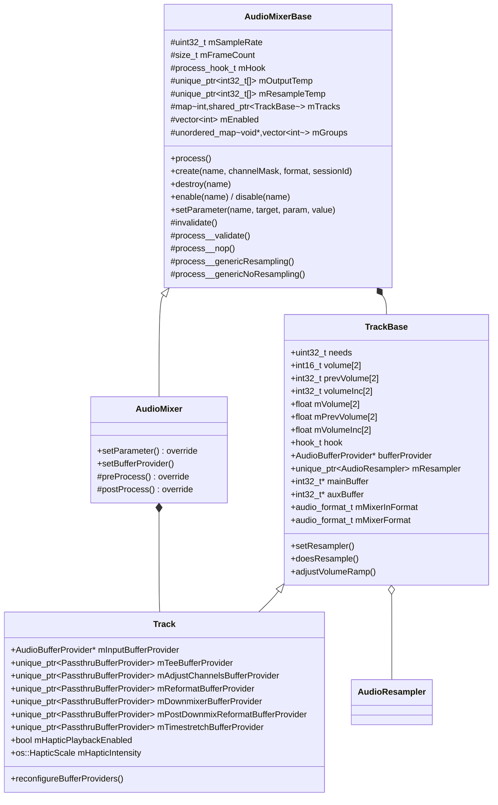
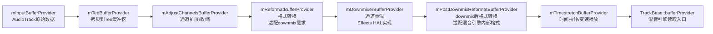
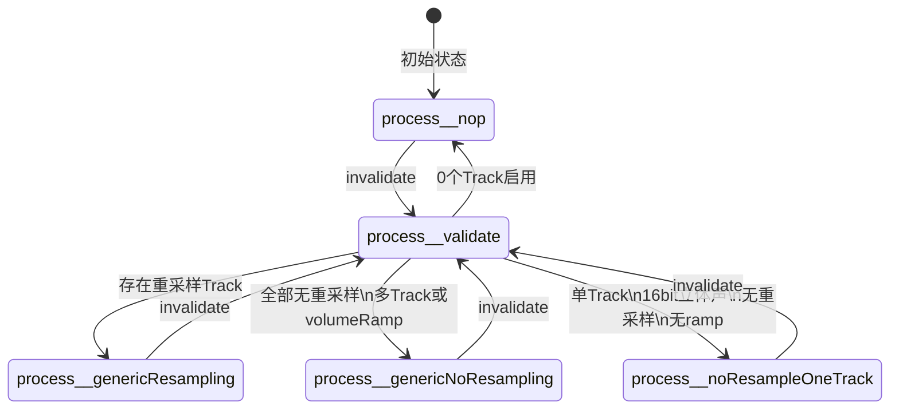
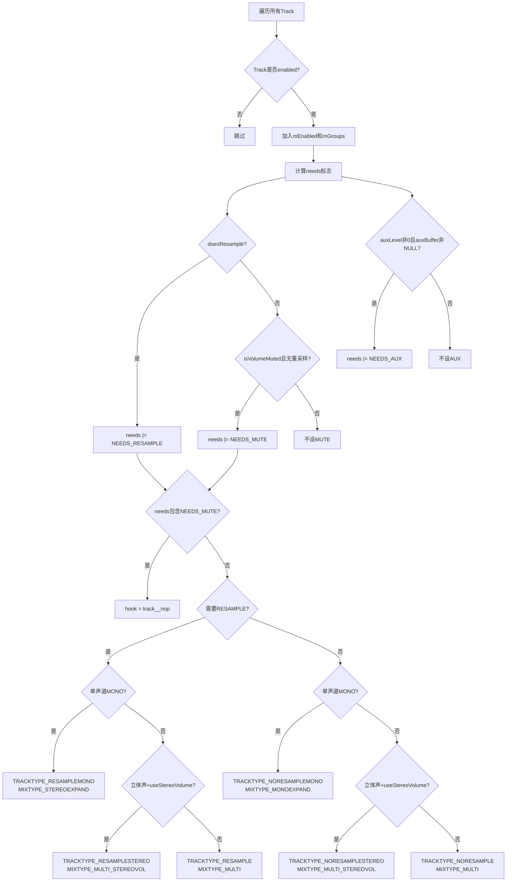
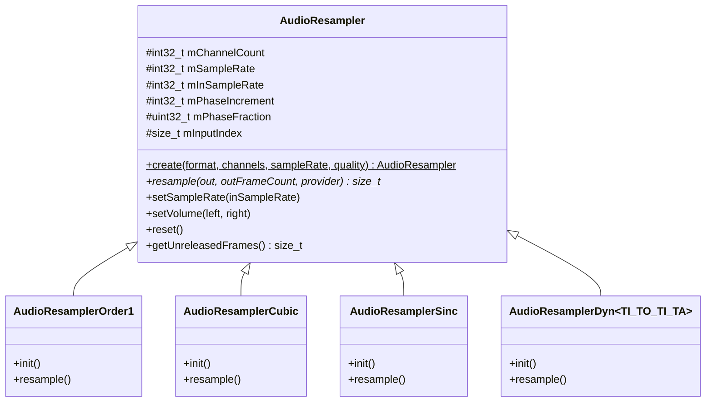
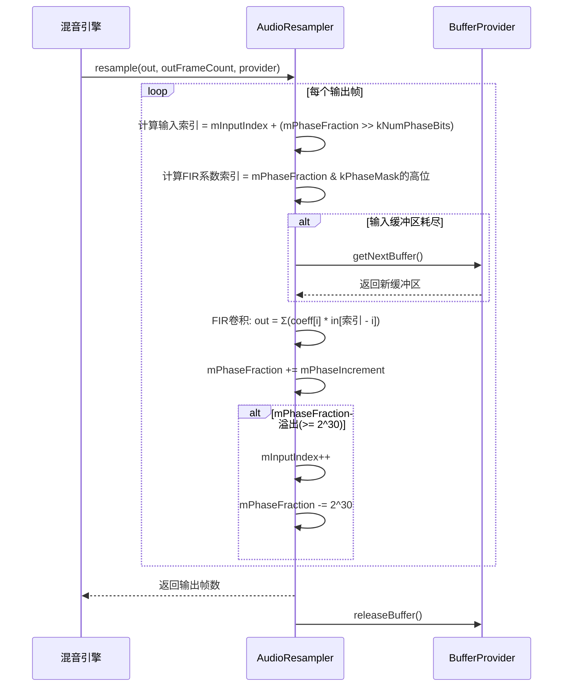
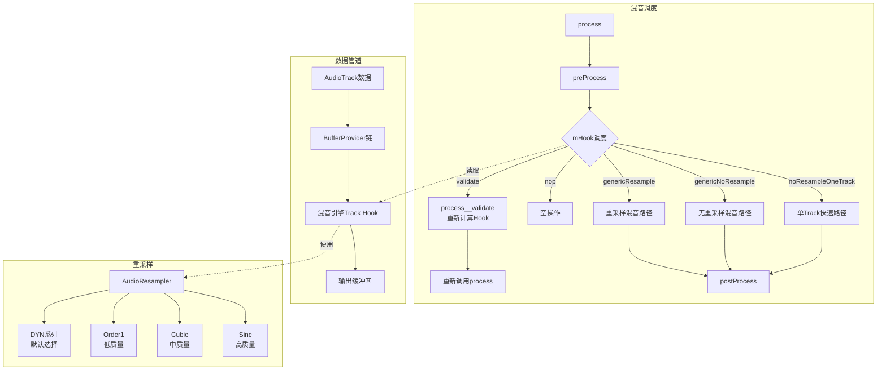

[← 上一个](05_5.10_录音全栈调用链.md) | [← 返回AudioFlinger](README.md) | [返回导航](../README.md) | [下一个 →](05_5.12_DeviceEffectManager-设备级音效管理.md)

## 5.11 AudioMixer与Resampler — 混音引擎核心

## 1. 概述与继承体系

AudioMixer是AudioFlinger混音线程（MixerThread）的核心引擎，负责将多个音频Track的数据混合为一路输出。它实现了两套关键机制：**基于函数指针的Hook调度**（避免虚函数开销）和**BufferProvider链式管道**（完成格式转换、通道重混、时间拉伸等预处理）。

AOSP14将混音引擎拆分为基类与扩展类：

- **AudioMixerBase**：纯混音+重采样，无Effects HAL依赖
- **AudioMixer**：扩展downmix/timestretch（依赖Effects HAL）和Haptic振动支持



源码位置：
- [`AudioMixerBase`](frameworks/av/media/libaudioprocessing/include/media/AudioMixerBase.h)
- [`AudioMixer`](frameworks/av/media/libaudioprocessing/include/media/AudioMixer.h)
- [`AudioResampler`](frameworks/av/media/libaudioprocessing/include/media/AudioResampler.h)

## 2. TrackBase核心数据结构

### 2.1 needs标志位

`needs`字段编码了Track的处理需求，采用位域组合：

| 标志 | 值 | 含义 |
|------|-----|------|
| `NEEDS_CHANNEL_1` | 0x00000000 | 单声道输入 |
| `NEEDS_CHANNEL_2` | 0x00000001 | 立体声输入 |
| `NEEDS_CHANNEL_COUNT__MASK` | 0x00000007 | 通道数掩码（低3位） |
| `NEEDS_MUTE` | 0x00000100 | 静音 |
| `NEEDS_RESAMPLE` | 0x00001000 | 需要重采样 |
| `NEEDS_AUX` | 0x00010000 | 有辅助缓冲区 |

### 2.2 双精度音量系统

TrackBase同时维护**整数定点**和**浮点**两套音量：

**整数定点音量**（legacy，兼容老路径）：
- `volume[2]`：U4.12格式，[`UNITY_GAIN_INT = 0x1000`](frameworks/av/media/libaudioprocessing/include/media/AudioMixerBase.h:50)
- `prevVolume[2]`：U4.28格式（ramp中间态，左移16位扩展精度）
- `volumeInc[2]`：U4.28格式，每帧增量

**浮点音量**（新引擎路径）：
- `mVolume[2]`：[`UNITY_GAIN_FLOAT = 1.0f`](frameworks/av/media/libaudioprocessing/include/media/AudioMixerBase.h:51)
- `mPrevVolume[2]`：ramp起始值
- `mVolumeInc[2]`：每帧浮点增量

### 2.3 音频格式字段

| 字段 | 含义 |
|------|------|
| `mFormat` | Track输入格式（PCM_16_BIT / PCM_FLOAT） |
| `mMixerInFormat` | 混音引擎内部格式（所有Track统一转换到此格式） |
| `mMixerFormat` | 混音输出格式（PCM_FLOAT / PCM_16_BIT） |

## 3. AudioMixer::Track与BufferProvider链

### 3.1 BufferProvider链架构

AudioMixer::Track通过7层BufferProvider管道完成预处理，在[`reconfigureBufferProviders()`](frameworks/av/media/libaudioprocessing/AudioMixer.cpp:337)中按从上游到下游的顺序构建：



### 3.2 reconfigureBufferProviders()实现解析

```cpp
// frameworks/av/media/libaudioprocessing/AudioMixer.cpp:337
void AudioMixer::Track::reconfigureBufferProviders()
{
    // 从最上游开始，依次将下游的provider设置为上游
    bufferProvider = mInputBufferProvider;
    if (mTeeBufferProvider != nullptr) {
        mTeeBufferProvider->setBufferProvider(bufferProvider);
        bufferProvider = mTeeBufferProvider.get();
    }
    if (mAdjustChannelsBufferProvider.get() != nullptr) {
        mAdjustChannelsBufferProvider->setBufferProvider(bufferProvider);
        bufferProvider = mAdjustChannelsBufferProvider.get();
    }
    if (mReformatBufferProvider.get() != nullptr) {
        mReformatBufferProvider->setBufferProvider(bufferProvider);
        bufferProvider = mReformatBufferProvider.get();
    }
    if (mDownmixerBufferProvider.get() != nullptr) {
        mDownmixerBufferProvider->setBufferProvider(bufferProvider);
        bufferProvider = mDownmixerBufferProvider.get();
    }
    if (mPostDownmixReformatBufferProvider.get() != nullptr) {
        mPostDownmixReformatBufferProvider->setBufferProvider(bufferProvider);
        bufferProvider = mPostDownmixReformatBufferProvider.get();
    }
    if (mTimestretchBufferProvider.get() != nullptr) {
        mTimestretchBufferProvider->setBufferProvider(bufferProvider);
        bufferProvider = mTimestretchBufferProvider.get();
    }
    // 最终bufferProvider指向链的末端，即混音引擎的读取入口
}
```

**关键设计要点**：
- 链中每一层都是`PassthruBufferProvider`子类，通过`setBufferProvider()`链接上游
- 各层按需创建，为`nullptr`时跳过（直接透传）
- 析构时按**逆序**释放以确保上游provider不会被提前释放

### 3.3 各层BufferProvider职责

| 层 | 职责 | 创建条件 |
|----|------|----------|
| `mAdjustChannelsBufferProvider` | 通道数调整（扩展填零/收缩保留尾通道） | 输入通道数与混音通道数不匹配时 |
| `mReformatBufferProvider` | 将PCM_FLOAT转为PCM_16_BIT（或反向） | downmix要求特定格式时 |
| `mDownmixerBufferProvider` | 多通道→立体声/单声道的重混 | 通道数>2且使用Effects HAL downmix时 |
| `mPostDownmixReformatBufferProvider` | downmix输出格式→mMixerInFormat | downmix输出格式与混音引擎内部格式不同时 |
| `mTimestretchBufferProvider` | 变速播放（Sonic算法） | AudioPlaybackRate非默认时 |
| `mTeeBufferProvider` | 拷贝原始数据到tee缓冲区（供visualizer等使用） | 设置了TEE_BUFFER参数时 |

## 4. process()流程与Hook机制

### 4.1 三阶段调度

```cpp
// frameworks/av/media/libaudioprocessing/include/media/AudioMixerBase.h:195
void process() {
    preProcess();            // 阶段1: 预处理
    (this->*mHook)();       // 阶段2: 核心混音（函数指针调度）
    postProcess();           // 阶段3: 后处理
}
```

### 4.2 Hook函数指针体系

AudioMixerBase使用**两级Hook**实现零虚函数开销的动态分发：

**Process Hook**（混音器级别）：决定整体混音策略

| Hook | 选择条件 |
|------|----------|
| `process__nop` | 0个Track启用（默认/初始化值） |
| `process__validate` | 标记需要重新验证（由`invalidate()`设置） |
| `process__genericResampling` | 存在需要重采样的Track |
| `process__genericNoResampling` | 所有Track均无需重采样 |
| `process__noResampleOneTrack` | 单Track、16bit立体声、无重采样（快速路径） |

**Track Hook**（Track级别）：决定单Track数据处理方式

| TRACKTYPE | 含义 | 对应模板 |
|-----------|------|----------|
| `TRACKTYPE_NOP` | 静音/无操作 | `track__nop` |
| `TRACKTYPE_RESAMPLE` | 重采样多通道 | `track__Resample<MIXTYPE_MULTI>` |
| `TRACKTYPE_RESAMPLEMONO` | 重采样单声道→立体声 | `track__Resample<MIXTYPE_STEREOEXPAND>` |
| `TRACKTYPE_RESAMPLESTEREO` | 重采样立体声 | `track__Resample<MIXTYPE_MULTI_STEREOVOL>` |
| `TRACKTYPE_NORESAMPLE` | 无重采样多通道 | `track__NoResample<MIXTYPE_MULTI>` |
| `TRACKTYPE_NORESAMPLEMONO` | 无重采样单声道→立体声 | `track__NoResample<MIXTYPE_MONOEXPAND>` |
| `TRACKTYPE_NORESAMPLESTEREO` | 无重采样立体声 | `track__NoResample<MIXTYPE_MULTI_STEREOVOL>` |



## 5. process__validate详解

[`process__validate()`](frameworks/av/media/libaudioprocessing/AudioMixerBase.cpp:620)是混音器的"配置决策器"，在首次process或Track状态变化后触发，负责为每个Track选择合适的Track Hook，并为整体混音选择Process Hook。

### 5.1 第一阶段：计算needs并选择Track Hook



### 5.2 第二阶段：选择Process Hook

选择逻辑在[第706-736行](frameworks/av/media/libaudioprocessing/AudioMixerBase.cpp:706)：

1. **0个Track启用** → `process__nop`
2. **存在重采样Track** → `process__genericResampling`（分配`mOutputTemp`和`mResampleTemp`）
3. **全部无重采样** → `process__genericNoResampling`
4. **快速路径优化**：全部16bit立体声无重采样 + 无volumeRamp + 仅1个Track → `process__noResampleOneTrack`

### 5.3 第三阶段：首次执行后优化

`process__validate()`末尾会再次调用`process()`执行实际混音，然后在[第746-770行](frameworks/av/media/libaudioprocessing/AudioMixerBase.cpp:746)进行二次优化：

- 遍历所有已启用Track，将已完成ramp且音量为0的非重采样Track标记为`NEEDS_MUTE`
- 若所有Track均静音，设置`mHook = process__nop`
- 若满足单Track快速路径条件，设置最优Process Hook

## 6. 通用混音流程详解

### 6.1 process__genericNoResampling

此路径适用于所有Track采样率与输出采样率一致的场景。核心流程：

```
对每个mainBuffer分组：
  1. 为组内所有Track获取缓冲区(bufferProvider->getNextBuffer)
  2. 分BLOCKSIZE块处理（典型值2或4帧）：
     a. 清零outTemp缓冲区
     b. 遍历组内每个Track，调用Track hook累加到outTemp
     c. convertMixerFormat: outTemp(mMixerInFormat) → mainBuffer(mMixerFormat)
  3. 释放所有Track缓冲区(bufferProvider->releaseBuffer)
```

**BLOCKSIZE分块**的原因：限制临时缓冲区`outTemp`大小（栈上`BLOCKSIZE * MAX_NUM_CHANNELS * 4`字节），避免栈溢出。

### 6.2 process__genericResampling

此路径更复杂，因为重采样和非重采样Track共存：

```
对每个mainBuffer分组：
  1. 清零mOutputTemp（整块，大小=mFrameCount * mMixerChannelCount）
  2. 遍历组内每个Track：
     a. 若NEEDS_RESAMPLE：直接调用Track hook（resampler内部控制buffer获取/释放）
     b. 若非RESAMPLE：循环getNextBuffer/releaseBuffer，调用Track hook累加
  3. convertMixerFormat: mOutputTemp → mainBuffer
```

关键区别：重采样Track的缓冲区获取/释放**由resampler内部管理**，而非混音流程直接控制。

### 6.3 Track Hook内部：track__genericResample详解

[`track__genericResample()`](frameworks/av/media/libaudioprocessing/AudioMixerBase.cpp:773)是旧引擎的Track处理函数，新引擎使用模板化版本`track__Resample<>`和`track__NoResample<>`。旧版流程仍值得理解：

```
1. 设置resampler采样率: mResampler->setSampleRate(sampleRate)
2. 若有auxBuffer:
   a. resampler使用unity增益重采样到temp
   b. volumeRampStereo()或volumeStereo()将temp数据按音量累加到out和aux
3. 若无auxBuffer但有volumeRamp:
   a. resampler使用unity增益重采样到temp
   b. volumeRampStereo()将temp按音量累加到out
4. 若无auxBuffer且无volumeRamp:
   a. resampler直接使用当前音量重采样到out
      mResampler->setVolume(mVolume[0], mVolume[1])
      mResampler->resample(out, outFrameCount, bufferProvider)
```

**设计要点**：当有auxBuffer或volumeRamp时，resampler必须以unity增益输出，音量应用在后续步骤。这是因为resampler的`setVolume()`是"最后设置生效"，无法同时处理ramp和aux。

## 7. 音量控制与Ramp

### 7.1 setVolumeRampVariables()

[`setVolumeRampVariables()`](frameworks/av/media/libaudioprocessing/AudioMixerBase.cpp:249)是音量设置的核心函数，同时维护浮点和整数两套ramp：

```
输入：newVolume(浮点目标音量), ramp(帧数,0表示立即)
处理：
  1. 边界检查：NaN/subnormal→0, infinite/超出→UNITY_GAIN_FLOAT
  2. 浮点ramp计算：
     inc = (newVolume - prevVolume) / ramp
     要求inc是normal数且能产生有效前进，否则ramp=0
  3. 整数音量计算：
     intVolume = min(newVolume * 0x1000, 0x1000)  // U4.12
  4. 整数ramp计算（U4.28精度）：
     inc = ((intVolume << 16) - prevIntVolume) / ramp
```

**RAMP_VOLUME vs VOLUME**：
- `RAMP_VOLUME`（target=0x3002）：ramp = mFrameCount，音量在当前周期内平滑过渡
- `VOLUME`（target=0x3003）：ramp = 0，立即设置音量（无渐变）

### 7.2 adjustVolumeRamp()

[`adjustVolumeRamp()`](frameworks/av/media/libaudioprocessing/include/media/AudioMixerBase.h:243)在ramp完成后被调用，清理增量并同步previous值：

- 浮点：`mPrevVolume[i] = mVolume[i]`，`mVolumeInc[i] = 0`
- 整数：`prevVolume[i] = volume[i] << 16`，`volumeInc[i] = 0`
- aux同理

### 7.3 volumeRampStereo / volumeStereo

这是旧引擎路径的音量应用函数，以U4.28精度逐帧累加：

```cpp
// frameworks/av/media/libaudioprocessing/AudioMixerBase.cpp:812
void TrackBase::volumeRampStereo(int32_t* out, size_t frameCount, int32_t* temp, int32_t* aux)
{
    int32_t vl = prevVolume[0];  // U4.28
    int32_t vr = prevVolume[1];  // U4.28
    const int32_t vlInc = volumeInc[0];
    const int32_t vrInc = volumeInc[1];
    do {
        *out++ += (vl >> 16) * (*temp++ >> 12);  // U4.12 * Q0.15 → Q4.27
        *out++ += (vr >> 16) * (*temp++ >> 12);
        vl += vlInc;
        vr += vrInc;
    } while (--frameCount);
    prevVolume[0] = vl;
    prevVolume[1] = vr;
    adjustVolumeRamp(aux != NULL);
}
```

## 8. AudioResampler体系

### 8.1 质量等级与工厂方法

[`AudioResampler::create()`](frameworks/av/media/libaudioprocessing/AudioResampler.cpp:150)是工厂方法，根据质量等级创建不同的重采样器：

| 质量 | 值 | 类名 | 插值方法 | 格式支持 | 通道限制 |
|------|-----|------|----------|----------|----------|
| LOW_QUALITY | 1 | AudioResamplerOrder1 | 线性插值 | PCM_16_BIT | ≤2 |
| MED_QUALITY | 2 | AudioResamplerCubic | 三次多项式 | PCM_16_BIT | ≤2 |
| HIGH_QUALITY | 3 | AudioResamplerSinc | 固定FIR | PCM_16_BIT | ≤2 |
| VERY_HIGH_QUALITY | 4 | AudioResamplerSinc | 长FIR | PCM_16_BIT | ≤2 |
| DYN_LOW_QUALITY | 5 | AudioResamplerDyn | 动态多相FIR | PCM_16_BIT/PCM_FLOAT | FCC_LIMIT |
| DYN_MED_QUALITY | 6 | AudioResamplerDyn | 动态多相FIR | PCM_16_BIT/PCM_FLOAT | FCC_LIMIT |
| DYN_HIGH_QUALITY | 7 | AudioResamplerDyn | 动态多相FIR | PCM_16_BIT/PCM_FLOAT | FCC_LIMIT |



### 8.2 CPU负载节流

[`AudioResampler::create()`](frameworks/av/media/libaudioprocessing/AudioResampler.cpp:150)中实现了CPU负载感知的质量降级机制：

```
1. DEFAULT_QUALITY → DYN_MED_QUALITY（默认中等动态质量）
2. 估算当前所有resampler的总CPU负载(currentMHz)
3. 若新resampler使总负载超过maxMHz：
   - DYN_HIGH_QUALITY → DYN_MED_QUALITY → DYN_LOW_QUALITY
   - HIGH_QUALITY → MED_QUALITY → LOW_QUALITY
4. 若已到最低质量仍超负载，强制使用
```

### 8.3 DYN系列重采样器的模板特化

`AudioResamplerDyn<TO, TI, TA>`是AOSP14的主力重采样器，支持多通道和浮点：

```cpp
// frameworks/av/media/libaudioprocessing/AudioResampler.cpp:243
// PCM_FLOAT路径
resampler = new AudioResamplerDyn<float, float, float>(inChannelCount, sampleRate, quality);

// PCM_16_BIT + DYN_HIGH_QUALITY路径（中间计算用int32提高精度）
resampler = new AudioResamplerDyn<int32_t, int16_t, int32_t>(inChannelCount, sampleRate, quality);

// PCM_16_BIT + DYN_LOW/MED路径
resampler = new AudioResamplerDyn<int16_t, int16_t, int32_t>(inChannelCount, sampleRate, quality);
```

## 9. 多相FIR重采样原理

### 9.1 相位计算

AudioResampler采用**多相FIR**（Polyphase FIR）实现重采样，核心参数：

- [`kNumPhaseBits = 30`](frameworks/av/media/libaudioprocessing/include/media/AudioResampler.h:117)：相位小数位数，30位精度
- `kPhaseMask = (1 << 30) - 1`：相位小数掩码
- `mPhaseIncrement`：每输出帧的输入相位增量 = `kPhaseMultiplier * mInSampleRate / mSampleRate`

**相位增量**决定上采样（mPhaseIncrement < 2^30）或下采样（mPhaseIncrement > 2^30）。

### 9.2 重采样流程



### 9.3 线性插值（Order1）

最简单的重采样，仅使用2个采样点：

```
out = in[0] * (1 - fraction) + in[1] * fraction
```

优点：计算量最小。缺点：高频失真严重。

### 9.4 三次插值（Cubic）

使用4个采样点的三次Hermite插值：

```
out = a0*in[-1] + a1*in[0] + a2*in[1] + a3*in[2]
其中a0..a3由fraction的三次多项式计算
```

### 9.5 Sinc重采样（High/VeryHigh）

预计算的FIR系数表，支持特定固定采样率转换（如48k→44.1k）。`VERY_HIGH_QUALITY`使用更长的FIR滤波器。

### 9.6 动态重采样（DYN系列）

与Sinc不同，DYN系列在运行时动态计算FIR系数，支持任意采样率转换和动态变速。这是AOSP14的**默认选择**（DEFAULT_QUALITY→DYN_MED_QUALITY）。

## 10. preProcess与postProcess

### 10.1 preProcess()

[`AudioMixer::preProcess()`](frameworks/av/media/libaudioprocessing/AudioMixer.cpp:610)在每个混音周期开始时调用：

```cpp
void AudioMixer::preProcess() {
    for (const auto &pair : mTracks) {
        Track *t = static_cast<Track*>(pair.second.get());
        if (t->mKeepContractedChannels) {
            t->clearContractedBuffer();  // 清除收缩通道的缓冲区
        }
        t->clearTeeFrameCopied();       // 重置tee缓冲区帧计数
    }
}
```

### 10.2 postProcess()

[`AudioMixer::postProcess()`](frameworks/av/media/libaudioprocessing/AudioMixer.cpp:623)在混音完成后处理Haptic和tee：

```cpp
void AudioMixer::postProcess() {
    for (const auto &pair : mGroups) {
        for (const int name : pair.second) {
            const Track &t = getTrack(name);
            // 1. Haptic数据缩放
            if (t->mHapticPlaybackEnabled) {
                // 在mainBuffer后面找到haptic通道数据
                uint8_t* buffer = (uint8_t*)pair.first +
                    mFrameCount * audio_bytes_per_frame(t->mMixerChannelCount, t->mMixerFormat);
                os::scaleHapticData((float*)buffer, sampleCount,
                    t->mHapticIntensity, t->mHapticMaxAmplitude);
            }
            // 2. Mute tee buffer（若Track被静音）
            if (t->teeBuffer != nullptr && t->volumeRL == 0) {
                memset(t->teeBuffer, 0, t->mTeeBufferFrameCount * t->mInputFrameSize);
            }
        }
    }
}
```

## 11. Haptic振动处理

### 11.1 数据布局

当Haptic通道启用时，混音输出中音频通道和Haptic通道交错存储：

```
[音频帧0][音频帧1]...[音频帧N-1] | [Haptic帧0][Haptic帧1]...[Haptic帧N-1]
                                  ^
                                  mHapticChannelCount个通道
```

`getMixerChannelCount()`返回`mMixerChannelCount + mMixerHapticChannelCount`，混音引擎将Haptic通道视为普通通道进行混音。

### 11.2 缩放处理

在`postProcess()`中，调用`os::scaleHapticData()`对Haptic数据进行强度缩放和最大振幅限制：

- `mHapticIntensity`：`os::HapticScale`枚举，控制振动强度
- `mHapticMaxAmplitude`：float，振幅上限

### 11.3 相关参数

| 参数 | setParameter值 | 含义 |
|------|----------------|------|
| `HAPTIC_ENABLED` | 0x4007 | 是否启用Haptic播放 |
| `HAPTIC_INTENSITY` | 0x4008 | Haptic强度等级 |
| `HAPTIC_MAX_AMPLITUDE` | 0x4009 | 最大允许振幅 |

## 12. setParameter路由

[`AudioMixerBase::setParameter()`](frameworks/av/media/libaudioprocessing/AudioMixerBase.cpp)和[`AudioMixer::setParameter()`](frameworks/av/media/libaudioprocessing/AudioMixer.cpp:367)共同处理所有Track参数设置：

| target | param | 处理类 | 触发操作 |
|--------|-------|--------|----------|
| TRACK | CHANNEL_MASK | AudioMixer | setChannelMasks → invalidate |
| TRACK | FORMAT | AudioMixer | prepareForReformat → invalidate |
| TRACK | MAIN_BUFFER | AudioMixer | 更新mainBuffer → invalidate |
| TRACK | AUX_BUFFER | AudioMixerBase | 更新auxBuffer → invalidate |
| TRACK | MIXER_FORMAT | AudioMixer | 更新mMixerFormat → invalidate |
| TRACK | MIXER_CHANNEL_MASK | AudioMixer | 更新mMixerChannelMask → invalidate |
| TRACK | HAPTIC_ENABLED | AudioMixer | 设置mHapticPlaybackEnabled |
| TRACK | HAPTIC_INTENSITY | AudioMixer | 设置mHapticIntensity |
| TRACK | HAPTIC_MAX_AMPLITUDE | AudioMixer | 设置mHapticMaxAmplitude |
| RESAMPLE | SAMPLE_RATE | AudioMixerBase | setResampler → invalidate |
| RESAMPLE | RESET | AudioMixerBase | resetResampler |
| RESAMPLE | REMOVE | AudioMixerBase | 移除resampler → invalidate |
| RAMP_VOLUME | VOLUME0/VOLUME1 | AudioMixerBase | setVolumeRampVariables(ramp=mFrameCount) → invalidate |
| VOLUME | VOLUME0/VOLUME1 | AudioMixerBase | setVolumeRampVariables(ramp=0) → invalidate |
| TIMESTRETCH | PLAYBACK_RATE | AudioMixer | setPlaybackRate → reconfigureBufferProviders |

**invalidate()**是参数变更后的标准操作，将`mHook`设为`process__validate`，使下一次`process()`时重新选择最优Hook。

## 13. 混音模板与MIXTYPE

### 13.1 MIXTYPE枚举

定义在`AudioMixerOps.h`中，控制混音模板的累加行为：

| MIXTYPE | 含义 | 输出操作 |
|---------|------|----------|
| MIXTYPE_MULTI | 多通道，独立音量 | `out[i] += vol * in[i]` |
| MIXTYPE_MULTI_STEREOVOL | 多通道，立体声音量 | L通道用vol[0]，R通道用vol[1] |
| MIXTYPE_MONOEXPAND | 单声道扩展为立体声 | `out[L] += vol[0]*in; out[R] += vol[1]*in` |
| MIXTYPE_STEREOEXPAND | 重采样时单声道→立体声 | resampler自动上混为双通道 |
| MIXTYPE_MULTI_SAVEONLY | 不累加，直接写入 | `out[i] = vol * in[i]` |
| MIXTYPE_MULTI_SAVEONLY_STEREOVOL | 不累加，直接写入+立体声音量 | 单Track快速路径专用 |

### 13.2 模板参数

Track Hook模板签名：`track__Resample<MIXTYPE, TO, TI, TA>` / `track__NoResample<MIXTYPE, TO, TI, TA>`

- **TO**：输出类型（`int32_t` Q4.27 或 `float`）
- **TI**：输入类型（`int16_t` Q0.15 或 `float`）
- **TA**：辅助类型（`TYPE_AUX`，float或int32_t Q4.27）

## 14. 总结



**核心设计理念**：
1. **函数指针替代虚函数**：两级Hook（Process Hook + Track Hook）通过成员函数指针实现零开销动态分发
2. **BufferProvider管道**：7层链式处理，每层单一职责，按需组合
3. **模板化混音引擎**：编译期展开所有MIXTYPE/格式组合，避免运行时分支
4. **CPU负载自适应**：Resampler质量根据系统负载动态降级
5. **validate-lazy优化**：状态变化时仅标记invalidate，下次process时才重新计算最优路径