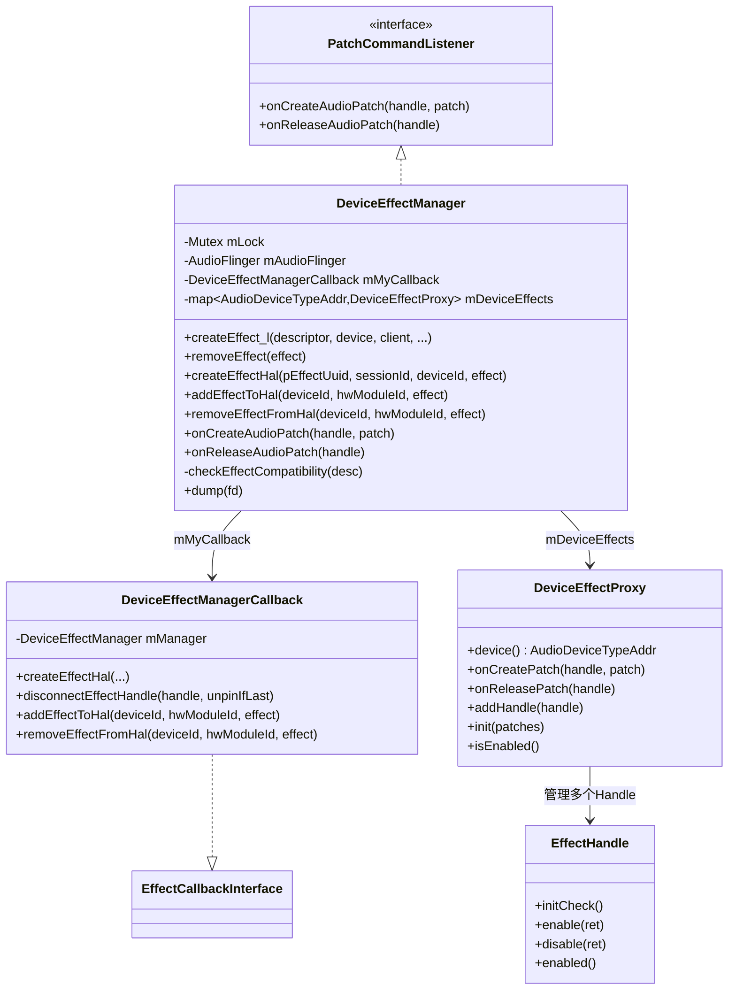
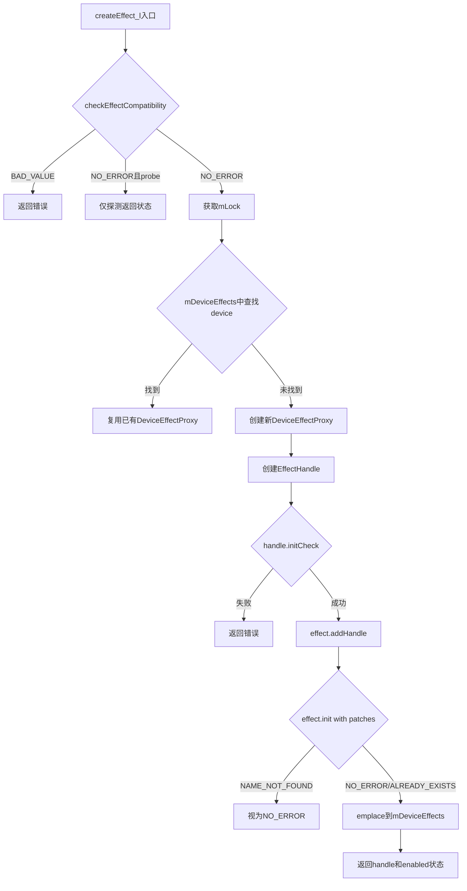
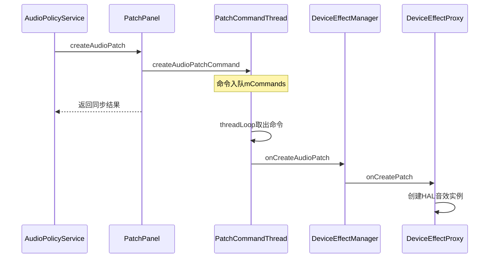

[← 5.11 AudioMixer与Resampler](05_5.11_AudioMixer与Resampler-混音引擎核心.md) | [← 返回AudioFlinger](README.md) | [返回导航](../README.md) | [5.13 MelReporter →](05_5.13_MelReporter-MEL声暴露报告.md)

## 5.12 DeviceEffectManager - 设备级音效管理

## 1. 概述

`DeviceEffectManager`是AudioFlinger中负责**设备级音效（Device Effect）**管理的组件。与传统的Track级音效或Session级音效不同，设备级音效绑定在特定音频输出设备上，对该设备上的所有音频流生效。典型应用场景包括：

- 扬声器保护（Speaker Protection）
- 设备级均衡器（Device Equalizer）
- 硬件后处理音效（HW Post-Processing）

源码位置：
- [`DeviceEffectManager.h`](frameworks/av/services/audioflinger/DeviceEffectManager.h)
- [`DeviceEffectManager.cpp`](frameworks/av/services/audioflinger/DeviceEffectManager.cpp) (207行)

## 2. 类继承与关系

`DeviceEffectManager`继承自`PatchCommandThread::PatchCommandListener`，监听AudioPatch的创建和释放事件，以便在设备连接/断开时动态管理音效实例。



## 3. 核心数据结构

### 3.1 mDeviceEffects映射

```cpp
std::map<AudioDeviceTypeAddr, sp<DeviceEffectProxy>> mDeviceEffects;
```

- **Key**：`AudioDeviceTypeAddr`，封装设备类型（如`AUDIO_DEVICE_OUT_SPEAKER`）和设备地址
- **Value**：`DeviceEffectProxy`，该设备上挂载的音效代理对象
- 一个设备可以有一个`DeviceEffectProxy`，但Proxy内部可以管理多个`EffectHandle`

### 3.2 DeviceEffectManagerCallback

`DeviceEffectManagerCallback`实现了`EffectCallbackInterface`接口，作为DeviceEffectProxy与AudioFlinger之间的桥梁。关键特性：

- [`io()`](frameworks/av/services/audioflinger/DeviceEffectManager.h:69) 返回`AUDIO_IO_HANDLE_NONE`（设备级音效不关联特定线程）
- [`isOutput()`](frameworks/av/services/audioflinger/DeviceEffectManager.h:70) 返回`false`
- [`sampleRate()`](frameworks/av/services/audioflinger/DeviceEffectManager.h:76) 返回`0`
- 这些零值/假值反映了设备级音效的特殊性：不绑定到具体的播放线程

## 4. 音效创建流程

### 4.1 createEffect_l详解

[`createEffect_l()`](frameworks/av/services/audioflinger/DeviceEffectManager.cpp:44) 必须在持有`AudioFlinger::mLock`的情况下调用，完整流程如下：



### 4.2 音效兼容性检查

[`checkEffectCompatibility()`](frameworks/av/services/audioflinger/DeviceEffectManager.cpp:107) 对设备级音效施加严格限制：

1. **HAL版本要求**：Audio HAL版本必须 >= 6.0（HIDL）
   ```cpp
   static const AudioHalVersionInfo sMinDeviceEffectHalVersion =
           AudioHalVersionInfo(AudioHalVersionInfo::Type::HIDL, 6, 0);
   ```

2. **音效类型限制**：仅允许`EFFECT_FLAG_TYPE_PRE_PROC`（预处理）或`EFFECT_FLAG_TYPE_POST_PROC`（后处理）类型的音效
   ```cpp
   if (((desc->flags & EFFECT_FLAG_TYPE_MASK) != EFFECT_FLAG_TYPE_PRE_PROC
           && (desc->flags & EFFECT_FLAG_TYPE_MASK) != EFFECT_FLAG_TYPE_POST_PROC)
           || halVersion < sMinDeviceEffectHalVersion)
   ```

这意味着AEC（回声消除）、NS（噪声抑制）等预处理音效，以及扬声器保护等后处理音效可以绑定到设备，而均衡器、重低音等插入式音效（INSERT）不被允许。

## 5. Patch生命周期回调

### 5.1 onCreateAudioPatch

当AudioPatch创建时，[`onCreateAudioPatch()`](frameworks/av/services/audioflinger/DeviceEffectManager.cpp:28) 遍历所有已注册的设备音效，通知它们新的Patch：

```cpp
void DeviceEffectManager::onCreateAudioPatch(audio_patch_handle_t handle,
        const PatchPanel::Patch& patch) {
    Mutex::Autolock _l(mLock);
    for (auto& effect : mDeviceEffects) {
        status_t status = effect.second->onCreatePatch(handle, patch);
    }
}
```

`DeviceEffectProxy::onCreatePatch()`会检查新Patch的sink设备是否与自己匹配，如果匹配则创建实际的HAL音效实例并将其添加到HAL处理链中。

### 5.2 onReleaseAudioPatch

当AudioPatch释放时，[`onReleaseAudioPatch()`](frameworks/av/services/audioflinger/DeviceEffectManager.cpp:39) 通知所有设备音效释放关联的HAL音效实例：

```cpp
void DeviceEffectManager::onReleaseAudioPatch(audio_patch_handle_t handle) {
    Mutex::Autolock _l(mLock);
    for (auto& effect : mDeviceEffects) {
        effect.second->onReleasePatch(handle);
    }
}
```

## 6. 音效移除流程

[`removeEffect()`](frameworks/av/services/audioflinger/DeviceEffectManager.cpp:163) 从`mDeviceEffects`映射中移除指定设备的音效代理：

```cpp
size_t DeviceEffectManager::removeEffect(const sp<DeviceEffectProxy>& effect) {
    Mutex::Autolock _l(mLock);
    mDeviceEffects.erase(effect->device());
    return mDeviceEffects.size();
}
```

### 6.1 disconnectEffectHandle

[`disconnectEffectHandle()`](frameworks/av/services/audioflinger/DeviceEffectManager.cpp:172) 是`DeviceEffectManagerCallback`的实现，处理EffectHandle断开连接：

1. 从`EffectHandle`获取`EffectBase`弱引用
2. 尝试转换为`DeviceEffectProxy`
3. 调用`effect->removeHandle(handle)`移除Handle
4. 如果是最后一个Handle且未被pinned（或unpinIfLast=true），则从Manager中移除整个Proxy
5. 如果断开的Handle处于enabled状态，通知音效框架更新suspended状态

## 7. HAL音效创建

[`createEffectHal()`](frameworks/av/services/audioflinger/DeviceEffectManager.cpp:130) 通过`EffectsFactoryHalInterface`创建实际的HAL音效实例：

```cpp
status_t DeviceEffectManager::createEffectHal(
        const effect_uuid_t *pEffectUuid, int32_t sessionId, int32_t deviceId,
        sp<EffectHalInterface> *effect) {
    const sp<EffectsFactoryHalInterface> effectsFactory =
            audioflinger::EffectConfiguration::getEffectsFactoryHal();
    if (effectsFactory != 0) {
        status = effectsFactory->createEffect(
                pEffectUuid, sessionId, AUDIO_IO_HANDLE_NONE, deviceId, effect);
    }
    return status;
}
```

注意`AUDIO_IO_HANDLE_NONE`参数——设备级音效不关联到特定I/O线程，这与Track级音效通过`ioHandle`绑定到PlaybackThread的方式不同。

## 8. 锁机制与线程安全

### 8.1 锁层次

```
AudioFlinger::mLock → DeviceEffectManager::mLock
```

- `createEffect_l()` 要求调用者已持有`AudioFlinger::mLock`
- `onCreateAudioPatch()` / `onReleaseAudioPatch()` 由`PatchCommandThread`调用，自行获取`DeviceEffectManager::mLock`
- `removeEffect()` 自行获取`DeviceEffectManager::mLock`

### 8.2 PatchCommandThread解耦

设备级音效的Patch回调通过`PatchCommandThread`异步执行，而非在`PatchPanel`的同步调用路径中。这解决了以下互锁问题：

- `PatchPanel::createAudioPatch()`在AudioPolicyService持有锁时被调用
- 设备级音效管理可能需要回调AudioPolicyService查询音效策略
- 如果在同一线程中同步执行，会导致死锁



## 9. onFirstRef注册

[`onFirstRef()`](frameworks/av/services/audioflinger/DeviceEffectManager.h:30) 在对象首次被引用时将自身注册为`PatchCommandThread`的监听器：

```cpp
void onFirstRef() override {
    mAudioFlinger.mPatchCommandThread->addListener(this);
}
```

这确保了DeviceEffectManager能够接收所有后续的Patch创建/释放事件。

## 10. dump调试

[`dump()`](frameworks/av/services/audioflinger/DeviceEffectManager.cpp:142) 输出所有设备音效的状态信息，使用`dumpTryLock`避免死锁：

```
Device Effects:
  Effect for device AUDIO_DEVICE_OUT_SPEAKER address :
    [DeviceEffectProxy details...]
  Effect for device AUDIO_DEVICE_OUT_BLUETOOTH_A2DP address XX:XX:XX:XX:XX:XX:
    [DeviceEffectProxy details...]
```

## 11. 与其他组件的协作

| 组件 | 交互方式 | 说明 |
|------|---------|------|
| PatchCommandThread | PatchCommandListener | 异步接收Patch创建/释放事件 |
| PatchPanel | 间接（通过PCT） | Patch的创建触发设备音效的HAL实例创建 |
| DeviceEffectProxy | 直接管理 | 一个设备对应一个Proxy |
| EffectHandle | Proxy内管理 | 多个Client可共享同一个Proxy |
| EffectsFactoryHal | createEffectHal | 创建底层HAL音效实例 |
| AudioFlinger | addEffectToHal/removeEffectFromHal | 代理到AudioFlinger的HAL操作 |

## 12. 总结

`DeviceEffectManager`的核心设计要点：

1. **设备级作用域**：音效绑定到设备而非Track/Session，对该设备上所有音频流生效
2. **HAL版本门控**：要求Audio HAL >= 6.0且音效类型为PRE_PROC/POST_PROC
3. **异步Patch回调**：通过PatchCommandThread避免与AudioPolicyService的互锁
4. **Proxy代理模式**：DeviceEffectProxy封装多个EffectHandle，在Patch激活时才创建HAL实例
5. **生命周期与AudioFlinger一致**：DeviceEffectManager内嵌于AudioFlinger，生命周期相同