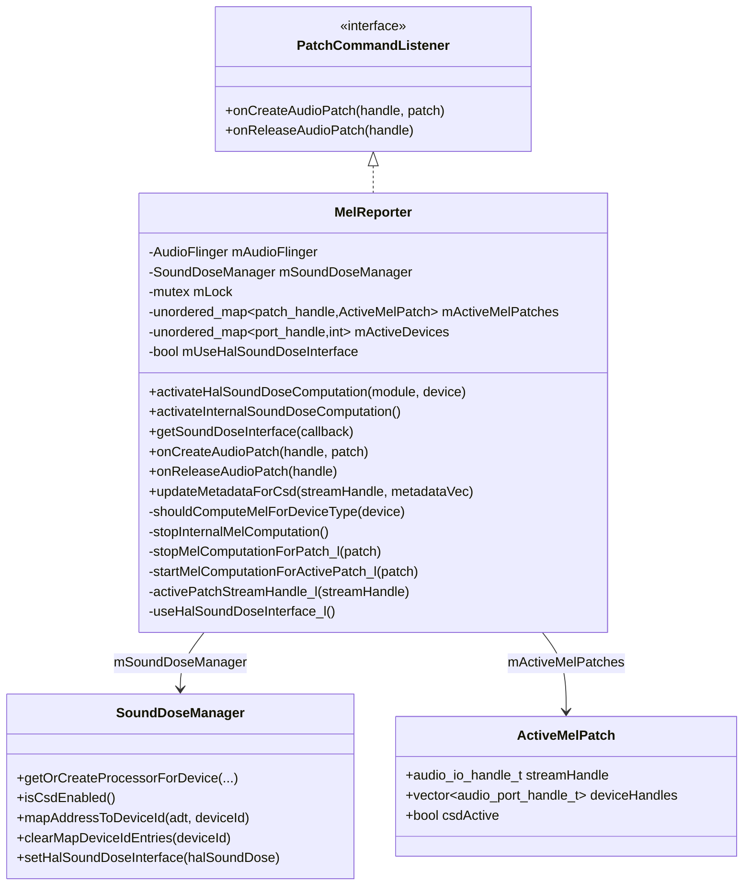
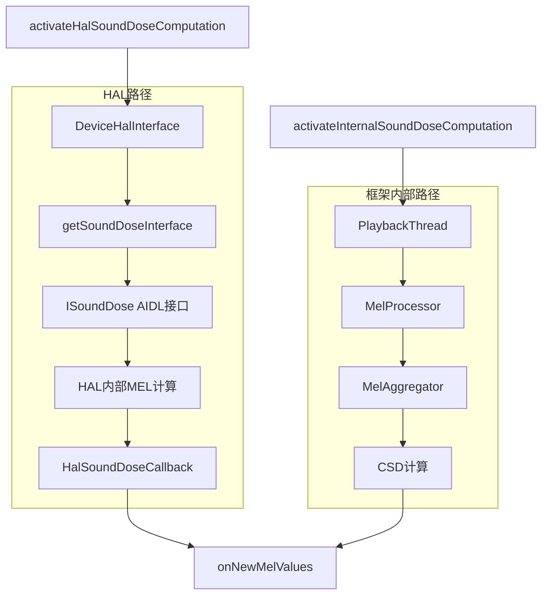
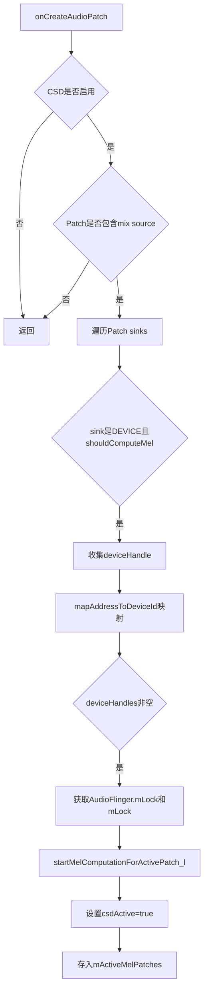
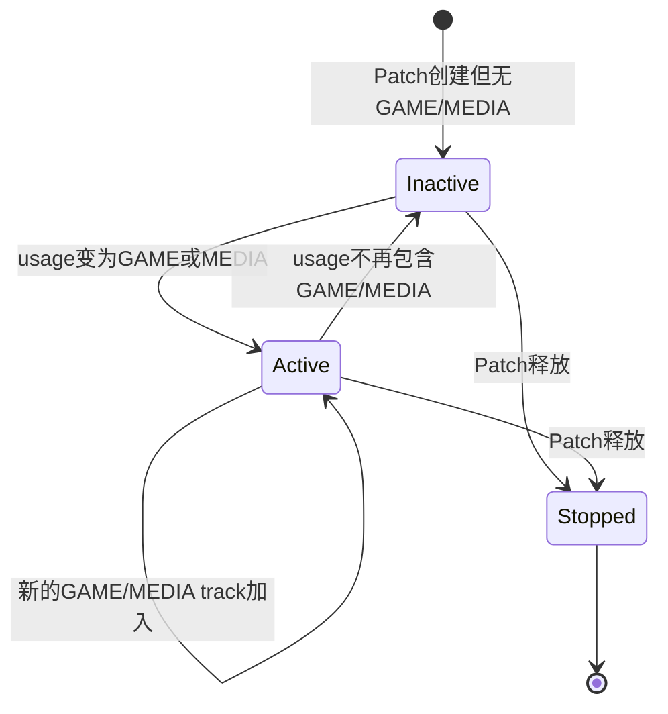
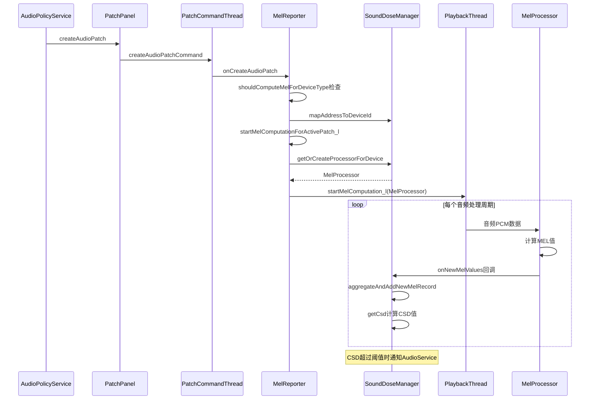

[← 5.12 DeviceEffectManager](05_5.12_DeviceEffectManager-设备级音效管理.md) | [← 返回AudioFlinger](README.md) | [返回导航](../README.md) | [5.14 SoundDoseManager →](05_5.14_SoundDoseManager-CSD声剂量管理.md)

## 5.13 MelReporter - MEL声暴露报告

## 1. 概述

`MelReporter`是AudioFlinger中负责**MEL（Maximum Exposure Level，最大暴露级）声暴露报告**的组件。它监控音频输出设备的声压级，计算CSD（Computed Sound Dose，计算声剂量），当声暴露超过安全阈值时通知上层应用。这是Android 14为满足IEC 62368-1第三版和EN 50332-3标准而引入的听力保护机制。

源码位置：
- [`MelReporter.h`](frameworks/av/services/audioflinger/MelReporter.h)
- [`MelReporter.cpp`](frameworks/av/services/audioflinger/MelReporter.cpp) (297行)

## 2. 类继承与关系



## 3. ActiveMelPatch数据结构

[`ActiveMelPatch`](frameworks/av/services/audioflinger/MelReporter.h:80) 是MelReporter的核心跟踪单元：

```cpp
struct ActiveMelPatch {
    audio_io_handle_t streamHandle{AUDIO_IO_HANDLE_NONE};  // 输出线程句柄
    std::vector<audio_port_handle_t> deviceHandles;         // 关联的设备端口ID列表
    bool csdActive;                                         // CSD是否激活
};
```

- `streamHandle`：关联的PlaybackThread的I/O句柄
- `deviceHandles`：该Patch涉及的音频输出设备端口ID列表（如耳机、USB等）
- `csdActive`：标记当前Patch是否正在进行CSD计算，由usage决定

## 4. MEL计算双路径架构

MelReporter支持两种MEL计算路径：



### 4.1 HAL路径

[`activateHalSoundDoseComputation()`](frameworks/av/services/audioflinger/MelReporter.cpp:28) 尝试从HAL获取`ISoundDose`接口：

1. 首先检查`mSoundDoseManager->forceUseFrameworkMel()`，如果强制使用框架MEL则切换到内部路径
2. 通过`device->getSoundDoseInterface(module, &soundDoseBinder)`获取AIDL Binder
3. 将Binder转换为`ISoundDose`接口并注册到`SoundDoseManager`
4. 如果任何步骤失败，回退到内部MEL计算

HAL路径的优势：MEL计算由认证的HAL实现完成，满足IEC 62368-1第三版认证要求。

### 4.2 框架内部路径

[`activateInternalSoundDoseComputation()`](frameworks/av/services/audioflinger/MelReporter.cpp:59) 使用框架内部的MEL计算：

```cpp
void MelReporter::activateInternalSoundDoseComputation() {
    std::lock_guard _l(mLock);
    if (!mUseHalSoundDoseInterface) {
        return;  // 已经在使用内部MEL
    }
    mUseHalSoundDoseInterface = false;
    mSoundDoseManager->setHalSoundDoseInterface(nullptr);
}
```

**注意**：框架内部MEL计算**不能**保证通过IEC 62368-1第三版或EN 50332-3认证，仅作为HAL不支持时的回退方案。

## 5. 设备类型过滤

[`shouldComputeMelForDeviceType()`](frameworks/av/services/audioflinger/MelReporter.cpp:79) 判断哪些设备需要MEL计算：

```cpp
bool MelReporter::shouldComputeMelForDeviceType(audio_devices_t device) {
    if (!mSoundDoseManager->isCsdEnabled()) return false;
    if (mSoundDoseManager->forceComputeCsdOnAllDevices()) return true;

    switch (device) {
        case AUDIO_DEVICE_OUT_WIRED_HEADSET:
        case AUDIO_DEVICE_OUT_WIRED_HEADPHONE:
        case AUDIO_DEVICE_OUT_BLUETOOTH_A2DP_HEADPHONES:
        case AUDIO_DEVICE_OUT_USB_HEADSET:
        case AUDIO_DEVICE_OUT_BLE_HEADSET:
        case AUDIO_DEVICE_OUT_BLE_BROADCAST:
            return true;
        default:
            return false;
    }
}
```

关键设计：
- 仅对**近距离耳机类设备**计算MEL（有线耳机、蓝牙耳机、USB耳机、BLE耳机）
- 扬声器等远距离设备不在计算范围内
- `forceComputeCsdOnAllDevices()`可覆盖此过滤，用于测试目的
- A2DP目前被排除（TODO: b/278265907，无法区分A2DP耳机和音箱）

## 6. Patch生命周期与CSD激活

### 6.1 onCreateAudioPatch

[`onCreateAudioPatch()`](frameworks/av/services/audioflinger/MelReporter.cpp:126) 在AudioPatch创建时触发：



### 6.2 startMelComputationForActivePatch_l

[`startMelComputationForActivePatch_l()`](frameworks/av/services/audioflinger/MelReporter.cpp:157) 启动MEL计算：

```cpp
void MelReporter::startMelComputationForActivePatch_l(const ActiveMelPatch& patch) {
    auto outputThread = mAudioFlinger.checkOutputThread_l(patch.streamHandle);
    for (const auto& deviceHandle : patch.deviceHandles) {
        ++mActiveDevices[deviceHandle];  // 引用计数
        if (outputThread != nullptr && !useHalSoundDoseInterface_l()) {
            outputThread->startMelComputation_l(
                mSoundDoseManager->getOrCreateProcessorForDevice(
                    deviceHandle, patch.streamHandle,
                    outputThread->mSampleRate,
                    outputThread->mChannelCount,
                    outputThread->mFormat));
        }
    }
}
```

核心逻辑：
1. 通过`checkOutputThread_l()`找到对应的PlaybackThread
2. 维护`mActiveDevices`引用计数（同一设备可能被多个流使用）
3. 如果使用框架内部MEL，创建`MelProcessor`并注入到PlaybackThread
4. PlaybackThread在每个音频处理周期将数据送入MelProcessor

### 6.3 onReleaseAudioPatch

[`onReleaseAudioPatch()`](frameworks/av/services/audioflinger/MelReporter.cpp:185) 在AudioPatch释放时：

1. 从`mActiveMelPatches`中查找并移除对应Patch
2. 调用`stopMelComputationForPatch_l()`停止MEL计算
3. 递减`mActiveDevices`引用计数
4. 当引用计数归零时，清理设备映射

## 7. updateMetadataForCsd动态CSD控制

[`updateMetadataForCsd()`](frameworks/av/services/audioflinger/MelReporter.cpp:96) 是一个关键方法，根据音频流的Usage动态启用/禁用CSD：

```cpp
void MelReporter::updateMetadataForCsd(audio_io_handle_t streamHandle,
        const std::vector<playback_track_metadata_v7_t>& metadataVec) {
    bool shouldActivateCsd = false;
    for (const auto& metadata : metadataVec) {
        if (metadata.base.usage == AUDIO_USAGE_GAME 
            || metadata.base.usage == AUDIO_USAGE_MEDIA) {
            shouldActivateCsd = true;
        }
    }
    // ... 根据shouldActivateCsd与当前csdActive状态决定启停
}
```

**设计原理**：只有`AUDIO_USAGE_GAME`（游戏）和`AUDIO_USAGE_MEDIA`（媒体播放）的音频流才会触发CSD计算。其他Usage如`AUDIO_USAGE_VOICE_COMMUNICATION`（通话）、`AUDIO_USAGE_NOTIFICATION`（通知）不需要CSD保护，因为它们的持续时间短或音量有限。



## 8. 锁机制与线程安全

### 8.1 锁层次

```
AudioFlinger::mLock → PatchCommandThread::mLock → MelReporter::mLock
```

`onCreateAudioPatch()`中的锁获取顺序：
```cpp
std::lock_guard _afl(mAudioFlinger.mLock);  // 第二锁
std::lock_guard _l(mLock);                   // 第三锁
```

`onReleaseAudioPatch()`中：
```cpp
// 先获取mLock获取melPatch
{ std::lock_guard _l(mLock); melPatch = ...; }
// 再按正确顺序获取双锁
std::lock_guard _afl(mAudioFlinger.mLock);
std::lock_guard _l(mLock);
```

### 8.2 kMaxTimestampDeltaInSec

```cpp
constexpr static int kMaxTimestampDeltaInSec = 120;
```

定义了时间戳最大允许偏差为120秒，用于验证MEL记录的时间戳有效性。

## 9. useHalSoundDoseInterface_l判断

[`useHalSoundDoseInterface_l()`](frameworks/av/services/audioflinger/MelReporter.cpp:275) 使用位与运算判断是否使用HAL接口：

```cpp
bool MelReporter::useHalSoundDoseInterface_l() {
    return !mSoundDoseManager->forceUseFrameworkMel() & mUseHalSoundDoseInterface;
}
```

注意这里使用的是位与`&`而非逻辑与`&&`，等价于`(!forceUseFrameworkMel()) & mUseHalSoundDoseInterface`。两个条件都为true时才使用HAL接口。

## 10. getSoundDoseInterface

[`getSoundDoseInterface()`](frameworks/av/services/audioflinger/MelReporter.cpp:212) 向外部（如AudioService）提供`ISoundDose` Binder接口：

```cpp
sp<media::ISoundDose> MelReporter::getSoundDoseInterface(
        const sp<media::ISoundDoseCallback>& callback) {
    return mSoundDoseManager->getSoundDoseInterface(callback);
}
```

AudioService通过此接口注册`ISoundDoseCallback`，接收CSD超标通知。

## 11. dump调试

[`dump()`](frameworks/av/services/audioflinger/MelReporter.cpp:281) 输出声剂量状态：

```cpp
std::string MelReporter::dump() {
    std::lock_guard _l(mLock);
    std::string output("\nSound Dose:\n");
    output.append(mSoundDoseManager->dump());
    return output;
}
```

输出包含当前CSD值、MEL记录详情等，可通过`dumpsys media.audio_flinger`查看。

## 12. 完整时序：从Patch创建到CSD激活



## 13. 总结

`MelReporter`的核心设计要点：

1. **双路径MEL计算**：优先使用HAL ISoundDose接口（可认证），回退到框架内部MelProcessor
2. **设备类型过滤**：仅对耳机类近距离设备计算MEL，避免扬声器等远场设备误触发
3. **Usage驱动CSD**：只有GAME/MEDIA usage的音频流才触发CSD，通话和通知不在保护范围
4. **引用计数管理**：`mActiveDevices`跟踪同一设备被多少流使用，引用归零时清理
5. **异步Patch回调**：通过PatchCommandThread避免锁互锁问题
6. **动态启停**：`updateMetadataForCsd()`根据Usage变化动态启停CSD，避免不必要计算开销