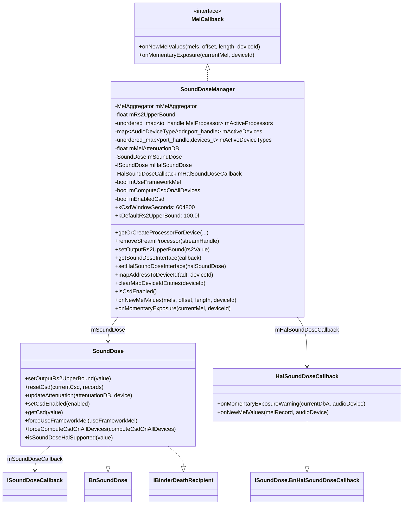
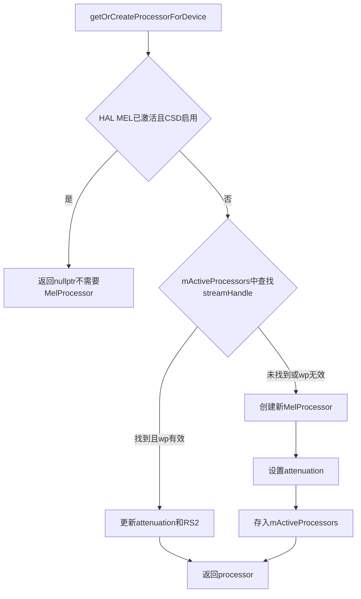
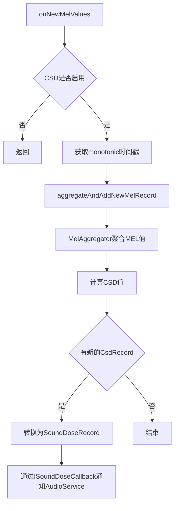
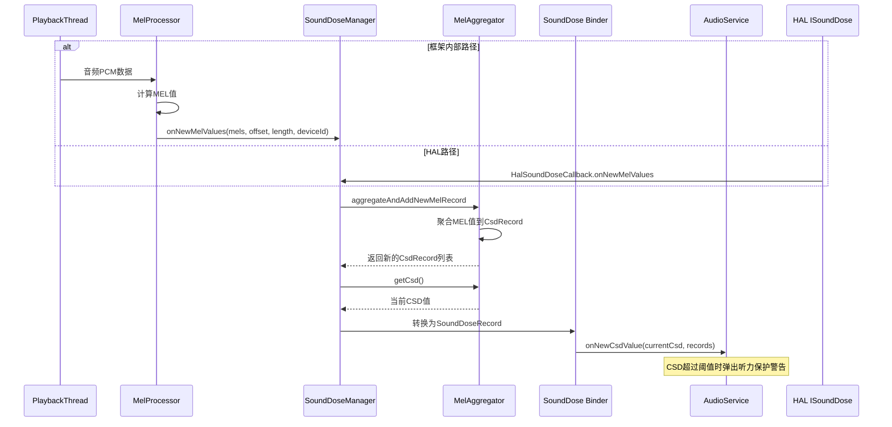

[← 5.13 MelReporter](05_5.13_MelReporter-MEL声暴露报告.md) | [← 返回AudioFlinger](README.md) | [返回导航](../README.md) | [5.15 PatchCommandThread →](05_5.15_PatchCommandThread-Patch异步命令线程.md)

## 5.14 SoundDoseManager - CSD声剂量管理

## 1. 概述

`SoundDoseManager`是AudioFlinger中CSD（Computed Sound Dose，计算声剂量）管理的核心组件。它实现了`MelProcessor::MelCallback`接口，负责聚合MEL值、计算CSD、管理RS2阈值，并通过Binder服务向AudioService提供声剂量查询和控制接口。该组件是Android 14听力保护系统的核心，遵循IEC 62368-1第三版和EN 50332-3标准。

源码位置：
- [`SoundDoseManager.h`](frameworks/av/services/audioflinger/sounddose/SoundDoseManager.h)
- [`SoundDoseManager.cpp`](frameworks/av/services/audioflinger/sounddose/SoundDoseManager.cpp) (568行)

## 2. 类继承与架构



## 3. 核心常量与标准

### 3.1 CSD滚动窗口

```cpp
static constexpr int64_t kCsdWindowSeconds = 604800;  // 60s * 60m * 24h * 7d = 7天
```

CSD使用**7天滚动窗口**计算累积声剂量。这意味着系统只关注最近7天内的声暴露，更早的记录会被自动淘汰。

### 3.2 RS2阈值

```cpp
static constexpr float kDefaultRs2UpperBound = 100.f;  // 100 dBA
```

RS2（Risk Level 2）是瞬间声暴露警告阈值，取值范围为80-100 dBA：
- **RS1（80 dBA）**：长期暴露开始产生风险的阈值
- **RS2（80-100 dBA）**：瞬间暴露警告阈值，默认100 dBA
- 超过RS2时触发`onMomentaryExposure`回调，通知AudioService

### 3.3 相关标准

| 标准 | 内容 | SoundDoseManager对应 |
|------|------|---------------------|
| IEC 62368-1 第3版 | 音频安全要求 | CSD计算、7天窗口 |
| EN 50332-3 | 个人音乐播放器最大声压级 | RS2阈值、MEL聚合 |
| IEC 62368-1 G.4.2 | CSD计算公式 | MelAggregator实现 |

## 4. MelProcessor管理

### 4.1 getOrCreateProcessorForDevice

[`getOrCreateProcessorForDevice()`](frameworks/av/services/audioflinger/sounddose/SoundDoseManager.cpp:48) 为指定的流和设备创建或复用`MelProcessor`：



关键逻辑：
- 如果HAL提供了ISoundDose接口，框架不需要创建MelProcessor
- 使用`wp<MelProcessor>`弱引用，当PlaybackThread销毁MelProcessor时自动失效
- 复用已有MelProcessor时更新其attenuation和RS2值

### 4.2 removeStreamProcessor

[`removeStreamProcessor()`](frameworks/av/services/audioflinger/sounddose/SoundDoseManager.cpp:150) 在MEL计算停止时移除流处理器：

```cpp
void SoundDoseManager::removeStreamProcessor(audio_io_handle_t streamHandle) {
    std::lock_guard _l(mLock);
    auto callbackToRemove = mActiveProcessors.find(streamHandle);
    if (callbackToRemove != mActiveProcessors.end()) {
        mActiveProcessors.erase(callbackToRemove);
    }
}
```

## 5. HAL Sound Dose接口管理

### 5.1 setHalSoundDoseInterface

[`setHalSoundDoseInterface()`](frameworks/av/services/audioflinger/sounddose/SoundDoseManager.cpp:86) 设置HAL侧的`ISoundDose`接口：

```cpp
bool SoundDoseManager::setHalSoundDoseInterface(const std::shared_ptr<ISoundDose>& halSoundDose) {
    std::lock_guard _l(mLock);
    mHalSoundDose = halSoundDose;
    if (halSoundDose == nullptr) {
        return false;  // 切换到内部CSD
    }
    // 设置RS2值
    halSoundDose->setOutputRs2UpperBound(mRs2UpperBound);
    // 懒初始化HAL回调
    if (mHalSoundDoseCallback == nullptr) {
        mHalSoundDoseCallback = ndk::SharedRefBase::make<HalSoundDoseCallback>(this);
    }
    // 注册回调
    halSoundDose->registerSoundDoseCallback(mHalSoundDoseCallback);
    return true;
}
```

### 5.2 HalSoundDoseCallback

[`HalSoundDoseCallback`](frameworks/av/services/audioflinger/sounddose/SoundDoseManager.h:133) 接收HAL侧的MEL通知，转发给SoundDoseManager：

- **onMomentaryExposureWarning**：HAL检测到瞬间声暴露超标
  ```cpp
  ndk::ScopedAStatus onMomentaryExposureWarning(float in_currentDbA, const AudioDevice& in_audioDevice) {
      auto id = soundDoseManager->getIdForAudioDevice(in_audioDevice);
      soundDoseManager->onMomentaryExposure(in_currentDbA, id);
  }
  ```

- **onNewMelValues**：HAL报告新的MEL值
  ```cpp
  ndk::ScopedAStatus onNewMelValues(const MelRecord& in_melRecord, const AudioDevice& in_audioDevice) {
      auto id = soundDoseManager->getIdForAudioDevice(in_audioDevice);
      soundDoseManager->onNewMelValues(in_melRecord.melValues, 0, in_melRecord.melValues.size(), id);
  }
  ```

两个回调都需要将AIDL `AudioDevice`转换为`audio_port_handle_t`，使用`getIdForAudioDevice()`进行映射查找。

## 6. CSD计算流程

### 6.1 onNewMelValues回调

[`onNewMelValues()`](frameworks/av/services/audioflinger/sounddose/SoundDoseManager.cpp:386) 是CSD计算的核心入口，无论是框架内部MelProcessor还是HAL都通过此路径：



关键代码：
```cpp
void SoundDoseManager::onNewMelValues(const std::vector<float>& mels, size_t offset, 
                                       size_t length, audio_port_handle_t deviceId) const {
    int64_t timestampSec = getMonotonicSecond();
    records = mMelAggregator->aggregateAndAddNewMelRecord(
        audio_utils::MelRecord(deviceId, 
            std::vector<float>(mels.begin() + offset, mels.begin() + offset + length),
            timestampSec - length));
    currentCsd = mMelAggregator->getCsd();
    
    if (records.size() > 0 && soundDoseCallback != nullptr) {
        soundDoseCallback->onNewCsdValue(currentCsd, newRecordsToReport);
    }
}
```

### 6.2 onMomentaryExposure回调

[`onMomentaryExposure()`](frameworks/av/services/audioflinger/sounddose/SoundDoseManager.cpp:416) 在瞬间声暴露超过RS2阈值时触发：

```cpp
void SoundDoseManager::onMomentaryExposure(float currentMel, audio_port_handle_t deviceId) const {
    if (!mEnabledCsd) return;
    auto soundDoseCallback = getSoundDoseCallback();
    if (soundDoseCallback != nullptr) {
        soundDoseCallback->onMomentaryExposure(currentMel, deviceId);
    }
}
```

## 7. 设备映射管理

### 7.1 mapAddressToDeviceId

[`mapAddressToDeviceId()`](frameworks/av/services/audioflinger/sounddose/SoundDoseManager.cpp:153) 建立设备地址到端口ID的双向映射：

```cpp
void SoundDoseManager::mapAddressToDeviceId(const AudioDeviceTypeAddr& adt,
                                            const audio_port_handle_t deviceId) {
    std::lock_guard _l(mLock);
    mActiveDevices[adt] = deviceId;        // 地址 → 端口ID
    mActiveDeviceTypes[deviceId] = adt.mType;  // 端口ID → 设备类型
}
```

### 7.2 clearMapDeviceIdEntries

[`clearMapDeviceIdEntries()`](frameworks/av/services/audioflinger/sounddose/SoundDoseManager.cpp:161) 在Patch释放时清理映射：

```cpp
void SoundDoseManager::clearMapDeviceIdEntries(audio_port_handle_t deviceId) {
    std::lock_guard _l(mLock);
    // 从mActiveDevices中删除所有value==deviceId的条目
    for (auto it = mActiveDevices.begin(); it != mActiveDevices.end();) {
        if (it->second == deviceId) {
            it = mActiveDevices.erase(it);
        } else { ++it; }
    }
    mActiveDeviceTypes.erase(deviceId);
}
```

## 8. SoundDose Binder服务

[`SoundDose`](frameworks/av/services/audioflinger/sounddose/SoundDoseManager.h:108) 是暴露给AudioService的Binder服务，实现`BnSoundDose`接口：

### 8.1 关键方法

| 方法 | 说明 |
|------|------|
| `setOutputRs2UpperBound(float)` | 设置RS2上限阈值（80-100 dBA） |
| `resetCsd(float, vector<SoundDoseRecord>)` | 重置CSD值和历史记录 |
| `updateAttenuation(float, int)` | 更新设备衰减值 |
| `setCsdEnabled(bool)` | 启用/禁用CSD计算 |
| `getCsd(float*)` | 获取当前CSD值 |
| `forceUseFrameworkMel(bool)` | 强制使用框架MEL计算 |
| `forceComputeCsdOnAllDevices(bool)` | 强制对所有设备计算CSD |
| `isSoundDoseHalSupported(bool*)` | 查询HAL是否支持SoundDose |

### 8.2 Binder死亡通知

`SoundDose`同时继承`IBinder::DeathRecipient`，当AudioService进程死亡时重置SoundDose：

```cpp
void SoundDoseManager::SoundDose::binderDied(const wp<IBinder>& who) {
    auto soundDoseManager = mSoundDoseManager.promote();
    if (soundDoseManager != nullptr) {
        soundDoseManager->resetSoundDose();
    }
}
```

## 9. 衰减值管理

[`updateAttenuation()`](frameworks/av/services/audioflinger/sounddose/SoundDoseManager.cpp:338) 为特定设备类型设置衰减值：

```cpp
void SoundDoseManager::updateAttenuation(float attenuationDB, audio_devices_t deviceType) {
    std::lock_guard _l(mLock);
    mMelAttenuationDB[deviceType] = attenuationDB;
    for (const auto& mp : mActiveProcessors) {
        auto melProcessor = mp.second.promote();
        if (melProcessor != nullptr) {
            auto deviceId = melProcessor->getDeviceId();
            if (mActiveDeviceTypes[deviceId] == deviceType) {
                melProcessor->setAttenuation(attenuationDB);
            }
        }
    }
}
```

衰减值用于调整MEL计算，例如当设备有硬件音量限制时，实际输出的声压级可能低于软件计算的值，需要通过衰减进行校正。

## 10. CSD启停控制

### 10.1 setCsdEnabled

[`setCsdEnabled()`](frameworks/av/services/audioflinger/sounddose/SoundDoseManager.cpp:362) 控制CSD计算的全局开关：

```cpp
void SoundDoseManager::setCsdEnabled(bool enabled) {
    std::lock_guard _l(mLock);
    mEnabledCsd = enabled;
    for (auto& activeEntry : mActiveProcessors) {
        auto melProcessor = activeEntry.second.promote();
        if (melProcessor != nullptr) {
            if (enabled) {
                melProcessor->resume();
            } else {
                melProcessor->pause();
            }
        }
    }
}
```

### 10.2 forceUseFrameworkMel

[`setUseFrameworkMel()`](frameworks/av/services/audioflinger/sounddose/SoundDoseManager.cpp:377) 强制使用框架MEL计算：

```cpp
void SoundDoseManager::setUseFrameworkMel(bool useFrameworkMel) {
    setHalSoundDoseInterface(nullptr);  // 先断开HAL接口
    std::lock_guard _l(mLock);
    mUseFrameworkMel = useFrameworkMel;
}
```

## 11. resetCsd与历史记录

[`resetCsd()`](frameworks/av/services/audioflinger/sounddose/SoundDoseManager.cpp:428) 重置CSD值，用于系统时间变更或设备重置场景：

```cpp
void SoundDoseManager::resetCsd(float currentCsd,
                                const std::vector<media::SoundDoseRecord>& records) {
    std::lock_guard lock(mLock);
    std::vector<audio_utils::CsdRecord> resetRecords;
    for (const auto& record : records) {
        resetRecords.emplace_back(record.timestamp, record.duration, record.value, record.averageMel);
    }
    mMelAggregator->reset(currentCsd, resetRecords);
}
```

`SoundDoseRecord`与`CsdRecord`的转换通过[`csdRecordToSoundDoseRecord()`](frameworks/av/services/audioflinger/sounddose/SoundDoseManager.cpp:446) 完成。

## 12. dump输出

[`dump()`](frameworks/av/services/audioflinger/sounddose/SoundDoseManager.cpp:460) 输出CSD和MEL记录的详细状态：

```
Sound Dose:
CSD 0.123456 with average MEL 85.3 in interval [1689012345, 1689012405]
CSD 0.234567 with average MEL 92.1 in interval [1689012405, 1689012465]

Cached Mel Records:
Continuous MELs for portId=42, starting at timestamp 1689012345: 85.30 87.20 90.10 ...
```

## 13. 数据流全景



## 14. 总结

`SoundDoseManager`的核心设计要点：

1. **双源MEL数据**：同时支持框架内部MelProcessor和HAL ISoundDose两种MEL数据来源
2. **MelAggregator聚合**：线程安全的MEL聚合器，7天滚动窗口CSD计算
3. **RS2阈值控制**：80-100 dBA可调的瞬间暴露警告阈值
4. **设备映射**：AudioDeviceTypeAddr ↔ audio_port_handle_t双向映射
5. **衰减校正**：支持按设备类型设置衰减值，校准实际输出声压
6. **Binder服务**：通过SoundDose BnSoundDose向AudioService暴露控制接口
7. **死亡监听**：AudioService崩溃时自动重置SoundDose状态
8. **懒初始化**：HalSoundDoseCallback在首次需要时才创建